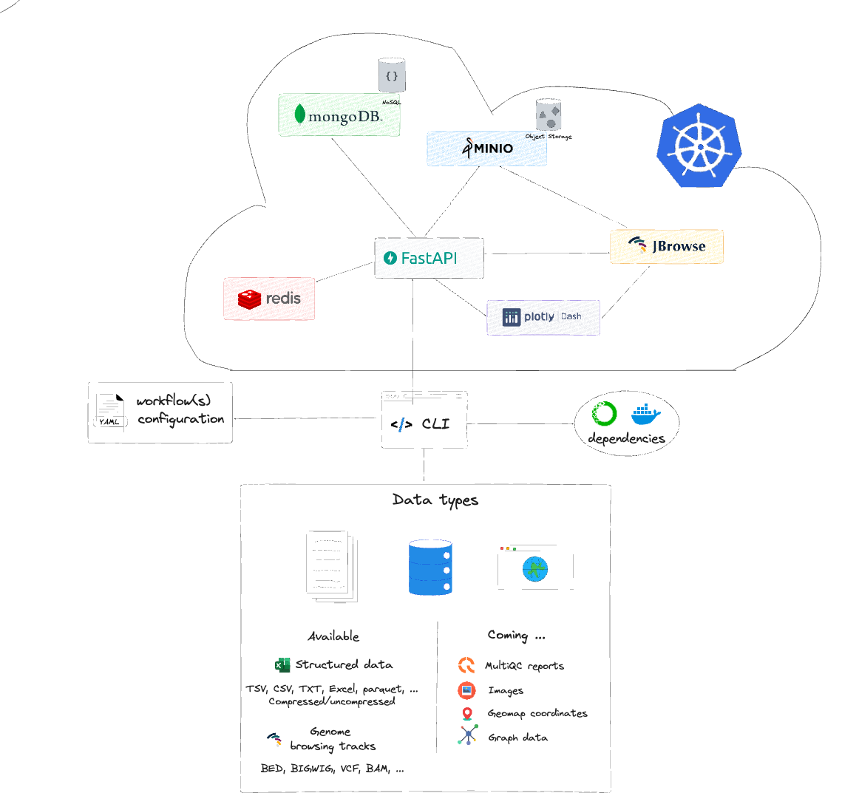

# Architecture

Depictio architecture is currently composed of two main aspects: a microservices architecture (to be executed into a docker-compose and late on in a kubernetes cluster) and a CLI client to be installed locally on-premise where the data to be scanned is located. 
There are currently 6 main microservices running:

1. FastAPI instance

2. mongoDB **database**

3. redis cache system

4. JBrowse on-premise genome browser

5. MinIO S3 bucket management instance

6. Plotly Dash server

# Plotly Dash server

