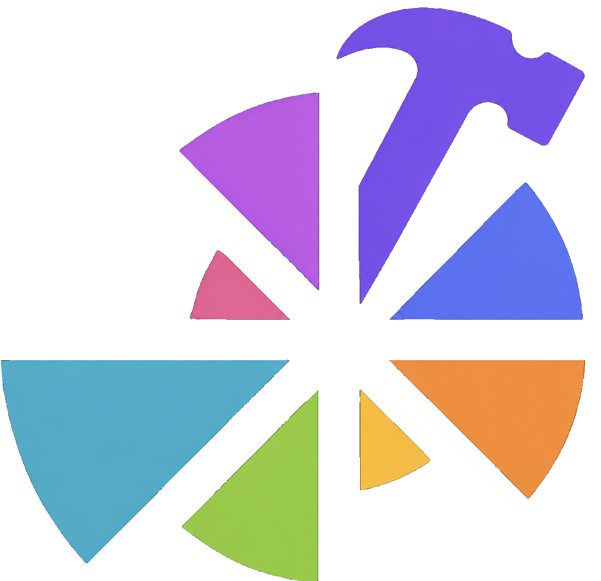

  
  <h1 class="catalog-hero__title" id="depictio-tools-catalog">Depictio <svg class="accent-t-svg" viewBox="636.36 451.67 572.85 651.43" aria-hidden="true"><g transform="translate(0,1561) scale(0.1,-0.1)" fill="#9870FF"><path d="M10007 11087 c156 -4 173 -12 211 -95 27 -60 79 -142 90 -142 4 0 21 -12 37 -26 104 -92 346 -135 526 -95 79 18 165 77 239 166 65 78 73 84 122 94 29 6 89 9 133 7 44 -2 199 -7 345 -11 266 -7 293 -8 330 -20 27 -9 50 -56 52 -108 2 -55 -12 -588 -17 -652 -2 -27 -7 -201 -10 -385 -9 -537 -13 -616 -29 -654 -28 -67 -25 -66 -508 -64 -392 3 -436 5 -465 21 -38 20 -48 37 -58 94 -13 78 -90 163 -199 217 -79 41 -89 43 -196 52 -148 13 -312 -55 -428 -176 -43 -44 -142 -227 -142 -261 0 -9 -10 -48 -21 -85 -12 -38 -23 -96 -25 -129 -2 -33 -6 -87 -9 -120 -3 -33 -8 -94 -10 -135 -3 -41 -7 -102 -10 -135 -2 -33 -8 -112 -11 -175 -4 -63 -8 -128 -9 -145 -1 -16 -3 -67 -4 -113 0 -46 -4 -81 -8 -79 -5 3 -8 -20 -8 -51 -1 -136 -18 -481 -30 -612 -2 -19 -4 -67 -4 -107 -1 -65 -3 -72 -18 -66 -16 6 -16 4 -5 -9 13 -16 18 -154 8 -203 -3 -11 -5 -48 -5 -83 -1 -48 -4 -61 -13 -56 -9 5 -10 4 -2 -5 13 -15 6 -234 -9 -258 -4 -6 -4 -14 1 -17 4 -2 4 -51 1 -108 -4 -57 -10 -184 -13 -283 -4 -99 -9 -200 -11 -225 -2 -25 -7 -111 -10 -192 -3 -81 -8 -156 -10 -167 -2 -11 -6 -96 -9 -188 -10 -284 -24 -557 -32 -620 -4 -28 -16 -53 -36 -73 l-29 -31 -652 3 c-463 3 -660 7 -678 15 -15 6 -37 27 -50 45 -24 33 -24 34 -24 318 0 262 11 849 20 1065 2 50 6 207 10 350 3 143 7 294 10 335 2 41 7 185 10 320 3 135 8 281 10 325 2 44 7 154 10 245 4 91 8 203 10 250 2 47 6 166 10 265 4 99 8 209 10 245 22 436 24 650 5 744 -21 101 -80 217 -142 276 -87 83 -221 139 -346 144 -66 2 -181 -7 -232 -18 -101 -22 -132 -32 -189 -57 -35 -16 -69 -29 -76 -29 -11 0 -133 -62 -265 -135 -107 -59 -285 -190 -385 -286 -143 -136 -162 -156 -230 -239 -88 -108 -102 -120 -135 -120 -36 0 -39 16 -35 138 11 263 89 562 202 772 19 36 42 79 51 95 58 113 199 296 335 436 74 77 244 230 284 256 15 10 35 23 43 30 8 6 34 27 56 45 23 18 64 45 90 61 27 15 72 41 99 58 228 142 668 321 985 401 150 38 246 60 275 63 17 2 48 8 70 13 22 6 60 12 85 15 25 3 74 10 110 16 36 5 92 13 125 16 33 3 69 8 80 10 49 11 456 31 555 28 36 -1 124 -4 197 -6z"/></g></svg>ools Catalog</h1>

**The catalog turns a bioinformatics tool's outputs into ready-made dashboard
components.** Point Depictio at a pipeline run and every output it recognises
becomes a render — no manual wiring.

:material-tools:{ .lg } **Tool**

The upstream software — `ivar`, `qiime2`, `mosdepth`, `nextclade`, `metaphlan`, `pangolin`… and any tool not yet integrated (`freebayes`, `bakta`, `gtdb-tk`, `abricate`). One **Tool** = one catalog entry.

:material-database-outline:{ .lg } **Data Collection**

A file the tool emits — recognised and reshaped into a tidy, bindable table.

:material-view-dashboard-variant:{ .lg } **Render**

A dashboard component bound to that data — figure, card, table, interactive filter, advanced viz, or MultiQC section.

Browse the catalog below: filter by component type or viz kind, preview each
render on real fixture data, and copy its **`use:`** snippet.

  

    Depictio Tools Catalog
    <button class="catalog-fs-close" type="button" onclick="toggleCatalogFullscreen(this)" title="Exit fullscreen" aria-label="Exit fullscreen">
      <svg xmlns="http://www.w3.org/2000/svg" width="16" height="16" viewBox="0 0 24 24" fill="currentColor"><path d="M19 6.41L17.59 5 12 10.59 6.41 5 5 6.41 10.59 12 5 17.59 6.41 19 12 13.41 17.59 19 19 17.59 13.41 12z"/></svg>
    </button>
  

  <button class="catalog-fs-btn" type="button" onclick="toggleCatalogFullscreen(this)" title="Toggle fullscreen" aria-label="Toggle fullscreen">
    <svg xmlns="http://www.w3.org/2000/svg" width="20" height="20" viewBox="0 0 24 24" fill="currentColor"><path d="M7 14H5v5h5v-2H7v-3zm-2-4h2V7h3V5H5v5zm12 7h-3v2h5v-5h-2v3zM14 5v2h3v3h2V5h-5z"/></svg>
  </button>
  

    <iframe src="../assets/component-catalog-light.html" title="Depictio Tools Catalog (light)" width="100%" height="1100px" frameborder="0" loading="lazy"></iframe>
  

  

    <iframe src="../assets/component-catalog-dark.html" title="Depictio Tools Catalog (dark)" width="100%" height="1100px" frameborder="0" loading="lazy"></iframe>
  

## :material-sitemap: How a render is defined

Every render follows the same path — from a raw file on disk to a live dashboard
component:

:material-file-search:{ .lg } **Detect** — `find`

Recognise which file in a run is this tool's output, by filename or path pattern.

:material-cog-transfer:{ .lg } **Reshape** — `recipe` optional

Transform the raw file into tidy, bindable columns → the **Data Collection**. Already-tidy files skip this.

:material-view-dashboard-variant:{ .lg } **Render** — `renders`

Bind those columns to a dashboard component — figure, card, table, interactive filter, advanced viz, or MultiQC section.

!!! info "Validated bindings"
    Each Data Collection's column schema lives in exactly one place (the recipe),
    and CI validates every render binding against the real reshaped columns — so a
    tool that ships green is wired correctly, with no manual review.

For the configuration reference of each component type, see the
[:material-puzzle: Dashboard Components](../features/components.md) guide.

## :material-hammer-wrench: Contribute a tool

Adding a tool is a **single-folder pull request** under `depictio/catalog/<tool>/`
— no Depictio internals to learn, and no Python unless an output needs reshaping.
Three co-located files:

:material-identifier:{ .lg } **`module.yaml`**

The tool's identity — `id`, display `name`, and a pointer to an upstream source (an nf-core module today; other catalogs later). Identity fields like homepage, bio.tools, and EDAM terms are derived from that source rather than duplicated.

:material-file-cog-outline:{ .lg } **`<output>.yaml`** one per file

**`find`** the raw file, optionally **`recipe`** it into tidy columns, and list the **`renders_as`** it offers — figure, card, table, interactive filter, advanced viz, or MultiQC section.

:material-table-check:{ .lg } **`<output>.tsv`** fixture

A small sample of that file, right beside its YAML, so `depictio catalog validate` previews and checks every render in CI before it ships.

[Read the contributing guide :material-arrow-right:](../developer/contributing-a-tool.md){ .catalog-cta }

