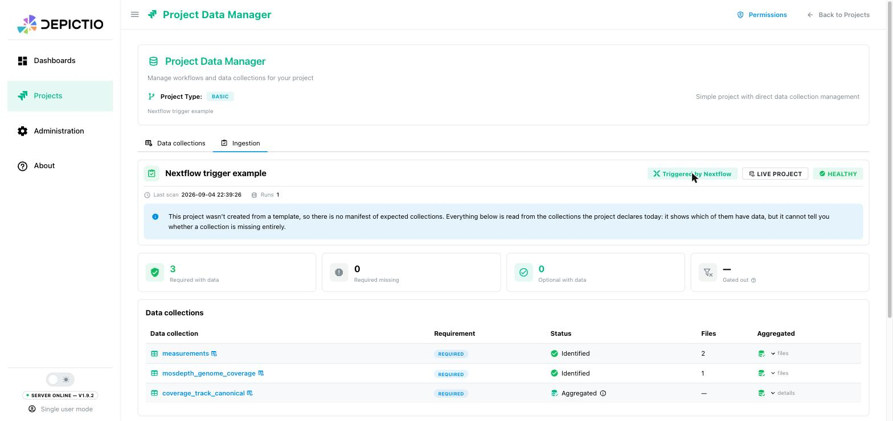
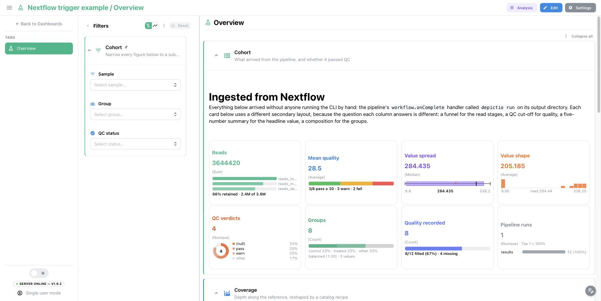

# <span style="color: #0dc09d;">:simple-nextflow:</span> Nextflow trigger <small>(v1.10.0+)</small>

A Nextflow pipeline can push its own results into Depictio the moment it
finishes. You set it up once per machine, and from then on every pipeline you run
lands in Depictio without a single line about Depictio in the pipeline itself.

Two guarantees, so you can put it on a machine and forget it. A pipeline that
failed is never ingested, because a partial output directory would make a
half-filled project. And if anything on Depictio's side goes wrong, the handler
logs a warning and leaves your pipeline's own exit status alone.

<figure markdown="span">
  [](../images/guides/nextflow-trigger/trigger-flow_light.png){target=_blank}
  [](../images/guides/nextflow-trigger/trigger-flow_dark.png){target=_blank}
  <figcaption>The mechanism is a <code>workflow.onComplete</code> handler, shipped as a config snippet inside the CLI.</figcaption>
</figure>

## Set it up once

The handler runs on the machine that runs `nextflow`, never on a compute node.
On a cluster that means the submit node, or the job that launches Nextflow. All
three steps happen there.

**1. Install the CLI.**

```bash
pip install depictio-cli
```

**2. Save your credentials to `~/.depictio/CLI.yaml`.** That is already the path
the viewer's [CLI agents page](../usage/get_started.md#create-a-cli-configuration)
tells you to use, and the one the handler falls back to, so there is nothing to
point at.

**3. Turn the trigger on, then check the CLI reaches your server.**

```bash
depictio-cli config nextflow --install
depictio-cli config check
```

`--install` copies the handler to `~/.depictio/nextflow.config` and adds one
`includeConfig` line for it to `~/.nextflow/config` (`$NXF_HOME/config` if you
set `NXF_HOME`), which Nextflow reads before every run. Your pipeline's own
`onComplete` still runs. `--uninstall` removes the line, and
`--depictio_enabled false` skips Depictio for one run. Run `--install` again
after upgrading `depictio-cli`, so the copy follows the new version.

!!! tip "One run instead of the whole machine"
    Skip step 3 and add `-c $(depictio-cli config nextflow)` to your
    `nextflow run` command. That subshell prints the path of the snippet bundled
    with the CLI, so there is still no file to download and none to keep in sync.

## Run your pipeline

Nothing changes in the command:

```bash
nextflow run nf-core/ampliseq -r 2.16.0 -profile docker --outdir results
```

When the last task finishes, the handler ingests your `--outdir`, here
`results`, and the log ends with a `[depictio]` block:

```text
[depictio] ==============================================================
[depictio] 📊 Depictio ingestion
[depictio] ==============================================================
[depictio] 📂 Data root  : /work/results
[depictio] 🔧 Executable : depictio-cli
[depictio] 💻 Command    :
[depictio]     depictio-cli run \
[depictio]         --CLI-config-path /home/alice/.depictio/CLI.yaml \
[depictio]         --data-root /work/results \
[depictio]         --triggered-by nextflow \
[depictio]         --pipeline-id nf-core/ampliseq/2.16.0
[depictio] --------------------------------------------------------------
[depictio] • ✅ Resolved pipeline 'nf-core/ampliseq/2.16.0' to a bundled template.
[depictio] …
[depictio] • 📘 Project: https://depictio.example.org/projects/6a9ab9a6a1d2ead141378e27
[depictio] • 📘 Dashboard 'nf-core/ampliseq': https://depictio.example.org/dashboard/6a9acdf3835e12072990459a
[depictio] ✅ Ingestion finished for /work/results
```

You configured no template because the pipeline already knows what it is. The
handler forwards the name and version from the pipeline's `manifest` block as
`--pipeline-id`, and the CLI resolves the matching
[bundled template](../pipeline-templates/nf-core/index.md) from that. To pin one
instead, set `params.depictio_template`.

When `params.outdir` is not the directory to ingest, point
`params.depictio_data_root` at the right one and the handler passes that as
[`--data-root`](usage.md) instead.

Set these per run on the command line, as `--depictio_template <id>`, or in the
pipeline's own `nextflow.config`. Keep them out of `~/.nextflow/config`, where
they would apply to every pipeline on the machine.

<figure markdown="span">
  [](../images/guides/nextflow-trigger/ingestion_badge.jpg){target=_blank}
  <figcaption>A project created this way carries a <strong>Triggered by Nextflow</strong> badge, so it is distinguishable from one someone ingested by hand.</figcaption>
</figure>

## A pipeline with no bundled template

Depictio ships templates for a handful of nf-core pipelines. For anything else,
point the trigger at YAML of your own:

```groovy
params.depictio_project_config = "${projectDir}/depictio_project.yaml"
params.depictio_dashboard      = "${projectDir}/depictio_dashboard.yaml"
```

The [project YAML](../usage/projects/guide.md) says what to ingest, the
[dashboard YAML](../features/yaml-sync.md) says what to show. Their tags have to
line up, or the import fails and names the component that broke.

A complete runnable example, pipeline included, is in
[`depictio/cli/configs/nextflow/example/`](https://github.com/depictio/depictio/tree/main/depictio/cli/configs/nextflow/example).
It needs no container and no bioinformatics tool.

<figure markdown="span">
  [](../images/guides/nextflow-trigger/dashboard_cards.jpg){target=_blank}
  <figcaption>The dashboard the example pipeline imports, built from its own YAML rather than from a template.</figcaption>
</figure>

## Running it again

A bundled template gives every run the same project name, so your next ampliseq
run, even on new samples, is not ingested: the project already exists, the log
shows `depictio-cli exited with code 2`, and the pipeline still succeeds. Say
which one you meant:

| You want | Add to `nextflow run` | What happens |
| --- | --- | --- |
| A project per run | `--depictio_project study-B` | This run creates its own project, under that name |
| One project, many runs | `--depictio_attach true` | This run is added to the existing project as another run. Nothing already ingested is lost |
| To re-ingest the same output | `--depictio_update true` | The project's configuration is refreshed and the same data root is ingested again |

!!! warning "`depictio_update` re-imports the dashboards"
    That discards edits made in the UI, unattended. For another run of the same
    pipeline, `depictio_attach` is the one you want.

## On a cluster or in CI

Two things that machine usually cannot offer: a writable home directory to hold
a secret, and a Python environment.

**Keep the token out of the file.** The CLI always reads a `CLI.yaml`, but the
token and the server URL can come from the environment and override it:

```bash
export DEPICTIO_CLI_CONFIG_PATH=/path/to/CLI.yaml
export DEPICTIO_CLI_TOKEN=<long-lived CLI token>
export DEPICTIO_CLI_API_BASE_URL=https://depictio.example.org
```

**Reach the CLI through a container.** Where Docker is available,
`depictio_cli_executable` accepts a list, so it can be a whole `docker run`
invocation. This one belongs in `~/.nextflow/config`, next to the include, since
it describes the machine:

```groovy
params.depictio_cli_executable = [
    'docker', 'run', '--rm',
    '-v', '{DATA_ROOT}:{DATA_ROOT}',
    '-v', "${System.getProperty('user.home')}/.depictio:${System.getProperty('user.home')}/.depictio:ro",
    '-e', 'DEPICTIO_CLI_TOKEN',
    '-e', 'DEPICTIO_CLI_API_BASE_URL',
    '--network', 'host',
    'ghcr.io/depictio/depictio-cli:1.10.0',
]
```

Use `{DATA_ROOT}` for the directory being ingested: the handler fills it in when
the pipeline completes, while a `${params.outdir}` in the list is still `null`
when the file is read.

Each bind maps a host path onto the **same path inside the container**, because
the handler passes absolute host paths through as they are. If
`DEPICTIO_CLI_CONFIG_PATH` points outside `~/.depictio`, mount that directory the
same way. The container runs as UID 1000, so the mounted `CLI.yaml` must be
readable by that user.

For results that should belong to whoever launched the run rather than to a
service account, set `params.depictio_user` and see
[Pipeline provisioning](../usage/guides/authentication-modes.md#pipeline-provisioning-and-magic-links-v113).

## Reference

??? info "Every parameter the handler reads"

    | Parameter | Default | CLI option it drives |
    | --- | --- | --- |
    | `depictio_enabled` | `true` | none, set it to `false` to disable the trigger |
    | `depictio_data_root` | `params.outdir` | `--data-root` |
    | `depictio_cli_config` | `$DEPICTIO_CLI_CONFIG_PATH`, else `~/.depictio/CLI.yaml` | `--CLI-config-path` |
    | `depictio_template` | none | `--template` |
    | `depictio_project_config` | none | `--project-config-path`, which wins over the template |
    | `depictio_project` | none | `--project-name` |
    | `depictio_dashboard` | none | `--dashboard`, one path or a list |
    | `depictio_attach` | `false` | `--attach-run` |
    | `depictio_update` | `false` | `--update-config --overwrite`, ignored with `--attach-run` |
    | `depictio_user` | none | `--user` |
    | `depictio_cli_executable` | `depictio-cli` | the executable, or a list for a container invocation. `{DATA_ROOT}` in a list element is substituted when the pipeline completes |

    Only `depictio_cli_config` and `depictio_cli_executable` describe the
    machine and belong in `~/.nextflow/config`. Set the others on the
    `nextflow run` command line or in the pipeline's own `nextflow.config`. A
    `--depictio_*` value on the command line always wins.

??? question "Nothing happened"

    Every line the handler writes is prefixed with `[depictio]`, on the console
    and in `.nextflow.log`.

    | Symptom | Cause |
    | --- | --- |
    | No `[depictio]` lines at all | The snippet was never included, or `params.depictio_enabled` is `false` |
    | `Pipeline did not complete successfully, skipping ingestion` | Working as designed. Fix the pipeline first |
    | `No data root to ingest` | Neither `params.depictio_data_root` nor `params.outdir` is set |
    | `No bundled depictio template matches pipeline` | The pipeline declares a manifest, Depictio ships no template for its name and version, and no project YAML is set. For your own pipeline, set `params.depictio_project_config` as in [a pipeline with no bundled template](#a-pipeline-with-no-bundled-template). For an nf-core release with no template, pin `params.depictio_template` to a shipped version |
    | `Could not start the Depictio CLI` | `depictio-cli` is not on the **head job's** PATH. Installing it in the pipeline's containers does not help. Point `params.depictio_cli_executable` at an absolute path, or at a container |
    | `Ingestion trigger failed, pipeline result unchanged` | Anything else, with the exception on that line. Your pipeline's result is never affected |
    | `already exists on this server`, then `exited with code 2` | An earlier run created this project. See [Running it again](#running-it-again) |
    | `depictio-cli exited with code N` | The ingestion itself failed. The CLI's own output is in the lines above |

## Next steps

- [CLI Usage](usage.md) for `depictio-cli run` and every other command
- [Template System Reference](../usage/projects/templates.md) for how a pipeline id resolves to a template
- [nf-core templates](../pipeline-templates/nf-core/index.md) for what ships today
- [`depictio/cli/configs/nextflow/`](https://github.com/depictio/depictio/tree/main/depictio/cli/configs/nextflow) for the snippet itself, an annotated reference config, and the example pipeline
