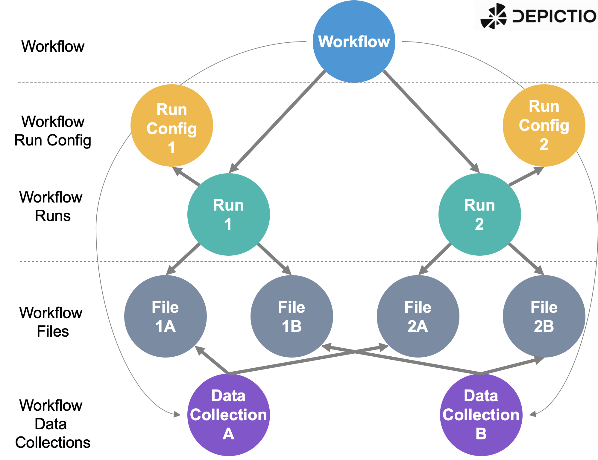
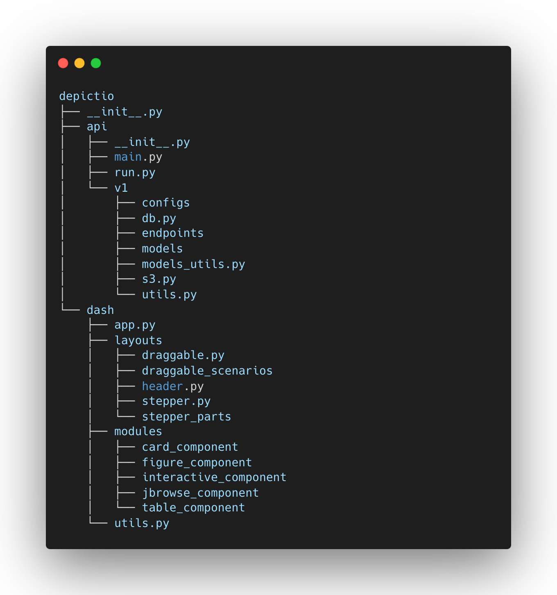
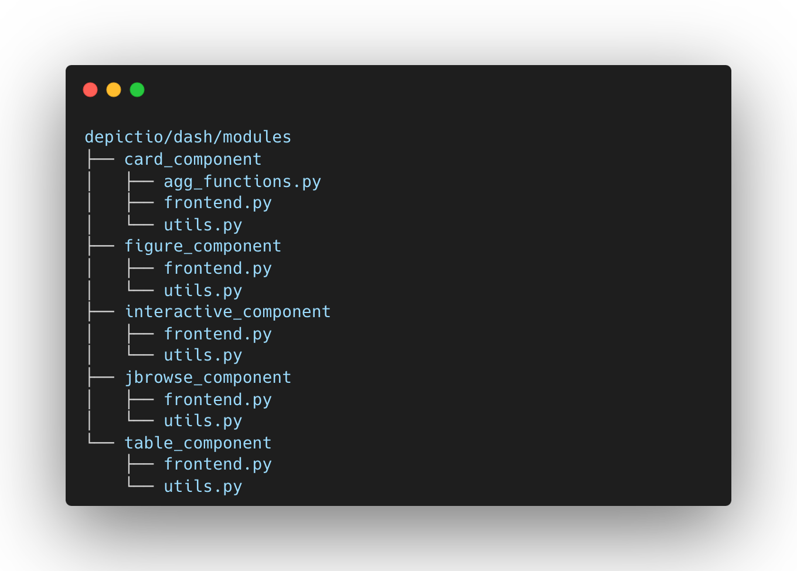

# Modularity

Depictio code structure is designed with a modular architecture, allowing for easy integration of new features and functionalities. The frontend and backend components are decoupled, enabling independent development and deployment of each module. The platform is built to be scalable and adaptable to various needs, with a focus on user-friendly interfaces and interactive data visualization tools.

## General Object Model and Database Design

Depictio object model was designed to reflect production-oriented workflows. The architecture is built to ensure a clear separation of concerns, with distinct layers for workflows, workflow run configurations, runs, files generated, and data collections. This modular approach is reflected in both the database schema and the API structure.

### Project & Workflow Object Design

- **Project**: The top-level entity that encapsulates that represents one or multiple production-oriented pipeline/workflow.
- **Workflow**: Standardised / production-oriented workflow
- **Run Configurations**: These define the parameters and settings that were used to run a workflow.
- **Runs**: Instances of a production workflow executed using a specific run configuration. Each run generates output files, that are structured the same way across runs. These files can then be associated into data collections.
- **Files**: Artifacts produced by each run. These can be intermediate or final results of the workflow.
- **Data Collections**: Aggregated data from files following the same structure.

The following diagram illustrates a "Workflow" object and its relationships with other objects in the system. The workflow object is at the center, with run configurations, runs, files, and data collections branching out from it. The files generated by each run can be organized into data collections, which can be used for visualization and analysis. Multiple workflows can be associated with a single project, enabling users to manage and visualize data, e.g., multi-omics data, from different workflows ([nf-core/rnaseq](https://nf-co.re/rnaseq) and [nf-core/atacseq](https://nf-co.re/atacseq)) in a single dashboard.

## Code Architecture

The code organisation clearly separates each of the frontend components and the API endpoints, making it easy to understand and extend the platform.

### API Structure

The API is structured to mirror the object design specified above, with each major component of the workflow having its own set of endpoints and models. The organization within `depictio/api/v1/endpoints` is as follows:

| Endpoint Module | Description |
|-----------------|-------------|
| **dashboards_endpoints** | Manages endpoints related to dashboards |
| **datacollections_endpoints** | Handles endpoints for data collections, mapping closely to the Data Collection objects in the design |
| **deltatables_endpoints** | Provides endpoints for delta tables, which are specific types of data collections with versioning |
| **files_endpoints** | Manages file-related endpoints, directly corresponding to the File objects |
| **user_endpoints** | Manages user authentication and authorization, including models and routes for user management |
| **utils_endpoints** | Provides utility endpoints, typically for internal or auxiliary operations |
| **workflow_endpoints** | Focuses on managing workflows, run configurations, and runs, reflecting the core of the workflow architecture |
| **project_endpoints** | Handles project-related endpoints, including project creation, management, and permissions |

Each endpoint is defined in a separate subfolder, where the `routes.py` file contains the API routes and the `models.py` file contains the object models associated.

### Dashboard Components

The frontend components in Depictio are organized in the `depictio/dash/modules` folder, with each component defined in a separate subfolder. This modular design ensures easy integration and maintainability.

#### Component Structure

Each component folder typically contains:

| File | Purpose |
|------|---------|
| **frontend.py** | Implements Dash callback functions |
| **utils.py** | Contains helper functions for rendering and state management |

Each of the frontend components is designed to be modular and can be easily integrated into the dashboard. Each component is defined in a separate folder, containing the component logic and styling. The `frontend.py` file contains the dash callback functions implementation and the `utils.py` file contains the helpers functions used by the component, allowing the component to be re-rendered in different scenarios (first design, reload/restore, refresh after data update).

## Adding New Components

To add a new component type:

1. Create a new folder in `depictio/dash/modules/`
2. Implement `frontend.py` with callback functions
3. Implement `utils.py` with helper functions
4. Register the component in the component registry
5. Add corresponding API endpoints if needed

See [Contributing Guide](contributing.md) for detailed instructions.
