# :material-hammer-wrench: Tool Studio <small>(v1.9.0+)</small>

**Depictio Tool Studio** contributes a tool to the
[Tools Catalog](../catalog/index.md) from the browser: drop one of the tool's output files,
bind its columns in depictio's own component builder, and the app opens the pull request
against `depictio/depictio` for you.

It runs entirely in the page, which is what makes it worth using: nothing to install, no
server to reach, and your file is parsed locally and only leaves the browser if you choose
to open the pull request.

<figure markdown="span">
  [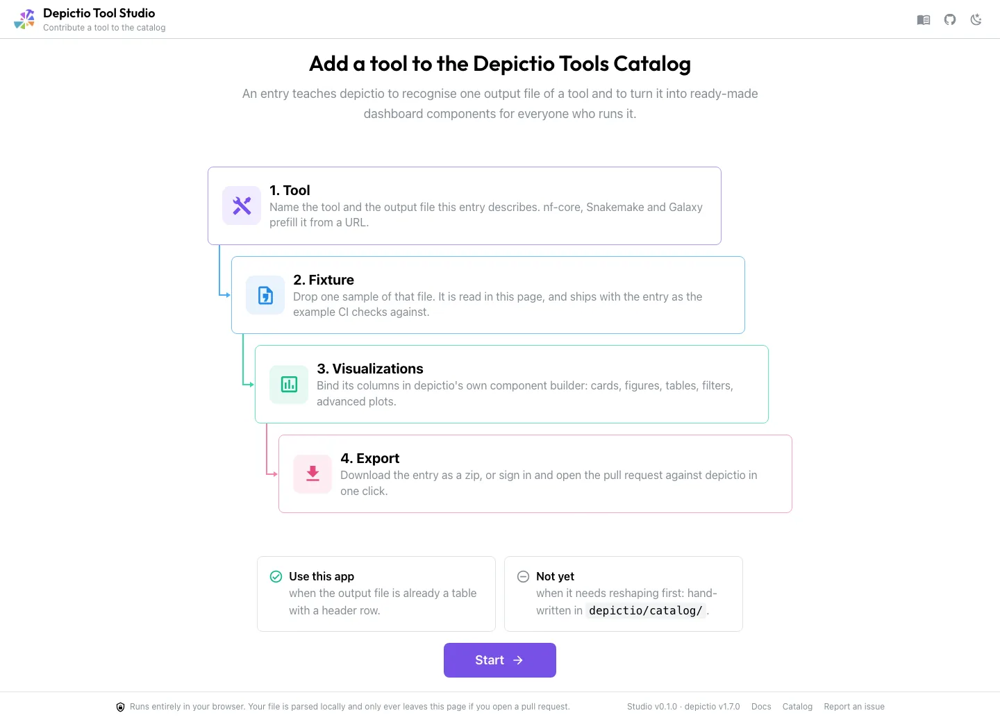](../images/tool-studio/00-start.webp){target=_blank}
  <figcaption>The start screen states what an entry is before any form field, and where the app stops.</figcaption>
</figure>

---

## Which route

A catalog entry is three files in a folder: `module.yaml` (which tool), `<output>.yaml`
(which file, and what to render from it), and a small fixture that grounds the bindings.
Your output file decides who writes them.

<div class="module-flow module-flow--parallel" markdown>

<div class="module-flow__step module-flow__step--file" markdown>
:material-table-check:{ .lg } **Already a table** <span class="module-flow__opt">Tool Studio</span>

A header row and one record per line. The Studio parses it, infers the columns, and everything downstream just works.
</div>

<div class="module-flow__step module-flow__step--module" markdown>
:material-cog-transfer:{ .lg } **Needs reshaping** <span class="module-flow__opt">hand-authored</span>

The entry needs a [`recipe`](contributing-a-tool.md) to tidy the file first. Half the committed catalog outputs are in this case, and the Studio cannot write one.
</div>

</div>

The Studio says which of the two you are in on its start screen, rather than three steps
in with a file that will not parse.

---

## 1. Tool

Identity on the left, the single output this entry describes on the right.

<figure markdown="span">
  [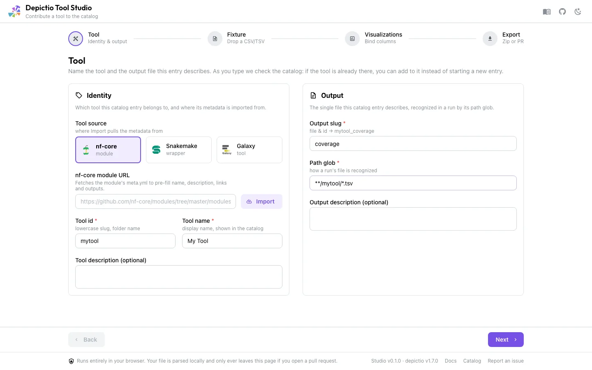](../images/tool-studio/01-tool.webp){target=_blank}
  <figcaption>Four required fields. The <code>path_glob</code> is the load-bearing one, since it is how depictio recognises the file in a real run.</figcaption>
</figure>

**Tool source** imports metadata from an **nf-core module**, a **Snakemake wrapper** or a
**Galaxy tool**. Paste the URL and press **Import**.

<figure markdown="span">
  [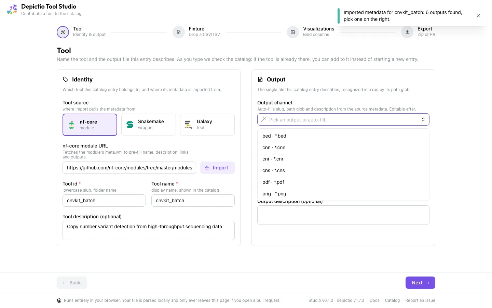](../images/tool-studio/01d-nfcore-import.webp){target=_blank}
  <figcaption>The app reads the module's <code>meta.yml</code> straight from raw.githubusercontent.com and offers every output channel it declares.</figcaption>
</figure>

Choosing an output fills the **Output slug**, the **Path glob** and the description.
Import is a convenience, not a requirement: typing the four fields yourself produces an
equally valid entry.

Two checks run while you type, and either one may change what you do next.

### If the tool is already in the catalog

Recognition runs on every keystroke, against a build-time snapshot of the committed
catalog, matching on the nf-core module path first, then the id, then the display name.

<figure markdown="span">
  [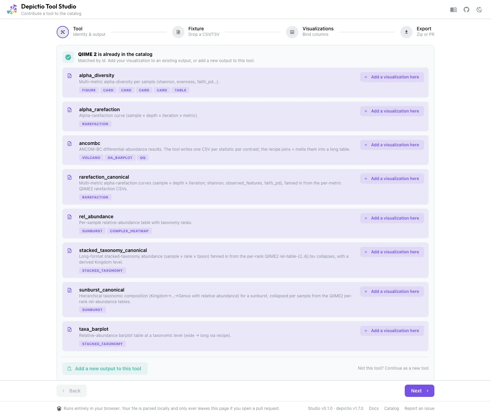](../images/tool-studio/01b-recognized.webp){target=_blank}
  <figcaption>QIIME 2 is the widest entry in the catalog: eight outputs carrying sixteen renders.</figcaption>
</figure>

Two routes open when it matches:

- **Add a visualization here** appends to that output's `renders_as`, rebased on the file
  as it exists on `main` right now, so a render merged since the last deploy is not
  reverted. Export becomes a single-file update.
- **Add a new output to this tool** reuses the identity and writes a fresh `<output>.yaml`,
  leaving `module.yaml` untouched.

**Not this tool? Continue as a new tool** dismisses the match, and the dismissal sticks
across a Back and Next round trip.

### If MultiQC already parses it

<figure markdown="span">
  [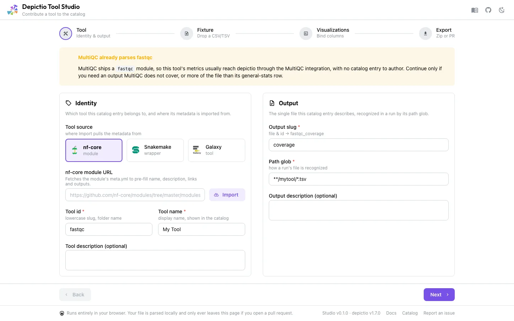](../images/tool-studio/01c-multiqc.webp){target=_blank}
  <figcaption>Advisory only. Nothing is blocked.</figcaption>
</figure>

depictio already ingests MultiQC, and the vendored index lists 181 MultiQC modules, so a
hand-authored entry for one of them is often work for metrics that would arrive anyway.
A bespoke entry is still a legitimate choice, for an output MultiQC skips or for more of
the file than its general-stats row.

---

## 2. Fixture

Drop one sample of that output file.

<figure markdown="span">
  [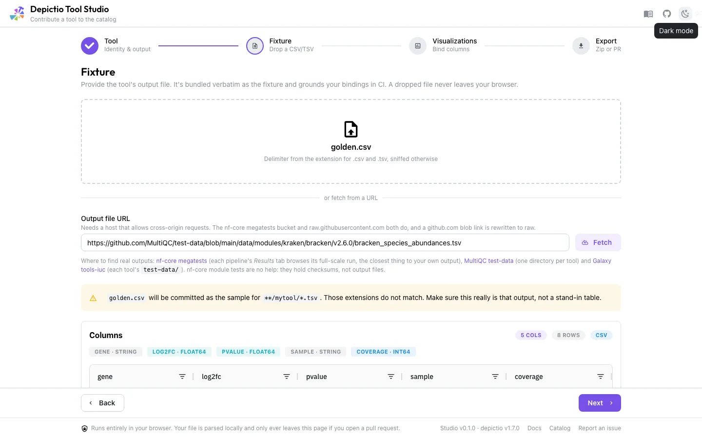](../images/tool-studio/02-fixture.webp){target=_blank}
  <figcaption>Columns and dtypes are inferred from the first 500 rows. The delimiter comes from the extension for <code>.csv</code> and <code>.tsv</code>, and is sniffed otherwise.</figcaption>
</figure>

The file is parsed in the page, never uploaded. It is **committed with the entry**, and it
is what CI reads to check that every column a render binds actually exists and has a
compatible type, so it has to be a real sample rather than a stand-in table. Fixtures are
capped at 5 MB, with a nudge above 1 MB.

### Fetching it from a URL

If you want to describe an output you do not have on disk, paste a link instead. A
`github.com` blob link is rewritten to `raw.githubusercontent.com`, so a URL copied
straight out of GitHub's file view works.

<figure markdown="span">
  [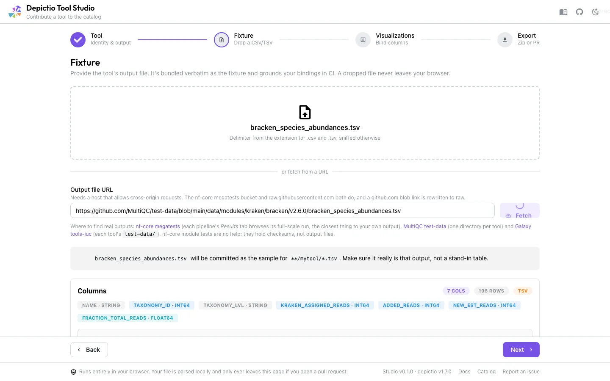](../images/tool-studio/02b-fetch-url.webp){target=_blank}
  <figcaption>The constraint is CORS, a browser rule the app cannot work around: the host has to answer cross-origin requests.</figcaption>
</figure>

Any host that answers cross-origin requests works, including your own. Three public
corpora are known to, and between them cover most tools: **nf-core megatests** (each
pipeline's full-scale run, the closest thing to your own output), **MultiQC test-data** (one
directory per tool), and **Galaxy tools-iuc** (each tool's `test-data/`). nf-core's own
module tests are no help, since they hold checksums rather than output files.

---

## 3. Visualizations

**Add visualization** opens depictio's component-type grid.

<figure markdown="span">
  [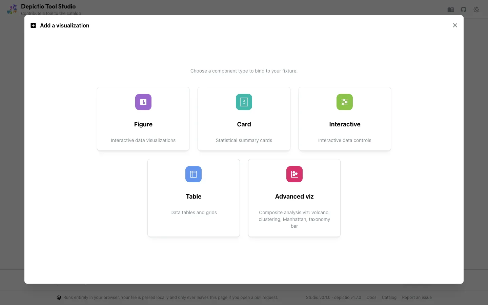](../images/tool-studio/03-component-types.webp){target=_blank}
  <figcaption>The same grid the dashboard editor shows.</figcaption>
</figure>

Picking one drops you into depictio's actual builder for that type, seeded from your
fixture instead of from the API: same controls, same live preview, same **UI Mode** /
**Code Mode** toggle. It is the dashboard editor's own interface on a narrower surface,
covering the component types and options a catalog entry can express, not every one
depictio offers.

<figure markdown="span">
  [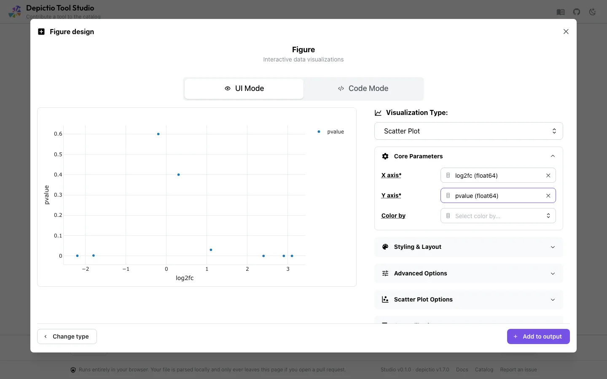](../images/tool-studio/04-figure-builder.webp){target=_blank}
  <figcaption>In Code Mode the snippet runs in your browser under Pyodide, where <code>df</code> is a pandas DataFrame. depictio runs the same snippet server-side where <code>df</code> is Polars, so <code>df.to_pandas()</code> is what makes both behave the same.</figcaption>
</figure>

Each render lands as a card that mirrors how it will appear in the Catalog, with two tabs.

<figure markdown="span">
  [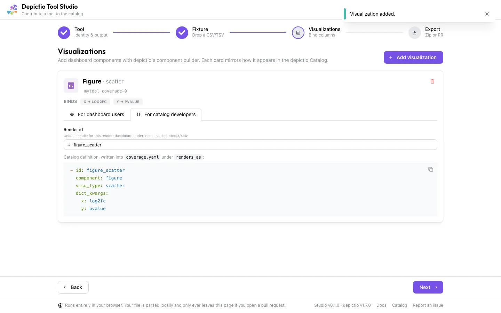](../images/tool-studio/05-render-card.webp){target=_blank}
  <figcaption><em>For dashboard users</em> shows the preview and the <code>use:</code> snippet; <em>For catalog developers</em> shows the render id and the exact <code>renders_as</code> entry that will be written.</figcaption>
</figure>

---

## 4. Export

<figure markdown="span">
  [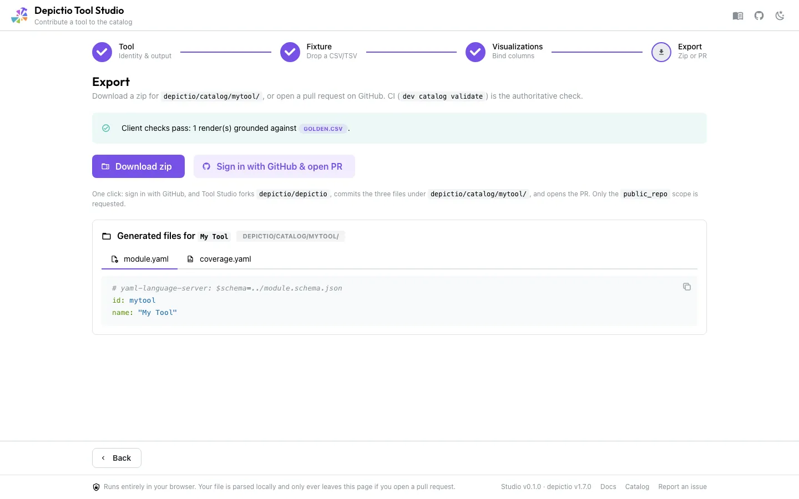](../images/tool-studio/06-export.webp){target=_blank}
  <figcaption>The generated files are shown inline, one tab each, before you commit to either route.</figcaption>
</figure>

Two ways out:

- **Download zip** gives you the folder to commit yourself.
- **Sign in with GitHub & open PR** forks `depictio/depictio`, commits the three files under
  `depictio/catalog/<tool>/` and opens the pull request. Only the `public_repo` scope is
  requested. Where OAuth is not configured, the button becomes **Contribute on GitHub** and
  walks you through the zip plus GitHub's own file uploader.

<figure markdown="span">
  [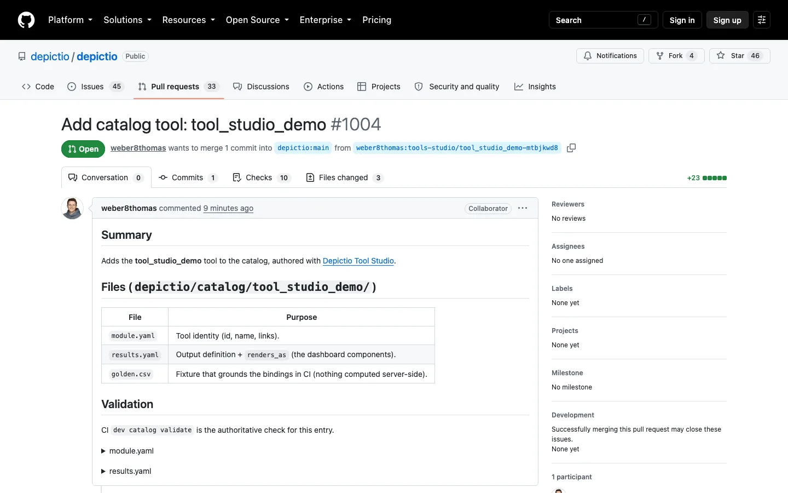](../images/tool-studio/08-github-pr.webp){target=_blank}
  <figcaption>The body is generated by the app: a summary, a table of the three files and what each is for, and both YAMLs inline.</figcaption>
</figure>

<!-- prettier-ignore -->
!!! info "The client-side checks are feedback, not the gate"
    `depictio-cli dev catalog validate`, run by the `catalog` CI check on your pull
    request, is the authoritative one. The Export panel says so too.

---

## What it generates

```yaml
# module.yaml
# yaml-language-server: $schema=../module.schema.json
id: mytool
name: My Tool

# results.yaml
# yaml-language-server: $schema=../output.schema.json
id: mytool_results
find: {path_glob: "**/mytool/*.csv"}
fixture: results.csv
renders_as:
  - { component: figure, visu_type: histogram, dict_kwargs: {x: log2fc, color: sample} }
  - { component: card, column: coverage, aggregation: average }
  - { component: advanced_viz, kind: volcano, roles: {feature_id: gene, effect_size: log2fc, significance: pvalue} }
```

Plus the fixture itself, byte-identical to what you dropped. `columns:` is deliberately
omitted: the fixture is what grounds the bindings, and declaring both is rejected by the
schema.

---

## What it cannot do yet

- **Parsing recipes.** Half the committed catalog outputs need one, and those entries stay
  [hand-written](contributing-a-tool.md#step-3-recipe-only-if-the-file-needs-reshaping).
- `columns:` and `find.filename` are not expressible either.
- Code-mode figures are grounded by nothing, and Pyodide and depictio's RestrictedPython
  disagree about what will run.

---

## See also

- [Contributing a Tool](contributing-a-tool.md) for the hand-authored path and the full schema
- [Tools Catalog](../catalog/index.md) to browse what is already covered
- [Picking a component from the catalog](../usage/guides/catalog-picker.md) for what an entry becomes on a dashboard
