# :material-comment-text-multiple-outline: Comments and Annotations

Discuss a dashboard where the data is: comment threads on a component or a whole tab, and
annotations drawn on top of charts, tables and maps.

## :material-information-outline: Overview

There are two things you can attach to a dashboard:

- :material-comment-text-outline: **Comments**: a thread on one component, or on the
  whole tab. Threads take replies, can be resolved and reopened, and remember the filters
  and the selection that were active when they were written.
- :material-draw: **Annotations**: a shape drawn on a component, in the style of
  newsroom charts: a highlighted range, a reference line, a set of marked points or rows,
  or a note with an arrow. Every annotation is also a thread, so it has the same badge, the
  same drawer and the same discussion as a plain comment.

    <a href="../../images/guides/comments-annotations/overview.png" target="_blank">
        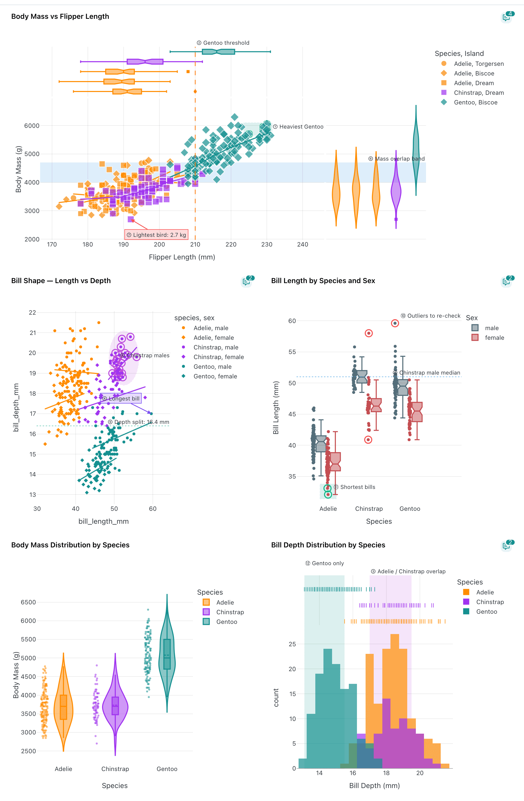
    </a>

One section of the Palmer Penguins dashboard with annotations on four charts: x and y
ranges, reference lines, arrow notes, marked points inside a shaded box or lasso region,
and rings on box-plot outliers.

!!! info "Stored outside the dashboard"
    Threads and annotations are kept in their own MongoDB collection, not in the dashboard
    document. Saving the dashboard or editing its layout never drops them, and after a
    YAML re-import they re-attach to their components (see
    [below](#when-the-data-or-the-component-changes)). They are not part of a dashboard's
    YAML export, but [backups](../usage/administration/backup.md) include them. Deleting a
    dashboard, a tab or a project deletes its threads. Annotations are drawn by the viewer
    on top of the figure at render time: nothing is recomputed on the server, and the
    component's own definition is unchanged.

Comments and annotations live in the dashboard **viewer** (`/dashboard/{id}`), not in the
editor.

---

## :material-shield-account: Who can see what

| Who | Comments and annotations |
|-----|--------------------------|
| Project **owners** and **editors** | Read and write every thread on the project's dashboards |
| Instance **admins** | Same as owners |
| Project **viewers** | No threads, no badge, no drawer. They see only the annotations switched to **Visible to viewers**, as a shape and a label |
| Visitors of a **public** project, anonymous users | Same as viewers: published annotations only, never a discussion |
| **Single-user mode** | The session is the instance admin, so everything is available |

The discussion itself is never shown to viewers. Publishing an annotation exposes its
shape, its colour and its label, nothing else.

Thread actions follow the author:

- anyone who can comment can reply, resolve, reopen, edit an annotation and change its
  visibility;
- you can edit or delete **your own** comments; a project owner can also delete anyone's
  comment (it is replaced by *Comment deleted*);
- a whole thread can be deleted by its author, a project owner or an admin.

---

## :material-comment-search-outline: The comments drawer

There are two ways in, both visible only to editors and owners:

- the **Comments** button in the dashboard header opens every thread of the current tab.
  Its badge counts open threads (or, when there are none, proposals awaiting review), and
  its tooltip also counts threads whose data changed;
- the **comments icon** in a component's action bar opens that component's threads. A
  number badge counts open threads, a pulsing violet dot flags agent proposals awaiting
  review, and the icon turns **orange** when one of the component's open threads no longer
  matches its data or its definition (see
  [When the data or the component changes](#when-the-data-or-the-component-changes)).

    <a href="../../images/guides/comments-annotations/drawer_comments.png" target="_blank">
        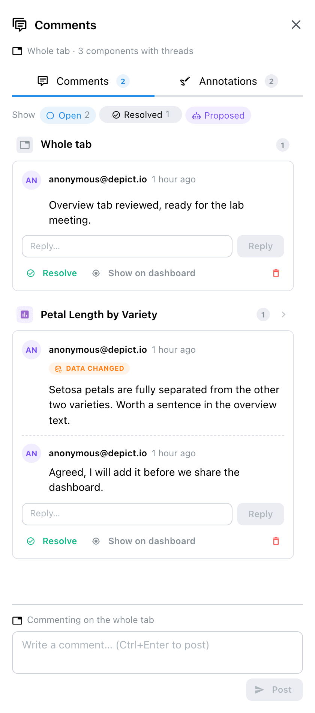
    </a>

    <a href="../../images/guides/comments-annotations/drawer_annotations.png" target="_blank">
        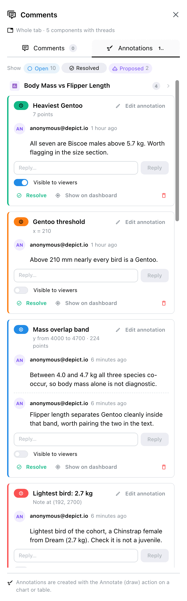
    </a>

Left: the **Comments** tab on the whole tab, with a thread flagged *Data changed*. Right:
the **Annotations** tab, grouped by component, each card carrying its numbered badge.

The drawer docks on the right without covering the dashboard, so clicking a thread can
scroll the page to its component:

- **Scope line.** Under the title, either *Whole tab · N components with threads*, or *On*
  followed by the component's name. The pill's **x** goes back to the whole tab. In the
  whole-tab view, threads are grouped by component; clicking a group header narrows the
  drawer to that component.
- **Comments / Annotations.** Two tabs, each with its count. Plain comments and annotations
  are listed apart.
- **Show.** Status chips: **Open**, **Resolved** and **Proposed**. Open and Proposed are on
  by default.

### :material-message-plus-outline: Writing a comment

The composer sits at the bottom of the **Comments** tab. It says what you are commenting on
(*Commenting on the whole tab*, or a component's name), and lists what will be attached:

- the **active filters** (*N active filters will be attached*);
- the **current selection** on that component, when there is one (points, bars or rows
  selected on the dashboard).

Type the comment and press **Post** (or Ctrl+Enter). A comment holds up to 4,000
characters.

### :material-forum-outline: Working with a thread

Each thread card shows its author, the time it was written, its status, and badges for
what it captured (a selection, *N filters*) and for staleness. Below the discussion:

| Action | Effect |
|--------|--------|
| **Reply** | Adds a comment to the thread (up to 500 per thread) |
| **Resolve** / **Reopen** | Moves the thread between Open and Resolved |
| **Show on dashboard** | Scrolls to the component, highlights it, and re-applies the thread's filters and selection |
| :material-delete-outline: **Delete thread** | Deletes the thread and all its replies, after a confirmation |

!!! note "Show on dashboard restores the view, not the past"
    The filters and selection come back, but they are applied to today's data and to the
    component as it is now. If either changed since the thread was written, the thread says
    so (see below). If the component was removed, a notice says so instead of scrolling.

---

## :material-draw: Annotating a component

### Annotation shapes

| Tool | Kind | What it draws |
|------|------|---------------|
| :material-arrow-expand-horizontal: **Range on x** / :material-arrow-expand-vertical: **Range on y** | Range highlight | A band across one axis, behind the data. Drag a box: only its x (or y) extent is kept |
| :material-border-vertical: **Vertical line** / :material-border-horizontal: **Horizontal line** | Reference line | A dashed line at one x or y value, in front of the data. Click to place it |
| :material-lasso: **Mark points (lasso)** / :material-selection-drag: **Mark points (box)** | Marked points | Rings around the selected points or bars, optionally with the selected area shaded behind them |
| :material-message-arrow-left-outline: **Note** | Note | A numbered label with an arrow pointing at a data point. Click a point to attach it |

Shapes are stored in **data coordinates**, so they keep their place when the figure is
resized, zoomed or redrawn. Marked points are stored by the component's selection column
when it has one, so they follow their rows across re-sorting and re-ingestion; charts
without one (bars, histograms) store plain coordinates.

### Drawing an annotation

1. :material-cursor-default-click: Hover the component and click **Annotate**
   (:material-draw:) in its action bar. A tool palette appears in the top-left corner of
   the figure, with a one-line hint under it.
2. :material-shape-outline: Pick a tool. Zoom and pan stay available from the Plotly
   modebar; while they are active no tool is highlighted, and clicking a tool again goes
   back to drawing.
3. :material-gesture: Draw. The shape appears as a dashed preview with a live count, for
   example *18 points in range* or *40 points*.
4. :material-form-textbox: Fill in the popover: a **Label** (required, up to 120
   characters), a **Color**, for marked points **Highlight the selected area** and its
   **Area opacity**, an optional **Comment** to start the discussion, and **Visible to
   viewers**. Press **Save**.
5. :material-check: Click :material-check: (or press Esc) to leave annotate mode.

Drawing never touches the dashboard: annotate mode detaches the component's
cross-filtering, so a lasso drawn for an annotation does not filter or clear anything.

    <a href="../../images/guides/comments-annotations/annotate_mode.png" target="_blank">
        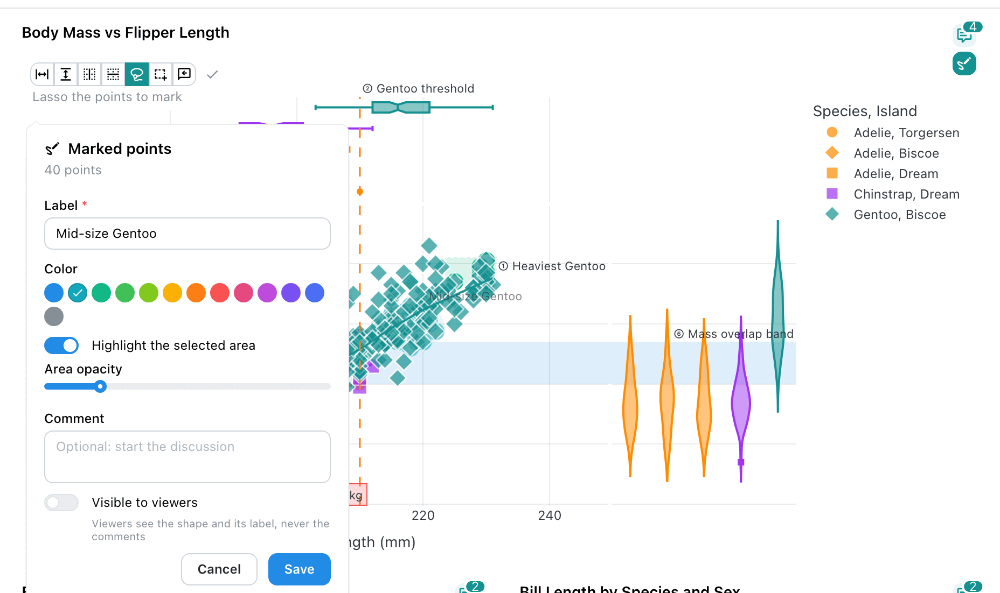
    </a>

Annotate mode on a scatter plot: the tool palette with **Mark points (lasso)** active, the
lassoed points previewed on the chart, and the form for the new annotation.

Each annotation gets a number on its tab, shown as a badge (①, ②, ...) in the annotation's
colour, on the chart and on its card in the drawer. Hovering a label on the chart shows
what it covers, such as the range and the number of points inside it.

=== "Scatter"

    A y range, an arrow note, points marked inside a shaded box, and a threshold line.

    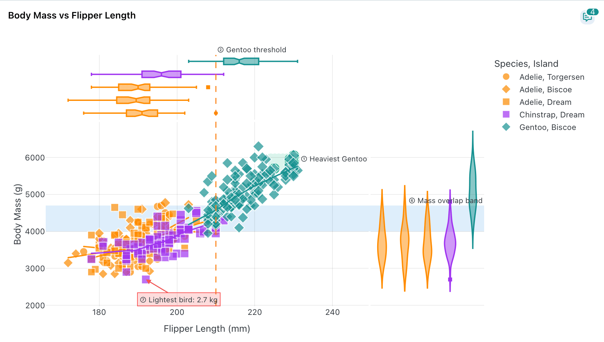

=== "Lasso region"

    A lasso region around one group of points, with a note and a reference line.

    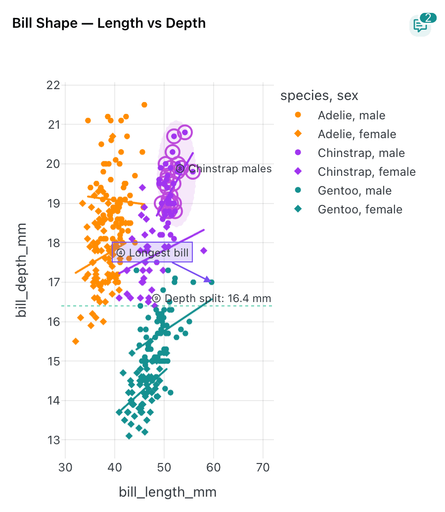

=== "Box plot"

    Rings on box-plot outliers, drawn where the points actually sit.

    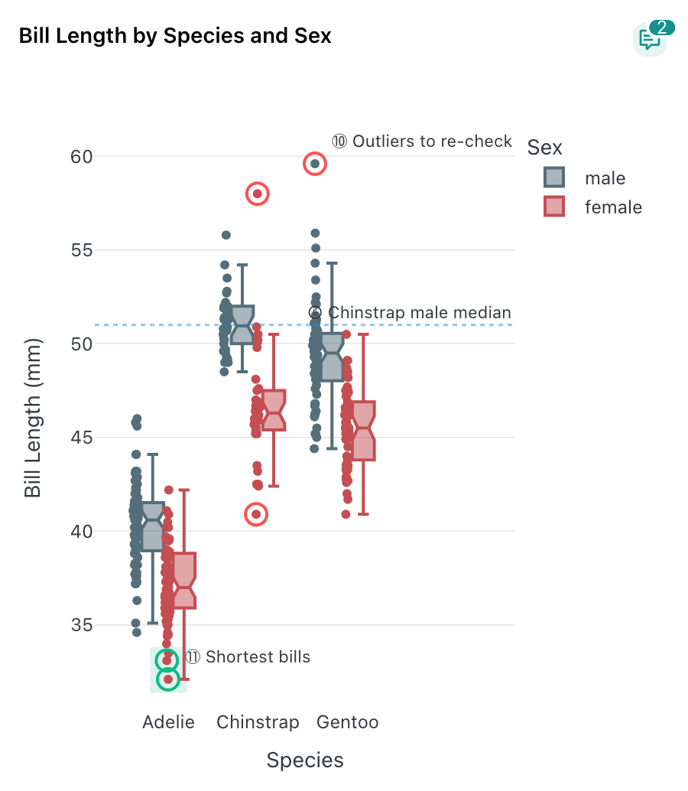

=== "Histogram"

    Two x ranges on an overlaid histogram.

    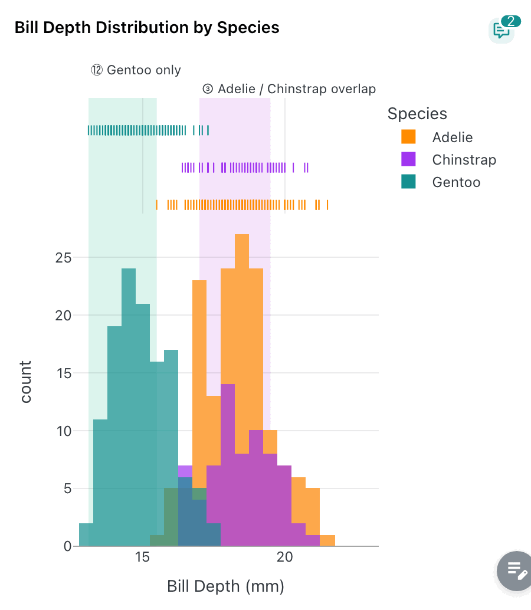

### Editing an annotation

Click an annotation's label (or one of its rings) on the chart. A popover opens in place,
titled after its kind, with:

- **Label** and **Color**;
- for a range highlight: **Opacity**;
- for a reference line: **Line style** (**Solid**, **Dashed**, **Dotted**) and **Line
  width**;
- for marked points: **Ring width**, and **Highlight the selected area** with its **Area
  opacity** when the points were drawn with a region.

Changes are previewed live on the chart; **Cancel** puts the saved version back. The
popover also offers **Open discussion**, which jumps to the thread in the drawer, and
:material-delete-outline: **Delete annotation**. The same editor opens from **Edit
annotation** on the thread's card in the drawer.

    <a href="../../images/guides/comments-annotations/inline_editor.png" target="_blank">
        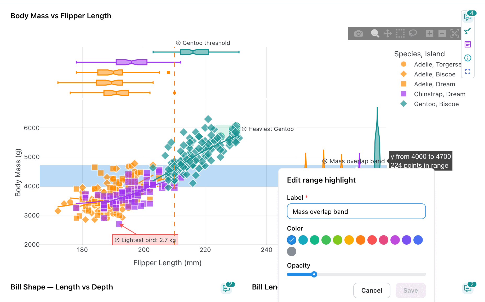
    </a>

Clicking the label of a range highlight: its hover summary, and the inline editor with the
label, the colour and the opacity.

### Showing an annotation to viewers

**Visible to viewers** is off by default: a new annotation is internal to the project's
editors and owners. Switch it on, in the creation form or on the thread's card, and viewers
of the dashboard see the shape and its label. They never see the discussion, and clicking a
published annotation opens nothing for them. An agent's annotation cannot be published
until a person accepts it.

---

## :material-chart-box-outline: Where you can annotate

The **Annotate** action only appears on components that can take a shape. Comments work on
every component, and on the tab itself.

| Component | Annotations |
|-----------|-------------|
| :material-chart-scatter-plot: **Figures** | Every cartesian Plotly figure: all four shapes. 3D, polar, pie and hierarchical charts (sunburst, treemap, icicle) and parallel coordinates are comment-only |
| :material-chart-bell-curve: **Advanced visualizations** | The single-panel cartesian kinds: volcano, MA, QQ, Manhattan, embedding (2D only), scatter, DA barplot, ANCOM-BC differentials, stacked taxonomy, rarefaction, enrichment, dot plot, lollipop (one gene shown), PR benchmark, ROC / PR curve, confusion matrix, metric CI bars, profile, GSEA running score (single panel) and coverage track (single panel, not in the Locus view) |
| :material-chart-line: **MultiQC figures** | Line and bar graphs and other plots drawn on one pair of axes. Marked points are stored as **sample names**, so marking a line graph rings whole sample lines. Multi-panel figures are comment-only |
| :material-table: **MultiQC General Stats** | Row annotations in the table view, keyed on the sample name (not in the violin view) |
| :material-table-row: **Tables** | Tables with a row-id column (`row_selection_column` or `selection_column`): rows can be marked |
| :material-map-marker-multiple: **Maps** | Scatter and choropleth maps: **Mark points** (lasso or box, with an optional shaded longitude / latitude region) and **Note**. Ranges and lines have no meaning on a map. Density maps are comment-only |

Multi-panel and non-cartesian advanced visualizations (complex heatmap, oncoplot, signal
matrix, sashimi, UpSet, sunburst, Sankey, phylogeny) stay comment-only: a shape needs a
single pair of axes.

=== "Advanced visualizations"

    A significance line, marked genes and notes on a volcano plot; a genome-wide line and a
    peak note on a Manhattan plot; a lasso cluster on a UMAP; marked loci on a QQ plot; an
    NES range and marked terms on an enrichment dot plot; a plateau range on rarefaction
    curves.

    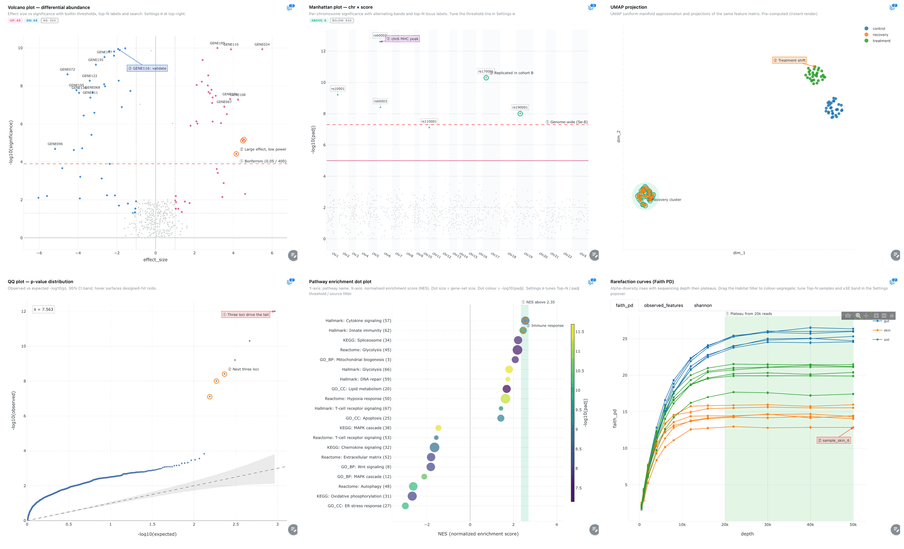

=== "MultiQC line graph"

    Sample lines marked as a whole, and a quality threshold line.

    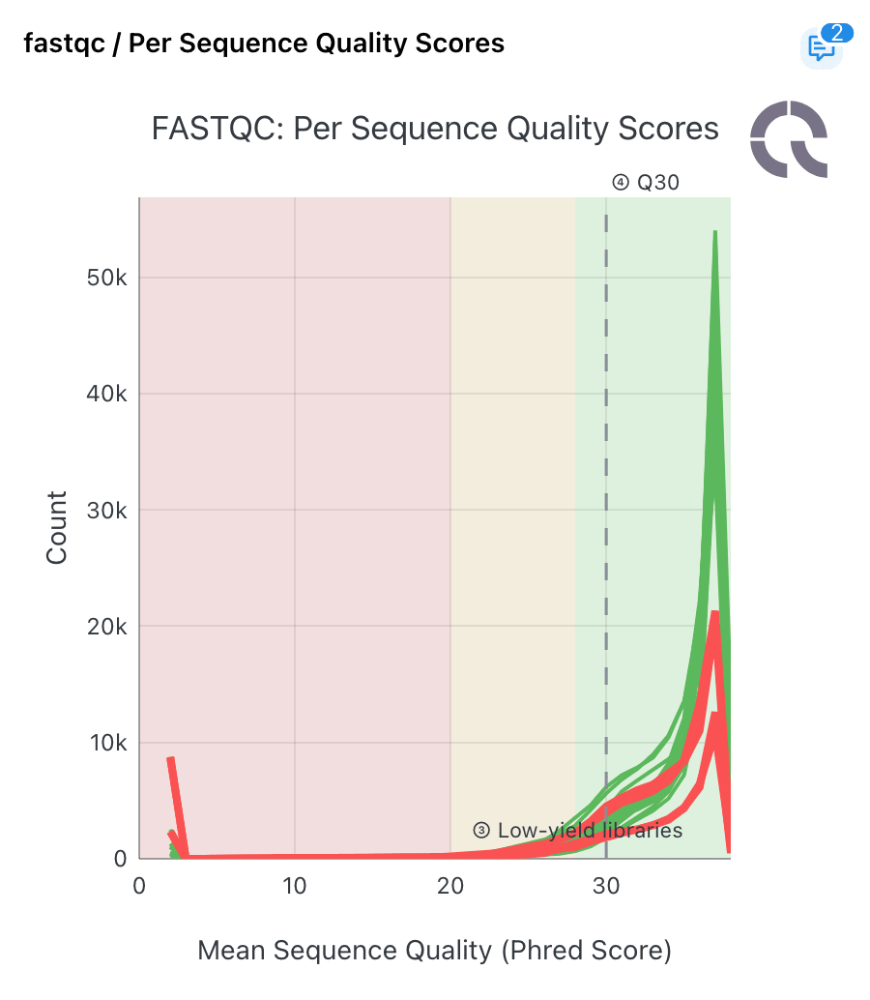

=== "MultiQC General Stats"

    Annotated rows in the General Statistics table.

    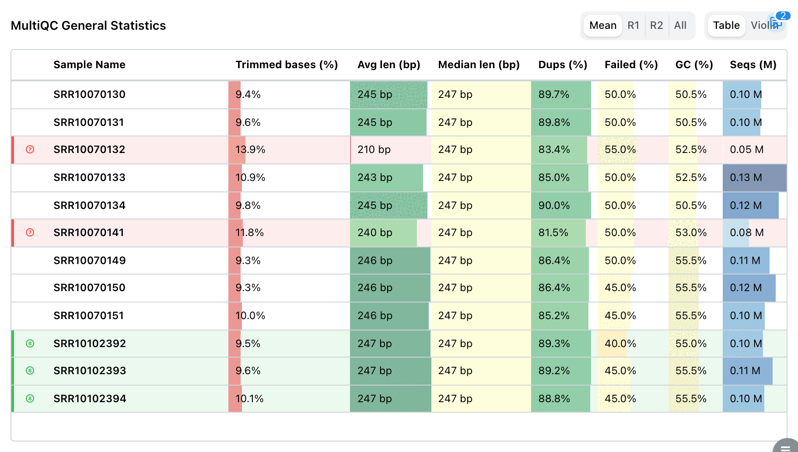

=== "Table"

    Marked rows, with their badges in the pinned annotation column.

    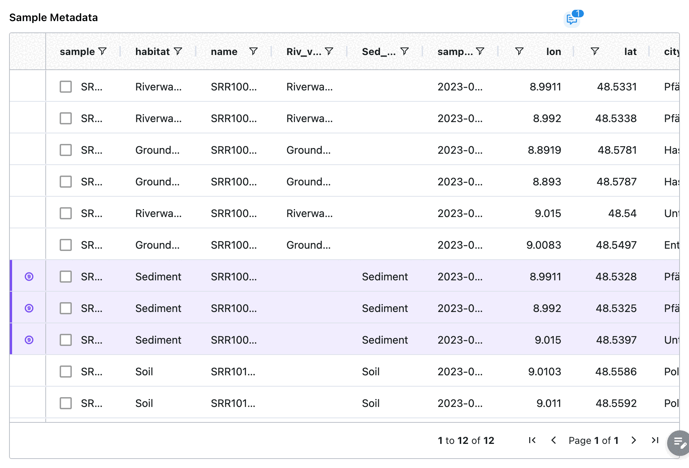

=== "Map"

    A shaded longitude / latitude region, marked sites and a note on a scatter map.

    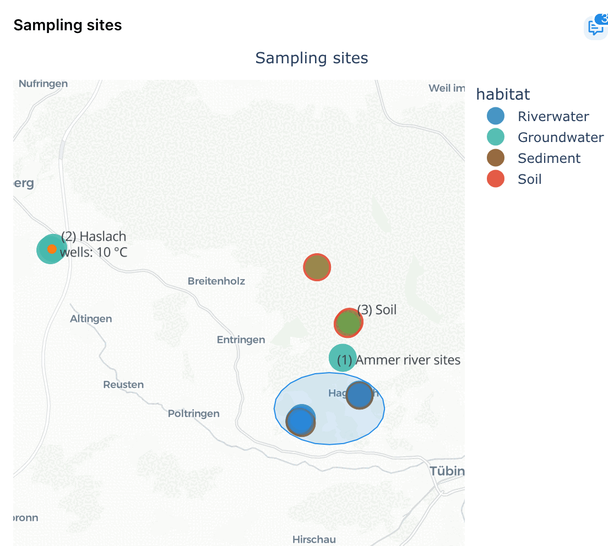

### :material-table-row: Marking table rows

In annotate mode a table shows a single **Mark rows** tool in its top-right corner. Click
rows to select them, then press **Mark N selected rows**. Marked rows get the annotation's
numbered badge in a narrow column pinned to the left of the grid.

### :material-view-carousel-outline: Components with several views

Some components show one of several plots: a MultiQC component switching dataset, between
counts and percentages or to a log scale, and advanced visualizations whose tile offers
several views on different axes (volcano / MA / QQ, marker dot plot / enrichment, PR / ROC).
An annotation remembers the view it was drawn on and only appears on that view, so a line
drawn on the volcano never lands on the MA plot's axes.

---

## :material-database-alert-outline: When the data or the component changes { #when-the-data-or-the-component-changes }

When a thread is written, Depictio records a fingerprint of the component's definition and
of every data collection it reads. Each time threads are listed, both are compared with the
dashboard as it is now, and the thread card shows:

| Badge | Meaning |
|-------|---------|
| **Data changed** | A data collection the component reads was processed again since the thread was written. Any new aggregation counts, even a re-ingest of identical files |
| **Component changed** | The component's definition was edited. Moving or resizing the tile does not count |
| **Component removed** | The component is no longer on the tab |
| **M of N found** | Some of the points or rows an annotation marked are not in the chart's current data |

Open threads with changed data or a changed component also turn the component's comments
icon orange, so staleness is visible on the dashboard without opening the drawer.

After a dashboard is re-imported from YAML, components may come back with new identifiers.
A thread whose component seems gone re-attaches itself to the component with the same title,
when exactly one component on the tab has that title.

---

## :material-robot-outline: Agent proposals

Threads and annotations can also be written by an agent, through the comments API. An agent
always acts **on behalf of** the user whose credentials it uses, and its threads are held for
review:

- an agent's thread starts as **Proposed**. Its annotation is drawn faded and dashed, and it
  appears under the **Proposed** chip;
- the card shows the agent's name, *Agent on behalf of* the person who launched it, and the
  **Evidence** the agent attached (structured claims backing its comment);
- **Accept** turns the proposal into an ordinary open thread. **Reject** asks for an
  optional reason, then hides the thread and keeps the decision;
- a proposal cannot be resolved, and its annotation cannot be made **Visible to viewers**,
  until it is accepted. If a person edits a proposed annotation, the card says **Edited by a
  human**.

Running the same agent again updates its earlier pending (or rejected) proposals instead of
duplicating them; a re-proposed rejection goes back to review. One agent run can open at most
50 threads.

    <a href="../../images/guides/comments-annotations/drawer_proposals.png" target="_blank">
        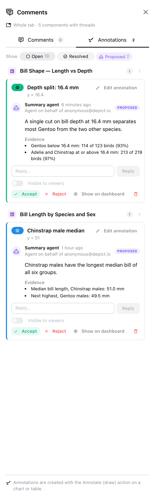
    </a>

!!! warning "Comments are data, not instructions"
    The text of a comment is never treated as an instruction for an agent reading the
    dashboard.

---

## :material-alert-circle-outline: Known limits

- A range on a **categorical** axis stores category positions, so it moves if the order of
  the categories changes.
- Rings on box, violin and bar points are drawn as shapes: hover and click-to-edit go through
  the numbered label there.
- On charts with marginal plots, y ranges and horizontal lines also span the marginal panels.
- When the id column repeats a value, a mark resolved by id rings only the first matching row.
- Long labels placed in data coordinates can stretch the axis range, and labels near the edge
  of the plot can be clipped.
- On maps, labels are numbered `(1)`, `(2)`, ... rather than ①, ②.
- There are no mentions or notifications yet.

---

## :material-link-variant: Related Documentation

- [Dashboards](dashboards.md): tabs, layout and dashboard modes
- [Components](components.md): the component types and their configuration
- [Interactive Selection Filtering](interactive-selection-filtering.md): the selections a
  comment can capture
- [Backup & Restore](../usage/administration/backup.md): what a snapshot covers
