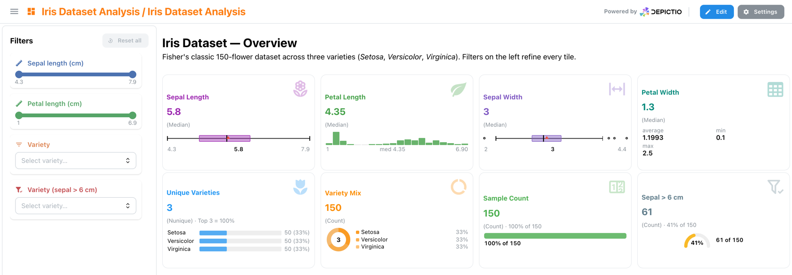
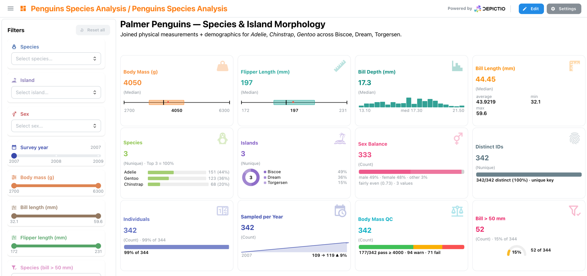
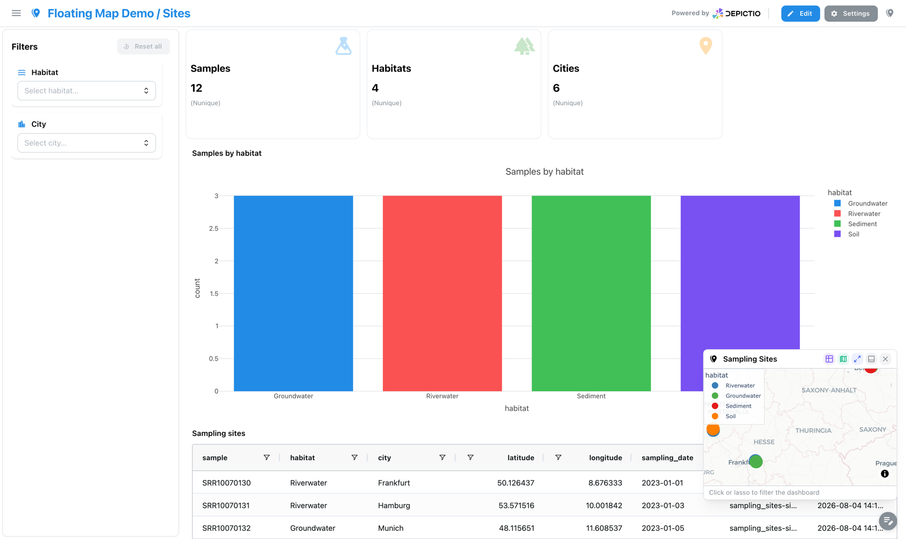
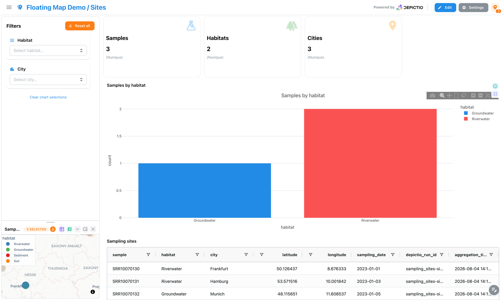
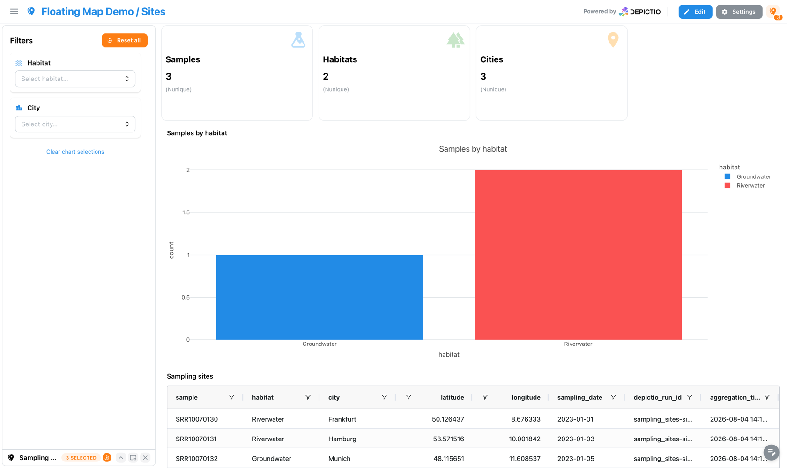
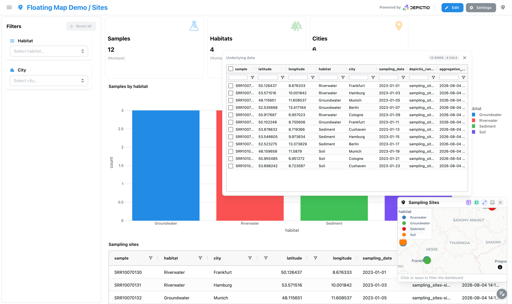

# :material-puzzle: Dashboard Components

Depictio provides a variety of component types for building interactive dashboards. This guide covers each component type, when to use it, and how to configure it.

!!! tip "Browse the live catalog"
    To see which bioinformatics tool outputs map to these components, explore the
    [:material-hammer-wrench: Depictio Tools Catalog](../catalog/index.md): every
    recognised tool, the data collections it emits, and the renders they offer,
    previewed on real fixture data.

## :material-format-list-bulleted: Component Overview

<div class="grid cards" markdown>

-   :material-chart-scatter-plot:{ .lg .middle } **[Figure](#figure-components)**

    ---

    Charts and plots (scatter, bar, histogram, line, box, pie, and more)

-   :material-table:{ .lg .middle } **[Table](#table-components)**

    ---

    Interactive data tables with filtering and sorting

-   :material-card-text:{ .lg .middle } **[Card](#card-components)**

    ---

    Metric display with aggregations

-   :material-format-header-1:{ .lg .middle } **[Text](#text-components)**

    ---

    Section headers (H1, H2, H3)

-   :material-tune:{ .lg .middle } **[Interactive](#interactive-components)**

    ---

    User input components for filtering (slider, dropdown, date picker)

-   :material-microscope:{ .lg .middle } **[MultiQC](#multiqc-components)**

    ---

    Quality control report visualizations

-   :material-image-multiple:{ .lg .middle } **[Image](#image-components)**

    ---

    Image galleries with S3/MinIO storage integration

-   :material-map-marker-multiple:{ .lg .middle } **[Map](#map-components)**

    ---

    Geospatial map visualization with markers

-   :material-chart-multiline:{ .lg .middle } **[Advanced Visualizations](#advanced-visualizations)**

    ---

    Domain-specific scientific viz (volcano, MA, manhattan, ComplexHeatmap, UpSet, sankey, …) backed by canonical column schemas

</div>

### Building under active filters <small>(v1.5.2+)</small> { #building-under-filters }

With filters applied, the builder previews the **filtered** data. An **Apply to
preview** toggle switches back to the full dataset. Applies to every type except
Text and MultiQC, which have no row filtering. See
[Dashboard creation](../usage/guides/dashboard_creation.md#previewing-with-active-filters-v152).

---

## :material-chart-scatter-plot: Figure Components <small>(v0.0.1+)</small> { #figure-components }

Figure components display data visualizations using Plotly charts. They support both **UI Mode** (drag-and-drop configuration) and **Code Mode** (Python code for custom plots).

### Supported Chart Types

**UI Mode** provides a curated selection of chart types through the visual interface:

<!-- TODO: update when more UI types are re-enabled -->

| Category | Chart Types |
|----------|-------------|
| :material-chart-scatter-plot: **Basic Charts** | Scatter, Bar, Line |
| :material-chart-box: **Statistical** | Histogram, Box |
| :material-grid-large: **Matrix** | ComplexHeatmap (via [:material-open-in-new: plotly-complexheatmap](https://github.com/weber8thomas/plotly-complexheatmap){ target="_blank" }) |
<!-- | :material-chart-bell-curve: **Distribution** | Density Heatmap, Density Contour |
| :material-chart-tree: **Hierarchical** | Treemap, Sunburst | -->

<!-- | Category | Chart Types |
|----------|-------------|
| :material-chart-scatter-plot: **Basic Charts** | Scatter, Bar, Line, Area, Pie, Donut |
| :material-chart-box: **Statistical** | Histogram, Box, Violin, Strip |
| :material-chart-bell-curve: **Distribution** | Density Heatmap, Density Contour |
| :material-chart-tree: **Hierarchical** | Treemap, Sunburst | -->

!!! tip "Unlimited Charts with Code Mode :material-code-tags:"
    **Code Mode** supports the entire Plotly library, giving you access to all chart types including 3D plots, maps, financial charts, and more. See the [:material-open-in-new: Plotly Python documentation](https://plotly.com/python/){ target="_blank" } for the complete reference.

### UI Mode

In UI Mode, configure charts through the visual interface:

1. Select a **Data Collection** as your data source
2. Choose the **Chart Type** (scatter, bar, histogram, etc.)
3. Map data columns to **X-axis**, **Y-axis**, and optional **Color** dimension
4. Customize appearance (title, axis labels, colors)

### Code Mode

Code Mode allows custom Python code for advanced visualizations:

```python
import plotly.express as px

# df is your data collection as a pandas DataFrame
fig = px.scatter(
    df,
    x="coverage",
    y="quality_score",
    color="sample_type",
    title="Coverage vs Quality by Sample Type"
)

# Return the figure object
fig
```

!!! warning "Security Note :material-shield-lock:"
    Code Mode uses [RestrictedPython](https://restrictedpython.readthedocs.io/en/latest/) for security. Only approved libraries (pandas, plotly) are available. See [Security](security.md) for details.

### Configuration Options

| Option | Description | Default |
|--------|-------------|---------|
| Title | Chart title displayed at top | Auto-generated |
| X-axis label | Label for horizontal axis | Column name |
| Y-axis label | Label for vertical axis | Column name |
| Color | Column for color encoding | None |
| Hover data | Additional columns shown on hover | None |
| `max_points` | Point cap for scatter-family figures before downsampling (v1.3.0+) | Global default (10,000) |
| `font_scale` | Font-size multiplier for the whole figure layout font: axis labels, ticks and legend. Set from the tile's edit menu, 0.7× to 2×, with a full lite-YAML round trip (v1.8.0+) | Unset (1×) |
| Theme | Plotly template for this figure. `mantine_light` / `mantine_dark` mean *follow the UI colour scheme*. Unset falls back to the dashboard default, then to [instance branding](../usage/administration/branding.md) (v1.8.0+) | Unset |

!!! tip "Clustered heatmaps moved"
    The ComplexHeatmap viz has been renamed and is now part of the Advanced Visualizations section below — see [Hierarchical Heatmap](#hierarchical-heatmap) for the full config, alongside the rest of the domain-specific viz family (volcano, MA, sankey, …).

### Selection Filtering (Scatter Plots)

Scatter plots can act as interactive filters. Enable selection to let users lasso, box-select, or click points to filter other components.

| Option | Description |
|--------|-------------|
| `selection_enabled` | Enable selection filtering (`true`/`false`) |
| `selection_column` | Column to extract from selected points |

See [Interactive Selection Filtering](interactive-selection-filtering.md) for details.

---

## :material-table: Table Components <small>(v0.0.2+)</small> { #table-components }

Table components display data in interactive tables with built-in filtering and sorting.

### Features

| Feature | Description |
|---------|-------------|
| :material-page-next: **Server-Side Pagination** | Efficiently handles large datasets by loading data in pages |
| :material-arrow-vertical-lock: **Server-Side Scrolling** | Virtual scrolling for smooth navigation through large tables |
| :material-sort: **Column Sorting** | Click headers to sort ascending/descending |
| :material-filter: **Column Filtering** | Filter by column values |
| :material-download: **Export** (v0.6.0+) | Download data as CSV |

### Configuration

| Option | Description | Default |
|--------|-------------|---------|
| Data Collection | Source data for the table | Required |
| Visible Columns | Allowlist of columns to display; omit to show all | All columns |
| Page Size | Rows per page (`10`, `25`, `50` or `100`) | `100` |
| Compact (v1.2.2+) | Tighter row and header heights | Off |
| Style | Column width, text alignment | Auto |
| Title | Header text above the table | Auto (from DC tag) |
| Description | Subtitle text below the title | None |
| Title Size | Header level: `h1`, `h2`, `h3`, or `sm` | `sm` |
| Title Align | Text alignment: `left`, `center`, or `right` | `left` |

### Row Selection Filtering

Tables can act as interactive filters. Enable row selection to let users click rows to filter other components.

| Option | Description |
|--------|-------------|
| `row_selection_enabled` | Enable row selection filtering (`true`/`false`) |
| `row_selection_column` | Column to extract from selected rows |

See [Interactive Selection Filtering](interactive-selection-filtering.md) for details.

---

## :material-chart-multiline: Advanced Visualizations <small>(v0.13.0+)</small> { #advanced-visualizations }

Advanced Visualizations are a family of domain-specific scientific charts (catalogued below). Unlike the generic [Figure](#figure-components) component, which accepts any numeric columns, each advanced viz declares a **canonical column-role schema**: a volcano plot knows it needs a `feature_id`, an `effect_size`, and a `significance` column — wired to your DC's actual column names through the viz's config.

Two ingredients work together:

- a **per-viz `Config` class** (e.g. `VolcanoConfig`, `MAConfig`) that captures the role → column mapping plus per-viz display defaults (thresholds, top-N, sort order);
- a **`CANONICAL_SCHEMAS` entry** declaring the required and optional roles plus their accepted polars dtypes, used by the dashboard builder to validate the binding and surface errors before the viz renders.

Source of truth in the codebase:

- `depictio/models/components/advanced_viz/configs.py` — per-viz Pydantic configs
- `depictio/models/components/advanced_viz/schemas.py` — `CANONICAL_SCHEMAS` + `validate_binding()`
- `depictio/models/components/types.py` — `AdvancedVizKind` literal enum

### Shared settings <small>(v1.13.0+)</small> { #advanced-viz-shared-settings }

Every kind accepts one layout setting on top of its own:

| Option | Type | Default | Description |
|--------|------|---------|-------------|
| `controls_placement` | `popover` \| `rail` \| `header` | `popover` | Where the tile's primary controls live: axes, colour by, the view switch, a gene or sample picker. `popover` keeps them behind the settings icon, `rail` puts them in a strip beside the plot, `header` lifts them into the tile header. Cosmetic options stay in the settings popover whichever placement is chosen. |

#### Switchable views { #advanced-viz-views }

Some kinds draw the same rows in more than one way. They carry a `view` field, the view the tile opens on, and a `views` list, the views offered in a switch in the tile header. Leaving `views` unset offers every view the bound columns allow: a view whose columns are not bound is not offered.

| Kind | Views | Takes over |
|------|-------|------------|
| [Volcano](#volcano) | `volcano`, `ma`, `qq` | the former `ma` and `qq` kinds |
| [Dot plot](#dot-plot) | `dotplot`, `enrichment` | the former `enrichment` kind |
| `pr_benchmark` | `pr`, `roc`, `both` | the former `roc_pr_curve` kind |
| [Coverage track](#coverage-track) | `track`, `locus` | |
| [Copy-number profile](#cnv-profile) | `plotly`, `locus` | |

!!! info "Retired kinds still load"
    `viz_kind: ma`, `qq`, `enrichment` and `roc_pr_curve` are still accepted, in a YAML file as in a stored dashboard. The config is rewritten when it is read into the surviving kind's, with `view` set to match, and every field keeps its name, so nothing needs editing. The stored dashboard only changes when it is saved again. The add-component wizard no longer offers the retired kinds.

### Automatic DC recognition <small>(v0.13.10+)</small>

When a file is registered as a Data Collection, Depictio scans its column set against a library of **producer fingerprints** — named patterns that recognise the output of common upstream tools or standard tidy-table shapes. When a fingerprint matches, the dashboard builder surfaces a "Looks like X" hint and pre-selects the matching visualization type in the add-component wizard, saving manual column-binding work.

The four fingerprints added in v0.13.10 cover the metagenomics / ampliseq family:

| Fingerprint name | Detected columns | Suggested viz types |
|-----------------|-----------------|---------------------|
| `taxonomy_levels_long` | Taxonomic rank columns (e.g. Kingdom, Phylum, …, Genus/Species) **+** an abundance / fraction column | Sankey, Sunburst |
| `rarefaction_iter_long` | `sample_id`, a sequencing-depth column, an iteration column, and ≥1 alpha-diversity metric | Rarefaction |
| `alpha_diversity_wide` | `sample_id`, `shannon` (or `shannon_entropy`), `observed_features`, `evenness` | Advanced viz > alpha diversity |
| `taxonomy_abundance_long` | `sample_id`, a taxonomy column, a relative-abundance column | ComplexHeatmap, Stacked taxonomy, Sunburst |

Fingerprint matching is additive: a single DC can match several fingerprints (e.g. a long taxonomy table with per-iteration depth columns would match both `taxonomy_levels_long` and `rarefaction_iter_long`). Unmatched DCs behave as before — all viz types remain available for manual binding.

Source of truth: `depictio/models/components/advanced_viz/producer_fingerprints.py`.

### Catalog

Every advanced viz consumes a **tabular DC** (CSV / TSV / Parquet → polars) with the column roles documented per-viz below. The **Accepted input** column lists upstream tools whose output natively has — or trivially reshapes to — those columns. Web renderers that *look* like a viz (Microreact, iTOL, IGV, JBrowse, Krona, EnhancedVolcano, qqman, …) aren't listed here — they're peers, not data sources; we call them out in the per-viz prose where the framing helps.

| Viz | Description | Accepted input (canonical producer) |
|-----|-------------|-------------------------------------|
| :material-chart-scatter-plot: [Volcano](#volcano) | Effect size vs significance scatter for differential analysis. | **DESeq2** results table (`results()` → TSV) |
| :material-chart-bell-curve-cumulative: [MA](#ma) | Mean intensity vs log fold change for DE / proteomics QC. A view of [Volcano](#volcano) since v1.13.0. | **DESeq2** results table: `log2(baseMean+1)` (or `log10`) → `avg_log_intensity`, `log2FoldChange` straight |
| :material-view-grid-plus-outline: [DA barplot](#da-barplot) | Ranked signed-LFC bars for differential abundance — single panel or faceted by contrast. | **ANCOM-BC** `output$res` (feature, contrast, lfc, q-value) |
| :material-chart-bubble: [Enrichment](#enrichment) | Pathway / GO-term enrichment dot plot. A view of [Dot plot](#dot-plot) since v1.13.0. | **clusterProfiler** GSEA / ORA result (term, NES, padj, gene-count) |
| :material-chart-histogram: [Manhattan](#manhattan) | Genome-wide signal scatter across chromosomes (GWAS). | **PLINK** `.assoc` (chr, pos, p-value) |
| :material-chart-timeline-variant: [Lollipop](#lollipop) | Variant / mutation track along a gene body. | **maftools / vcf2maf** Mutation Annotation Format table — `Hugo_Symbol`, `Start_Position`, `Variant_Classification` (file format, **not** Minor Allele Frequency) |
| :material-chart-areaspline: [Coverage track](#coverage-track) | Read depth / signal along genomic coordinates. | **mosdepth** per-base / by-region BED (chrom, pos, depth) |
| :material-chart-bar-stacked: [Stacked taxonomy](#stacked-taxonomy) | Per-sample relative-abundance composition by taxonomic rank. | **QIIME2** `taxa-collapse` table (sample × taxon abundance) |
| :material-sun-wireless: [Sunburst](#sunburst) | Hierarchical taxonomy / pathway viewer. | **Kraken2** `.kreport` parsed into rank columns + `fraction_total_reads` (Bracken `.bracken` is flat single-rank, needs lineage expansion first) |
| :material-chart-line: [Rarefaction](#rarefaction) | Alpha-diversity vs sequencing-depth saturation curve. | **QIIME2** `alpha-rarefaction` (sample, depth, alpha-metric) |
| :material-family-tree: [Phylogenetic](#phylogenetic) | Newick tree + tip metadata. Renders Microreact-style. | **IQ-TREE** Newick + a tabular tip-metadata TSV |
| :material-circle-multiple-outline: [Dot plot](#dot-plot) | Single-cell marker-gene expression by cluster. | **scanpy** aggregation (`sc.get.aggregate` or `groupby` on `adata.X`) producing `(cluster, gene, mean_expression, frac_expressing)` — `rank_genes_groups.to_df()` alone is DE stats, not the dot-plot schema |
| :material-atom: [Embedding](#embedding) | 2D / 3D sample projection for cluster inspection (precomputed or live PCA / UMAP / t-SNE / PCoA). | **scanpy** `adata.obsm['X_umap']` (sample, dim1, dim2) |
| :material-grid: [Hierarchical Heatmap](#hierarchical-heatmap) | Clustered matrix with dendrograms + annotation tracks. | **DESeq2** `vst()` matrix (sample × gene wide) |
| :material-chart-line-stacked: [QQ](#qq) | p-value distribution QC for inflation / deflation. A view of [Volcano](#volcano) since v1.13.0. | **PLINK** `.assoc` (or any p-value column) |
| :material-set-center: [UpSet](#upset) | Set-intersection visualisation, alternative to Venn. | Any binary membership matrix (sample × set) |
| :material-chart-sankey: [Sankey](#sankey) | Categorical flow across N ordered levels. | Any tidy table with ≥2 ordered categorical columns |
| :material-grid-large: [Oncoplot](#oncoplot) | Sample × gene mutation matrix. | **maftools / vcf2maf** Mutation Annotation Format table — `Tumor_Sample_Barcode`, `Hugo_Symbol`, `Variant_Classification` (file format, **not** Minor Allele Frequency) |
| :material-triangle-outline: [Contact map](#contact-map) | Binned Hi-C contact matrix, square or as a triangle under a genome track. | **cooler** `.mcool` pixels dumped per resolution (chrom1, start1, chrom2, start2, count) |
| :material-trending-down: [Knee plot](#knee-plot) | Barcode-rank curve with the cell-calling cutoff. | **STARsolo**, **alevin-fry** or **Cell Ranger** barcode counts (sample, rank, UMI count) |
| :material-dna: [Damage profile](#damage-profile) | Ancient-DNA misincorporation frequency by distance from the read end. | **DamageProfiler** or **mapDamage** substitution tables |
| :material-chart-timeline: [Genome view](#genome-view) | Zoomable GenomeSpy track on a chromosome axis, with per-sample lanes, a gene lane and a region brush. | Any chr / pos / score table (peaks, depth bins, association scores), or an indexed VCF, BAM, bigWig, GFF3 or tabix file |
| :material-compare-horizontal: [Group compare](#group-compare) | Two groups of rows tested feature by feature on demand, drawn as a volcano with a ranked table. | Observation × feature matrix (cells × genes, samples × normalised counts) |
| :material-reorder-horizontal: [Transcript structure](#transcript-structure) | Isoforms of one gene, one lane per transcript. | **StringTie** or **bambu** GTF exon / CDS rows |
| :material-chart-scatter-plot-hexbin: [Copy-number profile](#cnv-profile) | Log2 ratio per bin, called segments and B-allele frequency along the genome. | **CNVkit**, **ASCAT** or **Control-FREEC** bins and segments |
| :material-circle-double: [Genome chord](#genome-chord) | Chromosomes on a ring, one chord per link between two loci. | **Manta**, **TIDDIT** or **SvABA** breakends, **arriba** or **STAR-Fusion** fusions |
| :material-chart-line-variant: [Parallel coordinates](#parallel-coordinates) | One polyline per sample across many metric axes, brushable per axis. | Any per-sample QC table (MultiQC general statistics) |
| :material-card-account-details-outline: [Record card](#record-card) | One record of a collection as labelled fields and links, following a selection made elsewhere. | Any table with an identifier column |

!!! info "Reading the schema tables"
    Each viz subsection lists its **required** column roles (must be bound for the viz to render) and **optional** roles (extra colour / size / label dimensions). Types use polars dtype families — `Float` accepts `Float32` / `Float64`, `Int` accepts `Int8`–`Int64` and unsigned widths, `String` accepts `String` / `Utf8`, `Numeric` is `Int` ∪ `Float`. The dashboard builder validates the binding via `validate_binding()` and surfaces dtype mismatches in-place.

### Volcano

Effect size vs significance scatter — classic differential-expression view with threshold lines, point search, and top-N labels.

**Columns**

| Role | Required | Type | Description |
|------|:--------:|------|-------------|
| `feature_id` | ✓ | String | Feature identifier (gene, peak, …) |
| `effect_size` | ✓ | Float | Effect size (e.g. log2FC, lfc) |
| `significance` | ✓ | Float | p-value or padj/q-value |
| `label` | — | String | Hover label override |
| `category` | — | String | Categorical annotation (pathway, cluster…) for point colour |

**Settings**

| Option | Type | Default | Description |
|--------|------|---------|-------------|
| `significance_is_neg_log10` | bool | `false` | True if `significance_col` already contains -log10(p); else applied client-side |
| `significance_threshold` | float | `0.05` | Cutoff applied to the `significance` column |
| `effect_threshold` | float | `1.0` | Absolute `effect_size` cutoff |
| `top_n_labels` | int (≥0) | `20` | Max features to auto-label |
| `show_labels` | bool | `true` | Draw text labels on the highlighted points |
| `view` | `volcano` \| `ma` \| `qq` | `volcano` | View the tile opens on (v1.13.0+) |
| `views` | list \| null | `null` | Views offered in the header switch; null offers every view the bindings allow (v1.13.0+) |
| `avg_log_intensity_col` | str \| null | `null` | MA view: average log intensity column (x axis). Without it the MA view is not offered (v1.13.0+) |
| `log2_fold_change_col` | str \| null | `null` | MA view: log2 fold change column (y axis); null reuses `effect_size_col` (v1.13.0+) |
| `fold_change_threshold` | float (≥0) | `1.0` | MA view: absolute fold-change cutoff (v1.13.0+) |
| `p_value_col` | str \| null | `null` | QQ view: raw p-value column; null reuses `significance_col` (v1.13.0+) |
| `show_ci` / `show_identity` / `point_size` | bool / bool / int | `true` / `true` / `5` | QQ view: 95% null band, y = x line, marker size (v1.13.0+) |

**Filtering / row tagging**

Every row is classified client-side as **UP**, **DOWN**, or **NS** based on `significance < threshold` combined with `|effect_size| > threshold`. The backend returns raw rows; classification + colouring happens in `VolcanoRenderer.tsx`.

**Views** <small>(v1.13.0+)</small>

One differential-expression table, three readings: effect against significance (volcano), effect against abundance ([MA](#ma)) and observed against expected significance ([QQ](#qq)). The tile fetches once and the switch in its header changes the projection; thresholds, UP / DOWN / NS counts, labels and selection are shared, so the counts do not change when the reader switches view.

??? example "Volcano with the MA and QQ views"
    ```yaml
    - tag: viz-de
      component_type: advanced_viz
      workflow_tag: my_workflow
      data_collection_tag: de_results
      viz_kind: volcano
      config:
        viz_kind: volcano
        feature_id_col: gene_id
        effect_size_col: log2FoldChange
        significance_col: padj
        avg_log_intensity_col: log2_baseMean
        p_value_col: pvalue
        view: volcano
        views: [volcano, ma, qq]
        controls_placement: header
    ```


[](../images/guides/advanced-visualizations/volcano_light.webp){target=_blank}

[](../images/guides/advanced-visualizations/volcano_dark.webp){target=_blank}
### MA

Mean log intensity (x) vs log2 fold change (y) — same hits as volcano, classic DE / proteomics layout. Shares the UP / DOWN / NS tier scheme with [Volcano](#volcano).

!!! info "A view of Volcano since v1.13.0"
    MA is now the `ma` view of the [Volcano](#volcano) tile: bind `avg_log_intensity_col` on a `volcano` config and the MA plot is one click away in the tile header, with the same thresholds and selection. A `viz_kind: ma` config keeps loading and opens on the MA view, its `log2_fold_change_col` also serving as the volcano's effect size. The roles below are those of the retired kind.

**Columns**

| Role | Required | Type | Description |
|------|:--------:|------|-------------|
| `feature_id` | ✓ | String | Feature identifier |
| `avg_log_intensity` | ✓ | Float | Mean log intensity (A in MA, x-axis). For DESeq2: pre-transform `baseMean` with `log2(baseMean + 1)` (or `log10`) — `baseMean` itself is untransformed normalised counts. |
| `log2_fold_change` | ✓ | Float | Log2 fold change (M in MA, y-axis). DESeq2 `log2FoldChange` maps directly. |
| `significance` | — | Float | p / padj column for tier colouring |
| `label` | — | String | Hover label override |

**Settings**

| Option | Type | Default | Description |
|--------|------|---------|-------------|
| `significance_threshold` | float (0–1) | `0.05` | Cutoff for `significance` |
| `fold_change_threshold` | float (≥0) | `1.0` | Absolute `log2_fold_change` cutoff |
| `top_n_labels` | int (≥0) | `15` | Max features to auto-label |

**Filtering / row tagging**

Mirror of the [Volcano](#volcano) tier scheme — UP / DOWN / NS classification (sig × FC thresholds), client-side in `MARenderer.tsx`.


[](../images/guides/advanced-visualizations/ma_light.webp){target=_blank}

[](../images/guides/advanced-visualizations/ma_dark.webp){target=_blank}
### DA barplot

Ranked signed-LFC horizontal bars for differential abundance — single panel or faceted across contrasts. Same input shape as the upstream tool (ANCOM-BC, ALDEx2, MaAsLin2): one row per `(feature, contrast)` with `lfc` and optional `significance`.

**Columns**

| Role | Required | Type | Description |
|------|:--------:|------|-------------|
| `feature_id` | ✓ | String | Feature / taxon identifier |
| `contrast` | ✓ | String | Contrast name (faceting + single-panel filter) |
| `lfc` | ✓ | Float | Log-fold-change (signed) |
| `significance` | — | Float | FDR-adjusted p-value; significant bars are highlighted when bound |
| `label` | — | String | Display label for bars |

**Settings**

| Option | Type | Default | Description |
|--------|------|---------|-------------|
| `contrast_view` | str | `"all"` | `"all"` → faceted small-multiples (one panel per contrast); any specific contrast value → single-panel drill-in |
| `significance_threshold` | float (0–1) | `0.05` | Highlight cutoff for `significance` |
| `top_n` | int (≥1) | `15` | Top features by `\|lfc\|` shown per panel |

**Filtering / row tagging**

When `contrast_view == "all"` the renderer **facets by contrast** (one panel per unique value, top-N per panel). When `contrast_view` matches a specific contrast value, the renderer collapses to a **single panel** showing only that contrast — useful when one comparison is the focus.

!!! info "Legacy `viz_kind: ancombc_differentials`"
    Previously this single-panel layout was a separate viz kind named `ancombc_differentials`. It's now merged into DA barplot — `viz_kind: ancombc_differentials` is still accepted at deserialisation and rewritten to `da_barplot` with `contrast_view` defaulted from the persisted config.


[](../images/guides/advanced-visualizations/da_barplot_light.webp){target=_blank}

[](../images/guides/advanced-visualizations/da_barplot_dark.webp){target=_blank}
### Enrichment

GSEA / GO / KEGG / Reactome pathway-enrichment dot plot: term on y, NES on x, dot size = gene-set size, colour = -log10(padj).

!!! info "A view of Dot plot since v1.13.0"
    Enrichment is now the `enrichment` view of the [Dot plot](#dot-plot) tile: the same marks and the same size and colour channels, read over a gene-set table. Bind `term_col`, `nes_col`, `padj_col` and `gene_count_col` on a `dot_plot` config with `view: enrichment`. A `viz_kind: enrichment` config keeps loading and offers the enrichment view only, since its table has no cluster column for the marker view. The roles and settings below keep their names on the dot plot.

??? example "Enrichment view of a dot plot"
    ```yaml
    - tag: viz-enrichment
      component_type: advanced_viz
      workflow_tag: my_workflow
      data_collection_tag: gsea_results
      viz_kind: dot_plot
      config:
        viz_kind: dot_plot
        term_col: term
        nes_col: nes
        padj_col: padj
        gene_count_col: gene_count
        source_col: source
        view: enrichment
        views: [enrichment]
    ```

**Columns**

| Role | Required | Type | Description |
|------|:--------:|------|-------------|
| `term` | ✓ | String | Pathway / GO-term name |
| `nes` | ✓ | Float | Normalised enrichment score (signed, x-axis) |
| `padj` | ✓ | Float | FDR-adjusted p-value |
| `gene_count` | ✓ | Numeric | Gene-set size (dot size) |
| `source` | — | String | Ontology / source label (GO_BP, KEGG, Reactome, Hallmark, …) |

**Settings**

| Option | Type | Default | Description |
|--------|------|---------|-------------|
| `padj_threshold` | float (0–1) | `0.05` | Filter cutoff |
| `top_n` | int (≥1) | `20` | Max pathways shown |

**Filtering / row tagging**

Renderer **filters by source** (MultiSelect) and ranks by |nes|; only the top-N pathways are shown. Dot colour encodes -log10(padj).


[](../images/guides/advanced-visualizations/enrichment_light.webp){target=_blank}

[](../images/guides/advanced-visualizations/enrichment_dark.webp){target=_blank}
### Manhattan

Generic chr / pos / score plot — works for true GWAS (variants), peak significance (ATAC/ChIP narrowPeak), or viral variant tracks. `score_kind` keeps the y-axis label honest.

**Columns**

| Role | Required | Type | Description |
|------|:--------:|------|-------------|
| `chr` | ✓ | String | Chromosome label |
| `pos` | ✓ | Int | Genomic position (1-based) |
| `score` | ✓ | Float | Y-axis score (e.g. -log10(padj)) |
| `feature` | — | String | Feature / locus id (gene, SNP, peak) |
| `effect` | — | Float | Signed effect for point colouring |

**Settings**

| Option | Type | Default | Description |
|--------|------|---------|-------------|
| `score_kind` | str | `-log10(padj)` | Y-axis label override |
| `score_threshold` | float \| null | `null` | Horizontal threshold line; null hides it |
| `highlight` | `above` \| `below` \| `none` | `above` | Which side of `score_threshold` gets emphasised. `above` colours and enlarges points at/above the threshold (GWAS / consensus-variant default); `below` inverts it (useful for minority-allele / sub-threshold candidates); `none` colours both sides equally. No effect when `score_threshold` is null. |
| `marker_size_above` | int (1–30) | `6` | Marker size (px) for points at or above `score_threshold`. Only used when a threshold is set. |
| `marker_size_below` | int (1–30) | `4` | Marker size (px) for sub-threshold points. Lower by default so the eye lands on the hits. |
| `marker_size_uniform` | int (1–30) | `5` | Marker size when no threshold is set (uniform sizing). |
| `color_by_columns` | list[str] | `[]` | Extra columns fetched alongside the required roles, exposed in the viz Colour-by dropdown. The renderer auto-detects numeric vs categorical (continuous colorscale vs palette). `Chromosome` and `Score` (the y-axis column) are always available without listing them here. Typical viralrecon usage: `['effect', 'lineage', 'sample']`. |
| `default_color_by` | str \| null | `null` | Initial value for the Colour-by dropdown. Either `Chromosome`, `Score`, or one of `color_by_columns`. Defaults to `Chromosome` when null. |

**Filtering / row tagging**

Renderer **facets by chromosome** (one subplot per unique `chr` value). The optional `score_threshold` draws a horizontal cutoff line — no explicit per-row tag, but the line gives a visual significance reference.


[](../images/guides/advanced-visualizations/manhattan_light.webp){target=_blank}

[](../images/guides/advanced-visualizations/manhattan_dark.webp){target=_blank}
### Lollipop

Needle / variant track along a gene — each gene body as a horizontal line, each variant as a vertical stem with a category-coloured marker on top.

**Columns** — straight rename from canonical Mutation Annotation Format (VEP / vcf2maf / maftools — the cancer-mutation file format, not Minor Allele Frequency):

| Role | Required | Type | Description | Mutation Annotation Format column |
|------|:--------:|------|-------------|------------|
| `feature_id` | ✓ | String | Gene / feature the variant is on | `Hugo_Symbol` |
| `position` | ✓ | Int | Position along the feature | `Start_Position` (or `Protein_position` for AA-space tracks) |
| `category` | ✓ | String | Variant consequence category (colour) | `Variant_Classification` |
| `effect` | — | Float | Numeric effect (marker size) | e.g. `VAF`, `t_alt_count / t_depth` |

**Settings**

| Option | Type | Default | Description |
|--------|------|---------|-------------|
| `max_subplot_genes` | int (≥1) | `6` | If the gene universe exceeds this, switch to a single-gene picker |

**Filtering / row tagging**

Renderer **facets by feature** (one subplot per gene, or a picker once the universe exceeds `max_subplot_genes`). Markers are **coloured by category** and **sized by effect** when bound.


[](../images/guides/advanced-visualizations/lollipop_light.webp){target=_blank}

[](../images/guides/advanced-visualizations/lollipop_dark.webp){target=_blank}
### Coverage track

Read depth / signal along a coordinate axis. Universal genomics primitive — covers mosdepth bins, BigWig-derived transcript coverage, peak signal, methylseq depth, contig coverage, sarek QC.

**Columns**

| Role | Required | Type | Description |
|------|:--------:|------|-------------|
| `chromosome` | ✓ | String | Chromosome / contig label |
| `position` | ✓ | Int | Bin centre or single-base position |
| `value` | ✓ | Numeric | Coverage / signal value |
| `end` | — | Int | Bin end — when set with `position`, treated as interval |
| `sample` | — | String | Per-sample faceting (stacked subplots) |
| `category` | — | String | Categorical annotation (gene region, peak class, …) |

**Settings**

| Option | Type | Default | Description |
|--------|------|---------|-------------|
| `y_scale` | `linear` \| `log` | `linear` | Y-axis scale |
| `smoothing_window` | int (0–200) | `5` | Rolling-mean window in bins (0 disables). Default 5 ≈ 1 kb at 200-bp mosdepth bins — kills high-frequency wiggle without flattening amplicon-scale dropouts. |
| `color_by` | `single` \| `category` \| `sample` | `single` | Trace colour assignment mode |
| `show_annotation_lane` | bool | `true` | Render annotation strip when `category` is bound |
| `annotation_id` | str \| null | `null` | Optional bundled-annotation override for the genome-feature overlay strip. When null, the renderer auto-detects the assembly from the bound DC's chromosome value (e.g. `MN908947.3` → SARS-CoV-2). Pin this when your data uses non-standard chromosome names but corresponds to a known assembly. Valid ids: `sars_cov_2`, `rsv_a`, `hiv_1`, `mpox`, `hbv` (see `depictio-react-core`'s `genome_annotations` registry). |
| `chromosomes_filter` | list[str] \| null | `null` | Whitelist of chromosomes; null = all |
| `samples_filter` | list[str] \| null | `null` | Whitelist of samples; null = all |
| `mark` | `line` \| `rect` \| `point` | `line` | Trace geometry of the per-sample traces: a continuous line, one filled bar per bin, or discrete points. The aggregate view's median and IQR ribbon has no single-mark equivalent and ignores it. Also switchable from the tile (v1.13.0+) |
| `view` | `track` \| `locus` | `track` | `track` draws the smoothed Plotly line; `locus` draws the same rows as a zoomable GenomeSpy track, the one [Genome view](#genome-view) draws (v1.13.0+) |
| `views` | list \| null | `null` | Views offered in the header switch; null offers both (v1.13.0+) |
| `locus_annotation` | `none` \| `hg38` \| `mm10` | `none` | Locus view: bundled gene lane drawn under the track (v1.13.0+) |
| `locus_assembly` | str \| null | `null` | Locus view: assembly whose contig lengths lay out the genome axis; null derives the axis from the rows (v1.13.0+) |

**Filtering / row tagging**

Renderer **facets by chromosome** (subplot per chr) and optionally by **sample** (stacked subplot rows). The `chromosomes_filter` / `samples_filter` whitelists narrow the view further; the category lane colour-segments the trace.

Since v1.13.0 the track also follows a genomic region published elsewhere on the dashboard (a [Genome view](#genome-view) brush or locus field, or a plain chromosome filter): rows bound to the same columns are narrowed by the filter as usual, and the x axis clamps to the region.

??? example "Coverage track with points and the locus view"
    ```yaml
    - tag: viz-coverage
      component_type: advanced_viz
      workflow_tag: my_workflow
      data_collection_tag: depth_bins
      viz_kind: coverage_track
      config:
        viz_kind: coverage_track
        chromosome_col: chrom
        position_col: start
        end_col: end
        value_col: depth
        sample_col: sample
        mark: point
        view: track
        views: [track, locus]
    ```


[](../images/guides/advanced-visualizations/coverage_track_light.webp){target=_blank}

[](../images/guides/advanced-visualizations/coverage_track_dark.webp){target=_blank}
### Stacked taxonomy

Per-sample stacked relative-abundance bar with a rank dropdown.

**Columns**

| Role | Required | Type | Description |
|------|:--------:|------|-------------|
| `sample_id` | ✓ | String | Sample identifier |
| `taxon` | ✓ | String | Taxon name |
| `rank` | ✓ | String | Taxonomic rank label |
| `abundance` | ✓ | Numeric | Relative or absolute abundance |

**Settings**

| Option | Type | Default | Description |
|--------|------|---------|-------------|
| `default_rank` | str \| null | `null` | If `rank` carries multiple ranks, default-filter to this one |
| `top_n` | int (≥1) | `20` | Show top-N taxa, lump rest into `Other` |
| `sort_by` | `abundance` \| `alphabetical` | `abundance` | Stack-ordering rule |
| `normalise_to_one` | bool | `true` | Force each sample's bars to sum to 1 (true % composition) |
| `annotation_strips` | list[dict] \| null | `null` | Per-sample categorical annotation strips drawn above or below the stacked bars. Each entry is a dict with: `column` (str, required), `label` (str, optional — defaults to column name), `position` (`top` \| `bottom`, default `bottom`), `palette` (`{value: hex}`, optional). Reusable across any per-sample categorical metadata (habitat, batch, treatment, timepoint) — renderer pulls the columns automatically, no recipe change needed. |
| `taxon_palette` | dict[str, str] \| null | `null` | `{taxon: hex}` colours pinned for the bars. Unlisted taxa keep the default cycle, which repeats past twelve taxa (v1.12.0+) |

??? example "Annotation strips YAML"
    ```yaml
    annotation_strips:
      - column: habitat
        label: Habitat
        position: top
        palette:
          Riverwater: "#377EB8"
          Groundwater: "#4DAF4A"
          Sediment: "#E41A1C"
          Soil: "#FF7F00"
    ```

<small>(v1.12.0+)</small> Each strip is a row of cells under or over the bars, one per
sample. Hovering a cell shows the sample and its category, and the legend lists each
category under the strip's label. A strip reads its column from the data collection the
figure draws. The bundled QIIME2 recipe behind the nf-core/ampliseq stacked taxonomy
joins every categorical column of the sample metadata with at most 25 categories (text,
categorical or boolean), so a strip can follow `locality`, `batch` or any other grouping,
not only `habitat`. Samples are ordered by `habitat` when that column exists, otherwise
by the first column joined. Collections ingested before v1.12.0 carry only `habitat`:
re-ingest them to colour by another column. A taxon with no name at the shown rank is
labelled `Unclassified`.

**Filtering / row tagging**

Renderer **filters by rank** (dropdown sourced from the unique `rank` values). Within the active rank, taxa are sorted by `sort_by`; everything past `top_n` is collapsed into an `Other` slice.


[](../images/guides/advanced-visualizations/stacked_taxonomy_light.webp){target=_blank}

[](../images/guides/advanced-visualizations/stacked_taxonomy_dark.webp){target=_blank}
### Sunburst

Hierarchical taxonomy / pathway viewer — concentric rings from root to leaf. Unlike most viz, Sunburst uses a multi-column `rank_cols` list rather than the standard single-column `<role>_col` pattern; the `abundance` role is bound via the `abundance_col` setting below.

!!! note "Bracken vs Kraken2 — what to ingest"
    A raw `.bracken` file is **flat for a single target rank** (columns: `name`, `taxonomy_id`, `taxonomy_lvl`, `fraction_total_reads`, …) and does **not** carry explicit Kingdom→Genus rank columns. To bind it to Sunburst, either (a) ingest the Kraken2 `.kreport` instead and pivot the indented lineage into rank columns, or (b) map each Bracken `taxonomy_id` back to the NCBI taxonomy tree (e.g. `taxonkit lineage`, `ete3`) and expand to rank columns before upload. The DC must end up with one column per rank used in `rank_cols` plus one numeric `abundance_col`.

**Columns**

| Role | Required | Type | Description |
|------|:--------:|------|-------------|
| `abundance` | ✓ | Numeric | Leaf abundance weight (bound via `abundance_col`). For Bracken: `fraction_total_reads` or `new_est_reads`. |

**Settings**

| Option | Type | Default | Description |
|--------|------|---------|-------------|
| `rank_cols` | list[str] (≥2) | _required_ | Hierarchical columns from root to leaf (e.g. `[Kingdom, Phylum, Class, Order, Family, Genus]`) |
| `abundance_col` | str | _required_ | DC column that satisfies the `abundance` role above |
| `category_palette` | dict[str, str] \| null | `null` | Explicit value→colour overrides for the colour-key categories (whichever rank the user's Colour-by picker chooses). Pin domain palettes (e.g. `Habitat → Set1`) so the same category lands on the same colour across PCoA / UpSet / heatmap tiles. |

**Filtering / row tagging**

Renderer **hierarchically aggregates** by the `rank_cols` sequence. Intermediate arc sizes are reconstructed via Plotly's `branchvalues='total'`. No per-row tag — aggregation is deterministic and lossless.


[](../images/guides/advanced-visualizations/sunburst_light.webp){target=_blank}

[](../images/guides/advanced-visualizations/sunburst_dark.webp){target=_blank}
### Rarefaction

Alpha-diversity vs sequencing depth — one line per sample with optional ±SE band and group colouring.

**Columns**

| Role | Required | Type | Description |
|------|:--------:|------|-------------|
| `sample_id` | ✓ | String | Sample identifier |
| `depth` | ✓ | Numeric | Subsampling depth (x-axis) |
| `metric` | ✓ | Numeric | Alpha-diversity metric value (y-axis) |
| `iter` | — | Numeric | Iteration column to aggregate over |
| `group` | — | String | Categorical column for line colour grouping |

**Settings**

| Option | Type | Default | Description |
|--------|------|---------|-------------|
| `show_ci` | bool | `true` | Shade ±1 SE band around each sample's curve |
| `category_palette` | dict[str, str] \| null | `null` | Explicit value→colour overrides for the `group` categories. Pins domain palettes (e.g. `habitat → Set1`) across PCoA + UpSet + heatmap + rarefaction for cross-tab consistency. |

**Filtering / row tagging**

Renderer **aggregates over `iter`** per `(sample_id, depth)` — computes mean ± CI. Optional `group` adds a colour split; otherwise one line per sample. No binary row tag.


[](../images/guides/advanced-visualizations/rarefaction_light.webp){target=_blank}

[](../images/guides/advanced-visualizations/rarefaction_dark.webp){target=_blank}
### Phylogenetic

Newick tree + tip metadata (Microreact-style): 5 layouts, tip search, subtree highlight, and since **v1.8.0** a navigable viewport with cross-filtering. See [Reading and navigating the tree](#phylogeny-interaction).

The tree itself comes from a separate DC with `dc_type: phylogeny` (served via `/advanced_viz/phylogeny/{dc_id}/newick`). Tip annotations live in a regular Table DC and are joined to tip labels at render time via `taxon_col`. The schema below validates the **metadata** DC only.

**Columns** (metadata DC)

| Role | Required | Type | Description |
|------|:--------:|------|-------------|
| `taxon` | ✓ | String | Joins metadata rows to tip labels in the tree |
| `color` | — | Numeric \| String | Tip colouring (categorical or continuous) |
| `label` | — | String | Metadata column shown alongside the tip label (e.g. clade name) |

**Settings**

| Option | Type | Default | Description |
|--------|------|---------|-------------|
| `tree_wf_id` / `tree_dc_id` | str | _required_ | Workflow + DC ids of the phylogeny DC |
| `metadata_wf_id` / `metadata_dc_id` | str \| null | `null` | Optional metadata DC for tip annotations |
| `taxon_col` | str | `"taxon"` | Column in the metadata DC matching tip labels in the tree |
| `color_col` | str \| null | `null` | Metadata column for tip colouring (categorical or continuous) |
| `label_col` | str \| null | `null` | Metadata column used to **label the tips**, so a tree whose tip names are hashes can read as something else. Changeable at view time from **Label by** (v1.8.0+) |
| `extra_color_cols` | list[str] \| null | `null` | Extra metadata columns to pre-fetch so they appear in the viz Colour-by Select. Typical use: taxonomic ranks on ASV trees (Kingdom/Phylum/.../Species) so the user can re-colour tips at a different rank without reloading. |
| `category_palettes` | dict[str, dict[str, str]] \| null | `null` | Per-column palette overrides for the Colour-by selector. Shape: `{column_name: {category_value: hex}}`. Pin domain palettes (e.g. `dominant_habitat → Set1`) so the same category lands on the same colour across PCoA / UpSet / heatmap / phylogeny tiles. |
| `default_layout` | `rectangular` \| `circular` \| `radial` \| `diagonal` \| `hierarchical` | `rectangular` | Initial tree layout |
| `ladderize` | bool | `true` | Ladderise the tree by default |
| `show_metadata_strip` | bool | `true` | Render Microreact-style metadata strips beside the tips. Strips get their own legend sections (v1.8.0+) |
| `show_branch_lengths` | bool | `true` | Annotate branches with lengths. Drawn as a clipped trace capped at the longest branches, so a dense tree is not buried in text (v1.8.0+) |
| `show_internal_labels` | bool | `false` | Annotate internal nodes with their labels |

#### Reading and navigating the tree <small>(v1.8.0+)</small> { #phylogeny-interaction }

A fixed strip above the tree holds **undo** / **redo** over the view state, a **zoom and pan** toggle (off by default, so a click still selects; on, drag pans and the wheel zooms), **Reset view**, **focus mode**, which prunes to the tips in scope rather than ghosting the rest, and **Expand all**.

Clicking an internal node marks its clade by taking contrast from everything else, and floats a box over the tree naming the clade and reporting **Tips**, **Branch points**, **Max depth**, **Root support** where the node carries one, and how the clade breaks down by each coloured column. It offers **Filter**, **Collapse**, **.nwk** and **Back to full tree**.

[](../images/guides/advanced-visualizations/phylogeny_selection_light.webp){target=_blank}

[](../images/guides/advanced-visualizations/phylogeny_selection_dark.webp){target=_blank}

**Filter** emits an ordinary dashboard filter on the metadata DC's taxon column, listed in the sidebar and cleared like any other. The tree strips its own entry before fetching, so its tips never dim from its own selection, and the highlight is restored by taxon name after a tab switch rather than by parse-order node ids. Move the highlight while a filter is live and a separate **Clear filter** appears.

[](../images/guides/advanced-visualizations/phylogeny_filter_light.webp){target=_blank}

[](../images/guides/advanced-visualizations/phylogeny_filter_dark.webp){target=_blank}

**Collapse** draws the clade as a wedge sized by its real depth, summing the branches beneath it so root-to-tip distances stay honest; click the wedge to expand it.

[](../images/guides/advanced-visualizations/phylogeny_collapsed_light.webp){target=_blank}

[](../images/guides/advanced-visualizations/phylogeny_collapsed_dark.webp){target=_blank}

**Colour by**, **Label by** and **Scale bar** re-colour, re-label and annotate at view time. One colour scale per column feeds the tips, the strips and the legend, and the legend lists only what is drawn, shortening as you focus or collapse.

[](../images/guides/advanced-visualizations/phylogenetic_light.webp){target=_blank}

[](../images/guides/advanced-visualizations/phylogenetic_dark.webp){target=_blank}
### Dot plot

scanpy / Seurat marker-gene dot plot — cluster × gene with size = fraction expressing, colour = mean expression. The schema expects a **cluster-aggregated long table** — derive it from `AnnData` via `sc.get.aggregate` (or a manual `groupby` on `adata.X`), not from `rank_genes_groups` (which returns DE statistics, not aggregates).

**Columns**

| Role | Required | Type | Description |
|------|:--------:|------|-------------|
| `cluster` | ✓ | String | Cluster / group (x-axis) |
| `gene` | ✓ | String | Gene / feature (y-axis) |
| `mean_expression` | ✓ | Float | Mean expression per (cluster, gene) — dot colour |
| `frac_expressing` | ✓ | Float | Fraction of cells with `X > 0` per (cluster, gene) — dot size |

**Settings**

| Option | Type | Default | Description |
|--------|------|---------|-------------|
| `max_dot_size` | int (4–60) | `22` | Max marker size in pixels |
| `min_dot_size` | int (0–20) | `2` | Min marker size in pixels |
| `view` | `dotplot` \| `enrichment` | `dotplot` | View the tile opens on (v1.13.0+) |
| `views` | list \| null | `null` | Views offered in the header switch; null offers every view the bindings allow (v1.13.0+) |
| `term_col`, `nes_col`, `padj_col`, `gene_count_col`, `source_col` | str \| null | `null` | Enrichment view bindings; see [Enrichment](#enrichment) for their meaning and the view's own settings (v1.13.0+) |


[](../images/guides/advanced-visualizations/dot_plot_light.webp){target=_blank}

[](../images/guides/advanced-visualizations/dot_plot_dark.webp){target=_blank}
### Embedding

2D / 3D sample embedding (PCA / UMAP / t-SNE / PCoA) — supports a **precomputed** DC (`dim_1`, `dim_2` columns already materialised) or **live-compute** mode (run the reduction on the fly via a Celery task and cache by `(dc, method, params, filters)`).

**Columns**

| Role | Required | Type | Description |
|------|:--------:|------|-------------|
| `sample_id` | ✓ | String | Sample identifier |
| `dim_1` | ✓ | Float | First embedding dim (precomputed mode) |
| `dim_2` | ✓ | Float | Second embedding dim (precomputed mode) |
| `dim_3` | — | Float | Third dim — enables 3D |
| `cluster` | — | String | Cluster assignment column |
| `color` | — | Numeric \| String | Point colouring (metadata or expression) |

**Settings**

| Option | Type | Default | Description |
|--------|------|---------|-------------|
| `compute_method` | `pca` \| `umap` \| `tsne` \| `pcoa` \| null | `null` | When set, runs the reduction live on the server; null = precomputed mode |
| `umap_n_neighbors` | int (2–100) | `15` | UMAP `n_neighbors` |
| `umap_min_dist` | float (0–1) | `0.1` | UMAP `min_dist` |
| `tsne_perplexity` | float (2–100) | `30.0` | t-SNE perplexity |
| `tsne_n_iter` | int (250–5000) | `1000` | t-SNE iterations |
| `pcoa_distance` | `bray_curtis` | `bray_curtis` | PCoA distance metric |
| `show_density` | bool | `false` | Overlay density contours |
| `point_size` | int (1–30) | `6` | Marker size |
| `category_palette` | dict[str, str] \| null | `null` | Explicit value→colour overrides for the categorical `color` column. Wins over the default palette-index assignment so dashboards can pin domain-specific colours (e.g. `habitat → Set1`) without forking the renderer per project. |

**Filtering / row tagging**

In **precomputed mode** the renderer just plots the pre-existing coordinates. In **live-compute mode** it dispatches `POST /advanced_viz/compute_embedding`, which runs the chosen reduction on the wide sample × feature matrix and returns coordinates. Results are cached by `(dc_id, method, params, filters)`; tweaking a slider re-dispatches a fresh job.


[](../images/guides/advanced-visualizations/embedding_light.webp){target=_blank}

[](../images/guides/advanced-visualizations/embedding_dark.webp){target=_blank}
### Hierarchical Heatmap

Clustered heatmap with dendrograms + annotation tracks, à la R's [ComplexHeatmap](https://github.com/jokergoo/ComplexHeatmap) / [pheatmap](https://cran.r-project.org/package=pheatmap). Wraps the in-tree [:material-open-in-new: plotly-complexheatmap](https://github.com/weber8thomas/plotly-complexheatmap){ target="_blank" } library; heavy compute (clustering, dendrogram layout) runs in a Celery worker and is cached by `(dc, params hash)`.

**Columns**

| Role | Required | Type | Description |
|------|:--------:|------|-------------|
| `index` | ✓ | String | Row-label column (typically `sample_id`) |

Numeric matrix columns are inferred from the rest of the DC schema at compute time — there's no per-role binding for the value columns.

**Settings**

| Option | Type | Default | Description |
|--------|------|---------|-------------|
| `matrix_wf_id` / `matrix_dc_id` | str | _required_ | Workflow + DC ids of the wide matrix DC |
| `index_column` | str | `sample_id` | Row-label column |
| `value_columns` | list[str] \| null | `null` | Subset of numeric columns; null = all numeric |
| `value_columns_pattern` | str \| null | `null` | Regex naming the value columns, for a matrix whose column names depend on the run. Cannot be combined with `value_columns` (v1.11.0+) |
| `row_annotation_cols` | list[str] | `[]` | Categorical columns rendered as a right-side annotation strip |
| `col_annotations` | dict[str, dict[str, str]] \| null | `null` | Per-column categorical annotations rendered as a top strip. Shape: `{annotation_name: {column_label: category_value}}` (e.g. `{'habitat': {'SRR10070130': 'Riverwater', ...}}`). The renderer aligns the values to the matrix's column order. Use when per-sample metadata (treatment / habitat / batch) needs to live on the column axis without joining a second DC. |
| `col_annotation_colors` | dict[str, dict[str, str]] \| null | `null` | Per-annotation palette overrides for the column-annotation track. Shape: `{annotation_name: {category_value: hex}}`. When unset the server picks colours from a Dark2 palette (chosen to contrast with the row-track's Set2 pastels). Use to pin domain palettes (e.g. `habitat → Set1`) across PCoA + UpSet + heatmap. |
| `cluster_rows` / `cluster_cols` | bool | `true` | Enable hierarchical clustering |
| `cluster_method` | `ward` \| `single` \| `complete` \| `average` | `ward` | Linkage method |
| `cluster_metric` | `euclidean` \| `correlation` \| `cosine` | `euclidean` | Distance metric |
| `normalize` | `none` \| `row_z` \| `col_z` \| `log1p` | `none` | Pre-clustering normalisation |
| `colorscale` | str \| null | `null` | Plotly colorscale name override |

**Filtering / row tagging**

A sample filter is mirrored as a **column subset**, since samples are the matrix's columns. Since **v1.8.3** this uses the same value-matching rule as [UpSet](#upset): a filter whose values are column names filters that axis, whatever the filter's own column is called. Before that it fired only for a filter literally named `sample` or `sample_id`, which is not what a metadata pick or a map lasso sends, so selecting samples left every column on screen.


[](../images/guides/advanced-visualizations/complex_heatmap_light.webp){target=_blank}

[](../images/guides/advanced-visualizations/complex_heatmap_dark.webp){target=_blank}
### QQ

Quantile-quantile plot for p-value distributions (GWAS / DE / eQTL QC). Sorts p-values and plots `-log10(observed)` against the theoretical `-log10(expected)` under a uniform null.

!!! info "A view of Volcano since v1.13.0"
    QQ is now the `qq` view of the [Volcano](#volcano) tile, which reads `p_value_col` (or `significance_col` when that holds raw p-values). It is the question a reader asks of the same column just before or after reading the volcano, so the two share one tile, one fetch and the header switch. A `viz_kind: qq` config keeps loading and opens on the QQ view, its `p_value_col` also serving as the volcano's significance. The roles below are those of the retired kind.

**Columns**

| Role | Required | Type | Description |
|------|:--------:|------|-------------|
| `p_value` | ✓ | Float | Raw p-value (0–1) |
| `feature_id` | — | String | Hover-only id |
| `category` | — | String | Stratification column (one trace per stratum) |

**Settings**

| Option | Type | Default | Description |
|--------|------|---------|-------------|
| `show_ci` | bool | `true` | Shade the 95% null CI band |

**Filtering / row tagging**

When `category` is bound, the renderer produces **one trace per stratum** (e.g. genome partitions, ancestry groups). Otherwise a single trace plus the y = x reference line and the optional 95% null CI band.


[](../images/guides/advanced-visualizations/qq_light.webp){target=_blank}

[](../images/guides/advanced-visualizations/qq_dark.webp){target=_blank}
### UpSet

Set-intersection visualisation (alternative to Venn diagrams). Wraps the in-tree `plotly-upset` library (vendored under `packages/plotly-upset/`, not yet a standalone public repo); intersection enumeration + sorting runs in a Celery worker and is cached by `(dc, params hash)`. Input DC: a binary table where each row is an element and each `set_col` is a 0/1 membership indicator.

**Columns**

No canonical role-based schema — the renderer enumerates binary columns at compute time. Editor binding validation is a no-op.

**Settings**

| Option | Type | Default | Description |
|--------|------|---------|-------------|
| `matrix_wf_id` / `matrix_dc_id` | str | _required_ | Workflow + DC ids of the membership DC |
| `set_columns` | list[str] \| null | `null` | Explicit list of set columns; null = auto-detect binary |
| `set_columns_pattern` | str \| null | `null` | Regex naming the set columns, for a table whose column names depend on the run. Cannot be combined with `set_columns` (v1.11.0+) |
| `sort_by` | `cardinality` \| `degree` \| `degree-cardinality` \| `input` | `cardinality` | Intersection ordering |
| `sort_order` | `descending` \| `ascending` | `descending` | Ordering direction |
| `min_size` | int (≥0) | `1` | Hide intersections smaller than this |
| `max_degree` | int \| null | `null` | Hide intersections involving more than N sets |
| `show_set_sizes` | bool | `true` | Show horizontal set-size bar chart |
| `color_intersections_by` | `none` \| `set` \| `degree` | `none` | Intersection-bar colour mode |
| `set_colors` | dict[str, str] \| null | `null` | Per-set colour overrides (set name → hex). Drives set-size bars + matrix dots + intersection bars (when `color_intersections_by="set"`). Pin domain palettes (e.g. `habitat → Set1`) so the same set lands on the same colour across tiles. |

**Filtering / row tagging**

Renderer **filters by intersection size and degree** — `min_size` drops intersections below the threshold, `max_degree` drops intersections involving more sets than the limit.

Since **v1.8.3** dashboard filters reach the plot as well. The grouping values are matrix *columns*, so a filter on that column has no row to match; instead a filter whose values are set names is applied as a subset over the sets, whatever the filter's own column is called, with the sets auto-detected the same way the library detects them. A filter on any other column narrows rows as usual, provided the matrix carries that column: the ampliseq matrix now carries the source DC's per-taxon attributes, so a filter on a taxonomic rank has something to bite on.


[](../images/guides/advanced-visualizations/upset_plot_light.webp){target=_blank}

[](../images/guides/advanced-visualizations/upset_plot_dark.webp){target=_blank}
### Sankey

Categorical-flow diagram across N ordered categorical levels (e.g. `sample → lineage → clade`, `sample → kingdom → phylum → genus`). Server-side aggregation via Celery, client-side colour / opacity tweaks.

**Columns**

No canonical role-based schema — `step_cols` is a multi-column list (≥2 ordered categorical columns). The renderer validates step presence at compute time; the editor enforces `min_length=2`.

**Settings**

| Option | Type | Default | Description |
|--------|------|---------|-------------|
| `step_cols` | list[str] (≥2, unique) | _required_ | Ordered categorical columns from source to leaf |
| `available_step_cols` | list[str] \| null | `null` | Full ordered list of columns the user can wire as steps. When set, the renderer exposes a Depth slider that picks the first N columns from this list; `step_cols` becomes the initial prefix. Leaving it null locks the diagram to `step_cols`. |
| `value_col` | str \| null | `null` | Optional numeric weight; null = each row counts as 1 |
| `value_label` | str \| null | `null` | Human-readable label for `value_col` shown in hover tooltips. Defaults to `value_col` when unset (e.g. `"abundance"`). |
| `value_format` | `raw` \| `fraction` \| `count` | `raw` | Hover display mode. `fraction` multiplies by 100 and appends `%`; `count` uses thousands separators; `raw` adapts decimal precision to magnitude. |
| `sort_mode` | `alphabetical` \| `total_flow` \| `input` | `total_flow` | Node-ordering rule |
| `color_mode` | `source` \| `target` \| `step` | `source` | Link colouring rule |
| `link_opacity` | float (0.05–1) | `0.5` | Link transparency |
| `min_link_value` | float (≥0) | `0.0` | Hide links whose aggregated value is below this threshold |
| `show_node_labels` | bool | `true` | Render node labels |

!!! warning "Recipe-coupled normalisation (ampliseq)"
    The bundled `sankey_canonical` recipe for nf-core/ampliseq pre-divides per-sample relative abundance by sample count so the renderer's sum-aggregation reads as a mean-per-sample at the root (≈1.0 = 100%). This bakes a sum-aggregation assumption into the canonical DC and is recomputed once at recipe time — cross-DC sample filters do **not** rescale the divisor, so heavy filtering yields scaled-down totals. Treat the values as relative composition, not absolute. See `depictio/projects/nf-core/ampliseq/recipes/sankey_canonical.py` for the full caveat.

**Filtering / row tagging**

Renderer **aggregates by the `step_cols` sequence** (via Celery `compute_sankey`) and filters out links whose aggregated value is below `min_link_value`.


[](../images/guides/advanced-visualizations/sankey_light.webp){target=_blank}

[](../images/guides/advanced-visualizations/sankey_dark.webp){target=_blank}
### Oncoplot

Sample × gene mutation matrix with discrete mutation-type colours and per-gene / per-sample frequency strips.

**Columns** — straight rename from canonical Mutation Annotation Format (VEP / vcf2maf / maftools — the cancer-mutation file format, not Minor Allele Frequency):

| Role | Required | Type | Description | Mutation Annotation Format column |
|------|:--------:|------|-------------|------------|
| `sample_id` | ✓ | String | Sample identifier (x-axis) | `Tumor_Sample_Barcode` |
| `gene` | ✓ | String | Gene identifier (y-axis) | `Hugo_Symbol` |
| `mutation_type` | ✓ | String | Categorical mutation type (cell colour) | `Variant_Classification` |

**Settings**

No additional knobs — the layout is fully determined by the column bindings.

**Filtering / row tagging**

Cells are **coloured categorically by `mutation_type`** (NA cells stay blank). Side strips show per-gene and per-sample mutation counts.


[](../images/guides/advanced-visualizations/oncoplot_light.webp){target=_blank}

[](../images/guides/advanced-visualizations/oncoplot_dark.webp){target=_blank}

### Contact map <small>(v1.13.0+)</small> { #contact-map }

Binned Hi-C contact matrix, one row per pair of bins. It draws binned counts, never per-read pairs: only one triangle of the matrix needs to be in the data, and the renderer mirrors it across the diagonal. Two displays: **square**, with genomic position on both axes, and **triangle**, which rotates the matrix 45 degrees so x is genomic position on the same scale as a [Genome view](#genome-view) track stacked above it and y is the distance between the two bins. A domain then reads as a triangle and a loop as a dot at its apex.

**Columns**

| Role | Required | Type | Description |
|------|:--------:|------|-------------|
| `chrom1` | ✓ | String | Chromosome of the first bin |
| `start1` | ✓ | Numeric | Start of the first bin |
| `chrom2` | ✓ | String | Chromosome of the second bin |
| `start2` | ✓ | Numeric | Start of the second bin |
| `count` | ✓ | Numeric | Contact count or interaction score |
| `end1` / `end2` | — | Numeric | Bin ends |
| `sample` | — | String | Picks one sample when the collection holds several |
| `resolution` | — | Numeric | Bin size each row was counted at, for a collection holding several resolutions |

**Settings**

| Option | Type | Default | Description |
|--------|------|---------|-------------|
| `chrom` | str \| null | `null` | Chromosome to draw (intra-chromosomal view); null picks the first one seen |
| `display` | `square` \| `triangle` \| null | `null` | Unset draws a triangle when a region filter reaches the tile and a square otherwise |
| `max_separation_bins` | int (0–5000) | `0` | Triangle only: bins of separation drawn before the apex is cut off, since the far corner flattens the colour scale. 0 keeps every separation |
| `log_scale` | bool | `true` | Log-transform counts before colouring |
| `colour_scale` | str | `Viridis` | Continuous colour scale |
| `balance` | bool | `false` | Single-pass row and column coverage normalisation before display (not iterative ICE) |
| `max_bins` | int (10–5000) | `500` | Guard on the matrix side length; a whole chromosome above it is coarsened by merging adjacent bins |

**Filtering / row tagging**

With no region in force the tile reads the whole chromosome; when the collection carries a `resolution` column it draws the coarsest level. Once a region reaches the tile (a brush or locus field on a genome view, through a project region link when the two collections differ) or the reader zooms, the window is read by a background job from the resolution that best fits the visible span. Zooming in further re-reads a finer level; panning inside the loaded window does not. A collection with a single resolution behaves the same way without any extra configuration.

??? example "YAML"
    ```yaml
    - tag: viz-contacts
      component_type: advanced_viz
      workflow_tag: my_workflow
      data_collection_tag: hic_pixels
      viz_kind: contact_map
      config:
        viz_kind: contact_map
        chrom1_col: chrom
        start1_col: start
        end1_col: end
        chrom2_col: chrom2
        start2_col: start2
        end2_col: end2
        count_col: count
        resolution_col: resolution
        display: triangle
    ```

### Knee plot <small>(v1.13.0+)</small> { #knee-plot }

Barcode-rank curve for single-cell libraries: UMI count against barcode rank, one line per sample, usually log-log. The called cells form a plateau, then the curve drops into the empty-droplet background; a reference line marks the cell-calling cutoff.

**Columns**

| Role | Required | Type | Description |
|------|:--------:|------|-------------|
| `sample` | ✓ | String | Library or sample, one curve each |
| `rank` | ✓ | Numeric | Barcode rank, ascending from 1 |
| `umi_count` | ✓ | Numeric | UMI count at that rank |
| `is_cell` | — | Boolean | Marks called cells; the cutoff is read from where it switches off |

**Settings**

| Option | Type | Default | Description |
|--------|------|---------|-------------|
| `log_x` | bool | `true` | Log-scale the rank axis |
| `log_y` | bool | `true` | Log-scale the UMI-count axis |
| `show_cutoff` | bool | `true` | Draw the cell-calling threshold as a reference line |

**Filtering / row tagging**

When `is_cell` is not bound, the cutoff is estimated from the curve's inflection. A barcode table can run into millions of rows, so the server thins it with a log-rank reduction: dense near rank 1, where the cells give way to the background, sparse across the flat tail.

??? example "YAML"
    ```yaml
    - tag: viz-knee
      component_type: advanced_viz
      workflow_tag: my_workflow
      data_collection_tag: barcode_ranks
      viz_kind: knee_plot
      config:
        viz_kind: knee_plot
        sample_col: sample
        rank_col: rank
        umi_count_col: umi_count
        is_cell_col: is_cell
    ```

### Damage profile <small>(v1.13.0+)</small> { #damage-profile }

Ancient-DNA misincorporation profile: substitution frequency by distance from the read end, one panel for the 5' end and one for the 3' end. C>T rising at the 5' end and G>A at the 3' end is the deamination signature that authenticates ancient DNA; those two substitutions are highlighted and every other one is drawn muted.

**Columns**

| Role | Required | Type | Description |
|------|:--------:|------|-------------|
| `sample` | ✓ | String | Sample or library |
| `end` | ✓ | String | Read end the position is measured from: `5p` or `3p` |
| `position` | ✓ | Numeric | Distance from the read end |
| `base_change` | ✓ | String | Substitution, e.g. `C>T`, `G>A`, `other` |
| `frequency` | ✓ | Numeric | Substitution frequency at that position |

**Settings**

| Option | Type | Default | Description |
|--------|------|---------|-------------|
| `ends` | `both` \| `5p` \| `3p` | `both` | Read ends drawn, one panel each |
| `max_position` | int (1–200) | `25` | Furthest distance from the read end displayed |
| `highlight` | list[str] | `["C>T", "G>A"]` | Substitutions drawn in the deamination colours |
| `facet_by` | `none` \| `length_bin` | `none` | `length_bin` draws one lane per read-length bin, since short reads should carry more damage than long ones |
| `length_bin_col` | str | `length_bin` | Column holding the read-length bin when `facet_by` is `length_bin` |
| `max_facets` | int (1–20) | `6` | Length-bin lanes drawn before truncating |

**Filtering / row tagging**

The table is already aggregated and is read whole, without sampling. Dashboard filters (a sample picker, typically) narrow the rows before they are drawn.

??? example "YAML"
    ```yaml
    - tag: viz-damage
      component_type: advanced_viz
      workflow_tag: my_workflow
      data_collection_tag: misincorporation
      viz_kind: damage_profile
      config:
        viz_kind: damage_profile
        sample_col: sample
        end_col: end
        position_col: position
        base_change_col: base_change
        frequency_col: frequency
    ```

### Genome view <small>(v1.13.0+)</small> { #genome-view }

A genomic track drawn by [:material-open-in-new: GenomeSpy](https://genomespy.app/){ target="_blank" } on a chromosome-aware axis: chromosomes are concatenated, the reader scrolls to zoom and drags to pan, and the marks are GenomeSpy's own. It binds the same `chr` / `pos` / `score` roles as [Manhattan](#manhattan), so any collection a Manhattan reads renders here unchanged; the optional roles turn the same rows into intervals, per-sample lanes and a coloured profile.

A tile binds one data collection, so a multi-track browser is several genome view tiles stacked in one section, sharing the region filter described below.

**Columns**

| Role | Required | Type | Description |
|------|:--------:|------|-------------|
| `chr` | ✓ | String | Chromosome or contig |
| `pos` | ✓ | Int | Genomic start position |
| `score` | ✓ | Float | Y-axis value |
| `feature` | — | String | Names the row (SNP, peak, gene) in the hover |
| `end` | — | Int | Interval end: each row becomes a rectangle from `pos` to `end` |
| `sample` | — | String | Sample a row belongs to, for per-sample lanes |
| `category` | — | String | Per-row annotation used as the colour channel instead of the chromosome |

**Settings**

| Option | Type | Default | Description |
|--------|------|---------|-------------|
| `mark` | `point` \| `rect` \| `bar` | `point` | `rect` draws one rectangle per interval; `bar` draws the score as a bar from a baseline, which is the coverage-profile look. Without `end_col` both fall back to points |
| `facet_by_sample` | bool | `false` | Stack one lane per sample on the shared genome axis. Needs `sample_col` |
| `max_facets` | int (1–40) | `8` | Lanes drawn before the rest are dropped, with a note saying how many |
| `annotation` | `none` \| `hg38` \| `mm10` | `none` | Bundled protein-coding gene lane drawn under the track. `GRCh38` and `GRCm38` are accepted as aliases; any other value draws no lane |
| `assembly` | str \| null | `null` | GenomeSpy built-in assembly (`hg38`, `hg19`, `hg18`, `mm10`, `mm9`, `dm6`). Null derives contigs and sizes from the data, which suits a viral or draft reference |
| `score_title` | str | `score` | Y-axis label |
| `score_threshold` | float \| null | `null` | Horizontal reference rule |
| `point_size` / `opacity` | int / float | `5` / `0.85` | Mark size and opacity |
| `region_filter_enabled` | bool | `true` | Let a brush on the genome axis, or the locus field in the header, publish the region as a dashboard filter |
| `follow_region_filter` | bool | `false` | Zoom to an incoming region instead of showing the whole genome |
| `default_region` | str \| null | `null` | Region the tile opens on, e.g. `chr1:10,000,000-12,000,000`, `chr1:10Mb-12Mb`, a single coordinate (a 10 kb window around it) or a bare contig name. Emitted once per session and only when no region is in force. Needs `region_filter_enabled` |
| `selection_enabled` / `selection_column` | bool / str \| null | `false` / `null` | A click on a mark emits that column's value as a selection filter, as on [Manhattan](#manhattan) |
| `source` | `table` \| `file` | `table` | `file` hands GenomeSpy an indexed file (VCF, BAM, bigWig, GFF3, bgzip and tabix intervals) that the browser range-loads itself, for tracks too dense to materialise as a table. The `file_*` options tune that mode (VCF INFO fields, lane count, fetch window, BAM coverage or pileup) |

**Filtering / row tagging**

The header carries a locus field: type a region such as `chr7:55,000,000-56,000,000`, or a gene symbol when a gene table is available for the track's assembly (hg38 or mm10). Typing a locus, brushing the axis and picking a chromosome in the left panel are the same act: each publishes the region as two ordinary filters on the tile's own collection, a chromosome multi-select and a position range. Every tile bound to the same columns, directly or through a project link, is narrowed by them. Genomic kinds that know their coordinate columns go further and follow the region: a genome view with `follow_region_filter` zooms to it, a [Coverage track](#coverage-track) clamps its axis, a [Contact map](#contact-map) reads the window (as a triangle unless `display` is pinned), a [Transcript structure](#transcript-structure) changes gene. A tile never narrows itself by its own brush.

??? example "A navigator and a per-sample track that follows it"
    ```yaml
    - tag: viz-navigator
      component_type: advanced_viz
      workflow_tag: my_workflow
      data_collection_tag: peaks
      viz_kind: genome_view
      config:
        viz_kind: genome_view
        controls_placement: header
        chr_col: chrom
        pos_col: start
        end_col: end
        score_col: score
        category_col: peak_class
        mark: bar
        assembly: hg38
        default_region: "chr8:127,400,000-128,100,000"
        region_filter_enabled: true

    - tag: viz-depth
      component_type: advanced_viz
      workflow_tag: my_workflow
      data_collection_tag: depth_bins
      viz_kind: genome_view
      config:
        viz_kind: genome_view
        chr_col: chrom
        pos_col: start
        end_col: end
        score_col: depth
        sample_col: sample
        mark: bar
        facet_by_sample: true
        annotation: hg38
        assembly: hg38
        region_filter_enabled: false
        follow_region_filter: true
    ```

### Group compare <small>(v1.13.0+)</small> { #group-compare }

Two groups of rows compared feature by feature, on demand. The rows are observations (cells, samples) named by `index`, and the features are every other numeric column, as in the [Hierarchical Heatmap](#hierarchical-heatmap). The two groups are not columns of the data: they are picked in the tile's **Group A** and **Group B** pickers, either from the dashboard's [selection groups](interactive-selection-filtering.md#selection-groups) (a lasso on an embedding, ticked table rows, saved from the Analysis panel) or from the values of `group_col`. The result is drawn as a volcano with the ranked features in a table underneath.

**Columns**

| Role | Required | Type | Description |
|------|:--------:|------|-------------|
| `index` | ✓ | String | Names each observation (cell, sample) |
| `group` | — | String | Precomputed group label (cluster, condition) offered as a group source |

The feature columns are inferred from the rest of the collection's numeric columns.

**Settings**

| Option | Type | Default | Description |
|--------|------|---------|-------------|
| `test` | `wilcoxon` \| `t_test` | `wilcoxon` | Per-feature test: Wilcoxon rank-sum, or Welch's t-test |
| `log_transform` | bool | `true` | `log1p` the values before testing. No effect on the rank-based Wilcoxon test; it is what makes the t-test usable on raw counts |
| `max_features` | int (10–20000) | `2000` | Guard on the number of features tested |
| `min_observations` | int (≥2) | `3` | Smallest group the test accepts |
| `fdr_threshold` | float (0–1) | `0.05` | Significance line on the volcano |
| `log2fc_threshold` | float (≥0) | `1.0` | Effect-size lines on the volcano |
| `top_n_labels` | int (0–200) | `20` | Features labelled on the volcano |
| `default_group_a` / `default_group_b` | str \| null | `null` | Pair the tile opens on: a saved group name or a value of `group_col`. Must differ; unknown names fall back to the first two groups offered |
| `auto_run` | bool | `false` | Run as soon as two groups are picked, instead of waiting for **Compare** |

**Filtering / row tagging**

The test runs as a background job over the rows the dashboard's filters leave, and p-values are adjusted with Benjamini-Hochberg. Fold changes read as A relative to B: a positive `log2fc` means higher in group A. A feature with no spread in either group scores p = 1 rather than being dropped. The server caches each result, so reopening the tab reuses it. Changing the test or the transform asks for a new job; the two thresholds and the label count only change how the finished result is read and apply at once. The table shows the top of the ranking; the full result (means per group, log2 fold change, p-value, FDR) is in the tile's data view.

??? example "YAML"
    ```yaml
    - tag: viz-markers
      component_type: advanced_viz
      workflow_tag: my_workflow
      data_collection_tag: cell_by_gene
      viz_kind: group_compare
      config:
        viz_kind: group_compare
        index_col: cell_id
        group_col: cluster
        test: wilcoxon
        default_group_a: cluster_1
        default_group_b: cluster_2
        auto_run: true
    ```

### Transcript structure <small>(v1.13.0+)</small> { #transcript-structure }

The isoforms of one gene on a base-pair axis, one lane per transcript: exons are blocks, the coding part is drawn taller, introns are the line between blocks and their chevrons give the strand. One gene at a time is the design; a view of every locus at once is the job of [Genome view](#genome-view).

**Columns**

| Role | Required | Type | Description |
|------|:--------:|------|-------------|
| `transcript_id` | ✓ | String | Isoform identifier |
| `gene_id` | ✓ | String | Gene the isoform belongs to |
| `chrom` | ✓ | String | Chromosome or contig of the block |
| `start` | ✓ | Numeric | Block start (bp) |
| `end` | ✓ | Numeric | Block end (bp) |
| `feature` | ✓ | String | Block type: exon, CDS, UTR |
| `strand` | ✓ | String | `+` or `-` |
| `sample` | — | String | Picks one sample |
| `gene_name` | — | String | Readable gene symbol |
| `transcript_class` | — | String | Novelty or class label (known, novel, NIC, NNC) |
| `expression` | — | Numeric | Per-transcript expression, for lane order or colour |

**Settings**

| Option | Type | Default | Description |
|--------|------|---------|-------------|
| `gene` | str \| null | `null` | Gene to draw; null picks the gene with the most transcripts. Changeable from the gene picker |
| `max_transcripts` | int (1–200) | `30` | Lanes drawn per gene |
| `exon_feature` | str | `exon` | `feature` value drawn as a block |
| `cds_feature` | str | `CDS` | `feature` value drawn as a taller block |
| `colour_by` | `transcript_class` \| `expression` \| `none` | `transcript_class` | What the lane colour encodes |
| `colour_scale` | str | `Viridis` | Continuous colour scale for `expression` |

**Filtering / row tagging**

Dashboard filters narrow the rows as usual. A genomic region published by a genome view or a chromosome filter moves the tile to a gene in that region. The tile emits no selection of its own.

??? example "YAML"
    ```yaml
    - tag: viz-isoforms
      component_type: advanced_viz
      workflow_tag: my_workflow
      data_collection_tag: transcript_blocks
      viz_kind: transcript_structure
      config:
        viz_kind: transcript_structure
        transcript_id_col: transcript_id
        gene_id_col: gene_id
        chrom_col: chrom
        start_col: start
        end_col: end
        feature_col: feature
        strand_col: strand
        gene_name_col: gene_name
        transcript_class_col: transcript_class
    ```

### Copy-number profile <small>(v1.13.0+)</small> { #cnv-profile }

Copy-number profile: the log2 ratio of every bin along the genome, the called segments laid over it as thick strokes coloured gain, neutral or loss, and the B-allele frequency underneath when the collection carries one. Chromosomes are laid end to end as on [Manhattan](#manhattan), so picking a chromosome zooms onto it.

A second view, `locus`, redraws the profile with GenomeSpy in the allele-specific layout: major and minor copy number per segment, the log2 ratio, and a mirrored BAF track, zoomable and with an optional gene lane. That is where a copy-neutral loss of heterozygosity shows, flat in log2 but split in BAF.

**Columns**

| Role | Required | Type | Description |
|------|:--------:|------|-------------|
| `sample` | ✓ | String | Sample |
| `chrom` | ✓ | String | Chromosome of the bin or segment |
| `start` | ✓ | Numeric | Start (bp) |
| `end` | ✓ | Numeric | End (bp) |
| `log2` | ✓ | Numeric | Log2 copy ratio |
| `baf` | — | Float | B-allele frequency, drawn underneath |
| `copy_number` | — | Numeric | Integer (or major-allele) copy number, colours the segments |
| `segment` | — | String | Row type: rows whose value is `segment` are drawn as segments, the rest as bins |
| `label` | — | String | Hover label (gene, cytoband) |

**Settings**

| Option | Type | Default | Description |
|--------|------|---------|-------------|
| `sample` | str \| null | `null` | Sample to draw; null picks the first seen |
| `chrom` | str \| null | `null` | Chromosome to zoom on; null draws the whole genome |
| `y_range` | float (0–10) | `3.0` | Symmetric log2 axis limit |
| `show_baf` | bool | `true` | Draw the BAF panel when `baf_col` is bound |
| `point_size` | int (1–12) | `3` | Bin marker size |
| `gain_threshold` / `loss_threshold` | float | `0.3` / `-0.3` | Log2 above or below which a segment reads as a gain or a loss |
| `max_bins` | int (100–500000) | `50000` | Guard on the number of bin rows requested |
| `view` | `plotly` \| `locus` | `plotly` | View the tile opens on |
| `views` | list \| null | `null` | Views offered in the header switch; null offers both |
| `minor_copy_number_col` | str \| null | `null` | Minor-allele copy number. With `copy_number_col` bound, the locus view draws major and minor copy number as two rules per segment |
| `annotation` | `none` \| `hg38` \| `mm10` | `none` | Locus view: bundled gene lane, labelled on zoom |
| `facet_by_sample` | bool | `false` | Locus view: one set of tracks per sample instead of the selected sample only |

**Filtering / row tagging**

The tile follows a region published elsewhere on the dashboard, like the other genomic kinds. In the locus view a brush on the genome axis publishes a region in turn, as a chromosome and position filter pair (see [Genome view](#genome-view)).

??? example "YAML"
    ```yaml
    - tag: viz-cnv
      component_type: advanced_viz
      workflow_tag: my_workflow
      data_collection_tag: cnv_bins_segments
      viz_kind: cnv_profile
      config:
        viz_kind: cnv_profile
        sample_col: sample
        chrom_col: chrom
        start_col: start
        end_col: end
        log2_col: log2
        baf_col: baf
        copy_number_col: copy_number
        minor_copy_number_col: minor_copy_number
        segment_col: segment
        view: locus
        views: [plotly, locus]
        annotation: hg38
    ```

### Genome chord <small>(v1.13.0+)</small> { #genome-chord }

Chromosomes on a ring, one chord per link between two loci: gene fusions, structural-variant breakends, translocations. Chord width follows the link weight and colour its class, so translocations cross the ring while local events stay near the rim.

**Columns**

| Role | Required | Type | Description |
|------|:--------:|------|-------------|
| `chrom_a` | ✓ | String | Chromosome of the first locus |
| `pos_a` | ✓ | Numeric | Position of the first locus (bp) |
| `chrom_b` | ✓ | String | Chromosome of the second locus |
| `pos_b` | ✓ | Numeric | Position of the second locus (bp) |
| `label` | — | String | Link label (fusion name, SV id) |
| `weight` | — | Numeric | Link weight (supporting reads), drives chord width |
| `category` | — | String | Link class (fusion type, SV type), drives chord colour |
| `sample` | — | String | Picks one sample |

**Settings**

| Option | Type | Default | Description |
|--------|------|---------|-------------|
| `assembly` | str \| null | `null` | Chromosome sizes for the ring (`hg38`, `hg19`, `mm10`); null derives them from the data |
| `max_links` | int (1–5000) | `500` | Guard on the number of chords drawn |
| `min_weight` | float \| null | `null` | Drop links lighter than this |
| `colour_by` | `category` \| `chrom_a` \| `none` | `category` | What the chord colour encodes |
| `show_labels` | bool | `true` | Label the chromosome arcs |
| `intra_chromosomal` | bool | `true` | Draw links whose two loci share a chromosome |
| `selection_enabled` | bool | `false` | Let a click on a chord emit a dashboard filter |
| `selection_column` | str \| null | `null` | Column the emitted values belong to. Null uses `label_col`; name the sample column instead to select every link of the picked chords' samples |

**Filtering / row tagging**

Hovering a chord shows its two loci. With `selection_enabled`, a click emits the chord's value of `selection_column` (or `label_col`) as a selection filter that the rest of the dashboard follows and the [Analysis panel](interactive-selection-filtering.md#analysis-panel) can save as a group; a click on the background clears it. With neither column bound the chords stay inert.

??? example "YAML"
    ```yaml
    - tag: viz-rearrangements
      component_type: advanced_viz
      workflow_tag: my_workflow
      data_collection_tag: sv_links
      viz_kind: genome_chord
      config:
        viz_kind: genome_chord
        chrom_a_col: chrom_a
        pos_a_col: pos_a
        chrom_b_col: chrom_b
        pos_b_col: pos_b
        label_col: event_id
        weight_col: support
        category_col: sv_type
        assembly: hg38
        selection_enabled: true
    ```

### Parallel coordinates <small>(v1.13.0+)</small> { #parallel-coordinates }

One polyline per sample across N metric axes: the many-metric view a scatter cannot give, where a QC table with a dozen columns is read as a whole. A sample that is not the worst on any single axis but bends the same way as the failing ones across several shows up here.

**Columns**

| Role | Required | Type | Description |
|------|:--------:|------|-------------|
| `sample` | ✓ | String | Names each polyline (sample, library, run) |
| `group` | — | String | Categorical column driving the line colour |

The axes are the numeric columns of the collection, or the list in `metric_cols`.

**Settings**

| Option | Type | Default | Description |
|--------|------|---------|-------------|
| `metric_cols` | list[str] \| null | `null` | Axes, in order. Null takes every numeric column, capped at `max_axes` |
| `scale` | `raw` \| `zscore` \| `minmax` | `minmax` | Axis scaling. `minmax` and `zscore` make metrics in different units comparable; `raw` keeps the published values |
| `max_rows` | int (≥1) | `2000` | Lines drawn; the server hands over the first `max_rows` |
| `max_axes` | int (2–30) | `12` | Cap on the inferred axis count when `metric_cols` is null |
| `colour_scale` | str | `Viridis` | Colour scale when the colour column is numeric |
| `line_opacity` | float (0.05–1) | `0.6` | Line transparency |

**Filtering / row tagging**

Dragging along an axis brushes a range on it. Once the brush settles, it becomes a dashboard filter: a range filter on that column, the same one the left panel's range slider emits, one per brushed axis. Every tile bound to the column narrows to it, the tile itself keeps drawing every line so the brush can be moved, and **Reset selection** clears it. A brushed range is not offered as a selection group.

??? example "YAML"
    ```yaml
    - tag: viz-qc-profile
      component_type: advanced_viz
      workflow_tag: my_workflow
      data_collection_tag: qc_metrics
      viz_kind: parallel_coordinates
      config:
        viz_kind: parallel_coordinates
        sample_col: sample
        group_col: group
        scale: minmax
        metric_cols: [total_reads, percent_duplicates, percent_gc, percent_aligned]
    ```

### Record card <small>(v1.13.0+)</small> { #record-card }

One record of a collection, read as labelled fields and links rather than as a mark: the detail half of a master/detail dashboard. A scatter, a table or a genome view emits a selection, and the card shows the row behind the pick. Run identifiers, QC verdicts and links out to a report are text, and a chart of one row is a worse way to read them. The card shows one record at a time: when a selection holds several, a searchable picker above the card lists them and opens on the one picked last.

**Columns**

| Role | Required | Type | Description |
|------|:--------:|------|-------------|
| `id` | ✓ | String | Identifies the record; matched against the incoming selection |
| `title` | — | String | Card heading; defaults to the id value |

Every other column of the collection is a field the card can show.

**Settings**

| Option | Type | Default | Description |
|--------|------|---------|-------------|
| `sections` | dict[str, list[str]] \| null | `null` | Section title to the columns it holds, in order. Null groups the columns by the collection's own `columns_description` groups |
| `labels` | dict[str, str] \| null | `null` | Display label per column; unlisted columns fall back to a short column description, then the column name |
| `link_templates` | dict[str, str] \| null | `null` | Column to a URL template containing `{value}`; the column then renders as a link |
| `linked_component` | str \| null | `null` | Tag of the component whose selection drives the card. The card then follows that tile only, and when it sits directly beside it, on the same row of the same section, it is laid out as that tile's collapsible side panel |
| `selection_source` | `scatter_selection` \| `table_selection` \| `any` | `any` | Which kind of selection the card follows when `linked_component` is not set |
| `default_record` | str \| null | `null` | Id value shown when nothing is selected; a real selection always wins, and clearing it brings this record back |
| `max_fields` | int (≥1) | `40` | Fields rendered before the card truncates and says so |

**Filtering / row tagging**

With no selection reaching it and no `default_record`, the card shows an empty state asking for a selection in a linked tile, never the first row of the collection: a card that silently showed row 0 would read as a pick. A `default_record` is labelled as the default so it never passes for one either. A pick on the card's own collection is matched directly; a pick on another collection is followed through the project's links.

The card emits no filter of its own: a detail panel that narrowed the dashboard would narrow the tile the reader picks from.

As a side panel, the card folds away while nothing is picked: its source takes the whole width the pair covered, and a slim rail on the source's edge stands in for the card. A pick unfolds it, and the rail's chevron folds or unfolds it by hand. This is a layout derived at view time; the stored dashboard keeps the author's geometry.

??? example "A scatter with its record card as a side panel"
    ```yaml
    - tag: viz-gene-scatter
      component_type: advanced_viz
      workflow_tag: my_workflow
      data_collection_tag: gene_summary
      viz_kind: scatter_xy
      config:
        viz_kind: scatter_xy
        x_col: mean_expression
        y_col: effect_size
        label_col: gene_symbol
        selection_enabled: true
        selection_column: feature_id
      layout: { x: 0, y: 0, w: 5, h: 9 }

    - tag: viz-gene-record
      component_type: advanced_viz
      workflow_tag: my_workflow
      data_collection_tag: gene_summary
      viz_kind: record_card
      config:
        viz_kind: record_card
        id_col: feature_id
        title_col: gene_symbol
        linked_component: viz-gene-scatter
        sections:
          Identity: [gene_symbol, biotype]
          Location: [chromosome, start, end, strand]
        link_templates:
          ensembl_id: "https://www.ensembl.org/id/{value}"
      layout: { x: 5, y: 0, w: 3, h: 9 }
    ```

---

## :material-card-text: Card Components <small>(v0.0.1+)</small> { #card-components }

Card components display metrics with aggregations. A card shows a **hero metric** (primary value) and can optionally display **secondary metrics** below it for at-a-glance summaries.

### Aggregation Types

| Aggregation | Description | Example |
|-------------|-------------|---------|
| :material-counter: **count** | Number of rows | Total samples |
| :material-sigma: **sum** | Sum of values | Total reads |
| :material-chart-line-variant: **average** | Average value | Average coverage |
| :material-format-vertical-align-center: **median** | Median value | Median quality score |
| :material-arrow-down: **min** | Minimum value | Minimum mapping rate |
| :material-arrow-up: **max** | Maximum value | Maximum duplication rate |
| :material-tag-multiple: **nunique** | Count of unique values | Unique sample types |
| :material-chart-bell-curve-cumulative: **std_dev** | Standard deviation | Coverage spread |
| :material-chart-bell-curve: **variance** | Variance | Expression variability |
| :material-arrow-expand-horizontal: **range** | Max − Min | Read length range |
| :material-wave: **skewness** | Distribution skew | Quality score symmetry |
| :material-sine-wave: **kurtosis** | Distribution tailedness | Outlier tendency |
| :material-percent: **percentile** | 50th percentile | Median coverage |
| :material-poll: **mode** | Most frequent value | Dominant sample type |
| :material-chart-bell-curve: **q1** | 25th percentile | Lower-quartile coverage |
| :material-chart-bell-curve: **q3** | 75th percentile | Upper-quartile coverage |
| :material-chart-box-outline: **box_plot_stats** | Tukey 5-number summary (min, Q1, median, Q3, max) | Required by `secondary_layout: box_plot` |

!!! note "Which aggregations a column accepts"
    Validity depends on `column_type`; the compatibility table lives in [YAML Sync](yaml-sync.md#card-component). As of **v1.4.0** `percentile` is accepted on `int64` as well as `float64` — quantiles are well defined on integers, and the compute path already recorded them.

    A distinct count is spelled **`nunique`**. The builder wrote `unique` before v1.4.0, which rendered correctly but failed every validating path (YAML export, CLI, catalog) with *"Invalid aggregation 'unique'"*. Collections ingested under the old spelling still resolve, so no re-ingest is needed.

### Configuration

1. Select a **Data Collection**
2. Choose a **Column** to aggregate
3. Select an **Aggregation** type (hero metric)
4. Optionally add **Secondary Metrics** (`aggregations`) for a multi-metric summary
5. Optionally add a **Filter Expression** (`filter_expr`) for conditional aggregation
6. Customize the **Title**, **Icon**, and **Styling**

### Multi-Metric Summary Cards

Cards can display multiple aggregation results in a single component. The primary `aggregation` is shown as the large hero value, and `aggregations` are displayed as compact secondary rows below it.

```text
┌─────────────────────────────────┐
│ Petal Length              [Icon]│
├─────────────────────────────────┤
│           4.5 cm                │
│          (Average)              │
├─────────────────────────────────┤
│ Median:       4.35              │
│ Std Dev:      0.82              │
│ Min:          1.00              │
│ Max:          6.90              │
└─────────────────────────────────┘
```

### Secondary Layout Modes <small>(v0.13.0+)</small> { #secondary-layout-modes }

The default layout above stacks `aggregations` as a vertical list under the hero metric. Set `secondary_layout` on the card to switch to a richer one. Each is tuned for a specific summary intent, and most read a companion field naming the column or cut-off they work from.

**From the `aggregations` list**

| `secondary_layout` | Renders | Companion fields required |
|--------------------|---------|---------------------------|
| `vertical` (default) | Stacked rows from `aggregations` list | `aggregations` |
| `compact` | Horizontal strip from `aggregations` | `aggregations` |
| `grid` <small>(v1.4.0+)</small> | Two-column grid of `aggregations` | `aggregations` |
| `box_plot` | Tukey box-and-whisker (min / Q1 / median / Q3 / max) | `aggregations: [box_plot_stats]` |

**Distribution and quality** <small>(v1.4.0+)</small>

| `secondary_layout` | Renders | Companion fields required |
|--------------------|---------|---------------------------|
| `histogram` | Binned sparkline of the column's distribution | _(none)_ |
| `threshold` | Pass / warn / fail bar against a QC cut-off | `threshold_value`, optionally `threshold_warn`, `threshold_direction` |
| `completeness` | Filled versus missing share of the column | _(none)_ |
| `uniqueness` | Distinct versus repeated share of the column | _(none)_ |
| `trend` | Sparkline of the hero aggregation across buckets of an ordered column | `trend_col` |
| `attrition` | Retention across successive pipeline stages | `attrition_cols` |

A `box_plot` summarises a distribution by its quartiles, which says nothing about
modality — a bimodal column and a flat one can share the same five numbers. `histogram`
is the layout that shows the shape.

**Breakdown by a categorical column**

| `secondary_layout` | Renders | Companion fields required |
|--------------------|---------|---------------------------|
| `top_n` | Mini bar chart of top-N most frequent `breakdown_col` values | `breakdown_col`, `top_n_count` (1–5) |
| `concentration` | Top-N share (%) by `breakdown_col` | `breakdown_col`, `top_n_count` (1–5) |
| `composition` <small>(v1.4.0+)</small> | One 100%-wide bar split into top-N segments plus a muted *Other*, captioned with Pielou evenness | `breakdown_col`, `top_n_count` (1–5) |
| `donut` <small>(v1.4.0+)</small> | Same breakdown drawn as a ring | `breakdown_col`, `top_n_count` (1–5) |

**Progress toward a maximum**

| `secondary_layout` | Renders | Companion fields required |
|--------------------|---------|---------------------------|
| `coverage` | Fill bar showing `value / coverage_max` | `coverage_max` |
| `gauge` <small>(v1.4.0+)</small> | Same ratio drawn as an arc | `coverage_max` |

**YAML field reference (multi-metric extras)**

| Field | Type | Default | Description |
|-------|------|---------|-------------|
| `secondary_layout` | enum (see tables above) | `vertical` | Layout mode for the secondary block. |
| `aggregations` | list[str] \| null | `null` | Secondary aggregation functions (e.g. `[median, std_dev, min, max]` or `[box_plot_stats]`). Required by `vertical`, `compact`, `grid`, `box_plot`. |
| `breakdown_col` | str \| null | `null` | Group-by column for `top_n` / `concentration` / `composition` / `donut`. |
| `top_n_count` | int (1–5) | `3` | Number of top values rendered by `top_n`, `concentration`, `composition` and `donut`. Capped at 5, past which the strip is illegible at a typical card size. |
| `coverage_max` | float \| null | `null` | Denominator for `coverage` and `gauge`. Falls back to `vertical` if missing. |
| `threshold_value` | float \| null | `null` | QC cut-off for `threshold`. Without it the strip is not drawn. |
| `threshold_direction` | `min` \| `max` | `min` | Which side passes. `min` is at-least (coverage, %Q30), `max` is at-most (duplication, contamination). Explicit, because inferring it would silently invert a QC verdict. |
| `threshold_warn` | float \| null | `null` | Softer cut-off between pass and fail. Ignored unless it lies on the failing side of `threshold_value`. |
| `trend_col` | str \| null | `null` | Ordered column the `trend` sparkline is bucketed along — a date, a timestamp, or any sortable number. The card's own column is what is aggregated inside each bucket. |
| `attrition_cols` | list[str] | `[]` | Ordered stage columns for `attrition`, following the card's own column as the first stage. The order is the pipeline's order and is the content of the chart, so stages are never sorted by value. |

**Examples** — the first three are from `depictio/projects/init/iris/dashboards/overview.yaml`; the rest are illustrative.

=== "box_plot"

    ```yaml
    - tag: sepal-length-summary
      component_type: card
      workflow_tag: python/iris_workflow
      data_collection_tag: iris_table
      aggregation: median
      aggregations: [box_plot_stats]
      secondary_layout: box_plot
      column_name: sepal.length
      column_type: float64
      title: "Sepal Length"
    ```

=== "top_n"

    ```yaml
    - tag: variety-breakdown
      component_type: card
      aggregation: nunique
      secondary_layout: top_n
      breakdown_col: variety
      top_n_count: 3
      column_name: variety
      column_type: object
    ```

=== "coverage"

    ```yaml
    - tag: sample-coverage
      component_type: card
      aggregation: count
      secondary_layout: coverage
      coverage_max: 150
      column_name: variety
      column_type: object
    ```

=== "threshold"

    ```yaml
    - tag: mean-coverage
      component_type: card
      aggregation: average
      secondary_layout: threshold
      threshold_value: 30       # pass at 30x or better
      threshold_warn: 20        # warn band between 20x and 30x
      threshold_direction: min  # higher is better
      column_name: coverage
      column_type: float64
      title: "Mean Coverage"
    ```

=== "composition"

    ```yaml
    - tag: variety-composition
      component_type: card
      aggregation: nunique
      secondary_layout: composition
      breakdown_col: variety
      top_n_count: 3
      column_name: variety
      column_type: object
    ```

=== "trend"

    ```yaml
    - tag: reads-over-time
      component_type: card
      aggregation: average
      secondary_layout: trend
      trend_col: sampling_date  # ordered column the sparkline walks
      column_name: read_count
      column_type: int64
    ```

The seeded iris and penguins showcase dashboards exercise most of these at once:





### Conditional Aggregation (filter_expr)

Cards support a `filter_expr` field — a Polars expression that pre-filters the data **before** computing the aggregation. This enables conditional metrics like "count of samples with coverage > 30x" without creating a separate data collection.

`filter_expr` works **on top of** interactive filters (dual-layer filtering): interactive filters narrow the dataset first, then `filter_expr` applies an additional condition before aggregation.

See [Filter Expressions](filter-expressions.md) for the complete expression reference.

### Styling Options

| Option | Description | Example |
|--------|-------------|---------|
| Title | Metric label | "Total Samples" |
| Description | Subtitle text | "Across all batches" |
| Icon | Iconify icon name | `mdi:chart-line` |
| Icon Color | Icon accent color | `#2196F3` |
| Title Color | Title text color | `#333333` |
| Title Font Size | Title font size | `sm` |
| Value Font Size | Hero value font size | `xl` |

---

## :material-format-header-1: Text Components <small>(v0.2.0+)</small> { #text-components }

Text components are presentational tiles for section delimiters, narrative intros, and small inline annotations. They have no data binding — they just render a heading + optional paragraph at the position they occupy in the grid.

### YAML fields

| Field | Type | Default | Description |
|-------|------|---------|-------------|
| `component_type` | `"text"` | — | Discriminator |
| `title` | str | `""` | Heading text |
| `order` | int (1–6) | `1` | Heading level — renders as `<h1>` through `<h6>` (values outside 1–6 are clamped) |
| `alignment` | `left` \| `center` \| `right` | `left` | Horizontal alignment for both title and body |
| `vertical_alignment` <small>(v1.4.0+)</small> | `top` \| `center` \| `bottom` | `center` | Where the text block sits vertically within its tile |
| `body` | str | `""` | Optional paragraph rendered below the title |

!!! note "`vertical_alignment` defaults to `center` as of v1.4.0"
    The grid sizes a tile in whole row units, so a text tile is almost never the height of
    its own text. Top-aligned, a one-line heading in an `h: 2` tile spent the remainder as
    dead space beneath itself. Set `vertical_alignment: top` to restore the earlier
    rendering.

### Inline markdown

The body and title support a **limited inline subset** — no markdown library is loaded; rendering is done client-side in `TextRenderer.tsx`:

- `**bold**` → **bold**
- `*italic*` → *italic*
- `` `code` `` → `code`

Block-level constructs (lists, tables, blockquotes, fenced code, links, images) are **not** supported. For richer narrative content, use the dashboard's notes panel.

### Example (from `depictio/projects/init/iris/dashboards/overview.yaml`)

```yaml
- tag: text-overview-intro
  component_type: text
  title: "Iris Dataset — Overview"
  order: 2
  alignment: left
  body: "Fisher's classic 150-flower dataset across three varieties (*Setosa*, *Versicolor*, *Virginica*). Filters on the left refine every tile."
  layout: {x: 0, y: 0, w: 8, h: 1}
```

### Use Cases

- :material-format-title: Dashboard section headers
- :material-view-grid: Visual organization of content
- :material-label: Labeling groups of related components
- :material-text-long: Short narrative intros above an analytical section

---

## :material-tune: Interactive Components <small>(v0.0.1+)</small> { #interactive-components }

Interactive components let users filter data across the dashboard. These components affect all linked visualization components.

### Component Types

| Component | Input Type | Best For |
|-----------|------------|----------|
| :material-ray-start-end: **RangeSlider** | Numeric range | Coverage: 0-100x |
| :material-format-list-checks: **MultiSelect** | Multiple choices | Sample types |
| :material-calendar: **DatePicker** | Date range | Run dates |
| :material-toggle-switch: **SegmentedControl** | Single choice | Condition A/B |
| :material-form-textbox: **TextInput** | Free text | Sample ID search |

### RangeSlider

Filter data by numeric range:

| Option | Description |
|--------|-------------|
| Column | Numeric column to filter |
| Min/Max | Range bounds |
| Step | Increment value |
| Default | Initial range values |

### MultiSelect

Filter by selecting multiple values:

| Option | Description |
|--------|-------------|
| Column | Categorical column to filter |
| Options | Available values (auto-populated) |
| Default | Initially selected values |
| Placeholder | Hint text when empty |

### DatePicker

Filter by date range:

| Option | Description |
|--------|-------------|
| Column | Date/datetime column to filter |
| Format | Date display format |
| Default | Initial date range |

### SegmentedControl

Single-selection toggle:

| Option | Description |
|--------|-------------|
| Column | Column to filter |
| Options | Available choices |
| Default | Initially selected option |

### Scoped Filters (filter_expr)

Interactive components support a `filter_expr` field that **pre-filters the underlying data before computing component options**. Instead of showing all possible values, the component shows only values that exist in the filtered subset.

**Example**: A MultiSelect with `filter_expr: "col('petal.length') > 4"` only shows variety options that appear in rows where petal length exceeds 4 cm.

This is useful for:

- :material-filter-variant: **Cascading filters** — show only relevant options based on data conditions
- :material-microscope: **Domain-specific scoping** — e.g., only show taxa above an abundance threshold
- :material-target: **Focused analysis** — restrict a slider's range to a meaningful subset

See [Filter Expressions](filter-expressions.md) for the complete expression reference.

---

## :material-microscope: MultiQC Components <small>(v0.5.0+)</small> { #multiqc-components }

MultiQC components display quality control reports generated by [:material-open-in-new: MultiQC](https://multiqc.info/){ target="_blank" }.

### Features

| Feature | Description |
|---------|-------------|
| :material-application-brackets: **Report Embedding** | Display MultiQC HTML reports inline |
| :material-navigation: **Interactive Navigation** | Navigate between MultiQC sections |
| :material-tools: **Tool Integration** | Support for various QC tools (FastQC, Samtools, STAR, etc.) |

### Configuration

| Option | Description |
|--------|-------------|
| Report Path | Path to MultiQC report HTML file |
| Display Mode | Full report or specific sections |

!!! note "Data Requirements"
    MultiQC components require pre-generated MultiQC reports. The report HTML files should be accessible via the configured data source. See [Managing Data Collections from the viewer](../usage/projects/guide.md#managing-data-collections-from-the-viewer-v0120) for the create / append / replace / clear lifecycle.

---

## :material-image-multiple: Image Components <small>(v0.7.0+)</small> { #image-components }

Image components display image galleries from S3/MinIO storage, with metadata filtering and thumbnail previews.

### Features

| Feature | Description |
|---------|-------------|
| :material-grid: **Grid Layout** | Configurable column layout for image thumbnails |
| :material-image-search: **Thumbnail Previews** | Auto-generated thumbnails with configurable size |
| :material-filter: **Metadata Filtering** | Filter images using interactive components |
| :material-cloud-download: **S3 Integration** | Serve images directly from S3/MinIO buckets |
| :material-gesture-tap: **Click to Expand** | View full-size images in a modal |

### Configuration

| Option | Description | Default |
|--------|-------------|---------|
| Data Collection | Source table with image metadata | Required |
| Image Column | Column containing image paths | Required |
| S3 Base Folder | S3/MinIO bucket path prefix | Required |
| Thumbnail Size | Thumbnail height in pixels | 150 |
| Columns | Number of columns in grid | 4 |
| Max Images | Maximum images to display | 20 |

### Data Collection Setup

Image components require a **Table-type Data Collection** with:

1. A column containing relative image paths (e.g., `image_path`)
2. Optional metadata columns for filtering (e.g., `category`, `quality_score`)

Example CSV structure:

```csv
sample_id,image_path,category,quality_score
sample_001,images/sample_001.png,A,0.95
sample_002,images/sample_002.png,B,0.87
sample_003,images/sample_003.jpg,A,0.92
```

### Project YAML Configuration

Configure the Image data collection in your `project.yaml`:

```yaml
data_collections:
  - id: "650a1b2c3d4e5f6a7b8c9d10"
    data_collection_tag: "sample_images"
    description: "Sample images with metadata"
    config:
      type: "Image"
      metatype: "Images"
      scan:
        mode: single
        scan_parameters:
          filename: images_data.csv
      dc_specific_properties:
        # Table fields (required for delta table)
        format: "csv"
        columns_description:
          sample_id: "Unique sample identifier"
          image_path: "Relative path to image file"
          category: "Sample category"
          quality_score: "Quality score 0-1"
        # Image-specific fields (mandatory)
        image_column: "image_path"
        # Image display properties (optional)
        s3_base_folder: "s3://bucket-name/images/"
        local_images_path: ./images
        supported_formats: [".png", ".jpg", ".jpeg"]
        thumbnail_size: 150
```

### Dashboard YAML Configuration

Add an image component in your `dashboard_lite.yaml`:

```yaml
components:
  - tag: sample-gallery
    component_type: image
    workflow_tag: python/image_workflow
    data_collection_tag: sample_images
    image_column: image_path
    s3_base_folder: "s3://bucket-name/images/"
    thumbnail_size: 150
    columns: 3
    max_images: 9
```

### Image Storage

Images can be stored and accessed in two ways:

**Option 1: Images already on S3/MinIO**

If your images are already uploaded to S3/MinIO, specify the location in your project configuration:

```yaml
# In project.yaml - dc_specific_properties
s3_base_folder: "s3://bucket-name/images/"
```

**Option 2: Upload local images with the CLI (Recommended)**

Use the `depictio ingest` command to upload images from a local directory to S3 as part of the ingestion:

```yaml
# In project.yaml - dc_specific_properties
s3_base_folder: "s3://bucket-name/project/images/"  # Where the images go
local_images_path: ./images  # Local directory, relative to where you run the CLI
```

```bash
# Sync the project, process its data and upload the images
depictio ingest --project-config-path /path/to/project.yaml
```

The CLI will:

1. Read the `local_images_path` from your project configuration
2. Upload the images to `s3_base_folder`, skipping those already there
3. Check that every image the table references is in storage

`s3_base_folder` is required with `local_images_path`, and must be in the bucket
the server uses. To upload a directory by hand, use
`depictio data push-images <directory> <s3_base_folder>` (formerly `images push`).

!!! tip "Cross-DC Filtering"
    Image components support filtering via interactive components on the same Data Collection. Select samples using a MultiSelect filter, and the image gallery updates automatically.

---

## :material-map-marker-multiple: Map Components <small>(v0.8.0+)</small> { #map-components }

Map components display geospatial data on interactive tile-based maps using Plotly Express (no API key required).

!!! tip "Declaring coordinates at the DC level"
    `lat_column` / `lon_column` can be set per-figure (below) **or** at the Data Collection level so every Map figure on that DC inherits them. Map is the first example of [type-specific DC configuration](../usage/projects/guide.md#type-specific-data-collection-configuration); more visualization types will follow.

### Coordinates Data Collection <small>(v0.12.0+)</small> { #coordinates-dc }

Map components require a Table DC that explicitly declares its latitude and longitude columns. The `DCTableCoordinatesConfig` variant — defined at `depictio/models/models/data_collections_types/table_coordinates.py:6` — extends the standard Table DC with three fields:

| Field | Required | Type | Default | Description |
|-------|:--------:|------|---------|-------------|
| `lat_column` | ✓ | str | — | Column holding latitude values |
| `lon_column` | ✓ | str | — | Column holding longitude values |
| `crs` | — | str | `EPSG:4326` | Coordinate reference system |

It inherits every standard Table DC capability (CSV / TSV / Parquet format, `polars_kwargs`, `keep_columns`, `columns_description`). The `dc_type` stays `"table"` — the variant is materialised at deserialisation when `lat_column` / `lon_column` are present. A model validator enforces that the two columns must differ.

### Map Types

| Type | Function | Best For |
|------|----------|----------|
| :material-map-marker: `scatter_map` | Point markers at lat/lon coordinates | Sample locations, site maps |
| :material-heat-wave: `density_map` | Heatmap overlay from point density | Concentration hotspots |
| :material-map-legend: `choropleth_map` | Colored polygon regions from GeoJSON | Per-country/region statistics |

### Configuration Options

| Option | Applies To | Description |
|--------|------------|-------------|
| `lat_column` / `lon_column` | scatter, density | Columns with GPS coordinates (required) |
| `color_column` | scatter, choropleth | Column for color encoding |
| `size_column` | scatter | Column for marker size encoding |
| `hover_columns` | scatter, choropleth | Columns shown on hover tooltip |
| `map_style` | all | Tile style: `open-street-map`, `carto-positron`, `carto-darkmatter` |
| `opacity` | all | Marker/region opacity (0.0–1.0) |
| `default_zoom` / `default_center` | all | Override auto-computed viewport |

### Choropleth GeoJSON Sources

Choropleth maps require a GeoJSON FeatureCollection to define region boundaries. Three sources are supported:

| Source | Field | Description |
|--------|-------|-------------|
| URL | `geojson_url` | Public URL to a GeoJSON file |
| Data Collection | `geojson_dc_tag` | Tag of a `geojson`-type Data Collection in the same project |
| Inline | `geojson_data` | Embedded GeoJSON dict (large — prefer URL or DC) |

### Selection Filtering

Scatter maps support the same lasso/box/click selection as scatter plots. Enable with `selection_enabled: true` and `selection_column`. See [Interactive Selection Filtering](interactive-selection-filtering.md) for details.

!!! note "Choropleth Limitation"
    Choropleth maps do not support selection filtering (Plotly does not expose click/lasso on choropleth traces).

### Dashboard-wide map panel <small>(v1.4.0+)</small> { #dashboard-wide-map-panel }

A map is often the thing every tab of a dashboard filters on, but a map in the grid belongs to one tab. Set `placement: floating` and the map leaves the grid entirely: it claims no cell, belongs to the whole tab family, and stays reachable from every tab of it.

```yaml
- tag: sampling-sites
  component_type: map
  workflow_tag: python/my_workflow
  data_collection_tag: sample_metadata
  lat_column: latitude
  lon_column: longitude
  color_column: habitat
  selection_enabled: true
  selection_column: sample
  placement: floating             # grid (default) or floating
  floating_initial_state: docked  # compact (default), expanded, docked, hidden
```

`floating_initial_state` sets the state the panel opens in. Once a viewer moves, resizes or folds it, their own choice is remembered for that dashboard family.

=== "Floating"

    A draggable card over the dashboard: `compact` is the small footprint shown here, `expanded` the larger one. The basemap credit stays folded into the ⓘ in its corner.

    

=== "Docked"

    A column pinned under the filter panel, resized by dragging its top edge. Three sites are selected here, so the panel header carries a `3 SELECTED` badge and its reset, the header control repeats the count, and the cards and the bar chart have all followed the selection.

    

=== "Docked and folded"

    Folding is something the viewer does, not a state you can author. The dock collapses to its title bar. The selection and its reset stay reachable, and the map gives its height back to the filter list.

    

=== "Hidden"

    Nothing but the header control, which keeps showing how many values the map is filtering on.

    

!!! warning "A custom CSP must allow the basemap"
    Maps fetch their style document, glyphs, sprite and vector tiles over `fetch`/XHR, so `connect-src` governs them and `img-src` does not. The shipped policy allows the basemap CDNs; if you override it at a proxy or ingress, see [Security](security.md#content-security-policy).

#### The rows behind a map

A map shows where the data sits, not which rows are behind it. Open the underlying data from the grid tile's chrome or the panel header to see those rows, with the map's own columns ordered first and a notice when the list is truncated.



Ticking rows selects them on the map. Lasso, click and row-ticking all build the same filter, so they replace one another rather than compounding, and opening the table after a lasso shows those rows already ticked.

### YAML Examples

**Scatter map:**

```yaml
- tag: sampling-map
  component_type: map
  workflow_tag: python/my_workflow
  data_collection_tag: sample_metadata
  lat_column: latitude
  lon_column: longitude
  color_column: biome
  size_column: read_count
  hover_columns: [sample_id, site_name, country]
  map_style: carto-positron
  selection_enabled: true
  selection_column: sample_id
```

**Choropleth map:**

```yaml
- tag: country-choropleth
  component_type: map
  workflow_tag: python/my_workflow
  data_collection_tag: sample_metadata
  map_type: choropleth_map
  locations_column: country_name
  featureidkey: properties.NAME
  color_column: sample_id
  choropleth_aggregation: count
  color_continuous_scale: Viridis
  geojson_url: "https://raw.githubusercontent.com/nvkelso/natural-earth-vector/master/geojson/ne_110m_admin_0_countries.geojson"
```

---

## :material-link-variant: Cross-DC Filtering

Interactive components can filter across **linked Data Collections** using the Links system. See [Cross-DC Filtering](cross-dc-filtering.md) for details.

```text
┌─────────────────┐         ┌─────────────────┐
│  Filter: Status │  link   │  Table: Samples │
│  [MultiSelect]  │────────▶│  [auto-filters] │
└─────────────────┘         └─────────────────┘
```

---

## :material-creation: Component Creation

### Using the Stepper Wizard

The component builder guides you through creation:

1. :material-database: **Select Data Collection** - Choose your data source
2. :material-shape: **Choose Component Type** - Figure, Table, Card, Interactive, Text, MultiQC, or Map
3. :material-cog: **Configure Settings** - Type-specific options
4. :material-eye: **Preview** - See the component before adding
5. :material-plus-circle: **Add to Dashboard** - Place on the canvas

### Positioning Components

- :material-drag: **Drag and drop** components in Edit Mode
- :material-grid: Components snap to a **grid layout**
- :material-resize: Resize by dragging corner handles
WATCHER-VERIFY-1778951276
