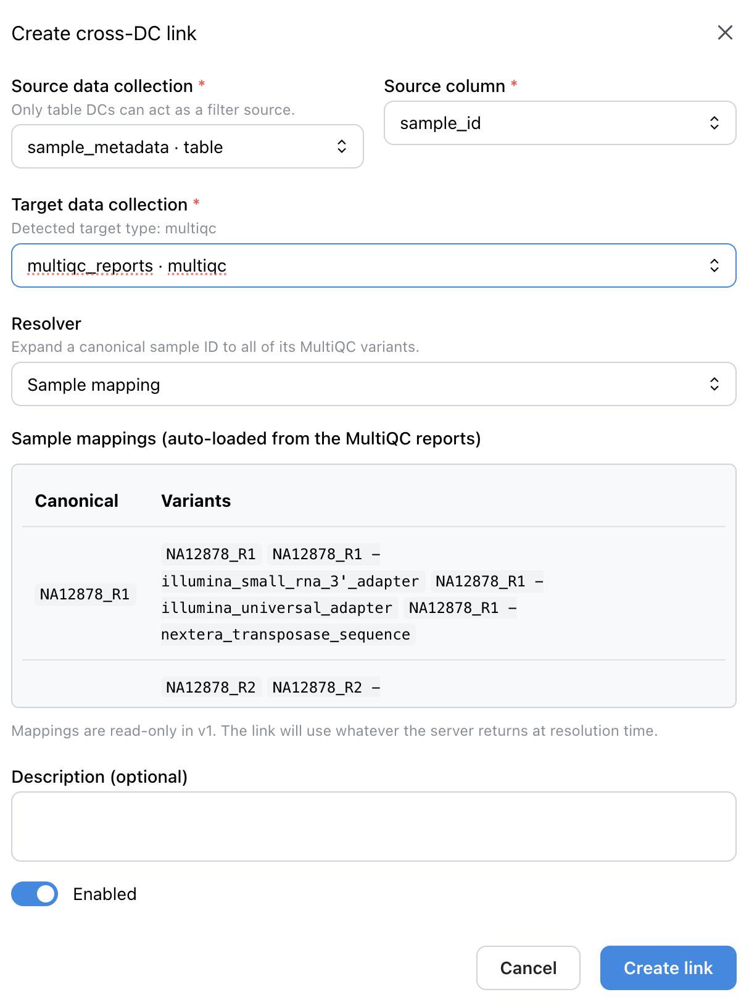
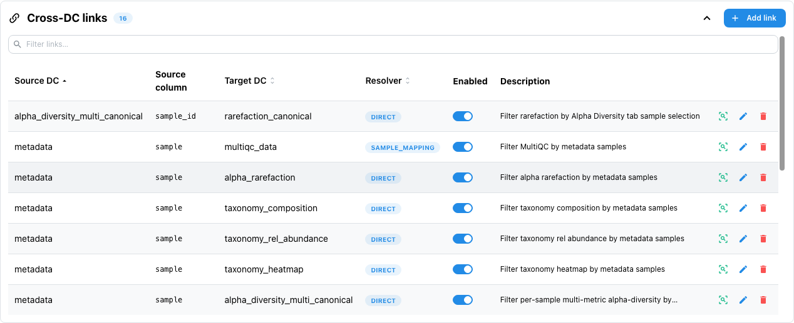
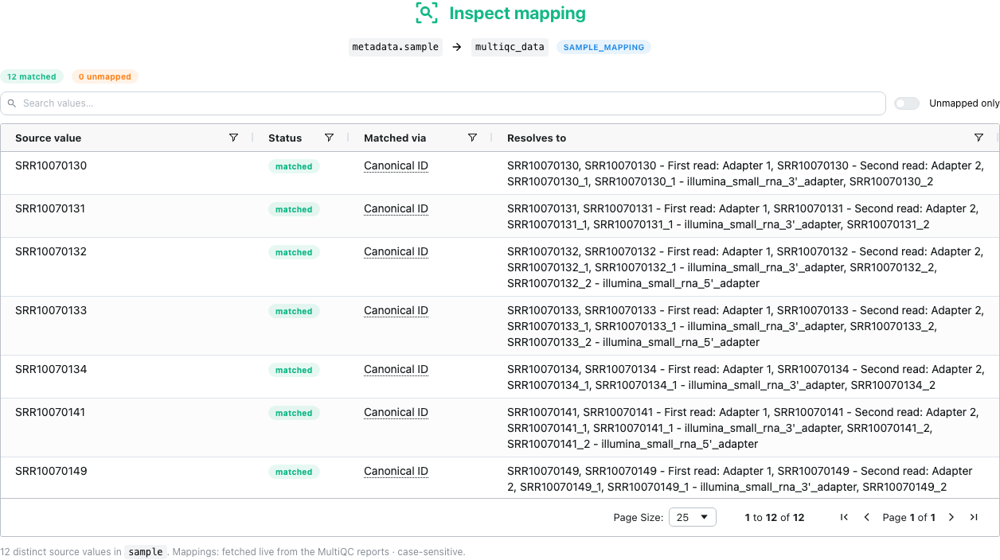

# :material-link-variant: Cross-DC Filtering

Filter data in one collection and automatically update related visualizations—no pre-computed joins needed.

## :material-information-outline: Overview

**Links** connect Data Collections for interactive filtering at runtime. When you filter a metadata table, linked MultiQC plots and other visualizations update automatically.

```text
┌─────────────────┐         ┌─────────────────┐
│  Metadata Table │  link   │  MultiQC Plots  │
│                 │────────▶│                 │
│  [filter here]  │         │  [auto-updates] │
└─────────────────┘         └─────────────────┘
```

## :material-cog-sync: How It Works

1. :material-link-plus: Define a **link** between source DC (e.g., metadata table) and target DC (e.g., MultiQC)
2. :material-filter-plus: Add a filter component to your dashboard
3. :material-sync: When users filter the source DC, linked targets automatically show only matching data

## :material-cog: Configuration

Add links to your project YAML:

```yaml
links:
  - source_dc_id: sample_metadata
    source_column: sample_id
    target_dc_id: multiqc_fastqc
    target_type: multiqc
    link_config:
      resolver: sample_mapping
```

### :material-format-list-checkbox: Link Fields

| Field | Required | Description |
|-------|----------|-------------|
| `source_dc_id` | :material-check: Yes | Data collection containing the filter |
| `source_column` | :material-check: Yes | Column to filter on |
| `target_dc_id` | :material-check: Yes | Data collection to receive filtered values |
| `target_type` | :material-check: Yes | Type of target: `table` or `multiqc` |
| `link_config` | :material-check: Yes | Resolution configuration (see below) |

### :material-cog-outline: Link Config Options

```yaml
link_config:
  resolver: sample_mapping    # Resolution strategy
  target_field: sample_name   # Field to match in target (optional)
```

## :material-map-marker-path: Resolvers

Resolvers map source values to target identifiers:

| Resolver | Use Case | Example |
|----------|----------|---------|
| :material-equal: `direct` | Same value in both DCs | `sample_id` → `sample_id` |
| :material-map: `sample_mapping` | Canonical ID → MultiQC variants | `S1` → `[S1_R1, S1_R2]` |
| :material-regex: `pattern` | Template substitution | `{sample}.bam` |

### :material-help-circle: When to Use Each Resolver

- :material-equal: **`direct`**: Source and target use identical identifiers
- :material-map: **`sample_mapping`**: MultiQC sample names differ from your canonical IDs (most common for MultiQC)
- :material-regex: **`pattern`**: Target uses predictable naming convention

## :material-target: Supported Target Types

| Type | Filter Action | Status |
|------|---------------|--------|
| :material-table: `table` | Filters rows with `WHERE IN` | :material-check: Available |
| :material-microscope: `multiqc` | Filters plot samples | :material-check: Available |
| :material-map-marker-multiple: `map` | Filters map markers | :material-check: Available |
| :material-dna: `jbrowse2` | Shows/hides tracks | :material-clock-outline: Planned |
| :material-image-multiple: `images` | Filters image gallery | :material-clock-outline: Planned |

## :material-code-braces: Complete Example

```yaml
name: "RNA-seq QC Analysis"
project_type: "advanced"

# Define links for cross-DC filtering
links:
  # Link metadata to MultiQC plots
  - source_dc_id: sample_metadata
    source_column: sample_id
    target_dc_id: multiqc_general_stats
    target_type: multiqc
    link_config:
      resolver: sample_mapping

  # Link metadata to expression table
  - source_dc_id: sample_metadata
    source_column: sample_id
    target_dc_id: gene_expression
    target_type: table
    link_config:
      resolver: direct
      target_field: sample_id

workflows:
  - name: "rnaseq_pipeline"
    # ... workflow config ...

    data_collections:
      - data_collection_tag: "sample_metadata"
        config:
          type: "table"
          metatype: "metadata"
          # ... scan config ...

      - data_collection_tag: "multiqc_general_stats"
        config:
          type: "MultiQC"

      - data_collection_tag: "gene_expression"
        config:
          type: "table"
          metatype: "aggregate"
          # ... scan config ...
```

## :material-pencil-box: Managing links from the viewer

Links can be defined in YAML (above) **or** managed interactively from the web viewer. Both paths target the same `links:` data; UI-managed links are persisted alongside YAML-defined ones.

| Action | Where | Notes |
|--------|-------|-------|
| :material-plus: **Create** | DC actions menu → *Manage Links* → *Add link* | Source + target DC, source column, resolver, optional sample mapping |
| :material-pencil: **Edit** | Link row → *Edit* | Updates the resolver config in place |
| :material-delete: **Delete** | Link row → *Delete* | Cascades automatically when the source or target DC is removed |
| :material-magnify: **Inspect** <small>(v1.7.0+)</small> | Link row → *Inspect mapping* | Read-only; shows what each source value actually resolves to |

<figure markdown="span">
  
  <figcaption><em>Create cross-DC link</em> modal — source DC <code>sample_metadata</code>, target DC <code>multiqc_reports</code> (detected as <em>multiqc</em>), <em>Sample mapping</em> resolver, with the auto-loaded MultiQC sample mappings previewed.</figcaption>
</figure>

### :material-magnify: Inspecting what a link resolves to <small>(v1.7.0+)</small> { #mapping-inspector }

A link that silently matches nothing looks exactly like a link that matches everything
until you go looking. Every row in the links table opens a **mapping inspector** from a
magnifier, so reading what a link resolves to no longer means entering the edit form and
risking a change to it.

<figure markdown="span">
  
  <figcaption>The links table for <em>nf-core/ampliseq</em>: source DC, source column, target DC, resolver badge and enabled switch, with the new inspect action leading each row's controls.</figcaption>
</figure>

The inspector runs every distinct source value through the link's *actual* resolver and
reports, per value, whether it matched and by which rule, alongside the target-side
orphans nothing pointed at.

<figure markdown="span">
  
  <figcaption>Twelve matched source values on the <code>metadata.sample</code> → <code>multiqc_data</code> link, each resolving through <em>Canonical ID</em> to the sample name and every MultiQC variant recorded for it.</figcaption>
</figure>

The **Matched via** column names the *lookup rule*, not the shape of the result, and every
label carries a hover explanation:

| Matched via | Meaning |
|-------------|---------|
| :material-key: **Canonical ID** | The source value is a mapping key. A key expands to the canonical ID **plus** every MultiQC variant recorded for it — which is why one value can resolve to a whole list. |
| :material-content-duplicate: **Variant** | The source value is itself one of the recorded variants. |
| :material-scissors-cutting: **Suffix stripped** | Matched after removing a read/lane suffix from the key or from the source value. |
| :material-map-marker-path: `direct`, `pattern`, `regex`, `wildcard` | For links that do not use sample mapping, the resolver's own name. |

Because it only reads, the inspect action stays enabled in **public and demo mode**, where
Edit and Delete are disabled.

!!! tip "If a MultiQC link looks stale"
    A `sample_mapping` link resolves against the report's **live** mappings, not a snapshot
    taken when the link was created, and is stored case-insensitive. Links created before
    v1.7.0 may still carry a frozen snapshot in their config; re-saving one clears it.

## :material-view-dashboard: Dashboard Usage

1. :material-view-dashboard-outline: Create a dashboard with your linked data collections
2. :material-filter-plus: Add a **filter component** (dropdown, multi-select) on the source DC
3. :material-chart-box-outline: Add visualizations for the target DCs
4. :material-filter: Filter the source → targets update automatically

!!! tip "One filter for a whole multi-tab dashboard <small>(v1.6.0+)</small>"
    Put the filter component in a section marked **Show on every tab** and it
    appears in every tab's filter panel, keeping its value as you switch, so the
    targets on each tab are already filtered when you arrive. See
    [Sections on every tab](dashboards.md#persistent-sections).

## :material-compare: Links vs Joins

| Feature | :material-link-variant: Links | :material-table-merge-cells: Joins |
|---------|-------|-------|
| Execution | Runtime (on filter) | Pre-computed (CLI batch) |
| Storage | None | Delta table in S3 |
| Target types | Any (table, MultiQC, ...) | Tables only |
| Use case | Interactive filtering | Combined datasets |

Use **links** for interactive cross-DC filtering. Use **joins** when you need a permanently combined dataset.
