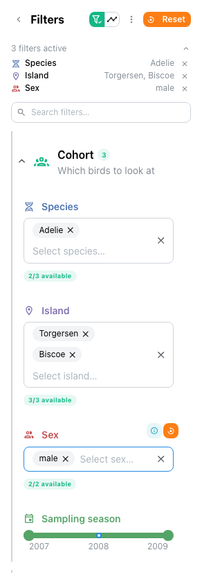
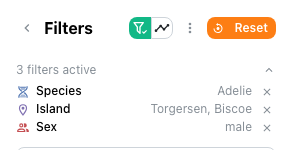
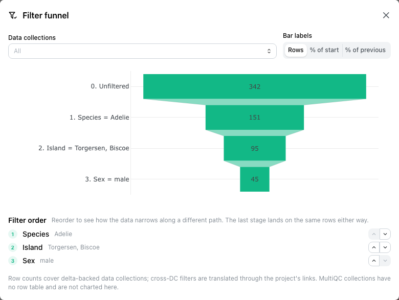
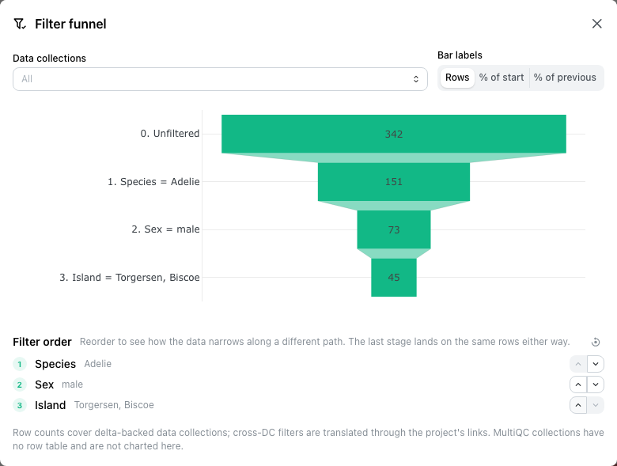
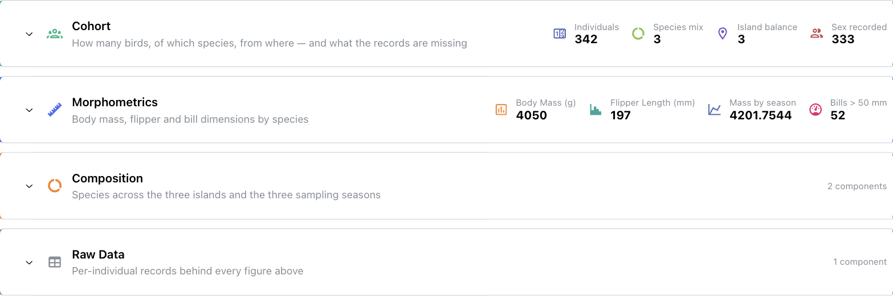
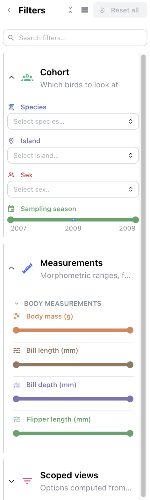
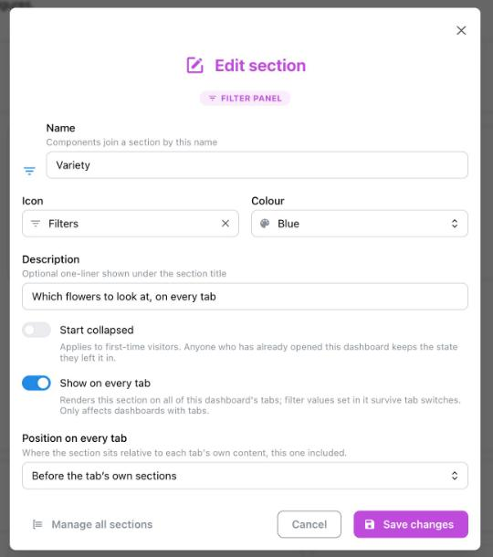
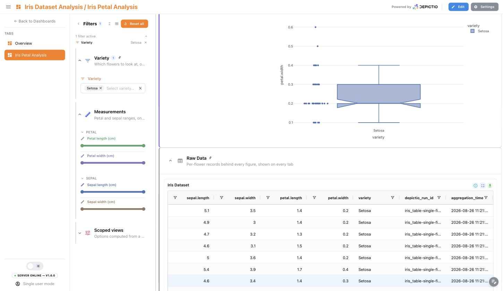
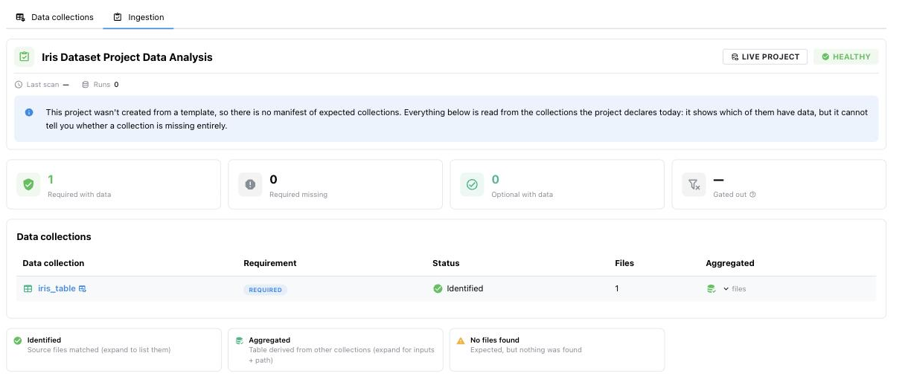

# :material-view-dashboard-variant: Dashboard Features

Depictio dashboards provide flexible, interactive data visualization with multiple modes, customizable layouts, and tabbed organization.

---

## :material-toggle-switch: Dashboard Modes

Depictio provides two distinct modes for working with dashboards:

### :material-eye: Viewer Mode

**URL**: `/dashboard/{id}`

Read-only mode for exploring data:

- :material-chart-line: View and interact with visualizations
- :material-filter: Use filter components to explore data
- :material-download: Export data from tables (v0.6.0+)
- :material-share-variant: Share dashboards with collaborators
- :material-lock: No accidental modifications

### :material-pencil: Editor Mode

**URL**: `/dashboard-edit/{id}`

Full editing capabilities:

- :material-plus-circle: Add, remove, and configure components
- :material-drag: Drag-and-drop component positioning
- :material-resize: Resize components
- :material-tab: Create and manage tabs
- :material-wizard-hat: Access the component builder stepper

---

## :material-view-grid: Three-Panel Layout

The dashboard interface uses a **three-panel layout** with a collapsible sidebar:

```text
┌──────────────────────────────────────────────────────────────────────────┐
│                                Header Bar                                │
├────────┬──────────────────┬──────────────────────────────────────────────┤
│        │   LEFT PANEL     │            RIGHT PANEL                       │
│ Side-  │   (Filters)      │          (Visualizations)                    │
│  bar   │ ┌──────────────┐ │                                              │
│        │ │ 2 active   ▾ │ │                                              │
│ Tab 1  │ └──────────────┘ │  ▾ Cohort                                    │
│ Tab 2  │ ▾ Sample      📌 │  ┌─────────────┐  ┌─────────────┐            │
│ Tab 3  │ ┌──────────────┐ │  │    Card     │  │    Card     │            │
│        │ │ MultiSelect  │ │  └─────────────┘  └─────────────┘            │
│ [+]    │ └──────────────┘ │                                              │
│        │ ▸ Time  (folded) │  ▸ Quality control                  (folded) │
│ [=]    ├──────────────────┤                                              │
│        │ Map dock     (3) │  ▾ Detail                                    │
│        │ ┌──────────────┐ │  ┌─────────────┐  ┌─────────────┐            │
│        │ │  (map here)  │ │  │   Figure    │  │    Table    │            │
│        │ └──────────────┘ │  └─────────────┘  └─────────────┘            │
│        │                  │  ▾ Raw Data                              📌 │
│        │                  │  ┌────────────────────────────────────────┐ │
│        │                  │  │        (shared table, read-only)       │ │
│        │                  │  └────────────────────────────────────────┘ │
└────────┴──────────────────┴──────────────────────────────────────────────┘
```

Both panels can be organised into foldable **sections** <small>(v1.4.0+)</small>, and the
left panel collapses to a narrow rail. `2 active` is the active-filter summary; `(3)` on
the map dock is how many values that map is filtering on. A map can be lifted out of the
grid into that dock, or float above the canvas.

📌 marks a [section shown on every tab](#persistent-sections)
<small>(v1.6.0+)</small>. Here *Sample* filters every tab and keeps its values
across a switch, and *Raw Data* is pinned to the bottom of each one. This tab
declares neither: both arrive from the tab that does.

### :material-tab: Sidebar (Tab Navigation)

The collapsible **sidebar** on the far left provides:

- :material-view-dashboard: **Dashboard tabs** - Navigate between different views within the same dashboard
- :material-playlist-edit: **Tab management** - Add (+), rename, or delete tabs
- :material-menu: **Burger menu** (☰) - Collapse/expand the sidebar
- :material-cog: **Navigation controls** - Quick access to project settings
- :material-image-outline: **Logo** <small>(v1.8.0+)</small> - Centred at the bottom: the dashboard's own upload, the instance logo it inherits, or nothing. See [Appearance](../usage/guides/dashboard_usage.md#appearance)

Long tab names truncate rather than overflow, with the full name in a tooltip when it is actually cut off.

### :material-filter-variant: Left Panel (Filters)

The **left panel** contains interactive filter components:

- :material-tune: **Filter controls** that affect visualizations in the right panel
- :material-gesture-tap: **Automatic assignment** - Interactive components go here by default
- :material-grid: **Independent grid** - Drag and resize filters within this panel

Since **v1.4.0** the editor and the viewer draw the same panel, so the order you drag
filters into while editing is the order a viewer sees:

- :material-arrow-collapse-left: **Collapses to a rail** - 44px wide rather than nothing, so the active-filter count stays on screen. A dashboard showing filtered numbers must never look like it is showing everything.
- :material-arrow-split-vertical: **Resizable** - drag the panel's edge; the width is remembered per dashboard and the grid re-lays out to match.
- :material-format-list-bulleted: **Active-filter summary** - applied filters are listed above the controls as an aligned label/value list, each row carrying its own control's icon and accent, with a per-row clear. The list folds to a single line and its state persists per dashboard.
- :material-cellphone: **Drawer on narrow screens** - the panel becomes an overlay rather than stealing canvas width.

### :material-filter-check: Funnel filtering <small>(v1.7.0+)</small> { #funnel-filtering }

A filter panel usually shows every value a column ever had, whether or not picking it
would leave anything on screen. **Funnel filtering** answers the other question: given
everything else you have already picked, which of these values still lead somewhere?

For each control, the answer is computed against every **other** active filter, with that
control's own selection excluded, since otherwise a control would grey out everything it
did not itself select. Values that can still narrow the data carry a teal marker; values
that would return nothing are dimmed, disabled and sorted last, and each control carries
an `n/N available` badge that turns orange when nothing remains.

<div style="border: 1px solid grey; width: 294px; padding: 1px;">
    <a href="../../images/guides/funnel-filtering/funnel-panel-highlighting.png" target="_blank">
        
    </a>
</div>

The Palmer Penguins filter set with funnelling on: *Species*, *Island* and *Sex* each
state how many of their values are still live.

The panel header carries the two funnel controls as one attached pair: the toggle, and the
overview beside it. The overview button stays mounted but disabled while funnelling is off,
so switching it on does not reflow the header.

<div style="border: 1px solid grey; width: 294px; padding: 1px;">
    <a href="../../images/guides/funnel-filtering/funnel-panel-header.png" target="_blank">
        
    </a>
</div>

#### :material-filter-multiple: The funnel overview

The overview charts the restriction the filters apply *as a whole*: one band per filter,
starting at the unfiltered row count and narrowing as each is applied. Every delta-backed
data collection gets its own bar in each band, side by side, so a filter that guts one
collection while leaving another untouched is visible at a glance. Bars can be labelled
with rows, percent of start, or percent of the previous stage.

<div style="border: 1px solid grey; width: 602px; padding: 1px;">
    <a href="../../images/guides/funnel-filtering/funnel-overview-modal.png" target="_blank">
        
    </a>
</div>

The stage order is editable, because the intermediate counts depend on the order the
filters are applied in, and only the intermediate ones do.

<div style="border: 1px solid grey; width: 602px; padding: 1px;">
    <a href="../../images/guides/funnel-filtering/funnel-overview-reordered.png" target="_blank">
        
    </a>
</div>

The same three filters with *Sex* moved ahead of *Island*: the middle stage reads 73
instead of 95, while the last still lands on 45 rows, because an intersection does not
care about sequence. That invariant is precisely what makes the middle of the funnel the
interesting part: it tells you which filter is doing the work, and reordering is how you
find out.

!!! note "Scope and defaults"
    Funnel filtering is **on by default**: knowing which values still lead somewhere is
    rather the point of a filter panel, so authors opt out rather than in. The author-level
    default is a switch in the editor's settings drawer, stored on the dashboard as
    `funnel_filtering` and round-tripping through [YAML Sync](yaml-sync.md#funnel-filtering);
    the button in the filter panel flips it for your page view only and writes nothing, so
    viewers without edit rights can still turn it off.

    In this first version the live availability sets cover **categorical controls**
    (multi-select, select, segmented control); sliders and date pickers are untouched. The
    overview counts delta-backed data collections, so MultiQC collections, which have no
    row table, do not appear. Caps: 32 controls, 12 stages, 1000 values per control.

### :material-chart-box: Right Panel (Visualizations)

The **right panel** is the main canvas where visualization components are displayed:

- :material-drag: **Dragged** to reposition
- :material-resize: **Resized** by dragging edges/corners
- :material-cog-outline: **Configured** through component edit menus
- :material-link-variant: **Cross-panel filtering** - Responds to filters from the left panel
- :material-view-sequential: **Grouped into sections** (v1.4.0+) - `grid_sections` splits the canvas into named, foldable boxes; see [Sections](#sections) below

Available component types include:

| Component Type                              | Description                                    |
| ------------------------------------------- | ---------------------------------------------- |
| :material-chart-scatter-plot: **Figures**   | Interactive charts and visualizations          |
| :material-table: **Tables**                 | Data tables with filtering and pagination      |
| :material-card-text: **Cards**              | Summary statistics and KPIs                    |
| :material-tune: **Interactive Filters**     | Dropdowns, sliders, and other controls         |
| :material-format-header-1: **Text/Headers** | Section headers (H1, H2, H3)                   |
| :material-map-marker-multiple: **Maps**     | Geospatial scatter, density and choropleth maps |
| :material-microscope: **MultiQC**           | Quality control report visualizations          |
| :material-image: **Images**                 | Display grid of static images (PNG, JPEG, SVG) |

A map can also leave the grid entirely and become a dashboard-wide panel that follows the
viewer across every tab. See [Components](components.md#dashboard-wide-map-panel).

!!! note "Future Components"
    Additional component types may be added in future releases based on user needs and feedback (Network Graphs, JBrowse2).

### :material-view-sequential: Sections <small>(v1.4.0+)</small> { #sections }

Both panels can be grouped into named, foldable **sections**, each with its own icon,
colour, description and default state. `grid_sections` organises the main canvas and
`filter_sections` the left panel; a component joins one by naming it in its `section`
field. See [YAML Sync](yaml-sync.md#dashboard-sections) for the schema.

The two panels draw sections differently on purpose. The grid uses a box; the filter panel
uses a rail and an indent, because at panel width a box would spend its border and padding
on the very filters it is meant to organise.

Folding is not just visual: a folded section fetches nothing until you open it. It still
reports itself, though: a folded grid section of cards shows their numbers inline, and any
other section shows a component count. A folded filter section keeps the count of active
filters inside it.

<div style="border: 1px solid grey; width: 602px; padding: 1px;">
    <a href="../../images/guides/dashboards/sections_folded.png" target="_blank">
        
    </a>
</div>

Four folded grid sections: *Cohort* and *Morphometrics* hold cards, so their
numbers ride along on the header; *Composition* and *Raw Data* hold figures and
a table, so they report a component count instead.

<div style="border: 1px solid grey; width: 302px; padding: 1px;">
    <a href="../../images/guides/dashboards/filter_sections.png" target="_blank">
        
    </a>
</div>

The same dashboard's filter panel, drawn with a rail and an indent rather than a
box. *Cohort* and *Measurements* are open, *Scoped views* is folded.

Folding is remembered per viewer, in the browser: it is not part of the
dashboard, so collapsing a section you are reading never changes what anyone
else sees. A section that lives on every tab is remembered once for the whole
dashboard rather than per tab, so it does not unfold as you move between them.

### :material-pin: Sections on every tab <small>(v1.6.0+)</small> { #persistent-sections }

A section normally belongs to the tab that declares it. Switch on **Show on
every tab** and it belongs to the dashboard instead, which is what a filter
everyone needs, or one table every tab refers back to, actually wants. A pin
rides on the section header wherever it is drawn, so it is clear the section is
shared rather than a copy someone made on each tab.

The two panels use it differently:

- :material-view-grid: a **grid section** renders on every other tab as well,
  read-only there. Its components cannot be dragged, resized or deleted from a
  tab that does not own them, and they never enter that tab's saved layout.
- :material-filter-variant: a **filter section**'s controls join every tab's
  filter panel as ordinary controls, and **the values you pick in them survive a
  tab switch**. Switching tabs loads a new page, so this is a real change: before
  v1.6.0 a variety picked on one tab was gone on the next, and a filter you
  wanted everywhere had to be rebuilt on every tab.

**Position on every tab** decides whether the shared section leads or trails each
tab's own content: *before* suits a filter, *after* suits reference material
like a raw-data table, which would otherwise push every tab's own introduction
down the page. The choice applies on all tabs, the owning one included, so the
section keeps the same place wherever you land.

<div style="border: 1px solid grey; width: 542px; padding: 1px;">
    <a href="../../images/guides/dashboards/sections_every_tab_dialog.png" target="_blank">
        
    </a>
</div>

The bundled Iris demo's *Variety* filter section. **Position on every tab**
appears only once **Show on every tab** is on.

<div style="border: 1px solid grey; width: 602px; padding: 1px;">
    <a href="../../images/guides/dashboards/sections_every_tab.png" target="_blank">
        
    </a>
</div>

The same dashboard's second tab, *Iris Petal Analysis*, which declares neither
section. *Variety* arrives in its filter panel still holding the **Setosa**
picked on the first tab, so the figures and the pinned *Raw Data* table below
them are already narrowed to that variety. Both headers carry the pin.

Editing stays with the tab that declares the section. From anywhere else the
section's menu offers a jump to that tab rather than controls that would not
work. In edit mode the section is still drawn where it will appear, so you can
see the space it takes on the tab you are laying out.

!!! note "What carries across a tab switch, and what does not"
    Only two things are carried: selections made in a **floating map** (which
    already were, before v1.6.0) and the values of controls **inside a persistent
    filter section**. A selection made by clicking a chart or picking table rows
    is not, nor is any ordinary per-tab control.

    Carried values are held for the browser tab you are working in, so they are
    gone when you close it and never leak into someone else's visit. They are
    also dropped if the control they belong to has since been pointed at another
    data collection or column, rather than being replayed against data they no
    longer describe.

Persistent sections do nothing on a dashboard with a single tab. See
[YAML Sync](yaml-sync.md#persistent-sections) for the `persistent` and `pin`
keys.

---

## :material-tab-plus: Dashboard Tabs

Organize complex dashboards with **tabs** (v0.6.0+):

### :material-navigation: Tab Navigation

- :material-format-list-bulleted: Tabs are displayed **vertically** in the collapsible left navbar
- :material-cursor-default-click: Click a tab name to switch views
- :material-menu: The navbar can be **collapsed** using the burger menu icon
- :material-view-dashboard-outline: Each tab lays out its own components, apart from any [section shown on every tab](#persistent-sections)

### :material-star: Tab Features

- :material-tab-plus: **Multiple Tabs**: Create multiple views within a single dashboard
- :material-emoticon: **Custom Icons**: Material Design icons for visual identification
- :material-palette: **Custom Colors**: Match your organization's theme
- :material-view-grid-outline: **Own Layouts**: Each tab arranges its own components, and a tab cannot rearrange a section another tab shares with it
- :material-cog-sync: **Shared Settings**: Theme and permissions apply across all tabs, as do [sections marked *Show on every tab*](#persistent-sections) and the filter values set in them

### :material-creation: Creating a Tab

1. :material-plus-circle: Click **"+ New Tab"** in the navbar
2. :material-form-textbox: Enter a **tab name**
3. :material-emoticon-outline: Select an **icon** from the dropdown
4. :material-palette-outline: Choose an **icon color**
5. :material-check: Click **Create**

<!-- ### :material-tools: Tab Operations

| Operation                                      | Description                     |
| ---------------------------------------------- | ------------------------------- |
| :material-plus: **Add Tab**                    | Create a new empty tab          |
| :material-pencil: **Rename Tab**               | Change the tab's display name   |
| :material-delete: **Delete Tab**               | Remove a tab and its components |
| :material-reorder-horizontal: **Reorder Tabs** | Drag tabs to change their order | -->

---

## :material-content-save-outline: Auto-Save Behavior

Depictio automatically saves certain changes to prevent data loss. Understanding what is and isn't auto-saved helps you work more effectively.

### :material-content-save-check: What IS Auto-Saved

| Action                                        | Description                                                               |
| --------------------------------------------- | ------------------------------------------------------------------------- |
| :material-plus-circle: **Component Creation** | Adding new components to the dashboard                                    |
| :material-pencil: **Component Edition**       | Modifying component configuration (data source, visualization type, etc.) |
| :material-delete: **Component Deletion**      | Removing components from the dashboard                                    |
| :material-tab: **Tab Operations**             | Creating, renaming, or deleting tabs                                      |

### :material-content-save-alert: What is NOT Auto-Saved

| Action                                              | Description                                                 |
| --------------------------------------------------- | ----------------------------------------------------------- |
| :material-drag-variant: **Layout Positions**        | Dragging components to new positions requires manual save   |
| :material-filter-off: **Interactive Filter Values** | Filter selections are never saved to the dashboard. Most reset on reload; values set in a [section shown on every tab](#persistent-sections) are carried across tab switches for as long as the browser tab is open |
| :material-resize: **Component Resize**              | Resizing components requires manual save                    |

!!! tip "Saving Layout Changes"
After repositioning or resizing components, use the **Save Layout** button in the dashboard toolbar to persist your layout changes.

---

## :material-clipboard-check-outline: Ingestion Report & Health

Every project carries an **ingestion report**, answering "did all the data this dashboard
needs actually land?" at a glance. What it can compare against depends on where the
project came from, and since **v1.6.0** a badge in the report header says which of the two
you are reading:

- :material-file-document-check: **Template manifest** — the project was created from a
  [pipeline template](../pipeline-templates/README.md) by `depictio-cli run --template`,
  which froze the list of data collections the template *expected*. The report compares
  that list against what was actually found and aggregated during the scan.
- :material-database-eye: **Live project** — there is no such list, so the report is read
  from the collections the project declares today. It tells you which of them have data;
  it cannot tell you a collection is missing entirely, because nothing recorded that it
  was ever expected.

!!! note "Templates seeded at first boot read as *Live project*"
    The nf-core projects a fresh deployment seeds for you carry no manifest. Only a
    project you create yourself with `depictio-cli run --template` does.

### :material-magnify: What the report shows

The report lists every expected data collection with a status:

| Status | Meaning |
| --- | --- |
| :material-check-circle:{ style="color: #2e7d32" } **Identified** | Included in this configuration and files were found and/or aggregated. |
| :material-alert-circle:{ style="color: #ef6c00" } **Found zero** | Included but nothing matched — no files identified and not aggregated. |
| :material-minus-circle:{ style="color: #757575" } **Gated out** | Intentionally excluded by a template conditional or missing-file prune (not a gap). |

Expand a row to see its files (or the Delta-table path once aggregated), and filter or
group rows by status.

Reading a **Live project**, the report drops what it cannot honestly state: **Gated out**
shows `—` rather than `0`, since only a manifest records what a conditional excluded, and
the required and optional tiles count the collections that have data without a total to
measure them against.

<div style="border: 1px solid grey; width: 602px; padding: 1px;">
    <a href="../../images/guides/dashboards/ingestion_live_project.png" target="_blank">
        
    </a>
</div>

The report for a project never built from a template. Before v1.6.0 this tab was not
offered at all, though the report behind it worked.

### :material-heart-pulse: Health status & banner

The report rolls up into a single project **health** value:

- :material-check:{ style="color: #2e7d32" } **ok** — every required collection was identified.
- :material-alert:{ style="color: #ef6c00" } **partial** — some optional collections are missing.
- :material-close-octagon:{ style="color: #c62828" } **missing required** — a required collection is missing or empty.

When a template-derived dashboard is missing or only partially has a required collection,
a dismissible **health banner** appears above the dashboard. The full report is reachable
from any project's **Ingestion** tab on its [project page](../usage/guides/web_ui.md), and
from the **View ingestion report** row in a dashboard's settings drawer.

---

## :material-share-variant: Sharing Dashboards

### :material-shield-account: Permissions

Dashboards inherit permissions from their project:

| Role                              | View                 | Edit                 | Delete               |
| --------------------------------- | -------------------- | -------------------- | -------------------- |
| :material-shield-crown: **Admin** | :material-check: Yes | :material-check: Yes | :material-check: Yes |
| :material-shield-edit: **Editor** | :material-check: Yes | :material-check: Yes | :material-close: No  |
| :material-shield-eye: **Viewer**  | :material-check: Yes | :material-close: No  | :material-close: No  |

### :material-link: Sharing URLs

- :material-eye: **Viewer URL**: `/dashboard/{id}` - Safe to share with collaborators
- :material-pencil: **Editor URL**: `/dashboard-edit/{id}` - Only for authorized editors

### :material-application-brackets: Embedding (Planned)

Future support for embedding dashboards in external sites via iframe.
