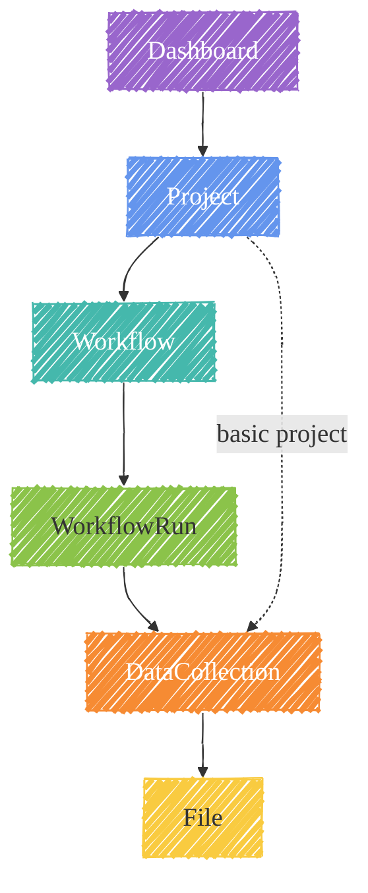
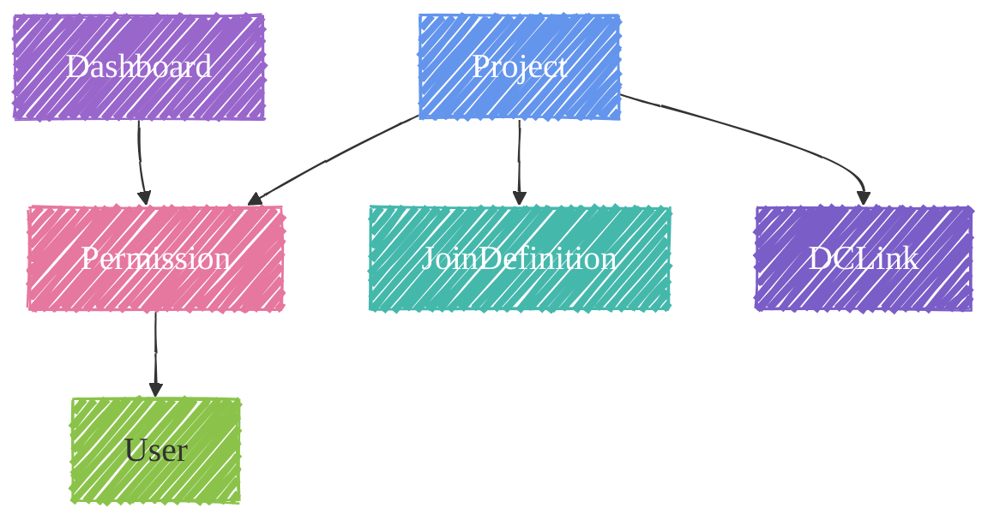

# :material-database-outline: Data Model

Depictio's object model is designed to reflect **production-oriented, FAIR-compliant workflows**. The hierarchy mirrors how pipelines actually run: a project contains workflows, each workflow execution produces files, and those files are aggregated into typed data collections that power interactive dashboards.

---

## Object Hierarchy

The core chain of objects, from the user-facing dashboard down to individual files:

The dashed arrow shows the shortcut for **basic projects**: DataCollections can attach directly to the project, skipping the Workflow and WorkflowRun layers.

The remaining domain objects attach to the hierarchy as support structures:

---

## Core Objects

### Project

The **top-level container** for all related pipelines and visualizations.

| Field | Description |
|-------|-------------|
| `name` | Human-readable project identifier |
| `project_type` | `basic` or `workflow` |
| `workflows` | List of associated Workflow objects |
| `data_collections` | DataCollections for basic projects |
| `joins` | JoinDefinition list for cross-DC merging |
| `links` | DCLink list for cross-DC filter propagation |
| `permissions` | Embedded Permission object (owners/editors/viewers) |
| `is_public` | Whether the project is publicly accessible |

---

### Workflow

Represents a **standardised production pipeline** (Nextflow, Snakemake, or custom).

| Field | Description |
|-------|-------------|
| `name` | Workflow identifier |
| `engine` | Pipeline engine (`nextflow`, `snakemake`, etc.) |
| `catalog` | External pipeline registry reference (e.g., nf-core) |
| `data_collections` | DataCollections produced by this workflow |
| `runs` | List of WorkflowRun instances |

Multiple workflows can belong to a single project, enabling multi-omics or multi-pipeline dashboards (e.g., combining [nf-core/rnaseq](https://nf-co.re/rnaseq) and [nf-core/atacseq](https://nf-co.re/atacseq) outputs).

---

### WorkflowRun

A **single execution instance** of a workflow.

| Field | Description |
|-------|-------------|
| `run_tag` | Unique tag identifying this execution |
| `start_time` / `end_time` | Execution timestamps |
| `file_count` | Number of output files generated |
| `scan_stats` | Metadata from the file-scan step |

Files produced by each run share a consistent structure across runs, making them suitable for aggregation into DataCollections.

---

### DataCollection

An **aggregated view of output files** from one or more runs, typed by content.

| Type | Description |
|------|-------------|
| `table` | Tabular data (CSV/TSV/Parquet → Delta Lake) |
| `multiqc` | MultiQC JSON report files |
| `image` | Image files (PNG, SVG, …) |

DataCollections also carry a **source** attribute describing how they were created:

| Source | Description |
|--------|-------------|
| `NATIVE` | Directly scanned from workflow output files |
| `JOINED` | Derived by merging two or more native DCs via a JoinDefinition |
| `AGGREGATED` | Combined from multiple DCs across runs or projects |

---

### File

An **individual artifact** produced by a workflow run.

| Field | Description |
|-------|-------------|
| `filename` | File name |
| `file_hash` | Content hash for deduplication |
| `filesize` | Size in bytes |
| `data_collection_id` | Parent DataCollection reference |
| `run_id` | Parent WorkflowRun reference |

---

### Dashboard

A **visualization container** linked to a project, composed of draggable components.

| Field | Description |
|-------|-------------|
| `title` | Dashboard name |
| `project_id` | Reference to parent Project |
| `tabs` | Optional tab grouping of components |
| `permissions` | Embedded Permission (may differ from project) |

Dashboards support tabbed layouts, allowing a single dashboard to present multiple analytical views of the same underlying data.

---

### User

| Field | Description |
|-------|-------------|
| `email` | Unique user identifier |
| `is_admin` | Whether the user has admin privileges |
| `is_anonymous` | Whether the user is unauthenticated (anonymous access mode) |

Access control is enforced through `Permission` objects embedded in Projects and Dashboards.

---

## Relationship Models

### Permission

Permissions are **embedded** in Projects, Dashboards, and Files. They define a three-tier access model:

| Tier | Can do |
|------|--------|
| **owners** | Full control — edit, share, delete |
| **editors** | Modify dashboard content, run data updates |
| **viewers** | Read-only access to dashboards and data |

---

### JoinDefinition

Defines **how two DataCollections are merged** to produce a JOINED DataCollection.

| Field | Description |
|-------|-------------|
| `on_columns` | Column(s) used as join key(s) |
| `join_type` | `inner`, `left`, `outer`, etc. |
| `granularity` | Row-level or aggregation granularity |
| `persist` | Whether the join result is materialised in storage |

---

### DCLink

Controls **cross-DC filter propagation** — when a user selects a value in one component, DCLinks determine which other DataCollections are filtered accordingly.

| Field | Description |
|-------|-------------|
| `source_dc` | DataCollection whose selection triggers the link |
| `target_dc` | DataCollection that receives the filter |
| `resolver` | Strategy for mapping source values to target |

**Resolver strategies:**

| Strategy | When to use |
|----------|-------------|
| `direct` | Shared column with identical values |
| `sample_mapping` | Lookup table maps source → target identifiers |
| `pattern` | String pattern extraction (e.g., strip suffix) |
| `regex` | Regex-based value transformation |
| `wildcard` | Glob-style matching across identifiers |

---

## MongoDB Collections

| Collection | Domain Object | Key Fields |
|------------|--------------|------------|
| `projects` | Project | name, workflows (embedded), permissions, joins, links |
| `runs` | WorkflowRun | creation_time, files_id, last_modification_time |
| `files` | File | filename, file_hash, file_location, data_collection_id |
| `deltatables` | DataCollection — table | data_collection_id, delta_table_location, aggregation |
| `multiqc` | DataCollection — multiqc | data_collection_id, metadata |
| `dashboards` | Dashboard | dashboard_id, description, permissions |
| `users` | User | email, is_admin, is_anonymous |
| `tokens` | Auth token | access_token, expire_datetime |

---

## Related Documentation

- :material-sitemap: [Architecture](architecture.md) — Microservices stack and data flow
- :material-filter: [Cross-DC Filtering](cross-dc-filtering.md) — DCLink resolver strategies in depth
- :material-sync: [YAML Dashboard Sync](yaml-sync.md) — Declarative dashboard export/import
- :material-code-braces: [Contributing](../developer/contributing.md) — How to extend the platform
