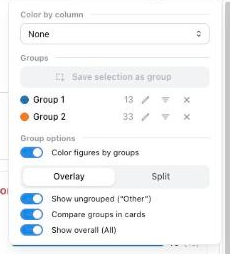
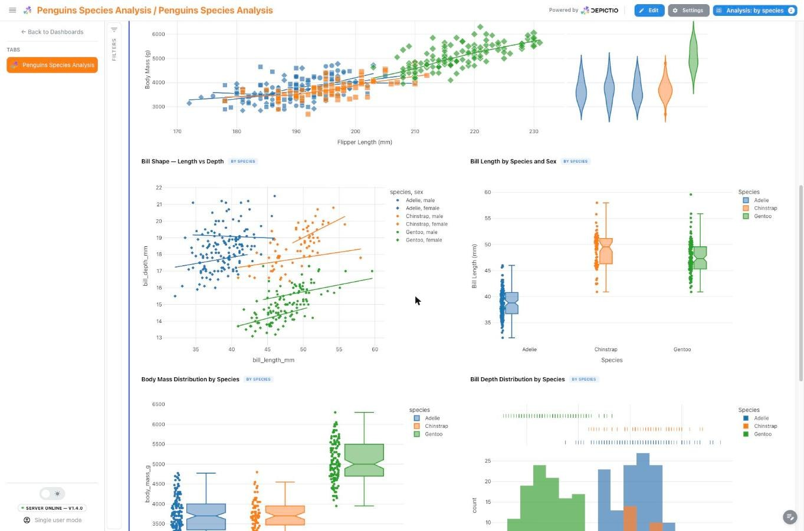
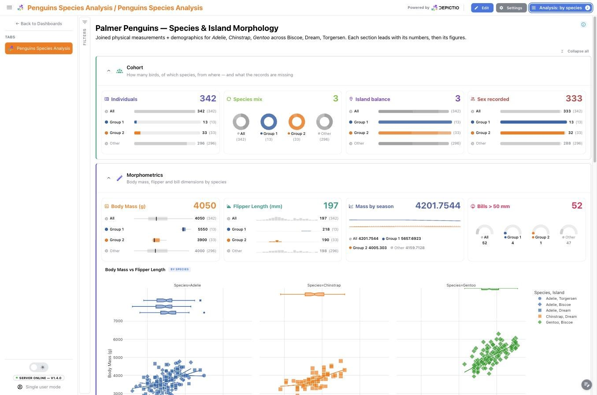
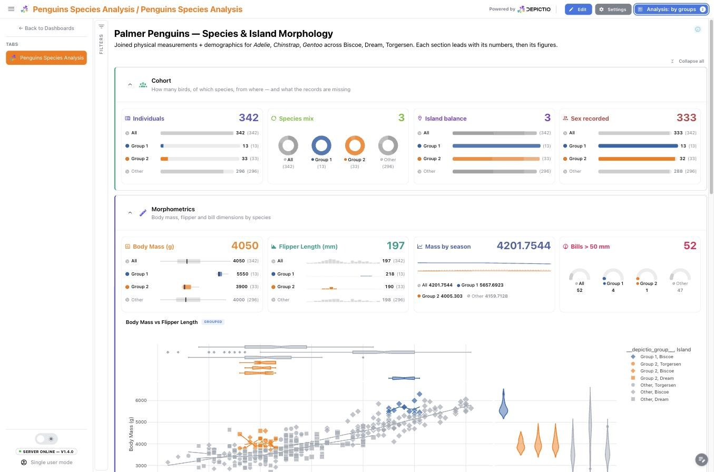

# :material-selection-drag: Interactive Selection Filtering

Filter dashboard components by selecting points on scatter plots or rows in tables—no pre-configuration needed.

## :material-information-outline: Overview

**Interactive Selection Filtering** extends the filtering system beyond traditional dropdowns and sliders. You can now:

- :material-chart-scatter-plot: **Lasso or box-select** points on scatter plots
- :material-gesture-tap: **Click** individual points on scatter plots
- :material-table-row: **Select rows** in AG Grid tables
- :material-map-marker-multiple: **Lasso or click** markers on scatter maps

Selected values automatically filter other components on the same Data Collection.

```text
┌─────────────────────┐         ┌─────────────────────┐
│  Scatter Plot       │         │  Image Gallery      │
│                     │         │                     │
│  [lasso select]     │────────▶│  [auto-filters]     │
│  ○ ○ ● ● ○         │         │  [shows 2 images]   │
└─────────────────────┘         └─────────────────────┘
```

## :material-chart-scatter-plot: Scatter Plot Selection

### Selection Modes

| Mode | Action | Result |
|------|--------|--------|
| :material-selection-drag: **Lasso** | Draw freeform shape around points | Select all enclosed points |
| :material-selection: **Box** | Draw rectangle around points | Select all enclosed points |
| :material-cursor-default-click: **Click** | Click individual point | Select single point |

### Enabling Selection

Add these properties to your figure component:

```yaml
components:
  - tag: quality-scatter
    component_type: figure
    workflow_tag: python/my_workflow
    data_collection_tag: sample_data
    visu_type: scatter
    dict_kwargs:
      x: category
      y: quality_score
      color: category
    # Enable selection filtering
    selection_enabled: true
    selection_column: sample_id
```

### Configuration Options

| Option | Required | Description |
|--------|----------|-------------|
| `selection_enabled` | :material-check: Yes | Enable selection filtering (`true`/`false`) |
| `selection_column` | :material-check: Yes | Column to extract from selected points for filtering |

!!! tip "Selection Column"
    The `selection_column` should contain unique identifiers (e.g., `sample_id`) that exist in other components' data. This enables cross-component filtering.

### Using Selection in the Dashboard

1. :material-pencil: Enable **Edit Mode** and add a scatter plot with `selection_enabled: true`
2. :material-eye: Switch to **View Mode**
3. :material-selection-drag: Use the toolbar to select **Lasso** or **Box Select** mode
4. :material-gesture-tap: Draw a selection around points or click individual points
5. :material-filter: Other components automatically filter to show only selected samples

### Reset Selection

Click the :material-refresh: **Reset** button on the scatter plot to clear the selection and show all data.

---

## :material-table: Table Row Selection

### Enabling Row Selection

Add these properties to your table component:

```yaml
components:
  - tag: samples-table
    component_type: table
    workflow_tag: python/my_workflow
    data_collection_tag: sample_data
    page_size: 10
    # Enable row selection filtering
    row_selection_enabled: true
    row_selection_column: sample_id
```

### Configuration Options

| Option | Required | Description |
|--------|----------|-------------|
| `row_selection_enabled` | :material-check: Yes | Enable row selection filtering (`true`/`false`) |
| `row_selection_column` | :material-check: Yes | Column to extract from selected rows for filtering |

### Using Row Selection

1. :material-table-row: Click rows in the table to select them
2. :material-checkbox-multiple-marked: Hold `Ctrl`/`Cmd` to select multiple rows
3. :material-filter: Other components automatically filter to show selected samples

### Reset Selection

Click the :material-refresh: **Reset** button on the table to clear row selection.

---

## :material-map-marker-multiple: Map Selection

Scatter maps support the same selection modes as scatter plots (lasso, box, click). Add `selection_enabled` and `selection_column` to a map component:

```yaml
- tag: sampling-map
  component_type: map
  workflow_tag: python/my_workflow
  data_collection_tag: sample_metadata
  lat_column: latitude
  lon_column: longitude
  color_column: biome
  selection_enabled: true
  selection_column: sample_id
```

Selected markers dim unselected points and filter other components on the same Data Collection. Choropleth maps do not support selection.

---

## :material-select-group: Selection groups <small>(v1.7.0+)</small> { #selection-groups }

A selection is normally a passing thing: draw the next one and the first is gone. **Save
it as a group** and it becomes something you can name, colour and come back to.

Any component holding a live selection offers **Save selection as group** in its hover
chrome. The group takes a name and a colour, both editable later, and saving clears the
source selection so the component is free for the next one. Once saved, a group can be:

- :material-filter: **toggled as a filter**, narrowing the dashboard like any ordinary
  control. Groups project into the same filter machinery as everything else, so cross-DC
  links resolve through them and an active group appears as a removable row in the
  active-filter summary;
- :material-palette: **used to colour every figure**, so several groups are visible at
  once rather than one at a time;
- :material-card-text: **compared in the cards**, which is where a group stops being a
  filter and becomes a cohort.

!!! info "Where groups live"
    Groups are held in your browser, scoped to the **dashboard family**, so they survive a
    tab switch and are still there on your next visit. They are yours alone: saving one
    changes nothing for anyone else looking at the same dashboard, and nothing is written
    to the dashboard document. Sharing groups is a follow-up.

### :material-tune-variant: The Analysis panel { #analysis-panel }

One **Analysis** popover in the dashboard header drives all of it, in three sections:
**Color by column**, **Groups**, and **Group options**. Its **Reset** restores the
defaults while keeping your saved groups.

<div style="border: 1px solid grey; width: 232px; padding: 1px;">
    <a href="../../images/guides/selection-groups/analysis_panel.png" target="_blank">
        
    </a>
</div>

While analysis mode is engaged, any component that can feed a group (a scatter figure, a
table, a map, an image gallery) is outlined and marked, so it is clear where a selection
is worth making before you make one.

### :material-palette-swatch: Colouring every figure at once

**Color by column** recolours every figure whose dataset carries that column, from one
stable palette, so a category keeps its colour across figures and survives filtering.
Each recoloured figure carries a `by <column>` badge.

<div style="border: 1px solid grey; width: 602px; padding: 1px;">
    <a href="../../images/guides/selection-groups/color_by_species.jpg" target="_blank">
        
    </a>
</div>

**Split** draws one panel per category instead of overlaying them, capped at 12. Where the
number of categories cannot be known ahead of time, both client and server fall back to an
overlay rather than faceting an unbounded column.

<div style="border: 1px solid grey; width: 602px; padding: 1px;">
    <a href="../../images/guides/selection-groups/split_by_species.jpg" target="_blank">
        
    </a>
</div>

Colouring by a column and comparing groups in cards are two ways of grouping the same
screen, so they are mutually exclusive: pick a column and card comparison is suspended,
its toggle disabled and its value kept for when you clear the column again.

### :material-compare-horizontal: Comparing groups in the cards

With **Compare groups in cards** on, each card reduces its hero aggregation once per group
and draws the results side by side in the group's colour, as meters, mini donuts, slim box
plots, sparkbars, gauge dials or a trend overlay depending on the layout. The scales come
from the whole frame rather than from each group, so the shapes are genuinely comparable.
Two optional references sit alongside: **All**, the unsplit frame, and **Other**, the rows
in no group.

<div style="border: 1px solid grey; width: 602px; padding: 1px;">
    <a href="../../images/guides/selection-groups/overview_groups_compare.jpg" target="_blank">
        
    </a>
</div>

Two saved groups on the bundled Penguins dashboard, with every card comparing them: the
neutral *All* reference leads, and the ungrouped rows trail as a dimmed *Other*.

---


## :material-link-variant: How It Works

Selection filtering integrates with the existing interactive filtering system:

```text
┌─────────────────────────────────────────────────────────────┐
│                 interactive-values-store                     │
├─────────────────────────────────────────────────────────────┤
│  [                                                          │
│    {index: "dropdown-1", value: ["A", "B"], source: null},  │
│    {index: "scatter-1", value: ["S1", "S2"],                │
│     source: "scatter_selection"},                           │
│    {index: "table-1", value: ["S3"],                        │
│     source: "table_selection"},                             │
│  ]                                                          │
└─────────────────────────────────────────────────────────────┘
                              │
                              ▼
           ┌──────────────────┴──────────────────┐
           │         All Components Filter        │
           │  (cards, figures, tables, images)   │
           └─────────────────────────────────────┘
```

Selection data is stored with a `source` field:

- `scatter_selection` - From scatter plot lasso/box/click
- `table_selection` - From table row selection
- `null` - From interactive components (dropdowns, sliders)

All sources combine to filter dashboard components.

---

## :material-code-braces: Complete Example

```yaml
title: "Sample Analysis Dashboard"
subtitle: "Interactive filtering with scatter and table selection"
project_tag: "My Project"

components:
  # Scatter plot with selection enabled
  - tag: quality-scatter
    component_type: figure
    workflow_tag: python/analysis_workflow
    data_collection_tag: sample_data
    visu_type: scatter
    dict_kwargs:
      x: category
      y: quality_score
      title: "Quality by Category (select to filter)"
      color: category
    selection_enabled: true
    selection_column: sample_id

  # Table with row selection enabled
  - tag: samples-table
    component_type: table
    workflow_tag: python/analysis_workflow
    data_collection_tag: sample_data
    page_size: 10
    row_selection_enabled: true
    row_selection_column: sample_id

  # Image gallery (filters based on selections)
  - tag: sample-images
    component_type: image
    workflow_tag: python/analysis_workflow
    data_collection_tag: sample_data
    image_column: image_path
    s3_base_folder: "s3://bucket/images/"
    thumbnail_size: 150
    columns: 3

  # Card showing count (filters based on selections)
  - tag: selected-count
    component_type: card
    workflow_tag: python/analysis_workflow
    data_collection_tag: sample_data
    aggregation: count
    column_name: sample_id
    column_type: object
    icon_name: mdi:counter

  # Traditional dropdown filter (works alongside selections)
  - tag: category-filter
    component_type: interactive
    workflow_tag: python/analysis_workflow
    data_collection_tag: sample_data
    interactive_component_type: MultiSelect
    column_name: category
    column_type: object
```

---

## :material-compare: Selection vs Interactive Components

| Feature | :material-selection-drag: Selection | :material-tune: Interactive |
|---------|-----------|-------------|
| Input method | Click/drag on visualization | Dropdown/slider/picker |
| Multi-select | Yes (lasso, box, ctrl+click) | Depends on component type |
| Visual feedback | Highlighted points/rows | Selected values in control |
| Best for | Exploratory filtering | Known filter criteria |
| Reset | Per-component reset button | Per-component or global reset |

!!! tip "Combine Both Methods"
    Selection filtering and interactive components work together. Use dropdowns for known categories, then refine with scatter selections for data exploration.

---

## :material-alert-circle-outline: Limitations

- **Same Data Collection**: a *live* selection filters within its own Data Collection; for cross-DC filtering, use [Links](cross-dc-filtering.md). Saving it as a [selection group](#selection-groups) lifts this: a group projects into an ordinary filter, so links resolve through it like any other.
- **Scatter & Maps Only**: Currently scatter plots and scatter maps support selection (not bar charts, histograms, or choropleth maps).
- **Live selections do not persist**: a selection is cleared on page reload and is not carried between tabs. Only a floating map's selection and the values of controls in a [section shown on every tab](dashboards.md#persistent-sections) survive a tab switch; a selection made by clicking a chart or ticking table rows does not. Save it as a [selection group](#selection-groups) <small>(v1.7.0+)</small> and it survives both, for you, in that browser.
- **Groups are per browser**: a saved group is not shared with other viewers and is not written to the dashboard, so it is gone if you clear site data or open the dashboard elsewhere.

---

## :material-frequently-asked-questions: FAQ

??? question "Can I select points across multiple scatter plots?"
    Each scatter plot maintains its own selection. Selections from multiple plots combine (AND logic) to filter other components.

??? question "How do I know which column to use for `selection_column`?"
    Use a column with unique identifiers that exists in all components you want to filter. Typically this is `sample_id`, `id`, or similar.

??? question "Can I disable the reset button?"
    Currently, the reset button always appears for selection-enabled components. This ensures users can always clear their selection.

??? question "Does selection work with Code Mode figures?"
    Yes, but you must include the `selection_column` in your figure's `custom_data` parameter for the selection to extract values correctly.
