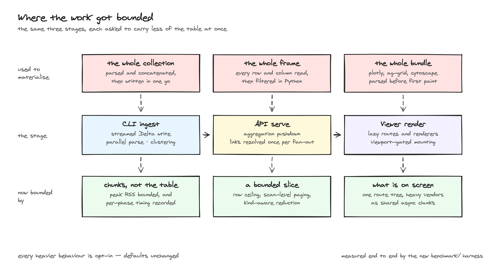
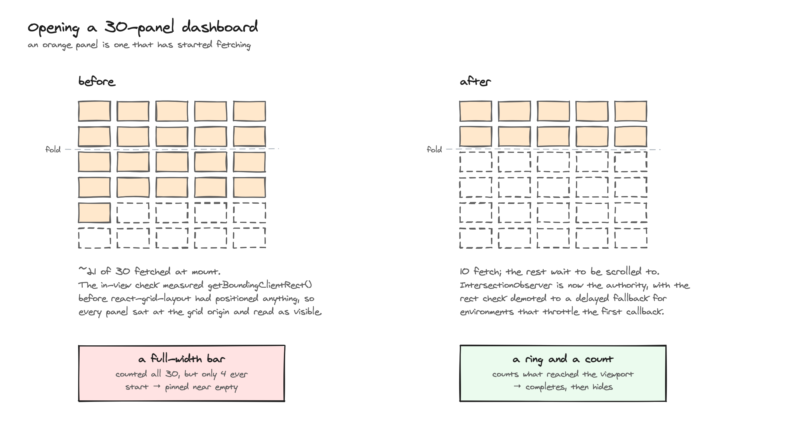
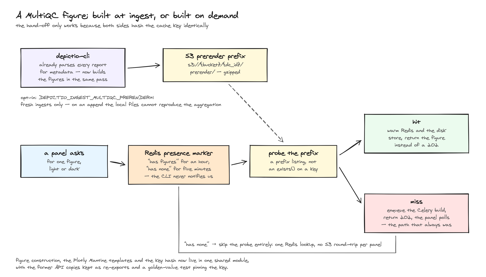

# :material-speedometer: Performance & Scaling

This page describes how Depictio handles **large data collections**: what the server
does to avoid reading rows it doesn't need, how much data reaches the browser, and which
settings let you tune that for your deployment. The [measured behaviour](#measured-behaviour)
section at the bottom records real numbers from a 12-million-row benchmark project.

The guiding idea is that a dashboard should stay usable at any collection size: work is
pushed as close to the stored data as possible, payloads are bounded by default, and when
a bound is applied it is made visible rather than hidden.

## Opening a dashboard

A dashboard can hold dozens of panels, each needing its own request. Rather than
requesting all of them up front, Depictio loads them as you reach them.

- **Panels load when they scroll into view.** A panel below the fold shows a placeholder
  and issues **no data request** until you scroll near it, so opening a large dashboard
  stays responsive instead of waiting on every panel first. Advanced-viz, MultiQC and
  JBrowse panels defer their **code chunk** as well, since their renderers fetch on mount;
  figure and table panels load their chunk when they mount but still gate the fetch.
- **Progress is scoped to the viewport.** A ring and a count beside the dashboard title
  cover what is on screen rather than the whole dashboard, so they always complete.

For what this looks like while a dashboard opens, see
[using the dashboard](../usage/guides/dashboard_usage.md#how-a-dashboard-loads-v130).

The viewer bundle is split along the same lines: route trees and the heavy visualisation
libraries (Plotly, AG Grid, Cytoscape) load as separate chunks on demand, so a page only
parses the code it actually renders.

!!! info "WebGL budget"
    Browsers allow only a handful of simultaneous WebGL contexts. Past roughly five
    accelerated plots the oldest ones used to lose their context and blank out. Depictio
    now budgets contexts and falls back to a lighter SVG renderer for the plots that miss
    out, so a dense dashboard degrades in quality rather than showing nothing.

## Bounded payloads and the Load-all control

By default every data panel is served a **bounded** slice rather than the whole
collection. Where a bound has been applied, the panel says so, and you can override it.

{target=_blank}

{target=_blank}

*A figure serving 9,900 of 12 million points. The badge sits beside the panel title, and
the Load-all icon is the bottom entry in the action cluster, which appears on hover.*

- **The Load-all button** — an action icon in each panel's hover cluster toggles between
  the reduced view and a full load of every point or row, and back again.
- **Figures** carry a badge reading e.g. `9,900 / 12,011,000 pts`, or `12,011,000 pts (all)`
  once fully loaded. Point plots are downsampled above `figure_max_points` (10,000 by
  default); a per-component `max_points` overrides it for a single figure.
- **Tables** page at scan level, so a deep page costs the same as a shallow one. Above
  `table_sort_max_rows` (1,000,000 by default) rows are served in natural scan order and
  the **sort control disappears from the column headers**, rather than offering a sort that
  silently does nothing.
- **Advanced visualisations** are reduced according to what their renderer can survive,
  not by a single global rule:

    | Policy | Applies to | Why |
    | --- | --- | --- |
    | Uniform sample | embedding, QQ, lollipop, coverage track | The renderer draws one mark per row and reads no aggregate, so a uniform subset is a faithful, lower-resolution picture. |
    | Tail-preserving | volcano, MA, Manhattan | Significant rows are kept whole and the dense middle is strided. On a multi-million-row DE table a uniform sample keeps almost none of the hits, so the plot would become a cloud with nothing to label. |
    | Never sampled | stacked taxonomy, rarefaction, DA barplot, enrichment, sunburst, dot plot, oncoplot, UpSet, hierarchical heatmap, sankey, phylogenetic | These renderers aggregate client-side (per-sample sums, top-N rankings), so a sample would change the reported *values*, not their resolution. |

    The never-sampled kinds are served whole up to `advanced_viz_no_sample_max_rows`
    (2,000,000 by default). Past that ceiling they fall back to a uniform sample and the
    chart is badged orange **estimated**, so an approximation is never presented as a
    total. The lollipop plot carries the same badge whenever its rows were sampled, since
    it aggregates them into per-gene counts.

## Server-side work

Most of the work happens server-side, in a Polars + Delta Lake + Celery pipeline, so the
browser receives compact, ready-to-draw payloads rather than raw data.

- **Aggregation pushdown** — figures whose result is an aggregate (box plots, histograms,
  bar charts) are computed *as a query over the Delta scan*. The result is exact; the rows
  simply never leave storage. In the benchmark run below, 114 of 225 figure renders
  materialised **zero rows**.
- **Column projection** — figures and cards read only the columns they need, which reduces
  I/O on wide tables.
- **Filters pushed into the scan** — categorical and temporal filters are kept in a form
  the parquet reader can use, so row groups that cannot match are skipped instead of being
  read and discarded.
- **Delta clustering** — tables are sorted on the columns they actually get filtered by
  before being written, which makes that row-group skipping more effective. This sort is
  skipped when the CLI's opt-in streamed write is enabled, since sorting the whole dataset
  would materialise exactly what streaming avoids.
- **Cross-DC links resolved once** — a link filter is resolved a single time per fan-out and
  evaluated lazily, rather than re-derived for every component that depends on it.
- **Polars-native figure building** — figures are built directly from Polars frames,
  avoiding a second in-memory copy via pandas.
- **Compressed responses** — large figure/table JSON is gzip-compressed in transit.

## Render offload

Depictio renders figures **adaptively**: cheap figures render inline on the API process,
while figures over a source-size threshold (50 MB by default) are dispatched to Celery
workers so the API stays responsive under concurrent load. A dispatched render that
exceeds the offload timeout returns `504` rather than blocking indefinitely.

Only figure renders have a Celery path. Tables, cards, interactive components and the
advanced-viz data endpoint are synchronous handlers, which FastAPI already runs in its own
thread pool, so they never needed the escape hatch.

## Caching

- **Arrow IPC (LZ4) cache** — cached Polars frames are stored with Arrow IPC + LZ4
  compression in Redis, a more compact serialization than pickle. Frames above the
  per-item cap are skipped rather than cached, so large frames don't silently bloat Redis.
- **MultiQC resident report** — parsed MultiQC reports are kept resident in the worker
  process across renders, so prewarming a dashboard's MultiQC figures doesn't
  re-deserialize the full report for every plot.
- **MultiQC figures prerendered at ingest** *(opt-in)* — the CLI already parses every
  MultiQC report for metadata, so it can build the aggregated Plotly figures in that same
  pass and upload them to S3. The render endpoint then serves them directly instead of
  building them on the first cold open. Set `DEPICTIO_INGEST_MULTIQC_PRERENDER=1` on the
  CLI; it costs ingest time and S3 storage, and applies to fresh ingests only. Collections
  that never opted in are not penalised, since a short-lived Redis marker spares them the
  S3 round-trip per panel.

  <iframe
    src="https://player.vimeo.com/video/1213726492?badge=0&amp;autopause=0&amp;player_id=0&amp;app_id=58479&amp;autoplay=1&amp;loop=1&amp;muted=1"
    frameborder="0"
    allow="autoplay; fullscreen; picture-in-picture; clipboard-write; encrypted-media; web-share"
    referrerpolicy="strict-origin-when-cross-origin"
    style="position: absolute; top: 0; left: 0; width: 100%; height: 100%"
    title="Opening a MultiQC dashboard aggregating 50 reports across 600 samples in Depictio"
  ></iframe>
  

  
🎬 Opening a MultiQC dashboard aggregating <strong>50 reports</strong> across <strong>600 samples</strong>.

## Measured behaviour

One benchmark run against the current build, on a linked 3-collection project. It
describes *this* setup, so treat it as an order of magnitude for a comparably sized
project rather than as a specification. The full run, including per-kind latency and a
breakdown of every failure, is committed alongside the harness as
`benchmark/PERF_REPORT_v2.md` in the
[depictio repository](https://github.com/depictio/depictio).

| | |
| --- | --- |
| Dataset | **12,019,500 rows** across 3 linked collections |
| Size | 1.025 GB raw / **1.429 GB Delta** |
| Host | Apple M1 Max, 10 CPU, 32 GB, on a Colima VM with 8 vCPU / 20 GB |
| API container | 4 CPU, **1 uvicorn worker, dev mode** |
| Celery | 4 CPU / 4 workers, 30 s offload timeout |

The single dev worker matters: a production deployment runs several, so these figures are
pessimistic in that respect.

  <iframe
    src="https://player.vimeo.com/video/1213726629?badge=0&amp;autopause=0&amp;player_id=0&amp;app_id=58479&amp;autoplay=1&amp;loop=1&amp;muted=1"
    frameborder="0"
    allow="autoplay; fullscreen; picture-in-picture; clipboard-write; encrypted-media; web-share"
    referrerpolicy="strict-origin-when-cross-origin"
    style="position: absolute; top: 0; left: 0; width: 100%; height: 100%"
    title="Opening a 30-component Depictio dashboard on a multi-million row project"
  ></iframe>
  

  
🎬 Opening a <strong>30-component</strong> dashboard on a comparable linked project. Captured in the browser, so what you see includes rendering and painting, not only the server timings tabulated below.

### Opening a dashboard

Every component fetched at once, the way the page does it. *First chart* is the first
figure or advanced viz to appear. *Cold* means the server caches were flushed beforehand.

| Components (fired) | Cache | First component | First chart | All components | Rendered |
| --- | --- | --- | --- | --- | --- |
| 4 (18) | cold | 155 ms | 1.2 s | 30.3 s | 16/18 |
| 4 (18) | warm | 133 ms | 218 ms | **816 ms** | 18/18 |
| 8 (22) | cold | 162 ms | 184 ms | 4.2 s | 21/22 |
| 8 (22) | warm | 140 ms | 1.5 s | 19.9 s | 22/22 |
| 16 (30) | cold | 135 ms | 190 ms | 3.3 s | 30/30 |
| 16 (30) | warm | 151 ms | 243 ms | 3.1 s | 30/30 |
| 30 (44) | cold | 224 ms | 4.3 s | 30.9 s | 40/44 |
| 30 (44) | warm | 270 ms | 270 ms | 6.2 s | 44/44 |

The leading number is how many components issue a timed render; the parenthesised number
is the dashboard's full panel count, since passive panels (text, interactive widgets
reading precomputed specs) are on the page but not measured.

**The page starts showing something in 133 to 270 ms regardless of dashboard size**, and
that barely moves between 4 and 30 components. What scales is the tail, not the first
paint, which is the point of loading panels as they come into view. The two rows near
30 s are timeouts rather than slow renders: a component never arrived and the row records
the ceiling.

### Changing a filter

Across the 3 linked collections. No round is a cache hit, since each applies a value no
earlier round used.

| Components | Starts responding | Fully caught up | Worst round | Complete rounds |
| --- | --- | --- | --- | --- |
| 4 | 154 ms | **1.7 s** | 1.9 s | 9/9 |
| 8 | 93 ms | **2.0 s** | 3.0 s | 9/9 |
| 16 | 214 ms | **4.1 s** | 33.5 s | 7/9 |
| 30 | 186 ms | **6.3 s** | 92.9 s | 5/9 |

*Fully caught up* is the median over rounds where every component landed; rounds that lost
a figure to the timeout are counted in the last column instead, so the median never
quietly describes a partial dashboard.

Which collection the filter starts on barely matters: filtering from the 12-million-row
feature matrix (2.0 s median) costs about the same as filtering from the 500-row sample
sheet (2.4 s). That is what the bidirectional link graph buys, since both resolve to the
same few hundred sample ids before any data is touched. Link translation itself is
**25 ms** median.

### Latency and data touched

Median and 95th-percentile render time across all 1,434 successful renders. One row per
family; the full report linked above breaks these out per figure and per viz kind.

| Component | p50 | p95 | Median rows in memory |
| --- | --- | --- | --- |
| interactive | 11 ms | 132 ms | n/a |
| card | 119 ms | 1.3 s | n/a |
| table | 222 ms | 1.2 s | 100 (one page) |
| figure · aggregates (box, histogram, bar) | 271 ms to 709 ms | 4.3 s to 7.4 s | **0** |
| figure · point plots (scatter, line) | 696 ms to 1.1 s | 3.4 s to 4.2 s | 40,000 |
| advanced viz (11 kinds) | 691 ms to 1.2 s | 2.6 s to 6.0 s | 6,005,500 |

Two numbers carry the design: **114 of 225 figure renders materialised zero rows**,
computed as an exact aggregation over the Delta scan, and the **largest frame any render
held in memory was 1.57 MB** (median 439 KB) against a 12-million-row table. The
advanced-viz kinds are the exception, since they read the full matrix and sample from it,
which is why their p95 is the widest here.

!!! warning "Where this run hit its limits"
    48 of 1,482 renders failed, all of them figure offloads, and 28 of those were in the
    30-component filter rounds. Four Celery workers serving up to 14 concurrent offloads
    over a 12-million-row table do not clear the queue inside the 30 s
    `DEPICTIO_CELERY_OFFLOAD_TIMEOUT_SECONDS` ceiling, so the slowest are cut off and
    returned as `504`. **Scale Celery workers before raising that timeout**: a user
    watching a spinner for 40 s is not obviously better served than one shown an error.

    Other caveats: one run, one sample per cell. The 8-component *warm* load (19.9 s) is
    slower than its cold equivalent (4.2 s) with every component landing in both, and is
    unexplained. Only the 4-component cold row is a genuine first visit. "Cold" means
    server caches are empty, so with Delta files possibly still in the OS or MinIO page
    cache it is a lower bound. **No before/after comparison is claimed**: these are
    absolute measurements of the current build, against a different dataset and dashboard
    than the earlier baseline used.

## Tuning

All of these are environment variables; see the
[environment reference](../installation/env-reference.md) for how to set them.

| Variable | Default | Purpose |
| --- | --- | --- |
| `DEPICTIO_PERFORMANCE_FIGURE_MAX_POINTS` | `10000` | Target marker count for point plots before downsampling. Per-component `max_points` overrides it. |
| `DEPICTIO_PERFORMANCE_FIGURE_MAX_LOAD_ROWS` | `500000` | Row ceiling loaded from Delta for a point-plot or code-mode figure. Bypassed on a full load. |
| `DEPICTIO_PERFORMANCE_TABLE_SORT_MAX_ROWS` | `1000000` | Post-filter row count above which a table is served unsorted and the sort affordance is dropped. `0` disables the gate. |
| `DEPICTIO_PERFORMANCE_ADVANCED_VIZ_NO_SAMPLE_MAX_ROWS` | `2000000` | Row ceiling for the never-sampled viz kinds. Past it they fall back to a sample and are badged *estimated*. `0` means unbounded. |
| `DEPICTIO_PERFORMANCE_ADVANCED_VIZ_TAIL_P_THRESHOLD` | `0.05` | Significance cutoff below which a volcano/Manhattan row is kept whole. A renderer's own threshold wins over this fallback. |
| `DEPICTIO_PERFORMANCE_ADVANCED_VIZ_TAIL_EFFECT_THRESHOLD` | `1.0` | Same, for kinds whose tail is a signed effect size (MA's log2 fold change). |
| `DEPICTIO_PERFORMANCE_BOX_SAMPLE_ROWS_PER_GROUP` | `0` | Rows sampled per box-plot group before computing quartiles. `0` computes them exactly. |
| `DEPICTIO_PERFORMANCE_BOX_SAMPLE_MAX_GROUPS` | `64` | Group count above which box quartiles are always computed exactly, since grouped quantiles get cheaper as cardinality rises. |
| `DEPICTIO_CELERY_OFFLOAD_RENDERING` | `false` | Force dashboard render endpoints onto Celery. Left off, offloading is adaptive rather than unconditional. |
| `DEPICTIO_CELERY_OFFLOAD_SIZE_THRESHOLD_BYTES` | `50 MB` | Source-collection size above which a figure render is dispatched to Celery instead of run inline. |
| `DEPICTIO_CELERY_OFFLOAD_TIMEOUT_SECONDS` | `30.0` | Per-request offload timeout before the API returns `504`. |

### Where to start

- **Scale workers, not the API** — heavy figure rendering is CPU-bound. Add Celery worker
  concurrency or replicas (and RAM, since each worker holds its own frame copies) rather
  than overloading the API process. Running more than one uvicorn worker matters too. This
  is also the first thing to reach for if renders are hitting the offload timeout, ahead of
  raising the timeout itself.
- **Project your columns** — narrower data collections (only the columns your components
  use) mean less data read and cached.
- **Leave the render caps at their defaults** unless a specific panel needs more. Raising
  `FIGURE_MAX_POINTS` costs payload size and browser draw time for every user, whereas the
  per-panel **Load all** button gives the one person who needs the full picture a way to
  ask for it.
- **`BOX_SAMPLE_ROWS_PER_GROUP` is not a free win.** It trades a sort for an *extra scan*,
  since the exact extremes have to be read before the per-group strides are known. On warm
  local parquet it measured a 3.7x win on a 17M-row table; on a cold S3-backed Delta table
  the extra read can cost more than the sort it removes. Enable it only where the sort has
  been measured to be the bottleneck.
