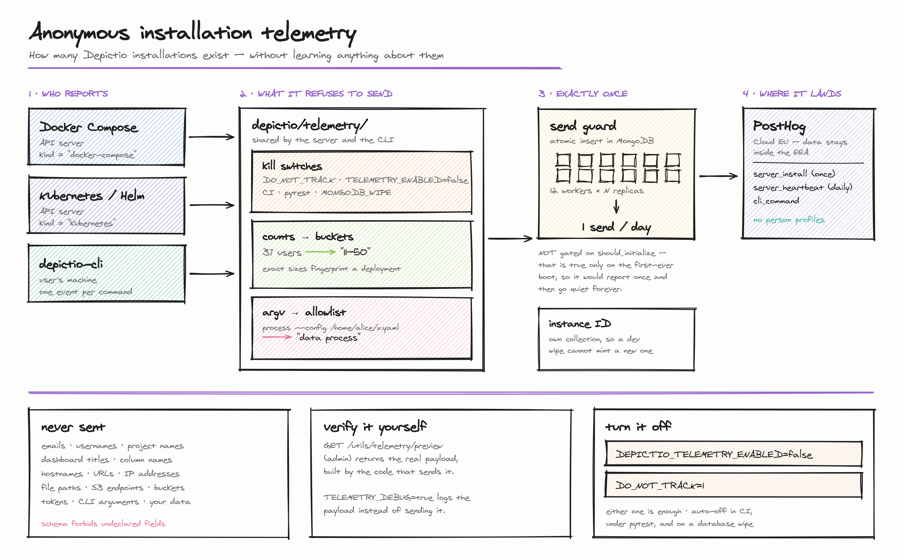

# Telemetry

Depictio sends an **anonymous, aggregate** daily report so the project can tell how many installations exist and which features are used. Container images and the Helm chart are hosted on GitHub Container Registry, which publishes no pull counts, so this is the only signal available.



!!! info "Enabled by default"

    Telemetry is on unless you turn it off. Nothing personal, and nothing about your data, is ever transmitted.

## What is sent

A random **installation ID** (a UUID generated on first boot, not derived from anything about you or your machine), plus:

- Depictio version, and how it was deployed (`kubernetes`, `docker-compose`, `docker`, `devcontainer`, `local`)
- OS family, CPU architecture, Python version, worker count
- Which optional features are switched on, as booleans
- Deployment size as **coarse buckets** (`11-50 users`, `2-5 projects`), never exact counts

The full field-by-field payload reference is generated from the schema and lives in the main repository: [docs/telemetry.md](https://github.com/depictio/depictio/blob/main/docs/telemetry.md).

## What is never sent

Email addresses, usernames, project/dashboard/workflow/column names, hostnames, URLs, IP addresses, file paths, S3 endpoints or bucket names, tokens, CLI arguments, or any of your data in any form.

The payload schema forbids undeclared fields, so a future change cannot quietly add one: it would have to be declared in the schema, where it appears in the generated reference and trips a test.

## Verify it yourself

As an admin on your own deployment:

```bash
curl -H "Authorization: Bearer $YOUR_TOKEN" \
  https://your-depictio/depictio/api/v1/utils/telemetry/preview
```

This returns the exact payload, built by the same code that sends it, plus whether telemetry is currently active. Reading it does not consume the day's report.

To observe without transmitting, set `DEPICTIO_TELEMETRY_DEBUG=true`: every payload is written to the application log instead of being sent.

## Turning it off

Either of these is enough:

```bash
DEPICTIO_TELEMETRY_ENABLED=false   # Depictio-specific
DO_NOT_TRACK=1                     # cross-tool convention (consoledonottrack.com)
```

For Docker Compose, put either in your `.env`. For Kubernetes:

```bash
helm upgrade depictio ./helm-charts/depictio \
  --set backend.env.DEPICTIO_TELEMETRY_ENABLED=false
```

To keep the installation count but drop the size metrics, set `DEPICTIO_TELEMETRY_INCLUDE_USAGE_METRICS=false`.

!!! note "Automatically disabled"

    No configuration needed: telemetry suppresses itself in CI (`CI`, `GITHUB_ACTIONS`, `GITLAB_CI` and similar), under pytest, with `DEPICTIO_DEV_MODE=true`, and when the deployment booted with `DEPICTIO_MONGODB_WIPE`.

## Configuration reference

| Variable | Default | Effect |
|---|---|---|
| `DEPICTIO_TELEMETRY_ENABLED` | `true` | Master switch. |
| `DO_NOT_TRACK` | unset | Cross-tool opt-out; any meaningful value disables telemetry. |
| `DEPICTIO_TELEMETRY_INCLUDE_USAGE_METRICS` | `true` | Include the bucketed deployment-size block. |
| `DEPICTIO_TELEMETRY_DEBUG` | `false` | Log payloads instead of sending them. |
| `DEPICTIO_TELEMETRY_INTERVAL_HOURS` | `24` | Hours between heartbeat attempts. |
| `DEPICTIO_TELEMETRY_DEPLOYMENT_KIND` | auto-detected | Override the reported deployment kind. |
| `DEPICTIO_TELEMETRY_ENDPOINT` | PostHog Cloud EU | Point events at your own collector. |
| `DEPICTIO_TELEMETRY_STATE_DIR` | `~/.depictio` | Where the CLI stores its anonymous ID. |

## Where it goes

PostHog Cloud's **EU** region, so event data stays inside the EEA. Every event is flagged `$process_person_profile: false`: no person profile is stored for your installation, only counts.

!!! warning "Three similarly-named systems, only the first sends anything to us"

    1. **`DEPICTIO_TELEMETRY_*`**: this page. Anonymous installation counting. **Enabled** by default.
    2. **`DEPICTIO_ANALYTICS_*`**: per-user session tracking stored in *your* MongoDB and shown in *your* admin UI. Never transmitted. Disabled by default.
    3. **`DEPICTIO_GOOGLE_ANALYTICS_*`**: optional GA4 tracking in the frontend. Data goes to *your* GA4 property. Disabled by default.
