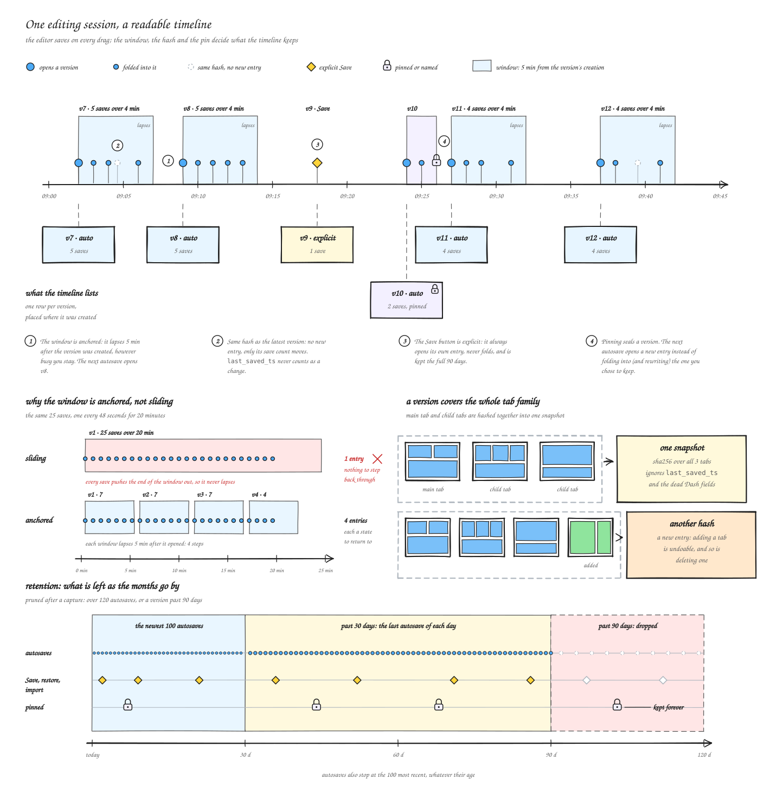
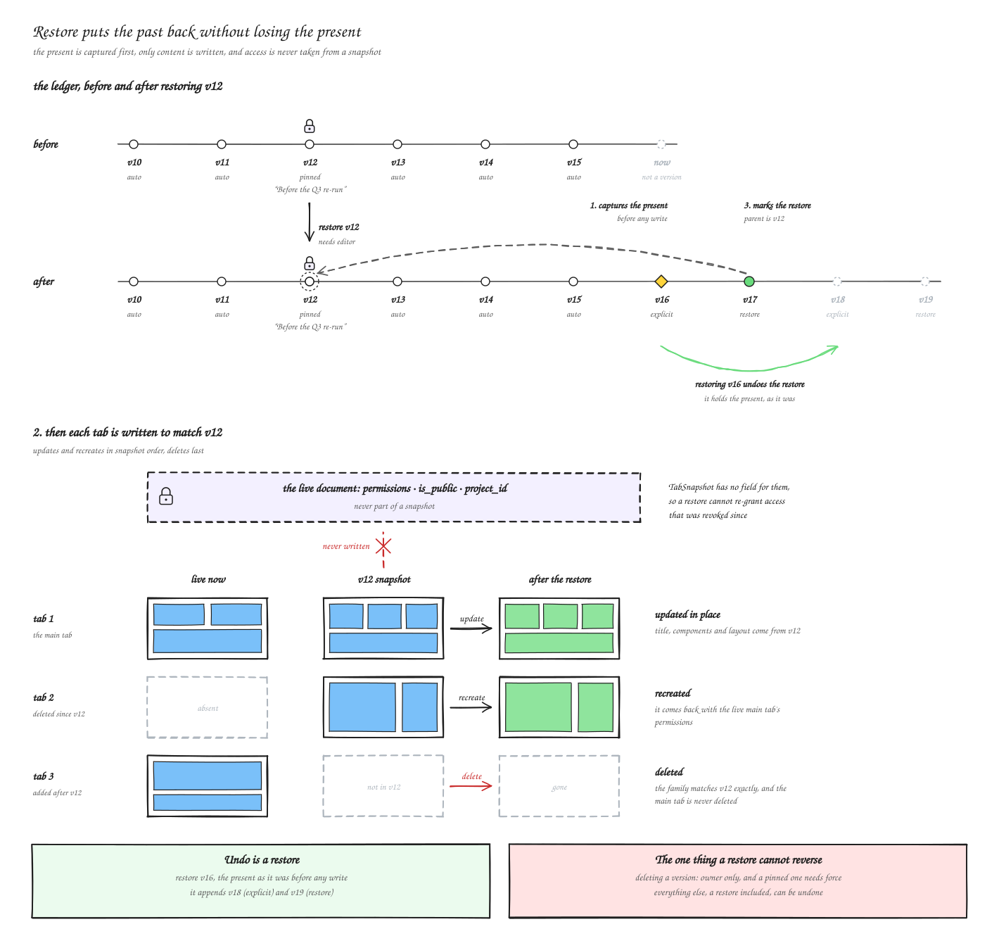
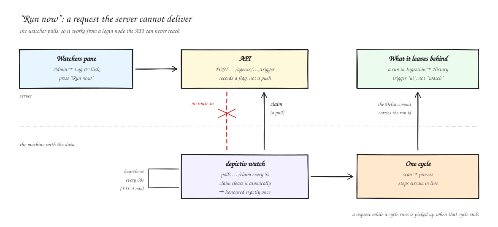

# :material-history: Dashboard and data versions

Depictio keeps two kinds of history. A **dashboard version** is a copy of a dashboard's
content, recorded each time the dashboard changes. A **data version** is a commit of a
data collection's Delta table, written each time the data is ingested. A dashboard version
also records which data version each of its collections was at, so a past dashboard can be
drawn from the data it showed at the time.

| You want to | Where |
|-------------|-------|
| See, preview, restore or bookmark an earlier state of a dashboard | Editor: **Settings → History** |
| Compare one component with an earlier version of it, or bring it back | Editor: the component's ⋮ menu → **History** |
| Draw the editor from earlier data | Editor: **Settings → Data version** |
| Show someone a past version, read-only | A preview link, `/dashboard/{id}?version={version id}` |
| See the commits of a table | Project page: the data collection's **Version history** |
| List or clean up commits from a terminal | [`depictio data versions`](../depictio-cli/usage.md#data-versions) and [`depictio data vacuum`](../depictio-cli/usage.md#data-vacuum) |

---

## :material-content-save-outline: What a version holds

A version covers the whole dashboard: its main tab and every child tab, as one entry.
Versions are numbered per dashboard, `v1`, `v2` and on, and the History list calls a
version by its name when it has one.

A version holds what the tabs contain: layout, components, titles, icons, notes,
sections, category colours, the brand theme, the settings saved for everyone (tab
defaults, tiles, filtering, the Guide), and each tab's group and position.

| Not in a version | What that means |
|------------------|-----------------|
| Permissions, public visibility, the project | A restore never grants or removes access |
| Uploaded logo files | A restore or a preview keeps the current logo |
| [Comments and annotations](comments-annotations.md) | Stored apart from the dashboard. A restore leaves them in place |
| The data | A version records which commit each data collection was at, not its rows. See [Data versions](#data-versions) |

A version larger than 8 MiB is not recorded. The save itself always goes through.

---

## :material-timeline-clock-outline: When a version is recorded

| Change | Recorded as |
|--------|-------------|
| The editor's own saves, about half a second after you stop editing | **Autosave** |
| Renaming the dashboard, editing or reordering tabs, branding | **Autosave** |
| The **Save** button | **Saved** |
| Creating or duplicating a dashboard, adding or deleting a tab | **Saved** |
| [**Bookmark the current state**](#bookmarks) in Settings → History | **Saved**, bookmarked |
| A restore | **Saved** for the state it replaces, then **Restored** |
| Importing a dashboard (YAML or JSON, including the dashboards `depictio ingest` imports or tops up) | **Imported**. An import over an existing dashboard first records the state it replaces as **Saved** |

The first change to a dashboard that has no history yet first records its current state,
labelled **Before first tracked change**, so the original is never out of reach.

Autosaves fold together. An autosave joins the previous version, rather than opening a
new one, when both are autosaves by the same person, the previous one is neither
bookmarked nor named, and it was created less than 5 minutes ago. The window is counted
from the version's creation and does not slide, so a long editing session leaves one
version every 5 minutes. Such a version says how many saves it holds, as in
*4 saves over 3 min*.

A save that changes nothing records nothing, whatever its kind. **Save** then turns the
newest version, if it is an autosave, into **Saved**, so later autosaves no longer fold
into it, and **Bookmark the current state** names and bookmarks that newest version.

{target=_blank}

The diagram says *pinned* where the History list says *bookmarked*.

---

## :material-history: The History section { #history }

In the editor, **Settings → History** lists every version, newest first and grouped by
day. Each row shows the version's name and kind icon and how long ago it was saved; its
chevron opens the details: the kind (**Autosave**, **Saved**, **Restored** or
**Imported**), the date, the author, the number of components and tabs, and a line on the
data, such as *2 data collections pinned*. The version the dashboard is at is marked
**Current**, and the one the editor's data comes from, **Data in use**. **Load older
versions** pages further back.

{target=_blank}

{target=_blank}

*Editor → Settings → History.*

Each row has **Restore**, and a ⋮ menu with the other three actions:

| Action | What it does |
|--------|--------------|
| :material-eye-outline: **Preview in a new tab** | Opens the version read-only in a new browser tab. See [Preview](#preview) |
| :material-backup-restore: **Restore** | Brings the dashboard back to this version. Unavailable on the current one. See [Restore](#restore) |
| :material-bookmark-outline: **Bookmark** | Names the version and keeps it for good. See [Bookmarks](#bookmarks) |
| :material-delete-outline: **Delete** | Removes the version for good. Only the dashboard's owners can, and not while its data is in use under **Data version** |

{target=_blank}

{target=_blank}

*A row's Restore button and its ⋮ menu.*

!!! note "Deleting a version cannot be undone"
    Every other action here, a restore included, can be undone by restoring an earlier
    version. Deleting a bookmarked version through the API needs `force=true`, and the
    only version a dashboard has cannot be deleted.

### Bookmarks

A bookmark gives a version a name, keeps it for good, and stops later autosaves from
folding into it. **Bookmark** in a row's ⋮ menu opens a dialog with an optional **Name**;
**Remove bookmark** takes it off again.

{target=_blank}

{target=_blank}

*⋮ → Bookmark on a row.*

**Bookmark the current state**, at the top of the section, records the dashboard as it is
now and bookmarks it in one step. It needs a name.

### Preview

A preview opens `/dashboard/{id}?version={version id}` in the viewer. A banner across the
top says which version it is, who saved it and when, and, after *Layout and components are
from this version*, where each data collection comes from:

| Banner | Meaning |
|--------|---------|
| *Past data: {collection} (vN)* | Drawn from the commit the version recorded |
| *Latest data: {collection}* | The version recorded no commit for it, such as a collection added since |
| *No data version recorded, so the latest data is shown: {collection}* | A type that is never pinned. See [What can be pinned](#what-can-be-pinned) |

{target=_blank}

{target=_blank}

*A row's ⋮ → Preview in a new tab.*

The preview is read-only: editing, live updates and the notes footer are off, and links
between tabs keep the version. The tab list itself is today's: a tab deleted since the
version is not listed, and opening a tab added since fails to load, as the version holds
nothing for it.

Anyone who can open the dashboard can open a preview link. **Back to current** leaves the
preview. Owners also see **Open in editor**, to restore the version from the editor's
History.

### Restore

**Restore** first records the present state as a version, then writes the version's
content back into every tab:

- tabs deleted since are recreated, with the main tab's current permissions;
- tabs added since are deleted (the main tab never is);
- permissions, visibility, comment threads and the logo are left as they are;
- a **Restored** version is recorded, and a fresh thumbnail queued.

A restore brings back the dashboard, not the data: after it, components read the latest
data. To undo a restore, restore the version recorded just before it.

{target=_blank}

Before you confirm, the dialog checks the version against the data as it is now:

| Result | Meaning |
|--------|---------|
| **Still matches the current data** | Every column the version uses is still there, with the same type |
| **Data has changed since** | A column the version does not use was removed, or a column changed type |
| **Some components will not render** | A data collection was deleted, or a column a component uses no longer exists |

Each changed collection is listed with the missing and retyped columns and the number of
components affected. The check never blocks a restore: components whose data is gone
render empty.

{target=_blank}

{target=_blank}

*A row's Restore button opens the dialog with the check.*

---

## :material-puzzle-outline: Component history { #component-history }

In the editor, **History** in a component's ⋮ menu shows that one component across the
dashboard's versions. It is offered on tiles and on filters, once the dashboard has at
least one version.

{target=_blank}

{target=_blank}

*Editor → a component's ⋮ menu → History.*

| Control | What it does |
|---------|--------------|
| **Version** | Picks the version to show, with **Older version** and **Newer version** to step through them |
| **Compare** | Shows the version on the left and the component as it is now, **Current**, on the right |
| **Historical data** | On by default: draws the version from the data it recorded. Off, it uses the latest data |
| **Data version** | Picks the data for each side: *This version's data*, *Latest data*, or any commit of the collection |

{target=_blank}

{target=_blank}

*One version of the component, drawn from the data it recorded.*

With **Compare** on and both sides reading the same commit, any difference comes from the
component's configuration alone. A component that did not exist in a version says so.

{target=_blank}

{target=_blank}

*With Compare on: the version on the left, Current on the right.*

**Restore this component** puts back only this component, as it was in the selected
version, and leaves the rest of the dashboard alone. **Also restore its position and
size** brings back its place in the grid too, with its section, group or panel; off, it
stays where it is now, in the same section. A component deleted since is added back at
its old position. The present state is recorded as a version first, so this can be
undone. A component whose tab no longer exists cannot be restored alone: restore the whole
version instead.

{target=_blank}

{target=_blank}

*Component history → Restore this component.*

!!! tip "Keep components matched across YAML imports"
    Versions match a component by its id within its tab. A component imported from YAML with a `tag`
    gets an id derived from that tag, so it keeps its history when the YAML is imported
    again. A component without a `tag` gets a new id at each import, and its history
    starts over. See [YAML Dashboard Sync](yaml-sync.md).

---

## :material-database-clock-outline: Data versions { #data-versions }

Every write to a `table` or `image` data collection is a commit of its Delta table on S3,
numbered `v0`, `v1` and on. Depictio records on each commit which ingestion wrote it,
what triggered it and how it was written. A dashboard version records, for each data
collection it uses, the commit that was current when it was saved.

### What can be pinned { #what-can-be-pinned }

| Data collection type | Pinned to a past commit |
|----------------------|-------------------------|
| `table` | Yes |
| `image` | The list of image paths, yes. The image files themselves always show as they are now |
| `multiqc`, `jbrowse2` | No: always the latest data |
| `geojson`, `phylogeny` | No: always the latest data |

A table written before Depictio recorded commit numbers has no commit to pin either.
Wherever a collection cannot be pinned, the latest data is shown: the History rows say how
many collections are pinned, and the preview and editor banners name each one. MultiQC,
JBrowse, advanced visualization and funnel components always read the latest data, and
carry a **Current data** badge while earlier data is shown.

### Data version in the editor

**Settings → Data version** draws the editor from earlier data, for you only, until you
reload. Nothing is saved: saving the dashboard still writes its layout and components,
never its data.

| Field | What it does |
|-------|--------------|
| **As of a dashboard version** | Every collection goes back to the data a dashboard version was saved with. Only versions that recorded a data version are listed. **Use this data** applies it |
| **One collection** | Pins one collection to one of its commits, such as today's layout against last month's data. Applies as you pick, and wins over the version above for that collection |

{target=_blank}

{target=_blank}

*Editor → Settings → Data version, after Use this data.*

While the editor shows earlier data, a banner above the grid says so (*Showing data as of
{version}*), with a **Not current** badge and the commit each collection is drawn from,
and **Back to current data** returns to the latest data.

{target=_blank}

{target=_blank}

*The editor's data banner.*

### Dataset history

On a project's page, a data collection's details show its **Delta version** below
**Last Aggregated**, or *Not recorded*. For a `table` collection, a **Version history**
panel below the **Data Preview** lists its commits:

| Column | Shows |
|--------|-------|
| **Version** | The commit number. **unmatched** for an ingestion recorded before commit numbers were |
| **When** | When it was written |
| **Operation** | The Delta operation, with how Depictio wrote it: *full rewrite*, *runs replaced* or *appended* |
| **Rows**, **Files** | Rows added, files added and removed |
| **By** | What triggered the ingestion (**Manual**, **Watch** or **UI**) and who ran it |

{target=_blank}

{target=_blank}

*Projects → a project → a data collection → Version history.*

When the object store cannot be reached, the panel shows only what Depictio recorded, and
says so. Once the data preview is loaded, a table with two commits or more offers
**At version**, which shows the table as an earlier commit wrote it, under a warning that
it is not the current data.

{target=_blank}

{target=_blank}

*In Data Preview: Load Data, then At version.*

---

## :material-eye-refresh-outline: How new data versions are written { #how-new-data-versions-are-written }

Each `depictio ingest` writes one commit per data collection it processes. Two options
decide how much of the table a commit rewrites:

| Option | Effect |
|--------|--------|
| `--write-mode overwrite` (default) | Rewrites the whole table |
| `--write-mode replace-runs` | Partitions the table by run and rewrites only the runs in this ingestion, leaving the others untouched |
| `--incremental-write` | With `replace-runs`, rewrites only the runs that changed. Falls back to a full rebuild whenever that cannot be done safely, such as a run removed or a column type changed |
| `--skip-unchanged` | Leaves a table alone when the scan found no new, changed or removed file for it |
| `--repartition` | Lets `replace-runs` partition a table that is not partitioned by run yet. This rewrites every row |

`depictio watch` runs the same ingestion on a loop, whenever the results directory
changes, so a project's data versions follow the pipeline without anyone running a
command. Each watcher appears in the admin [**Watchers** pane](../usage/administration/monitoring.md#watchers),
where **Run now** asks it for a cycle at once.

{target=_blank}

See [`depictio watch`](../depictio-cli/usage.md#watch-command) for its options, and
[Running a watcher as a service](../depictio-cli/usage.md#running-a-watcher-as-a-service)
for systemd and Docker Compose.

!!! warning "Vacuuming removes past commits"
    Delta keeps the files of every past commit, so a table's footprint on S3 grows with
    each ingestion. [`depictio data vacuum`](../depictio-cli/usage.md#data-vacuum) removes
    the files no commit newer than `--retention-hours` (168 by default) needs. A
    dashboard version, a preview or a pin that reads a commit older than that then has
    nothing to read. Nothing in Depictio vacuums on its own.

---

## :material-cog-outline: Retention and configuration { #retention-and-configuration }

| Kept | For how long |
|------|--------------|
| Bookmarked versions | For good |
| Saved, restored and imported versions | 90 days |
| Autosaves | The newest 100, thinned to the last one of each day once older than 30 days, and dropped after 90 days |

The pruning runs after a version is recorded, once a dashboard holds more than 120
autosaves that are not bookmarked (1.2 times the autosave cap), or once a version that is
not bookmarked is older than the retention period (90 days).

Deleting a dashboard deletes its history, and deleting a project deletes the history of
its dashboards. [Backups](../usage/administration/backup.md) include it.

| Variable | Default | Description |
|----------|---------|-------------|
| `DEPICTIO_DASHBOARD_VERSIONS_ENABLED` | `true` | Record versions. Off, nothing new is recorded |
| `DEPICTIO_DASHBOARD_VERSIONS_COALESCE_WINDOW_SECONDS` | `300` | How long autosaves by one person fold into one version, from its creation |
| `DEPICTIO_DASHBOARD_VERSIONS_MAX_VERSIONS_PER_FAMILY` | `100` | Autosaves kept per dashboard |
| `DEPICTIO_DASHBOARD_VERSIONS_RETENTION_DAYS` | `90` | Age after which versions that are not bookmarked are dropped |
| `DEPICTIO_DASHBOARD_VERSIONS_KEEP_DAILY_FOR_DAYS` | `30` | Age after which autosaves thin to one per day |
| `DEPICTIO_DASHBOARD_VERSIONS_MAX_SNAPSHOT_BYTES` | `8388608` | Largest version recorded, in bytes (8 MiB) |

---

## :material-api: API

Under `/depictio/api/v1/dashboards`. Reading needs view access to the project, writing
needs edit access to the dashboard, and deleting a version needs ownership.

| Method and path | What it does |
|-----------------|--------------|
| `GET /{dashboard_id}/versions` | Lists the versions, newest first. `limit` (1–200, default 50), `before_seq`, `pinned_only` |
| `GET /{dashboard_id}/versions/current` | The version the dashboard is at |
| `POST /{dashboard_id}/versions` | Records the current state, with an optional `label` |
| `GET /versions/{version_id}` | One version, with its content |
| `GET /versions/{version_id}/compatibility` | The check against the current data |
| `PATCH /versions/{version_id}` | Renames it |
| `POST /versions/{version_id}/pin`, `DELETE /versions/{version_id}/pin` | Bookmarks it, or removes the bookmark |
| `DELETE /versions/{version_id}` | Deletes it. `force=true` for a bookmarked one |
| `POST /versions/{version_id}/restore` | Restores the dashboard to it |
| `POST /versions/{version_id}/restore_component` | Restores one component: `component_index`, `tab_id`, `restore_layout` |
| `GET /get/{dashboard_id}?version_id=` | The dashboard as that version holds it, as the preview reads it |

---

## :material-alert-circle-outline: Known limits

- `multiqc`, `jbrowse2`, `geojson` and `phylogeny` collections always show their latest
  data, and so do image files and the components marked **Current data**.
- A preview uses today's tab list. A tab deleted since the version is not listed until
  the version is restored, and a tab added since fails to load.
- Vacuumed commits can no longer be read. See the warning [above](#how-new-data-versions-are-written).
- The editor's data version lasts until you reload, and is never saved or shared.

---

## :material-link-variant: Related Documentation

- [Dashboards](dashboards.md): tabs, layout and saving
- [Using the Dashboard](../usage/guides/dashboard_usage.md#dashboard-settings-drawer): the Settings dialog
- [Depictio CLI](../depictio-cli/usage.md#watch-command): `depictio watch` and the write options
- [Monitoring](../usage/administration/monitoring.md#watchers): the Watchers pane and live ingestion steps
- [Backup & Restore](../usage/administration/backup.md): what a backup covers
