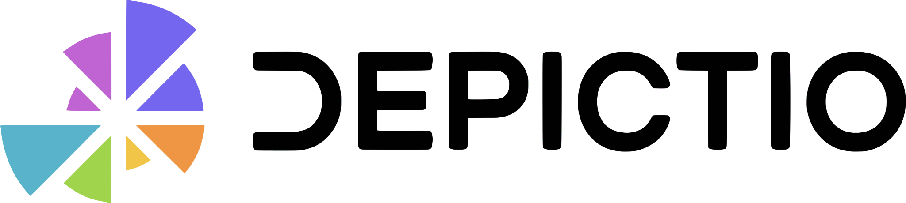
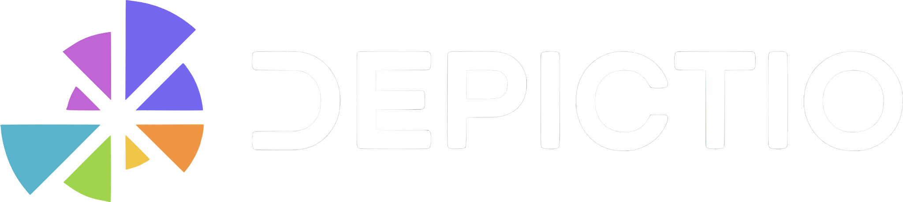
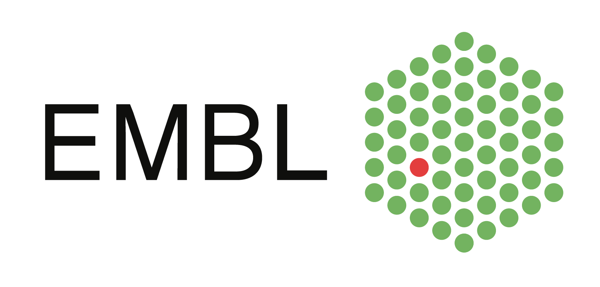

<!-- markdownlint-disable MD025 -->

#

<!-- markdownlint-enable MD025 -->

<!-- Hero Section -->
<section class="hero-section">
  

    
    
    

      
    

    

      A modern platform that allows to create dashboards from bioinformatics workflows outputs.
    

  

</section>

<!-- Workflow Integration Section -->
<section class="workflow-section">
  

    

      Generate dashboards using results from standardised workflows available in:
    

    
    
    <a href="https://snakemake.readthedocs.io/en/stable/snakefiles/deployment.html#catalog" target="_blank" rel="noopener" class="snakemake-catalog-link">
      
      <strong>Snakemake workflow catalog</strong>
    </a>
  

</section>

<!-- Features Section -->
<section class="features-section">
  

    

      

        

          
            <svg xmlns="http://www.w3.org/2000/svg" viewBox="0 0 24 24"><path d="M13,3V9H21V3M13,21H21V11H13M3,21H11V15H3M3,13H11V3H3V13Z"/></svg>
          
        

        <h3>Interactive Dashboards</h3>
        
Create customizable dashboards with real-time data interaction

      

      

        

          
            <svg xmlns="http://www.w3.org/2000/svg" viewBox="0 0 24 24"><path d="M19.35,10.04C18.67,6.59 15.64,4 12,4C9.11,4 6.6,5.64 5.35,8.04C2.34,8.36 0,10.91 0,14A6,6 0 0,0 6,20H19A5,5 0 0,0 24,15C24,12.36 21.95,10.22 19.35,10.04Z"/></svg>
          
        

        <h3>Cloud-Ready</h3>
        
Designed for cloud environments with Kubernetes support

      

    

  

</section>

<!-- CTA Section -->
<section class="cta-section">
  

    

      <a href="installation/" class="md-button md-button--primary">
        <svg xmlns="http://www.w3.org/2000/svg" width="16" height="16" viewBox="0 0 24 24" fill="currentColor">
          <path d="M8,5.14V19.14L19,12.14L8,5.14Z" />
        </svg>
        Get Started
      </a>
      <a href="https://gitpod.io/#https://github.com/depictio/depictio" class="md-button md-button--gitpod">
        
        Try on Gitpod
      </a>
      <a href="features/" class="md-button md-button--secondary">
        <svg xmlns="http://www.w3.org/2000/svg" width="16" height="16" viewBox="0 0 24 24" fill="currentColor">
          <path d="M11,9H13V7H11M12,20C7.59,20 4,16.41 4,12C4,7.59 7.59,4 12,4C16.41,4 20,7.59 20,12C20,16.41 16.41,20 12,20M12,2A10,10 0 0,0 2,12A10,10 0 0,0 12,22A10,10 0 0,0 22,12A10,10 0 0,0 12,2M11,17H13V11H11V17Z" />
        </svg>
        Learn More
      </a>
    

  

</section>

## Project Overview

In the field of bioinformatics, researchers often face significant challenges when working with frequently executed production workflows, especially in managing and analyzing large-scale datasets. Despite the availability of numerous bioinformatics tools, there is a notable absence of platforms specifically designed for seamless integration with production workflows, which include standardized data ingestion, QC monitoring, and results exploration.

Depictio addresses this gap, offering a generic and centralized platform that allows to integrate workflows output data in order to build interactive dashboards, facilitating downstream analysis and QC metrics monitoring into a cohesive system. Depictio provides a scalable, flexible, and open-source solution tailored to meet needs of researchers handling large datasets generated by production workflows, agnostically of their execution engine (nextflow, snakemake, galaxy, R …).

## Key Features

### Data Ingestion

- **Manual or Automated:** Data ingestion can be triggered manually or through a watcher system
- **Client-side scan & processing:** Depictio-CLI (using [typer](https://typer.tiangolo.com/) python package) allows to scan and process data locally, pushing to the S3 bucket the resulting data format ready to be used by the dashboard
- **Data Types:** Support for tabular data formats (Parquet, CSV, JSON, TSV, compressed/uncompressed) using [Polars](https://pola-rs.github.io/polars-book/) and [Delta Lake](https://delta.io/) format

### Frontend

- **Customizable Dashboards:** Design and customise dashboards easily
- **Interactivity:** Explore data dynamically with instant updates in response to selections and inputs applied to the dashboards components
- **Project-based Organization:** Organize dashboards according projects, allowing easier management and sharing

### System

- **Scalable and Cloud-Oriented:** Built for cloud environments with Kubernetes and Docker-Compose support
- **Open-Source and Shareable:** Community-driven development model with transparent deployment

## Getting Started

Ready to get started with Depictio? Check out our installation guides:

- [Docker Compose Installation](installation/docker/) - Quickest way to get started
- [Kubernetes Installation](installation/kubernetes/) - For production environments
- [CLI Installation](installation/cli/) - For data ingestion and management

## Funding

  

    
    <h3>Marie Skłodowska-Curie Grant</h3>
    
This project has received funding from the European Union's Horizon 2020 research and innovation programme under the Marie Skłodowska-Curie grant agreement No 945405

    <a href="https://marie-sklodowska-curie-actions.ec.europa.eu/" class="md-button" target="_blank">Learn More</a>
  

  

    
    <h3>ARISE Programme</h3>
    
ARISE is a postdoctoral research programme for technology developers, hosted at EMBL.

    <a href="https://www.embl.org/about/info/arise/" class="md-button" target="_blank">Learn More</a>
  

  

    
    <h3>EMBL</h3>
    
The European Molecular Biology Laboratory is Europe's flagship laboratory for the life sciences.

    <a href="https://www.embl.org/" class="md-button" target="_blank">Learn More</a>
  

## Academic Partners

  

    
    <h3>SciLifeLab Data Centre</h3>
    
SciLifeLab Data Centre provides data-driven life science research infrastructure and expertise to accelerate open science in Sweden and beyond.

    <a href="https://www.scilifelab.se/data/" class="md-button" target="_blank">Learn More</a>
  

