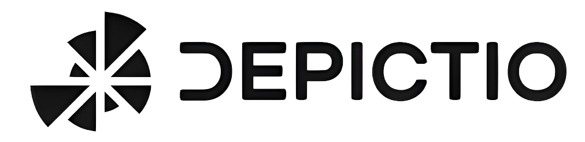

# Welcome to Depictio documentation 

  

## Project Overview

Depictio is an innovative web-based platform currently under development, aimed at facilitating downstream analysis in bioinformatics. It provides a dynamic and interactive dashboard experience for quality control (QC) metrics monitoring and result exploration in omics. The platform is tailored towards large-scale studies and research facilities, offering support for various data formats and interactive data visualization tools.

## Features

* Dynamic Dashboards: Real-time data interaction, customizable views, and user-driven exploration features.
* Diverse Data Format Support: Handles standard formats like CSV, TSV, XLSX, Parquet, and omics files like BED, BigBed, BigWig, BAM/CRAM, VCF.
* Robust Backend Technologies: Utilizes FastAPI, MongoDB, and Redis cache for high-performance data management and processing.
* Intuitive Frontend: Built on Plotly Dash, a ReactJS-based framework

## Current Status

Depictio is currently in the development phase and is not yet available for general use. The platform is being built with an emphasis on versatility and adaptability to various biological research needs.
