#

<!-- Hero Section -->
<section class="hero-section">
  

    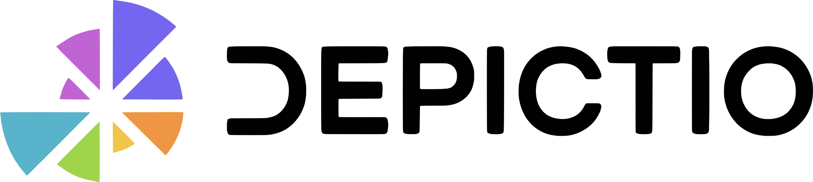
    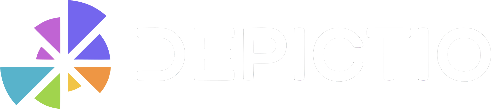

    

      A modern open-source platform that transforms bioinformatics workflow outputs into interactive dashboards. 
      Build, share, and explore data visualizations with or without writing code.
    

  

  <iframe
    src="https://player.vimeo.com/video/1194664914?h=4155d79379&amp;badge=0&amp;autopause=0&amp;player_id=0&amp;app_id=58479&amp;autoplay=1&amp;loop=1"
    frameborder="0"
    allow="autoplay; fullscreen; picture-in-picture; clipboard-write; encrypted-media; web-share"
    referrerpolicy="strict-origin-when-cross-origin"
    style="position: absolute; top: 0; left: 0; width: 100%; height: 100%"
    title="depictio-main-1754915546775"
  ></iframe>

</section>

<section class="lead-section">
  

    Bioinformatics pipelines produce more output than anyone reads. Depictio turns that output
    into dashboards you can hand to a collaborator, from any execution engine: Nextflow,
    Snakemake, Galaxy or a shell script.
  

</section>

<!-- Workflow Integration Section -->
<section class="workflow-section">
  

    <h2 class="section-heading workflow-title">
      <svg xmlns="http://www.w3.org/2000/svg" viewBox="0 0 24 24" aria-hidden="true"><path d="M13,14C9.64,14 8.54,15.35 8.18,16.24C9.25,16.7 10,17.76 10,19A3,3 0 0,1 7,22A3,3 0 0,1 4,19C4,17.69 4.83,16.58 6,16.17V7.83C4.83,7.42 4,6.31 4,5A3,3 0 0,1 7,2A3,3 0 0,1 10,5C10,6.31 9.17,7.42 8,7.83V13.12C8.88,12.47 10.16,12 12,12C14.67,12 15.56,10.66 15.85,9.77C14.77,9.32 14,8.25 14,7A3,3 0 0,1 17,4A3,3 0 0,1 20,7C20,8.34 19.12,9.5 17.91,9.86C17.65,11.29 16.68,14 13,14M7,18A1,1 0 0,0 6,19A1,1 0 0,0 7,20A1,1 0 0,0 8,19A1,1 0 0,0 7,18M7,4A1,1 0 0,0 6,5A1,1 0 0,0 7,6A1,1 0 0,0 8,5A1,1 0 0,0 7,4M17,6A1,1 0 0,0 16,7A1,1 0 0,0 17,8A1,1 0 0,0 18,7A1,1 0 0,0 17,6Z"/></svg>
      Workflow Ecosystem
    </h2>
    

      Connect with standardized bioinformatics workflows from various platforms.
    

    

      

        
      

      

        
      

      

        <a href="https://snakemake.readthedocs.io/en/stable/snakefiles/deployment.html#catalog" target="_blank" rel="noopener" class="snakemake-catalog-link">
          
          Snakemake Workflow Catalog
        </a>
      

    

  

</section>

<!-- Dashboard Components Section -->
<section class="components-section">
  

    <h2 class="section-heading components-title">
      <svg xmlns="http://www.w3.org/2000/svg" viewBox="0 0 24 24" aria-hidden="true"><path d="M13,3V11H21V3M13,21H21V13H13M3,21H11V13H3M3,11H11V3H3V11Z"/></svg>
      Dashboard Components
    </h2>
    

      Build powerful dashboards with a rich library of interactive components.
    

    

      

        

          <svg xmlns="http://www.w3.org/2000/svg" viewBox="0 0 24 24" fill="currentColor">
            <path d="M17.45,15.18L22,7.31V19L22,21H2V3H4V15.54L9.5,6L16,9.78L20.24,2.45L21.97,3.45L16.74,12.5L10.23,8.75L4.31,19H6.57L10.96,11.44L17.45,15.18Z"/>
          </svg>
        

        <h4>Figure</h4>
        
Scatter, bar, box, histogram, line plots and more with Plotly

      

      

        

          <svg xmlns="http://www.w3.org/2000/svg" viewBox="0 0 24 24" fill="currentColor">
            <path d="M5,4H19A2,2 0 0,1 21,6V18A2,2 0 0,1 19,20H5A2,2 0 0,1 3,18V6A2,2 0 0,1 5,4M5,8V12H11V8H5M13,8V12H19V8H13M5,14V18H11V14H5M13,14V18H19V14H13Z"/>
          </svg>
        

        <h4>Table</h4>
        
Interactive AG Grid tables with filtering, sorting, and export

      

      

        

          <svg xmlns="http://www.w3.org/2000/svg" viewBox="0 0 24 24" fill="currentColor">
            <path d="M5,3A2,2 0 0,0 3,5V19A2,2 0 0,0 5,21H19A2,2 0 0,0 21,19V5A2,2 0 0,0 19,3H5M7,7H17V9H7V7M7,11H14V13H7V11M7,15H17V17H7V15Z"/>
          </svg>
        

        <h4>Card</h4>
        
Metric cards with aggregations (count, sum, mean, min, max)

      

      

        

          <svg xmlns="http://www.w3.org/2000/svg" viewBox="0 0 24 24" fill="currentColor">
            <path d="M7,5H21V7H7V5M7,13V11H21V13H7M4,4.5A1.5,1.5 0 0,1 5.5,6A1.5,1.5 0 0,1 4,7.5A1.5,1.5 0 0,1 2.5,6A1.5,1.5 0 0,1 4,4.5M4,10.5A1.5,1.5 0 0,1 5.5,12A1.5,1.5 0 0,1 4,13.5A1.5,1.5 0 0,1 2.5,12A1.5,1.5 0 0,1 4,10.5M7,19V17H21V19H7M4,16.5A1.5,1.5 0 0,1 5.5,18A1.5,1.5 0 0,1 4,19.5A1.5,1.5 0 0,1 2.5,18A1.5,1.5 0 0,1 4,16.5Z"/>
          </svg>
        

        <h4>Interactive</h4>
        
Filters with sliders, dropdowns, and date pickers

      

      

        

          
        

        <h4>MultiQC</h4>
        
Quality control reports embedded in dashboards

      

      

        

          <svg xmlns="http://www.w3.org/2000/svg" viewBox="0 0 24 24" fill="currentColor">
            <path d="M22,16V4A2,2 0 0,0 20,2H8A2,2 0 0,0 6,4V16A2,2 0 0,0 8,18H20A2,2 0 0,0 22,16M11,12L13.03,14.71L16,11L20,16H8M2,6V20A2,2 0 0,0 4,22H18V20H4V6"/>
          </svg>
        

        <h4>Image</h4>
        
Image galleries with S3/MinIO storage integration

      

      

        

          <svg xmlns="http://www.w3.org/2000/svg" viewBox="0 0 24 24" fill="currentColor">
            <path d="M12,11.5A2.5,2.5 0 0,1 9.5,9A2.5,2.5 0 0,1 12,6.5A2.5,2.5 0 0,1 14.5,9A2.5,2.5 0 0,1 12,11.5M12,2A7,7 0 0,0 5,9C5,14.25 12,22 12,22C12,22 19,14.25 19,9A7,7 0 0,0 12,2Z"/>
          </svg>
        

        <h4>Map</h4>
        
Geospatial map visualization with markers

      

      

        

          <svg xmlns="http://www.w3.org/2000/svg" viewBox="0 0 24 24" fill="currentColor">
            <path d="M10 19.11L12.11 17H7v-2h7v.12L16.12 13H7v-2h10v1.12l1.24-1.23c.48-.48 1.11-.75 1.8-.75c.33 0 .66.07.96.19V5a2 2 0 0 0-2-2H5c-1.11 0-2 .89-2 2v14a2 2 0 0 0 2 2h5zM7 7h10v2H7zm14.7 7.35l-1 1l-2.05-2.05l1-1a.55.55 0 0 1 .77 0l1.28 1.28c.21.21.21.56 0 .77M12 19.94l6.06-6.06l2.05 2.05L14.06 22H12z"/>
          </svg>
        

        <h4>Text</h4>
        
Section headings and notes to document the dashboard

      

      

        

          <svg xmlns="http://www.w3.org/2000/svg" viewBox="0 0 24 24" fill="currentColor">
            <path d="M2 2h2v18h18v2H2zm12 12.5L12 18H7.94l-2.02-3.5L7.94 11H12zm.08-8L12.06 10H8L6 6.5L8 3h4.06zm7.17 4L19.23 14h-4.04l-2.02-3.5L15.19 7h4.04z"/>
          </svg>
        

        <h4>Advanced viz</h4>
        
Omics plots — Volcano, Manhattan, Sunburst, and more

      

    

  

</section>

<!-- Live Demo Section -->

<section class="live-demo-section">
  

    <!-- Unified Demo Card with Badge and Expandable Info -->
    

      

        

          
          

            <strong>Live interactive demo - Try it!</strong>
            <a href="https://demo.depictio.embl.org/dashboard/646b0f3c1e4a2d7f8e5b8ca2" target="_blank" rel="noopener" class="demo-direct-link">
              <svg xmlns="http://www.w3.org/2000/svg" width="16" height="16" viewBox="0 0 24 24" fill="currentColor">
                <path d="M14,3V5H17.59L7.76,14.83L9.17,16.24L19,6.41V10H21V3M19,19H5V5H12V3H5C3.89,3 3,3.9 3,5V19A2,2 0 0,0 5,21H19A2,2 0 0,0 21,19V12H19V19Z"/>
              </svg>
            </a>
          

        

        

          <svg class="demo-toggle-icon" xmlns="http://www.w3.org/2000/svg" viewBox="0 0 24 24" fill="currentColor">
            <path d="M7.41,8.58L12,13.17L16.59,8.58L18,10L12,16L6,10L7.41,8.58Z"/>
          </svg>
        

      

      

        
The dashboard below is the output of an <a href="pipeline-templates/nf-core/ampliseq/">nf-core/ampliseq</a> run, ingested with the CLI and built from a pipeline template. The demo signs you straight into a <strong>temporary account</strong>, so you can browse the pre-loaded projects and create your own without registering.

        
<strong>Note:</strong> Accounts and related data will be reset after 1 hour to keep the demo environment clean.

        

          <h4>Get started with Depictio</h4>
          

            <a href="https://demo.depictio.embl.org/" class="demo-alt-btn demo-btn" target="_blank" rel="noopener">
              <svg xmlns="http://www.w3.org/2000/svg" width="16" height="16" viewBox="0 0 24 24" fill="currentColor">
                <path d="M14,3V5H17.59L7.76,14.83L9.17,16.24L19,6.41V10H21V3M19,19H5V5H12V3H5C3.89,3 3,3.9 3,5V19A2,2 0 0,0 5,21H19A2,2 0 0,0 21,19V12H19V19Z"/>
              </svg>
              Try Demo Directly
            </a>
            <a href="https://codespaces.new/depictio/depictio" class="demo-alt-btn" target="_blank" rel="noopener">
              <svg xmlns="http://www.w3.org/2000/svg" width="16" height="16" viewBox="0 0 24 24" fill="currentColor">
                <path d="M12 0c-6.626 0-12 5.373-12 12 0 5.302 3.438 9.8 8.207 11.387.599.111.793-.261.793-.577v-2.234c-3.338.726-4.033-1.416-4.033-1.416-.546-1.387-1.333-1.756-1.333-1.756-1.089-.745.083-.729.083-.729 1.205.084 1.839 1.237 1.839 1.237 1.07 1.834 2.807 1.304 3.492.997.107-.775.418-1.305.762-1.604-2.665-.305-5.467-1.334-5.467-5.931 0-1.311.469-2.381 1.236-3.221-.124-.303-.535-1.524.117-3.176 0 0 1.008-.322 3.301 1.23.957-.266 1.983-.399 3.003-.404 1.02.005 2.047.138 3.006.404 2.291-1.552 3.297-1.23 3.297-1.23.653 1.653.242 2.874.118 3.176.77.84 1.235 1.911 1.235 3.221 0 4.609-2.807 5.624-5.479 5.921.43.372.823 1.102.823 2.222v3.293c0 .319.192.694.801.576 4.765-1.589 8.199-6.086 8.199-11.386 0-6.627-5.373-12-12-12z"/>
              </svg>
              Open in Codespaces
            </a>
            <a href="installation/docker/" class="demo-alt-btn install-btn">
              <svg xmlns="http://www.w3.org/2000/svg" width="16" height="16" viewBox="0 0 24 24" fill="currentColor">
                <path d="M19,13H13V19H11V13H5V11H11V5H13V11H19V13Z"/>
              </svg>
              Install Locally
            </a>
          

        

      

    

  

  

    

      

        

          
          Live Demo
        

        <button class="close-btn" onclick="toggleFullscreen()" title="Exit Fullscreen">
          <svg xmlns="http://www.w3.org/2000/svg" width="16" height="16" viewBox="0 0 24 24" fill="currentColor">
            <path d="M19 6.41L17.59 5 12 10.59 6.41 5 5 6.41 10.59 12 5 17.59 6.41 19 12 13.41 17.59 19 19 17.59 13.41 12z"/>
          </svg>
        </button>
      

    

    <button class="fullscreen-btn" onclick="toggleFullscreen()" title="Toggle Fullscreen">
      <svg xmlns="http://www.w3.org/2000/svg" width="20" height="20" viewBox="0 0 24 24" fill="currentColor">
        <path d="M7 14H5v5h5v-2H7v-3zm-2-4h2V7h3V5H5v5zm12 7h-3v2h5v-5h-2v3zM14 5v2h3v3h2V5h-5z"/>
      </svg>
    </button>
    <iframe id="demo-iframe" src="https://demo.depictio.embl.org/dashboard/646b0f3c1e4a2d7f8e5b8ca2" width="100%" height="1080" frameborder="0" allowfullscreen style="zoom: 0.56;">
      
Your browser does not support iframes. <a href="https://demo.depictio.embl.org/dashboard/646b0f3c1e4a2d7f8e5b8ca2">Click here to view the Depictio dashboard</a>

    </iframe>
  

</section>

<section class="key-features-section">
  <h2 class="section-heading">
    <svg xmlns="http://www.w3.org/2000/svg" viewBox="0 0 24 24" aria-hidden="true"><path d="M19,1L17.74,3.75L15,5L17.74,6.26L19,9L20.25,6.26L23,5L20.25,3.75M9,4L6.5,9.5L1,12L6.5,14.5L9,20L11.5,14.5L17,12L11.5,9.5M19,15L17.74,17.74L15,19L17.74,20.25L19,23L20.25,20.25L23,19L20.25,17.74"/></svg>
    Key Features
  </h2>
  

    From the command line that reads your pipeline output to the instance an admin runs in production.
  

  

    <article class="feature-row">
      

        <button type="button" class="feature-frame" aria-label="Enlarge the screenshot: the project page">
          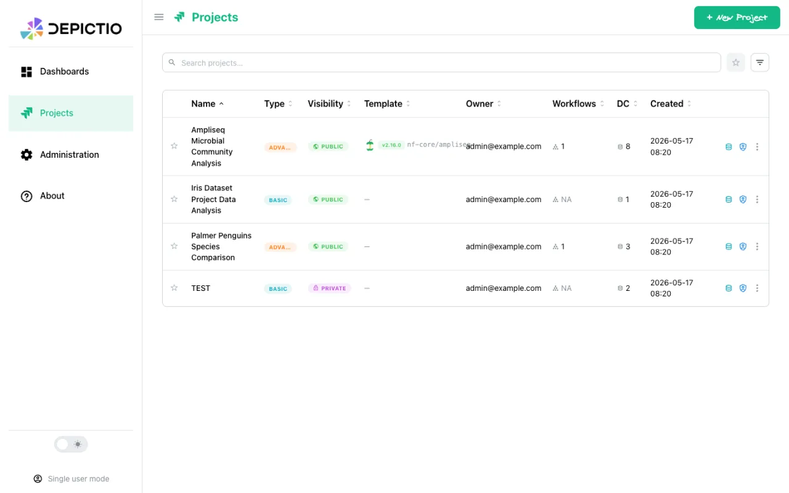
          <svg xmlns="http://www.w3.org/2000/svg" viewBox="0 0 24 24"><path d="M15.5,14L20.5,19L19,20.5L14,15.5V14.71L13.73,14.43C12.59,15.41 11.11,16 9.5,16A6.5,6.5 0 0,1 3,9.5A6.5,6.5 0 0,1 9.5,3A6.5,6.5 0 0,1 16,9.5C16,11.11 15.41,12.59 14.43,13.73L14.71,14H15.5M9.5,14C12,14 14,12 14,9.5C14,7 12,5 9.5,5C7,5 5,7 5,9.5C5,12 7,14 9.5,14M12,10H10V12H9V10H7V9H9V7H10V9H12V10Z"/></svg>
        </button>
      

      

        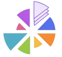Project &amp; template
        <h3>One pipeline, many runs, one place</h3>
        
A project holds the workflows, the data collections and the dashboards that belong together, declared once in YAML. A template turns that declaration into a reusable recipe, so the same project stands up again from any run of the same pipeline.

        
          <a class="feature-link" href="usage/projects/guide/">What a project is &rarr;</a>
          <a class="feature-link" href="usage/projects/templates/">Templates &rarr;</a>
        
      

    </article>

    <article class="feature-row">
      

        <button type="button" class="feature-frame" aria-label="Enlarge the screenshot: the Create a Data Collection dialog">
          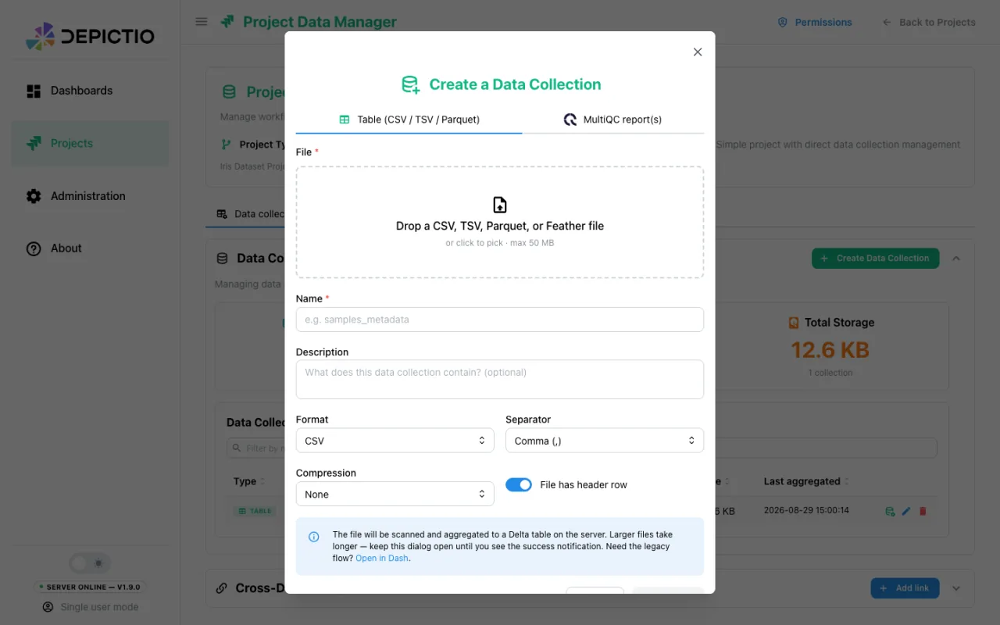
          <svg xmlns="http://www.w3.org/2000/svg" viewBox="0 0 24 24"><path d="M15.5,14L20.5,19L19,20.5L14,15.5V14.71L13.73,14.43C12.59,15.41 11.11,16 9.5,16A6.5,6.5 0 0,1 3,9.5A6.5,6.5 0 0,1 9.5,3A6.5,6.5 0 0,1 16,9.5C16,11.11 15.41,12.59 14.43,13.73L14.71,14H15.5M9.5,14C12,14 14,12 14,9.5C14,7 12,5 9.5,5C7,5 5,7 5,9.5C5,12 7,14 9.5,14M12,10H10V12H9V10H7V9H9V7H10V9H12V10Z"/></svg>
        </button>
      

      

        <svg xmlns="http://www.w3.org/2000/svg" viewBox="0 0 24 24" aria-hidden="true"><path d="M9,16V10H5L12,3L19,10H15V16H9M5,20V18H19V20H5Z"/></svg>Upload
        <h3>Or just drop the file in</h3>
        
No pipeline to point at yet? Drop a CSV, TSV, Parquet or Feather file straight into a project from the browser, or a MultiQC report, and Depictio scans it and aggregates it into a Delta table for you. The collection is ready to build on without touching the CLI.

        <a class="feature-link" href="usage/projects/guide/">Start a project &rarr;</a>
      

    </article>

    <article class="feature-row">
      

        <button type="button" class="feature-frame" aria-label="Enlarge the screenshot: the ingestion report">
          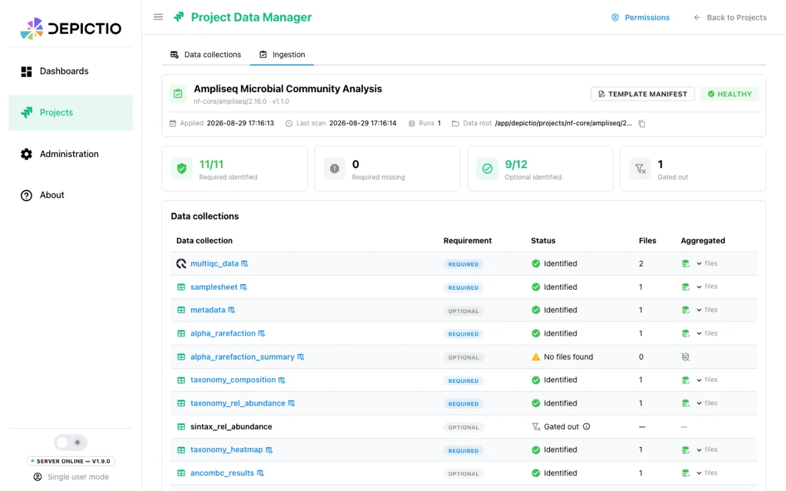
          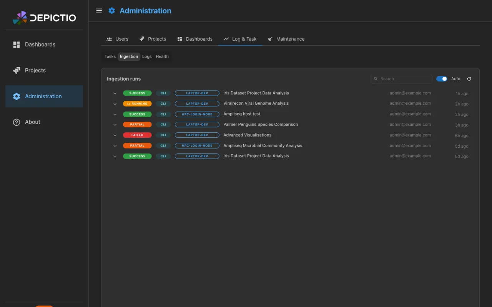
          <svg xmlns="http://www.w3.org/2000/svg" viewBox="0 0 24 24"><path d="M15.5,14L20.5,19L19,20.5L14,15.5V14.71L13.73,14.43C12.59,15.41 11.11,16 9.5,16A6.5,6.5 0 0,1 3,9.5A6.5,6.5 0 0,1 9.5,3A6.5,6.5 0 0,1 16,9.5C16,11.11 15.41,12.59 14.43,13.73L14.71,14H15.5M9.5,14C12,14 14,12 14,9.5C14,7 12,5 9.5,5C7,5 5,7 5,9.5C5,12 7,14 9.5,14M12,10H10V12H9V10H7V9H9V7H10V9H12V10Z"/></svg>
        </button>
      

      

        <svg xmlns="http://www.w3.org/2000/svg" viewBox="0 0 24 24" aria-hidden="true"><path d="M5,20H19V18H5M19,9H15V3H9V9H5L12,16L19,9Z"/></svg>Ingest
        <h3>Read where your data lives</h3>
        
The CLI scans the run on your own machine and pushes only the results. The ingestion report says what it found, what was missing, and the parameters the pipeline ran with.

      

    </article>

    <article class="feature-row">
      

        <button type="button" class="feature-frame" aria-label="Enlarge the screenshot: a dashboard in edit mode">
          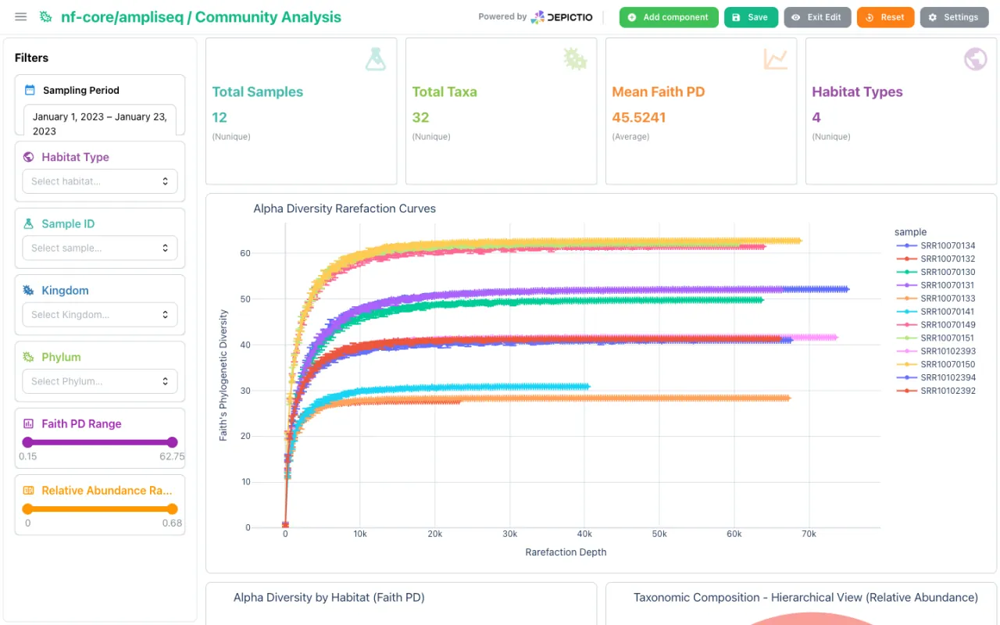
          <svg xmlns="http://www.w3.org/2000/svg" viewBox="0 0 24 24"><path d="M15.5,14L20.5,19L19,20.5L14,15.5V14.71L13.73,14.43C12.59,15.41 11.11,16 9.5,16A6.5,6.5 0 0,1 3,9.5A6.5,6.5 0 0,1 9.5,3A6.5,6.5 0 0,1 16,9.5C16,11.11 15.41,12.59 14.43,13.73L14.71,14H15.5M9.5,14C12,14 14,12 14,9.5C14,7 12,5 9.5,5C7,5 5,7 5,9.5C5,12 7,14 9.5,14M12,10H10V12H9V10H7V9H9V7H10V9H12V10Z"/></svg>
        </button>
      

      

        <svg xmlns="http://www.w3.org/2000/svg" viewBox="0 0 24 24" aria-hidden="true"><path d="M13,3V9H21V3M13,21H21V11H13M3,21H11V15H3M3,13H11V3H3V13Z"/></svg>Build
        <h3>Drag, drop, resize</h3>
        
Lay a dashboard out visually: figures, tables, metric cards, filters and MultiQC reports, arranged on a grid, no code required.

      

    </article>

    <article class="feature-row">
      

        <button type="button" class="feature-frame" aria-label="Enlarge the screenshot: the component design step">
          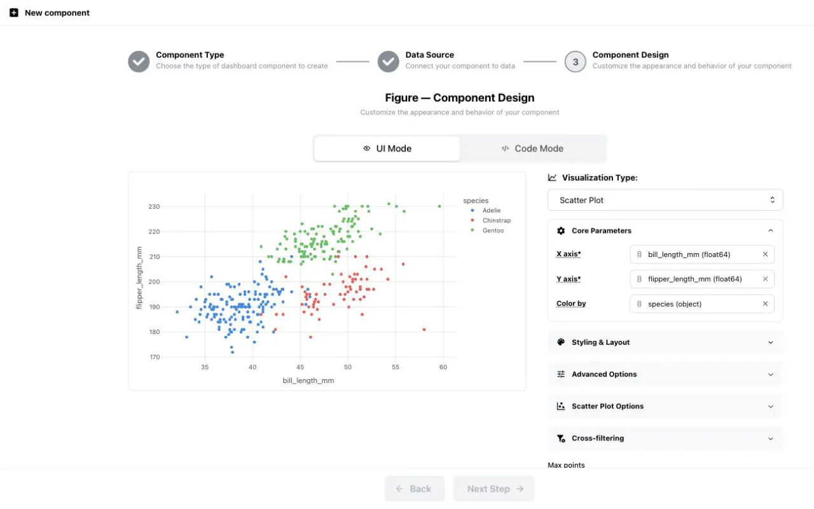
          <svg xmlns="http://www.w3.org/2000/svg" viewBox="0 0 24 24"><path d="M15.5,14L20.5,19L19,20.5L14,15.5V14.71L13.73,14.43C12.59,15.41 11.11,16 9.5,16A6.5,6.5 0 0,1 3,9.5A6.5,6.5 0 0,1 9.5,3A6.5,6.5 0 0,1 16,9.5C16,11.11 15.41,12.59 14.43,13.73L14.71,14H15.5M9.5,14C12,14 14,12 14,9.5C14,7 12,5 9.5,5C7,5 5,7 5,9.5C5,12 7,14 9.5,14M12,10H10V12H9V10H7V9H9V7H10V9H12V10Z"/></svg>
        </button>
      

      

        <svg xmlns="http://www.w3.org/2000/svg" viewBox="0 0 24 24" aria-hidden="true"><path d="M3,17V19H9V17H3M3,5V7H13V5H3M13,21V19H21V17H13V15H11V21H13M7,9V11H3V13H7V15H9V9H7M21,13V11H11V13H21M15,9H17V7H21V5H17V3H15V9Z"/></svg>Design
        <h3>Design your component</h3>
        
Adding a component starts with a choice, and this is the first branch: pick the type, connect it to a data collection, then tune it against a live preview. Axes, colours, layout, cross-filtering, and Code Mode when you want the Plotly figure itself.

        <a class="feature-link" href="usage/guides/dashboard_creation/">Build a dashboard &rarr;</a>
      

    </article>

    <article class="feature-row">
      

        <button type="button" class="feature-frame" aria-label="Enlarge the screenshot: the catalog browser">
          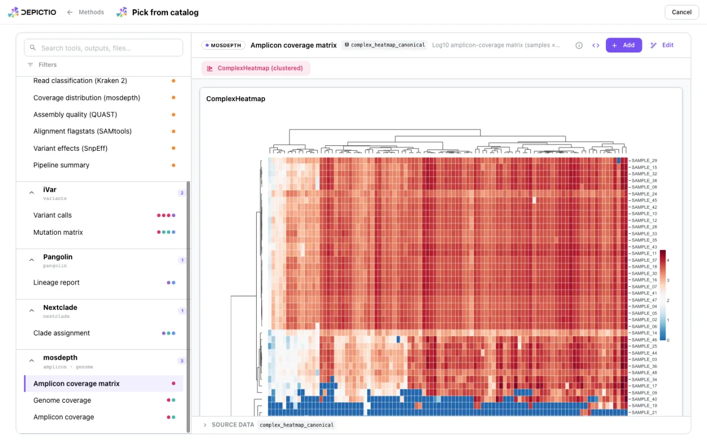
          <svg xmlns="http://www.w3.org/2000/svg" viewBox="0 0 24 24"><path d="M15.5,14L20.5,19L19,20.5L14,15.5V14.71L13.73,14.43C12.59,15.41 11.11,16 9.5,16A6.5,6.5 0 0,1 3,9.5A6.5,6.5 0 0,1 9.5,3A6.5,6.5 0 0,1 16,9.5C16,11.11 15.41,12.59 14.43,13.73L14.71,14H15.5M9.5,14C12,14 14,12 14,9.5C14,7 12,5 9.5,5C7,5 5,7 5,9.5C5,12 7,14 9.5,14M12,10H10V12H9V10H7V9H9V7H10V9H12V10Z"/></svg>
        </button>
      

      

        <svg xmlns="http://www.w3.org/2000/svg" viewBox="0 0 24 24" aria-hidden="true"><path d="M20.5,11H19V7C19,5.89 18.1,5 17,5H13V3.5A2.5,2.5 0 0,0 10.5,1A2.5,2.5 0 0,0 8,3.5V5H4A2,2 0 0,0 2,7V10.8H3.5C5,10.8 6.2,12 6.2,13.5C6.2,15 5,16.2 3.5,16.2H2V20A2,2 0 0,0 4,22H7.8V20.5C7.8,19 9,17.8 10.5,17.8C12,17.8 13.2,19 13.2,20.5V22H17A2,2 0 0,0 19,20V16H20.5A2.5,2.5 0 0,0 23,13.5A2.5,2.5 0 0,0 20.5,11Z"/></svg>Catalog
        <h3>Or take one off the shelf</h3>
        
The other branch: Depictio recognises the tool behind each output and offers the visualizations that tool is known to support, pre-configured and previewed at the exact grid box the component will occupy.

        <a class="feature-link" href="usage/guides/catalog-picker/">Pick from the catalog &rarr;</a>
      

    </article>

    <article class="feature-row">
      

        <button type="button" class="feature-frame" aria-label="Enlarge the screenshot: Tool Studio">
          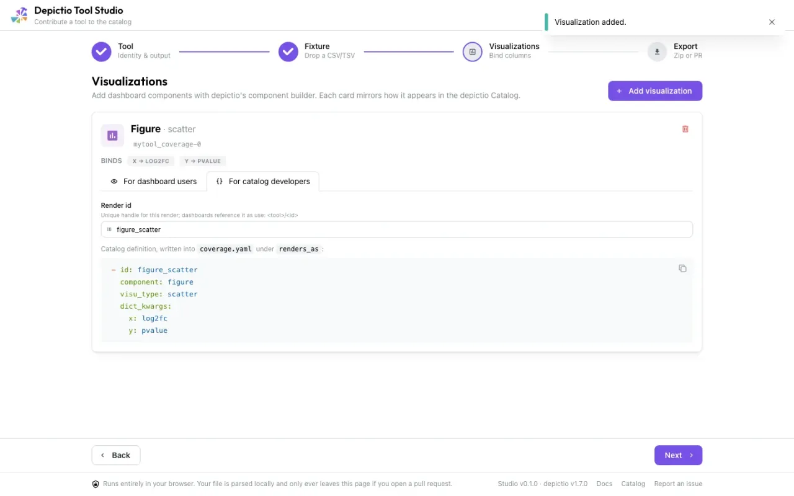
          <svg xmlns="http://www.w3.org/2000/svg" viewBox="0 0 24 24"><path d="M15.5,14L20.5,19L19,20.5L14,15.5V14.71L13.73,14.43C12.59,15.41 11.11,16 9.5,16A6.5,6.5 0 0,1 3,9.5A6.5,6.5 0 0,1 9.5,3A6.5,6.5 0 0,1 16,9.5C16,11.11 15.41,12.59 14.43,13.73L14.71,14H15.5M9.5,14C12,14 14,12 14,9.5C14,7 12,5 9.5,5C7,5 5,7 5,9.5C5,12 7,14 9.5,14M12,10H10V12H9V10H7V9H9V7H10V9H12V10Z"/></svg>
        </button>
      

      

        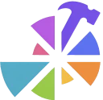Tools catalog
        <h3>Add your tool without writing YAML</h3>
        
And the shelf is yours to stock. Drop one output file, bind its columns in Depictio's own component builder, and Tool Studio writes the catalog entry and opens the pull request for you, so the next person picks what you designed.

        <a class="feature-link" href="developer/tool-studio/">Open Tool Studio &rarr;</a>
      

    </article>

    <article class="feature-row">
      

        <button type="button" class="feature-frame" aria-label="Enlarge the screenshot: a clustered heatmap">
          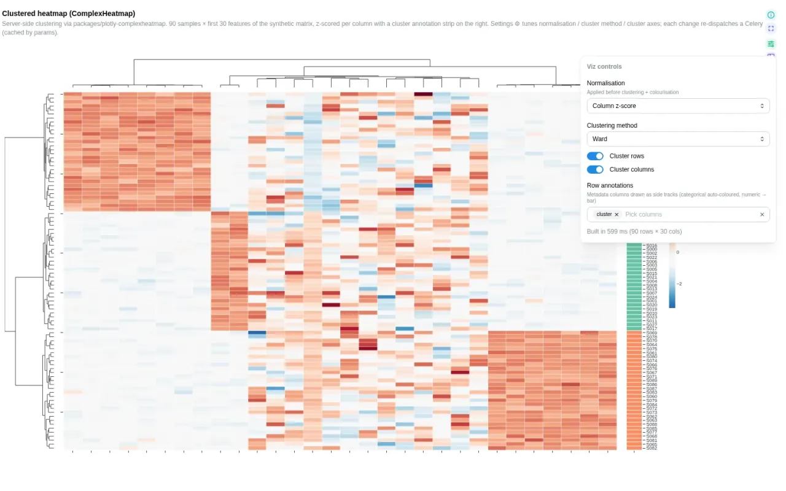
          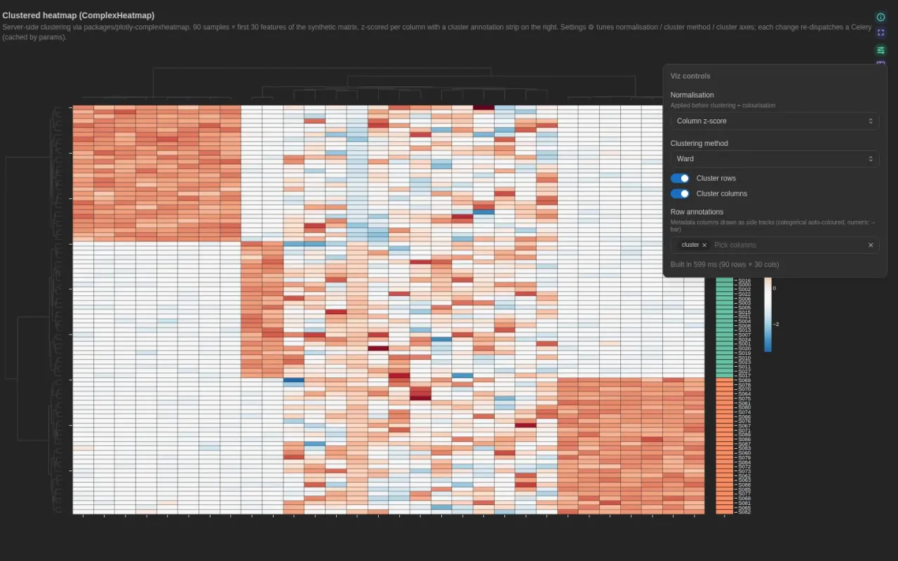
          <svg xmlns="http://www.w3.org/2000/svg" viewBox="0 0 24 24"><path d="M15.5,14L20.5,19L19,20.5L14,15.5V14.71L13.73,14.43C12.59,15.41 11.11,16 9.5,16A6.5,6.5 0 0,1 3,9.5A6.5,6.5 0 0,1 9.5,3A6.5,6.5 0 0,1 16,9.5C16,11.11 15.41,12.59 14.43,13.73L14.71,14H15.5M9.5,14C12,14 14,12 14,9.5C14,7 12,5 9.5,5C7,5 5,7 5,9.5C5,12 7,14 9.5,14M12,10H10V12H9V10H7V9H9V7H10V9H12V10Z"/></svg>
        </button>
      

      

        <svg xmlns="http://www.w3.org/2000/svg" viewBox="0 0 24 24" aria-hidden="true"><path d="M2 2h2v18h18v2H2zm12 12.5L12 18H7.94l-2.02-3.5L7.94 11H12zm.08-8L12.06 10H8L6 6.5L8 3h4.06zm7.17 4L19.23 14h-4.04l-2.02-3.5L15.19 7h4.04z"/></svg>Visualize
        <h3>Plots built for omics</h3>
        
Volcano, Manhattan, UpSet, hierarchical heatmaps, phylogeny, ordination and a dozen more, alongside the usual scatter and bar charts. Each one is an <em>advanced viz</em>: you bind it to any table or file whose columns fit it, rather than waiting for the tool that produced the data to draw it for you.

        <a class="feature-link" href="features/components/#advanced-visualizations">Every advanced viz &rarr;</a>
      

    </article>

    <article class="feature-row">
      

        <button type="button" class="feature-frame" aria-label="Enlarge the screenshot: a MultiQC tab in a dashboard">
          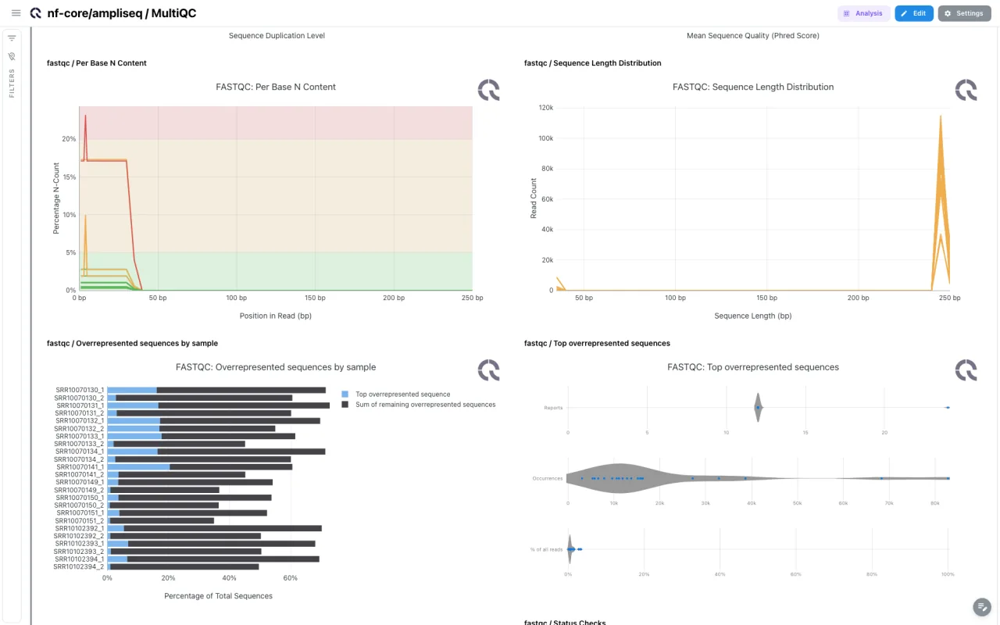
          <svg xmlns="http://www.w3.org/2000/svg" viewBox="0 0 24 24"><path d="M15.5,14L20.5,19L19,20.5L14,15.5V14.71L13.73,14.43C12.59,15.41 11.11,16 9.5,16A6.5,6.5 0 0,1 3,9.5A6.5,6.5 0 0,1 9.5,3A6.5,6.5 0 0,1 16,9.5C16,11.11 15.41,12.59 14.43,13.73L14.71,14H15.5M9.5,14C12,14 14,12 14,9.5C14,7 12,5 9.5,5C7,5 5,7 5,9.5C5,12 7,14 9.5,14M12,10H10V12H9V10H7V9H9V7H10V9H12V10Z"/></svg>
        </button>
      

      

        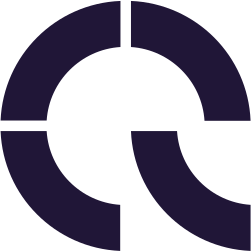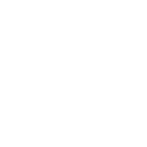MultiQC
        <h3>Every QC report, in the dashboard</h3>
        
The CLI scans and aggregates the MultiQC reports a run produced, and their data becomes components you place like any other: General Statistics as a table, each module's plot as its own card. One sample filter reaches all of them, and several runs sit side by side rather than in as many HTML files.

        <a class="feature-link" href="usage/guides/dashboard_creation/#multiqc-integration-v050">Working with MultiQC &rarr;</a>
      

    </article>

    <article class="feature-row">
      

        <button type="button" class="feature-frame" aria-label="Enlarge the screenshot: a clade selected on a phylogenetic tree">
          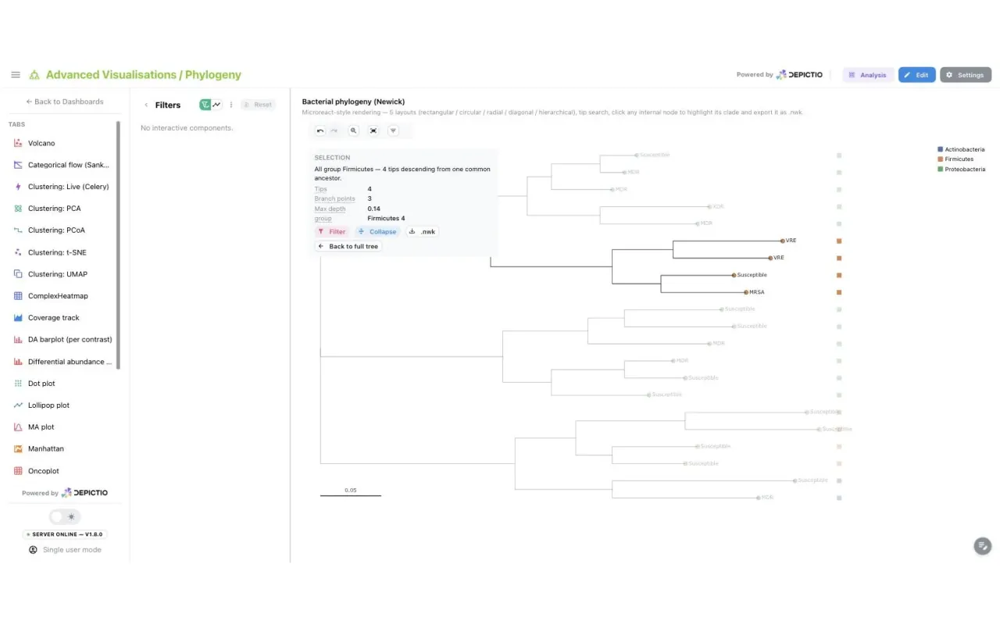
          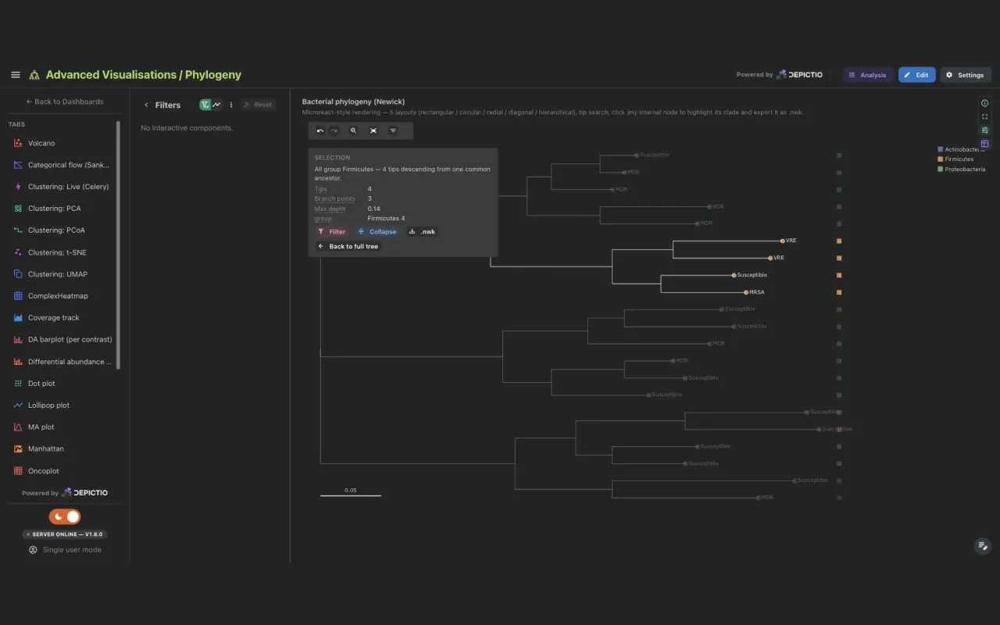
          <svg xmlns="http://www.w3.org/2000/svg" viewBox="0 0 24 24"><path d="M15.5,14L20.5,19L19,20.5L14,15.5V14.71L13.73,14.43C12.59,15.41 11.11,16 9.5,16A6.5,6.5 0 0,1 3,9.5A6.5,6.5 0 0,1 9.5,3A6.5,6.5 0 0,1 16,9.5C16,11.11 15.41,12.59 14.43,13.73L14.71,14H15.5M9.5,14C12,14 14,12 14,9.5C14,7 12,5 9.5,5C7,5 5,7 5,9.5C5,12 7,14 9.5,14M12,10H10V12H9V10H7V9H9V7H10V9H12V10Z"/></svg>
        </button>
      

      

        <svg xmlns="http://www.w3.org/2000/svg" viewBox="0 0 24 24" aria-hidden="true"><path d="M9,2V8H11V10H5A2,2 0 0,0 3,12V14H1V20H7V14H5V12H11V14H9V20H15V14H13V12H19V14H17V20H23V14H21V12A2,2 0 0,0 19,10H13V8H15V2H9Z"/></svg>Explore
        <h3>Follow a subtree, not a table</h3>
        
Pick a clade and filter the whole dashboard down to it. Group samples once and every component colours by that grouping, side by side.

      

    </article>

    <article class="feature-row">
      

        <button type="button" class="feature-frame" aria-label="Enlarge the screenshot: a dashboard compared by selection group">
          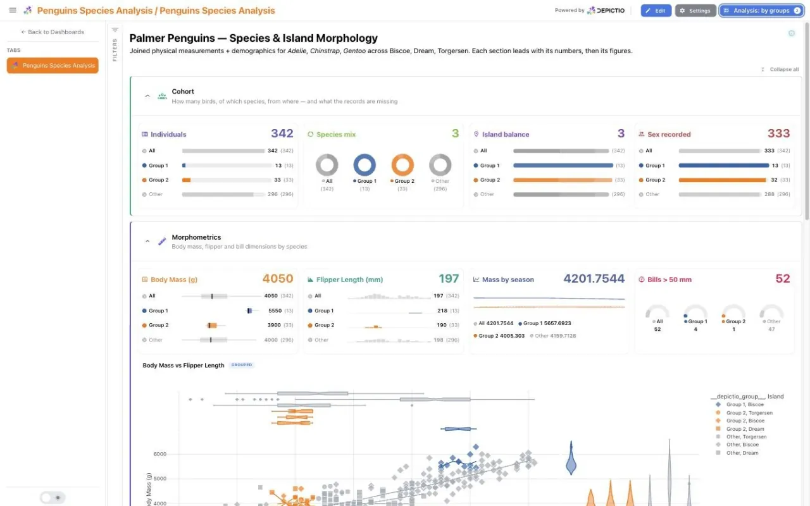
          <svg xmlns="http://www.w3.org/2000/svg" viewBox="0 0 24 24"><path d="M15.5,14L20.5,19L19,20.5L14,15.5V14.71L13.73,14.43C12.59,15.41 11.11,16 9.5,16A6.5,6.5 0 0,1 3,9.5A6.5,6.5 0 0,1 9.5,3A6.5,6.5 0 0,1 16,9.5C16,11.11 15.41,12.59 14.43,13.73L14.71,14H15.5M9.5,14C12,14 14,12 14,9.5C14,7 12,5 9.5,5C7,5 5,7 5,9.5C5,12 7,14 9.5,14M12,10H10V12H9V10H7V9H9V7H10V9H12V10Z"/></svg>
        </button>
      

      

        <svg xmlns="http://www.w3.org/2000/svg" viewBox="0 0 24 24" aria-hidden="true"><path d="M12,5.5A3.5,3.5 0 0,1 15.5,9A3.5,3.5 0 0,1 12,12.5A3.5,3.5 0 0,1 8.5,9A3.5,3.5 0 0,1 12,5.5M5,8C5.56,8 6.08,8.15 6.53,8.42C6.38,9.85 6.8,11.27 7.66,12.38C7.16,13.34 6.16,14 5,14A3,3 0 0,1 2,11A3,3 0 0,1 5,8M19,8A3,3 0 0,1 22,11A3,3 0 0,1 19,14C17.84,14 16.84,13.34 16.34,12.38C17.2,11.27 17.62,9.85 17.47,8.42C17.92,8.15 18.44,8 19,8M5.5,18.25C5.5,16.18 8.41,14.5 12,14.5C15.59,14.5 18.5,16.18 18.5,18.25V20H5.5V18.25M0,20V18.5C0,17.11 1.89,15.94 4.45,15.6C3.86,16.28 3.5,17.22 3.5,18.25V20H0M24,20H20.5V18.25C20.5,17.22 20.14,16.28 19.55,15.6C22.11,15.94 24,17.11 24,18.5V20Z"/></svg>Group
        <h3>Slice it, then compare</h3>
        
Save a selection as a group and every component colours by that grouping at once, or splits into one panel per group, so two cohorts sit side by side rather than in two browser tabs.

      

    </article>

    <article class="feature-row">
      

        <button type="button" class="feature-frame" aria-label="Enlarge the screenshot: a floating map panel">
          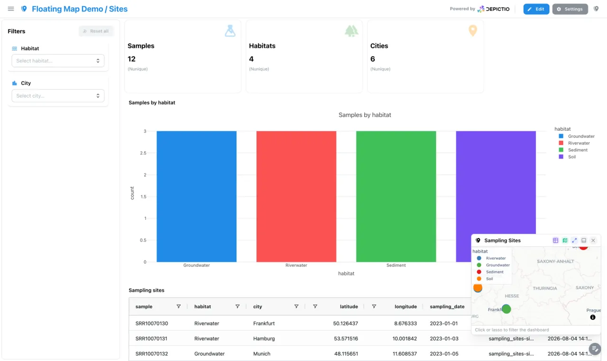
          <svg xmlns="http://www.w3.org/2000/svg" viewBox="0 0 24 24"><path d="M15.5,14L20.5,19L19,20.5L14,15.5V14.71L13.73,14.43C12.59,15.41 11.11,16 9.5,16A6.5,6.5 0 0,1 3,9.5A6.5,6.5 0 0,1 9.5,3A6.5,6.5 0 0,1 16,9.5C16,11.11 15.41,12.59 14.43,13.73L14.71,14H15.5M9.5,14C12,14 14,12 14,9.5C14,7 12,5 9.5,5C7,5 5,7 5,9.5C5,12 7,14 9.5,14M12,10H10V12H9V10H7V9H9V7H10V9H12V10Z"/></svg>
        </button>
      

      

        <svg xmlns="http://www.w3.org/2000/svg" viewBox="0 0 24 24" aria-hidden="true"><path d="M15,19L9,16.89V5L15,7.11M20.5,3C20.44,3 20.39,3 20.34,3L15,5.1L9,3L3.36,4.9C3.15,4.97 3,5.15 3,5.38V20.5A0.5,0.5 0 0,0 3.5,21C3.55,21 3.61,21 3.66,20.97L9,18.9L15,21L20.64,19.1C20.85,19 21,18.85 21,18.62V3.5A0.5,0.5 0 0,0 20.5,3Z"/></svg>Map
        <h3>Where the samples came from</h3>
        
Dock a map beside the dashboard or float it over the grid. Lasso a region and every other component filters down to the samples inside it, like any other filter.

      

    </article>

    <article class="feature-row">
      

        <button type="button" class="feature-frame" aria-label="Enlarge the screenshot: sections across tabs">
          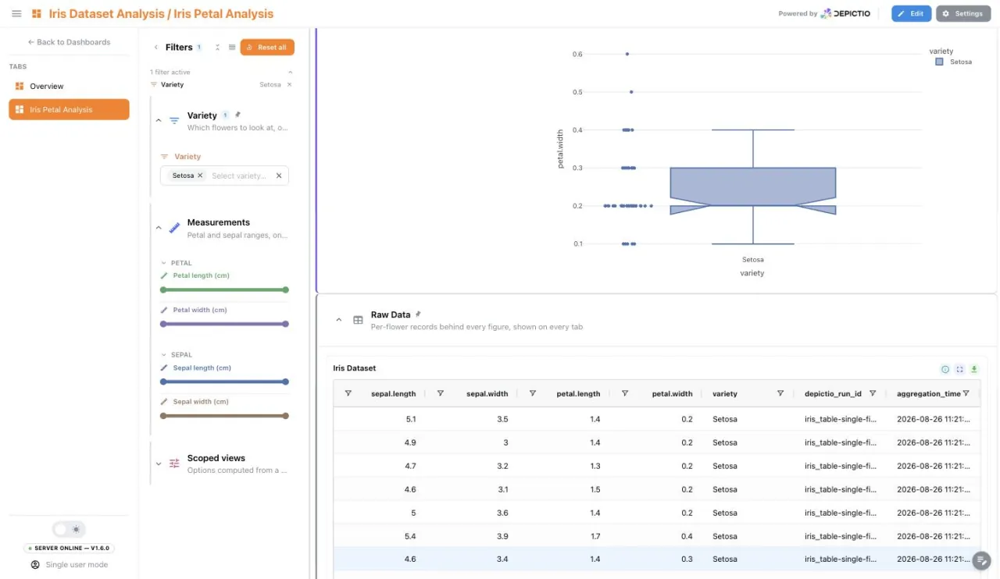
          <svg xmlns="http://www.w3.org/2000/svg" viewBox="0 0 24 24"><path d="M15.5,14L20.5,19L19,20.5L14,15.5V14.71L13.73,14.43C12.59,15.41 11.11,16 9.5,16A6.5,6.5 0 0,1 3,9.5A6.5,6.5 0 0,1 9.5,3A6.5,6.5 0 0,1 16,9.5C16,11.11 15.41,12.59 14.43,13.73L14.71,14H15.5M9.5,14C12,14 14,12 14,9.5C14,7 12,5 9.5,5C7,5 5,7 5,9.5C5,12 7,14 9.5,14M12,10H10V12H9V10H7V9H9V7H10V9H12V10Z"/></svg>
        </button>
      

      

        <svg xmlns="http://www.w3.org/2000/svg" viewBox="0 0 24 24" aria-hidden="true"><path d="M3,3H21V7H3V3M3,9H21V13H3V9M3,15H21V19H3V15Z"/></svg>Organise
        <h3>Room for a real dashboard</h3>
        
Group cards into sections, keep one filter panel across a family of tabs, dock a map beside the data, and inspect any component to see where its numbers come from.

      

    </article>

    <article class="feature-row">
      

        <button type="button" class="feature-frame" aria-label="Enlarge the screenshot: a live dashboard">
          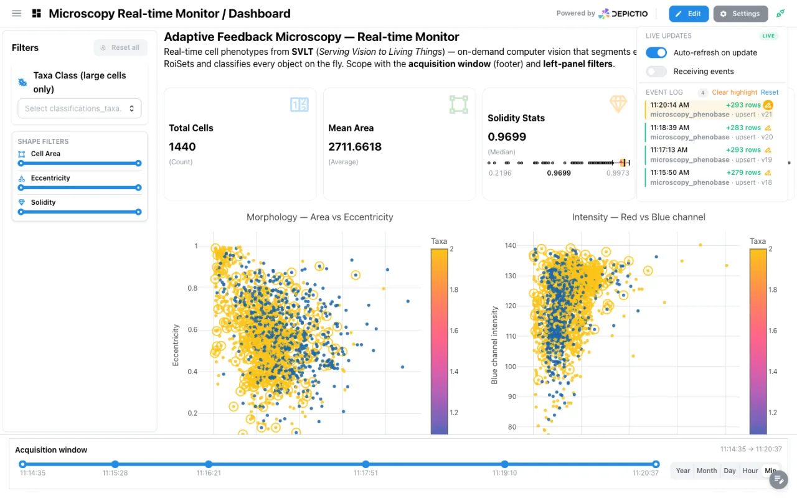
          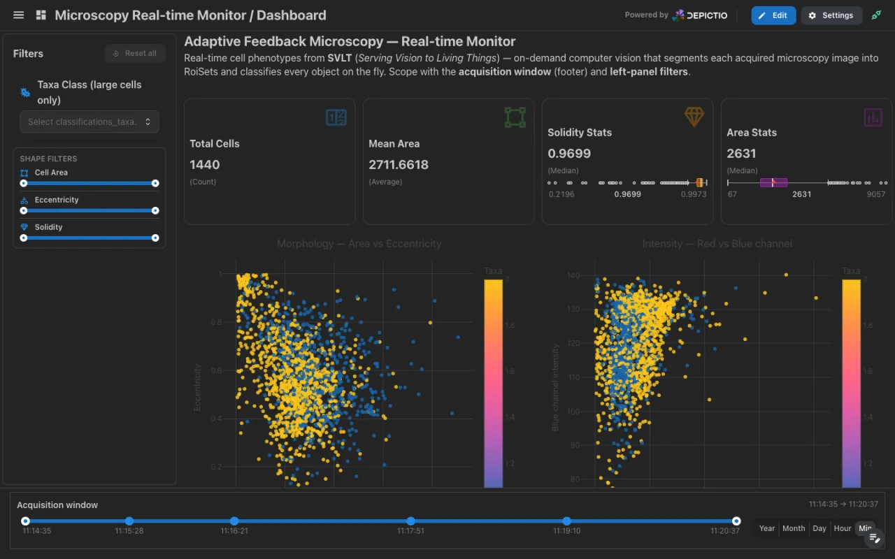
          <svg xmlns="http://www.w3.org/2000/svg" viewBox="0 0 24 24"><path d="M15.5,14L20.5,19L19,20.5L14,15.5V14.71L13.73,14.43C12.59,15.41 11.11,16 9.5,16A6.5,6.5 0 0,1 3,9.5A6.5,6.5 0 0,1 9.5,3A6.5,6.5 0 0,1 16,9.5C16,11.11 15.41,12.59 14.43,13.73L14.71,14H15.5M9.5,14C12,14 14,12 14,9.5C14,7 12,5 9.5,5C7,5 5,7 5,9.5C5,12 7,14 9.5,14M12,10H10V12H9V10H7V9H9V7H10V9H12V10Z"/></svg>
        </button>
      

      

        <svg xmlns="http://www.w3.org/2000/svg" viewBox="0 0 24 24" aria-hidden="true"><path d="M11,15H6L13,1V9H18L11,23V15Z"/></svg>Live
        <h3>Watch a run as it lands</h3>
        
Turn on live mode and the dashboard refreshes itself while the pipeline is still going, with the events that changed it listed as they arrive.

      

    </article>

    <article class="feature-row">
      

        <button type="button" class="feature-frame" aria-label="Enlarge the screenshot: the admin Log and Task view">
          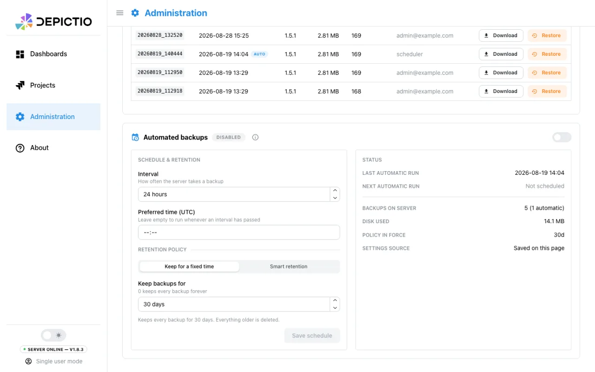
          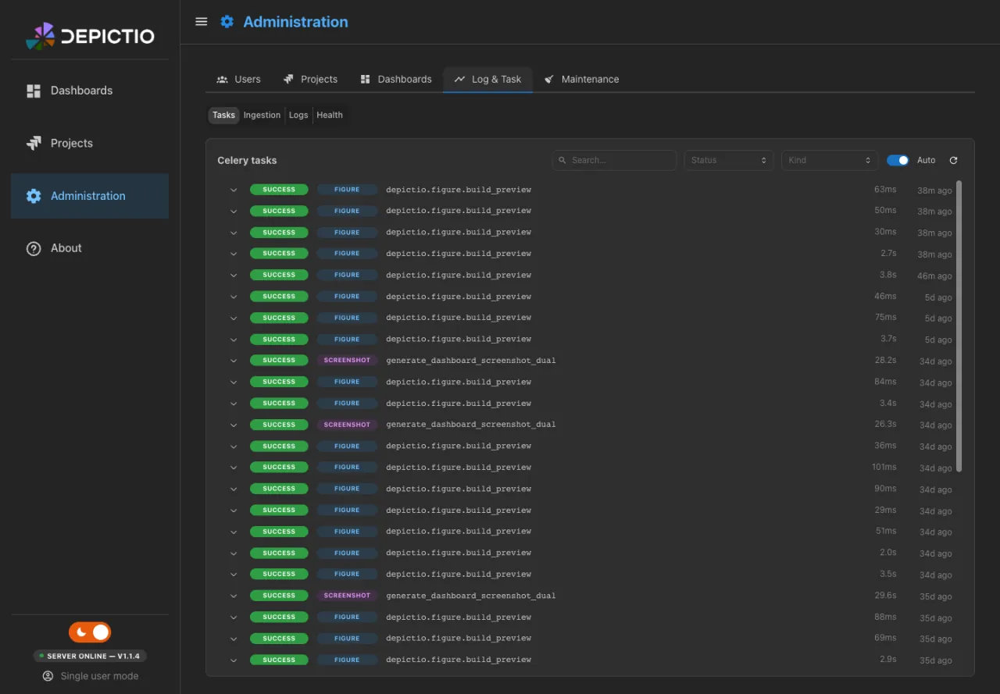
          <svg xmlns="http://www.w3.org/2000/svg" viewBox="0 0 24 24"><path d="M15.5,14L20.5,19L19,20.5L14,15.5V14.71L13.73,14.43C12.59,15.41 11.11,16 9.5,16A6.5,6.5 0 0,1 3,9.5A6.5,6.5 0 0,1 9.5,3A6.5,6.5 0 0,1 16,9.5C16,11.11 15.41,12.59 14.43,13.73L14.71,14H15.5M9.5,14C12,14 14,12 14,9.5C14,7 12,5 9.5,5C7,5 5,7 5,9.5C5,12 7,14 9.5,14M12,10H10V12H9V10H7V9H9V7H10V9H12V10Z"/></svg>
        </button>
      

      

        <svg xmlns="http://www.w3.org/2000/svg" viewBox="0 0 24 24" aria-hidden="true"><path d="M12,15.5A3.5,3.5 0 0,1 8.5,12A3.5,3.5 0 0,1 12,8.5A3.5,3.5 0 0,1 15.5,12A3.5,3.5 0 0,1 12,15.5M19.43,12.97C19.47,12.65 19.5,12.33 19.5,12C19.5,11.67 19.47,11.34 19.43,11L21.54,9.37C21.73,9.22 21.78,8.95 21.66,8.73L19.66,5.27C19.54,5.05 19.27,4.96 19.05,5.05L16.56,6.05C16.04,5.66 15.5,5.32 14.87,5.07L14.5,2.42C14.46,2.18 14.25,2 14,2H10C9.75,2 9.54,2.18 9.5,2.42L9.13,5.07C8.5,5.32 7.96,5.66 7.44,6.05L4.95,5.05C4.73,4.96 4.46,5.05 4.34,5.27L2.34,8.73C2.21,8.95 2.27,9.22 2.46,9.37L4.57,11C4.53,11.34 4.5,11.67 4.5,12C4.5,12.33 4.53,12.65 4.57,12.97L2.46,14.63C2.27,14.78 2.21,15.05 2.34,15.27L4.34,18.73C4.46,18.95 4.73,19.03 4.95,18.95L7.44,17.94C7.96,18.34 8.5,18.68 9.13,18.93L9.5,21.58C9.54,21.82 9.75,22 10,22H14C14.25,22 14.46,21.82 14.5,21.58L14.87,18.93C15.5,18.67 16.04,18.34 16.56,17.94L19.05,18.95C19.27,19.03 19.54,18.95 19.66,18.73L21.66,15.27C21.78,15.05 21.73,14.78 21.54,14.63L19.43,12.97Z"/></svg>Operate
        <h3>Run it like your own</h3>
        
Tasks, ingestion runs, logs and health in one admin view. Scheduled backups with a retention policy, YAML export for version control, and branding down to the figure palette.

      

    </article>

  

</section>

<!-- Tools Catalog Section -->
<section class="catalog-landing-section">
  

    <h2 class="section-heading catalog-landing-title">
      
      Tools Catalog
    </h2>
    

      Depictio recognises the bioinformatics tools behind your data and offers the
      visualizations those tools are known to support, ready to drop on a dashboard.
    

    

      <a href="catalog/" class="catalog-landing-card">
        

          <svg xmlns="http://www.w3.org/2000/svg" viewBox="0 0 24 24" fill="currentColor">
            <path d="M6,3A1,1 0 0,0 5,4V6H3A2,2 0 0,0 1,8V19A2,2 0 0,0 3,21H21A2,2 0 0,0 23,19V8A2,2 0 0,0 21,6H19V4A1,1 0 0,0 18,3H6M7,5H17V6H7V5M3,8H21V11H16V10H14V11H10V10H8V11H3V8M3,13H8V14H10V13H14V14H16V13H21V19H3V13Z"/>
          </svg>
        

        <h4>Browse the catalog</h4>
        
Every recognised tool, every output, and what each one renders as. Previewed on real fixture data.

        Open the catalog &rarr;
      </a>

      <a href="usage/guides/catalog-picker/" class="catalog-landing-card">
        

          <svg xmlns="http://www.w3.org/2000/svg" viewBox="0 0 24 24" fill="currentColor">
            <path d="M13.13 22.19L11.5 18.36C13.07 17.78 14.54 17 15.9 16.09L13.13 22.19M5.64 12.5L1.81 10.87L7.91 8.1C7 9.46 6.22 10.93 5.64 12.5M21.61 2.39C21.61 2.39 16.66 .269 11 5.93C8.81 8.12 7.5 10.53 6.65 12.64C6.37 13.39 6.56 14.21 7.11 14.77L9.24 16.89C9.79 17.44 10.61 17.63 11.36 17.35C13.5 16.53 15.88 15.19 18.07 13C23.73 7.34 21.61 2.39 21.61 2.39M14.54 9.46C13.76 8.68 13.76 7.41 14.54 6.63S16.59 5.85 17.37 6.63C18.14 7.41 18.15 8.68 17.37 9.46C16.59 10.24 15.32 10.24 14.54 9.46M8.88 16.53L7.47 15.12L8.88 16.53M6.24 22L9.88 18.36C9.54 18.27 9.21 18.12 8.91 17.91L4.83 22H6.24M2 22H3.41L8.18 17.24L6.76 15.83L2 20.59V22M2 19.17L6.09 15.09C5.88 14.79 5.73 14.47 5.64 14.12L2 17.76V19.17Z"/>
          </svg>
        

        <h4>Pick, don't build</h4>
        
Adding a component starts with a choice: build it yourself, or pick a pre-configured one the catalog matched to your data.

        See the picker &rarr;
      </a>

      <a href="developer/tool-studio/" class="catalog-landing-card">
        

          <svg xmlns="http://www.w3.org/2000/svg" viewBox="0 0 24 24" fill="currentColor">
            <path d="M21.71,20.29L20.29,21.71A1,1 0 0,1 18.88,21.71L7,9.85A3.81,3.81 0 0,1 6,10A4,4 0 0,1 2,6C2,5.6 2.07,5.21 2.21,4.84L4.93,7.56L5.5,7C5.75,6.75 6.16,6.75 6.41,7L7,7.56L9.71,4.84C9.35,4.7 8.96,4.63 8.56,4.63A4,4 0 0,1 12.56,0.63C12.96,0.63 13.35,0.7 13.72,0.84L11,3.56L13.72,6.28L16.44,3.56C16.58,3.93 16.65,4.32 16.65,4.72A4,4 0 0,1 12.65,8.72L21.71,18.88A1,1 0 0,1 21.71,20.29M2.29,18.88L11.06,10.11L12.88,11.93L4.12,20.71A1,1 0 0,1 2.71,20.71L2.29,20.29A1,1 0 0,1 2.29,18.88Z"/>
          </svg>
        

        <h4>Contribute a tool</h4>
        
Tool Studio authors an entry in the browser: drop an output file, bind its columns, and it opens the pull request for you.

        Open Tool Studio &rarr;
      </a>

    

  

</section>

<section class="getting-started-section">
  <h2 class="section-heading">
      <svg xmlns="http://www.w3.org/2000/svg" viewBox="0 0 24 24" aria-hidden="true"><path d="M10,16.5V7.5L16,12M12,2A10,10 0 0,0 2,12A10,10 0 0,0 12,22A10,10 0 0,0 22,12A10,10 0 0,0 12,2Z"/></svg>
      Getting Started
    </h2>
  
Ready to get started with Depictio?

  

    <a href="installation/docker/" class="installation-card docker">
      

        
      

      

        <h3>Docker Compose</h3>
        
Quickest way to get started

        Recommended
      

      

        <svg xmlns="http://www.w3.org/2000/svg" viewBox="0 0 24 24" fill="currentColor">
          <path d="M4,11V13H16L10.5,18.5L11.92,19.92L19.84,12L11.92,4.08L10.5,5.5L16,11H4Z"/>
        </svg>
      

    </a>

    <a href="installation/kubernetes/" class="installation-card kubernetes">
      

        
      

      

        <h3>Kubernetes</h3>
        
For production environments

        Production
      

      

        <svg xmlns="http://www.w3.org/2000/svg" viewBox="0 0 24 24" fill="currentColor">
          <path d="M4,11V13H16L10.5,18.5L11.92,19.92L19.84,12L11.92,4.08L10.5,5.5L16,11H4Z"/>
        </svg>
      

    </a>

    <a href="installation/cli/" class="installation-card cli">
      

        <svg xmlns="http://www.w3.org/2000/svg" viewBox="0 0 24 24" fill="currentColor">
          <path d="M20,19V7H4V19H20M20,3A2,2 0 0,1 22,5V19A2,2 0 0,1 20,21H4A2,2 0 0,1 2,19V5C2,3.89 2.9,3 4,3H20M13,17V15H18V17H13M9.58,13L5.57,9H8.4L11.7,12.3C12.09,12.69 12.09,13.33 11.7,13.72L8.42,17H5.59L9.58,13Z"/>
        </svg>
      

      

        <h3>CLI Tools</h3>
        
For data ingestion and management

        Tools
      

      

        <svg xmlns="http://www.w3.org/2000/svg" viewBox="0 0 24 24" fill="currentColor">
          <path d="M4,11V13H16L10.5,18.5L11.92,19.92L19.84,12L11.92,4.08L10.5,5.5L16,11H4Z"/>
        </svg>
      

    </a>
  

</section>

<!-- Funding Section -->
<section class="funding-section">
  <h2 class="section-heading">
      <svg xmlns="http://www.w3.org/2000/svg" viewBox="0 0 24 24" aria-hidden="true"><path d="M4,3C2.89,3 2,3.89 2,5V15A2,2 0 0,0 4,17H12V22L15,19L18,22V17H20A2,2 0 0,0 22,15V5C22,3.89 21.1,3 20,3H4M12,5L15,7L18,5V8.5L21,10L18,11.5V15L15,13L12,15V11.5L9,10L12,8.5V5M4,5H9V7H4V5M4,9H7V11H4V9M4,13H9V15H4V13Z"/></svg>
      Funding
    </h2>

  <!-- Statement about academic and public funding in a single sentence -->
  
Depictio is developed with the support of academic and public funding, enabling us to provide a free and open-source platform for the bioinformatics community.

  

    

      
      <h3>Marie Skłodowska-Curie Grant</h3>
      
This project has received funding from the European Union's Horizon 2020 research and innovation programme under the Marie Skłodowska-Curie grant agreement No 945405

      <a href="https://marie-sklodowska-curie-actions.ec.europa.eu/" class="md-button" target="_blank">Learn More</a>
    

    

      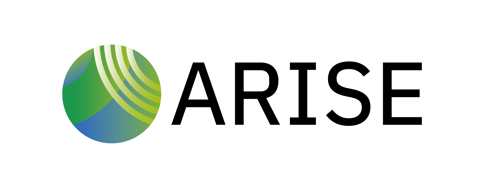
      <h3>ARISE Programme</h3>
      
ARISE is a postdoctoral research programme for technology developers, hosted at EMBL.

      <a href="https://www.embl.org/about/info/arise/" class="md-button" target="_blank">Learn More</a>
    

    

      
      <h3>EMBL</h3>
      
The European Molecular Biology Laboratory is Europe's flagship laboratory for the life sciences.

      <a href="https://www.embl.org/" class="md-button" target="_blank">Learn More</a>
    

  

</section>

<!-- Academic Partners Section -->
<section class="partners-section">
  <h2 class="section-heading">
      <svg xmlns="http://www.w3.org/2000/svg" viewBox="0 0 24 24" aria-hidden="true"><path d="M12,3L1,9L12,15L21,10.09V17H23V9M5,13.18V17.18L12,21L19,17.18V13.18L12,17L5,13.18Z"/></svg>
      Academic Partners
    </h2>
  

    

      
      <h3>SciLifeLab Data Centre</h3>
      
SciLifeLab Data Centre provides data-driven life science research infrastructure and expertise to accelerate open science in Sweden and beyond.

      <a href="https://www.scilifelab.se/data/" class="md-button" target="_blank">Learn More</a>
    

  

</section>

<!-- Technology Stack Section -->
<section class="tech-section">
  

    <h2 class="section-heading">
      Powered by Modern Technologies
    </h2>
    

      <a href="https://react.dev/" target="_blank" rel="noopener" class="tech-badge react">
        
        React
      </a>
      <a href="https://fastapi.tiangolo.com/" target="_blank" rel="noopener" class="tech-badge fastapi">
        
        FastAPI
      </a>
      <a href="https://www.mongodb.com/" target="_blank" rel="noopener" class="tech-badge mongodb">
        
        MongoDB
      </a>
      <a href="https://min.io/" target="_blank" rel="noopener" class="tech-badge minio">
        
        MinIO
      </a>
      <a href="https://pola.rs/" target="_blank" rel="noopener" class="tech-badge polars">
        
        Polars
      </a>
    

  

</section>

