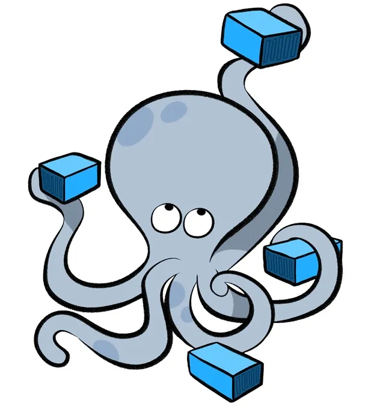

# Installation

## Depictio (server)

  

    
    <h3>Docker Compose</h3>
    
For development, testing, and small-scale deployments.

    <a href="docker/" class="md-button md-button--primary">Guide</a>
  

  

    
    <h3>Kubernetes</h3>
    
For production environments and scalable deployments.

    <a href="kubernetes/" class="md-button md-button--primary">Guide</a>
  

## Depictio-CLI

  

    
    <h3>Depictio-CLI</h3>
    
For data ingestion and management.

    <a href="cli/" class="md-button md-button--primary">Guide</a>
  

## Configuration

  

    
    <h3>Environment Variables</h3>
    
Configure authentication, backups, and advanced features.

    <a href="configuration/" class="md-button md-button--primary">Guide</a>
  

