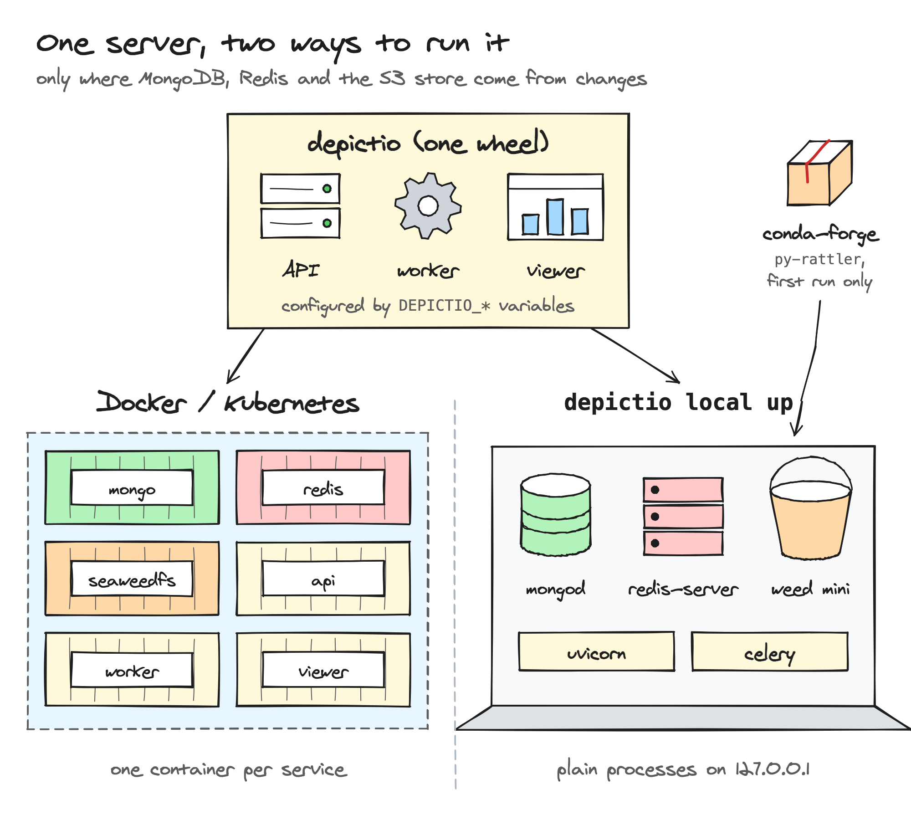
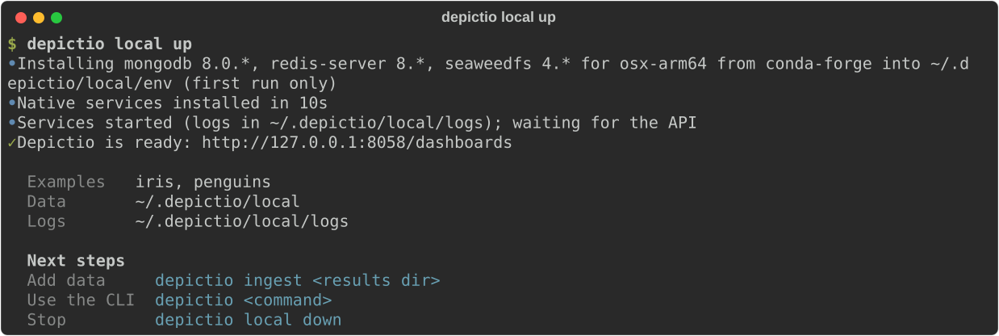
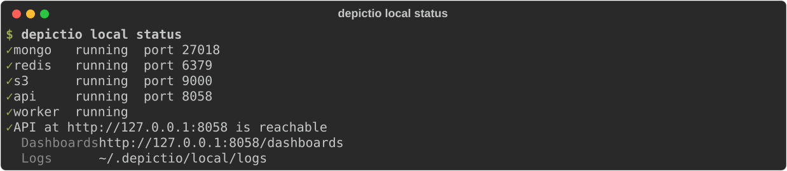
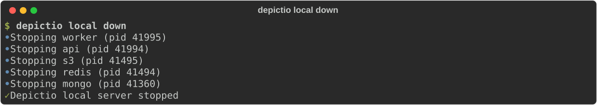
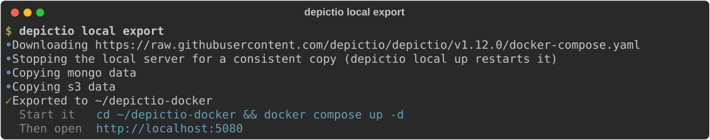

# Python Package Installation <small>(v1.12.0+)</small>

Install `depictio[local]` with `uv` or `pip`, then run every service as a local process on your machine: no containers.

`depictio local up` starts the same API, worker and viewer as the
[Docker Compose](docker.md) and [Kubernetes](kubernetes.md) deployments, with
MongoDB, Redis and SeaweedFS (the S3 store) run as plain processes on
`127.0.0.1`. `depictio ingest` then adds your pipeline results, so you go from a
results directory to its dashboard without Docker, a cluster or a shared
instance.

Use it to review a template on your own results, or to try Depictio on a laptop.
For a team, a demo or production, use Docker Compose or Kubernetes: a local
server can later be [moved to Docker Compose](#move-to-docker-compose) with its
data.



---

## :material-rocket-launch: Quick Start

**Prerequisites**: Linux, or macOS on Apple silicon (see [Platforms](#platforms)),
with [uv](https://docs.astral.sh/uv/getting-started/installation/), or pip and
Python 3.11 to 3.14.

### Step 1: Install

=== "uv"

    ```bash
    uv tool install "depictio[local]"
    ```

    `uv tool install` puts the `depictio` command on your `PATH`, in an
    environment of its own. Prefer it to `uvx --from "depictio[local]" depictio local up`,
    which runs in a temporary environment and leaves no `depictio` command
    behind for `depictio local status` and `depictio local down`.

    If you installed the former `depictio-cli` package with `uv tool install`,
    add `--force`: it replaces the `depictio` and `depictio-cli` commands that
    package installed.

=== "pip"

    ```bash
    python3 -m venv ~/.venvs/depictio
    source ~/.venvs/depictio/bin/activate
    pip install "depictio[local]"
    ```

    The `depictio` command is on your `PATH` while the environment is active.

The `[local]` extra adds the server's Python dependencies, about 1.6 GB
installed, from prebuilt wheels on Python 3.11 to 3.14. The package carries the
viewer, already built.

??? info "From a clone of the repository"
    To run the code of a clone, install it in editable mode:

    ```bash
    git clone https://github.com/depictio/depictio.git
    cd depictio
    uv tool install -e ".[local]"
    ```

    A clone has no viewer bundle, so `depictio local up` builds it, with
    `pnpm install` then `pnpm run build`, when it is missing or older than its
    sources. That needs [Node.js](https://nodejs.org/) 20 or later with
    [pnpm](https://pnpm.io/installation) (`corepack enable pnpm`); the output
    goes to `~/.depictio/local/logs/viewer-build.log`. A build that fails does
    not stop the start: the server runs with the previous bundle, or without
    dashboards when there is none, and `up` says so.

### Step 2: Start the server

```bash
depictio local up
```



The first run downloads MongoDB, Redis and SeaweedFS from conda-forge into
`~/.depictio/local/env` (about 170 MB, once), seeds the Iris and Penguins
example projects, and waits for them to load so that their dashboards open with
data. It then opens the dashboards page in your browser,
`http://127.0.0.1:8058/dashboards` unless that port was taken (see
[Ports](#ports)). Later runs reuse the binaries and the data, and start in
seconds.

Over SSH, or on Linux without a display, no browser opens: `up` prints the
tunnel to run from your own machine, `ssh -L <port>:127.0.0.1:<port> <host>`,
then the URL to open there.

The next steps above need no `--server`: when no other server is configured (no
`~/.depictio/CLI.yaml`, and no `DEPICTIO_CLI_*` variable set), every
[CLI](../depictio-cli/usage.md) command reaches this server. Otherwise the
summary adds `--server local`, which names this server whatever else is
configured. See
[Which server a command uses](../depictio-cli/usage.md#choosing-a-server).

### Step 3: Add your results

```bash
depictio ingest path/to/results
```

[`depictio ingest`](../depictio-cli/usage.md#ingest-command) detects the
[template](../usage/projects/templates.md) from the pipeline name and version
the run recorded, and ends with links to the project and its dashboards. Pass
`--template` to choose the template, and template variables with `--var`.
nf-core results do not contain the samplesheet: when the template cannot find it
under `input/`, pass it explicitly.

```bash
depictio ingest path/to/results \
  --template nf-core/rnaseq/latest \
  --var SAMPLESHEET_FILE=samplesheet.csv
```

If the ingestion fails, the command exits with an error and the server keeps
running. To ingest the same results again after a new run, add
`--update-config`: it refreshes the project and keeps its dashboards as edited
in the viewer (see
[Refreshing a project](../depictio-cli/usage.md#refreshing-a-project)).

!!! note "Coming from v1.12.0-b1"
    `depictio local up` no longer ingests data. Given `--template`,
    `--data-root`, `--project-name` or `--var`, it prints the
    `depictio local up` and `depictio ingest` commands to run instead, and
    exits with code 2.

---

## :material-console: Manage the server

`depictio local` manages the server only: data goes in with
[`depictio ingest`](../depictio-cli/usage.md#ingest-command).

| Command | Effect |
|---------|--------|
| `depictio local up` | Start the services, print the summary and open the browser. A first run also downloads the binaries and seeds the examples |
| `depictio local open` | Open the dashboards page of the running server in a browser, or print the SSH tunnel to use |
| `depictio local status` | Show each process with its port, and whether the API answers. Exits with code 1 unless every process runs and the API answers |
| `depictio local down` | Stop every process. The data and the ports are kept for the next `up` |
| `depictio local wipe` | Stop the server and delete all its data. The downloaded binaries are kept. `--yes` skips the prompt |
| `depictio local export` | Stop the server and copy its data into a directory that Docker Compose runs, see [Move to Docker Compose](#move-to-docker-compose). Formerly `export-compose`, which still works |

=== "status"

    ```bash
    depictio local status
    ```

    

=== "down"

    ```bash
    depictio local down
    ```

    

### `up` options

| Option | Default | Description |
|--------|---------|-------------|
| `--examples` | `iris,penguins` | Example projects to seed on the first run of a local home: `iris`, `penguins`, `iris,penguins` or `none` |
| `--port` | the previous run's, else `8058` or a free one | Port of the API and the viewer, kept for later runs. A busy `--port` fails |
| `--open` / `--no-open` | `--open` | Open the dashboards page in a browser |
| `--screenshots` / `--no-screenshots` | off | Dashboard thumbnails through Playwright. Installs Chromium (about 150 MB) if needed |

- Examples are seeded on the first run of a local home only: `up` warns when
  `--examples` names one the home was created without.
- `up` on a server that is already running reuses it and prints the summary
  again. `--port` and `--screenshots` then apply only after
  `depictio local down`, and a warning says so.
- A second `up` on the same home while one is starting fails at once.
- Ctrl-C during startup stops what that run started, and exits with code 130.
  SIGTERM and SIGHUP, as when the terminal is closed, do the same, with code 128
  plus the signal number.

### Upgrade

```bash
depictio local down
uv tool upgrade depictio            # with pip: pip install --upgrade "depictio[local]"
depictio local up
```

Stop the server first, so that it starts again on the new version. The data
under `~/.depictio/local` is kept. `up` downloads the binaries again only when
the new version pins other MongoDB, Redis or SeaweedFS series.

---

## :material-cog-outline: How it differs from Docker Compose

Only configuration differs, and only through the usual `DEPICTIO_*` variables:
every service is pointed at `127.0.0.1`.

| | Docker Compose | Python package |
|---|---|---|
| MongoDB, Redis, S3 | containers | `mongod` 8.0.x, `redis-server` 8.x and `weed mini` (SeaweedFS) 4.x from conda-forge, fetched by [py-rattler](https://github.com/conda/rattler) |
| API | 4 gunicorn workers | 1 uvicorn worker |
| Celery worker | 4 processes | 2 slots: `prefork` on Linux, `threads` on macOS |
| Viewer | its own container, on `http://localhost:5080` | served by the API, on its port: `http://127.0.0.1:8058/dashboards` |
| Authentication | single-user, multi-user or public | single-user |
| Dashboard thumbnails | on | off unless `--screenshots` |

The conda-forge packages follow the major series of the Compose images (the 8.0
series for MongoDB), so their minor versions can be newer than the images'.
[`depictio local export`](#move-to-docker-compose) runs the exact MongoDB and
SeaweedFS versions of the local server, so the data never moves to an older one.

### Ports

The first `up` picks its ports on `127.0.0.1`: the defaults (API `8058`, MongoDB
`27018`, Redis `6379`, S3 `9000`) when they are free, any free port otherwise,
so a local server runs next to a Docker stack or another local server. The
ports are saved in `ports.json` and reused, so the dashboards URL stays the
same. A saved port that another program has taken since moves to a free one,
with a warning for the API port; a `--port` that is busy fails instead. The CLI
configuration follows the ports in use. SeaweedFS also opens internal ports
(master `9333`, volume `9340`, filer `8888`, admin `23646`, and their gRPC
ports), picked the same way at each start.

### Files

Everything lives under `~/.depictio/local`, or the folder `DEPICTIO_LOCAL_HOME`
names:

| Path | Content |
|------|---------|
| `env/` | MongoDB, Redis and SeaweedFS binaries |
| `mongo/`, `redis/`, `s3/` | Service data, kept between runs |
| `logs/` | One log per process: `api.log`, `worker.log`, `mongo.log`, `redis.log`, `s3.log`, and `viewer-build.log` for a viewer built from a clone |
| `keys/` | Token signing keys |
| `cli/` | The CLI configuration that `--server local` reads, with its admin token. `up` writes it again if it was deleted, with a new token, and revokes those of earlier rewrites |
| `backups/` | Backups that [`depictio backup create`](../usage/administration/backup.md) makes on this server |
| `cache/`, `multiqc_prerender/`, `screenshots/` | Caches, and dashboard thumbnails |
| `secrets.json` | Generated S3 and admin passwords |
| `ports.json` | Ports kept for the next `up` |
| `state.json` | Process IDs of the running server, deleted by `down` |
| `.depictio-local-home` | Marks the folder as a local home: `wipe` deletes nothing in a folder without it, and `up` refuses a folder that holds other files |

The local home, `keys/` and `cli/` are owner-only (`0700`); `secrets.json` and
the CLI configuration file are owner-only too (`0600`).

!!! warning "Shared machines"
    The local server runs in single-user mode: no login, and whoever reaches its
    port acts as its admin. It listens on `127.0.0.1` only, but on a shared
    machine, such as an HPC login node, every other user of that machine can
    reach it, and the data it serves. The owner-only files do not change that.
    On such a machine, load only data that every user of it may see, or use
    [Docker Compose](docker.md) in multi-user mode.

---

## :material-docker: Move to Docker Compose

A local server can be handed over to [Docker Compose](docker.md) with its
projects, dashboards and table data, for instance once a review turns into a
shared instance.

```bash
depictio local export
cd depictio-docker && docker compose up -d
```



`export` stops the local server if it is running, so that the copy is
consistent, then copies the MongoDB and SeaweedFS data and the token signing
keys into the directory, `depictio-docker` by default (`--out`). Everything
that can refuse the export (no local data, a directory that is not empty, no
compose file to use) is checked before the server is stopped. The two never
share files: `depictio local up` restarts the local server on its own data.

The directory is made owner-only (`0700`), since it holds the token signing
key. It holds:

| File | Content |
|------|---------|
| `docker-compose.yaml` | The compose file that matches the installed code: the clone's own file when `depictio` runs from a clone, otherwise the file of the release tag `v<version>` (betas included), downloaded from GitHub. A development build outside a clone matches no published file, and the command stops with a message |
| `docker-compose.override.yaml` | The `mongo` and `chrislusf/seaweedfs` images at the versions the local server ran, on the copied data. On Linux they run as your user, who owns the copied files |
| `.env` | Single-user mode, the local server's S3 and admin credentials and, for a release, `DEPICTIO_VERSION`. Owner-only |
| `data/` | The copied MongoDB and SeaweedFS data, and the key files |

Redis is not carried over, since it holds only cache and queues, and thumbnails
are rendered again. The token in `~/.depictio/local/cli` stays valid against the
Docker stack, since it was signed with the copied keys. The raw pipeline files
are not copied, only the tables built from them: to ingest again, point
`depictio ingest --server <file>` at the CLI configuration of the Docker stack.

---

## :material-monitor: Platforms

| Platform | Status |
|----------|--------|
| Linux x86_64 | Supported, tested in CI |
| Linux arm64 | Supported, tested in CI |
| macOS arm64 (Apple silicon) | Supported, tested in CI |
| macOS x86_64 (Intel) | Not supported: `cryptography`, a server dependency, ships macOS wheels for arm64 only. Use [Docker Compose](docker.md) |
| Windows | Not supported, `up` refuses to start: conda-forge has no `redis-server` for Windows, and the services are managed as POSIX process groups. Use [WSL2](https://learn.microsoft.com/windows/wsl/) or [Docker Compose](docker.md) |

Python 3.11 to 3.14 is supported: the dependencies install from prebuilt wheels
on each. CI runs the stack on Python 3.12.

On macOS the Celery worker runs in threads: a forked worker process that opens a
Delta table crashes there, because the libraries it loads are not safe to use
after `fork()`. Celery time limits and `max-tasks-per-child` do not apply to a
threads pool.

MongoDB 5 and later needs AVX on x86_64 and ARMv8.2-A on arm64, which rules out
some older machines such as the Raspberry Pi 4. `up` reports it when `mongod`
stops on an illegal instruction.

---

## :material-help-circle-outline: Troubleshooting

#### A service exited during startup

`up` stops the services it started and names the log to read, under
`~/.depictio/local/logs`.

#### A port is already in use

Every port moves to a free one by itself (see [Ports](#ports)): only an explicit
`--port` that is busy stops `up`. So two local servers, each with its own
`DEPICTIO_LOCAL_HOME`, or a local server and a Docker stack, run side by side.

#### On an HPC login node or behind a proxy

An HTTP proxy set in the environment does not break startup: the readiness
checks on `127.0.0.1` bypass it, SeaweedFS runs without the proxy variables, and
the API, the worker and any CLI command that reaches the local server get
`127.0.0.1` and `localhost` added to `no_proxy`. The downloads do need the
network: MongoDB, Redis and SeaweedFS from conda-forge on the first run, and the
compose file of `depictio local export`. When one fails, a one-line error says
so: check the network or the proxy settings, then run the command again. Over
SSH, open the server through the `ssh -L` tunnel that `up` prints, and mind the
[shared machines](#files) warning.

#### `DEPICTIO_*` settings are ignored

`up` does not pass the `DEPICTIO_*` variables of your shell to the server, since
they usually target another instance (`DEPICTIO_LOCAL_HOME` is read by
`depictio local` itself). The exception is `DEPICTIO_TELEMETRY_*`:
`DEPICTIO_TELEMETRY_ENABLED=false` (or `DO_NOT_TRACK=1`) turns
[telemetry](../features/telemetry.md) off for the local server too. The `AWS_*`
variables are not passed on either, so the services never reach another S3
store. Likewise, `DEPICTIO_CLI_TOKEN` and `DEPICTIO_CLI_API_BASE_URL`, which
usually hold the credentials of another server, never apply to
`--server local`.

#### The example dashboards show no data

The examples load in the background on the first run. If the server was stopped
before they finished, they stay incomplete, and `up` then warns that they did
not finish loading. `depictio local wipe`, then `depictio local up`, loads them
again.

#### Dashboards stay blank

The viewer bundle is missing, which only concerns an install from a clone,
where `up` builds it. `up` warns when the build fails: read
`~/.depictio/local/logs/viewer-build.log`, fix the cause (often pnpm or Node.js
missing), then run `depictio local down` and `depictio local up` again, which
builds it. A server that was already running when the sources changed only
gets a warning: `depictio local down`, then `depictio local up`, rebuilds it.

#### Start from scratch

`depictio local wipe --yes` deletes every project, dashboard and file of the
local server, with its passwords, keys and saved ports. The downloaded binaries
are kept. The next `up` seeds the examples again.

## Next Steps

- [Pipeline templates](../usage/projects/templates.md)
- [CLI usage](../depictio-cli/usage.md), with `--server local`, or by default when no other server is configured
- [Docker Compose](docker.md), to share an instance with a team
