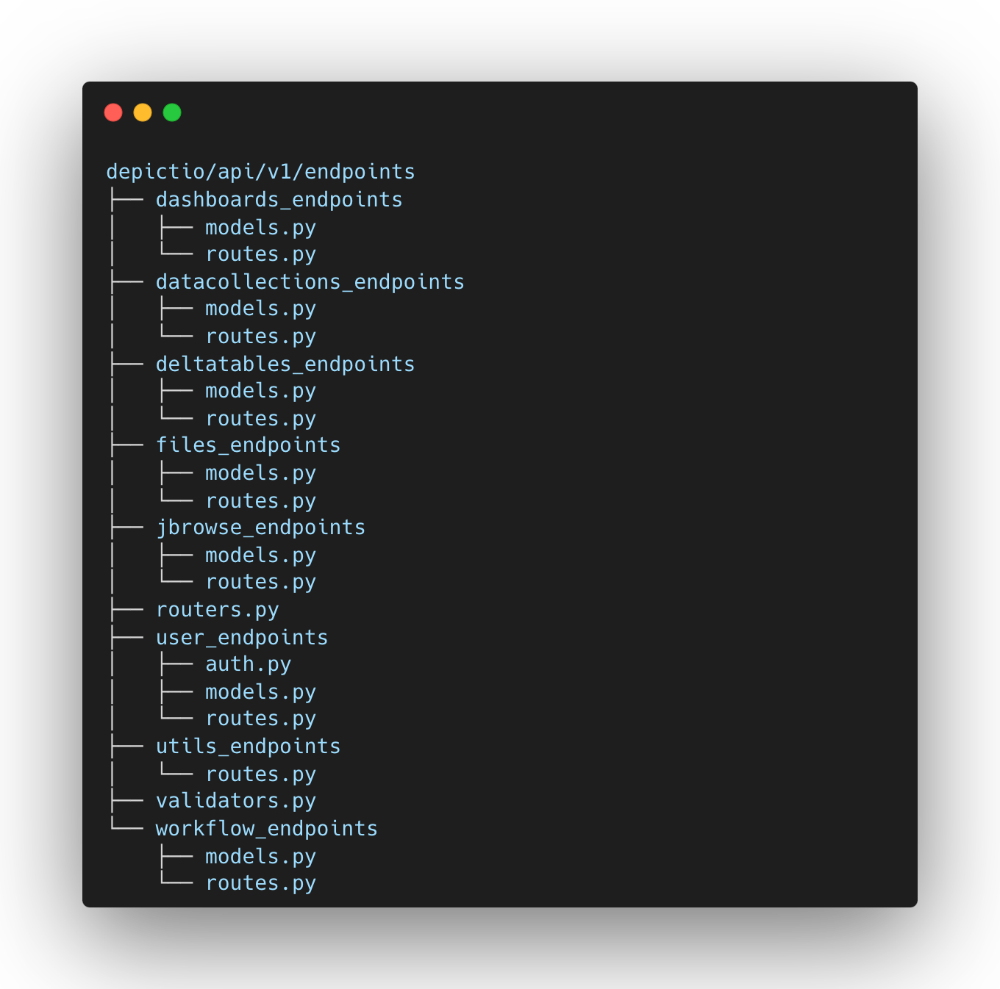

# Modularity

Depictio code is designed with a modular architecture, allowing for easy integration of new features and functionalities. The frontend and backend components are decoupled, enabling independent development and deployment of each module. The platform is built to be scalable and adaptable to various needs, with a focus on user-friendly interfaces and interactive data visualization tools. 

## General object model and database design

Depictio object model was designed to reflect production-oriented workflows. The architecture is built to ensure a clear separation of concerns, with distinct layers for workflows, workflow run configurations, runs, files generated, and data collections. This modular approach is reflected in both the database schema and the API structure.

### Workflow Object Design

* **Workflow**: The top-level entity that encapsulates that represents a production-oriented pipeline/workflow. 
* **Run Configurations**: These define the parameters and settings that were used to run a workflow. 
* **Runs**: Instances of a production workflow executed using a specific run configuration. Each run generates output files, that are structured the same way across runs. These files can then be associated into data collections.
* **Files**: Artifacts produced by each run. These can be intermediate or final results of the workflow.
* **Data Collections**: Aggregated data from files following the same structure.
  
The following diagram illustrates the relationships between different entities in Depictio:

## Code architecture

The code organisation clearly separates each of the frontend components and the API endpoints, making it easy to understand and extend the platform. 

### API structure

The API is structured to mirror the object design specified above, with each major component of the workflow having its own set of endpoints and models. The organization within `depictio/api/v1/endpoints` is as follows:

* **dashboards_endpoints**: Manages endpoints related to dashboards.
* **datacollections_endpoints**: Handles endpoints for data collections, mapping closely to the Data Collection objects in the design.
* **deltatables_endpoints**: Provides endpoints for delta tables, which are specific types of data collections with versioning.
* **files_endpoints**: Manages file-related endpoints, directly corresponding to the File objects.
* **jbrowse_endpoints**: Contains endpoints for jbrowse-specific functionalities, likely related to genomic data visualization.
* **user_endpoints**: Manages user authentication and authorization, including models and routes for user management.
* **utils_endpoints**: Provides utility endpoints, typically for internal or auxiliary operations.
* **workflow_endpoints**: Focuses on managing workflows, run configurations, and runs, reflecting the core of the workflow architecture.

Each endpoint is defined in a separate subfolder, where the `routes.py` file contains the API routes and the `models.py` file contains the object models associated.

### Dashboard components

The frontend components in Depictio are organized in the depictio/dash/modules folder, with each component defined in a separate subfolder. This modular design ensures easy integration and maintainability.

#### Component Structure

Each component folder typically contains:

* **frontend.py**: Implements Dash callback functions.
* **utils.py**: Contains helper functions for rendering and state management.

Each of the frontend components is designed to be modular and can be easily integrated into the dashboard. Each component is defined in a separate folder, containing the component logic and styling. The `frontend.py` file contains the dash callback functions implementation and the `utils.py` file contains the helpers functions used by the component, allowing the component to be re-rendered in different scenarios (first design, reload/restore, refresh after data update).

### Generic components (Data collection Table)
There are currently 4 main components supported to build your dashboard:

* Figures: Bar, Line, Scatter, Box and Histogram plots.
* Metrics cards: Cards displaying metrics values.
* Interactive components: (slider, dropdown, input text, etc.)
* Tables: Interactive tables with sorting, filtering and searching functionalities.

### Specific components
* JBrowse: Genome browser to visualize genomic data.
* Graphs: Network graphs to visualize interactions between entities.
* Geomap: Geographical map.

---------------

### Web UI 

To add a new component to the dashboard, you simply need to click on the "Add new component" button of your dashboard. This will open a 3-levels modal where you will be able to select:

1. The data source: it corresponds to the bioinformatics workflow and the data collection you want to be based on to build your new component.
  
2. The component type: it corresponds to the type of component (listed below) you want to add to your dashboard.

3. The component configuration: it corresponds to the configuration of the component you want to add to your dashboard.