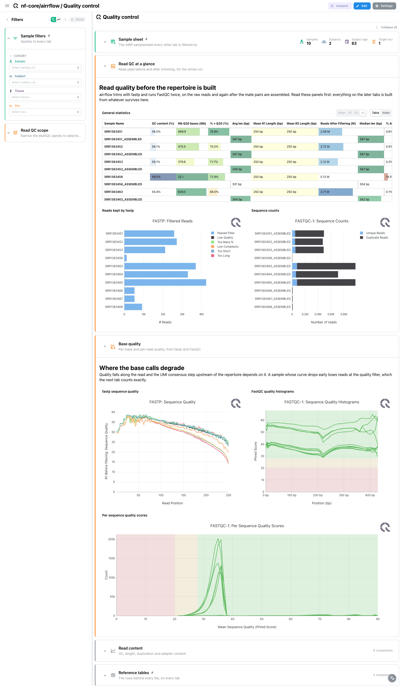
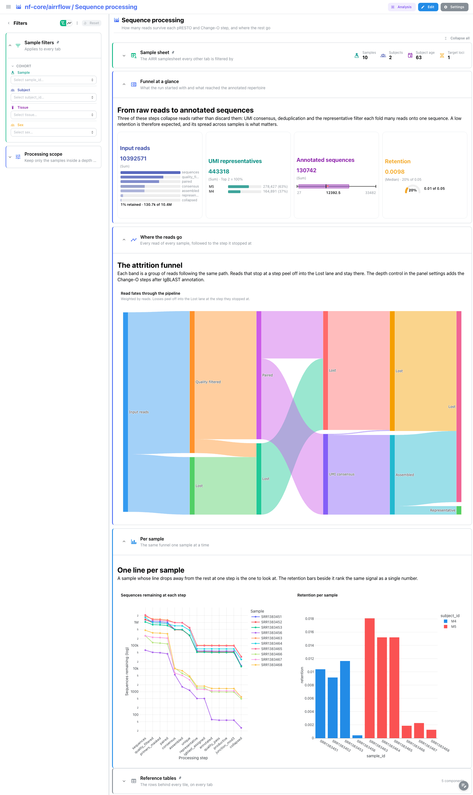
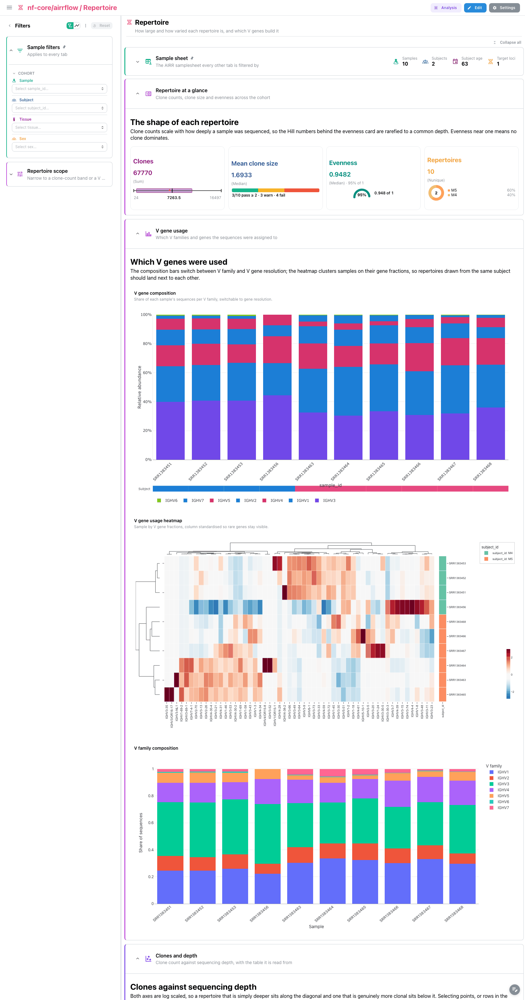
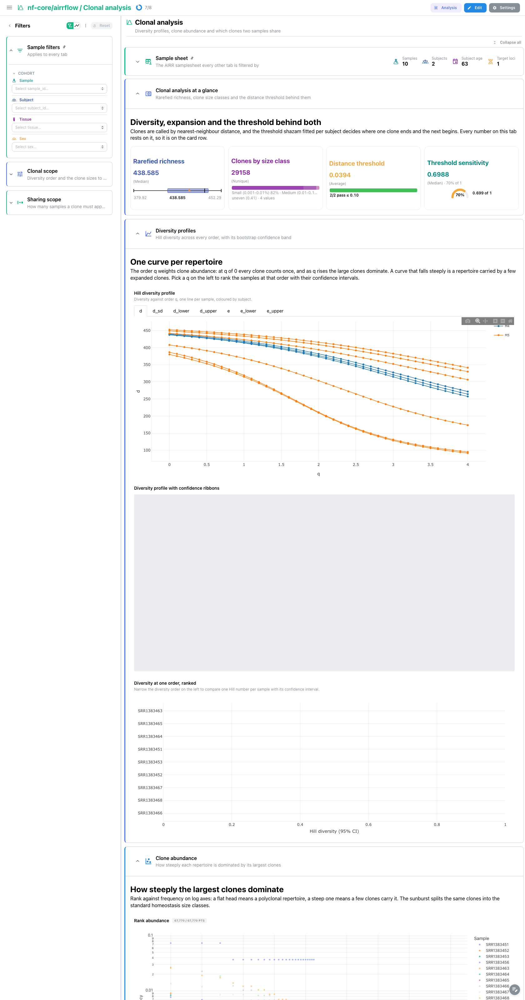

<div class="template-banner">
  <a class="template-banner-logo" href="https://nf-co.re/airrflow" target="_blank" title="nf-core/airrflow on nf-co.re">
    
    
  </a>
  <div class="template-banner-body">
    <h1 class="template-title">AIRR Repertoire Analysis</h1>
    <p class="template-subtitle">B and T cell receptor repertoire analysis: the pRESTO and Change-O sequence funnel, V gene usage, and the Immcantation enchantR clonal report next to the pipeline's own MultiQC.</p>
    <p class="template-links">
      <a href="https://nf-co.re/airrflow" target="_blank"><i class="mdi mdi-open-in-new"></i> nf-co.re</a>
      <a href="https://github.com/nf-core/airrflow" target="_blank"><i class="mdi mdi-github"></i> GitHub</a>
    </p>
  </div>
  <span class="template-status-experimental template-banner-badge" data-tooltip="Experimental — shared as-is. Feedback and PRs welcome."><i class="mdi mdi-flask-outline"></i> Experimental</span>
</div>

The airrflow template covers the reporting half of a standard nf-core/airrflow run, from the raw reads through to the clones:

- :material-chart-box-outline: **Read quality**: fastp trimming and both FastQC runs, read from the pipeline's own MultiQC parquet
- :material-chart-areaspline: **Sequence funnel**: every read followed to the step it stopped at, across pRESTO and Change-O
- :material-dna: **Repertoire composition**: clone counts, clone size, evenness, and V gene usage at family and gene resolution
- :material-chart-bell-curve: **Clonal analysis**: Hill diversity profiles with bootstrap bands, rank abundance and clonal homeostasis
- :material-set-all: **Sharing between samples**: the pairwise shared-clone matrix and the higher-order intersections behind it
- :material-table: **Reference tables**: the AIRR samplesheet and the rows behind every tile, pinned to every tab

!!! info "No external metadata file"
    Everything the template reads comes from the run itself: the validated
    samplesheet the pipeline writes to `pipeline_info/samplesheet.valid.tsv` is
    the hub data collection, so there is nothing to prepare and no grouping column
    to name. 5.1.1 has no AWS megatest run, so 5.1.0 is the newest release the
    template could be validated against; it binds against both.

---

## Quick start

=== "Point at a finished run"

    ```bash
    depictio run \
      --template nf-core/airrflow/latest \
      --data-root /path/to/airrflow_results
    ```

    `--data-root` is the only thing you have to pass. The samplesheet is picked
    up from `{DATA_ROOT}/pipeline_info/samplesheet.valid.tsv`; pass
    `--var SAMPLESHEET_FILE=...` to point somewhere else.

=== "From the pipeline itself (v1.10.0+)"

    ```bash
    depictio-cli config nextflow --install     # once per machine
    nextflow run nf-core/airrflow -profile docker --outdir results
    ```

    No `depictio run`, and no template named: the pipeline ingests its own
    output directory when it finishes and resolves this template from its own
    manifest. See [Nextflow trigger](../../depictio-cli/nextflow-trigger.md).

---

## :material-book-open-variant: Reference

The template reads the MultiQC parquet, the two sequence-count logs, the V usage
tables from the repertoire comparison report, and the enchantR clonal analysis
tables (diversity, clone sizes, pairwise overlap, distance threshold). Most tiles
are catalog renders bound to `enchantr`, airrflow's own R package rather than an
nf-core module, so the tile chrome names where each panel comes from.

The route flags in the *Conditional routes* table are not read back from
`params.json` yet, so a run started with `--skip_clonal_analysis`,
`--skip_report`, `--skip_report_threshold`, `--skip_multiqc` or
`--mode assembled` needs the matching `--var SKIP_...=true`. Omitting one still
ingests: the affected collections are optional and simply come up empty.

!!! info "Self-adapting layout"
    The dashboard adapts to whatever the run actually produced: components bound
    to pruned or unparsed data collections are hidden, tabs left with no real
    visualizations are dropped entirely, and the remaining components are
    re-packed so there are no empty rows.

=== ":material-tag-check-outline: 5.1.0 (latest)"

    --8<-- "pipeline-templates/nf-core/_generated/airrflow-latest.md"

---

## :material-view-dashboard-outline: Dashboard tabs

Four tabs, read as a funnel: are the reads good, how many survive, what
repertoire do the survivors make, and how is that repertoire structured. Each tab
below carries the **same icon and colour the dashboard gives it**, so the page and
the app read alike. `Sample filters` is persistent and pinned to the top of every
tab, and one pick there reaches every other collection through the template's
[cross-DC links](#cross-dc-links). `Sample sheet` is pinned to the top of every
tab and `Reference tables` to the bottom.

=== ":material-chart-box-outline:{ .mc-orange } Quality control"

    *fastp and FastQC, straight from the pipeline's MultiQC report.*

    [](../../images/pipeline-templates/nf-core/airrflow/quality_control_light.png){target="_blank" rel="noopener"}

    Eleven MultiQC panels in three sections: read yield before and after
    trimming, per-base and per-read quality, then GC, length, duplication and
    adapter content. airrflow runs FastQC twice, on the raw reads and again after
    assembly, so MultiQC labels the second run `fastqc-1` and its series carry an
    `_ASSEMBLED` suffix. Amplicon libraries are expected to look duplicated and to
    sit in a narrow GC and length band, so most FastQC warnings here are normal.

    ??? abstract ":material-tune-variant: Filters and components"

        **Filters** · `Sample`, `Subject`, `Tissue` and `Sex` on `samplesheet`,
        persistent and pinned to the top of every tab, plus a `Report sample`
        selector on `multiqc_data` in a collapsed *Read QC scope* group, needed
        because the MultiQC sample ids carry the `_ASSEMBLED` suffix.

        | Section | What it holds |
        |---|---|
        | Read QC at a glance | 3 MultiQC panels |
        | Base quality | 3 MultiQC panels |
        | Read content | 5 MultiQC panels |
        | Sample sheet | 4 cards + *AIRR samplesheet* |
        | Reference tables | 4 tables, pinned to every tab |

=== ":material-chart-areaspline:{ .mc-indigo } Sequence processing"

    *How many reads survive each pRESTO and Change-O step, and where the rest go.*

    [](../../images/pipeline-templates/nf-core/airrflow/sequence_processing_light.png){target="_blank" rel="noopener"}

    The signature panel is a Sankey following every read of every sample to the
    step it stopped at. Three of those steps collapse reads rather than discard
    them, since UMI consensus, deduplication and the representative filter each
    fold many reads onto one sequence, so a retention around one percent is
    expected and it is the spread across samples that matters. Below it the funnel
    is redrawn one line per sample on a log axis: a line that drops away from the
    rest at one step is the sample to look at.

    ??? abstract ":material-tune-variant: Filters and components"

        **Filters** · `Input reads` and `Retention` ranges on `sequence_counts`
        in a collapsed *Processing scope* group, over the persistent sample
        filters.

        | Section | What it holds |
        |---|---|
        | Funnel at a glance | 4 cards |
        | Where the reads go | *Read fates through the pipeline* |
        | Per sample | *Sequences remaining at each step*, *Retention per sample* |

=== ":material-dna:{ .mc-pink } Repertoire"

    *How large and how varied each repertoire is, and which V genes build it.*

    [](../../images/pipeline-templates/nf-core/airrflow/repertoire_light.png){target="_blank" rel="noopener"}

    Clone counts scale with sequencing depth, so the Hill numbers behind the
    evenness card are rarefied to a common depth by alakazam. V usage is a stacked
    composition switchable between family and gene resolution, beside a clustered
    sample by V gene heatmap, column standardised so rare genes stay visible. The
    clones-against-depth scatter closes the tab: a repertoire that is simply
    deeper sits along the diagonal, a genuinely more clonal one below it.

    ??? abstract ":material-tune-variant: Filters and components"

        **Filters** · a `Clones` range on `repertoire_summary`, plus a
        `Resolution` switch and `V family` on `v_gene_usage`, all in a collapsed
        *Repertoire scope* group.

        | Section | What it holds |
        |---|---|
        | Repertoire at a glance | 4 cards |
        | V gene usage | *V gene composition*, *V gene usage heatmap*, *V family composition* |
        | Clones and depth | *Clones versus depth*, *Repertoire summary* |

=== ":material-chart-bell-curve:{ .mc-teal } Clonal analysis"

    *Diversity profiles, clone abundance and which clones two samples share.*

    [](../../images/pipeline-templates/nf-core/airrflow/clonal_analysis_light.png){target="_blank" rel="noopener"}

    The shazam distance threshold sits on the card row, because clones are called
    by nearest-neighbour distance and every number on the tab rests on the
    threshold fitted per subject. The Hill profile draws one curve per repertoire
    against the order q: at q of 0 every clone counts once, and as q rises the
    large clones dominate, so a steeply falling curve is a repertoire carried by
    a few expanded clones. Clone abundance pairs a rank-abundance scatter with a
    homeostasis sunburst, and the last section pairs the shared-clone heatmap
    with an UpSet of the intersections a pairwise view cannot show.

    ??? abstract ":material-tune-variant: Filters and components"

        **Filters** · `Diversity order q` on `clonal_diversity`, `Size class` and
        `Clone rank` on `clone_sizes` in a collapsed *Clonal scope* group, plus
        `Samples per clone` on `clone_sets` in a collapsed *Sharing scope* group.

        | Section | What it holds |
        |---|---|
        | Clonal analysis at a glance | 4 cards |
        | Diversity profiles | *Hill diversity profile*, *Diversity profile with confidence ribbons*, *Diversity at one order, ranked* |
        | Clone abundance | *Rank abundance*, *Clonal homeostasis* |
        | Sharing between samples | *Shared clones per sample pair*, *Clone set intersections* |

!!! tip "Three things that look wrong and are not"
    The overlap heatmap's diagonal is written as 0, since a sample's overlap with
    itself dwarfs any real sharing and flattens the colour scale; cross-subject
    cells read zero too, because airrflow defines clones within a subject. A
    sample too shallow for enchantR to fit diversity numbers is dropped from
    `clonal_diversity.tsv`, so its diversity cards are null while its clone counts
    stand. And rank abundance plots the point estimate only: alakazam's
    bootstrapped curve is 17 MB and is left out of the test subset.

---

## Running the pipeline

Depictio reads the **output** of nf-core/airrflow, it does not run the pipeline.
Run the pipeline first:

```bash
nextflow run nf-core/airrflow \
  --input samplesheet.tsv \
  --mode fastq \
  --library_generation_method specific_pcr_umi \
  --cprimers CPrimers.fasta \
  --vprimers VPrimers.fasta \
  --umi_length 12 \
  -profile docker
```

Then point Depictio at the results:

```bash
depictio run --template nf-core/airrflow/latest \
  --data-root results/
```

See [nf-co.re/airrflow/usage](https://nf-co.re/airrflow/5.1.0/docs/usage)
for full pipeline documentation.

---

## Required data structure

Point `--data-root` at the directory holding the pipeline output. Depictio scans
recursively and matches on file name, so the layout below only has to be present
somewhere under the root. Nothing outside the run is needed.

```text
<DATA_ROOT>/
├── pipeline_info/
│   ├── samplesheet.valid.tsv                       # hub DC, --var SAMPLESHEET_FILE
│   ├── params.json
│   └── software_versions.yml
├── multiqc/
│   └── multiqc_data/
│       └── multiqc.parquet                         # fastp + both FastQC runs
├── parsed_logs/
│   └── Table_sequences_process.tsv                 # pRESTO half of the funnel
├── repertoire_comparison/
│   ├── Sequence_numbers_summary/
│   │   └── Table_sequences_assembled.tsv           # Change-O half of the funnel
│   └── V_family/
│       ├── V_family_distribution_data.tsv
│       └── V_gene_distribution_by_sequence_data.tsv
└── clonal_analysis/
    ├── find_threshold/all_reps_dist_report/tables/
    │   └── all_reps_threshold-summary.tsv          # shazam threshold per subject
    └── repertoire_analysis/repertoire_analysis_report/tables/
        ├── clonal_diversity.tsv
        ├── clonal_overlap.tsv
        ├── clone_sizes_table.tsv
        └── num_clones_table.tsv
```

---

## Test data

The repository ships
[`download_test_data.sh`](https://github.com/depictio/depictio/blob/main/depictio/projects/nf-core/airrflow/5.1.0/download_test_data.sh),
which fetches the subset of nf-core's AWS megatest run that the template needs:

```bash
bash depictio/projects/nf-core/airrflow/5.1.0/download_test_data.sh \
  /tmp/airrflow_test
```

The run is
`s3://nf-core-awsmegatests/airrflow/results-e69d49e3f23f11a3391755b5fb7aa4283c0a2471/`
(the 5.1.0 release tag): a ten-sample, two-subject multiple sclerosis B cell
study of cervical lymph node and brain lesion tissue, run in the default
`--mode fastq` UMI route. The manifest fetches thirteen keys, about 3 MB;
`post_fetch_help` in `megatest.yaml` prints the dry-run and full-run commands
once the download finishes.

Then run Depictio against it:

```bash
depictio run \
  --template nf-core/airrflow/latest \
  --data-root /tmp/airrflow_test
```

---

## Additional resources

- [nf-co.re/airrflow](https://nf-co.re/airrflow): official pipeline documentation
- [nf-co.re/airrflow/5.1.0/results](https://nf-co.re/airrflow/5.1.0/results): AWS test results
- [Immcantation](https://immcantation.readthedocs.io): enchantR, alakazam and shazam, the toolset behind the repertoire panels
- [Template System Reference](../../usage/projects/templates.md): YAML format, variables, conditionals
- [Recipes](../../usage/projects/recipes.md): how to read, test, and write recipes
