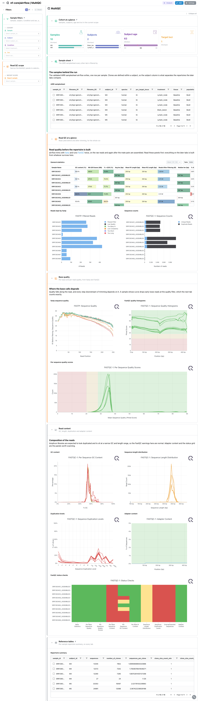
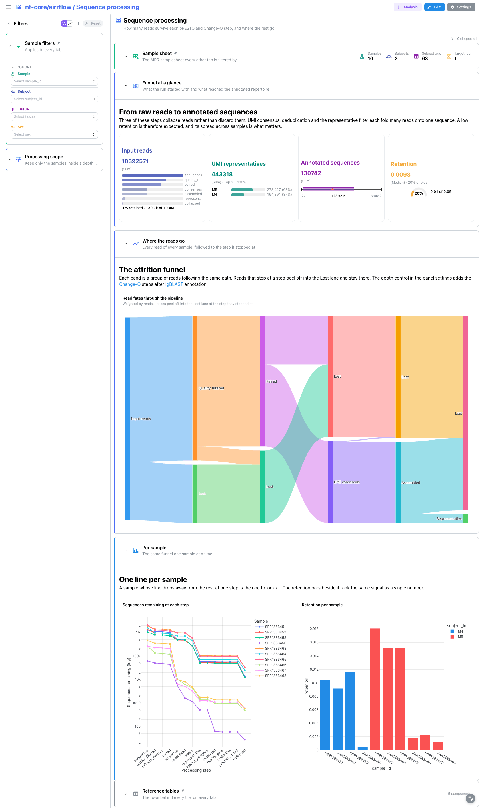
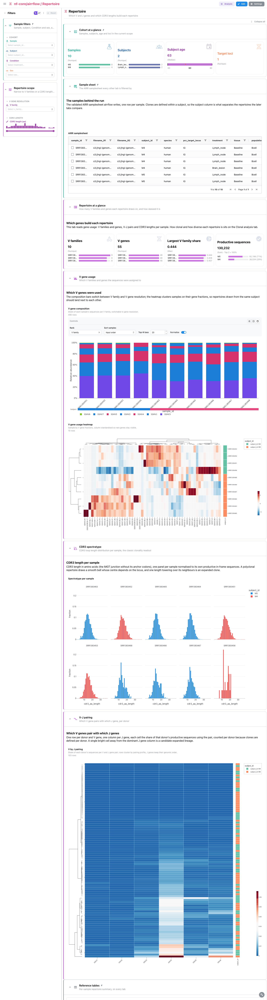
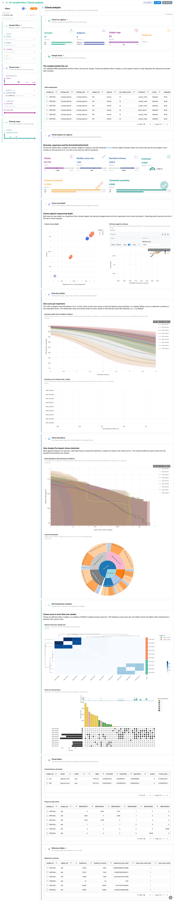

<div class="template-banner">
  <a class="template-banner-logo" href="https://nf-co.re/airrflow" target="_blank" title="nf-core/airrflow on nf-co.re">
    
    
  </a>
  <div class="template-banner-body">
    <h1 class="template-title">AIRR Repertoire Analysis</h1>
    <p class="template-subtitle">B and T cell receptor repertoire analysis: the pRESTO and Change-O sequence funnel, V gene usage, and the Immcantation enchantR clonal report next to the pipeline's own MultiQC.</p>
    <p class="template-links">
      <a href="https://nf-co.re/airrflow" target="_blank"><i class="mdi mdi-open-in-new"></i> nf-co.re</a>
      <a href="https://github.com/nf-core/airrflow" target="_blank"><i class="mdi mdi-github"></i> GitHub</a>
    </p>
  </div>
  <span class="template-status-experimental template-banner-badge" data-tooltip="Experimental: shared as-is. Feedback and PRs welcome."><i class="mdi mdi-flask-outline"></i> Experimental</span>
</div>

<div class="tpl-version-pick" data-latest="5.1.1">
  <span class="tpl-version-icon"><i class="mdi mdi-source-branch"></i></span>
  <span class="tpl-version-label">Template version</span>
  <select id="tpl-version" class="tpl-version-select" aria-label="Template version">
    <option value="5.1.1" selected>5.1.1</option>
    <option value="5.1.0">5.1.0</option>
  </select>
  <span class="tpl-version-badge">latest</span>
</div>

The airrflow template covers the reporting half of a standard nf-core/airrflow run, from the raw reads through to the clones:

- :material-compass-outline: **Overview**: the run in four key figures, live findings and four figures, each linked to the tab that explains it
- :material-chart-box-outline: **Data & QC**: fastp trimming and both FastQC runs from the pipeline's MultiQC report, and every read followed through pRESTO and Change-O
- :material-dna: **Repertoire**: V gene usage at family and gene resolution, CDR3 lengths and V by J pairing
- :material-chart-bell-curve: **Clonality**: Hill diversity profiles, clonal expansion and homeostasis, and the clones samples of one subject share

!!! info "No external metadata file"
    Everything the template reads comes from the run itself: the validated
    samplesheet the pipeline writes to `pipeline_info/samplesheet.valid.tsv` is
    the hub data collection, so there is nothing to prepare. The one column to
    name is the condition, `GROUP_COL`, which defaults to `treatment`, the
    column airrflow's samplesheet schema documents for it; a sample sheet that
    names it differently passes `--var GROUP_COL=<column>`. 5.1.1 keeps the 5.1.0
    output layout and has no AWS megatest run: the 5.1.1 template was validated
    on an EMBL HPC run of the release, and the 5.1.0 megatest still serves to
    try it.

---

## :material-rocket-launch-outline: Quick start

=== "Point at a finished run"

    ```bash
    depictio ingest /path/to/airrflow_results \
      --template nf-core/airrflow/latest
    ```

    The results directory is the only thing you have to pass. The samplesheet is picked
    up from `{DATA_ROOT}/pipeline_info/samplesheet.valid.tsv`; pass
    `--var SAMPLESHEET_FILE=...` to point somewhere else.

    The condition filter reads the samplesheet column named by `GROUP_COL`
    (default `treatment`, labelled `Condition`). A samplesheet that keeps the
    condition in another free column names it, and can relabel it:

    ```bash
    depictio ingest /path/to/airrflow_results \
      --template nf-core/airrflow/latest \
      --var GROUP_COL=intervention \
      --var GROUP_COL_DISPLAY=Intervention
    ```

    | Variable | Default | Meaning |
    |---|---|---|
    | `DATA_ROOT` | required | Root of the airrflow output directory |
    | `SAMPLESHEET_FILE` | `{DATA_ROOT}/pipeline_info/samplesheet.valid.tsv` | The validated samplesheet, the hub data collection |
    | `GROUP_COL` | `treatment` | Samplesheet column holding the condition; must exist in the samplesheet |
    | `GROUP_COL_DISPLAY` | `Condition` | Reader-facing label of that column in filter titles |
    | `SKIP_CLONAL_ANALYSIS`, `SKIP_REPORT`, `SKIP_THRESHOLD_REPORT`, `SKIP_MULTIQC`, `ASSEMBLED_MODE` | unset | Mirror the run's route flags; see *Conditional routes* below |

=== "From the pipeline itself (v1.10.0+)"

    ```bash
    depictio config nextflow --install     # once per machine
    nextflow run nf-core/airrflow -r 5.1.0 -profile docker --outdir results
    ```

    No `depictio ingest`, and no template named: the pipeline ingests its own
    output directory when it finishes and resolves this template from its own
    manifest. See [Nextflow trigger](../../depictio-cli/nextflow-trigger.md).

---

## :material-book-open-variant: Reference

The template reads the MultiQC parquet, the two sequence-count logs, the V usage
tables from the repertoire comparison report, and the enchantR clonal analysis
tables (diversity, clone sizes, pairwise overlap, distance threshold). Most tiles
are catalog renders bound to `enchantr`, airrflow's own R package rather than an
nf-core module, so the tile chrome names where each panel comes from.

The route flags in the *Conditional routes* table are not read back from
`params.json` yet, so a run started with `--skip_clonal_analysis`,
`--skip_report`, `--skip_report_threshold`, `--skip_multiqc` or
`--mode assembled` needs the matching `--var SKIP_...=true` (or
`--var ASSEMBLED_MODE=true`). Omitting one still
ingests: the affected collections are optional and simply come up empty.

!!! info "Self-adapting layout"
    The dashboard adapts to whatever the run actually produced: components bound
    to pruned or unparsed data collections are hidden, tabs left with no real
    visualizations are dropped entirely, and the remaining components are
    re-packed so there are no empty rows.

<div class="tpl-version-block" data-version="5.1.1" markdown>

--8<-- "pipeline-templates/nf-core/_generated/airrflow-latest.md"

</div>

<div class="tpl-version-block" data-version="5.1.0" markdown>

--8<-- "pipeline-templates/nf-core/_generated/airrflow-5.1.0.md"

</div>

---

## :material-view-dashboard-outline: Dashboard tabs

One dashboard: the **Overview**, then seven child tabs in three groups, read as a
funnel from the reads to the clones that expand and are shared. Each tab below
carries the **same icon and colour the dashboard gives it**, so the page and the
app read alike.

| Group | Tabs |
|---|---|
| Data & QC | MultiQC, Sequence Processing |
| Repertoire | V Gene Usage, CDR3 & Pairing |
| Clonality | Clonal Diversity, Clonal Expansion, Clone Sharing |

Each child tab opens with a short intro and a strip of key numbers, then at most
three open sections; tables and details follow, collapsed. The persistent *Sample
filters* (the condition column, sample id, subject and sex) sit in the left panel
and narrow every tab through the sample sheet's
[cross-DC links](#cross-dc-links). The *Sample sheet* is pinned, collapsed, to the
bottom of every child tab. Clones are defined within a subject, so the subject
colours the per-sample lines and annotates the heatmaps.

=== ":material-compass-outline: Overview"

    *Immune receptor repertoires, from reads to the clones that expand and are shared.*

    <!-- screenshot pending v2 -->

    A short hero links the run parameters. *About this dashboard* says how to move
    through the tabs, *The run* lists the samples and subjects, the library
    preparation, the clonal threshold setting and the input mode, and *Pipeline*
    walks six steps from trimming to the comparison of repertoires, each linked to
    its parameters and its tab. The Key figures are **Samples** (split by
    condition), **Input reads** and **Clones** (each summed, with the spread per
    sample) and **Sequences per clone** (each sample's mean clone size, the median
    over samples).

    ??? abstract ":material-tune-variant: Filters and components"

        **Filters** · the left panel starts collapsed. *Key figures* has its own
        filter bar (the condition and the sample id), and so does *Findings* (the
        condition and the subject): each narrows its own section only.

        | Section | What it holds |
        |---|---|
        | Top | Hero, *About this dashboard*, *The run*, *Pipeline* |
        | Key figures | 4 headline cards: samples, input reads, clones, sequences per clone |
        | Findings | Live result rows, then 4 figures: V family composition per sample, the Hill diversity profile, clones by number of samples holding them and the clonal homeostasis sunburst |
        | How to read this dashboard | The tabs by group, each with its question |

        Every route keeps four Key figures: a card whose collection a route
        lacks gives its slot to an alternate. A `--mode assembled` run
        (`ASSEMBLED_MODE`) counts the input sequences instead of the input reads,
        and a `--skip_report` run (`SKIP_REPORT`) the sequences that entered
        clonal assignment. A `--skip_clonal_analysis` run
        (`SKIP_CLONAL_ANALYSIS`) shows unique sequences and V genes instead of
        clones and sequences per clone.

=== "{ width=18 }{ width=18 } MultiQC"

    **Data & QC** · *Did trimming and read quality hold for every sample?*

    [{ loading=lazy }](../../images/pipeline-templates/nf-core/airrflow/multiqc_light.png){ .tpl-shot target="_blank" rel="noopener" }

    MultiQC panels only: general statistics, fastp filtered reads and the FastQC
    sequence counts, then fastp's per-base quality beside the FastQC quality
    histograms. airrflow runs FastQC twice, on the raw reads and after assembly,
    and MultiQC labels the second run `fastqc-1`. Amplicons of one receptor locus
    show high duplication and a narrow GC band by design.

    ??? abstract ":material-tune-variant: Filters and components"

        **Filters** · `Sample ID`, read from the MultiQC report.

        | Section | What it holds |
        |---|---|
        | QC overview | 3 MultiQC panels |
        | Base quality | 2 MultiQC panels |
        | QC details (collapsed) | 6 MultiQC panels |

=== ":material-chart-sankey:{ .mc-indigo } Sequence Processing"

    **Data & QC** · *How many reads survive each pRESTO and Change-O step?*

    <!-- screenshot pending v2 -->

    [{ loading=lazy }](../../images/pipeline-templates/nf-core/airrflow/sequence_processing_light.png){ .tpl-shot target="_blank" rel="noopener" }

    **Input reads**, with the share kept through each pRESTO step, and the reads
    per sample with their spread. Then the read-fate Sankey, where losses peel off
    into a Lost lane, and per sample the sequences left at each step (log scale)
    beside the sequences each sample keeps per 1,000 input reads. UMI consensus and
    duplicate collapsing merge many reads into one sequence, so that ratio is not a
    share of reads kept.

    ??? abstract ":material-tune-variant: Filters and components"

        **Filters** · `Input reads` and `Sequences per input read` ranges on
        `sequence_counts`, plus the sample filters.

        | Section | What it holds |
        |---|---|
        | Processing at a glance | 2 cards |
        | Where the reads go | *Read fates through the pipeline* |
        | Per sample | *Sequences left at each step*, *Sequences kept per 1,000 reads* |
        | Counts table (collapsed) | *Sequence processing counts* |

=== ":material-dna:{ .mc-pink } V Gene Usage"

    **Repertoire** · *Which V families and genes build each repertoire?*

    <!-- screenshot pending v2 -->

    [{ loading=lazy }](../../images/pipeline-templates/nf-core/airrflow/repertoire_light.png){ .tpl-shot target="_blank" rel="noopener" }

    Distinct **V genes**, the annotated **Sequences** split by V family, the
    largest share one family takes in a sample and the median share of a V gene.
    Then the stacked composition per sample, by V family with gene resolution a
    switch away, and the sample by V gene heatmap, clustered and standardised per
    gene, so samples of one subject should sit together.

    ??? abstract ":material-tune-variant: Filters and components"

        **Filters** · `V family` and `Locus` on `v_gene_usage`, plus the sample
        filters.

        | Section | What it holds |
        |---|---|
        | V genes at a glance | 4 cards |
        | Composition | 1 advanced visualization |
        | Clustered usage | 1 advanced visualization |

=== ":material-ruler:{ .mc-grape } CDR3 & Pairing"

    **Repertoire** · *How long are CDR3 loops, and which V and J genes pair?*

    <!-- screenshot pending v2 -->

    **Productive sequences** and the largest share one CDR3 length takes in a
    sample. Then the spectratype, one line per sample: a smooth bell is a diverse
    repertoire, and one length towering over the rest points to an expanded clone.
    The V by J heatmap pairs each subject's V genes with the J genes they joined.
    Both views read the AIRR rearrangement table of the productive sequences.

    ??? abstract ":material-tune-variant: Filters and components"

        **Filters** · a `CDR3 length (aa)` range and `Locus` on
        `cdr3_spectratype`, plus the sample filters.

        | Section | What it holds |
        |---|---|
        | CDR3 at a glance | 2 cards |
        | Spectratype | *CDR3 spectratype* |
        | V-J pairing | 1 advanced visualization |
        | Spectratype per sample (collapsed) | *Spectratype per sample* |

    !!! tip "Spectratype and V-J pairing need the AIRR table"
        Both read the `*__repertoire-pass.tsv` rearrangement table enchantR's
        repertoire analysis starts from, keeping only the handful of columns they
        need. The two collections are optional: a run with
        `--skip_clonal_analysis`, or a copy of the output without that table,
        drops the CDR3 & Pairing tab and keeps the rest of the dashboard.

=== ":material-chart-bell-curve:{ .mc-teal } Clonal Diversity"

    **Clonality** · *How many clones does each repertoire hold, and how diverse is it?*

    <!-- screenshot pending v2 -->

    [{ loading=lazy }](../../images/pipeline-templates/nf-core/airrflow/clonal_analysis_light.png){ .tpl-shot target="_blank" rel="noopener" }

    **Clones** and the median effective number of clones (Hill diversity at q = 1,
    on repertoires rarefied to a common depth). Then the Hill diversity profile,
    one curve per sample against the order q: the higher q, the more the largest
    clones weigh, so a steeply falling curve is a repertoire carried by a few
    expanded clones. The ranked diversity at one order, richness against evenness,
    and clones against sequencing depth follow; the SHazaM distance threshold that
    defined the clones sits in a collapsed section.

    ??? abstract ":material-tune-variant: Filters and components"

        **Filters** · a `Clones` range on `repertoire_summary`, and the
        `Diversity order` on `diversity_orders`, which narrows the ranked bars
        only.

        | Section | What it holds |
        |---|---|
        | Diversity at a glance | 2 cards |
        | Diversity profile | 1 advanced visualization |
        | Samples compared | 2 advanced visualizations |
        | Clones and depth | *Clones against depth* |
        | Clone definition (collapsed) | 2 cards + *Clonal distance threshold* |
        | Per-sample table (collapsed) | *Repertoire summary* |

=== ":material-trending-up:{ .mc-blue } Clonal Expansion"

    **Clonality** · *How strongly do the largest clones dominate each repertoire?*

    <!-- screenshot pending v2 -->

    **Clones** as a ring by size class, **Sequences** split by size class, the
    median share of a sample's largest clone, and the size of the largest clone
    with every clone's size as a histogram. Then the rank-abundance curves with
    their bootstrap bands, where a flat head is a polyclonal repertoire, and the
    clonal homeostasis sunburst by subject, sample and size class.

    ??? abstract ":material-tune-variant: Filters and components"

        **Filters** · `Size class` on `clone_sizes`, plus the sample filters.

        | Section | What it holds |
        |---|---|
        | Expansion at a glance | 4 cards |
        | Rank abundance | 1 advanced visualization |
        | Clonal homeostasis | 1 advanced visualization |

=== ":material-set-merge:{ .mc-cyan } Clone Sharing"

    **Clonality** · *Which clones do the samples of one subject share?*

    <!-- screenshot pending v2 -->

    **Clones** split by the number of samples holding them, and the sequences in
    shared clones. Then the clones by number of samples (log scale), the
    shared-clone heatmap for every pair of samples and the UpSet of exact sample
    sets. Only samples of the same subject can share a clone.

    ??? abstract ":material-tune-variant: Filters and components"

        **Filters** · a `Samples per clone` range on `clone_sets`, plus the sample
        filters.

        | Section | What it holds |
        |---|---|
        | Sharing at a glance | 2 cards |
        | Clones by sharing | *Clones by samples holding them* |
        | Pairs and sets | 2 advanced visualizations |
        | Overlap table (collapsed) | *Clonal overlap matrix* |

!!! tip "Two things that look wrong and are not"
    The shared-clone heatmap's diagonal is written as 0, since a sample's overlap
    with itself dwarfs any real sharing and flattens the colour scale;
    cross-subject cells read zero too, because airrflow defines clones within a
    subject. A sample too shallow for enchantR to fit diversity numbers is dropped
    from `clonal_diversity.tsv`, so its diversity values are missing while its
    clone counts stand.

Tables and scatters select on their entity column: the sample sheet, the
repertoire summary, the sequence counts and clonal overlap tables, the
clones-against-depth figure, the richness-against-evenness scatter and the
rank-abundance curve on `sample_id`, and the clonal threshold table on
`subject_id`. A pick becomes a dashboard filter that the project links carry to
every collection they reach.

---

## :material-play-circle-outline: Running the pipeline

Depictio reads the **output** of nf-core/airrflow, it does not run the pipeline.
Run the pipeline first:

```bash
nextflow run nf-core/airrflow -r 5.1.1 \
  --input samplesheet.tsv \
  --mode fastq \
  --library_generation_method specific_pcr_umi \
  --cprimers CPrimers.fasta \
  --vprimers VPrimers.fasta \
  --umi_length 12 \
  --outdir results -profile docker
```

Then point Depictio at the results:

```bash
depictio ingest results/ \
  --template nf-core/airrflow/latest
```

See [nf-co.re/airrflow/usage](https://nf-co.re/airrflow/5.1.1/docs/usage)
for full pipeline documentation.

---

## :material-folder-open-outline: Required data structure

Point `depictio ingest` at the directory holding the pipeline output. Depictio scans
recursively and matches on file name, so the layout below only has to be present
somewhere under the root. Nothing outside the run is needed.

```text
<DATA_ROOT>/
├── pipeline_info/
│   ├── samplesheet.valid.tsv                       # hub DC, --var SAMPLESHEET_FILE
│   ├── params.json
│   └── software_versions.yml
├── multiqc/
│   └── multiqc_data/
│       └── multiqc.parquet                         # fastp + both FastQC runs
├── parsed_logs/
│   └── Table_sequences_process.tsv                 # pRESTO half of the funnel
├── repertoire_comparison/
│   ├── Sequence_numbers_summary/
│   │   └── Table_sequences_assembled.tsv           # Change-O half of the funnel
│   └── V_family/
│       ├── V_family_distribution_data.tsv
│       └── V_gene_distribution_by_sequence_data.tsv
└── clonal_analysis/
    ├── find_threshold/all_reps_dist_report/tables/
    │   └── all_reps_threshold-summary.tsv          # shazam threshold per subject
    └── repertoire_analysis/repertoire_analysis_report/
        ├── repertoires/
        │   └── *__repertoire-pass.tsv              # AIRR table: spectratype, V-J pairing
        └── tables/
            ├── clonal_abundance.tsv                # rank abundance with bootstrap band
            ├── clonal_diversity.tsv
            ├── clonal_overlap.tsv
            ├── clone_sizes_table.tsv
            └── num_clones_table.tsv
```

---

## :material-flask-outline: Validation runs

5.1.1 has no AWS megatest run: the bucket holds no prefix for the release. The
5.1.1 template was validated on an EMBL HPC run of the release's `test` profile
(`airrflow511`), ingested on a local stack; its MultiQC 1.34 report already
carries the parquet, so no reprocess step is needed. 5.1.1 publishes the 5.1.0
layout, so the megatest shown here is the 5.1.0 run. The repository ships
[`download_test_data.sh`](https://github.com/depictio/depictio/blob/main/depictio/projects/nf-core/airrflow/5.1.0/download_test_data.sh)
next to the 5.1.0 template, which fetches the subset of that run the template
needs:

```bash
bash depictio/projects/nf-core/airrflow/5.1.0/download_test_data.sh \
  /tmp/airrflow_test
```

The run is
`s3://nf-core-awsmegatests/airrflow/results-e69d49e3f23f11a3391755b5fb7aa4283c0a2471/`
(the 5.1.0 release tag): a ten-sample, two-subject multiple sclerosis B cell
study of cervical lymph node and brain lesion tissue, run in the default
`--mode fastq` UMI route. The manifest fetches fifteen keys, about 330 MB,
nearly all of it the AIRR rearrangement table behind the spectratype and the
V-J grid. `post_fetch_help` in `megatest.yaml` prints the dry-run and full-run
commands once the download finishes.

Then run Depictio against it:

```bash
depictio ingest /tmp/airrflow_test \
  --template nf-core/airrflow/latest
```

---

## :material-link-variant: Additional resources

- [nf-co.re/airrflow](https://nf-co.re/airrflow): official pipeline documentation
- [nf-co.re/airrflow/5.1.0/results](https://nf-co.re/airrflow/5.1.0/results): AWS test results of the 5.1.0 release (5.1.1 has none)
- [Immcantation](https://immcantation.readthedocs.io): enchantR, alakazam and shazam, the toolset behind the repertoire panels
- [Template System Reference](../../usage/projects/templates.md): YAML format, variables, conditionals
- [Recipes](../../usage/projects/recipes.md): how to read, test, and write recipes

---

## :material-account-group-outline: Authorship

<div class="tpl-credits">
  <div class="tpl-credit">
    <span class="tpl-credit-role"><i class="mdi mdi-code-braces"></i> Developers</span>
    <span class="tpl-credit-note">Wrote the template, its recipes and its dashboards.</span>
    <a class="tpl-person" href="https://github.com/weber8thomas" target="_blank" rel="noopener">
       weber8thomas
    </a>
  </div>
  <div class="tpl-credit">
    <span class="tpl-credit-role"><i class="mdi mdi-eye-check-outline"></i> Reviewers</span>
    <span class="tpl-credit-note">Nobody has run it on their own data and signed it off yet, which is what keeps it Experimental.</span>
    <span class="tpl-person"><i class="mdi mdi-account-plus-outline"></i> Open</span>
  </div>
  <div class="tpl-credit">
    <span class="tpl-credit-role"><i class="mdi mdi-wrench-outline"></i> Maintainers</span>
    <span class="tpl-credit-note">Keep it working as nf-core/airrflow releases.</span>
    <a class="tpl-person" href="https://github.com/weber8thomas" target="_blank" rel="noopener">
       weber8thomas
    </a>
  </div>
</div>

Reviewing a template on your own data, or taking over a role here, is a
contribution in itself: the [contributing guide](../../developer/contributing-templates.md)
says what each one involves.
