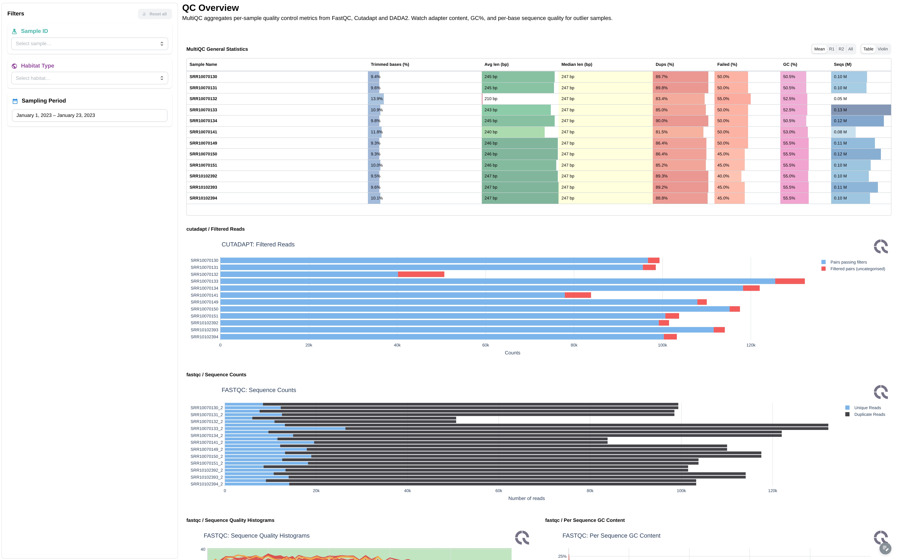
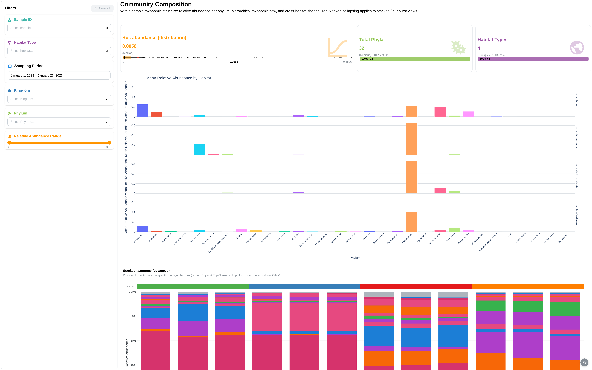
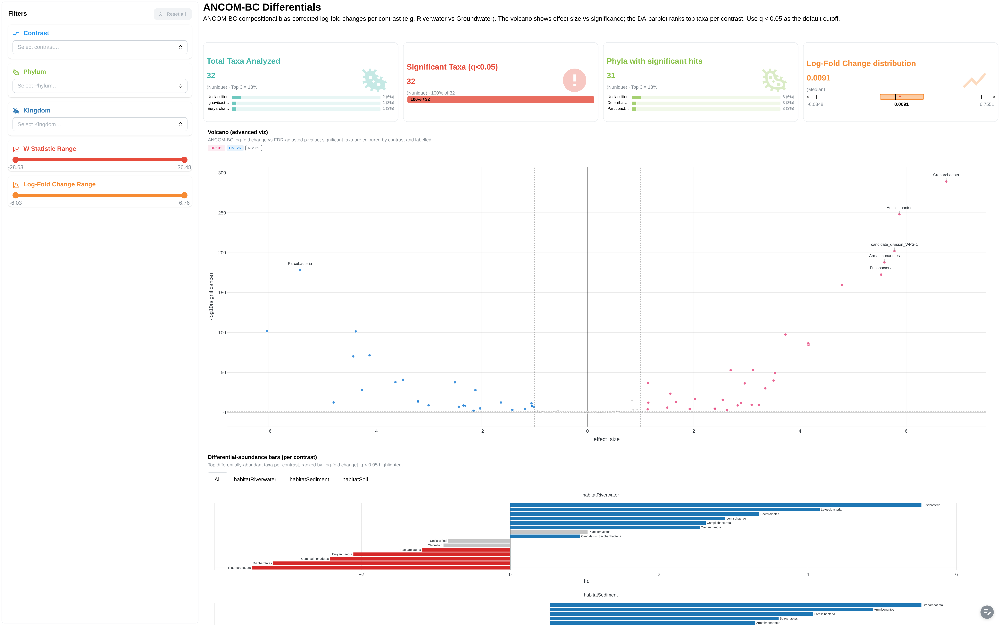

# <span style="color: #45B8AC;">:material-dna:</span> nf-core/ampliseq

<div style="display:flex;align-items:center;gap:16px;margin-bottom:8px;">
  
  <div>
    <strong>16S/ITS amplicon sequencing — microbial community analysis</strong><br>
    <span style="color:#666;font-size:0.9em;">nf-core pipeline · <a href="https://nf-co.re/ampliseq" target="_blank">nf-co.re/ampliseq</a></span>
  </div>
  <span style="margin-left:auto;background:#4CAF50;color:#fff;padding:3px 10px;border-radius:12px;font-size:0.8em;font-weight:600;">🛡️ Certified</span>
</div>

The ampliseq template covers the main outputs of a standard nf-core/ampliseq run:

- :material-chart-bar: **MultiQC quality control** — FastQC read quality, Cutadapt trimming statistics
- :material-bacteria: **Taxonomy composition** — phylum-level barplots, sunburst, heatmap with annotations
- :material-chart-line: **Alpha diversity** — Faith's Phylogenetic Diversity, rarefaction curves (requires metadata)
- :material-chart-scatter-plot: **Differential abundance** — ANCOM-BC volcano plots, log-fold change (requires metadata + `--ancombc`)
- :material-map-marker: **Sampling locations** — geographic scatter map from metadata coordinates (requires metadata)

---

## Quick start

=== "Base (no metadata)"

    ```bash
    depictio run \
      --template nf-core/ampliseq/2.16.0 \
      --data-root /path/to/ampliseq_results \
      --var SAMPLESHEET_FILE=samplesheet.csv
    ```

    MultiQC + taxonomy dashboards. No diversity or differential abundance.

=== "Extended (with metadata)"

    ```bash
    depictio run \
      --template nf-core/ampliseq/2.16.0 \
      --data-root /path/to/ampliseq_results \
      --var SAMPLESHEET_FILE=samplesheet.csv \
      --var METADATA_FILE=Metadata.tsv \
      --var GROUP_COL=habitat
    ```

    Full dashboard: diversity, facetted charts, map, heatmap annotations, ANCOM-BC.

---

## Template variables

| Variable | Required | Auto | Description |
|----------|:--------:|:----:|-------------|
| `DATA_ROOT` | :material-check: | — | Pipeline output root (set via `--data-root`) |
| `SAMPLESHEET_FILE` | :material-check: | — | Path to ampliseq samplesheet CSV |
| `METADATA_FILE` | — | — | Sample metadata TSV. Enables extended mode. |
| `GROUP_COL` | — | :material-check: | Grouping column for facetting. Auto: first annotation column. |
| `GROUP_COL_DISPLAY` | — | :material-check: | Title-cased GROUP_COL for chart labels |
| `ANNOTATION_COLS` | — | :material-check: | All annotation columns from metadata |

---

## Data collections

| Data Collection | Type | Recipe | Base | Extended |
|-----------------|------|--------|:----:|:--------:|
| `multiqc_data` | MultiQC | — | :material-check: | :material-check: |
| `samplesheet` | Table | — | :material-check: | :material-check: |
| `taxonomy_composition` | Table | `taxonomy_composition.py` | :material-check: | :material-check: |
| `taxonomy_rel_abundance` | Table | `taxonomy_rel_abundance.py` | :material-check: | :material-check: |
| `taxonomy_heatmap` | Table | `taxonomy_heatmap.py` | :material-check: | :material-check: |
| `metadata` | Table | — | :material-close: | :material-check: |
| `alpha_diversity` | Table | `alpha_diversity.py` | :material-close: | :material-check: |
| `alpha_rarefaction` | Table | `alpha_rarefaction.py` | :material-close: | :material-check: |
| `ancombc_results` | Table | `ancombc.py` | :material-close: | :material-check: |

!!! info "Base vs Extended"

    === "Base"

        No `METADATA_FILE` provided. The template removes metadata-dependent DCs (alpha diversity, rarefaction, ANCOM-BC) and imports a single dashboard with MultiQC + taxonomy composition.

        **Use when:** Quick QC check, no sample metadata available, or testing the pipeline setup.

    === "Extended"

        `METADATA_FILE` provided. All 9 DCs active. Dashboard includes facetted charts by `GROUP_COL`, sampling location map, heatmap with metadata annotations, and ANCOM-BC differential abundance.

        **Use when:** Full analysis with sample grouping, geographic data, and differential abundance.

---

## Dashboards

=== "MultiQC"

    **nf-core/ampliseq** — Quality control overview powered by MultiQC.

    

=== "Community Analysis"

    **Community Analysis** — Taxonomy composition, diversity metrics, heatmap with annotations, and sampling map.

    

=== "Differential Abundance"

    **Diff. Abundance** — ANCOM-BC volcano plots, top differential taxa, and results table. Only in extended mode.

    

---

## Cross-DC links (7)

| Source | Column | Target | Description |
|--------|--------|--------|-------------|
| `samplesheet` | `sampleID` | `multiqc_data` | Filter MultiQC by samples |
| `metadata` | `ID` | `alpha_diversity` | Filter diversity by metadata |
| `metadata` | `ID` | `alpha_rarefaction` | Filter rarefaction by metadata |
| `metadata` | `ID` | `taxonomy_composition` | Filter taxonomy by metadata |
| `metadata` | `ID` | `taxonomy_rel_abundance` | Filter rel abundance by metadata |
| `samplesheet` | `sampleID` | `taxonomy_heatmap` | Filter heatmap (base) |
| `metadata` | `ID` | `taxonomy_heatmap` | Filter heatmap (extended) |

Metadata links are auto-pruned when `METADATA_FILE` is absent.

---

## Running the pipeline

Depictio reads the **output** of nf-core/ampliseq — it does not run the pipeline. Run the pipeline first:

```bash
nextflow run nf-core/ampliseq \
  --input samplesheet.csv \
  --FW_primer GTGYCAGCMGCCGCGGTAA \
  --RV_primer GGACTACNVGGGTWTCTAAT \
  --metadata Metadata.tsv \
  -profile docker
```

Then point Depictio at the results:

```bash
depictio run --template nf-core/ampliseq/2.16.0 \
  --data-root results/ \
  --var SAMPLESHEET_FILE=samplesheet.csv \
  --var METADATA_FILE=Metadata.tsv
```

See [nf-co.re/ampliseq/usage](https://nf-co.re/ampliseq/2.16.0/docs/usage) for full pipeline documentation.

---

## Required data structure

Point `--data-root` to a single ampliseq **run output directory** (the Nextflow `results/` folder). Not all files are required — the template adapts based on what's present and which `--var` flags you provide.

```text
<DATA_ROOT>/   # e.g., results/ from: nextflow run nf-core/ampliseq ...
├── samplesheet.csv                                # --var SAMPLESHEET_FILE
├── Metadata.tsv                                   # --var METADATA_FILE (optional)
├── multiqc/
│   └── multiqc_data/
│       └── multiqc.parquet
└── qiime2/
    ├── alpha-rarefaction/                          # ⚠ Requires --metadata
    │   └── faith_pd.csv
    ├── ancombc/differentials/                      # ⚠ Requires --metadata + --ancombc
    │   └── Category-<GROUP_COL>-level-2/
    │       ├── lfc_slice.csv
    │       ├── p_val_slice.csv
    │       ├── q_val_slice.csv
    │       ├── se_slice.csv
    │       └── w_slice.csv
    ├── barplot/
    │   └── level-2.csv
    ├── diversity/alpha_diversity/                  # ⚠ Requires --metadata
    │   └── faith_pd_vector/
    │       └── metadata.tsv
    └── rel_abundance_tables/
        └── rel-table-2.tsv
```

---

## Recipes (6)

| Recipe | Input | Key transformation |
|--------|-------|--------------------|
| `alpha_diversity.py` | `faith_pd_vector/metadata.tsv` | Filter comment rows, rename `id` → `sample`, pass through metadata cols |
| `alpha_rarefaction.py` | `faith_pd.csv` | Wide → long unpivot, regex depth/iter extraction |
| `taxonomy_composition.py` | `barplot/level-2.csv` | Detect taxonomy by `;` in column names, melt to long format |
| `taxonomy_rel_abundance.py` | `rel-table-2.tsv` + metadata DC | Wide → long, taxonomy split, generic metadata join |
| `taxonomy_heatmap.py` | rel_abundance DC + metadata DC | Pivot to Phylum × sample matrix, embed metadata annotations with Plotly colors |
| `ancombc.py` | 5 ANCOM-BC CSVs (via source_overrides) | Melt 5 slices, join, compute `-log10(q)` and significance |

---

## Additional resources

- [nf-co.re/ampliseq](https://nf-co.re/ampliseq) — official pipeline documentation
- [nf-co.re/ampliseq/2.16.0/results](https://nf-co.re/ampliseq/2.16.0/results) — AWS test results
- [Templates reference](../../usage/projects/templates.md) — full template YAML spec
- [Recipes](../../usage/projects/recipes.md) — how to read, test, and write recipes
