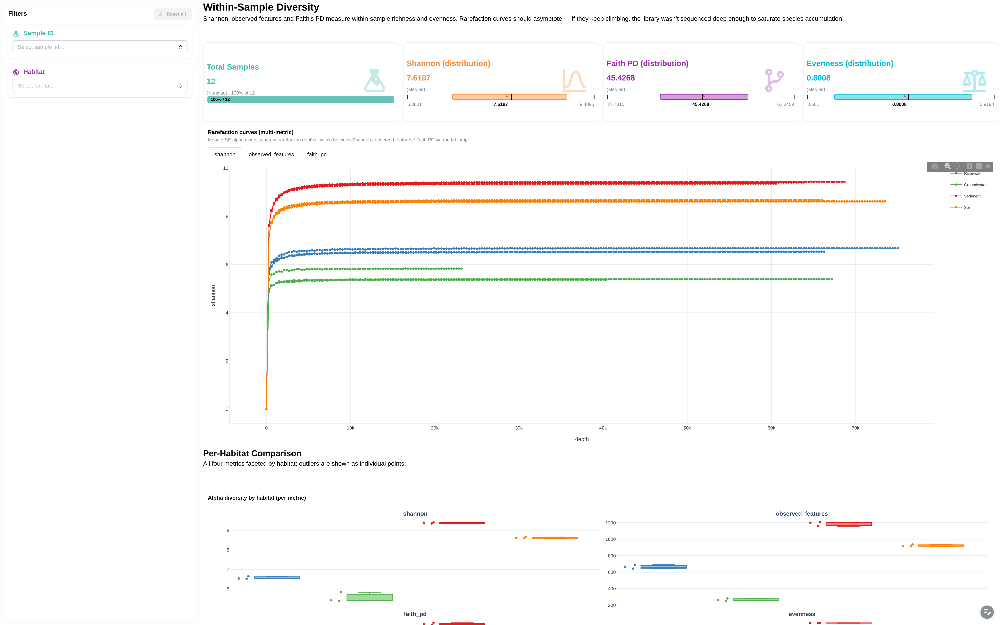
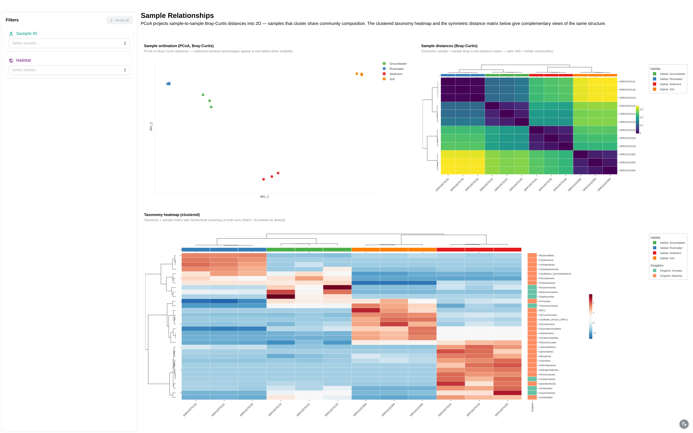
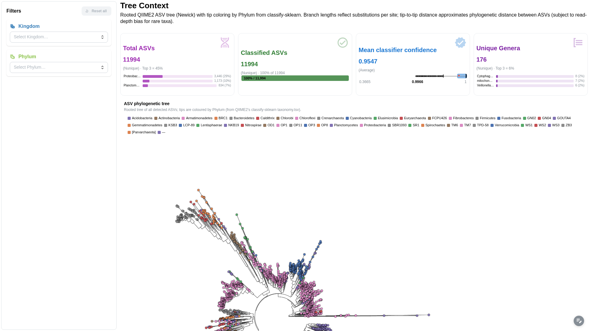

# nf-core/ampliseq

<div style="display:flex;align-items:center;gap:16px;margin-bottom:16px;">
  
  <div style="flex:1;">
    <strong style="font-size:1.1em;">Amplicon sequencing analysis workflow using DADA2 and QIIME2 — 16S, ITS, CO1, 18S and other amplicons across Illumina, PacBio, IonTorrent.</strong><br>
    <span style="color:#666;font-size:0.9em;">nf-core pipeline · <a href="https://nf-co.re/ampliseq" target="_blank">nf-co.re/ampliseq</a></span>
  </div>
  <div style="background:#2196F3;color:#fff;padding:4px 12px;border-radius:12px;font-size:0.85em;font-weight:600;white-space:nowrap;"><svg xmlns="http://www.w3.org/2000/svg" width="14" height="14" viewBox="0 0 24 24" fill="none" stroke="white" stroke-width="2" stroke-linecap="round" stroke-linejoin="round" style="vertical-align:-2px;margin-right:4px;"><circle cx="12" cy="12" r="10"/><path d="m9 12 2 2 4-4"/></svg>Reviewed</div>
</div>

The ampliseq template covers the main outputs of a standard nf-core/ampliseq run:

- :material-chart-bar: **MultiQC quality control** — FastQC read quality, Cutadapt trimming statistics
- :material-bacteria: **Taxonomy composition** — phylum-level barplots, sunburst, heatmap with annotations
- :material-chart-line: **Alpha diversity** — Faith's Phylogenetic Diversity, rarefaction curves (requires metadata)
- :material-chart-scatter-plot: **Differential abundance** — ANCOM-BC volcano plots, log-fold change (requires metadata + `--ancombc`)
- :material-map-marker: **Sampling locations** — geographic scatter map from metadata coordinates (requires metadata)

---

## Quick start

=== "Base (no metadata)"

    ```bash
    depictio run \
      --template nf-core/ampliseq/2.16.0 \
      --data-root /path/to/ampliseq_results \
      --var SAMPLESHEET_FILE=samplesheet.csv
    ```

    MultiQC + taxonomy dashboards. No diversity or differential abundance.

=== "Extended (with metadata)"

    ```bash
    depictio run \
      --template nf-core/ampliseq/2.16.0 \
      --data-root /path/to/ampliseq_results \
      --var SAMPLESHEET_FILE=samplesheet.csv \
      --var METADATA_FILE=Metadata.tsv \
      --var GROUP_COL=habitat
    ```

    Full dashboard: diversity, facetted charts, map, heatmap annotations, ANCOM-BC.

---

## Template variables

| Variable | Required | Auto | Description |
|----------|:--------:|:----:|-------------|
| `DATA_ROOT` | :material-check: | — | Pipeline output root (set via `--data-root`) |
| `SAMPLESHEET_FILE` | :material-check: | — | Path to ampliseq samplesheet CSV |
| `METADATA_FILE` | — | — | Sample metadata TSV. Enables extended mode. |
| `GROUP_COL` | — | :material-check: | Grouping column for facetting. Auto: first annotation column. |
| `GROUP_COL_DISPLAY` | — | :material-check: | Title-cased GROUP_COL for chart labels |
| `ANNOTATION_COLS` | — | :material-check: | All annotation columns from metadata |

---

## Data collections

| Data Collection | Type | Recipe | Base | Extended |
|-----------------|------|--------|:----:|:--------:|
| `multiqc_data` | MultiQC | — | :material-check: | :material-check: |
| `samplesheet` | Table | — | :material-check: | :material-check: |
| `taxonomy_composition` | Table | `taxonomy_composition.py` | :material-check: | :material-check: |
| `taxonomy_rel_abundance` | Table | `taxonomy_rel_abundance.py` | :material-check: | :material-check: |
| `taxonomy_heatmap` | Table | `taxonomy_heatmap.py` | :material-check: | :material-check: |
| `metadata` | Table | — | :material-close: | :material-check: |
| `alpha_diversity` | Table | `alpha_diversity.py` | :material-close: | :material-check: |
| `alpha_rarefaction` | Table | `alpha_rarefaction.py` | :material-close: | :material-check: |
| `ancombc_results` | Table | `ancombc.py` | :material-close: | :material-check: |

!!! info "Base vs Extended"

    === "Base"

        No `METADATA_FILE` provided. The template removes metadata-dependent DCs (alpha diversity, rarefaction, ANCOM-BC) and imports a single dashboard with MultiQC + taxonomy composition.

        **Use when:** Quick QC check, no sample metadata available, or testing the pipeline setup.

    === "Extended"

        `METADATA_FILE` provided. All 9 DCs active. Dashboard includes facetted charts by `GROUP_COL`, sampling location map, heatmap with metadata annotations, and ANCOM-BC differential abundance.

        **Use when:** Full analysis with sample grouping, geographic data, and differential abundance.

---

## Dashboard tabs

The ampliseq dashboard ships as a six-tab funnel (MultiQC parent + five
child tabs). Filters propagate across tabs via cross-DC links on the
metadata `sample` column — see [Cross-DC links](#cross-dc-links-7) below.

=== "MultiQC"

    Quality control overview powered by MultiQC.

    [](../../images/pipeline-templates/nf-core/ampliseq/multiqc_light.png){target="_blank" rel="noopener"}

    **Filters:** Sample ID, Habitat Type, Sampling Period (DatePicker).

    **Components:**

    - General stats table
    - Cutadapt: filtered reads, trimmed sequence lengths
    - FastQC: sequence counts, quality histograms, GC content, adapter
      content, status checks, Per-sequence quality / GC / N content,
      sequence duplication levels, length distribution

=== "Alpha Diversity"

    Within-sample diversity metrics, rarefaction, and per-habitat
    comparisons. Extended mode only.

    [](../../images/pipeline-templates/nf-core/ampliseq/alpha_diversity_light.png){target="_blank" rel="noopener"}

    **Filters:** Sample ID, Habitat.

    **Components:**

    - 4 metric cards: *Total Samples*, *Shannon (distribution)*,
      *Faith PD (distribution)*, *Evenness (distribution)*
    - Rarefaction curves (multi-metric) — advanced viz, filterable by
      habitat / sample via the in-tab DCLink
    - Alpha diversity by habitat (per metric) — facetted boxplot
    - Per-sample alpha diversity data table

=== "Community & Diversity"

    Taxonomy composition + sampling-location map (extended mode).

    [](../../images/pipeline-templates/nf-core/ampliseq/community_light.png){target="_blank" rel="noopener"}

    **Components (base):**

    - Metric cards: total samples, total taxa, kingdoms, unique phyla
    - Sunburst: Kingdom → Phylum hierarchy
    - Mean relative abundance by Phylum (± std)
    - Stacked bar: taxonomic composition per sample
    - ComplexHeatmap: z-score normalized, clustered, with Kingdom row
      annotations
    - Data table: taxonomy relative abundance
    - Filters: Kingdom, Phylum, relative abundance range

    **Additional components (extended):**

    - Facetted bar charts by GROUP_COL
    - Sampling locations scatter map
    - Heatmap with habitat + city column annotations
    - Filters: sampling period (DatePicker), GROUP_COL, sample ID

=== "Differential Abundance"

    ANCOM-BC differential abundance results. Extended mode only.

    [](../../images/pipeline-templates/nf-core/ampliseq/differential_light.png){target="_blank" rel="noopener"}

    **Components:**

    - Metric cards: total taxa, significant taxa (q<0.05), unique phyla,
      max log-fold change
    - Volcano plot: LFC vs -log10(q-value), facetted by contrast
    - DA barplot: per-contrast log-fold change
    - Top differential taxa bar chart
    - Results data table
    - Filters: contrast, Phylum, Kingdom, W statistic range, LFC range

=== "Ordination & Clustering"

    Beta-diversity / PCoA embedding + ComplexHeatmap on the canonical
    feature matrix. Surfaces clusters and outliers across samples.

    [](../../images/pipeline-templates/nf-core/ampliseq/ordination_light.png){target="_blank" rel="noopener"}

    **Components:**

    - Embedding (PCoA): 2D sample projection, colour-coded by habitat
    - ComplexHeatmap: clustered z-score heatmap on the canonical feature
      matrix
    - Bray-Curtis sample-distance heatmap

=== "Phylogeny"

    Rooted phylogenetic tree of ASVs with tip metadata overlay.

    [](../../images/pipeline-templates/nf-core/ampliseq/phylogeny_light.png){target="_blank" rel="noopener"}

    **Components:**

    - Phylogenetic tree viewer (Newick) with metadata-annotated tips

---

## Cross-DC links (8)

| Source | Column | Target | Description |
|--------|--------|--------|-------------|
| `samplesheet` | `sampleID` | `multiqc_data` | Filter MultiQC by samples |
| `metadata` | `sample` | `multiqc_data` | Filter MultiQC by extended sample annotations (habitat, sampling_date) — added v0.13.2 for 2.14.0 & 2.16.0 |
| `metadata` | `ID` | `alpha_diversity` | Filter diversity by metadata |
| `metadata` | `ID` | `alpha_rarefaction` | Filter rarefaction by metadata |
| `metadata` | `ID` | `taxonomy_composition` | Filter taxonomy by metadata |
| `metadata` | `ID` | `taxonomy_rel_abundance` | Filter rel abundance by metadata |
| `samplesheet` | `sampleID` | `taxonomy_heatmap` | Filter heatmap (base) |
| `metadata` | `ID` | `taxonomy_heatmap` | Filter heatmap (extended) |

Metadata links are auto-pruned when `METADATA_FILE` is absent.

---

## Running the pipeline

Depictio reads the **output** of nf-core/ampliseq — it does not run the pipeline. Run the pipeline first:

```bash
nextflow run nf-core/ampliseq \
  --input samplesheet.csv \
  --FW_primer GTGYCAGCMGCCGCGGTAA \
  --RV_primer GGACTACNVGGGTWTCTAAT \
  --metadata Metadata.tsv \
  -profile docker
```

Then point Depictio at the results:

```bash
depictio run --template nf-core/ampliseq/2.16.0 \
  --data-root results/ \
  --var SAMPLESHEET_FILE=samplesheet.csv \
  --var METADATA_FILE=Metadata.tsv
```

See [nf-co.re/ampliseq/usage](https://nf-co.re/ampliseq/2.16.0/docs/usage) for full pipeline documentation.

---

## Required data structure

Point `--data-root` to the directory containing your ampliseq outputs. This can be a single run's `results/` folder or a parent directory containing multiple runs — Depictio scans recursively. Not all files are required; the template adapts based on what's present and which `--var` flags you provide.

```text
<DATA_ROOT>/
├── samplesheet.csv                                # --var SAMPLESHEET_FILE
├── Metadata.tsv                                   # --var METADATA_FILE (optional)
└── <run_id>/                                      # One or more pipeline run output folders
    ├── multiqc/
    │   └── multiqc_data/
    │       └── multiqc.parquet
    └── qiime2/
        ├── alpha-rarefaction/                      # ⚠ Requires --metadata
        │   └── faith_pd.csv
        ├── ancombc/differentials/                  # ⚠ Requires --metadata + --ancombc
        │   └── Category-<GROUP_COL>-level-2/
        │       ├── lfc_slice.csv
        │       ├── p_val_slice.csv
        │       ├── q_val_slice.csv
        │       ├── se_slice.csv
        │       └── w_slice.csv
        ├── barplot/
        │   └── level-2.csv
        ├── diversity/alpha_diversity/              # ⚠ Requires --metadata
        │   └── faith_pd_vector/
        │       └── metadata.tsv
        └── rel_abundance_tables/
            └── rel-table-2.tsv
```

---

## Recipes (6)

| Recipe | Input | Key transformation |
|--------|-------|--------------------|
| `alpha_diversity.py` | `faith_pd_vector/metadata.tsv` | Filter comment rows, rename `id` → `sample`, pass through metadata cols |
| `alpha_rarefaction.py` | `faith_pd.csv` | Wide → long unpivot, regex depth/iter extraction |
| `taxonomy_composition.py` | `barplot/level-2.csv` | Detect taxonomy by `;` in column names, melt to long format |
| `taxonomy_rel_abundance.py` | `rel-table-2.tsv` + metadata DC | Wide → long, taxonomy split, generic metadata join |
| `taxonomy_heatmap.py` | rel_abundance DC + metadata DC | Pivot to Phylum × sample matrix, embed metadata annotations with Plotly colors |
| `ancombc.py` | 5 ANCOM-BC CSVs (via source_overrides) | Melt 5 slices, join, compute `-log10(q)` and significance |

---

## Additional resources

- [nf-co.re/ampliseq](https://nf-co.re/ampliseq) — official pipeline documentation
- [nf-co.re/ampliseq/2.16.0/results](https://nf-co.re/ampliseq/2.16.0/results) — AWS test results
- [Template System Reference](../../usage/projects/templates.md) — YAML format, variables, conditionals
- [Recipes](../../usage/projects/recipes.md) — how to read, test, and write recipes
