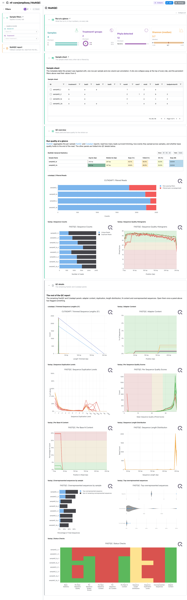
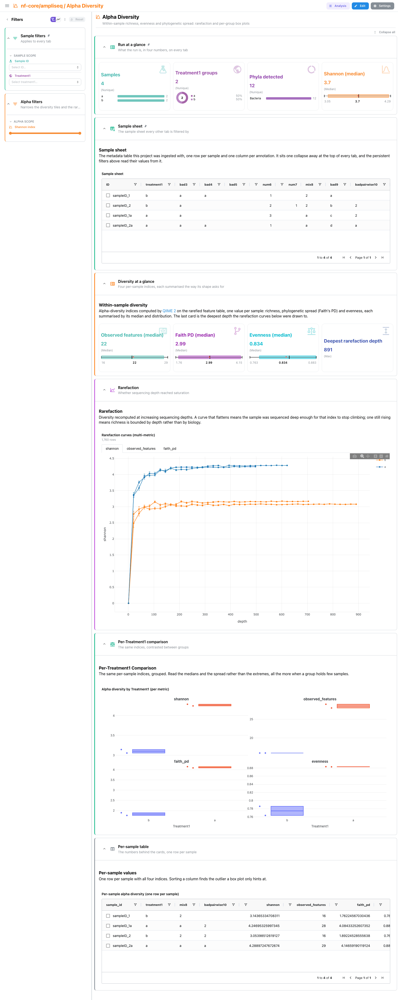
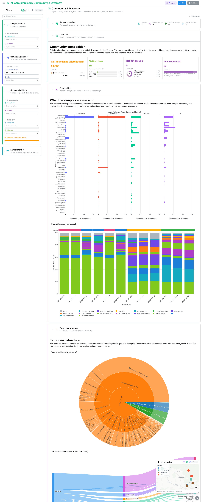
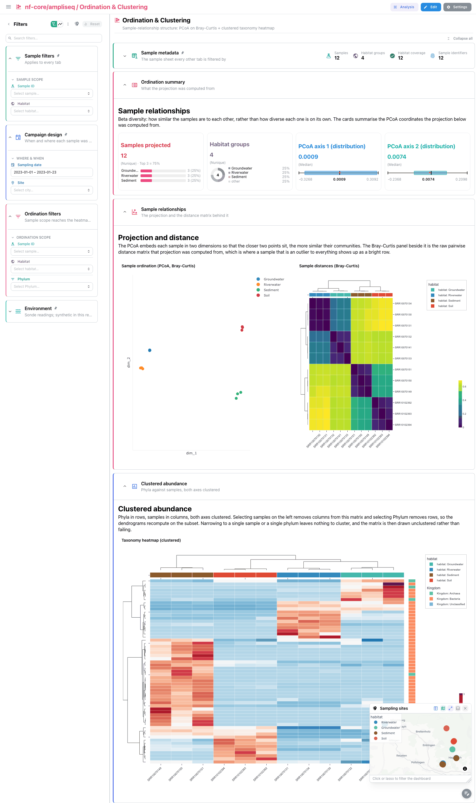
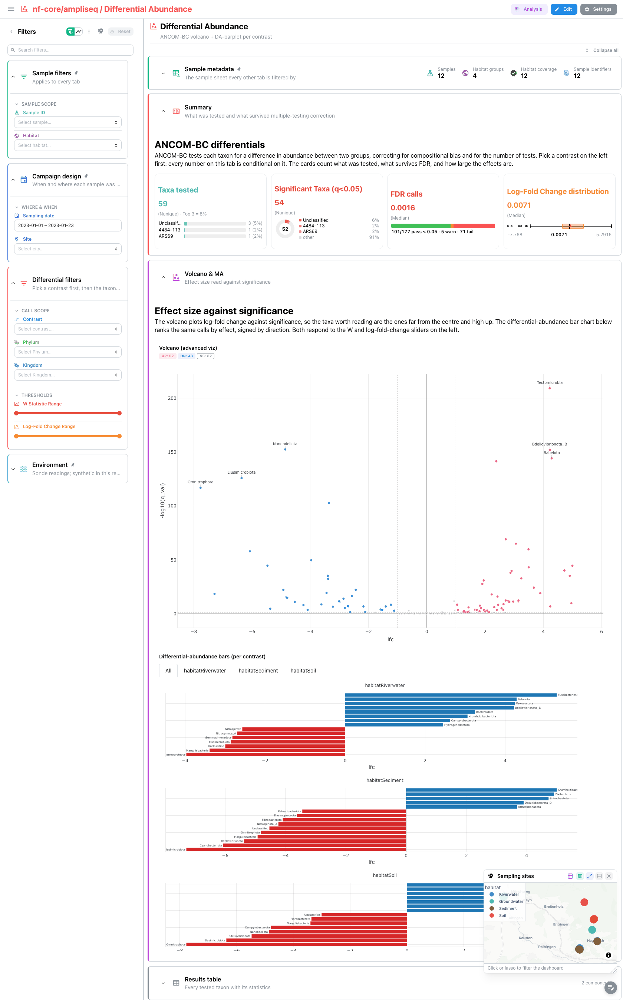
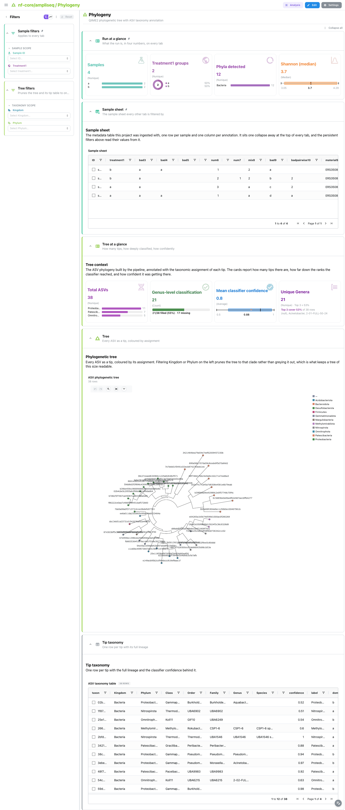

<div class="template-banner">
  <a class="template-banner-logo" href="https://nf-co.re/ampliseq" target="_blank" title="nf-core/ampliseq on nf-co.re">
    
    
  </a>
  <div class="template-banner-body">
    <h1 class="template-title">Amplicon Sequencing</h1>
    <p class="template-subtitle">Amplicon sequencing analysis workflow using DADA2 and QIIME2 — 16S, ITS, CO1, 18S and other amplicons across Illumina, PacBio, IonTorrent.</p>
    <p class="template-links">
      <a href="https://nf-co.re/ampliseq" target="_blank"><i class="mdi mdi-open-in-new"></i> nf-co.re</a>
      <a href="https://github.com/nf-core/ampliseq" target="_blank"><i class="mdi mdi-github"></i> GitHub</a>
    </p>
  </div>
  <span class="template-status-reviewed template-banner-badge" data-tooltip="Reviewed — tested, CI passes, and reviewed by the Depictio team or community."><i class="mdi mdi-check-circle-outline"></i> Reviewed</span>
</div>

The ampliseq template covers the main outputs of a standard nf-core/ampliseq run:

- :material-chart-bar: **MultiQC quality control** — FastQC read quality, Cutadapt trimming statistics
- :material-bacteria: **Taxonomy composition** — phylum-level barplots, sunburst, heatmap with annotations
- :material-chart-line: **Alpha diversity** — Faith's Phylogenetic Diversity, rarefaction curves (requires metadata)
- :material-chart-scatter-plot: **Differential abundance** — ANCOM-BC volcano plots, log-fold change (requires metadata + `--ancombc`)
- :material-map-marker: **Sampling locations** — geographic scatter map from metadata coordinates (requires metadata)

---

## Quick start

=== "Base (no metadata)"

    ```bash
    depictio run \
      --template nf-core/ampliseq/latest \
      --data-root /path/to/ampliseq_results \
      --var SAMPLESHEET_FILE=samplesheet.csv
    ```

    MultiQC + taxonomy dashboards. No diversity or differential abundance.

=== "Extended (with metadata)"

    ```bash
    depictio run \
      --template nf-core/ampliseq/latest \
      --data-root /path/to/ampliseq_results \
      --var SAMPLESHEET_FILE=samplesheet.csv \
      --var METADATA_FILE=Metadata.tsv \
      --var GROUP_COL=habitat
    ```

    Full dashboard: diversity, facetted charts, map, heatmap annotations, ANCOM-BC.

=== "From the pipeline itself (v1.10.0+)"

    ```bash
    depictio-cli config nextflow --install     # once per machine
    nextflow run nf-core/ampliseq -profile docker --outdir results
    ```

    No `depictio run`, and no template named: the pipeline ingests its own
    output directory when it finishes and resolves this template from its own
    manifest. See [Nextflow trigger](../../depictio-cli/nextflow-trigger.md).

---

## :material-book-open-variant: Reference

Running without `METADATA_FILE` prunes the metadata-dependent collections
(see the *Conditional routes* table); the `--skip_qiime` / `--skip_taxonomy`
/ multi-region routes are auto-detected from the run's `params.json`.

!!! info "Self-adapting layout"
    The dashboard adapts to whatever the run actually produced: components bound to
    pruned or unparsed data collections are hidden, tabs left with no real
    visualizations are dropped entirely, and the remaining components are re-packed so
    there are no empty rows. One template therefore covers 16S/ITS, single- vs.
    multi-region (SIDLE), and `skip_qiime` runs without edits.

=== ":material-tag-check-outline: 2.18.0 (latest)"

    --8<-- "pipeline-templates/nf-core/_generated/ampliseq-latest.md"

=== ":material-tag-outline: 2.16.0"

    --8<-- "pipeline-templates/nf-core/_generated/ampliseq-2.16.0.md"

=== ":material-tag-outline: 2.14.0"

    --8<-- "pipeline-templates/nf-core/_generated/ampliseq-2.14.0.md"

---

## :material-view-dashboard-outline: Dashboard tabs

Seven tabs: the MultiQC parent, then six children. Each tab below carries the
**same icon and colour the dashboard gives it**, so the page and the app read
alike. Filters propagate across tabs through cross-DC links on the metadata
`sample` column, see [Cross-DC links](#cross-dc-links).

Where a tab names *your grouping column*, that is whichever metadata column the
run was resolved against; the dashboard substitutes its real name everywhere.

=== ":material-chart-box-outline:{ .mc-orange } MultiQC"

    *Cutadapt and FastQC, straight from the report.*

    [](../../images/pipeline-templates/nf-core/ampliseq/multiqc_light.png){target="_blank" rel="noopener"}

    Thirteen MultiQC panels in two sections, then the sample metadata itself.

    ??? abstract ":material-tune-variant: Filters and components"

        **Filters** · `Sample ID`, and your grouping column.

        | Section | What it holds |
        |---|---|
        | QC overview | 4 MultiQC panels |
        | QC details | 9 MultiQC panels |
        | Sample metadata | 4 cards + *Sample Metadata* table |

=== ":material-chart-bell-curve:{ .mc-orange } Alpha Diversity"

    *Within-sample richness, evenness and phylogenetic spread: rarefaction plus per-group boxplots.*

    [](../../images/pipeline-templates/nf-core/ampliseq/alpha_diversity_light.png){target="_blank" rel="noopener"}

    **Total Samples**, then the distribution of **Shannon**, **Faith PD** and
    **Evenness**, before the rarefaction curves.

    ??? abstract ":material-tune-variant: Filters and components"

        **Filters** · `Sample ID` and your grouping column, both on
        `alpha_diversity_multi_canonical`.

        | Section | What it holds |
        |---|---|
        | Diversity at a glance | 4 cards |
        | Rarefaction | 1 advanced visualization |
        | Per-group comparison | *Alpha diversity by group (per metric)* |
        | Per-sample table | *Per-sample alpha diversity (one row per sample)* |

=== ":material-bacteria-outline:{ .mc-teal } Community & Diversity"

    *Taxonomic composition: sunburst, Sankey and stacked taxonomy.*

    [](../../images/pipeline-templates/nf-core/ampliseq/community_light.png){target="_blank" rel="noopener"}

    The widest tab: composition, taxonomic structure, set overlap, and the SINTAX
    classifier beside the main taxonomy.

    ??? abstract ":material-tune-variant: Filters and components"

        **Filters** · `Sample ID` and your grouping column on `metadata`;
        `Kingdom`, `Phylum` and a relative-abundance range on
        `taxonomy_rel_abundance`; a second `Kingdom` / `Phylum` pair scoping the
        SINTAX panels.

        | Section | What it holds |
        |---|---|
        | Overview | 4 cards |
        | Composition | 1 bar + 1 advanced visualization |
        | Taxonomic structure | 2 advanced visualizations |
        | Set overlap | 1 advanced visualization |
        | SINTAX classifier | 1 bar + *Taxonomy Relative Abundance (sintax)* |
        | Tables | *Taxonomy Relative Abundance* |

=== ":material-chart-scatter-plot-hexbin:{ .mc-pink } Ordination & Clustering"

    *Sample-relationship structure: PCoA on Bray-Curtis, plus a clustered taxonomy heatmap.*

    [](../../images/pipeline-templates/nf-core/ampliseq/ordination_light.png){target="_blank" rel="noopener"}

    **Samples projected**, the group count, and the distribution of each PCoA axis.

    ??? abstract ":material-tune-variant: Filters and components"

        **Filters** · `Sample ID` and your grouping column on `metadata`, plus
        `Phylum` on `complex_heatmap_canonical`.

        | Section | What it holds |
        |---|---|
        | Ordination summary | 4 cards |
        | Sample relationships | 2 advanced visualizations |
        | Clustered abundance | 1 advanced visualization |

=== ":material-chart-scatter-plot:{ .mc-red } Differential Abundance"

    *ANCOM-BC volcano and DA barplot, per contrast.*

    [](../../images/pipeline-templates/nf-core/ampliseq/differential_light.png){target="_blank" rel="noopener"}

    **Taxa tested**, **Significant Taxa (q<0.05)**, **FDR calls** and the
    log-fold-change distribution, above the volcano and MA plots.

    ??? abstract ":material-tune-variant: Filters and components"

        **Filters** · `Contrast`, `Phylum` and `Kingdom`, plus ranges on the W
        statistic and the log-fold change, all on `ancombc_results`.

        | Section | What it holds |
        |---|---|
        | Summary | 4 cards |
        | Volcano & MA | 2 advanced visualizations |
        | Results table | *ANCOM-BC differential abundance results* |

=== ":material-family-tree:{ .mc-lime } Phylogeny"

    *The QIIME2 tree, annotated with ASV taxonomy.*

    [](../../images/pipeline-templates/nf-core/ampliseq/phylogeny_light.png){target="_blank" rel="noopener"}

    **Total ASVs**, genus-level classification rate, mean classifier confidence
    and the count of unique genera, then the tree itself.

    ??? abstract ":material-tune-variant: Filters and components"

        **Filters** · `Kingdom` and `Phylum` on
        `phylogenetic_tree_metadata_canonical`.

        | Section | What it holds |
        |---|---|
        | Tree at a glance | 4 cards |
        | Tree | 1 advanced visualization |
        | Tip taxonomy | *ASV taxonomy table* |

=== ":material-graph-outline:{ .mc-indigo } Reconstructed Community (SIDLE)"

    *Cross-region reconstructed community, and per-feature reconstruction confidence.*

    !!! info "Multi-region runs only"
        This tab is bound to `sidle_reconstructed`, which a single-region run never
        writes. On such a run the self-adapting layout drops the tab entirely, which
        is why it does not appear in the screenshots above.

    **Reconstructed features**, **Samples**, **Phyla detected** and the mean number
    of regions per feature.

    ??? abstract ":material-tune-variant: Filters and components"

        **Filters** · `Phylum` on `sidle_reconstructed`.

        | Section | What it holds |
        |---|---|
        | Reconstruction at a glance | 4 cards |
        | Composition | 2 bars |
        | Reconstruction QC | 1 bar + 1 scatter |
        | Tables | *Reconstructed features (per-sample counts)*, *Reconstruction confidence* |

!!! tip "The reference dataset adds two more"
    The Ammer catchment reference dashboard, seeded with the bundled demo data,
    carries two further tabs on top of these seven:
    :material-map-marker-outline:{ .mc-blue } **Sampling Campaign** (where and when
    the catchment was sampled) and :material-waves:{ .mc-cyan } **Environment (CTD)**
    (sonde readings per sample, and the diversity they go with). Both are bound to
    metadata columns that only that dataset ships.

---

## Running the pipeline

Depictio reads the **output** of nf-core/ampliseq — it does not run the pipeline. Run the pipeline first:

```bash
nextflow run nf-core/ampliseq \
  --input samplesheet.csv \
  --FW_primer GTGYCAGCMGCCGCGGTAA \
  --RV_primer GGACTACNVGGGTWTCTAAT \
  --metadata Metadata.tsv \
  -profile docker
```

Then point Depictio at the results:

```bash
depictio run --template nf-core/ampliseq/latest \
  --data-root results/ \
  --var SAMPLESHEET_FILE=samplesheet.csv \
  --var METADATA_FILE=Metadata.tsv
```

See [nf-co.re/ampliseq/usage](https://nf-co.re/ampliseq/2.16.0/docs/usage) for full pipeline documentation.

---

## Required data structure

Point `--data-root` to the directory containing your ampliseq outputs. This can be a single run's `results/` folder or a parent directory containing multiple runs — Depictio scans recursively. Not all files are required; the template adapts based on what's present and which `--var` flags you provide.

```text
<DATA_ROOT>/
├── samplesheet.csv                                # --var SAMPLESHEET_FILE
├── Metadata.tsv                                   # --var METADATA_FILE (optional)
└── <run_id>/                                      # One or more pipeline run output folders
    ├── multiqc/
    │   └── multiqc_data/
    │       └── multiqc.parquet
    └── qiime2/
        ├── alpha-rarefaction/                      # ⚠ Requires --metadata
        │   └── faith_pd.csv
        ├── ancombc/differentials/                  # ⚠ Requires --metadata + --ancombc
        │   └── Category-<GROUP_COL>-level-2/
        │       ├── lfc_slice.csv
        │       ├── p_val_slice.csv
        │       ├── q_val_slice.csv
        │       ├── se_slice.csv
        │       └── w_slice.csv
        ├── barplot/
        │   └── level-2.csv
        ├── diversity/alpha_diversity/              # ⚠ Requires --metadata
        │   └── faith_pd_vector/
        │       └── metadata.tsv
        └── rel_abundance_tables/
            └── rel-table-2.tsv
```

---

## Additional resources

- [nf-co.re/ampliseq](https://nf-co.re/ampliseq) — official pipeline documentation
- [nf-co.re/ampliseq/2.16.0/results](https://nf-co.re/ampliseq/2.16.0/results) — AWS test results
- [Template System Reference](../../usage/projects/templates.md) — YAML format, variables, conditionals
- [Recipes](../../usage/projects/recipes.md) — how to read, test, and write recipes
