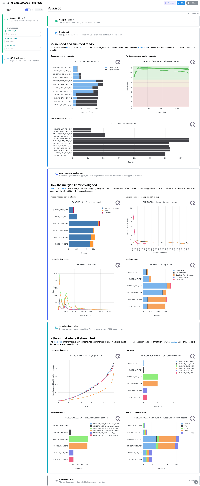

<div class="template-banner">
  <a class="template-banner-logo" href="https://nf-co.re/atacseq" target="_blank" title="nf-core/atacseq on nf-co.re">
    
    
  </a>
  <div class="template-banner-body">
    <h1 class="template-title">Chromatin Accessibility</h1>
    <p class="template-subtitle">An ATAC-seq run followed from reads to accessible regions: ataqv library quality, MACS2 broad peaks, the consensus peak set across libraries, and the DESeq2 sample QC on top of it.</p>
    <p class="template-links">
      <a href="https://nf-co.re/atacseq" target="_blank"><i class="mdi mdi-open-in-new"></i> nf-co.re</a>
      <a href="https://github.com/nf-core/atacseq" target="_blank"><i class="mdi mdi-github"></i> GitHub</a>
    </p>
  </div>
  <span class="template-status-draft template-banner-badge" data-tooltip="Draft: generated and not yet reviewed. Expect it to need fixes before it is usable."><i class="mdi mdi-pencil-outline"></i> Draft</span>
</div>

<div class="tpl-version-pick" data-latest="2.1.2">
  <span class="tpl-version-icon"><i class="mdi mdi-source-branch"></i></span>
  <span class="tpl-version-label">Template version</span>
  <select id="tpl-version" class="tpl-version-select" aria-label="Template version">
    <option value="2.1.2" selected>2.1.2</option>
  </select>
  <span class="tpl-version-badge">latest</span>
</div>

The atacseq template covers the merged-library, broad-peak route of a standard
nf-core/atacseq run, one tab per step:

- :material-chart-box-outline: **MultiQC**: FastQC and trimming, the merged libraries before and after filtering, and the pipeline's own FRiP and peak-count content
- :material-waves: **ATAC signal**: the ataqv metrics, the TSS enrichment curve, the fragment ladder and the per-chromosome read matrix
- :material-chart-scatter-plot: **Peaks**: MACS2 broad calls per library, their significance along the genome, and the HOMER annotation
- :material-set-merge: **Consensus**: the merged peak set, which libraries agree on an interval, and how the samples group on the counts over it

A `Sample sheet` section is pinned to the top of every tab and `Reference tables`
to the bottom, so the design rows and the per-library peak QC follow you from tab
to tab.

!!! warning "One MultiQC parquet per run, in one of two places"
    The tiles are bound to the report the pipeline writes itself with MultiQC
    1.31 or later swapped in, which is what the Nextflow trigger ingests:
    `multiqc/broad_peak/multiqc_data/multiqc.parquet`. The release pins MultiQC
    1.13, which writes no parquet; for such a run the reprocess step writes
    `multiqc/multiqc_data/multiqc.parquet` instead and the collection binds that
    too:

    ```bash
    python -m depictio.dev_scripts.multiqc_reprocess --src <outdir> --dest <outdir>
    ```

    The CLI ingests every parquet it finds under the data root as its own report,
    so a tree must hold exactly one of the two: never reprocess a run that already
    published a parquet. The tiles read the merged-library module ids
    (`samtools-1`, `picard`, `picard-1`, `mlib_deeptools`), which a reprocessed
    report merges under one id per tool, leaving those tiles empty.

!!! info "The broad-peak, merged-library route"
    The pipeline default calls broad peaks, so the calls are
    `macs2/broad_peak/*_peaks.broadPeak` (BED6+3, no summit column) and a
    `--narrow_peak` run is not bound here. 2.x publishes the whole peak tree twice,
    per merged library and per merged replicate; only the merged-library level is
    read, because the recipes match on file name and both levels would land in the
    same table. No glob names the aligner, so bwa, bowtie2, chromap and STAR runs
    bind identically.

!!! note "No DESeq2 differential accessibility"
    nf-core/atacseq 2.0 removed the differential accessibility analysis, so this
    template has no Differential accessibility tab. What the pipeline still runs
    is a DESeq2 sample QC on the consensus counts, published as MultiQC custom
    content, and it closes the Consensus tab.

---

## :material-rocket-launch-outline: Quick start

=== "Point at a finished run"

    ```bash
    depictio run \
      --template nf-core/atacseq/latest \
      --data-root /path/to/atacseq_results
    ```

    `--data-root` is the only thing you have to pass. The hub of the dashboard is
    the samplesheet the run validated, `pipeline_info/samplesheet.valid.csv`,
    which a template-local recipe turns into one row per merged library with its
    group, replicate, read type, role and control.

=== "From the pipeline itself (v1.10.0+)"

    ```bash
    depictio-cli config nextflow --install     # once per machine
    nextflow run nf-core/atacseq -profile docker --outdir results
    ```

    No `depictio run`, and no template named: the pipeline ingests its own
    output directory when it finishes and resolves this template from its own
    manifest. See [Nextflow trigger](../../depictio-cli/nextflow-trigger.md).

---

## :material-book-open-variant: Reference

The template reads the validated samplesheet, the ataqv JSON reports, the MACS2
broad calls and their HOMER annotation, the consensus boolean and fold-enrichment
matrices, and the MultiQC parquet. 49 of its 91 components carry a `use:` catalog
reference, so a tile says where its panel comes from.

!!! info "Self-adapting layout"
    The dashboard adapts to whatever the run actually produced: components bound
    to pruned or unparsed data collections are hidden, tabs left with no real
    visualizations are dropped entirely, and the remaining components are
    re-packed so there are no empty rows.

<div class="tpl-version-block" data-version="2.1.2" markdown>

--8<-- "pipeline-templates/nf-core/_generated/atacseq-latest.md"

</div>

---

## :material-view-dashboard-outline: Dashboard tabs

Four tabs, read as a funnel: are the libraries clean, is the ATAC signal where it
should be, what did MACS2 call, and which calls do the libraries agree on. Each
tab below carries the **same icon and colour the dashboard gives it**. Each
library has two spellings, bare and `.mLb.clN`, and the hub carries both, so one
pick in the filter reaches every panel. The screenshots come from a `test_full`
run: six GM12878 libraries across three transposition protocols, two replicates
each.

=== "{ width=18 }{ width=18 } MultiQC"

    *Reads in, alignment out, and how concentrated the signal is.*

    [{ loading=lazy }](../../images/pipeline-templates/nf-core/atacseq/multiqc_light.png){ .tpl-shot target="_blank" rel="noopener" }

    FastQC names a library after its technical replicate and read, so a sample
    appears in `Read quality` once per library and read. `Alignment and
    duplication` reads the merged libraries before filtering (`samtools-1`), where
    unmapped and mitochondrial reads are still there, with the insert size from
    Picard on the filtered library. `Signal and peak yield` closes with the
    deepTools fingerprint and the pipeline's own FRiP, peak count and peak
    annotation content.

    ??? abstract ":material-tune-variant: Filters and components"

        **Filters** · `ATAC sample`, `Sample group` and `Library role` on
        `sample_design`, pinned to the top of every tab, plus `TSS enrichment`
        and `FRiP score` floors in a collapsed *QC thresholds* group.

        | Section | What it holds |
        |---|---|
        | Sample sheet | *Sample design* |
        | Read quality | 3 MultiQC panels |
        | Alignment and duplication | 4 MultiQC panels |
        | Signal and peak yield | 4 MultiQC panels |
        | Reference tables | *Peak QC summary* |

=== ":material-waves:{ .mc-cyan } ATAC signal"

    *What ataqv measures: TSS enrichment, the nucleosome ladder, and where the reads landed.*

    [{ loading=lazy }](../../images/pipeline-templates/nf-core/atacseq/atac_signal_light.png){ .tpl-shot target="_blank" rel="noopener" }

    The first card row is the quartet a library is accepted or rejected on: TSS
    enrichment, reads inside peaks, mitochondrial fraction and duplicate fraction.
    The TSS coverage curve below is the canonical ATAC read, a sharp central spike
    against a flat line, and the scatter beside it puts each library on TSS
    enrichment against reads in peaks. It is the tab's selection source, so
    lassoing there narrows the ataqv table. Read the `chrM` row of the read
    distribution matrix first: a high share there is the classic ATAC failure.

    ??? abstract ":material-tune-variant: Filters and components"

        **Filters** · `Fragment class` and a `Fragment length` range on
        `ataqv_fragment_length`, plus `Reference sequence` on
        `ataqv_chromosome_counts`, in a *Fragment windows* group.

        | Section | What it holds |
        |---|---|
        | Library quality at a glance | 7 cards |
        | Depth and coverage concentration | *Library complexity with its confidence ribbon*, *Coverage concentration per library* |
        | Signal at transcription start sites | *Coverage around transcription start sites*, *Signal against specificity*, *Metagene signal profile* |
        | Fragment length ladder | *Fragment length distribution*, *Reads per fragment class* |
        | Read distribution | *Read distribution matrix* |
        | ATAC quality tables | *ATAC quality metrics* |

    !!! tip "Two panels depend on how the run was made"
        preseq is off by default in 2.x, so the complexity ribbon stays empty
        unless the run passed `--skip_preseq false`. ataqv only writes
        per-reference counts for paired-end libraries, so single-end ones are
        absent from the read distribution matrix.

=== ":material-chart-scatter-plot:{ .mc-indigo } Peaks"

    *MACS2 broad calls per library, and where they land relative to genes.*

    [{ loading=lazy }](../../images/pipeline-templates/nf-core/atacseq/peaks_light.png){ .tpl-shot target="_blank" rel="noopener" }

    The manhattan panel places every call at its midpoint over `-log10(q)`, next
    to a scatter of enrichment against significance, which carries the selection
    on `peak_id`, and a width histogram on a log axis. *Where the peaks land*
    reads the HOMER annotation twice over: the histogram pools libraries and
    splits them by feature class, while the TSS distance `profile` below it does
    the opposite, one curve per library as a share of that library's peaks, which
    is what lets libraries of different depth be compared.

    ??? abstract ":material-tune-variant: Filters and components"

        **Filters** · `Peak significance` and `Peak width` ranges on
        `macs2_broad_peaks`, plus `Feature class` on `homer_annotated_peaks`.

        | Section | What it holds |
        |---|---|
        | Peaks at a glance | 4 cards |
        | Significance along the genome | *Peak significance along the genome*, *Enrichment against significance*, *Peak width distribution* |
        | Where the peaks land | 4 cards, *Peak annotation per library*, *Distance to the nearest TSS*, *Peak distribution around the nearest TSS* |
        | Peak tables | *MACS2 broad peaks*, *HOMER peak annotation* |

=== ":material-set-merge:{ .mc-teal } Consensus"

    *The merged peak set: which libraries agree on an interval, and how the samples group on it.*

    [{ loading=lazy }](../../images/pipeline-templates/nf-core/atacseq/consensus_light.png){ .tpl-shot target="_blank" rel="noopener" }

    The UpSet panel runs over the library columns of the consensus boolean matrix;
    with three protocols in two replicates each, the protocol-specific
    intersections are the ones to read. The signal heatmap is a top-N view on
    purpose: the `test_full` merged set holds 104,659 intervals and the panel
    clusters the 250 most accessible, so a selection elsewhere narrows it only
    when it lands there. `Sample similarity` closes the tab with the pipeline's
    DESeq2 QC, where replicates of a group should sit together.

    ??? abstract ":material-tune-variant: Filters and components"

        **Filters** · `Libraries per interval` and `Peaks merged` ranges on
        `macs2_consensus_boolean`, plus `Support` on `macs2_consensus_fc`.

        | Section | What it holds |
        |---|---|
        | Consensus at a glance | 4 cards |
        | Replicate agreement | *Consensus peak overlap* |
        | Signal at the strongest intervals | *Consensus signal heatmap* |
        | Sample similarity | *Sample PCA on the consensus counts*, *Sample distances on the consensus counts* |
        | Consensus tables | *Consensus intervals*, *Consensus fold enrichment* |

---

## :material-play-circle-outline: Running the pipeline

Depictio reads the **output** of nf-core/atacseq, it does not run the pipeline.
Run the pipeline first, then ingest, regenerating the MultiQC report only if the
run kept the release's MultiQC 1.13:

```bash
nextflow run nf-core/atacseq -r 2.1.2 -profile docker \
  --input samplesheet.csv --genome GRCh37

python -m depictio.dev_scripts.multiqc_reprocess --src results/ --dest results/

depictio run --template nf-core/atacseq/latest --data-root results/
```

See [nf-co.re/atacseq/usage](https://nf-co.re/atacseq/2.1.2/docs/usage) for full
pipeline documentation.

---

## :material-folder-open-outline: Required data structure

Point `--data-root` at the directory holding the pipeline output. Depictio scans
recursively and every recipe matches on file name, so a run aligned with another
aligner binds identically. Keep the `merged_replicate/` tree out for that same
reason.

```text
<DATA_ROOT>/
├── pipeline_info/
│   ├── samplesheet.valid.csv                     # the hub: one row per merged library
│   └── software_versions.yml
├── multiqc/broad_peak/multiqc_data/
│   └── multiqc.parquet                           # or multiqc/multiqc_data/ after a reprocess
├── fastqc/zips/, trimgalore/                     # raw and trimmed reads
└── bwa/merged_library/
    ├── samtools_stats/                           # *.mLb.mkD.* and *.mLb.clN.*
    ├── picard_metrics/                           # MarkDuplicates, CollectMultipleMetrics
    ├── deeptools/{plotfingerprint,plotprofile}/
    ├── ataqv/broad_peak/*.ataqv.json             # the ATAC quality reports
    └── macs2/broad_peak/
        ├── *.mLb.clN_peaks.broadPeak             # BED6+3, no summit column
        ├── *.mLb.clN_peaks.annotatePeaks.txt     # HOMER annotation
        ├── qc/*_mqc.tsv                          # FRiP, peak counts
        └── consensus/
            ├── consensus_peaks.mLb.clN.boolean.txt
            └── deseq2/*_mqc.tsv                  # the sample QC, as MultiQC content
```

---

## :material-flask-outline: Validation runs

No AWS megatest is usable for 2.1.2: the 2.1.1 and 2.1.2 prefixes in the bucket
each hold a single 12 GB object, so nothing can be mirrored from them. The
template was validated on EMBL HPC runs of the release instead: the `test`
profile under each of the four aligners, `test_controls` for a run with input
controls, and the megatest profile `test_full`, which is where the screenshots
above come from. `megatest.yaml` describes that run file by file, so a usable S3
run can be pinned later without rewriting it.

Do not pass `--project-name` when ingesting: the dashboard is attached to the
project by name, so renaming it breaks a later `depictio dashboard import`.
Re-ingesting accumulates dashboards, so delete the project before repeating a run.

---

## :material-link-variant: Additional resources

- [nf-co.re/atacseq](https://nf-co.re/atacseq): official pipeline documentation
- [nf-co.re/atacseq/2.1.2/results](https://nf-co.re/atacseq/2.1.2/results): AWS test results
- [Template System Reference](../../usage/projects/templates.md): YAML format, variables, conditionals
- [Recipes](../../usage/projects/recipes.md): how to read, test, and write recipes

---

## :material-account-group-outline: Authorship

<div class="tpl-credits">
  <div class="tpl-credit">
    <span class="tpl-credit-role"><i class="mdi mdi-code-braces"></i> Developers</span>
    <span class="tpl-credit-note">Wrote the template, its recipes and its dashboards.</span>
    <a class="tpl-person" href="https://github.com/weber8thomas" target="_blank" rel="noopener">
       weber8thomas
    </a>
  </div>
  <div class="tpl-credit">
    <span class="tpl-credit-role"><i class="mdi mdi-eye-check-outline"></i> Reviewers</span>
    <span class="tpl-credit-note">Nobody has run it on their own data and signed it off yet, which is what keeps it a Draft.</span>
    <span class="tpl-person"><i class="mdi mdi-account-plus-outline"></i> Open</span>
  </div>
  <div class="tpl-credit">
    <span class="tpl-credit-role"><i class="mdi mdi-wrench-outline"></i> Maintainers</span>
    <span class="tpl-credit-note">Keep it working as nf-core/atacseq releases.</span>
    <a class="tpl-person" href="https://github.com/weber8thomas" target="_blank" rel="noopener">
       weber8thomas
    </a>
  </div>
</div>

Reviewing a template on your own data, or taking over a role here, is a
contribution in itself: the [contributing guide](../../developer/contributing-templates.md)
says what each one involves.
