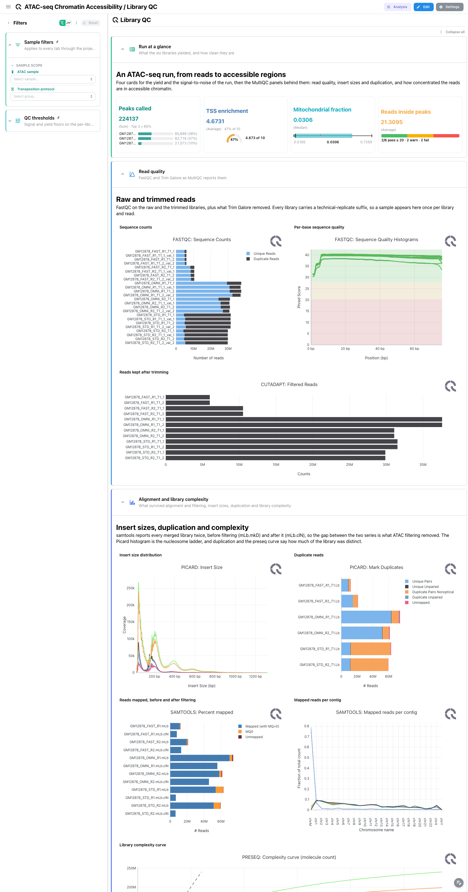
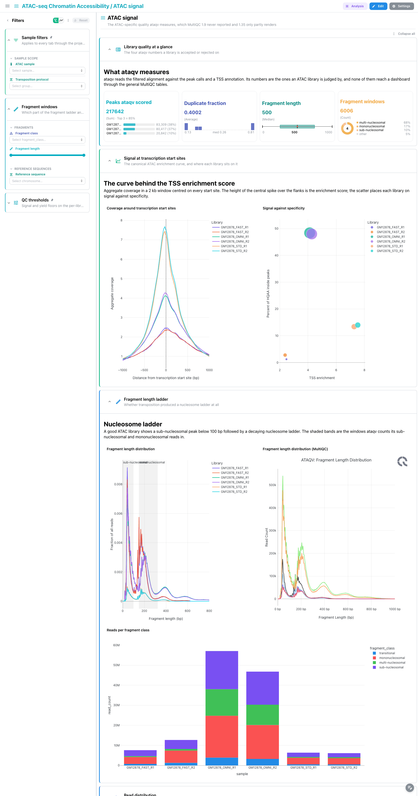
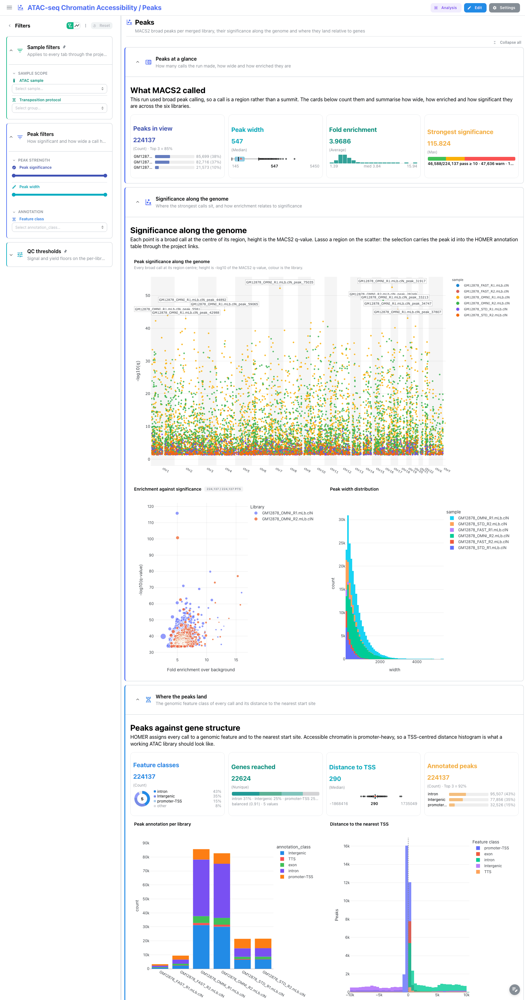
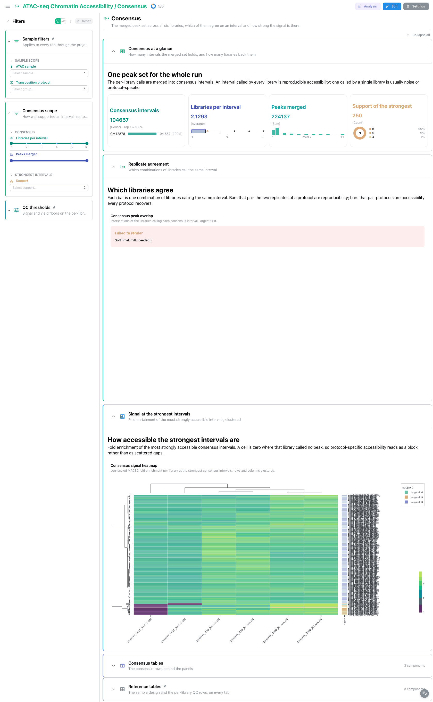

<div class="template-banner">
  <a class="template-banner-logo" href="https://nf-co.re/atacseq" target="_blank" title="nf-core/atacseq on nf-co.re">
    
    
  </a>
  <div class="template-banner-body">
    <h1 class="template-title">Chromatin Accessibility</h1>
    <p class="template-subtitle">An ATAC-seq run followed from reads to accessible regions: ataqv library quality, MACS2 broad peaks, the consensus peak set across libraries, and DESeq2 differential accessibility on top of it.</p>
    <p class="template-links">
      <a href="https://nf-co.re/atacseq" target="_blank"><i class="mdi mdi-open-in-new"></i> nf-co.re</a>
      <a href="https://github.com/nf-core/atacseq" target="_blank"><i class="mdi mdi-github"></i> GitHub</a>
    </p>
  </div>
  <span class="template-status-experimental template-banner-badge" data-tooltip="Experimental — shared as-is. Feedback and PRs welcome."><i class="mdi mdi-flask-outline"></i> Experimental</span>
</div>

The atacseq template covers the merged-library, broad-peak route of a standard nf-core/atacseq run:

- :material-chart-box-outline: **Library QC**: FastQC, Trim Galore, Picard, samtools, preseq and deepTools, from the MultiQC report
- :material-waves: **ATAC signal**: the ataqv metrics, the TSS enrichment curve, the fragment ladder and the per-chromosome read matrix
- :material-chart-scatter-plot: **Peaks**: MACS2 broad calls per library, their significance along the genome, and the HOMER annotation
- :material-set-merge: **Consensus**: the merged peak set, which libraries agree on an interval, and how strong the signal is there
- :material-scale-balance: **Differential accessibility**: DESeq2 over the consensus interval counts, one panel set per contrast

!!! warning "MultiQC has to be reprocessed before ingest"
    The reference run published MultiQC 1.9, which writes no parquet, and
    Depictio reads only `multiqc.parquet` (MultiQC 1.31 and later). Regenerating
    the report is mandatory: without it the Library QC tab is empty. It buys more
    than the file format here, because MultiQC 1.35 gained an `ataqv` module that
    1.9 knew nothing about, so four ATAC-specific panels appear outright.

!!! info "Scope, and why 1.2.2 rather than a 2.x release"
    The run was called with `--narrow_peak false`, so the calls are
    `*_peaks.broadPeak` (BED6+3, no summit column) read by `macs2/broad_peaks`;
    the narrowPeak route is read by `macs2/peaks`. Only the merged-library level
    is bound, not the merged-replicate copy of the same tree. Every release from
    2.x on publishes an empty or truncated megatest prefix, so 1.2.2 from 2022 is
    the newest complete run in the bucket. It is DSL1: no `params.json`, so
    nothing is auto-detected, and the software versions are a tab-separated CSV.

---

## Quick start

=== "Point at a finished run"

    ```bash
    # 1. Regenerate the MultiQC report Depictio reads (the run wrote 1.9)
    python -m depictio.dev_scripts.multiqc_reprocess \
      --src /path/to/atacseq_results --dest /path/to/atacseq_results

    # 2. Ingest
    depictio run --template nf-core/atacseq/latest \
      --data-root /path/to/atacseq_results
    ```

    `--data-root` is the only thing you have to pass: the design sheet is one of
    the run's own outputs (`pipeline_info/design_reads.csv`).

=== "From the pipeline itself (v1.10.0+)"

    ```bash
    depictio-cli config nextflow --install     # once per machine
    nextflow run nf-core/atacseq -profile docker --outdir results
    ```

    No `depictio run`, and no template named: the pipeline ingests its own
    output directory when it finishes and resolves this template from its own
    manifest. See [Nextflow trigger](../../depictio-cli/nextflow-trigger.md).

---

## :material-book-open-variant: Reference

The template reads the ataqv JSON reports, the MACS2 broad calls and their HOMER
annotation, the consensus boolean matrix and fold-enrichment table, the DESeq2
result tables and the regenerated MultiQC parquet. Both the MultiQC `ataqv` module
and the dedicated `ataqv` tool are bound, because they answer different questions:
the module plots four distributions, the tool carries the per-library metric table
the cards read and the TSS coverage curve.

!!! info "Self-adapting layout"
    The dashboard adapts to whatever the run actually produced: components bound
    to pruned or unparsed data collections are hidden, tabs left with no real
    visualizations are dropped entirely, and the remaining components are
    re-packed so there are no empty rows.

=== ":material-tag-check-outline: 1.2.2 (latest)"

    --8<-- "pipeline-templates/nf-core/_generated/atacseq-latest.md"

---

## :material-view-dashboard-outline: Dashboard tabs

Five tabs, read as a funnel: are the libraries clean, is the ATAC signal where it
should be, what did MACS2 call, which calls do the libraries agree on, and which
of the agreed intervals change between protocols. Each tab below carries the
**same icon and colour the dashboard gives it**, so the page and the app read
alike. `Sample filters` is pinned to the top of every tab, `QC thresholds` and
`Reference tables` to the bottom. Each sample has two spellings, bare and
`.mLb.clN`, and the hub carries both, so one pick in the filter reaches them all.

=== ":material-chart-box-outline:{ .mc-orange } Library QC"

    *Reads in, alignment out, and how concentrated the signal is.*

    [](../../images/pipeline-templates/nf-core/atacseq/library_qc_light.png){target="_blank" rel="noopener"}

    Three of the four cards read ataqv rather than MultiQC, because those are the
    numbers an ATAC library is accepted or rejected on. The samtools panels carry
    every library twice, `mLb.mkD` before filtering and `mLb.clN` after, so the
    gap between the series is what ATAC filtering removed. Two tiles read deepTools
    tables the report has no panel for: a `scatter_xy` of coverage concentration
    against divergence from a uniform library, and a metagene `profile`.

    ??? abstract ":material-tune-variant: Filters and components"

        **Filters** · `ATAC sample` and `Transposition protocol` on
        `sample_design`, pinned to the top of every tab, plus `TSS enrichment`
        and `FRiP score` floors in a collapsed *QC thresholds* group.

        | Section | What it holds |
        |---|---|
        | Run at a glance | 4 cards |
        | Read quality | 3 MultiQC panels |
        | Alignment and library complexity | 5 MultiQC panels, *Library complexity with its confidence ribbon* |
        | Accessibility signal | 4 MultiQC panels, *Coverage concentration per library*, *Metagene signal profile* |
        | Reference tables | *Sample design*, *Peak QC summary* |

=== ":material-waves:{ .mc-cyan } ATAC signal"

    *What ataqv measures: TSS enrichment, the nucleosome ladder, and where the reads landed.*

    [](../../images/pipeline-templates/nf-core/atacseq/atac_signal_light.png){target="_blank" rel="noopener"}

    The TSS coverage curve is the canonical ATAC read: a sharp central spike is a
    well transposed library, a flat line is not. The scatter beside it puts each
    library on TSS enrichment against reads in peaks and is the tab's selection
    source, so lassoing there narrows the ataqv table. The fragment-length figure
    obeys the fragment-window filters while MultiQC's rendering of the same signal
    beside it is the unfiltered reference. Read the `chrM` row of the read
    distribution matrix first: a high share there is the classic ATAC failure.

    ??? abstract ":material-tune-variant: Filters and components"

        **Filters** · `Fragment class` and a `Fragment length` range on
        `ataqv_fragment_length`, plus `Reference sequence` on
        `ataqv_chromosome_counts`, in a *Fragment windows* group.

        | Section | What it holds |
        |---|---|
        | Library quality at a glance | 4 cards |
        | Signal at transcription start sites | *Coverage around transcription start sites*, *Signal against specificity* |
        | Fragment length ladder | *Fragment length distribution*, the MultiQC ataqv panel, *Reads per fragment class* |
        | Read distribution | *Read distribution matrix*, MultiQC mapping quality |
        | ATAC quality tables | *ATAC quality metrics* |

=== ":material-chart-scatter-plot:{ .mc-indigo } Peaks"

    *MACS2 broad calls per library, and where they land relative to genes.*

    [](../../images/pipeline-templates/nf-core/atacseq/peaks_light.png){target="_blank" rel="noopener"}

    The manhattan panel places every call at its midpoint over `-log10(q)`, next
    to a scatter of enrichment against significance and a width histogram. *Where
    the peaks land* reads the HOMER annotation twice over: the histogram pools
    libraries and splits them by feature class, while the TSS distance `profile`
    below it does the opposite, one curve per library as a share of that library's
    peaks, which is what lets libraries of different depth be compared.

    ??? abstract ":material-tune-variant: Filters and components"

        **Filters** · `Peak significance` and `Peak width` ranges on
        `macs2_broad_peaks`, plus `Feature class` on `homer_annotated_peaks`.

        | Section | What it holds |
        |---|---|
        | Peaks at a glance | 4 cards |
        | Significance along the genome | *Peak significance along the genome*, *Enrichment against significance*, *Peak width distribution* |
        | Where the peaks land | 4 cards, *Peak annotation per library*, *Distance to the nearest TSS*, *Peak distribution around the nearest TSS* |
        | Peak tables | *MACS2 broad peaks*, *HOMER peak annotation* |

=== ":material-set-merge:{ .mc-teal } Consensus"

    *The merged peak set: which libraries agree on an interval, and how strong the signal is there.*

    [](../../images/pipeline-templates/nf-core/atacseq/consensus_light.png){target="_blank" rel="noopener"}

    The UpSet panel runs over the six library columns of the consensus boolean
    matrix; with three protocols in two replicates each, the protocol-specific
    intersections are the ones to read. The signal heatmap is a top-N view on
    purpose: the merged set holds 104657 intervals and the panel clusters the 250
    most accessible, so a selection elsewhere narrows it only when it lands there.

    ??? abstract ":material-tune-variant: Filters and components"

        **Filters** · `Libraries per interval` and `Peaks merged` ranges on
        `macs2_consensus_boolean`, plus `Support` on `macs2_consensus_fc`.

        | Section | What it holds |
        |---|---|
        | Consensus at a glance | 4 cards |
        | Replicate agreement | *Consensus peak overlap* |
        | Signal at the strongest intervals | *Consensus signal heatmap* |
        | Consensus tables | *Consensus intervals*, *Consensus fold enrichment* |

=== ":material-scale-balance:{ .mc-grape } Differential accessibility"

    *DESeq2 over the consensus counts: FAST against OMNI, FAST against STD, OMNI against STD.*

    [](../../images/pipeline-templates/nf-core/atacseq/differential_accessibility_light.png){target="_blank" rel="noopener"}

    Volcano and MA are the catalog's own `deseq2` panels, with the QQ plot and the
    DA barplot beside a bar of significant intervals per contrast. The `Contrast`
    filter is a single-choice `Select` on purpose: DESeq2 names the consensus
    intervals `Interval_1 ... Interval_N` and the numbering restarts per contrast,
    so an interval id identifies a row only together with the selected contrast.

    ??? abstract ":material-tune-variant: Filters and components"

        **Filters** · `Contrast` as a single choice and `Direction`, plus log2
        fold-change and significance ranges, all on `deseq2_results`.

        | Section | What it holds |
        |---|---|
        | Differential accessibility at a glance | 4 cards |
        | Volcano and MA | *Volcano*, *MA plot* |
        | Calibration and direction | *QQ plot*, *Strongest differential intervals*, *Significant intervals per contrast* |
        | Differential tables | *DESeq2 differential accessibility* |

---

## Running the pipeline

Depictio reads the **output** of nf-core/atacseq, it does not run the pipeline.
Run the pipeline first, then regenerate MultiQC and ingest:

```bash
nextflow run nf-core/atacseq -r 1.2.2 -profile docker \
  --input design.csv --genome GRCh37 --narrow_peak false

python -m depictio.dev_scripts.multiqc_reprocess --src results/ --dest results/

depictio run --template nf-core/atacseq/latest --data-root results/
```

See [nf-co.re/atacseq/usage](https://nf-co.re/atacseq/1.2.2/docs/usage) for full
pipeline documentation.

---

## Required data structure

Point `--data-root` at the directory holding the pipeline output. Depictio scans
recursively and every recipe matches on file name, so no glob spells out the
`bwa/mergedLibrary/macs/broadPeak/` prefix and a run aligned with a different
aligner binds identically. Keep `bwa/mergedReplicate/` out for that same reason.

```text
<DATA_ROOT>/
├── pipeline_info/
│   ├── design_reads.csv                         # the design sheet, the dashboard hub
│   └── software_versions.csv                    # DSL1: tab-separated, not YAML
├── multiqc/multiqc_data/multiqc.parquet         # written by multiqc_reprocess
├── fastqc/zips/, trim_galore/                   # raw and trimmed reads
└── bwa/mergedLibrary/
    ├── picard_metrics/, samtools_stats/         # *.mLb.mkD.* and *.mLb.clN.*
    ├── preseq/, deepTools/                      # complexity, fingerprint, profile
    ├── ataqv/broadPeak/*.ataqv.json             # the ATAC quality reports
    └── macs/broadPeak/
        ├── *_peaks.broadPeak                    # BED6+3, no summit column
        ├── *_peaks.annotatePeaks.txt            # HOMER annotation
        ├── qc/*_mqc.tsv                         # FRiP, peak counts
        └── consensus/
            ├── consensus_peaks.mLb.clN.boolean.txt
            └── deseq2/<contrast>/*.deseq2.results.txt
```

---

## Test data

The repository ships
[`download_test_data.sh`](https://github.com/depictio/depictio/blob/main/depictio/projects/nf-core/atacseq/1.2.2/download_test_data.sh),
which fetches the megatest subset the template needs, 147 files and 215 MB:

```bash
bash depictio/projects/nf-core/atacseq/1.2.2/download_test_data.sh /tmp/atacseq_test
python -m depictio.dev_scripts.multiqc_reprocess --src /tmp/atacseq_test --dest /tmp/atacseq_test
depictio run --template nf-core/atacseq/latest --data-root /tmp/atacseq_test
```

The run is
`s3://nf-core-awsmegatests/atacseq/results-f327c86324427c64716be09c98634ae0bc8165f6/`,
the 1.2.2 release tag: six GM12878 ATAC libraries across three transposition
protocols (FAST, OMNI and STD), two biological replicates each. No samplesheet is
fetched alongside it: the design sheet is one of the run's own outputs.

!!! warning "Keep the first `REPROCESSED.json`"
    The reprocess is reproducible for the parquet but not for its provenance
    record: a second pass finds the parquet it wrote itself and records 1.35 as
    the source. Delete `multiqc/multiqc_data/` before re-running.

---

## Additional resources

- [nf-co.re/atacseq](https://nf-co.re/atacseq): official pipeline documentation
- [nf-co.re/atacseq/1.2.2/results](https://nf-co.re/atacseq/1.2.2/results): AWS test results
- [Template System Reference](../../usage/projects/templates.md): YAML format, variables, conditionals
- [Recipes](../../usage/projects/recipes.md): how to read, test, and write recipes
