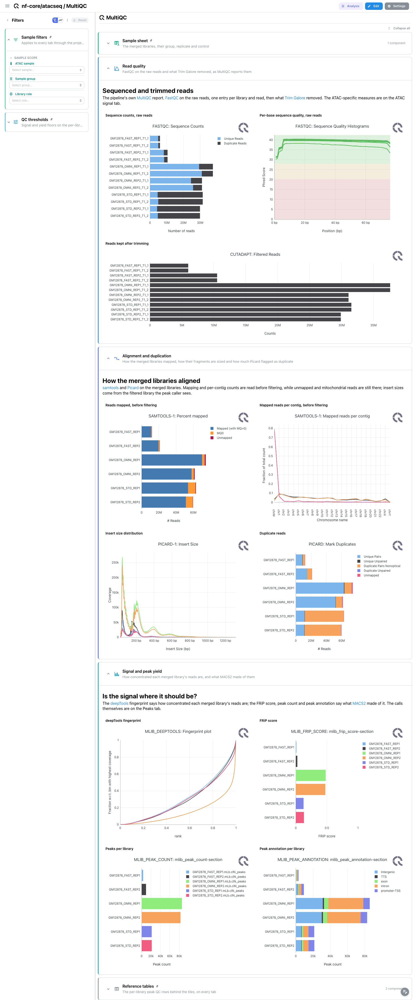
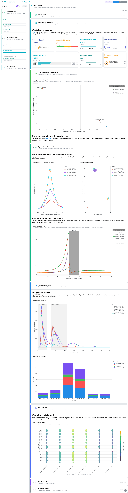
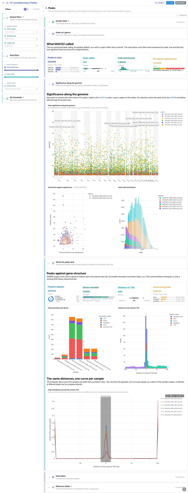
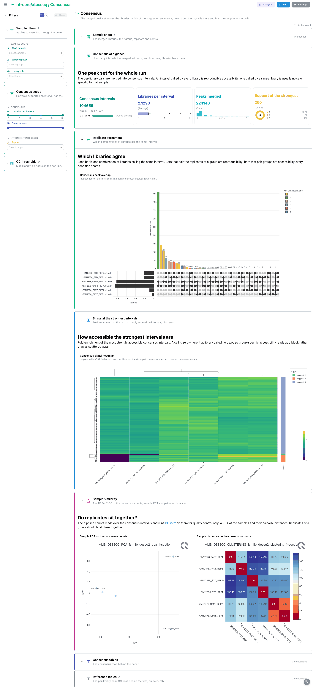

<div class="template-banner">
  <a class="template-banner-logo" href="https://nf-co.re/atacseq" target="_blank" title="nf-core/atacseq on nf-co.re">
    
    
  </a>
  <div class="template-banner-body">
    <h1 class="template-title">Chromatin Accessibility</h1>
    <p class="template-subtitle">An ATAC-seq run followed from reads to accessible regions: ataqv library quality, MACS2 broad peaks, the consensus peak set across libraries, and the DESeq2 sample QC on top of it.</p>
    <p class="template-links">
      <a href="https://nf-co.re/atacseq" target="_blank"><i class="mdi mdi-open-in-new"></i> nf-co.re</a>
      <a href="https://github.com/nf-core/atacseq" target="_blank"><i class="mdi mdi-github"></i> GitHub</a>
    </p>
  </div>
  <span class="template-status-draft template-banner-badge" data-tooltip="Draft: generated and not yet reviewed. Expect it to need fixes before it is usable."><i class="mdi mdi-pencil-outline"></i> Draft</span>
</div>

<div class="tpl-version-pick" data-latest="2.1.2">
  <span class="tpl-version-icon"><i class="mdi mdi-source-branch"></i></span>
  <span class="tpl-version-label">Template version</span>
  <select id="tpl-version" class="tpl-version-select" aria-label="Template version">
    <option value="2.1.2" selected>2.1.2</option>
  </select>
  <span class="tpl-version-badge">latest</span>
</div>

The atacseq template covers the merged-library, broad-peak route of a standard
nf-core/atacseq run:

- :material-compass-outline: **Overview**: the run in four key figures, live findings and four figures, each linked to the tab that explains it
- :material-chart-box-outline: **Data & QC**: the MultiQC report, the ataqv library quality (TSS enrichment, the fragment ladder, where the reads landed), and the deepTools and Picard signal tables
- :material-chart-scatter-plot: **Peak calls**: MACS2 broad calls per library, where HOMER places them relative to genes, and one genomic region across libraries
- :material-set-merge: **Comparison**: the consensus peak set, which libraries agree on an interval, and where the libraries sit on the DESeq2 QC of its counts

!!! warning "One MultiQC parquet per run, in one of two places"
    The release pins MultiQC 1.13, which writes no parquet. The collection binds
    the report the pipeline writes itself with MultiQC 1.31 or later swapped in,
    which is what the Nextflow trigger ingests:
    `multiqc/broad_peak/multiqc_data/multiqc.parquet`. For a run on the pinned
    1.13, the reprocess step writes `multiqc/multiqc_data/multiqc.parquet`
    instead and the collection binds that one:

    ```bash
    python -m depictio.dev_scripts.multiqc_reprocess --src <outdir> --dest <outdir>
    ```

    The CLI ingests every parquet it finds under the data root as its own report,
    so a tree must hold exactly one of the two: never reprocess a run that already
    published a parquet. The two reports name their modules differently: the
    pipeline's numbers a tool run at several levels (`picard-1`,
    `mlib_deeptools`), a reprocessed one keeps the plain ids. The MultiQC tab
    binds the panels both carry under one id, gives the fingerprint and the
    insert sizes one tile per report on the same slot, and the import drops the
    tiles the bound report lacks.

!!! info "The broad-peak, merged-library route"
    The pipeline default calls broad peaks, so the calls are
    `macs2/broad_peak/*_peaks.broadPeak` (BED6+3, no summit column) and a
    `--narrow_peak` run is not bound here. 2.x publishes the whole peak tree twice,
    per merged library and per merged replicate; only the merged-library level is
    read, because the recipes match on file name and both levels would land in the
    same table. No glob names the aligner, so bwa, bowtie2, chromap and STAR runs
    bind identically.

!!! note "No DESeq2 differential accessibility"
    nf-core/atacseq 2.0 removed the differential accessibility analysis, so this
    template has no Differential accessibility tab. What the pipeline still runs
    is a DESeq2 sample QC on the consensus counts, its PCA and its sample
    distances, and the Consensus tab reads both in its *Sample space* section.

---

## :material-rocket-launch-outline: Quick start

=== "Point at a finished run"

    ```bash
    depictio ingest /path/to/atacseq_results \
      --template nf-core/atacseq/latest
    ```

    The results directory is the only thing you have to pass. The hub of the dashboard is
    the samplesheet the run validated, `pipeline_info/samplesheet.valid.csv`,
    which a template-local recipe turns into one row per merged library with its
    group, replicate, read type, role and control. For a run aligned to another
    build than hg38, add `--var GENOME=<assembly>`: it sets the genome axis of the
    Locus tab.

=== "From the pipeline itself (v1.10.0+)"

    ```bash
    depictio config nextflow --install     # once per machine
    nextflow run nf-core/atacseq -profile docker --outdir results
    ```

    No `depictio ingest`, and no template named: the pipeline ingests its own
    output directory when it finishes and resolves this template from its own
    manifest. See [Nextflow trigger](../../depictio-cli/nextflow-trigger.md).

---

## :material-book-open-variant: Reference

The template reads the validated samplesheet, the ataqv JSON reports, the
deepTools fingerprint and profile tables, the Picard MarkDuplicates metrics, the
MACS2 broad calls and their HOMER annotation, the consensus boolean and
fold-enrichment matrices, the DESeq2 QC of the consensus counts and the MultiQC
parquet. The preseq curve and the DESeq2 QC are optional: 2.x skips preseq by
default, and `--skip_deseq2_qc` or a design without replicated groups skips the
QC. 70 of its 122 components carry a `use:` catalog reference, so a tile says
where its panel comes from. The run writes no `params.json`, so nothing is set
from its parameters: `GENOME` is the only variable besides `DATA_ROOT`.

!!! info "Self-adapting layout"
    The dashboard adapts to whatever the run actually produced: components bound
    to pruned or unparsed data collections are hidden, tabs left with no real
    visualizations are dropped entirely, and the remaining components are
    re-packed so there are no empty rows.

<div class="tpl-version-block" data-version="2.1.2" markdown>

--8<-- "pipeline-templates/nf-core/_generated/atacseq-latest.md"

</div>

---

## :material-view-dashboard-outline: Dashboard tabs

One dashboard: the **Overview**, then seven child tabs in three groups, read as a
funnel from library quality to the peaks the libraries agree on. Each tab below
carries the **same icon and colour the dashboard gives it**, so the page and the
app read alike.

| Group | Tabs |
|---|---|
| Data & QC | MultiQC, ATAC quality, Signal |
| Peak calls | Peaks, Annotation, Locus |
| Comparison | Consensus |

Each child tab opens with a short intro and a strip of four cards, then at most
three open sections; tables and details follow, collapsed. The persistent *Sample
filters* (group, sample, replicate) sit in the left panel and narrow every tab
through the project links; *QC thresholds* (TSS enrichment, FRiP, peaks called)
sit collapsed under them. The *Sample sheet* and *Reference tables* (the
per-library peak QC) are pinned, collapsed, to the bottom of every child tab. The
template has no metadata file and no grouping variable: every grouped tile reads
the samplesheet's `group` column. Each library has two spellings, bare and
`.mLb.clN`, and the hub carries both, so one pick in the filter reaches every
panel. The consensus matrices have the libraries as columns, so the sample
filters do not narrow them.

=== ":material-compass-outline: Overview"

    *Chromatin accessibility, from library quality to the peaks the libraries agree on.*

    <!-- screenshot pending v2 -->

    A short hero links the run parameters, which for atacseq 2.x are the software
    versions: the run ships no `params.json`. *About this dashboard* says how the
    two filter levels work, *The run* lists the samples and groups, the sequenced
    libraries, the genome build and the peaks called, and *Pipeline* walks the five
    steps from trimming to the consensus merge, each linked to its tool version and
    its tab. The findings are live values: they follow the filters, and a route that
    lacks their data drops them. The fragment ladder takes the first figure slot: it
    is the ATAC-specific check a reader looks at first.

    ??? abstract ":material-tune-variant: Filters and components"

        **Filters** · the left panel starts collapsed. *Key figures* has its own
        filter bar (group and sample), and so does *Findings* (group and
        chromosome): each narrows its own section only. The consensus card reads
        a table with the libraries as columns, which the Key figures bar does not
        reach.

        | Section | What it holds |
        |---|---|
        | Top | Hero, *About this dashboard*, *The run*, *Pipeline* |
        | Key figures | 4 headline cards: samples, peaks called, consensus intervals, FRiP |
        | Findings | Live result rows, then 4 figures: the fragment ladder, the peak significance along the genome, the peaks around the nearest start site and the consensus intervals by the number of libraries calling them |
        | How to read this dashboard | The tabs by group, each with its question |

=== "{ width=18 }{ width=18 } MultiQC"

    **Data & QC** · *Did sequencing, alignment and filtering work for every library?*

    <!-- screenshot pending v2 -->

    [{ loading=lazy }](../../images/pipeline-templates/nf-core/atacseq/multiqc_light.png){ .tpl-shot target="_blank" rel="noopener" }

    MultiQC panels only. Open: general statistics, FastQC sequence counts beside
    samtools percent mapped, then the deepTools fingerprint, FRiP scores, peaks per
    library and featureCounts assignments. Per-base quality, Trim Galore kept
    reads, Picard insert sizes and duplicates, mapped reads per contig and the
    ataqv mapping quality are collapsed. The general statistics, featureCounts and
    ataqv tiles exist on a reprocessed report only, and the import drops them on the
    pipeline's own.

    ??? abstract ":material-tune-variant: Filters and components"

        **Filters** · `Sequencing library` on `samplesheet`, in its own *Library
        scope* group: the read-level panels are keyed on the sequencing library, a
        finer grain than the sample every other tab works in.

        | Section | What it holds |
        |---|---|
        | Run summary | 1 MultiQC panel |
        | Reads and alignment | 2 MultiQC panels |
        | Enrichment | 4 MultiQC panels (the fingerprint has one tile per report, on one slot) |
        | QC details (collapsed) | 6 MultiQC panels (the insert sizes have one tile per report, on one slot) |

=== ":material-target:{ .mc-lime } ATAC quality"

    **Data & QC** · *Did transposition work, library by library?*

    <!-- screenshot pending v2 -->

    [{ loading=lazy }](../../images/pipeline-templates/nf-core/atacseq/atac_signal_light.png){ .tpl-shot target="_blank" rel="noopener" }

    The ataqv numbers a library is accepted or rejected on: TSS enrichment, the
    lowest share of reads in peaks, the mitochondrial fraction and the duplicate
    fraction. Then the coverage around start sites beside the signal against
    specificity scatter, where a lasso selects libraries. The fragment ladder has
    four cards of its own (fragment length, reads by nucleosome window, the sub- to
    mononucleosomal ratio, properly paired reads), the fragment-length curve with
    the nucleosome-free and mononucleosome windows shaded, and the reads per
    fragment class. The read distribution matrix closes the tab: read its `chrM` row
    first, since a high share there is the classic ATAC failure.

    ??? abstract ":material-tune-variant: Filters and components"

        **Filters** · `Fragment class` and a `Fragment length` range on
        `ataqv_fragment_length`, plus `Reference sequence` on
        `ataqv_chromosome_counts`.

        | Section | What it holds |
        |---|---|
        | Library quality at a glance | 4 cards |
        | Signal at start sites | 1 line chart + 1 scatter |
        | Fragment ladder | 4 cards, 1 line chart + 1 bar |
        | Read distribution | 1 advanced visualization |
        | ATAC quality table (collapsed) | *ATAC quality metrics* |

    !!! tip "Single-end libraries read thinner"
        ataqv writes no per-reference counts and no TSS values for single-end
        libraries, so they are absent from the read distribution matrix and from
        the TSS readings.

=== ":material-waves:{ .mc-cyan } Signal"

    **Data & QC** · *How enriched and how complex is each library?*

    <!-- screenshot pending v2 -->

    The tables deepTools and Picard write beside the curves MultiQC draws. The
    coverage concentration, the divergence from a uniform library, the library size
    Picard estimates and the metagene signal at the start site. Then the fingerprint
    scatter, and Picard's duplication against depth beside the deepTools metagene
    profile, with the start site marked and the gene body shaded. Picard makes no
    size estimate for single-end reads, so the library-size card is the median of
    the paired-end libraries.

    ??? abstract ":material-tune-variant: Filters and components"

        **Filters** · a `Coverage concentration` range on
        `deeptools_fingerprint_metrics`, a `Duplication rate` range on
        `picard_markduplicates_metrics` and, on a preseq run, an `Extrapolated
        depth` range on `preseq_complexity_curve`.

        | Section | What it holds |
        |---|---|
        | Signal at a glance | 4 cards |
        | Coverage concentration | 1 advanced visualization |
        | Complexity and metagene | 2 advanced visualizations |
        | Complexity curve (collapsed) | 1 advanced visualization, preseq runs only |

    !!! tip "The complexity curve needs preseq"
        preseq is off by default in 2.x, so the *Complexity curve* section and the
        depth filter drop unless the run passed `--skip_preseq false`. Picard's
        duplication holds the complexity reading on every route.

=== ":material-chart-scatter-plot:{ .mc-indigo } Peaks"

    **Peak calls** · *How many peaks did each library yield, and how strong?*

    <!-- screenshot pending v2 -->

    [{ loading=lazy }](../../images/pipeline-templates/nf-core/atacseq/peaks_light.png){ .tpl-shot target="_blank" rel="noopener" }

    MACS2 broad calls, one row per peak and library: a broad call reports a region
    rather than a summit. The peaks in view, their width, their fold enrichment and
    the median `-log10(q)`, with the line at q 0.05. Then the significance along the
    genome, where a lasso narrows the cards, the widths and the table to the peaks
    picked, and the width distribution on a log axis.

    ??? abstract ":material-tune-variant: Filters and components"

        **Filters** · `Peak significance` and `Peak width` ranges, and
        `Chromosome`, all on `macs2_broad_peaks`.

        | Section | What it holds |
        |---|---|
        | Peaks at a glance | 4 cards |
        | Significance along the genome | 1 advanced visualization |
        | Peak width | 1 histogram |
        | Peak table (collapsed) | *MACS2 broad peaks* |

=== ":material-tag-outline:{ .mc-blue } Annotation"

    **Peak calls** · *Where do the peaks fall relative to genes?*

    <!-- screenshot pending v2 -->

    HOMER assigns every peak to a feature class and to the nearest start site. The
    annotated peaks by feature class, the genes reached, the distance to the
    nearest start site and the peak score. Then the feature classes per library as
    100% bars, and the peaks around the nearest start site with the promoter window
    shaded. Accessible chromatin is promoter-heavy, so a working library puts a
    large share of its peaks there. The collapsed HOMER table has a peak record card
    beside it, which waits for a picked row.

    ??? abstract ":material-tune-variant: Filters and components"

        **Filters** · `Feature class` and a `Distance to TSS` range on
        `homer_annotated_peaks`.

        | Section | What it holds |
        |---|---|
        | Annotation at a glance | 4 cards |
        | Feature classes | 1 histogram |
        | Distance to the nearest TSS | 1 advanced visualization |
        | Peak annotation (collapsed) | *HOMER peak annotation* + a peak record card |

=== ":material-map-search-outline:{ .mc-teal } Locus"

    **Peak calls** · *What do the libraries call at one genomic region?*

    <!-- screenshot pending v2 -->

    Three collections on one genome axis. The cards count what the region in view
    holds and follow it as the tracks do. The navigator draws the broad calls, one
    lane per library, on the `GENOME` assembly, and opens on the first chromosome
    the calls carry: type a locus in its header or brush its axis, and the
    consensus intervals (as high as their support) and the HOMER annotation
    (coloured by feature class) follow. The HOMER track stands in for a gene lane,
    which is bundled for hg38 and mm10 only.

    ??? abstract ":material-tune-variant: Filters and components"

        **Filters** · `Peak significance` on `macs2_broad_peaks`, `Libraries per
        interval` on `macs2_consensus_boolean` and `Feature class` on
        `homer_annotated_peaks`.

        | Section | What it holds |
        |---|---|
        | Region at a glance | 4 cards |
        | Peaks on one axis | 3 advanced visualizations |

=== ":material-set-merge:{ .mc-violet } Consensus"

    **Comparison** · *Which peaks do the libraries agree on?*

    <!-- screenshot pending v2 -->

    [{ loading=lazy }](../../images/pipeline-templates/nf-core/atacseq/consensus_light.png){ .tpl-shot target="_blank" rel="noopener" }

    The per-library calls merged into one set of intervals. The consensus
    intervals, the libraries per interval, the peaks merged and the support of the
    strongest intervals. Then the UpSet of the libraries calling each interval, and
    the sample space: the pipeline's DESeq2 PCA of the consensus counts, coloured by
    group, above the library distance heatmap, where replicates of a group should
    sit together. The fold-enrichment heatmap over the strongest intervals sits
    folded below them, since it grows to one row per interval.

    ??? abstract ":material-tune-variant: Filters and components"

        **Filters** · `Libraries per interval` and `Peaks merged` ranges on
        `macs2_consensus_boolean`, plus `Support` on `macs2_consensus_fc`.

        | Section | What it holds |
        |---|---|
        | Consensus at a glance | 4 cards |
        | Replicate agreement | 1 advanced visualization (UpSet) |
        | Sample space | 2 advanced visualizations |
        | Signal at the strongest intervals (collapsed) | 1 advanced visualization |
        | Consensus tables (collapsed) | *Consensus intervals*, *Consensus fold enrichment*, *Principal components*, *Library distance matrix* |

    !!! tip "The sample space needs replicated groups"
        The DESeq2 QC is skipped with `--skip_deseq2_qc` and for a design without
        replicated groups. The *Sample space* section and its two tables then drop,
        and the rest of the tab stays as it is.

---

## :material-play-circle-outline: Running the pipeline

Depictio reads the **output** of nf-core/atacseq, it does not run the pipeline.
Run the pipeline first, then ingest, regenerating the MultiQC report only if the
run kept the release's MultiQC 1.13:

```bash
nextflow run nf-core/atacseq -r 2.1.2 -profile docker \
  --input samplesheet.csv --genome GRCh37

python -m depictio.dev_scripts.multiqc_reprocess --src results/ --dest results/

depictio ingest results/ --template nf-core/atacseq/latest --var GENOME=hg19
```

`GRCh37` is the iGenomes name of the UCSC `hg19` assembly, which is what
`GENOME` takes.

See [nf-co.re/atacseq/usage](https://nf-co.re/atacseq/2.1.2/docs/usage) for full
pipeline documentation.

---

## :material-folder-open-outline: Required data structure

Point `depictio ingest` at the directory holding the pipeline output. Depictio scans
recursively and every recipe matches on file name, so a run aligned with another
aligner binds identically. Keep the `merged_replicate/` tree out for that same
reason.

```text
<DATA_ROOT>/
├── pipeline_info/
│   ├── samplesheet.valid.csv                     # the hub: one row per merged library
│   └── software_versions.yml
├── multiqc/broad_peak/multiqc_data/
│   └── multiqc.parquet                           # or multiqc/multiqc_data/ after a reprocess
├── fastqc/zips/, trimgalore/                     # raw and trimmed reads
└── bwa/merged_library/
    ├── samtools_stats/                           # *.mLb.mkD.* and *.mLb.clN.*
    ├── picard_metrics/                           # MarkDuplicates, CollectMultipleMetrics
    ├── deeptools/{plotfingerprint,plotprofile}/
    ├── preseq/*.lc_extrap.txt                    # optional: --skip_preseq false only
    ├── ataqv/broad_peak/*.ataqv.json             # the ATAC quality reports
    └── macs2/broad_peak/
        ├── *.mLb.clN_peaks.broadPeak             # BED6+3, no summit column
        ├── *.mLb.clN_peaks.annotatePeaks.txt     # HOMER annotation
        ├── qc/                                   # peak QC summary and FRiP per library
        └── consensus/
            ├── consensus_peaks.mLb.clN.boolean.txt
            └── deseq2/*.{pca.vals,sample.dists}.txt  # optional: the DESeq2 QC
```

---

## :material-flask-outline: Validation runs

No AWS megatest is usable for 2.1.2: the 2.1.1 and 2.1.2 prefixes in the bucket
each hold a single 12 GB object, so nothing can be mirrored from them. The
template was validated on EMBL HPC runs of the release instead (keys
`atacseq2-*`): the `test` profile under each of the four aligners (bwa, bowtie2,
chromap and STAR), `test_controls` for a run with input controls, and the
megatest profile `test_full` on hg19, ingested with `--var GENOME=hg19`.
`megatest.yaml` describes that run file by file, so a usable S3 run can be pinned
later without rewriting it. The screenshots above come from a `test_full` run of
an earlier, four-tab layout of the dashboard; the current layout has not been
captured yet.

Do not pass `--project` when ingesting: the dashboard is attached to the
project by name, so renaming it breaks a later `depictio dashboard import`.
Re-ingesting accumulates dashboards, so delete the project before repeating a run.

---

## :material-link-variant: Additional resources

- [nf-co.re/atacseq](https://nf-co.re/atacseq): official pipeline documentation
- [nf-co.re/atacseq/2.1.2/results](https://nf-co.re/atacseq/2.1.2/results): AWS test results
- [Template System Reference](../../usage/projects/templates.md): YAML format, variables, conditionals
- [Recipes](../../usage/projects/recipes.md): how to read, test, and write recipes

---

## :material-account-group-outline: Authorship

<div class="tpl-credits">
  <div class="tpl-credit">
    <span class="tpl-credit-role"><i class="mdi mdi-code-braces"></i> Developers</span>
    <span class="tpl-credit-note">Wrote the template, its recipes and its dashboards.</span>
    <a class="tpl-person" href="https://github.com/weber8thomas" target="_blank" rel="noopener">
       weber8thomas
    </a>
  </div>
  <div class="tpl-credit">
    <span class="tpl-credit-role"><i class="mdi mdi-eye-check-outline"></i> Reviewers</span>
    <span class="tpl-credit-note">Nobody has run it on their own data and signed it off yet, which is what keeps it a Draft.</span>
    <span class="tpl-person"><i class="mdi mdi-account-plus-outline"></i> Open</span>
  </div>
  <div class="tpl-credit">
    <span class="tpl-credit-role"><i class="mdi mdi-wrench-outline"></i> Maintainers</span>
    <span class="tpl-credit-note">Keep it working as nf-core/atacseq releases.</span>
    <a class="tpl-person" href="https://github.com/weber8thomas" target="_blank" rel="noopener">
       weber8thomas
    </a>
  </div>
</div>

Reviewing a template on your own data, or taking over a role here, is a
contribution in itself: the [contributing guide](../../developer/contributing-templates.md)
says what each one involves.
