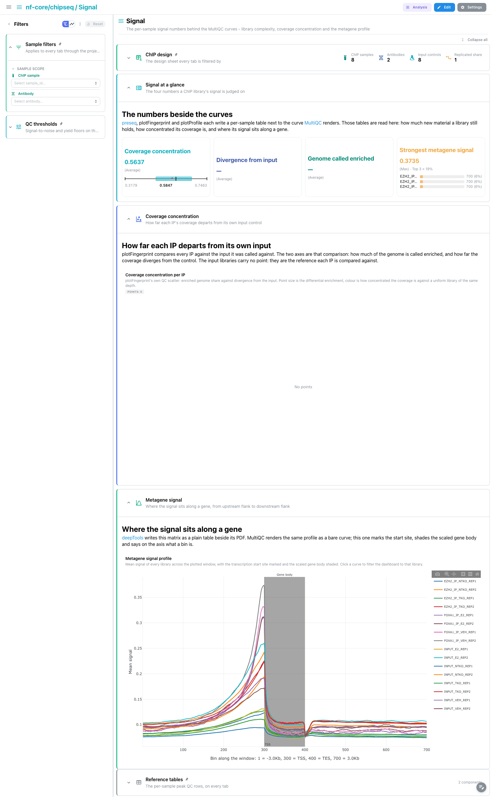

<div class="template-banner">
  <a class="template-banner-logo" href="https://nf-co.re/chipseq" target="_blank" title="nf-core/chipseq on nf-co.re">
    
    
  </a>
  <div class="template-banner-body">
    <h1 class="template-title">ChIP-seq</h1>
    <p class="template-subtitle">MACS3 peaks, HOMER peak annotation, one consensus peak set per antibody and the DESeq2 sample QC on top of it, next to the pipeline's own MultiQC report.</p>
    <p class="template-links">
      <a href="https://nf-co.re/chipseq" target="_blank"><i class="mdi mdi-open-in-new"></i> nf-co.re</a>
      <a href="https://github.com/nf-core/chipseq" target="_blank"><i class="mdi mdi-github"></i> GitHub</a>
    </p>
  </div>
  <span class="template-status-draft template-banner-badge" data-tooltip="Draft: generated and not yet reviewed. Expect it to need fixes before it is usable."><i class="mdi mdi-pencil-outline"></i> Draft</span>
</div>

<div class="tpl-version-pick" data-latest="2.1.0">
  <span class="tpl-version-icon"><i class="mdi mdi-source-branch"></i></span>
  <span class="tpl-version-label">Template version</span>
  <select id="tpl-version" class="tpl-version-select" aria-label="Template version">
    <option value="2.1.0" selected>2.1.0</option>
  </select>
  <span class="tpl-version-badge">latest</span>
</div>

The chipseq template follows a standard nf-core/chipseq run from reads to a
consensus peak set, one tab per step:

- :material-chart-box-outline: **MultiQC**: FastQC and trimming, alignment and duplication, and the enrichment panels that say whether a ChIP worked
- :material-waves: **Signal**: the per-sample tables behind those curves, read from preseq and deepTools rather than from the report
- :material-chart-scatter-plot: **Peaks**: MACS3 peaks per sample, their significance along the genome, and where they land relative to genes
- :material-set-merge: **Consensus**: one merged peak set per antibody, which samples agree on an interval, and how the samples group on the counts over it

A `ChIP design` section is pinned to the top of every tab and `Reference tables`
to the bottom, so the design sheet and the per-sample peak QC rows follow you
from tab to tab.

!!! warning "One MultiQC parquet per run, in one of two places"
    The 2.1.0 release pins MultiQC 1.23, which writes no parquet, and Depictio
    reads only `multiqc.parquet` (MultiQC 1.31 and later). The template therefore
    accepts it in two places, and a tree must hold exactly one:
    `multiqc/<narrow_peak|broad_peak>/multiqc_data/multiqc.parquet`, written by the
    run itself when a parquet-era MultiQC is swapped in, and
    `multiqc/multiqc_data/multiqc.parquet`, written by the reprocess step over a
    1.23 run:

    ```bash
    python -m depictio.dev_scripts.multiqc_reprocess --src <outdir> --dest <outdir>
    ```

    The tiles are bound to the report the pipeline writes with its own
    `multiqc_config`, which files a tool under several module ids
    (`samtools-1` for the merged unfiltered libraries, `mlib_deeptools` for the
    fingerprint). A reprocessed report merges each tool under one id, so on it
    the percent mapped and fingerprint tiles stay empty.

!!! info "Narrow or broad, both read"
    `recipes/peaks.py` reads whichever of `*_peaks.narrowPeak` and
    `*_peaks.broadPeak` the run wrote, with the matching catalog reader. A broad
    region has no summit, so its centre stands in for one and every tile bound to
    `summit` keeps working. No glob names an aligner either, so bwa, bowtie2,
    chromap and STAR runs land in the same collections.

!!! note "No DESeq2 differential binding"
    nf-core/chipseq 2.0.0 removed the differential binding analysis, so this
    template has no Differential binding tab. What the pipeline still runs is a
    DESeq2 sample QC on the consensus counts, and it closes the Consensus tab.

---

## :material-rocket-launch-outline: Quick start

=== "Point at a finished run"

    ```bash
    depictio run \
      --template nf-core/chipseq/latest \
      --data-root /path/to/chipseq_results
    ```

    `--data-root` is the only thing you have to pass. The hub of the dashboard is
    the samplesheet the run validated, `pipeline_info/samplesheet.valid.csv`,
    which a template-local recipe collapses into one row per ChIP sample with its
    input control and its antibody.

=== "From the pipeline itself (v1.10.0+)"

    ```bash
    depictio-cli config nextflow --install     # once per machine
    nextflow run nf-core/chipseq -profile docker --outdir results
    ```

    No `depictio run`, and no template named: the pipeline ingests its own
    output directory when it finishes and resolves this template from its own
    manifest. See [Nextflow trigger](../../depictio-cli/nextflow-trigger.md).

---

## :material-book-open-variant: Reference

The template reads the validated samplesheet, the MultiQC report, the MACS3 peak
calls and their HOMER annotation, the per-antibody consensus matrices and the
DESeq2 QC tables. 40 of its 82 tiles carry a `use:` catalog reference, so a tile
says where its panel comes from.

!!! info "Self-adapting layout"
    The dashboard adapts to whatever the run actually produced: components bound
    to pruned or unparsed data collections are hidden, tabs left with no real
    visualizations are dropped entirely, and the remaining components are
    re-packed so there are no empty rows.

<div class="tpl-version-block" data-version="2.1.0" markdown>

--8<-- "pipeline-templates/nf-core/_generated/chipseq-latest.md"

</div>

---

## :material-view-dashboard-outline: Dashboard tabs

Four tabs, read as a funnel: are the libraries good and is each ChIP enriched
over its input, what do the tool tables say about that signal, what did MACS3
call in each sample, and which of those calls the replicates agree on. Each tab
below carries the **same icon and colour the dashboard gives it**. The
screenshots come from a `test_full` run: EZH2 and FOXA1 ChIP against matched
inputs, two replicates per condition.

=== "{ width=18 }{ width=18 } MultiQC"

    *Are the libraries good, and is each ChIP enriched over its own input?*

    [{ loading=lazy }](../../images/pipeline-templates/nf-core/chipseq/multiqc_light.png){ .tpl-shot target="_blank" rel="noopener" }

    The tab is the MultiQC report as the run published it: FastQC and cutadapt
    cover the reads, samtools and Picard the merged libraries, and featureCounts
    how many reads fall inside the consensus peaks. `ChIP
    enrichment` is the tab's point: the deepTools fingerprint separates an
    enriched ChIP from a flat input, next to the FRiP scores and the strand
    cross-correlation with its NSC and RSC coefficients. Every tile here reads the
    report; the panels that read a tool's own tables are on the Signal tab.

    ??? abstract ":material-tune-variant: Filters and components"

        **Filters** · `ChIP sample` and `Antibody` on `design`, persistent and
        pinned to the top of every tab, plus `FRiP score` and `Peaks called`
        ranges in a collapsed *QC thresholds* group.

        | Section | What it holds |
        |---|---|
        | ChIP design | 4 cards, *ChIP design* |
        | Run summary | *General statistics* |
        | Read quality | 3 MultiQC panels |
        | Alignment and library complexity | 3 MultiQC panels |
        | ChIP enrichment | 5 MultiQC panels |
        | Reference tables | *Peak QC summary* |

    !!! warning "The General statistics tile has no data on a 2.1.0 report"
        The reports published by the 2.1.0 runs carry no `general_stats_table`:
        MultiQC assembles that table from the modules that ran, and this
        pipeline's `multiqc_config` leaves it out. The tile of `Run summary`
        therefore fails at render time, which is why the section is collapsed in
        the screenshot above. Binding it is a template issue, not a broken run.

=== ":material-waves:{ .mc-cyan } Signal"

    *The per-sample numbers behind the MultiQC curves.*

    [{ loading=lazy }](../../images/pipeline-templates/nf-core/chipseq/signal_light.png){ .tpl-shot target="_blank" rel="noopener" }

    preseq, plotFingerprint and plotProfile each write a table beside the curve
    MultiQC renders, and this tab reads those tables. The fingerprint scatter puts
    the share of the genome called enriched against the Jensen-Shannon distance to
    the input, so only the IP libraries carry a point. The metagene profile draws
    the `plotProfile` matrix as one curve per library, with the TSS marked and the
    gene body shaded.

    ??? abstract ":material-tune-variant: Filters and components"

        **Filters** · the persistent `Sample filters` group only.

        | Section | What it holds |
        |---|---|
        | Signal at a glance | 4 cards |
        | Library complexity | *Library complexity with its confidence ribbon* |
        | Coverage concentration | *Coverage concentration per IP* |
        | Metagene signal | *Metagene signal profile* |

    !!! tip "The complexity section is often empty"
        A default 2.x run skips preseq, so its collections are optional: the
        project ingests without them and the section disappears. Pass
        `--skip_preseq false` to get the curve.

=== ":material-chart-scatter-plot:{ .mc-indigo } Peaks"

    *What MACS3 called in each sample, and where those calls sit.*

    [{ loading=lazy }](../../images/pipeline-templates/nf-core/chipseq/peaks_light.png){ .tpl-shot target="_blank" rel="noopener" }

    Every peak sits at its summit with `-log10(q)` as height, coloured by sample.
    That panel is the tab's selection source: lasso a region and the peak ids travel
    to both tables and, through the project links, to the HOMER annotation. The width
    histogram separates a sharp transcription-factor profile from a broad histone
    mark. Below, HOMER splits the same peaks by feature class, and a `profile` draws
    the distance to the nearest TSS as one curve per sample, as a share of that
    sample's peaks so libraries of different depth stay comparable.

    ??? abstract ":material-tune-variant: Filters and components"

        **Filters** · `-log10 q-value`, `Fold enrichment` and `Peak width` ranges
        on the peak calls, plus `Feature class` and a `Distance to TSS` range on
        `homer_annotated_peaks` in a collapsed *Annotation scope* group.

        | Section | What it holds |
        |---|---|
        | Peak yield | 4 cards |
        | Significance along the genome | *Peak significance along the genome*, *Enrichment against significance*, *Peak width distribution* |
        | Where the peaks land | 4 cards, *Peak annotation per sample*, *Distance to the nearest TSS*, *Peak distribution around the nearest TSS* |
        | Peak tables | *Annotated peaks*, *MACS3 peak calls* |

=== ":material-set-merge:{ .mc-cyan } Consensus"

    *Which intervals the replicates agree on, one peak set per antibody.*

    [{ loading=lazy }](../../images/pipeline-templates/nf-core/chipseq/consensus_light.png){ .tpl-shot target="_blank" rel="noopener" }

    The UpSet panel reads the per-sample presence columns of the boolean matrix:
    each bar is a combination of samples calling exactly the same intervals. Pick a
    single antibody first, because the combinations of one consensus set never meet
    those of the other. The heatmap plots log1p fold enrichment for the 250 most
    strongly bound intervals of each set; a cell is zero where that sample called no
    peak, so condition-specific binding reads as a block. `Sample similarity` closes
    the tab with the pipeline's DESeq2 QC, one PCA and one distance matrix per
    antibody: lasso samples on the PCA to filter the linked panels.

    ??? abstract ":material-tune-variant: Filters and components"

        **Filters** · `Consensus set` and a `Samples per interval` range, both on
        `macs2_consensus_boolean`.

        | Section | What it holds |
        |---|---|
        | Consensus at a glance | 4 cards |
        | Replicate agreement | *Consensus peak overlap* |
        | Signal at the strongest intervals | *Consensus signal heatmap* |
        | Sample similarity | *DESeq2 sample PCA*, *Sample-to-sample distance* |
        | Consensus tables | *Consensus intervals*, *Consensus fold enrichment* |

    !!! tip "Pick one antibody before reading the last two sections"
        Both the DESeq2 QC and the consensus set are computed per antibody, so the
        PCA, the distance matrix and the UpSet combinations only mean something
        once a single `Consensus set` is selected. `--skip_deseq2_qc` writes
        neither collection, and the section then disappears.

---

## :material-play-circle-outline: Running the pipeline

Depictio reads the **output** of nf-core/chipseq, it does not run the pipeline.
Run the pipeline first:

```bash
nextflow run nf-core/chipseq -r 2.1.0 \
  --input samplesheet.csv \
  --genome GRCh37 \
  --narrow_peak -profile docker
```

Then point Depictio at the results, regenerating the MultiQC report first if the
run kept the release's MultiQC 1.23:

```bash
python -m depictio.dev_scripts.multiqc_reprocess --src results/ --dest results/
depictio run --template nf-core/chipseq/latest --data-root results/
```

See [nf-co.re/chipseq/usage](https://nf-co.re/chipseq/2.1.0/docs/usage) for full pipeline documentation.

---

## :material-folder-open-outline: Required data structure

Point `--data-root` at the directory holding the pipeline output. Depictio scans
recursively and matches on file name, so the aligner directory and the peak-type
directory can differ from the tree below.

```text
<DATA_ROOT>/
├── pipeline_info/
│   ├── samplesheet.valid.csv                      # the hub: one row per library
│   └── nf_core_chipseq_software_mqc_versions.yml
├── multiqc/narrow_peak/multiqc_data/
│   └── multiqc.parquet                            # or multiqc/multiqc_data/ after a reprocess
├── fastqc/zips/*_fastqc.zip                       # raw MultiQC inputs
├── trimgalore/{fastqc/zips,logs}/
└── bwa/merged_library/
    ├── samtools_stats/*.sorted.bam.{stats,flagstat,idxstats}
    ├── picard_metrics/*.{MarkDuplicates.metrics.txt,CollectMultipleMetrics.*}
    ├── phantompeakqualtools/*.spp.out
    ├── deepTools/
    │   ├── plotFingerprint/*.plotFingerprint.{qcmetrics,raw}.txt
    │   └── plotProfile/*.plotProfile.tab
    └── macs3/narrow_peak/
        ├── *_peaks.narrowPeak                     # or *_peaks.broadPeak
        ├── *_peaks.annotatePeaks.txt              # HOMER annotation
        ├── qc/*.summary.txt                       # per-sample peak QC
        └── consensus/<antibody>/
            ├── *.consensus_peaks.boolean.txt      # per-antibody consensus set
            └── deseq2/*.consensus_peaks.{pca.vals,sample.dists}.txt
```

---

## :material-flask-outline: Validation runs

No AWS megatest is pinned for 2.1.0: every 2.x prefix in the bucket is a
truncated sync. The template was validated on EMBL HPC runs of the release
instead, the `test` profile under each of the four aligners, and the screenshots
above come from a `test_full` run on hg19. `megatest.yaml` lists the tables-only
subset of a run the template needs, so a usable S3 run can be pinned later
without rewriting it:

```bash
bash depictio/projects/nf-core/chipseq/2.1.0/download_test_data.sh /tmp/chipseq_test
```

Do not pass `--project-name` when ingesting: the dashboard is attached to the
project by name, so renaming it breaks a later `depictio dashboard import`.
Re-ingesting accumulates dashboards, so delete the project before repeating a run.

---

## :material-link-variant: Additional resources

- [nf-co.re/chipseq](https://nf-co.re/chipseq): official pipeline documentation
- [nf-co.re/chipseq/2.1.0/results](https://nf-co.re/chipseq/2.1.0/results): AWS test results
- [Template System Reference](../../usage/projects/templates.md): YAML format, variables, conditionals
- [Recipes](../../usage/projects/recipes.md): how to read, test, and write recipes

---

## :material-account-group-outline: Authorship

<div class="tpl-credits">
  <div class="tpl-credit">
    <span class="tpl-credit-role"><i class="mdi mdi-code-braces"></i> Developers</span>
    <span class="tpl-credit-note">Wrote the template, its recipes and its dashboards.</span>
    <a class="tpl-person" href="https://github.com/weber8thomas" target="_blank" rel="noopener">
       weber8thomas
    </a>
  </div>
  <div class="tpl-credit">
    <span class="tpl-credit-role"><i class="mdi mdi-eye-check-outline"></i> Reviewers</span>
    <span class="tpl-credit-note">Nobody has run it on their own data and signed it off yet, which is what keeps it a Draft.</span>
    <span class="tpl-person"><i class="mdi mdi-account-plus-outline"></i> Open</span>
  </div>
  <div class="tpl-credit">
    <span class="tpl-credit-role"><i class="mdi mdi-wrench-outline"></i> Maintainers</span>
    <span class="tpl-credit-note">Keep it working as nf-core/chipseq releases.</span>
    <a class="tpl-person" href="https://github.com/weber8thomas" target="_blank" rel="noopener">
       weber8thomas
    </a>
  </div>
</div>

Reviewing a template on your own data, or taking over a role here, is a
contribution in itself: the [contributing guide](../../developer/contributing-templates.md)
says what each one involves.
