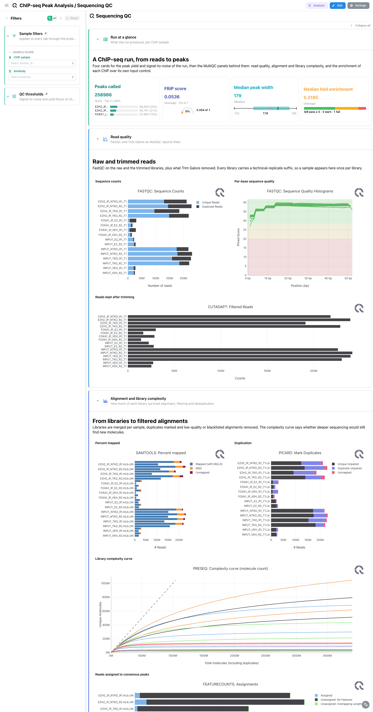
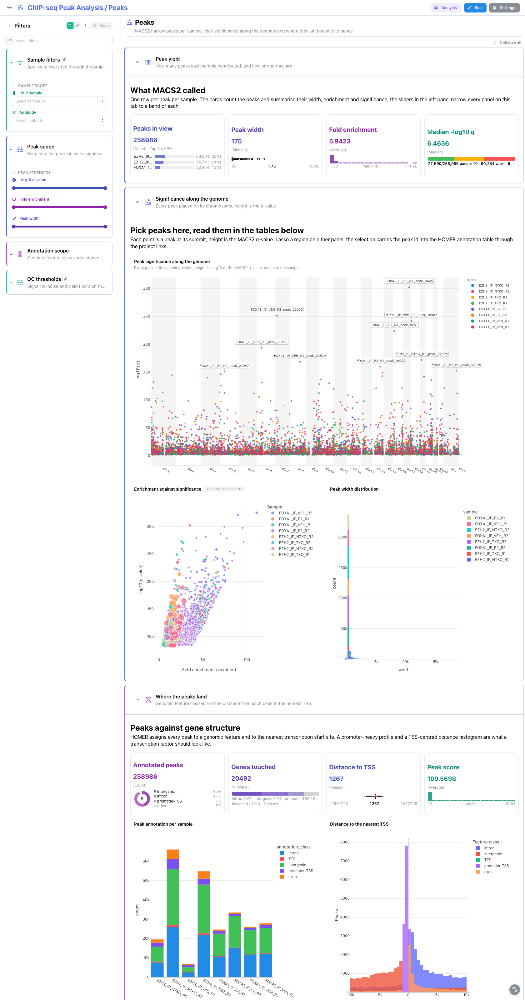
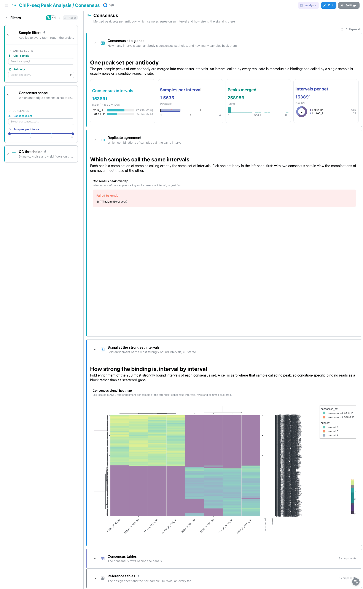

<div class="template-banner">
  <a class="template-banner-logo" href="https://nf-co.re/chipseq" target="_blank" title="nf-core/chipseq on nf-co.re">
    
    
  </a>
  <div class="template-banner-body">
    <h1 class="template-title">ChIP-seq</h1>
    <p class="template-subtitle">MACS2 narrow peaks, HOMER peak annotation, one consensus peak set per antibody and DESeq2 differential binding, on top of a reprocessed MultiQC report.</p>
    <p class="template-links">
      <a href="https://nf-co.re/chipseq" target="_blank"><i class="mdi mdi-open-in-new"></i> nf-co.re</a>
      <a href="https://github.com/nf-core/chipseq" target="_blank"><i class="mdi mdi-github"></i> GitHub</a>
    </p>
  </div>
  <span class="template-status-experimental template-banner-badge" data-tooltip="Experimental — shared as-is. Feedback and PRs welcome."><i class="mdi mdi-flask-outline"></i> Experimental</span>
</div>

<div class="tpl-version-pick" data-latest="1.2.0">
  <span class="tpl-version-icon"><i class="mdi mdi-source-branch"></i></span>
  <span class="tpl-version-label">Template version</span>
  <select id="tpl-version" class="tpl-version-select" aria-label="Template version">
    <option value="1.2.0" selected>1.2.0</option>
  </select>
  <span class="tpl-version-badge">latest</span>
</div>

The chipseq template follows a standard nf-core/chipseq run from reads to
differential binding, one tab per step:

- :material-chart-box-outline: **MultiQC**: FastQC and trimming, alignment and duplication, library complexity, and the enrichment panels that say whether a ChIP worked
- :material-chart-scatter-plot: **Peaks**: MACS2 narrow peaks per sample, their significance along the genome, and where they land relative to genes
- :material-set-merge: **Consensus**: one merged peak set per antibody, which samples agree on an interval, and how strong the signal is there
- :material-scale-balance: **Differential binding**: DESeq2 over the consensus counts, with volcano, MA, QQ and the strongest calls
- :material-table: **Reference tables**: the design sheet and the per-sample peak QC rows, pinned to the bottom of every tab

!!! warning "The MultiQC report has to be regenerated first"
    chipseq 1.2.0 shipped MultiQC 1.9, which predates the parquet format entirely,
    and Depictio reads only `multiqc.parquet`. Without the reprocess step the QC tab
    has no data at all. Run it once over the results directory before ingesting:

    ```bash
    python -m depictio.dev_scripts.multiqc_reprocess --src <results> --dest <results>
    ```

    It re-parses the run's own raw tool outputs with the pinned MultiQC 1.35 and
    writes `multiqc/multiqc_data/multiqc.parquet` next to a `REPROCESSED.json`
    recording both versions. `--dry-run` shows what would be staged. Do not run
    it twice over the same directory: the second pass reads 1.35 back off the
    parquet it just wrote and records that as the source version.

!!! info "The narrowPeak route only"
    This template covers `--narrow_peak`, the pipeline default and the right setting
    for a transcription factor. A `--broad_peak` run writes the same tree under
    `macs/broadPeak/` with BED6+3 files that carry no summit column, so it needs its
    own peak output and is not bound here.

!!! note "Why 1.2.0 and not a 2.x release"
    Every 2.x megatest prefix on AWS is a truncated sync rather than a complete run,
    so 1.2.0 is the newest usable release. It is a DSL1 release: there is no
    `params.json`, so nothing is auto-detected from the run's parameters, and the
    software versions are a tab-separated CSV.

---

## :material-rocket-launch-outline: Quick start

=== "Point at a finished run"

    ```bash
    depictio run \
      --template nf-core/chipseq/latest \
      --data-root /path/to/chipseq_results
    ```

    `--data-root` is the only thing you have to pass: the design sheets are pipeline
    outputs, picked up from `pipeline_info/`. The reprocess above must already have run.

=== "From the pipeline itself (v1.10.0+)"

    ```bash
    depictio-cli config nextflow --install     # once per machine
    nextflow run nf-core/chipseq -profile docker --outdir results
    ```

    No `depictio run`, and no template named: the pipeline ingests its own
    output directory when it finishes and resolves this template from its own
    manifest. See [Nextflow trigger](../../depictio-cli/nextflow-trigger.md).

---

## :material-book-open-variant: Reference

The template reads the derived design sheet, the reprocessed MultiQC report, the
MACS2 peak calls and their HOMER annotation, the per-antibody consensus matrices and
the DESeq2 differential-binding tables. No scan or recipe glob spells out the
`bwa/mergedLibrary/macs/narrowPeak/` prefix, so a run aligned with bowtie2 or STAR
binds into the same collections.

!!! info "Self-adapting layout"
    The dashboard adapts to whatever the run actually produced: components bound
    to pruned or unparsed data collections are hidden, tabs left with no real
    visualizations are dropped entirely, and the remaining components are
    re-packed so there are no empty rows.

<div class="tpl-version-block" data-version="1.2.0" markdown>

--8<-- "pipeline-templates/nf-core/_generated/chipseq-latest.md"

</div>

---

## :material-view-dashboard-outline: Dashboard tabs

Four tabs, read as a funnel: are the libraries and the enrichment good, what did
MACS2 call in each sample, which of those calls the replicates agree on, and
which of the agreed intervals change between conditions. Each tab below carries
the **same icon and colour the dashboard gives it**. The `Sample filters` group
is persistent and pinned to the top of every tab, `Reference tables` to the
bottom.

=== "{ width=18 }{ width=18 } MultiQC"

    *Are the libraries good, and is each ChIP enriched over its own input?*

    [{ loading=lazy }](../../images/pipeline-templates/nf-core/chipseq/multiqc_light.png){ .tpl-shot target="_blank" rel="noopener" }

    A four-card strip on the per-sample peak QC summary, then the report itself:
    FastQC and cutadapt, samtools and Picard, and the deepTools fingerprint that
    separates an enriched ChIP from a flat input. Three further panels read tool
    tables the report has no plot for: the preseq curve as a `profile` with the 95%
    confidence ribbon MultiQC drops, the deepTools metagene matrix as a second
    `profile`, and the fingerprint metrics as a `scatter_xy` of coverage
    concentration against divergence from a uniform library.

    ??? abstract ":material-tune-variant: Filters and components"

        **Filters** · `ChIP sample` and `Antibody` on `design`, persistent and
        pinned to the top of every tab, plus `FRiP score` and `Peaks called`
        ranges in a collapsed *QC thresholds* group pinned to the bottom.

        | Section | What it holds |
        |---|---|
        | Run at a glance | 4 cards |
        | Read quality | 3 MultiQC panels |
        | Alignment and library complexity | 4 MultiQC panels, *Library complexity with its confidence ribbon* |
        | ChIP enrichment | 6 MultiQC panels, *Coverage concentration per library*, *Metagene signal profile* |
        | Reference tables | *ChIP design*, *Peak QC summary* |

=== ":material-chart-scatter-plot:{ .mc-indigo } Peaks"

    *What MACS2 called in each sample, and where those calls sit.*

    [{ loading=lazy }](../../images/pipeline-templates/nf-core/chipseq/peaks_light.png){ .tpl-shot target="_blank" rel="noopener" }

    Every peak sits at its summit with `-log10(q)` as height, coloured by sample.
    That panel is the tab's selection source: lasso a region and the peak ids travel
    to both tables and, through the project links, to the HOMER annotation. The width
    histogram separates a sharp transcription-factor profile from a broad histone
    mark. Below, HOMER splits the same peaks by feature class, and a `profile` draws
    the distance to the nearest TSS as one curve per sample, as a share of that
    sample's peaks so libraries of different depth stay comparable.

    ??? abstract ":material-tune-variant: Filters and components"

        **Filters** · `-log10 q-value`, `Fold enrichment` and `Peak width` ranges
        on `macs2_peaks`, plus `Feature class` and a `Distance to TSS` range on
        `homer_annotated_peaks` in a collapsed *Annotation scope* group.

        | Section | What it holds |
        |---|---|
        | Peak yield | 4 cards |
        | Significance along the genome | *Peak significance along the genome*, *Enrichment against significance*, *Peak width distribution* |
        | Where the peaks land | 4 cards, *Peak annotation per sample*, *Distance to the nearest TSS*, *Peak distribution around the nearest TSS* |
        | Peak tables | *Annotated peaks*, *MACS2 peak calls* |

=== ":material-set-merge:{ .mc-cyan } Consensus"

    *Which intervals the replicates agree on, one peak set per antibody.*

    [{ loading=lazy }](../../images/pipeline-templates/nf-core/chipseq/consensus_light.png){ .tpl-shot target="_blank" rel="noopener" }

    The UpSet panel reads the per-sample presence columns of the boolean matrix:
    each bar is a combination of samples calling exactly the same intervals. Pick a
    single antibody first, because the combinations of one consensus set never meet
    those of the other. The heatmap plots log1p fold enrichment for the 250 most
    strongly bound intervals of each set; a cell is zero where that sample called no
    peak, so condition-specific binding reads as a block.

    ??? abstract ":material-tune-variant: Filters and components"

        **Filters** · `Consensus set` and a `Samples per interval` range, both on
        `macs2_consensus_boolean`.

        | Section | What it holds |
        |---|---|
        | Consensus at a glance | 4 cards |
        | Replicate agreement | *Consensus peak overlap* |
        | Signal at the strongest intervals | *Consensus signal heatmap* |
        | Consensus tables | *Consensus intervals*, *Consensus fold enrichment* |

=== ":material-scale-balance:{ .mc-grape } Differential binding"

    *Which consensus intervals change between conditions.*

    [{ loading=lazy }](../../images/pipeline-templates/nf-core/chipseq/differential_binding_light.png){ .tpl-shot target="_blank" rel="noopener" }

    DESeq2 over the consensus peak counts, in the reference run EZH2 NTKO against
    TKO and FOXA1 E2 against VEH. The volcano draws the padj 0.05 and two-fold
    lines; the MA plot puts effect size against mean normalised count, where the
    low-count intervals fan out on the left, so a real change separates from a loud
    one measured on almost no reads.

    ??? abstract ":material-tune-variant: Filters and components"

        **Filters** · `Contrast` (single choice) and `Direction` on
        `deseq2_results`, plus `log2 fold change` and `-log10 padj` ranges.

        | Section | What it holds |
        |---|---|
        | Differential binding at a glance | 4 cards |
        | Volcano and MA | *Volcano*, *MA plot* |
        | Calibration and direction | *QQ plot*, *Strongest differential intervals* |
        | Differential tables | *DESeq2 differential binding* |

!!! tip "Pick one contrast before reading this tab"
    DESeq2 names consensus intervals `Interval_1 ... Interval_N` and the numbering
    restarts in each consensus set, so `gene_id` identifies an interval only together
    with its contrast. That is why `Contrast` is a single-choice select, and why no
    link joins the DESeq2 rows back to the consensus collections.

---

## :material-play-circle-outline: Running the pipeline

Depictio reads the **output** of nf-core/chipseq, it does not run the pipeline.
Run the pipeline first:

```bash
nextflow run nf-core/chipseq -r 1.2.0 \
  --input design.csv \
  --genome GRCh37 \
  --narrow_peak -profile docker
```

Regenerate the MultiQC report, then point Depictio at the results:

```bash
python -m depictio.dev_scripts.multiqc_reprocess --src results/ --dest results/
depictio run --template nf-core/chipseq/latest --data-root results/
```

See [nf-co.re/chipseq/usage](https://nf-co.re/chipseq/1.2.0/docs/usage) for full pipeline documentation.

---

## :material-folder-open-outline: Required data structure

Point `--data-root` at the directory holding the pipeline output. Depictio scans
recursively and matches on file name, so the aligner directory can differ. Only the
narrowPeak tree is read; a `macs/broadPeak/` twin beside it is ignored.

```text
<DATA_ROOT>/
├── pipeline_info/
│   ├── design_controls.csv                        # the hub: ChIP, its input, its antibody
│   ├── design_reads.csv                           # library level, one row per FASTQ pair
│   └── software_versions.csv                      # tab separated (DSL1)
├── multiqc/
│   └── multiqc_data/
│       └── multiqc.parquet                        # written by the reprocess, not by the run
├── fastqc/zips/*_fastqc.zip                       # raw MultiQC inputs, re-parsed
├── trim_galore/{fastqc/zips,logs}/                # by the reprocess step
└── bwa/mergedLibrary/
    ├── samtools_stats/*.sorted.bam.{stats,flagstat,idxstats}
    ├── picard_metrics/*.MarkDuplicates.metrics.txt
    ├── preseq/*.ccurve.txt                        # complexity curve with its CI
    ├── phantompeakqualtools/*.spp.out
    ├── deepTools/
    │   ├── plotFingerprint/*.plotFingerprint.qcmetrics.txt
    │   └── plotProfile/*.plotProfile.tab
    └── macs/narrowPeak/
        ├── *_peaks.narrowPeak                     # MACS2 calls
        ├── *_peaks.annotatePeaks.txt              # HOMER annotation
        ├── qc/*.summary.txt                       # per-sample peak QC
        └── consensus/<antibody>/
            ├── *.consensus_peaks.boolean.txt      # per-antibody consensus set
            └── deseq2/<contrast>/*.deseq2.results.txt
```

---

## :material-flask-outline: Test data

The repository ships
[`download_test_data.sh`](https://github.com/depictio/depictio/blob/main/depictio/projects/nf-core/chipseq/1.2.0/download_test_data.sh),
which fetches the subset of the AWS megatest run the template needs (399 files, 213 MB, no credentials):

```bash
bash depictio/projects/nf-core/chipseq/1.2.0/download_test_data.sh /tmp/chipseq_test
```

The run is
`s3://nf-core-awsmegatests/chipseq/results-048fd6854fcc85b355c61dfc2e21da0bcc6399ea/`:
16 human libraries, EZH2 ChIP in NTKO and TKO cells and FOXA1 ChIP in E2 and VEH
treated cells, two replicates each, every ChIP against its own input control.

Regenerate the report, then run Depictio against it:

```bash
python -m depictio.dev_scripts.multiqc_reprocess --src /tmp/chipseq_test --dest /tmp/chipseq_test

depictio run --template nf-core/chipseq/latest --data-root /tmp/chipseq_test
```

`post_fetch_help` in `megatest.yaml` repeats both commands, with a `--dry-run`
variant of the reprocess.

---

## :material-link-variant: Additional resources

- [nf-co.re/chipseq](https://nf-co.re/chipseq): official pipeline documentation
- [nf-co.re/chipseq/1.2.0/results](https://nf-co.re/chipseq/1.2.0/results): AWS test results
- [Template System Reference](../../usage/projects/templates.md): YAML format, variables, conditionals
- [Recipes](../../usage/projects/recipes.md): how to read, test, and write recipes

---

## :material-account-group-outline: Authorship

<div class="tpl-credits">
  <div class="tpl-credit">
    <span class="tpl-credit-role"><i class="mdi mdi-code-braces"></i> Developers</span>
    <span class="tpl-credit-note">Wrote the template, its recipes and its dashboards.</span>
    <a class="tpl-person" href="https://github.com/weber8thomas" target="_blank" rel="noopener">
       weber8thomas
    </a>
  </div>
  <div class="tpl-credit">
    <span class="tpl-credit-role"><i class="mdi mdi-eye-check-outline"></i> Reviewers</span>
    <span class="tpl-credit-note">Nobody has run it on their own data and signed it off yet, which is what keeps it Experimental.</span>
    <span class="tpl-person"><i class="mdi mdi-account-plus-outline"></i> Open</span>
  </div>
  <div class="tpl-credit">
    <span class="tpl-credit-role"><i class="mdi mdi-wrench-outline"></i> Maintainers</span>
    <span class="tpl-credit-note">Keep it working as nf-core/chipseq releases.</span>
    <a class="tpl-person" href="https://github.com/weber8thomas" target="_blank" rel="noopener">
       weber8thomas
    </a>
  </div>
</div>

Reviewing a template on your own data, or taking over a role here, is a
contribution in itself: the [contributing guide](../../developer/contributing-templates.md)
says what each one involves.
