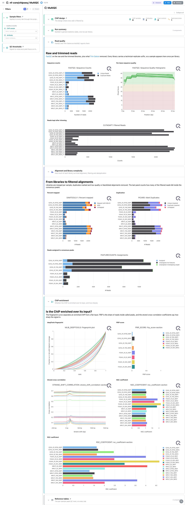
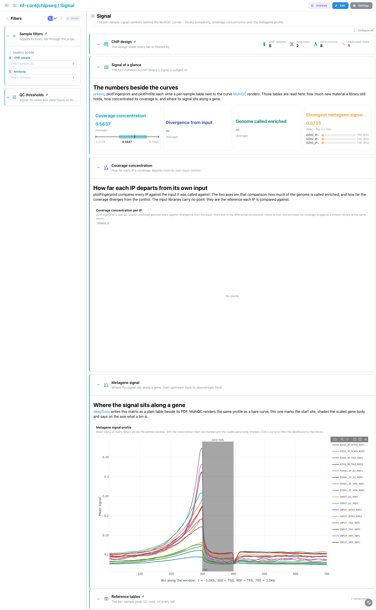
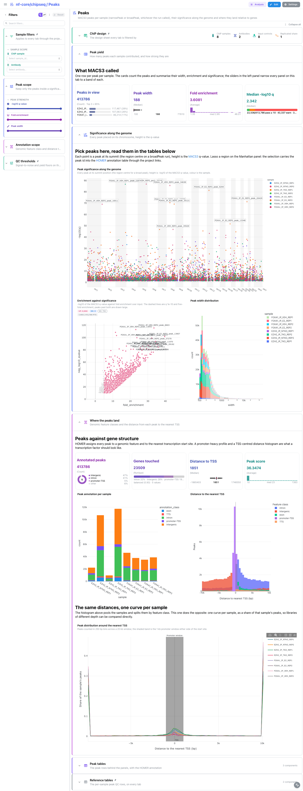
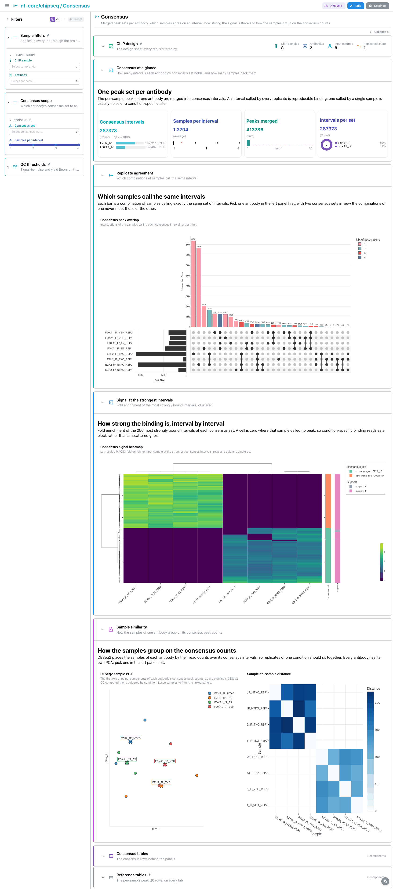

<div class="template-banner">
  <a class="template-banner-logo" href="https://nf-co.re/chipseq" target="_blank" title="nf-core/chipseq on nf-co.re">
    
    
  </a>
  <div class="template-banner-body">
    <h1 class="template-title">ChIP-seq</h1>
    <p class="template-subtitle">MACS3 peaks, HOMER peak annotation, one consensus peak set per antibody and the DESeq2 sample QC on top of it, next to the pipeline's own MultiQC report.</p>
    <p class="template-links">
      <a href="https://nf-co.re/chipseq" target="_blank"><i class="mdi mdi-open-in-new"></i> nf-co.re</a>
      <a href="https://github.com/nf-core/chipseq" target="_blank"><i class="mdi mdi-github"></i> GitHub</a>
    </p>
  </div>
  <span class="template-status-draft template-banner-badge" data-tooltip="Draft: generated and not yet reviewed. Expect it to need fixes before it is usable."><i class="mdi mdi-pencil-outline"></i> Draft</span>
</div>

<div class="tpl-version-pick" data-latest="2.1.0">
  <span class="tpl-version-icon"><i class="mdi mdi-source-branch"></i></span>
  <span class="tpl-version-label">Template version</span>
  <select id="tpl-version" class="tpl-version-select" aria-label="Template version">
    <option value="2.1.0" selected>2.1.0</option>
  </select>
  <span class="tpl-version-badge">latest</span>
</div>

The chipseq template follows a standard nf-core/chipseq run from reads to a
consensus peak set per antibody:

- :material-compass-outline: **Overview**: the run in four key figures, live findings and four figures, each linked to the tab that explains it
- :material-chart-box-outline: **Data & QC**: the MultiQC report, with the enrichment panels that say whether a ChIP worked, then the deepTools and Picard (or preseq) tables behind those curves
- :material-chart-scatter-plot: **Peak calls**: MACS3 peaks per library, where HOMER places them relative to genes, and one genomic region across libraries
- :material-set-merge: **Comparison**: one consensus peak set per antibody, which libraries agree on an interval, and where they sit on the DESeq2 QC of its counts

!!! warning "One MultiQC parquet per run, in one of two places"
    The 2.1.0 release pins MultiQC 1.23, which writes no parquet, and Depictio
    reads only `multiqc.parquet` (MultiQC 1.31 and later). The template therefore
    accepts it in two places, and a tree must hold exactly one:
    `multiqc/<narrow_peak|broad_peak>/multiqc_data/multiqc.parquet`, written by the
    run itself when a parquet-era MultiQC is swapped in, and
    `multiqc/multiqc_data/multiqc.parquet`, written by the reprocess step over a
    1.23 run:

    ```bash
    python -m depictio.dev_scripts.multiqc_reprocess --src <outdir> --dest <outdir>
    ```

    The tiles are bound to the report the pipeline writes with its own
    `multiqc_config`, which files a tool under several module ids
    (`samtools-1` for the merged unfiltered libraries, `mlib_deeptools` for the
    fingerprint). A reprocessed report merges each tool under one id: on it the
    import drops the percent-mapped tile, and the fingerprint is read from its
    twin tile on `deepTools`, which holds the same slot.

!!! info "Narrow or broad, both read"
    `recipes/peaks.py` reads whichever of `*_peaks.narrowPeak` and
    `*_peaks.broadPeak` the run wrote, with the matching catalog reader. A broad
    region has no summit, so its centre stands in for one and every tile bound to
    `summit` keeps working. No glob names an aligner either, so bwa, bowtie2,
    chromap and STAR runs land in the same collections.

!!! note "No DESeq2 differential binding"
    nf-core/chipseq 2.0.0 removed the differential binding analysis, so this
    template has no Differential binding tab. What the pipeline still runs is a
    DESeq2 sample QC on the consensus counts of each antibody, its PCA and its
    sample distances, and the Consensus tab reads both in its *Sample space*
    section.

---

## :material-rocket-launch-outline: Quick start

=== "Point at a finished run"

    ```bash
    depictio ingest /path/to/chipseq_results \
      --template nf-core/chipseq/latest
    ```

    The results directory is the only thing you have to pass. The hub of the dashboard is
    the samplesheet the run validated, `pipeline_info/samplesheet.valid.csv`,
    which a template-local recipe collapses into one row per merged library (the
    ChIPs and their input controls alike) with its antibody, replicate, role and
    condition. Three variables are optional: `--var METADATA_FILE=<table>` for a
    design table whose `GROUP_COL` becomes the condition (the sample group
    otherwise), `--var PRESEQ_RAN=true` for a run made with `--skip_preseq false`,
    and `--var GENOME=<assembly>` for a run on a UCSC assembly.

=== "From the pipeline itself (v1.10.0+)"

    ```bash
    depictio config nextflow --install     # once per machine
    nextflow run nf-core/chipseq -profile docker --outdir results
    ```

    No `depictio ingest`, and no template named: the pipeline ingests its own
    output directory when it finishes and resolves this template from its own
    manifest. See [Nextflow trigger](../../depictio-cli/nextflow-trigger.md).

---

## :material-book-open-variant: Reference

The template reads the validated samplesheet, the MultiQC report, the deepTools
fingerprint and profile tables, the Picard MarkDuplicates metrics, the MACS3 peak
calls and their HOMER annotation, the per-antibody consensus matrices and the
DESeq2 QC tables, plus an optional design table. 58 of its 106 components carry a
`use:` catalog reference, so a tile says where its panel comes from.

The CLI sets no variable from chipseq's `params.json`, so the route flag is passed
by hand: a run made with `--skip_preseq false` needs `--var PRESEQ_RAN=true`. The
preseq card and filter then take the slots the Picard duplication card and filter
hold on the Signal tab; without the variable both cards are kept and the strip
wraps to a second row. `GENOME` is empty by default, which lays the Locus axis out
from the contigs the calls carry and suits any reference, a custom FASTA
included.

!!! info "Self-adapting layout"
    The dashboard adapts to whatever the run actually produced: components bound
    to pruned or unparsed data collections are hidden, tabs left with no real
    visualizations are dropped entirely, and the remaining components are
    re-packed so there are no empty rows.

<div class="tpl-version-block" data-version="2.1.0" markdown>

--8<-- "pipeline-templates/nf-core/_generated/chipseq-latest.md"

</div>

---

## :material-view-dashboard-outline: Dashboard tabs

One dashboard: the **Overview**, then six child tabs in three groups, read as a
funnel from library quality to the regions the replicates agree on. Each tab below
carries the **same icon and colour the dashboard gives it**, so the page and the
app read alike.

| Group | Tabs |
|---|---|
| Data & QC | MultiQC, Signal |
| Peak calls | Peaks, Annotation, Locus |
| Comparison | Consensus |

Each child tab opens with a short intro and a strip of four cards, then at most
three open sections; tables and details follow, collapsed. The persistent *Sample
filters* (condition, antibody, library, replicate, role) sit in the left panel and
narrow every tab through the project links; *QC thresholds* (FRiP, peaks called)
sit collapsed under them. The *Sample sheet* and *Reference tables* (the per-ChIP
peak QC) are pinned, collapsed, to the bottom of every child tab. The hub column is
always called `condition`: the `GROUP_COL` column of the design table when one is
given, the sample name without its replicate suffix otherwise, so the dashboard
reads the same with or without the table. The consensus sets have no library
column: the antibody reaches them, through a prefix link on the set name.

=== ":material-compass-outline: Overview"

    *Protein-DNA binding, from library quality to the regions the replicates agree on.*

    <!-- screenshot pending v2 -->

    A short hero links the run parameters: 2.x writes a `params.json` and a
    software versions file, and the dialog lists both. *About this dashboard* says
    how the two filter levels work, *The run* lists the libraries and ChIPs, the
    antibodies and conditions, the aligner and read length and the peaks called
    with their type, and *Pipeline* walks the five steps from trimming to the
    consensus merge, each linked to its tool version or settings and its tab. The
    findings are live values: they follow the filters, and a route that lacks their
    data drops them. The PCA of the consensus counts takes the figure slot a
    volcano would hold: with no contrast to test, whether the libraries group by
    condition is the comparison 2.x still draws.

    ??? abstract ":material-tune-variant: Filters and components"

        **Filters** · the left panel starts collapsed. *Key figures* has its own
        filter bar (condition and library), and so does *Findings* (condition and
        antibody): each narrows its own section only.

        | Section | What it holds |
        |---|---|
        | Top | Hero, *About this dashboard*, *The run*, *Pipeline* |
        | Key figures | 4 headline cards: libraries, peaks called, consensus intervals, FRiP |
        | Findings | Live result rows, then 4 figures: the peak significance along the genome, the peaks around the nearest start site, the DESeq2 QC PCA of the consensus counts and the fingerprint scatter |
        | How to read this dashboard | The tabs by group, each with its question |

=== "{ width=18 }{ width=18 } MultiQC"

    **Data & QC** · *Did sequencing, alignment and filtering work for every library?*

    <!-- screenshot pending v2 -->

    [{ loading=lazy }](../../images/pipeline-templates/nf-core/chipseq/multiqc_light.png){ .tpl-shot target="_blank" rel="noopener" }

    MultiQC panels only. Open: general statistics, FastQC sequence counts beside
    samtools percent mapped on the unfiltered merged libraries, then the enrichment
    panels that say whether a ChIP worked: the deepTools fingerprint, the FRiP
    scores and the NSC and RSC strand coefficients. Per-base quality, Trim Galore
    kept reads, Picard duplicates, featureCounts assignments and the strand shift
    correlation curve are collapsed. A reprocessed report has no `samtools-1`, so
    that tile drops and FastQC takes the row.

    ??? abstract ":material-tune-variant: Filters and components"

        **Filters** · `Sequencing library` on `samplesheet`, in its own *Library
        scope* group: the read-level panels are keyed on the sequencing library,
        a finer grain than the merged library every other tab works in.

        | Section | What it holds |
        |---|---|
        | Run summary | 1 MultiQC panel |
        | Reads and alignment | 2 MultiQC panels |
        | Enrichment | 4 MultiQC panels (the fingerprint has one tile per report, on one slot) |
        | QC details (collapsed) | 5 MultiQC panels |

=== ":material-waves:{ .mc-cyan } Signal"

    **Data & QC** · *How enriched and how complex is each library?*

    <!-- screenshot pending v2 -->

    [{ loading=lazy }](../../images/pipeline-templates/nf-core/chipseq/signal_light.png){ .tpl-shot target="_blank" rel="noopener" }

    The tables deepTools writes beside the curves MultiQC draws. 2.x runs
    plotFingerprint without a JSD sample, so every fingerprint reading is against
    a uniform library rather than the input, and the inputs are rows of their own:
    the Role filter leaves them out. The coverage concentration, the distance from
    a uniform coverage, the genome left at background and, in one slot, the
    duplicate share Picard flags or, on a preseq run, the distinct fragments preseq
    expects. Then the fingerprint scatter, and the metagene profile with the start
    site marked and the gene body shaded, above the preseq complexity curves when
    the run kept preseq.

    ??? abstract ":material-tune-variant: Filters and components"

        **Filters** · a `Genome at background` range on
        `deeptools_fingerprint_metrics`, plus a `Duplicate share` range on
        `picard_markduplicates_metrics` or, on a preseq run, an `Extrapolated
        depth` range on `preseq_complexity_curve`.

        | Section | What it holds |
        |---|---|
        | Signal at a glance | 4 cards (the fourth is Picard's duplicate share or preseq's distinct fragments) |
        | Coverage concentration | 1 advanced visualization |
        | Metagene and complexity | 1 advanced visualization, plus the complexity curves on a preseq run |

    !!! tip "The complexity curve needs preseq"
        A default 2.x run skips preseq, so its collections are optional and the
        curves drop. A run made with `--skip_preseq false` keeps them; pass
        `--var PRESEQ_RAN=true` with it so the preseq card takes the Picard slot
        alone.

=== ":material-chart-scatter-plot:{ .mc-indigo } Peaks"

    **Peak calls** · *How many peaks did each library yield, and how strong?*

    <!-- screenshot pending v2 -->

    [{ loading=lazy }](../../images/pipeline-templates/nf-core/chipseq/peaks_light.png){ .tpl-shot target="_blank" rel="noopener" }

    MACS3 peaks, one row per peak and ChIP, each called against its input. The
    peaks in view, their width, their fold enrichment and the median `-log10(q)`.
    Then the significance along the genome, where a lasso narrows the tab and,
    through the peak links, the HOMER annotation, and the width distribution on a
    log axis, which separates a sharp factor from a broad mark. The two summit
    profiles close the tab: the other libraries' summits around each summit
    (replicates of a sharp factor pile up) beside the average footprint of a call.
    Neither is a read coverage, since the recipe aggregates the calls themselves; on
    a broadPeak run the summit is the centre of the region.

    ??? abstract ":material-tune-variant: Filters and components"

        **Filters** · `Peak significance`, `Fold enrichment` and `Peak width`
        ranges, and `Chromosome`, all on `macs2_peaks`.

        | Section | What it holds |
        |---|---|
        | Peaks at a glance | 4 cards |
        | Significance along the genome | 1 advanced visualization |
        | Peak width | 1 histogram |
        | Around the summits | 2 advanced visualizations |
        | Peak table (collapsed) | *MACS3 peaks* |

=== ":material-tag-outline:{ .mc-blue } Annotation"

    **Peak calls** · *Where do the peaks fall relative to genes?*

    <!-- screenshot pending v2 -->

    HOMER assigns every peak to a feature class and to the nearest start site. The
    annotated peaks by feature class, the genes reached, the distance to the
    nearest start site and the peak score. Then the feature classes per library as
    100% bars, and the peaks around the nearest start site with the promoter window
    shaded: a promoter-bound factor puts most of its peaks there, a distal one
    spreads them over introns and intergenic space. The collapsed HOMER table has a
    peak record card beside it, which waits for a picked row.

    ??? abstract ":material-tune-variant: Filters and components"

        **Filters** · `Feature class` and a `Distance to TSS` range on
        `homer_annotated_peaks`.

        | Section | What it holds |
        |---|---|
        | Annotation at a glance | 4 cards |
        | Feature classes | 1 histogram |
        | Distance to the nearest TSS | 1 advanced visualization |
        | Peak annotation (collapsed) | *HOMER peak annotation* + a peak record card |

=== ":material-map-search-outline:{ .mc-teal } Locus"

    **Peak calls** · *What do the libraries call at one genomic region?*

    <!-- screenshot pending v2 -->

    Three collections on one genome axis. The cards count what the region in view
    holds and follow it as the tracks do. The navigator draws the calls, one lane
    per library, and opens on the first contig the calls carry: type a locus in its
    header or brush its axis, and the consensus intervals (one lane per consensus
    set) and the HOMER annotation (coloured by feature class) follow. The HOMER
    track stands in for a gene lane, so the locus field takes coordinates, not gene
    symbols. With `GENOME` left empty the axis is laid out from the contigs of the
    calls; a UCSC assembly name uses its built-in axis.

    ??? abstract ":material-tune-variant: Filters and components"

        **Filters** · `Peak significance` on `macs2_peaks`, `Libraries per
        interval` on `macs2_consensus_boolean` and `Feature class` on
        `homer_annotated_peaks`.

        | Section | What it holds |
        |---|---|
        | Region at a glance | 4 cards |
        | Peaks on one axis | 3 advanced visualizations |

=== ":material-set-merge:{ .mc-violet } Consensus"

    **Comparison** · *Which peaks do the libraries agree on?*

    <!-- screenshot pending v2 -->

    [{ loading=lazy }](../../images/pipeline-templates/nf-core/chipseq/consensus_light.png){ .tpl-shot target="_blank" rel="noopener" }

    The per-ChIP calls merged into one set of intervals per antibody. The
    consensus intervals, the libraries per interval, the peaks merged and the
    support of the strongest intervals. Then the UpSet of the libraries calling each
    interval, and the sample space: the PCA the pipeline's DESeq2 QC computed on
    each antibody's consensus counts, coloured by condition, above the library
    distance heatmap. The fold-enrichment heatmap over the strongest intervals of
    each set sits folded below them.

    ??? abstract ":material-tune-variant: Filters and components"

        **Filters** · `Consensus set`, a `Libraries per interval` range and
        `Chromosome`, all on `macs2_consensus_boolean`.

        | Section | What it holds |
        |---|---|
        | Consensus at a glance | 4 cards |
        | Replicate agreement | 1 advanced visualization (UpSet) |
        | Sample space | 2 advanced visualizations |
        | Signal at the strongest intervals (collapsed) | 1 advanced visualization |
        | Consensus tables (collapsed) | *Consensus intervals*, *Consensus fold enrichment*, *Principal components*, *Library distance matrix* |

    !!! tip "Pick one consensus set first"
        chipseq writes one count matrix, and so one PCA and one distance matrix,
        per antibody, and the libraries of two sets never meet. The UpSet
        combinations, the PCA and the distance matrix only mean something once a
        single `Consensus set` is selected. `--skip_deseq2_qc` writes neither QC
        table: the *Sample space* section, its two tables and the Overview PCA then
        drop.

---

## :material-play-circle-outline: Running the pipeline

Depictio reads the **output** of nf-core/chipseq, it does not run the pipeline.
Run the pipeline first:

```bash
nextflow run nf-core/chipseq -r 2.1.0 \
  --input samplesheet.csv \
  --genome GRCh37 \
  --narrow_peak -profile docker
```

Then point Depictio at the results, regenerating the MultiQC report first if the
run kept the release's MultiQC 1.23:

```bash
python -m depictio.dev_scripts.multiqc_reprocess --src results/ --dest results/
depictio ingest results/ --template nf-core/chipseq/latest --var GENOME=hg19
```

`GENOME` is optional: without it the Locus axis is built from the contigs of the
calls. `GRCh37` is the iGenomes name of the UCSC `hg19` assembly.

See [nf-co.re/chipseq/usage](https://nf-co.re/chipseq/2.1.0/docs/usage) for full pipeline documentation.

---

## :material-folder-open-outline: Required data structure

Point `depictio ingest` at the directory holding the pipeline output. Depictio scans
recursively and matches on file name, so the aligner directory and the peak-type
directory can differ from the tree below.

```text
<DATA_ROOT>/
├── pipeline_info/
│   ├── samplesheet.valid.csv                      # the hub: one row per library
│   ├── params_<timestamp>.json                    # provenance
│   └── nf_core_chipseq_software_mqc_versions.yml
├── multiqc/narrow_peak/multiqc_data/
│   └── multiqc.parquet                            # or multiqc/multiqc_data/ after a reprocess
├── fastqc/zips/*_fastqc.zip                       # raw MultiQC inputs
├── trimgalore/{fastqc/zips,logs}/
└── bwa/merged_library/
    ├── samtools_stats/*.sorted.bam.{stats,flagstat,idxstats}
    ├── picard_metrics/*.{MarkDuplicates.metrics.txt,CollectMultipleMetrics.*}
    ├── phantompeakqualtools/*.spp.out
    ├── deepTools/
    │   ├── plotFingerprint/*.plotFingerprint.{qcmetrics,raw}.txt
    │   └── plotProfile/*.plotProfile.tab
    └── macs3/narrow_peak/
        ├── *_peaks.narrowPeak                     # or *_peaks.broadPeak
        ├── *_peaks.annotatePeaks.txt              # HOMER annotation
        ├── qc/*.summary.txt                       # per-sample peak QC
        └── consensus/<antibody>/
            ├── *.consensus_peaks.boolean.txt      # per-antibody consensus set
            └── deseq2/*.consensus_peaks.{pca.vals,sample.dists}.txt  # optional
```

---

## :material-flask-outline: Validation runs

No AWS megatest is pinned for 2.1.0: every 2.x prefix in the bucket is a
truncated sync. The template was validated on EMBL HPC runs of the release
instead (keys `chipseq2-*`): the `test` profile with `--narrow_peak` under each of
the four aligners (bwa, bowtie2, chromap and STAR), one antibody against its
inputs. The broadPeak route, several antibodies and the preseq route are not
covered by those runs: the broadPeak branch of `recipes/peaks.py` is covered by a
synthetic check only, and the preseq card, filter and curves by the offline
validation only. The megatest design (`test_full`) has not been run against this
layout. The screenshots above come from a `test_full` run of an earlier,
four-tab layout of the dashboard; the current layout has not been captured yet.

`megatest.yaml` lists the tables-only subset of a run the template needs, so a
usable S3 run can be pinned later without rewriting it. The wrapper below fetches
that subset, and has nothing complete to mirror until such a run exists:

```bash
bash depictio/projects/nf-core/chipseq/2.1.0/download_test_data.sh /tmp/chipseq_test
```

Do not pass `--project` when ingesting: the dashboard is attached to the
project by name, so renaming it breaks a later `depictio dashboard import`.
Re-ingesting accumulates dashboards, so delete the project before repeating a run.

---

## :material-link-variant: Additional resources

- [nf-co.re/chipseq](https://nf-co.re/chipseq): official pipeline documentation
- [nf-co.re/chipseq/2.1.0/results](https://nf-co.re/chipseq/2.1.0/results): AWS test results
- [Template System Reference](../../usage/projects/templates.md): YAML format, variables, conditionals
- [Recipes](../../usage/projects/recipes.md): how to read, test, and write recipes

---

## :material-account-group-outline: Authorship

<div class="tpl-credits">
  <div class="tpl-credit">
    <span class="tpl-credit-role"><i class="mdi mdi-code-braces"></i> Developers</span>
    <span class="tpl-credit-note">Wrote the template, its recipes and its dashboards.</span>
    <a class="tpl-person" href="https://github.com/weber8thomas" target="_blank" rel="noopener">
       weber8thomas
    </a>
  </div>
  <div class="tpl-credit">
    <span class="tpl-credit-role"><i class="mdi mdi-eye-check-outline"></i> Reviewers</span>
    <span class="tpl-credit-note">Nobody has run it on their own data and signed it off yet, which is what keeps it a Draft.</span>
    <span class="tpl-person"><i class="mdi mdi-account-plus-outline"></i> Open</span>
  </div>
  <div class="tpl-credit">
    <span class="tpl-credit-role"><i class="mdi mdi-wrench-outline"></i> Maintainers</span>
    <span class="tpl-credit-note">Keep it working as nf-core/chipseq releases.</span>
    <a class="tpl-person" href="https://github.com/weber8thomas" target="_blank" rel="noopener">
       weber8thomas
    </a>
  </div>
</div>

Reviewing a template on your own data, or taking over a role here, is a
contribution in itself: the [contributing guide](../../developer/contributing-templates.md)
says what each one involves.
