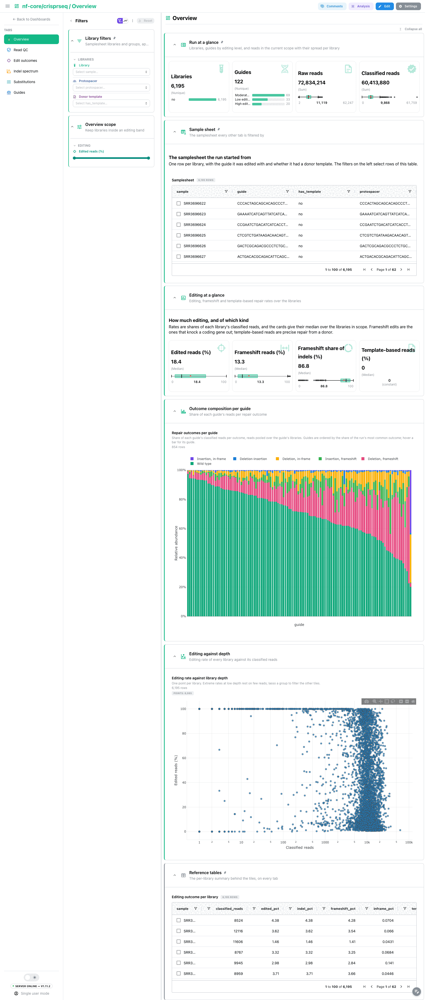
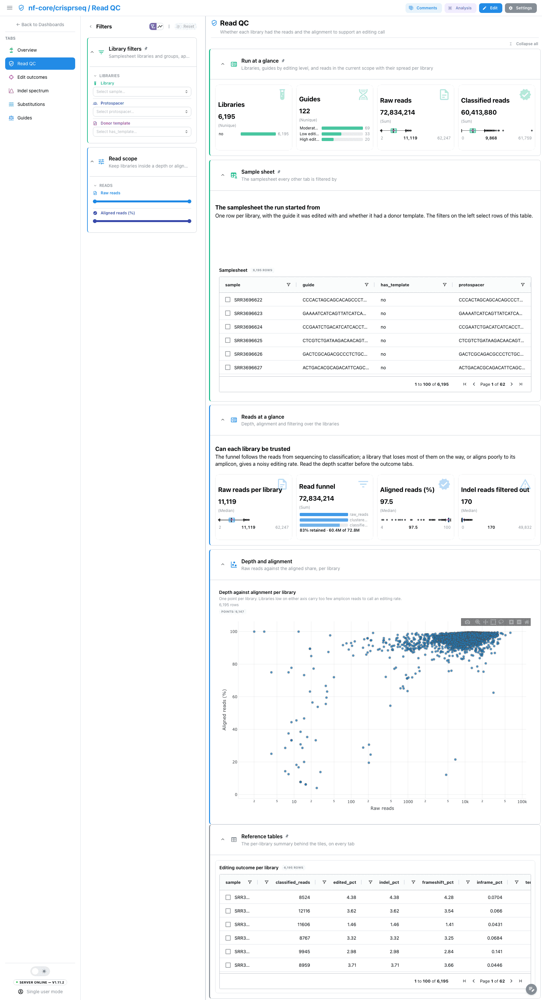
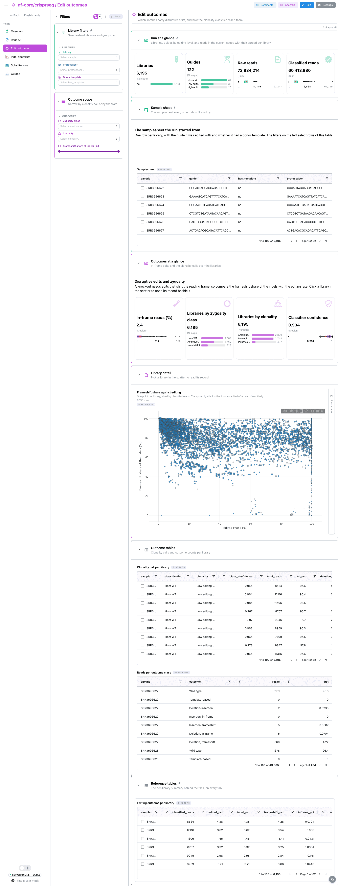
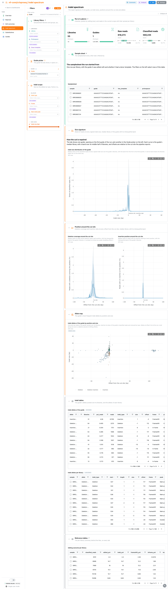
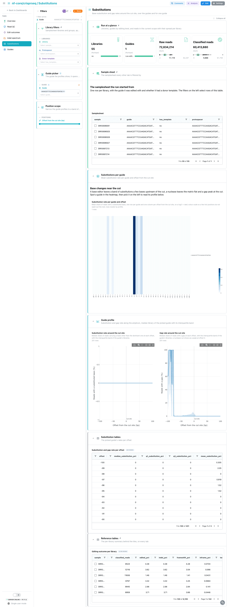
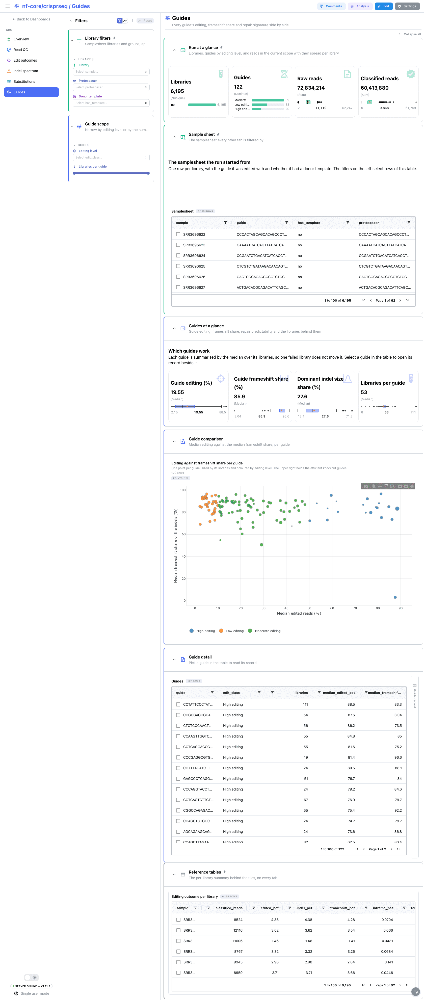

<div class="template-banner">
  <a class="template-banner-logo" href="https://nf-co.re/crisprseq" target="_blank" title="nf-core/crisprseq on nf-co.re">
    
    
  </a>
  <div class="template-banner-body">
    <h1 class="template-title">CRISPR gene editing</h1>
    <p class="template-subtitle">Targeted gene editing guide by guide: read accounting, repair outcomes per library and per guide, frameshift and template-based repair rates, the indel size and position signature around the cut site, substitution rates along the amplicon, and the clonality calls.</p>
    <p class="template-links">
      <a href="https://nf-co.re/crisprseq" target="_blank"><i class="mdi mdi-open-in-new"></i> nf-co.re</a>
      <a href="https://github.com/nf-core/crisprseq" target="_blank"><i class="mdi mdi-github"></i> GitHub</a>
    </p>
  </div>
  <span class="template-status-experimental template-banner-badge" data-tooltip="Experimental: shared as-is. Feedback and PRs welcome."><i class="mdi mdi-flask-outline"></i> Experimental</span>
</div>

<div class="tpl-version-pick" data-latest="2.3.0">
  <span class="tpl-version-icon"><i class="mdi mdi-source-branch"></i></span>
  <span class="tpl-version-label">Template version</span>
  <select id="tpl-version" class="tpl-version-select" aria-label="Template version">
    <option value="2.3.0" selected>2.3.0</option>
  </select>
  <span class="tpl-version-badge">latest</span>
</div>

The crisprseq template reads the targeted analysis of nf-core/crisprseq, where
every library is an amplicon sequenced around an edited locus, and answers per
library first and then per guide: did the guide edit, how was the cut repaired,
and would the edits knock the gene out:

- :material-view-dashboard-outline: **Overview**: editing and frameshift rates over the libraries, the repair outcome composition per guide, editing against depth
- :material-shield-check-outline: **Read QC**: whether each library had the reads and the alignment to support an editing call
- :material-target: **Edit outcomes**: disruptive edits against editing, and how the clonality classifier called each library
- :material-chart-bell-curve: **Indel spectrum**: the repair signature of one guide, as indel sizes, positions around the cut site and alleles
- :material-waves: **Substitutions**: base substitution and gap rates around the cut site, over the guides and for one guide
- :material-scale-balance: **Guides**: every guide's editing, frameshift share and repair predictability side by side

A `Run at a glance` strip (libraries, guides by editing level, raw and
classified reads), the collapsed `Sample sheet` and the `Library filters`
(library, the grouping column, donor template) are pinned to every tab, with the
collapsed per-library summary pinned to the bottom.

!!! info "Targeted analysis only"
    The screening analysis of crisprseq (`--analysis screening`: count tables,
    MAGeCK, BAGEL2) writes different outputs and is not covered by this
    template. No screening megatest has been published to build one on.

!!! note "Guide profiles are summaries over libraries"
    Profiles along the amplicon (indel sizes, deletion and insertion position,
    substitution and gap rates) are computed per library inside the recipes and
    published per guide as the median, or the mean where most libraries carry
    no signal, with the interquartile band of the guide's libraries. The
    dashboard ships one row per guide and offset rather than one per library
    and position, so a run with thousands of libraries stays responsive.

---

## :material-rocket-launch-outline: Quick start

=== "Point at a finished run"

    ```bash
    depictio run \
      --template nf-core/crisprseq/latest \
      --data-root /path/to/crisprseq_results \
      --var METADATA_FILE=/path/to/samplesheet.csv \
      --var GROUP_COL=protospacer
    ```

    The sample hub is the samplesheet the run was started with (`sample`,
    `fastq_1`, `fastq_2`, `reference`, `protospacer`, `template`). crisprseq
    does not publish it, so either copy it to `input/samplesheet.csv` under the
    data root, where it is read by default, or name it with `METADATA_FILE`.
    Pass `GROUP_COL` with it: the metadata auto-detection otherwise picks the
    first non-id column, `fastq_1`.

    | Variable | Default | Role |
    |---|---|---|
    | `METADATA_FILE` | `{DATA_ROOT}/input/samplesheet.csv` | The samplesheet the run was started with |
    | `METADATA_ID_COL` | `sample` | Samplesheet id column, fixed by the crisprseq input schema |
    | `GROUP_COL` | `protospacer` | Samplesheet column the dashboard groups and filters libraries by |
    | `SKIP_CLONALITY` | unset | Set for a run with `--skip_clonality`: drops the clonality collection |

=== "From the pipeline itself (v1.10.0+)"

    ```bash
    depictio-cli config nextflow --install     # once per machine
    nextflow run nf-core/crisprseq -r 2.3.0 -profile docker --outdir results
    ```

    No `depictio run`, and no template named: the pipeline ingests its own
    output directory when it finishes and resolves this template from its own
    manifest. The samplesheet copy above still applies. See
    [Nextflow trigger](../../depictio-cli/nextflow-trigger.md).

---

## :material-book-open-variant: Reference

The template reads the CIGAR parser tables the pipeline writes per library
under `cigar/` (read accounting, outcome counts, indel QC, per-read indels,
per-position nucleotide shares and the cut site) and the clonality classifier's
calls. Every per-library file is read by glob inside a recipe, with no raw
collection scanned, so a run with thousands of libraries still produces a
handful of tables. The per-read indel tables are the heavy input: the recipe
reads only the columns it needs and collapses reads to alleles. There is no
MultiQC report, so the dashboard opens on an Overview tab.

!!! info "Self-adapting layout"
    The dashboard adapts to whatever the run actually produced: components bound
    to pruned or unparsed data collections are hidden, tabs left with no real
    visualizations are dropped entirely, and the remaining components are
    re-packed so there are no empty rows. A run with `--skip_clonality` loses
    the clonality tiles of the Edit outcomes tab and keeps the rest.

<div class="tpl-version-block" data-version="2.3.0" markdown>

--8<-- "pipeline-templates/nf-core/_generated/crisprseq-latest.md"

</div>

---

## :material-view-dashboard-outline: Dashboard tabs

Six tabs, read as a funnel: how much editing there is, whether the libraries
support it, which outcomes it left, then the repair signature of one guide, its
substitutions, and every guide compared. Each tab below carries the **same icon
and colour the dashboard gives it**.

=== ":material-view-dashboard-outline:{ .mc-teal } Overview"

    *How often does each guide edit its amplicon, and which repair outcomes does it leave?*

    [{ loading=lazy }](../../images/pipeline-templates/nf-core/crisprseq/overview_light.png){ .tpl-shot target="_blank" rel="noopener" }

    Rates are shares of each library's classified reads, and the rate cards give
    their median over the libraries in scope, with the edited reads they rest
    on. Frameshift edits are the ones that knock a coding gene out. The repair
    outcome composition of every guide is drawn as stacked bars, reads pooled
    over the guide's libraries; template-based repair from a donor shows as its
    own class there rather than as a card, since it is zero on every run without
    a donor. The editing rate of every library against its classified reads
    closes the tab.

    ??? abstract ":material-tune-variant: Filters and components"

        **Filters** · `Library`, the grouping column and `Donor template` on the
        samplesheet, persistent and pinned to the top of every tab, and an
        `Edited reads (%)` range in the tab-local *Overview scope*.

        | Section | What it holds |
        |---|---|
        | Run at a glance | 4 cards, pinned to every tab |
        | Sample sheet | *Samplesheet*, collapsed and pinned to every tab |
        | Editing at a glance | 4 cards |
        | Outcome composition per guide | *Repair outcomes per guide* |
        | Editing against depth | *Editing rate against library depth* |
        | Reference tables | *Editing outcome per library*, collapsed and pinned to the bottom of every tab |

=== ":material-shield-check-outline:{ .mc-blue } Read QC"

    *Did each library have the reads and the alignment to support an editing call?*

    [{ loading=lazy }](../../images/pipeline-templates/nf-core/crisprseq/read_qc_light.png){ .tpl-shot target="_blank" rel="noopener" }

    Raw reads per library, the read funnel from sequencing through clustering to
    classification, the aligned share and the indel reads the filters dropped,
    then raw reads against the aligned share. A library that loses most of its
    reads on the way, or aligns poorly to its amplicon, gives an editing rate
    that rests on a handful of reads, so read this tab before the outcome tabs.

    ??? abstract ":material-tune-variant: Filters and components"

        **Filters** · `Raw reads` and `Aligned reads (%)` ranges, in the
        tab-local *Read scope*.

        | Section | What it holds |
        |---|---|
        | Reads at a glance | 4 cards |
        | Depth and alignment | *Depth against alignment per library* |

=== ":material-target:{ .mc-grape } Edit outcomes"

    *Which libraries carry disruptive edits, and how were they called?*

    [{ loading=lazy }](../../images/pipeline-templates/nf-core/crisprseq/edit_outcomes_light.png){ .tpl-shot target="_blank" rel="noopener" }

    A knockout needs edits that shift the reading frame, so the frameshift
    share of the indels is read against the editing rate: a guide near a third
    makes in-frame edits as often as chance. The in-frame rate, the zygosity and
    clonality calls and the classifier's confidence sit above the scatter, and
    a library picked on the scatter opens its **Library record** beside it. The
    clonality calls and the reads per outcome class are collapsed below.

    ??? abstract ":material-tune-variant: Filters and components"

        **Filters** · `Zygosity class` and `Clonality` on the classifier's calls,
        and a `Frameshift share of indels (%)` range, in the tab-local *Outcome
        scope*.

        | Section | What it holds |
        |---|---|
        | Outcomes at a glance | 4 cards |
        | Library detail | *Frameshift share against editing*, *Library record* |
        | Outcome tables | *Clonality call per library*, *Reads per outcome class*, collapsed |

=== ":material-chart-bell-curve:{ .mc-orange } Indel spectrum"

    *How does one guide's cut get repaired, and how reproducibly?*

    [{ loading=lazy }](../../images/pipeline-templates/nf-core/crisprseq/indel_spectrum_light.png){ .tpl-shot target="_blank" rel="noopener" }

    One guide at a time, picked in a tab-local Guide picker that always holds
    one guide and opens on the first of the run. Each curve is the guide's
    median library with a band over its middle half of libraries, and offsets
    are relative to the cut site the pipeline reports: the share of reads at
    every signed indel size, then deletion coverage and insertion position
    around the cut site. A narrow band around a peak means most libraries
    repair the cut the same way; a deletion peak far from offset 0 points at a
    misplaced cut site or amplicon-end artefacts. The allele map places the
    guide's most frequent alleles by offset and size.

    ??? abstract ":material-tune-variant: Filters and components"

        **Filters** · a `Guide` picker that always holds one guide, in the
        tab-local *Guide picker*, and `Indel type`, `Frame`, `Main indel peak`
        and an `Indel size (bp)` range, in *Indel scope*.

        | Section | What it holds |
        |---|---|
        | Size signature | *Indel size distribution of the guide* |
        | Position around the cut site | *Deletion coverage around the cut site*, *Insertion position around the cut site* |
        | Allele map | *Indel alleles of the guide by position and size* |
        | Indel tables | *Indel alleles of the guide*, *Indel alleles per library*, collapsed |

=== ":material-waves:{ .mc-cyan } Substitutions"

    *Does the editor leave base changes near the cut?*

    [{ loading=lazy }](../../images/pipeline-templates/nf-core/crisprseq/substitutions_light.png){ .tpl-shot target="_blank" rel="noopener" }

    A base editor leaves a band of substitutions a few bases upstream of the
    cut; a nuclease leaves the matrix flat and a gap peak at the cut. The guide
    by offset substitution matrix covers every guide in scope, rows clustered
    and offsets in order. Below it, the substitution and gap rate profiles of
    the guide picked in the tab-local Guide picker draw the mean library with
    its interquartile band, since at most positions most libraries carry no
    substitution. The picker filters the profile collection only, so the
    heatmap and the pinned tables stay at the scope of the library filters.

    ??? abstract ":material-tune-variant: Filters and components"

        **Filters** · a `Guide` picker that always holds one guide, in the
        tab-local *Guide picker*, and an `Offset from the cut site (bp)` range,
        in *Position scope*.

        | Section | What it holds |
        |---|---|
        | Substitutions per guide | *Substitution rate per guide and offset* |
        | Guide profile | *Substitution rate around the cut site*, *Gap rate around the cut site* |
        | Substitution tables | *Substitution and gap rate per offset*, collapsed |

=== ":material-scale-balance:{ .mc-indigo } Guides"

    *Which guides work, and which repair predictably?*

    [{ loading=lazy }](../../images/pipeline-templates/nf-core/crisprseq/guides_light.png){ .tpl-shot target="_blank" rel="noopener" }

    Each guide is summarised by the median over its libraries, so one failed
    library does not move it: editing, frameshift share, the share of the
    dominant indel size (how predictable the repair is) and the libraries behind
    it. Editing against frameshift share places every guide on one plane, and
    a guide picked in the table opens its **Guide record** beside it.

    ??? abstract ":material-tune-variant: Filters and components"

        **Filters** · `Editing level` and a `Libraries per guide` range on the
        guide summary, in the tab-local *Guide scope*.

        | Section | What it holds |
        |---|---|
        | Guides at a glance | 4 cards |
        | Guide comparison | *Editing against frameshift share per guide* |
        | Guide detail | *Guides*, *Guide record* |

Tables and point views select on their entity column: the sample sheet, the
per-library scatters and tables on the library, and the guide table and the
guide plane on the guide. The library filters reach every tab through the
samplesheet links, and guide-level tiles follow them through the guide, so they
show the guides of the selected libraries. The substitution profile names its
guide column differently, because a dashboard filter also narrows every
collection with a column of the same name.

---

## :material-play-circle-outline: Running the pipeline

Depictio reads the **output** of nf-core/crisprseq, it does not run the
pipeline. Run the targeted analysis first:

```bash
nextflow run nf-core/crisprseq -r 2.3.0 \
  --analysis targeted \
  --input samplesheet.csv \
  --outdir results -profile docker
```

Then point Depictio at the results, with the samplesheet the run was started
with. crisprseq 2.3.0 writes no MultiQC report, and the template does not need
one:

```bash
depictio run --template nf-core/crisprseq/latest --data-root results/ \
  --var METADATA_FILE=samplesheet.csv --var GROUP_COL=protospacer
```

See [nf-co.re/crisprseq/usage](https://nf-co.re/crisprseq/2.3.0/docs/usage) for full pipeline documentation.

---

## :material-folder-open-outline: Required data structure

Point `--data-root` at the directory holding the pipeline output. Depictio scans
recursively and matches on file name; every per-library file is prefixed by the
samplesheet `sample`.

```text
<DATA_ROOT>/
├── input/samplesheet.csv                      # the run's samplesheet (or METADATA_FILE)
├── pipeline_info/
│   ├── params_*.json
│   └── *software*versions*.yml
├── cigar/
│   ├── <sample>_reads-summary.csv             # read accounting
│   ├── <sample>_edits.csv                     # reads per outcome class
│   ├── <sample>_QC-indels.csv                 # indel filter counts
│   ├── <sample>_indels.csv                    # one row per indel read
│   ├── <sample>_subs-perc.csv                 # nucleotide shares per position
│   └── <sample>_cutSite.json                  # cut site on the amplicon
└── clonality/<sample>_edits_classified.csv    # optional; absent with --skip_clonality
```

The BAMs and the per-library HTML reports are not read.

---

## :material-flask-outline: Validation runs

The template was validated against the AWS megatest of the 2.3.0 release,
`results-0e9f915c4a3c89d02a66ec58e2decbc832323c8b`, on its `test_full`
targeted profile: 6,195 single-end amplicon libraries over 122 protospacers,
aligned with minimap2, no donor template. The screenshots above come from that
run. The subset the template needs is about 2.3 GB over some 43,000 small
files; the BAMs and the per-library HTML reports (about 74 GB) were skipped.
The run publishes no samplesheet, so the template ships it without the FASTQ
paths and sequences, and the download script copies it under `input/`. Every
release before 2.3.0 has an empty megatest prefix, and no screening run has
been published.

```bash
DEST=/tmp/crisprseq_test
bash depictio/projects/nf-core/crisprseq/2.3.0/download_test_data.sh "$DEST"
depictio run --template nf-core/crisprseq/latest --data-root "$DEST" \
  --var GROUP_COL=protospacer
```

Do not pass `--project-name` when ingesting: the dashboard is attached to the
project by name, so renaming it breaks a later `depictio dashboard import`.
Re-ingesting accumulates dashboards, so delete the project before repeating a run.

---

## :material-link-variant: Additional resources

- [nf-co.re/crisprseq](https://nf-co.re/crisprseq): official pipeline documentation
- [nf-co.re/crisprseq/2.3.0/results](https://nf-co.re/crisprseq/2.3.0/results): AWS test results
- [Template System Reference](../../usage/projects/templates.md): YAML format, variables, conditionals
- [Recipes](../../usage/projects/recipes.md): how to read, test, and write recipes

---

## :material-account-group-outline: Authorship

<div class="tpl-credits">
  <div class="tpl-credit">
    <span class="tpl-credit-role"><i class="mdi mdi-code-braces"></i> Developers</span>
    <span class="tpl-credit-note">Wrote the template, its recipes and its dashboards.</span>
    <a class="tpl-person" href="https://github.com/weber8thomas" target="_blank" rel="noopener">
       weber8thomas
    </a>
  </div>
  <div class="tpl-credit">
    <span class="tpl-credit-role"><i class="mdi mdi-eye-check-outline"></i> Reviewers</span>
    <span class="tpl-credit-note">Nobody has run it on their own data and signed it off yet, which is what keeps it Experimental.</span>
    <span class="tpl-person"><i class="mdi mdi-account-plus-outline"></i> Open</span>
  </div>
  <div class="tpl-credit">
    <span class="tpl-credit-role"><i class="mdi mdi-wrench-outline"></i> Maintainers</span>
    <span class="tpl-credit-note">Keep it working as nf-core/crisprseq releases.</span>
    <a class="tpl-person" href="https://github.com/weber8thomas" target="_blank" rel="noopener">
       weber8thomas
    </a>
  </div>
</div>

Reviewing a template on your own data, or taking over a role here, is a
contribution in itself: the [contributing guide](../../developer/contributing-templates.md)
says what each one involves.
