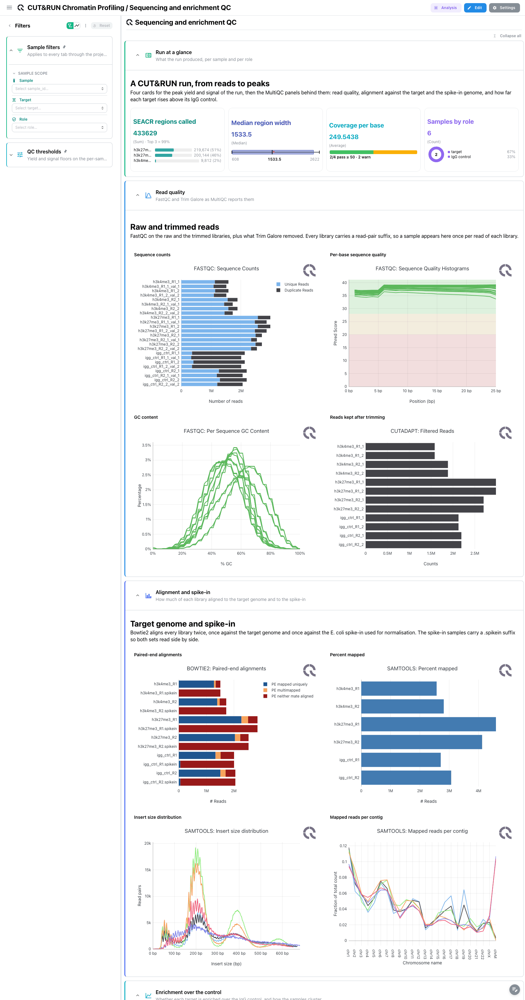
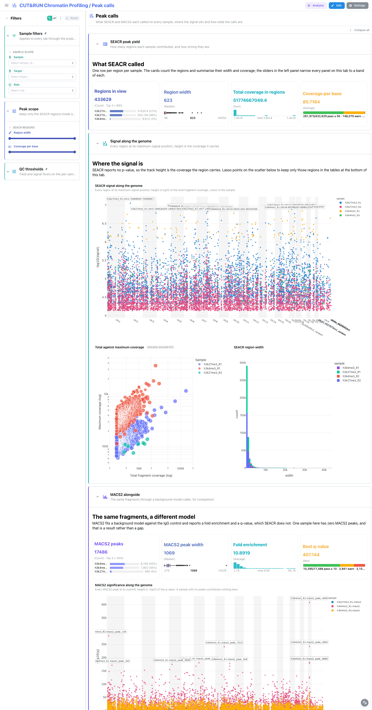
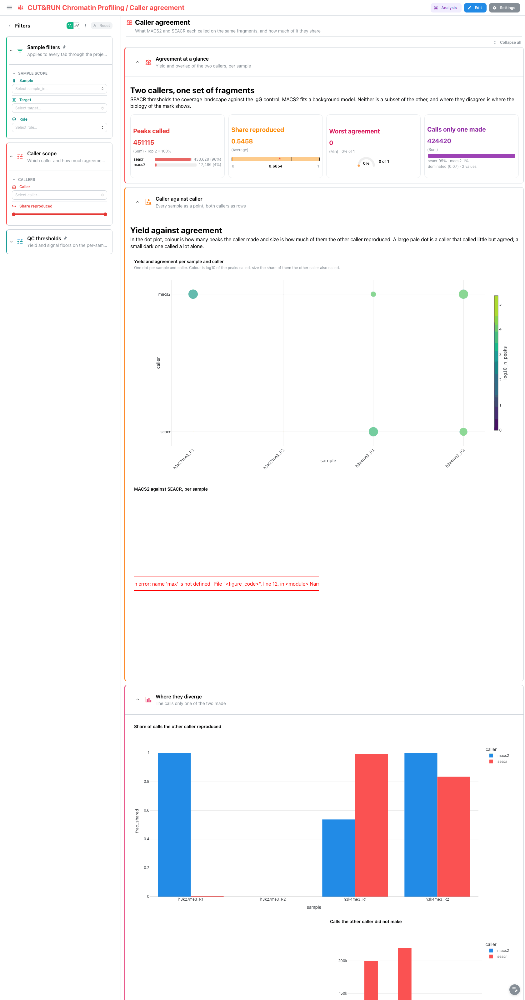
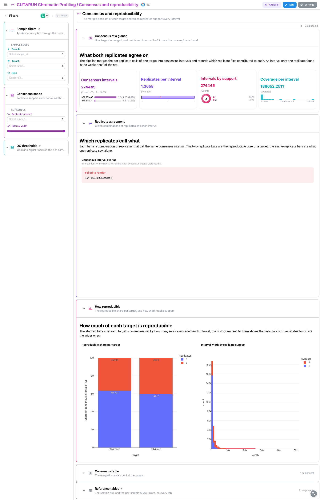

<div class="template-banner">
  <a class="template-banner-logo" href="https://nf-co.re/cutandrun" target="_blank" title="nf-core/cutandrun on nf-co.re">
    
    
  </a>
  <div class="template-banner-body">
    <h1 class="template-title">CUT&amp;RUN / CUT&amp;Tag</h1>
    <p class="template-subtitle">Chromatin profiling from reads to peaks: SEACR and MACS2 over the same fragments, how much the two callers agree, and the consensus peak set each target's replicates reproduce.</p>
    <p class="template-links">
      <a href="https://nf-co.re/cutandrun" target="_blank"><i class="mdi mdi-open-in-new"></i> nf-co.re</a>
      <a href="https://github.com/nf-core/cutandrun" target="_blank"><i class="mdi mdi-github"></i> GitHub</a>
    </p>
  </div>
  <span class="template-status-experimental template-banner-badge" data-tooltip="Experimental — shared as-is. Feedback and PRs welcome."><i class="mdi mdi-flask-outline"></i> Experimental</span>
</div>

<div class="tpl-version-pick" data-latest="3.1">
  <span class="tpl-version-icon"><i class="mdi mdi-source-branch"></i></span>
  <span class="tpl-version-label">Template version</span>
  <select id="tpl-version" class="tpl-version-select" aria-label="Template version">
    <option value="3.1" selected>3.1</option>
  </select>
  <span class="tpl-version-badge">latest</span>
</div>

The cutandrun template covers the peak-calling chain of a standard run:

- :material-chart-box-outline: **MultiQC**: FastQC and Trim Galore, bowtie2 against the target genome and the spike-in, and the deepTools fingerprint that separates a target from its IgG control
- :material-chart-scatter-plot: **Peak calls**: SEACR regions and MACS2 peaks over the same fragments, each with its own signal track along the genome
- :material-scale-balance: **Caller agreement**: how much of each caller's calls the other reproduced, sample by sample
- :material-set-merge: **Consensus and reproducibility**: the merged peak set of each target, and which replicates support every interval
- :material-table: **Reference tables**: the sample hub and the per-sample SEACR summary, pinned to the bottom of every tab

!!! warning "Reprocess MultiQC first, or the QC tab is empty"
    cutandrun 3.1 published a MultiQC 1.14 report, which writes no parquet at
    all, and Depictio reads only `multiqc.parquet`. This step is mandatory:

    ```bash
    python -m depictio.dev_scripts.multiqc_reprocess --src DATA_ROOT --dest DATA_ROOT
    ```

    It re-runs the pinned MultiQC 1.35 over the run's own raw tool outputs and
    writes the parquet next to a `REPROCESSED.json` recording both versions;
    `--dry-run` prints the plan first. Reprocessing adds no panels here: 1.14
    already parsed every module 1.35 does for this run, so it buys the format
    and nothing else.

!!! info "Both callers, or either one"
    The validated run called peaks with both callers (`--peakcaller
    seacr,macs2`). SEACR is cutandrun's default and the path the template is
    built on; the MACS2 collections are optional, so a SEACR-only run still
    ingests and the layout drops what is missing. Read **Caller agreement** with
    care then: with one caller the comparison reads as complete agreement.

---

## :material-rocket-launch-outline: Quick start

=== "Point at a finished run"

    ```bash
    depictio run \
      --template nf-core/cutandrun/latest \
      --data-root /path/to/cutandrun_results
    ```

    `--data-root` is the only thing you have to pass: the sample hub is built
    from the run's own `pipeline_info/samplesheet.valid.csv`.

=== "From the pipeline itself (v1.10.0+)"

    ```bash
    depictio-cli config nextflow --install     # once per machine
    nextflow run nf-core/cutandrun -profile docker --outdir results
    ```

    No `depictio run`, and no template named: the pipeline ingests its own
    output directory when it finishes and resolves this template from its own
    manifest. See [Nextflow trigger](../../depictio-cli/nextflow-trigger.md).

---

## :material-book-open-variant: Reference

The template reads the validated samplesheet, the SEACR stringent calls, the
MACS2 narrow peaks, the per-target consensus peak counts, the fragment-length
histograms and the three deepTools QC tables, on top of the reprocessed MultiQC
parquet. Every collection and recipe matches on file **name**, so the numbered
stage directories cutandrun publishes are never spelled out. The pipeline ships
no `params.json` at 3.1, so `DATA_ROOT` is the only variable.

!!! info "Self-adapting layout"
    The dashboard adapts to whatever the run actually produced: components bound
    to pruned or unparsed data collections are hidden, tabs left with no real
    visualizations are dropped entirely, and the remaining components are
    re-packed so there are no empty rows.

<div class="tpl-version-block" data-version="3.1" markdown>

--8<-- "pipeline-templates/nf-core/_generated/cutandrun-latest.md"

</div>

---

## :material-view-dashboard-outline: Dashboard tabs

Four tabs, read as a funnel: are the libraries clean and is each target enriched
over its control, what did each caller call, how much of that the two share, and
how much of it both replicates support. Each tab below carries the **same icon
and colour the dashboard gives it**. `Sample filters` is persistent and pinned
to the top of every tab, `Reference tables` to the bottom. The IgG controls are
samples throughout; only the peak collections omit them.

=== "{ width=18 }{ width=18 } MultiQC"

    *Are the libraries clean, and does each target rise above its IgG control?*

    [{ loading=lazy }](../../images/pipeline-templates/nf-core/cutandrun/multiqc_light.png){ .tpl-shot target="_blank" rel="noopener" }

    Four cards on the run's peak yield, then FastQC and Trim Galore, then
    bowtie2 against the target genome and against the spike-in: a library whose
    spike-in alignment collapses is not comparable to the others even when its
    target alignment looks fine. The deepTools fingerprint is the tab's point,
    and three tiles below it read the tables behind those pictures. One binds
    the new `scatter_xy` advanced-viz kind, coverage concentration against
    divergence from a uniform library, which pulls the targets away from the
    flat controls. The fragment-length ladder closes the tab: a flat curve
    there means the digestion did not work.

    ??? abstract ":material-tune-variant: Filters and components"

        **Filters** · `Sample`, `Target` and `Role` on `samples`, plus `Regions
        called` and `Coverage per base` ranges on `seacr_peak_summary` in a
        collapsed *QC thresholds* group pinned to the bottom.

        | Section | What it holds |
        |---|---|
        | Run at a glance | 4 cards |
        | Read quality | 4 MultiQC panels (FastQC, cutadapt) |
        | Alignment and spike-in | 4 MultiQC panels (bowtie2, samtools) |
        | Enrichment over the control | 4 deepTools MultiQC panels + 3 advanced visualizations |
        | Fragment lengths | 4 cards + *Fragment length distribution*, *Cumulative fragment length* |
        | Reference tables | *Sample hub*, *SEACR QC summary* |

=== ":material-chart-scatter-plot:{ .mc-indigo } Peak calls"

    *What each caller called on every sample, where the signal sits and how wide the calls are.*

    [{ loading=lazy }](../../images/pipeline-templates/nf-core/cutandrun/peak_calls_light.png){ .tpl-shot target="_blank" rel="noopener" }

    SEACR calls regions from fragment coverage rather than from a background
    model, so a SEACR row carries a total signal, a maximum signal and the
    sub-interval where that maximum was reached, and no p-value and no fold
    enrichment at all. `macs2/peaks` cannot read that and MultiQC has no SEACR
    module in any version, which is why SEACR needed its own catalog tool. The
    two signal panels here therefore do not share a y axis: SEACR plots
    `log10(total signal)`, MACS2 plots `-log10(q)`. Lassoing the
    total-against-maximum scatter narrows both peak tables on `peak_id`.

    ??? abstract ":material-tune-variant: Filters and components"

        **Filters** · `Region width` and `Coverage per base` ranges on
        `seacr_peaks`, in a *Peak scope* group.

        | Section | What it holds |
        |---|---|
        | SEACR peak yield | 4 cards |
        | Signal along the genome | *SEACR signal along the genome*, *Total against maximum coverage*, *SEACR region width* |
        | MACS2 alongside | 4 cards + *MACS2 significance along the genome* |
        | Peak tables | *SEACR regions*, *MACS2 peaks* |

=== ":material-scale-balance:{ .mc-red } Caller agreement"

    *Two callers, one set of fragments: how much of each one's calls the other reproduced.*

    [{ loading=lazy }](../../images/pipeline-templates/nf-core/cutandrun/caller_agreement_light.png){ .tpl-shot target="_blank" rel="noopener" }

    The two callers meet only here. `caller_agreement` is a join on `sample`
    that lives in the template's own `recipes/`, because a composition across
    two collections is what the catalog policy keeps out of the catalog. A peak
    counts as shared when it overlaps at least one call of the other caller on
    the same sample and chromosome, and a sample a caller never called keeps a
    row with `n_peaks = 0` rather than disappearing. In the dot plot, colour is
    the peaks a caller made and size is how much of them the other reproduced.

    ??? abstract ":material-tune-variant: Filters and components"

        **Filters** · `Caller` and a `Share reproduced` range, both on
        `caller_agreement`.

        | Section | What it holds |
        |---|---|
        | Agreement at a glance | 4 cards |
        | Caller against caller | *Yield and agreement per sample and caller*, *MACS2 against SEACR, per sample* |
        | Where they diverge | *Calls the other caller did not make*, *Share of calls the other caller reproduced* |
        | Comparison table | *Caller comparison* |

=== ":material-set-merge:{ .mc-grape } Consensus and reproducibility"

    *The merged peak set of each target, and which replicates support every interval.*

    [{ loading=lazy }](../../images/pipeline-templates/nf-core/cutandrun/consensus_and_reproducibility_light.png){ .tpl-shot target="_blank" rel="noopener" }

    Four cards on the merged intervals, then the UpSet panel over the four
    replicate columns of the consensus table, which shows the split between
    reproducible and single-replicate calls directly. Below it, the reproducible
    share per target and interval width by replicate support. Read the support
    donut first: the cards average over whatever `Replicate support` leaves in
    view, and it defaults to every value.

    ??? abstract ":material-tune-variant: Filters and components"

        **Filters** · `Replicate support` and an `Interval width` range on
        `seacr_consensus_peaks`, in a *Consensus scope* group.

        | Section | What it holds |
        |---|---|
        | Consensus at a glance | 4 cards |
        | Replicate agreement | *Consensus interval overlap* (UpSet) |
        | How reproducible | *Reproducible share per target*, *Interval width by replicate support* |
        | Consensus table | *Consensus intervals* |

!!! tip "A broad mark reproduces poorly, and the dashboard says so"
    On the reference run, 63 % of the consensus intervals are called by a single
    replicate, because H3K27me3 is a broad mark whose replicates overlap badly.
    That is a property of the data, not of the template.

---

## :material-play-circle-outline: Running the pipeline

Depictio reads the **output** of nf-core/cutandrun. Run the pipeline first:

```bash
nextflow run nf-core/cutandrun \
  --input samplesheet.csv \
  --genome GRCh38 \
  --peakcaller seacr,macs2 \
  -profile docker
```

Then regenerate the MultiQC report Depictio reads, and point Depictio at the
results:

```bash
python -m depictio.dev_scripts.multiqc_reprocess --src results/ --dest results/
depictio run --template nf-core/cutandrun/latest --data-root results/
```

See [nf-co.re/cutandrun/usage](https://nf-co.re/cutandrun/3.1/docs/usage) for
full pipeline documentation.

---

## :material-folder-open-outline: Required data structure

Point `--data-root` at the directory holding the pipeline output. Depictio scans
recursively and matches on file name, so the stage numbering below is the
reference run's layout, not a requirement.

```text
<DATA_ROOT>/
├── pipeline_info/
│   ├── samplesheet.valid.csv                          # the sample hub is derived from this
│   └── software_versions.yml                          # provenance, with local_versions.yml
├── 01_prealign/
│   ├── pretrim_fastqc/*_fastqc.zip
│   └── trimgalore/{fastqc/*_fastqc.zip,*_trimming_report.txt}
├── 02_alignment/bowtie2/
│   ├── target/log/*.bowtie2.log
│   ├── spikein/log/*.spikein.bowtie2.log
│   └── target/markdup/*.{stats,flagstat,idxstats}
├── 03_peak_calling/
│   ├── 04_called_peaks/
│   │   ├── seacr/*.seacr.peaks.stringent.bed          # required, the default caller
│   │   └── macs2/*.macs2_peaks.narrowPeak             # optional, plus *.macs2_peaks.xls
│   ├── 05_consensus_peaks/*.consensus.peak_counts.bed
│   └── 06_fragments_from_bams/*.frags.len.txt
├── 04_reporting/deeptools_qc/
│   ├── *.plotFingerprint.qcmetrics.txt
│   └── all_target_bams.plot{PCA.tab,Correlation.mat.tab}
└── multiqc/multiqc_data/
    └── multiqc.parquet                                # written by multiqc_reprocess
```

---

## :material-flask-outline: Test data

The repository ships
[`download_test_data.sh`](https://github.com/depictio/depictio/blob/main/depictio/projects/nf-core/cutandrun/3.1/download_test_data.sh),
which fetches the megatest subset the template needs, 103 files and about 90 MB:

```bash
bash depictio/projects/nf-core/cutandrun/3.1/download_test_data.sh /tmp/cutandrun_test
```

The run is
`s3://nf-core-awsmegatests/cutandrun/results-42502fb44975e930eec865353c5481f472bcf766/`
(GSE145187): H3K4me3 and H3K27me3 in two replicates each, against two IgG
controls. Two steps follow the fetch, both in `post_fetch_help` in
`megatest.yaml` next to the script:

```bash
# MACS2 called nothing for h3k27me3_R2 and published zero-byte files, which the
# glob loader cannot parse. The null result stays visible without them.
find /tmp/cutandrun_test/03_peak_calling -type f -size 0 -delete

# The run wrote MultiQC 1.14, so regenerate the parquet Depictio reads.
python -m depictio.dev_scripts.multiqc_reprocess \
  --src /tmp/cutandrun_test --dest /tmp/cutandrun_test

# Then ingest it.
depictio run --template nf-core/cutandrun/latest --data-root /tmp/cutandrun_test
```

---

## :material-link-variant: Additional resources

- [nf-co.re/cutandrun](https://nf-co.re/cutandrun): official pipeline documentation
- [nf-co.re/cutandrun/3.1/results](https://nf-co.re/cutandrun/3.1/results): AWS test results
- [Template System Reference](../../usage/projects/templates.md): YAML format, variables, conditionals
- [Recipes](../../usage/projects/recipes.md): how to read, test, and write recipes

---

## :material-account-group-outline: Authorship

<div class="tpl-credits">
  <div class="tpl-credit">
    <span class="tpl-credit-role"><i class="mdi mdi-code-braces"></i> Developers</span>
    <span class="tpl-credit-note">Wrote the template, its recipes and its dashboards.</span>
    <a class="tpl-person" href="https://github.com/weber8thomas" target="_blank" rel="noopener">
       weber8thomas
    </a>
  </div>
  <div class="tpl-credit">
    <span class="tpl-credit-role"><i class="mdi mdi-eye-check-outline"></i> Reviewers</span>
    <span class="tpl-credit-note">Nobody has run it on their own data and signed it off yet, which is what keeps it Experimental.</span>
    <span class="tpl-person"><i class="mdi mdi-account-plus-outline"></i> Open</span>
  </div>
  <div class="tpl-credit">
    <span class="tpl-credit-role"><i class="mdi mdi-wrench-outline"></i> Maintainers</span>
    <span class="tpl-credit-note">Keep it working as nf-core/cutandrun releases.</span>
    <a class="tpl-person" href="https://github.com/weber8thomas" target="_blank" rel="noopener">
       weber8thomas
    </a>
  </div>
</div>

Reviewing a template on your own data, or taking over a role here, is a
contribution in itself: the [contributing guide](../../developer/contributing-templates.md)
says what each one involves.
