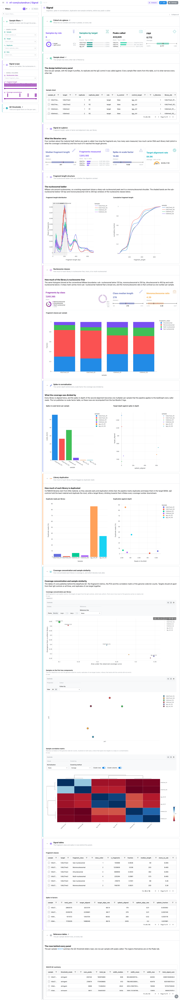
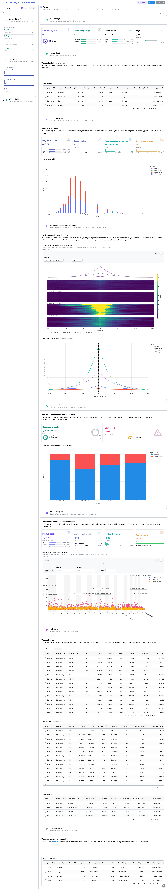
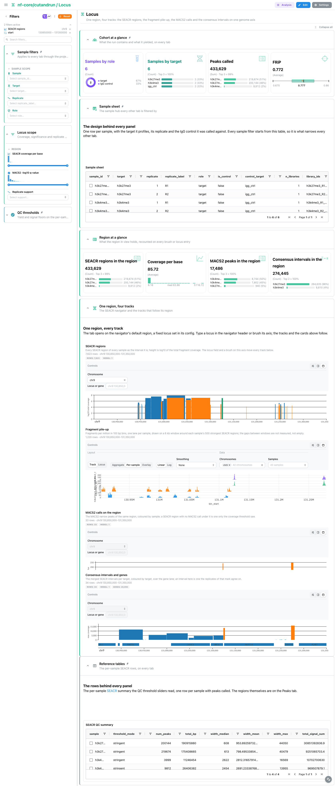
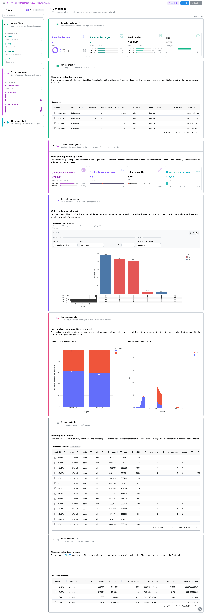

<div class="template-banner">
  <a class="template-banner-logo" href="https://nf-co.re/cutandrun" target="_blank" title="nf-core/cutandrun on nf-co.re">
    
    
  </a>
  <div class="template-banner-body">
    <h1 class="template-title">CUT&amp;RUN / CUT&amp;Tag</h1>
    <p class="template-subtitle">Chromatin profiling from reads to peaks: SEACR and MACS2 over the same fragments, how much the two callers agree, and the consensus peak set each target's replicates reproduce.</p>
    <p class="template-links">
      <a href="https://nf-co.re/cutandrun" target="_blank"><i class="mdi mdi-open-in-new"></i> nf-co.re</a>
      <a href="https://github.com/nf-core/cutandrun" target="_blank"><i class="mdi mdi-github"></i> GitHub</a>
    </p>
  </div>
  <span class="template-status-experimental template-banner-badge" data-tooltip="Experimental: shared as-is. Feedback and PRs welcome."><i class="mdi mdi-flask-outline"></i> Experimental</span>
</div>

<div class="tpl-version-pick" data-latest="3.1">
  <span class="tpl-version-icon"><i class="mdi mdi-source-branch"></i></span>
  <span class="tpl-version-label">Template version</span>
  <select id="tpl-version" class="tpl-version-select" aria-label="Template version">
    <option value="3.1" selected>3.1</option>
  </select>
  <span class="tpl-version-badge">latest</span>
</div>

The cutandrun template covers the peak-calling chain of a standard run:

- :material-chart-box-outline: **MultiQC**: FastQC and Trim Galore, bowtie2 against the target genome and the spike-in, and the deepTools fingerprint that separates a target from its IgG control
- :material-waves: **Signal**: the nucleosomal ladder and its fragment classes, the spike-in factors, duplication, and the deepTools tables behind the MultiQC pictures
- :material-chart-scatter-plot: **Peaks**: SEACR regions, the fragment pile-up around their summits, the share of coverage they hold, and MACS2 alongside
- :material-scale-balance: **Caller agreement**: how much of each caller's calls the other reproduced, sample by sample
- :material-dna: **Locus**: one region with the SEACR, fragment, MACS2 and consensus tracks stacked on one genome axis
- :material-set-merge: **Consensus**: the merged peak set of each target, and which replicates support every interval

!!! warning "Reprocess MultiQC first, or the QC tab is empty"
    cutandrun 3.1 published a MultiQC 1.14 report, which writes no parquet at
    all, and Depictio reads only `multiqc.parquet`. This step is mandatory:

    ```bash
    python -m depictio.dev_scripts.multiqc_reprocess --src DATA_ROOT --dest DATA_ROOT
    ```

    It re-runs the pinned MultiQC 1.35 over the run's own raw tool outputs and
    writes the parquet next to a `REPROCESSED.json` recording both versions;
    `--dry-run` prints the plan first. Reprocessing adds no panels here: 1.14
    already parsed every module 1.35 does for this run, so it buys the format
    and nothing else.

!!! info "Both callers, or either one"
    The validated run called peaks with both callers (`--peakcaller
    seacr,macs2`). SEACR is cutandrun's default and the path the template is
    built on; the MACS2 collections are optional, so a SEACR-only run still
    ingests and the layout drops what is missing. Read **Caller agreement** with
    care then: with one caller the comparison reads as complete agreement.

---

## :material-rocket-launch-outline: Quick start

=== "Point at a finished run"

    ```bash
    depictio run \
      --template nf-core/cutandrun/latest \
      --data-root /path/to/cutandrun_results
    ```

    `--data-root` is the only thing you have to pass: the sample hub is built
    from the run's own `pipeline_info/samplesheet.valid.csv`. `GENOME` sets the
    genome axis of the Locus tab and defaults to `hg38`; pass the UCSC assembly
    the run was aligned to otherwise:

    ```bash
    depictio run \
      --template nf-core/cutandrun/latest \
      --data-root /path/to/cutandrun_results \
      --var GENOME=mm10
    ```

=== "From the pipeline itself (v1.10.0+)"

    ```bash
    depictio-cli config nextflow --install     # once per machine
    nextflow run nf-core/cutandrun -r 3.1 -profile docker --outdir results
    ```

    No `depictio run`, and no template named: the pipeline ingests its own
    output directory when it finishes and resolves this template from its own
    manifest. See [Nextflow trigger](../../depictio-cli/nextflow-trigger.md).

---

## :material-book-open-variant: Reference

The template reads the validated samplesheet, the bowtie2 logs, the samtools
flagstat of the marked-duplicate BAMs, the SEACR stringent calls, the MACS2
narrow peaks, the per-target consensus peak counts, the fragment-length
histograms, the fragment BEDs and the three deepTools QC tables, on top of the
reprocessed MultiQC parquet. Every collection and recipe matches on file
**name**, so the numbered stage directories cutandrun publishes are never
spelled out. The pipeline ships no `params.json` at 3.1, so no variable is set
from the run's parameters: `DATA_ROOT` is required and `GENOME` (default
`hg38`) is the only optional one.

!!! info "Self-adapting layout"
    The dashboard adapts to whatever the run actually produced: components bound
    to pruned or unparsed data collections are hidden, tabs left with no real
    visualizations are dropped entirely, and the remaining components are
    re-packed so there are no empty rows.

<div class="tpl-version-block" data-version="3.1" markdown>

--8<-- "pipeline-templates/nf-core/_generated/cutandrun-latest.md"

</div>

---

## :material-view-dashboard-outline: Dashboard tabs

Six tabs, read as a funnel: are the libraries clean and is each target enriched
over its control, what the material itself carries before any peak is called,
what SEACR called and how much of the coverage those calls hold, how much of
that MACS2 shares, what one region looks like with every track stacked, and how
much of it the replicates reproduce. Each tab below carries the **same icon and
colour the dashboard gives it**. `Sample filters` (sample, target, replicate,
role) is persistent and pinned to the top of every tab, with the *Cohort at a
glance* cards and the collapsed *Sample sheet*; *QC thresholds* and `Reference
tables` are pinned to the bottom. Every tab also carries a tab-local filter
group on its own columns. The IgG controls are samples throughout; only the
peak collections omit them.

Scatter plots, genome tracks and tables are selection sources: a lasso on a
scatter, a brush on a track or a picked table row sends its `sample` or
`peak_id` values across the project links, so the other panels of the tab
narrow to the same libraries or intervals.

=== "{ width=18 }{ width=18 } MultiQC"

    *Are the libraries clean, and does each target rise above its IgG control?*

    [{ loading=lazy }](../../images/pipeline-templates/nf-core/cutandrun/multiqc_light.png){ .tpl-shot target="_blank" rel="noopener" }

    The general statistics table, then FastQC and Trim Galore, then bowtie2
    against the target genome and against the spike-in: a library whose spike-in
    alignment collapses is not comparable to the others even when its target
    alignment looks fine. The deepTools fingerprint closes the tab, which is what
    says whether a target rises above its IgG control at all. The tab holds
    MultiQC panels only; the tables behind those pictures are on the Signal tab.

    ??? abstract ":material-tune-variant: Filters and components"

        **Filters** · the persistent `Sample filters` group (`Sample`, `Target`,
        `Replicate`, `Role`), plus `Target alignment rate` and `Spike-in scale
        factor` ranges in a tab-local *Alignment scope* group, and `Regions
        called` and `Coverage per base` ranges on `seacr_peak_summary` in a
        collapsed *QC thresholds* group pinned to the bottom.

        | Section | What it holds |
        |---|---|
        | Cohort at a glance | 4 cards (pinned) |
        | Sample sheet | *Sample sheet* (pinned, collapsed) |
        | Run at a glance | *General statistics* |
        | Read quality | 4 MultiQC panels (FastQC, cutadapt) |
        | Alignment and spike-in | 4 MultiQC panels (bowtie2, samtools) |
        | Enrichment over the control | *Fingerprint plot* |
        | Reference tables | *SEACR QC summary* (pinned, collapsed) |

=== ":material-waves:{ .mc-violet } Signal"

    *Did the digestion work, and what was the coverage divided by, before any peak is called?*

    [{ loading=lazy }](../../images/pipeline-templates/nf-core/cutandrun/signal_light.png){ .tpl-shot target="_blank" rel="noopener" }

    Everything the pipeline published as a table beside the report. MNase cuts
    around nucleosomes, so a working experiment shows a sharp sub-nucleosomal
    peak next to a mononucleosomal shoulder, and a flat distribution means the
    digestion did not work; the nucleosome classes bin the same histogram at the
    conventional boundaries. The spike-in factors are recomputed from the two
    bowtie2 logs, since the run publishes no scale-factor table, and Picard's
    duplicate flags show which libraries saturated. The deepTools tables close
    the tab: the fingerprint scatter, the `plotPCA` loadings and the clustered
    correlation matrix, where a block spanning two targets is a swap or a
    contamination. The depth, duplication, fingerprint and PCA scatters are all
    lasso sources on `sample`.

    ??? abstract ":material-tune-variant: Filters and components"

        **Filters** · `Nucleosome class`, a `Fragment length` range and a
        `Coverage concentration` range in a tab-local *Signal scope* group.

        | Section | What it holds |
        |---|---|
        | Signal at a glance | 4 cards |
        | Fragment length structure | *Fragment length distribution*, *Cumulative fragment length* |
        | Nucleosome classes | 3 cards, *Fragment classes per sample* |
        | Spike-in normalisation | *Spike-in scale factor per sample*, *Target depth against spike-in depth* |
        | Library duplication | *Duplicate reads per library*, *Duplication against depth* |
        | Coverage concentration and sample similarity | *Coverage concentration per library*, *Samples on the first two components*, *Sample correlation matrix* |
        | Signal tables | *Fragment classes*, *Spike-in factors* (collapsed) |

=== ":material-chart-scatter-plot:{ .mc-indigo } Peaks"

    *What SEACR called on every sample, what the fragments look like under it, and how much of the library the calls hold.*

    [{ loading=lazy }](../../images/pipeline-templates/nf-core/cutandrun/peaks_light.png){ .tpl-shot target="_blank" rel="noopener" }

    SEACR calls regions from fragment coverage rather than from a background
    model, so a SEACR row carries a total and a maximum signal and no p-value at
    all; MultiQC has no SEACR module, which is why SEACR needed its own catalog
    tool. The pile-up heatmap rebuilds the fragments from the fragment BEDs, one
    row per region 3 kb either side of its summit: a sharp mark collapses onto
    the summit while a broad one stays spread. *Signal budget* is the fraction
    of reads in peaks, counted in base pairs of fragment coverage because SEACR
    reports no read count. MACS2 follows with the fold enrichment and q-value
    SEACR does not give; its significance track is a brush source on `peak_id`
    that narrows the peak tables.

    ??? abstract ":material-tune-variant: Filters and components"

        **Filters** · `Region width` and `Coverage per base` ranges and a
        `Contig` selector on `seacr_peaks`, in a tab-local *Peak scope* group.

        | Section | What it holds |
        |---|---|
        | SEACR peak yield | 4 cards, *SEACR region width* |
        | Fragment pile-up around the peaks | *Fragment pile-up around the SEACR summits*, *Mean pile-up per sample* |
        | Signal budget | 2 cards, *Fragment coverage inside and outside peaks* |
        | MACS2 alongside | 4 cards, *MACS2 significance along the genome* |
        | Peak tables | *SEACR regions*, *MACS2 peaks*, *Signal budget* (collapsed) |

    !!! tip "The pile-up needs the fragment BEDs"
        Both fragment collections are optional. A run or a mirror without the
        `*.frags.cut.bed` files ingests everything else, and the pile-up section
        here and the fragment track of the Locus tab drop out.

=== ":material-scale-balance:{ .mc-red } Caller agreement"

    *Two callers, one set of fragments: how much of each one's calls the other reproduced.*

    [{ loading=lazy }](../../images/pipeline-templates/nf-core/cutandrun/caller_agreement_light.png){ .tpl-shot target="_blank" rel="noopener" }

    The two callers meet only here. `caller_agreement` is a join on `sample`
    that lives in the template's own `recipes/`, because a composition across
    two collections is what the catalog policy keeps out of the catalog. A peak
    counts as shared when it overlaps at least one call of the other caller on
    the same sample and chromosome, and a sample a caller never called keeps a
    row with `n_peaks = 0` rather than disappearing. The scatter puts MACS2 and
    SEACR on the two axes, one point per sample sized by the share they agree
    on, and is a lasso source on `sample`; the bars count the calls the other
    caller never made.

    ??? abstract ":material-tune-variant: Filters and components"

        **Filters** · `Caller` and a `Share reproduced` range, both on
        `caller_agreement`, in a tab-local *Caller scope* group.

        | Section | What it holds |
        |---|---|
        | Agreement at a glance | 4 cards |
        | Caller against caller | *MACS2 against SEACR, per sample*, *Calls the other caller did not make* |
        | Comparison table | *Caller comparison* (collapsed) |

=== ":material-dna:{ .mc-teal } Locus"

    *One region, every track: do the callers and the replicates agree where it matters?*

    [{ loading=lazy }](../../images/pipeline-templates/nf-core/cutandrun/locus_light.png){ .tpl-shot target="_blank" rel="noopener" }

    Four tracks on one genome axis, set by the `GENOME` variable: the SEACR
    regions, the fragment pile-up, the MACS2 calls and the consensus intervals
    over a gene lane. The SEACR track is the navigator: the tab opens on a fixed
    default locus, and typing a locus in its header or brushing its axis moves
    the other three tracks and recounts the cards above. Brushing intervals on
    any track selects their `peak_id` values for the rest of the tab.

    ??? abstract ":material-tune-variant: Filters and components"

        **Filters** · `SEACR coverage per base` and `MACS2 -log10 q-value`
        ranges and a `Replicate support` selector, in a tab-local *Locus scope*
        group.

        | Section | What it holds |
        |---|---|
        | Region at a glance | 4 cards, recounted on the region in view |
        | One region, four tracks | *SEACR regions*, *Fragment pile-up*, *MACS2 calls on the region*, *Consensus intervals and genes* |

    !!! tip "Pass the assembly for a run not on hg38"
        The navigator fetches only the chromosome of its region from the
        assembly it is given, which defaults to `hg38`. For a run aligned to
        another build, pass `--var GENOME=<assembly>` at ingest, or the tracks
        land on the wrong coordinates.

=== ":material-set-merge:{ .mc-grape } Consensus"

    *The merged peak set of each target, and which replicates support every interval.*

    [{ loading=lazy }](../../images/pipeline-templates/nf-core/cutandrun/consensus_light.png){ .tpl-shot target="_blank" rel="noopener" }

    Four cards on the merged intervals, then the UpSet panel over the replicate
    columns of the consensus table: bars spanning several replicates are the
    reproducible core of a target, single-replicate bars what one replicate saw
    alone. Below it, the reproducible share per target and interval width by
    replicate support. The cards average over whatever `Replicate support` leaves
    in view, and it defaults to every value; picking a row of the consensus table
    selects its `peak_id` across the tab.

    ??? abstract ":material-tune-variant: Filters and components"

        **Filters** · `Replicate support` and `Interval width` and `Member peaks`
        ranges on `seacr_consensus_peaks`, in a tab-local *Consensus scope*
        group.

        | Section | What it holds |
        |---|---|
        | Consensus at a glance | 4 cards |
        | Replicate agreement | *Consensus interval overlap* (UpSet) |
        | How reproducible | *Reproducible share per target*, *Interval width by replicate support* |
        | Consensus table | *Consensus intervals* (collapsed) |

!!! tip "A broad mark reproduces poorly, and the dashboard says so"
    Replicates of a broad histone mark overlap badly, so a large share of its
    consensus intervals are called by a single replicate. That is a property of
    the data, not of the template.

---

## :material-play-circle-outline: Running the pipeline

Depictio reads the **output** of nf-core/cutandrun. Run the pipeline first:

```bash
nextflow run nf-core/cutandrun -r 3.1 \
  --input samplesheet.csv \
  --genome GRCh38 \
  --peakcaller seacr,macs2 \
  --outdir results -profile docker
```

Then regenerate the MultiQC report Depictio reads, and point Depictio at the
results:

```bash
python -m depictio.dev_scripts.multiqc_reprocess --src results/ --dest results/
depictio run --template nf-core/cutandrun/latest --data-root results/
```

See [nf-co.re/cutandrun/usage](https://nf-co.re/cutandrun/3.1/docs/usage) for
full pipeline documentation.

---

## :material-folder-open-outline: Required data structure

Point `--data-root` at the directory holding the pipeline output. Depictio scans
recursively and matches on file name, so the stage numbering below is the
reference run's layout, not a requirement.

```text
<DATA_ROOT>/
├── pipeline_info/
│   ├── samplesheet.valid.csv                          # the sample hub is derived from this
│   └── software_versions.yml                          # provenance, with local_versions.yml
├── 01_prealign/
│   ├── pretrim_fastqc/*_fastqc.zip
│   └── trimgalore/{fastqc/*_fastqc.zip,*_trimming_report.txt}
├── 02_alignment/bowtie2/
│   ├── target/log/*.bowtie2.log
│   ├── spikein/log/*.spikein.bowtie2.log
│   └── target/markdup/*.{stats,flagstat,idxstats}
├── 03_peak_calling/
│   ├── 04_called_peaks/
│   │   ├── seacr/*.seacr.peaks.stringent.bed          # required, the default caller
│   │   └── macs2/*.macs2_peaks.narrowPeak             # optional, plus *.macs2_peaks.xls
│   ├── 05_consensus_peaks/*.consensus.peak_counts.bed
│   └── 06_fragments_from_bams/
│       ├── *.frags.len.txt
│       └── *.frags.cut.bed                            # optional, the pile-up and fragment track
├── 04_reporting/deeptools_qc/
│   ├── *.plotFingerprint.qcmetrics.txt
│   └── all_target_bams.plot{PCA.tab,Correlation.mat.tab}
└── multiqc/multiqc_data/
    └── multiqc.parquet                                # written by multiqc_reprocess
```

---

## :material-flask-outline: Validation runs

The repository ships
[`download_test_data.sh`](https://github.com/depictio/depictio/blob/main/depictio/projects/nf-core/cutandrun/3.1/download_test_data.sh),
which fetches the megatest subset the template needs, fragment BEDs included:

```bash
bash depictio/projects/nf-core/cutandrun/3.1/download_test_data.sh /tmp/cutandrun_test
```

The run is
`s3://nf-core-awsmegatests/cutandrun/results-42502fb44975e930eec865353c5481f472bcf766/`
(GSE145187): H3K4me3 and H3K27me3 in two replicates each, against two IgG
controls; the screenshots above come from it. Two steps follow the fetch, both in `post_fetch_help` in
`megatest.yaml` next to the script:

```bash
# MACS2 called nothing for h3k27me3_R2 and published zero-byte files, which the
# glob loader cannot parse. The null result stays visible without them.
find /tmp/cutandrun_test/03_peak_calling -type f -size 0 -delete

# The run wrote MultiQC 1.14, so regenerate the parquet Depictio reads.
python -m depictio.dev_scripts.multiqc_reprocess \
  --src /tmp/cutandrun_test --dest /tmp/cutandrun_test

# Then ingest it.
depictio run --template nf-core/cutandrun/latest --data-root /tmp/cutandrun_test
```

---

## :material-link-variant: Additional resources

- [nf-co.re/cutandrun](https://nf-co.re/cutandrun): official pipeline documentation
- [nf-co.re/cutandrun/3.1/results](https://nf-co.re/cutandrun/3.1/results): AWS test results
- [Template System Reference](../../usage/projects/templates.md): YAML format, variables, conditionals
- [Recipes](../../usage/projects/recipes.md): how to read, test, and write recipes

---

## :material-account-group-outline: Authorship

<div class="tpl-credits">
  <div class="tpl-credit">
    <span class="tpl-credit-role"><i class="mdi mdi-code-braces"></i> Developers</span>
    <span class="tpl-credit-note">Wrote the template, its recipes and its dashboards.</span>
    <a class="tpl-person" href="https://github.com/weber8thomas" target="_blank" rel="noopener">
       weber8thomas
    </a>
  </div>
  <div class="tpl-credit">
    <span class="tpl-credit-role"><i class="mdi mdi-eye-check-outline"></i> Reviewers</span>
    <span class="tpl-credit-note">Nobody has run it on their own data and signed it off yet, which is what keeps it Experimental.</span>
    <span class="tpl-person"><i class="mdi mdi-account-plus-outline"></i> Open</span>
  </div>
  <div class="tpl-credit">
    <span class="tpl-credit-role"><i class="mdi mdi-wrench-outline"></i> Maintainers</span>
    <span class="tpl-credit-note">Keep it working as nf-core/cutandrun releases.</span>
    <a class="tpl-person" href="https://github.com/weber8thomas" target="_blank" rel="noopener">
       weber8thomas
    </a>
  </div>
</div>

Reviewing a template on your own data, or taking over a role here, is a
contribution in itself: the [contributing guide](../../developer/contributing-templates.md)
says what each one involves.
