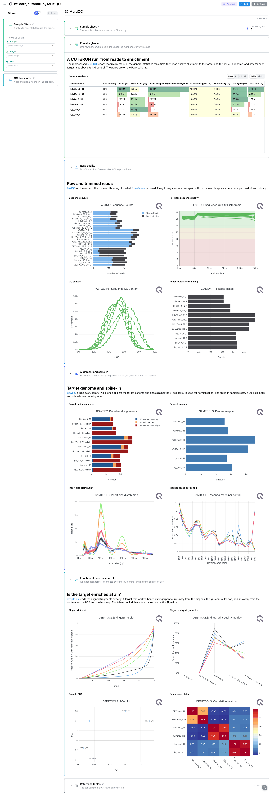
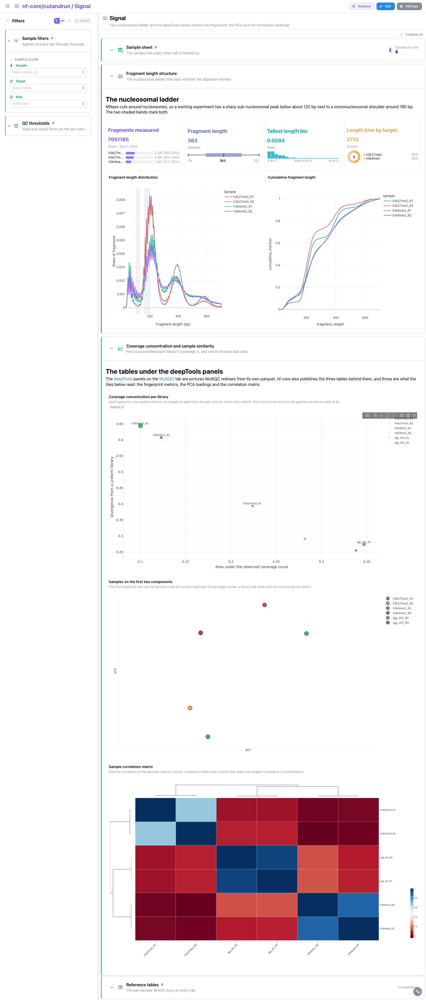
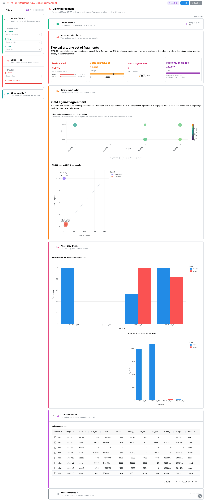

<div class="template-banner">
  <a class="template-banner-logo" href="https://nf-co.re/cutandrun" target="_blank" title="nf-core/cutandrun on nf-co.re">
    
    
  </a>
  <div class="template-banner-body">
    <h1 class="template-title">CUT&amp;RUN / CUT&amp;Tag</h1>
    <p class="template-subtitle">Chromatin profiling from reads to peaks: SEACR and MACS2 over the same fragments, how much the two callers agree, and the consensus peak set each target's replicates reproduce.</p>
    <p class="template-links">
      <a href="https://nf-co.re/cutandrun" target="_blank"><i class="mdi mdi-open-in-new"></i> nf-co.re</a>
      <a href="https://github.com/nf-core/cutandrun" target="_blank"><i class="mdi mdi-github"></i> GitHub</a>
    </p>
  </div>
  <span class="template-status-experimental template-banner-badge" data-tooltip="Experimental: shared as-is. Feedback and PRs welcome."><i class="mdi mdi-flask-outline"></i> Experimental</span>
</div>

<div class="tpl-version-pick" data-latest="3.1">
  <span class="tpl-version-icon"><i class="mdi mdi-source-branch"></i></span>
  <span class="tpl-version-label">Template version</span>
  <select id="tpl-version" class="tpl-version-select" aria-label="Template version">
    <option value="3.1" selected>3.1</option>
  </select>
  <span class="tpl-version-badge">latest</span>
</div>

The cutandrun template covers the peak-calling chain of a standard run:

- :material-compass-outline: **Overview**: the run in four key figures, live findings and four figures, each linked to the tab that explains it
- :material-chart-box-outline: **Data & QC**: the MultiQC report (FastQC, Trim Galore, Bowtie 2 against the target and the spike-in, the deepTools fingerprint), then depth, spike-in scaling, duplication and enrichment per library
- :material-waves: **Chromatin signal**: the nucleosomal fragment ladder, then the SEACR regions, their pile-up and the signal they hold
- :material-scale-balance: **Agreement**: how much SEACR and MACS2 agree, the consensus set each target's replicates reproduce, and both on one genomic region

!!! warning "Reprocess MultiQC first, or the QC tab is empty"
    cutandrun 3.1 published a MultiQC 1.14 report, which writes no parquet at
    all, and Depictio reads only `multiqc.parquet`. This step is mandatory:

    ```bash
    python -m depictio.dev_scripts.multiqc_reprocess --src DATA_ROOT --dest DATA_ROOT
    ```

    It re-runs the pinned MultiQC 1.35 over the run's own raw tool outputs and
    writes the parquet next to a `REPROCESSED.json` recording both versions;
    `--dry-run` prints the plan first. Reprocessing adds no panels here: 1.14
    already parsed every module 1.35 does for this run, so it buys the format
    and nothing else.

!!! info "Both callers, or either one"
    The validated run called peaks with both callers (`--peakcaller
    seacr,macs2`). SEACR is cutandrun's default and the path the template is
    built on; the MACS2 collections are optional, so a SEACR-only run still
    ingests and the layout drops what is missing. Read **Caller agreement** with
    care then: with one caller the comparison reads as complete disagreement.

---

## :material-rocket-launch-outline: Quick start

=== "Point at a finished run"

    ```bash
    depictio ingest /path/to/cutandrun_results \
      --template nf-core/cutandrun/latest
    ```

    The results directory is the only thing you have to pass: the sample hub is built
    from the run's own `pipeline_info/samplesheet.valid.csv`. `GENOME` sets the
    genome axis of the Locus tab and defaults to `hg38`; pass the UCSC assembly
    the run was aligned to otherwise:

    ```bash
    depictio ingest /path/to/cutandrun_results \
      --template nf-core/cutandrun/latest \
      --var GENOME=mm10
    ```

=== "From the pipeline itself (v1.10.0+)"

    ```bash
    depictio config nextflow --install     # once per machine
    nextflow run nf-core/cutandrun -r 3.1 -profile docker --outdir results
    ```

    No `depictio ingest`, and no template named: the pipeline ingests its own
    output directory when it finishes and resolves this template from its own
    manifest. See [Nextflow trigger](../../depictio-cli/nextflow-trigger.md).

---

## :material-book-open-variant: Reference

The template reads the validated samplesheet, the bowtie2 logs, the samtools
flagstat of the marked-duplicate BAMs, the SEACR stringent calls, the MACS2
narrow peaks, the per-target consensus peak counts, the fragment-length
histograms, the fragment BEDs and the three deepTools QC tables, on top of the
reprocessed MultiQC parquet. Every collection and recipe matches on file
**name**, so the numbered stage directories cutandrun publishes are never
spelled out. The pipeline ships no `params.json` at 3.1, so no variable is set
from the run's parameters: `DATA_ROOT` is required and `GENOME` (default
`hg38`) is the only optional one.

!!! info "Self-adapting layout"
    The dashboard adapts to whatever the run actually produced: components bound
    to pruned or unparsed data collections are hidden, tabs left with no real
    visualizations are dropped entirely, and the remaining components are
    re-packed so there are no empty rows.

<div class="tpl-version-block" data-version="3.1" markdown>

--8<-- "pipeline-templates/nf-core/_generated/cutandrun-latest.md"

</div>

---

## :material-view-dashboard-outline: Dashboard tabs

One dashboard: the **Overview**, then seven child tabs in three groups, read as a
funnel from the libraries to the peaks a target's replicates reproduce. Each tab
below carries the **same icon and colour the dashboard gives it**, so the page and
the app read alike.

| Group | Tabs |
|---|---|
| Data & QC | MultiQC, Libraries |
| Chromatin signal | Fragments, Peaks |
| Agreement | Caller agreement, Consensus, Locus |

Each child tab opens with a short intro and a strip of four cards, then at most
three open sections; tables and details follow, collapsed. The persistent *Sample
filters* (target, sample, replicate, role) sit in the left panel and narrow every
tab through the project links. The *Sample sheet* is pinned, collapsed, to the
bottom of every child tab. The template has no grouping variable: `target`, the
samplesheet group, is what every grouped tile reads. The IgG controls are samples
throughout; only the peak collections omit them.

=== ":material-compass-outline: Overview"

    *Chromatin profiling, from fragments to the peaks replicates reproduce.*

    <!-- screenshot pending v2 -->

    A short hero links the run parameters, which for cutandrun 3.1 are the software
    versions: the run ships no `params.json`. *About this dashboard* says how the
    two filter levels work, *The run* lists the samples, targets, IgG controls and
    peak callers read from the data, and *Pipeline* walks the six steps from
    trimming to the consensus merge, each linked to its tool versions and its tab.
    The findings are live values: they follow the filters, and a route that lacks
    their data drops them. The Locus tab has no figure here, since it is a browser
    rather than a summary.

    ??? abstract ":material-tune-variant: Filters and components"

        **Filters** · the left panel starts collapsed. *Key figures* and
        *Findings* each have their own filter bar (target and sample): each
        narrows its own section only.

        | Section | What it holds |
        |---|---|
        | Top | Hero, *About this dashboard*, *The run*, *Pipeline* |
        | Key figures | 4 headline cards: samples, fragment length, peaks, FRiP |
        | Findings | Live result rows, then 4 figures: the fragment-length distribution, the pile-up at the SEACR summits, MACS2 against SEACR per sample and the reproducible share per target |
        | How to read this dashboard | The tabs by group, each with its question |

=== "{ width=18 }{ width=18 } MultiQC"

    **Data & QC** · *Did reads trim, align and rise above the IgG control?*

    [{ loading=lazy }](../../images/pipeline-templates/nf-core/cutandrun/multiqc_light.png){ .tpl-shot target="_blank" rel="noopener" }

    MultiQC panels only, from the reprocessed report. Open: general statistics,
    FastQC sequence counts and the reads kept after trimming, Bowtie 2 against
    samtools percent mapped (spike-in libraries carry a `.spikein` suffix), then
    the deepTools fingerprint. Base quality, GC content, insert sizes and reads
    per contig are collapsed.

    ??? abstract ":material-tune-variant: Filters and components"

        **Filters** · `Target alignment rate` and `Spike-in scale factor` ranges
        on `bowtie2_spikein_factors`, carried into the report by a reverse link.

        | Section | What it holds |
        |---|---|
        | QC overview | 3 MultiQC panels |
        | Alignment and spike-in | 2 MultiQC panels |
        | Enrichment over the control | 1 MultiQC panel (fingerprint) |
        | QC details (collapsed) | 4 MultiQC panels |

=== ":material-flask-outline:{ .mc-cyan } Libraries"

    **Data & QC** · *How deep and duplicated is each library, and is it enriched?*

    <!-- screenshot pending v2 -->

    The tables the pipeline publishes beside the report. Read pairs, the spike-in
    scale factor, duplicate reads and the distance from a uniform library. Then the
    scale factor and the duplicate share per library, the fingerprint metrics,
    where targets sit apart from the IgG controls, and the PCA beside the clustered
    correlation matrix of the genome-wide bin counts.

    ??? abstract ":material-tune-variant: Filters and components"

        **Filters** · a `Spike-in scale factor` range on `bowtie2_spikein_factors`
        and a `Coverage concentration` range on `deeptools_fingerprint_metrics`.

        | Section | What it holds |
        |---|---|
        | Libraries at a glance | 4 cards |
        | Spike-in and duplication | 2 bars |
        | Enrichment over the control | 1 advanced visualization |
        | Sample similarity | 2 advanced visualizations |
        | Depth detail (collapsed) | 2 scatters |
        | Library tables (collapsed) | *Spike-in factors* |

=== ":material-waves:{ .mc-violet } Fragments"

    **Chromatin signal** · *Did the digestion work, and how nucleosomal are the fragments?*

    <!-- screenshot pending v2 -->

    [{ loading=lazy }](../../images/pipeline-templates/nf-core/cutandrun/signal_light.png){ .tpl-shot target="_blank" rel="noopener" }

    The nucleosomal ladder. The median fragment length, the fragments counted, the
    fragments by nucleosome class and the mononucleosome to sub-nucleosome ratio
    per target. Then the fragment-length distribution, one curve per sample with
    the sub-nucleosomal and mononucleosomal windows shaded, beside its cumulative
    twin, and each library split into its four nucleosome classes.

    ??? abstract ":material-tune-variant: Filters and components"

        **Filters** · `Nucleosome class` on `seacr_fragment_classes` and a
        `Fragment length` range on `seacr_fragment_lengths`.

        | Section | What it holds |
        |---|---|
        | Fragments at a glance | 4 cards |
        | Fragment length | 2 line charts |
        | Nucleosome classes | 1 bar |
        | Fragment tables (collapsed) | *Nucleosome classes* |

=== ":material-chart-bell-curve:{ .mc-indigo } Peaks"

    **Chromatin signal** · *What did each sample call, and how much signal do peaks hold?*

    <!-- screenshot pending v2 -->

    SEACR regions, their width, their coverage per base and the lowest FRiP in
    view. Then the region width beside the mean pile-up on the summits, the
    summit-centred pile-up of each sample's strongest regions, and the fragment
    coverage inside and outside peaks. FRiP is built in base pairs of coverage,
    because SEACR reports no read count. The pile-up tiles need the fragment BEDs
    and drop when a run did not publish them.

    ??? abstract ":material-tune-variant: Filters and components"

        **Filters** · `Region width`, `Coverage per base` and `Contig` on
        `seacr_peaks`, then `Regions called` and `Median coverage per base` on
        `seacr_peak_summary`.

        | Section | What it holds |
        |---|---|
        | Peaks at a glance | 4 cards |
        | Peak shape | 1 histogram + 1 line chart |
        | Pile-up per region | 1 advanced visualization |
        | Signal in peaks | 1 bar |
        | Peak tables (collapsed) | *SEACR regions*, *MACS2 peaks*, *SEACR summary per sample*, *Signal budget* |

    !!! tip "The pile-up needs the fragment BEDs"
        Both fragment collections are optional. A run or a mirror without the
        `*.frags.cut.bed` files ingests everything else, and the pile-up tiles here,
        the fragment track of the Locus tab and the pile-up figure on the Overview
        drop out.

=== ":material-scale-balance:{ .mc-red } Caller agreement"

    **Agreement** · *Do SEACR and MACS2 call the same peaks on each sample?*

    [{ loading=lazy }](../../images/pipeline-templates/nf-core/cutandrun/caller_agreement_light.png){ .tpl-shot target="_blank" rel="noopener" }

    Peaks called by caller, the peak width by caller, the share of one caller's
    peaks the other reproduces and the calls only one caller made. Then MACS2
    against SEACR, one selectable point per sample, beside the calls the other
    caller did not make, and the MACS2 significance along the genome. A sample
    with no MACS2 peaks keeps its row, so it reads as disagreement rather than as
    missing data.

    ??? abstract ":material-tune-variant: Filters and components"

        **Filters** · `Caller` and a `Share reproduced` range, both on
        `caller_agreement`.

        | Section | What it holds |
        |---|---|
        | Agreement at a glance | 4 cards |
        | Caller against caller | 1 scatter + 1 bar |
        | MACS2 along the genome | 1 advanced visualization |
        | Comparison table (collapsed) | *Caller comparison* |

=== ":material-set-merge:{ .mc-grape } Consensus"

    **Agreement** · *Which peaks do a target's replicates reproduce?*

    Consensus intervals by replicate support, the reproducible ones (two
    replicates or more) by target, the interval width and the coverage per
    interval. Then the UpSet of the replicates calling each interval, the
    reproducible share per target and the interval width by support. The
    `Replicate support` filter keeps every value until you narrow it, so the cards
    include single-replicate intervals.

    ??? abstract ":material-tune-variant: Filters and components"

        **Filters** · `Replicate support`, and `Interval width` and `Member
        peaks` ranges, all on `seacr_consensus_peaks`.

        | Section | What it holds |
        |---|---|
        | Consensus at a glance | 4 cards |
        | Replicate agreement | 1 advanced visualization (UpSet) |
        | How reproducible | 1 bar + 1 histogram |
        | Consensus table (collapsed) | *Consensus intervals* |

=== ":material-dna:{ .mc-teal } Locus"

    **Agreement** · *Do the callers and the replicates agree on one region?*

    <!-- screenshot pending v2 -->

    One region on one genome axis. The cards count what the region in view holds
    and follow it as the tracks do. The SEACR navigator opens on a default region:
    type a locus in its header or brush its axis, and the fragment pile-up, the
    MACS2 calls and the consensus intervals over the gene lane follow.

    ??? abstract ":material-tune-variant: Filters and components"

        **Filters** · `SEACR coverage per base` on `seacr_peaks`, `MACS2 -log10
        q-value` on `macs2_peaks` and `Replicate support` on
        `seacr_consensus_peaks`.

        | Section | What it holds |
        |---|---|
        | Region at a glance | 4 cards |
        | One region, four tracks | 4 advanced visualizations |

    !!! tip "Pass the assembly for a run not on hg38"
        The navigator fetches only the chromosome of its region from the
        assembly it is given, which defaults to `hg38`. For a run aligned to
        another build, pass `--var GENOME=<assembly>` at ingest, or the tracks
        land on the wrong coordinates.

!!! tip "A broad mark reproduces poorly, and the dashboard says so"
    The replicates of a broad histone mark overlap badly, so a large part of its
    consensus intervals rests on a single replicate. That is a property of the
    data, not of the template.

Tables and point views select on their entity column: the sample sheet on
`sample_id`; the per-sample tables (SEACR summary, fragment classes, spike-in
factors, signal budget, caller comparison), the caller, depth and duplication
scatters and the fingerprint tile on `sample`; the peak and consensus tables, the
MACS2 significance track and the SEACR, MACS2 and consensus tracks of the Locus
tab on `peak_id`. A lasso on a scatter, a brush on a track or a picked table row
becomes a dashboard filter that narrows the other tiles of its collection and
follows the project links to the collections they reach. The deepTools PCA emits
a selection, but its collection has no outgoing link, so it narrows no other
tile.

---

## :material-play-circle-outline: Running the pipeline

Depictio reads the **output** of nf-core/cutandrun. Run the pipeline first:

```bash
nextflow run nf-core/cutandrun -r 3.1 \
  --input samplesheet.csv \
  --genome GRCh38 \
  --peakcaller seacr,macs2 \
  --outdir results -profile docker
```

Then regenerate the MultiQC report Depictio reads, and point Depictio at the
results:

```bash
python -m depictio.dev_scripts.multiqc_reprocess --src results/ --dest results/
depictio ingest results/ --template nf-core/cutandrun/latest
```

See [nf-co.re/cutandrun/usage](https://nf-co.re/cutandrun/3.1/docs/usage) for
full pipeline documentation.

---

## :material-folder-open-outline: Required data structure

Point `depictio ingest` at the directory holding the pipeline output. Depictio scans
recursively and matches on file name, so the stage numbering below is the
reference run's layout, not a requirement.

```text
<DATA_ROOT>/
├── pipeline_info/
│   ├── samplesheet.valid.csv                          # the sample hub is derived from this
│   └── software_versions.yml                          # provenance, with local_versions.yml
├── 01_prealign/
│   ├── pretrim_fastqc/*_fastqc.zip
│   └── trimgalore/{fastqc/*_fastqc.zip,*_trimming_report.txt}
├── 02_alignment/bowtie2/
│   ├── target/log/*.bowtie2.log
│   ├── spikein/log/*.spikein.bowtie2.log
│   └── target/markdup/*.{stats,flagstat,idxstats}
├── 03_peak_calling/
│   ├── 04_called_peaks/
│   │   ├── seacr/*.seacr.peaks.stringent.bed          # required, the default caller
│   │   └── macs2/*.macs2_peaks.narrowPeak             # optional, plus *.macs2_peaks.xls
│   ├── 05_consensus_peaks/*.consensus.peak_counts.bed
│   └── 06_fragments_from_bams/
│       ├── *.frags.len.txt
│       └── *.frags.cut.bed                            # optional, the pile-up and fragment track
├── 04_reporting/deeptools_qc/
│   ├── *.plotFingerprint.qcmetrics.txt
│   └── all_target_bams.plot{PCA.tab,Correlation.mat.tab}
└── multiqc/multiqc_data/
    └── multiqc.parquet                                # written by multiqc_reprocess
```

---

## :material-flask-outline: Validation runs

The repository ships
[`download_test_data.sh`](https://github.com/depictio/depictio/blob/main/depictio/projects/nf-core/cutandrun/3.1/download_test_data.sh),
which fetches the megatest subset the template needs, fragment BEDs included:

```bash
bash depictio/projects/nf-core/cutandrun/3.1/download_test_data.sh /tmp/cutandrun_test
```

The run is
`s3://nf-core-awsmegatests/cutandrun/results-42502fb44975e930eec865353c5481f472bcf766/`
(GSE145187): H3K4me3 and H3K27me3 in two replicates each, against two IgG
controls; the screenshots above come from it. Two steps follow the fetch, both in `post_fetch_help` in
`megatest.yaml` next to the script:

```bash
# MACS2 called nothing for h3k27me3_R2 and published zero-byte files, which the
# glob loader cannot parse. The null result stays visible without them.
find /tmp/cutandrun_test/03_peak_calling -type f -size 0 -delete

# The run wrote MultiQC 1.14, so regenerate the parquet Depictio reads.
python -m depictio.dev_scripts.multiqc_reprocess \
  --src /tmp/cutandrun_test --dest /tmp/cutandrun_test

# Then ingest it.
depictio ingest /tmp/cutandrun_test --template nf-core/cutandrun/latest
```

---

## :material-link-variant: Additional resources

- [nf-co.re/cutandrun](https://nf-co.re/cutandrun): official pipeline documentation
- [nf-co.re/cutandrun/3.1/results](https://nf-co.re/cutandrun/3.1/results): AWS test results
- [Template System Reference](../../usage/projects/templates.md): YAML format, variables, conditionals
- [Recipes](../../usage/projects/recipes.md): how to read, test, and write recipes

---

## :material-account-group-outline: Authorship

<div class="tpl-credits">
  <div class="tpl-credit">
    <span class="tpl-credit-role"><i class="mdi mdi-code-braces"></i> Developers</span>
    <span class="tpl-credit-note">Wrote the template, its recipes and its dashboards.</span>
    <a class="tpl-person" href="https://github.com/weber8thomas" target="_blank" rel="noopener">
       weber8thomas
    </a>
  </div>
  <div class="tpl-credit">
    <span class="tpl-credit-role"><i class="mdi mdi-eye-check-outline"></i> Reviewers</span>
    <span class="tpl-credit-note">Nobody has run it on their own data and signed it off yet, which is what keeps it Experimental.</span>
    <span class="tpl-person"><i class="mdi mdi-account-plus-outline"></i> Open</span>
  </div>
  <div class="tpl-credit">
    <span class="tpl-credit-role"><i class="mdi mdi-wrench-outline"></i> Maintainers</span>
    <span class="tpl-credit-note">Keep it working as nf-core/cutandrun releases.</span>
    <a class="tpl-person" href="https://github.com/weber8thomas" target="_blank" rel="noopener">
       weber8thomas
    </a>
  </div>
</div>

Reviewing a template on your own data, or taking over a role here, is a
contribution in itself: the [contributing guide](../../developer/contributing-templates.md)
says what each one involves.
