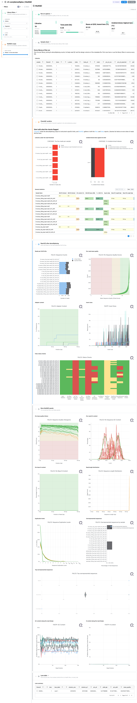
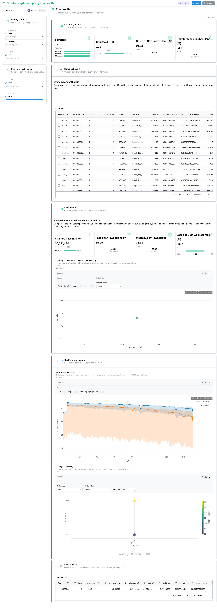
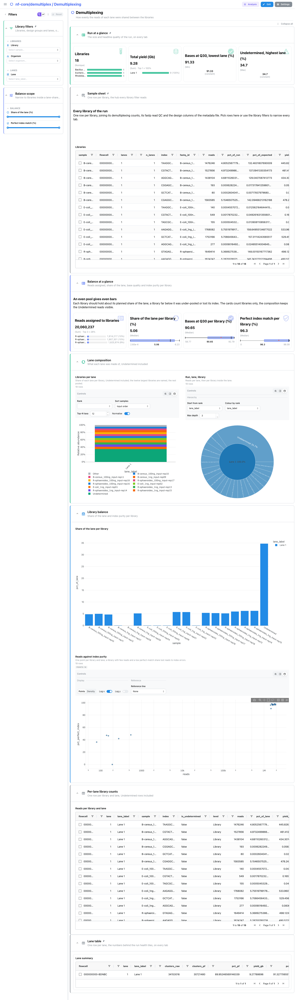
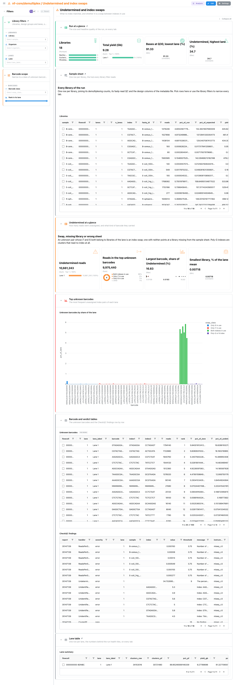
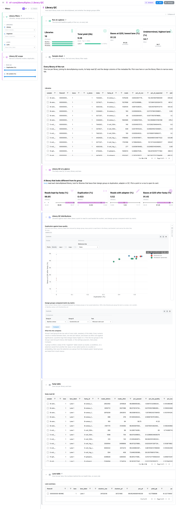

<div class="template-banner">
  <a class="template-banner-logo" href="https://nf-co.re/demultiplex" target="_blank" title="nf-core/demultiplex on nf-co.re">
    
    
  </a>
  <div class="template-banner-body">
    <h1 class="template-title">Demultiplexing QC</h1>
    <p class="template-subtitle">Sequencing-facility run sign-off: CheckQC verdicts, run health per lane and read, demultiplexing balance, undetermined reads and index swaps, and per-library read QC, next to the pipeline's own MultiQC report.</p>
    <p class="template-links">
      <a href="https://nf-co.re/demultiplex" target="_blank"><i class="mdi mdi-open-in-new"></i> nf-co.re</a>
      <a href="https://github.com/nf-core/demultiplex" target="_blank"><i class="mdi mdi-github"></i> GitHub</a>
    </p>
  </div>
  <span class="template-status-experimental template-banner-badge" data-tooltip="Experimental: shared as-is. Feedback and PRs welcome."><i class="mdi mdi-flask-outline"></i> Experimental</span>
</div>

<div class="tpl-version-pick" data-latest="1.8.0">
  <span class="tpl-version-icon"><i class="mdi mdi-source-branch"></i></span>
  <span class="tpl-version-label">Template version</span>
  <select id="tpl-version" class="tpl-version-select" aria-label="Template version">
    <option value="1.8.0" selected>1.8.0</option>
  </select>
  <span class="tpl-version-badge">latest</span>
</div>

The demultiplex template reads an nf-core/demultiplex run in the order a
sequencing facility signs a run off:

- :material-chart-box-outline: **MultiQC**: what CheckQC flagged, then the Falco and fastp read QC of the demultiplexed FASTQ files
- :material-stethoscope: **Run health**: whether the instrument delivered, per lane, per read and per cycle
- :material-chart-donut: **Demultiplexing**: how evenly the reads of each lane were shared between the libraries
- :material-alert-outline: **Undetermined and index swaps**: what no index matched, and whether it is a swap between indexes in use
- :material-test-tube: **Library QC**: how each library looks once demultiplexed, and whether the design groups differ

`Run at a glance` (libraries, total yield, lowest-lane Q30, highest-lane
Undetermined share) and the collapsed `Sample sheet` are pinned to the top of
every tab, the `Lane table` to the bottom, and the `Library filters` group
(library, design group, lane) applies everywhere.

!!! info "bcl2fastq by default, BCL Convert on request"
    The two demultiplexers write different reports: bcl2fastq a
    `Stats/Stats.json`, BCL Convert `Reports/Demultiplex_Stats.csv`,
    `Quality_Metrics.csv` and `Top_Unknown_Barcodes.csv`. The template reads
    bcl2fastq by default; `--var IS_BCLCONVERT=true` repoints the same four
    collections at BCL Convert recipes that write the same columns, so every tile
    renders unchanged. BCL Convert reports no raw cluster count, so the
    pass-filter rate stays empty on that route.

!!! note "Lanes and reads are rows, design comes from a file"
    Every run-level collection is one row per lane (and per read), so a one-lane
    benchtop run and a multi-lane production flowcell ingest through the same
    template. Design factors are never parsed out of library names: they come
    from an optional `METADATA_FILE`, and without it every library falls in a
    single group and every tile still renders.

---

## :material-rocket-launch-outline: Quick start

=== "Point at a finished run"

    ```bash
    depictio run \
      --template nf-core/demultiplex/latest \
      --data-root /path/to/demultiplex_results
    ```

    `--data-root` is the only thing you have to pass. To group libraries by a
    design factor, add a metadata TSV whose first column is the library name as
    written in the sample sheet:

    ```bash
    depictio run --template nf-core/demultiplex/latest \
      --data-root /path/to/demultiplex_results \
      --var METADATA_FILE=/path/to/library_metadata.tsv \
      --var GROUP_COL=organism
    ```

=== "From the pipeline itself (v1.10.0+)"

    ```bash
    depictio-cli config nextflow --install     # once per machine
    nextflow run nf-core/demultiplex -r 1.8.0 -profile docker --outdir results
    ```

    No `depictio run`, and no template named: the pipeline ingests its own
    output directory when it finishes and resolves this template from its own
    manifest. See [Nextflow trigger](../../depictio-cli/nextflow-trigger.md).

---

## :material-book-open-variant: Reference

The template reads the MultiQC report, the demultiplexer statistics of every
flowcell and lane, the CheckQC report, the fastp JSON of every library and,
when present, an Illumina InterOp summary table. A pipeline-local `libraries`
recipe joins them into one row per library, the hub of the library filters.
48 of its 79 components carry a `use:` catalog reference, so a tile says where
its panel comes from.

!!! info "Self-adapting layout"
    The dashboard adapts to whatever the run actually produced: components bound
    to pruned or unparsed data collections are hidden, tabs left with no real
    visualizations are dropped entirely, and the remaining components are
    re-packed so there are no empty rows.

<div class="tpl-version-block" data-version="1.8.0" markdown>

--8<-- "pipeline-templates/nf-core/_generated/demultiplex-latest.md"

</div>

---

## :material-view-dashboard-outline: Dashboard tabs

Five tabs, read as a funnel: what the checks flagged, whether the instrument
delivered, how the reads were shared, what went to Undetermined, and how each
library looks. Each tab below carries the **same icon and colour the dashboard
gives it**. The screenshots come from the run described under Validation runs
below.

=== "{ width=18 }{ width=18 } MultiQC"

    *What did CheckQC flag, and how do the demultiplexed FASTQ files look?*

    [{ loading=lazy }](../../images/pipeline-templates/nf-core/demultiplex/multiqc_light.png){ .tpl-shot target="_blank" rel="noopener" }

    The tab opens on the CheckQC verdicts: libraries under the read threshold, the
    Undetermined share against its limit, and the general statistics. Falco and
    fastp follow with reads per FASTQ file, per-read quality, adapter content and
    insert sizes. The remaining Falco and fastp panels are collapsed underneath.

    ??? abstract ":material-tune-variant: Filters and components"

        **Filters** · `Library`, the design group and `Lane` on the library hub,
        persistent on every tab, plus a `Reads, % of an even share` range in a
        *MultiQC scope* group.

        | Section | What it holds |
        |---|---|
        | Run at a glance | 4 cards, pinned |
        | Sample sheet | *Libraries* (collapsed, pinned) |
        | CheckQC verdicts | *Libraries under the read threshold*, *Undetermined share against its limit*, *General statistics* |
        | Read QC after demultiplexing | 5 MultiQC panels (Falco and fastp) |
        | More MultiQC panels | 9 MultiQC panels (collapsed) |
        | Lane table | *Lane summary* (collapsed, pinned to the bottom) |

=== ":material-stethoscope:{ .mc-teal } Run health"

    *Did the instrument deliver, per lane, per read and per cycle?*

    [{ loading=lazy }](../../images/pipeline-templates/nf-core/demultiplex/run_health_light.png){ .tpl-shot target="_blank" rel="noopener" }

    Cards report clusters passing filter, the lowest lane's pass-filter rate and
    mean quality, and the weakest read's Q30. A scatter places each lane by
    Undetermined share and base quality, a profile draws base quality per cycle, and
    a dot plot crosses lanes with reads. Selecting a lane on the lane table or the
    scatter narrows the tiles linked to it.

    ??? abstract ":material-tune-variant: Filters and components"

        **Filters** · `Read` and a `Cycle` range in a *Read and cycle scope*
        group, on this tab only.

        | Section | What it holds |
        |---|---|
        | Lane health | 4 cards, *Lanes by Undetermined share and base quality* |
        | Quality along the run | *Base quality per cycle*, *Lane by read quality* |
        | Sequencing Analysis Viewer metrics | 4 cards, *PhiX error rate per lane and read*, *Phasing against prephasing* |

    !!! tip "The SAV section needs an InterOp summary table"
        Error rate, phasing and cluster density live in the InterOp binaries,
        which Depictio does not parse. Run `interop_summary --csv=1 <run folder>`
        and drop the output anywhere under the run (any `.csv` whose name contains
        `interop_summary`); without it the section is hidden.

=== ":material-chart-donut:{ .mc-indigo } Demultiplexing"

    *How evenly were the reads of each lane shared between the libraries?*

    [{ loading=lazy }](../../images/pipeline-templates/nf-core/demultiplex/demultiplexing_light.png){ .tpl-shot target="_blank" rel="noopener" }

    An even pool gives even bars. The stacked composition shows what each lane was
    made of, Undetermined included, and the sunburst nests run, lane and library.
    The library balance section puts each library's share of the lane beside a
    scatter of reads against index purity, where a library with many imperfect
    index matches stands out; points and table rows select their library.

    ??? abstract ":material-tune-variant: Filters and components"

        **Filters** · `Share of the lane (%)` and `Perfect index match (%)` ranges
        in a *Balance scope* group, on this tab only.

        | Section | What it holds |
        |---|---|
        | Balance at a glance | 4 cards |
        | Lane composition | *Libraries per lane*, *Run, lane, library* |
        | Library balance | *Share of the lane per library*, *Reads against index purity* |
        | Per-lane library counts | *Reads per library and lane* (collapsed) |

=== ":material-alert-outline:{ .mc-orange } Undetermined and index swaps"

    *Is the Undetermined share an index swap, a missing library or a wrong sample sheet?*

    [{ loading=lazy }](../../images/pipeline-templates/nf-core/demultiplex/undetermined_and_index_swaps_light.png){ .tpl-shot target="_blank" rel="noopener" }

    Every unassigned index pair is split into its i7 and i5 and checked against the
    libraries of the same lane. *Both indexes in use* is the index-hopping or swap
    signature; *Only i7* or *Only i5 in use* often points to a mistyped index;
    *Neither index in use* to a library missing from the sheet or a contamination;
    *Poly-G or N index* to a failed index read. The bar chart ranks the top unknown
    barcodes by share of the lane, coloured by that class.

    ??? abstract ":material-tune-variant: Filters and components"

        **Filters** · `Barcode class` and a `Rank in its lane` range in a
        *Barcode scope* group, on this tab only.

        | Section | What it holds |
        |---|---|
        | Undetermined at a glance | 4 cards |
        | Top unknown barcodes | *Unknown barcodes by share of the lane* |
        | Barcode and verdict tables | *Unknown barcodes*, *CheckQC findings* (collapsed) |

=== ":material-test-tube:{ .mc-grape } Library QC"

    *Which library looks different from its group once demultiplexed?*

    [{ loading=lazy }](../../images/pipeline-templates/nf-core/demultiplex/library_qc_light.png){ .tpl-shot target="_blank" rel="noopener" }

    Cards summarise the fastp read QC of every library and lane. A scatter of
    duplication against base quality sits beside a linked `Library card`, which
    folds to a slim rail until a point is lassoed and then shows that library in
    full. The group comparison sets the design groups against each other metric by
    metric, which needs a `METADATA_FILE` to say anything.

    ??? abstract ":material-tune-variant: Filters and components"

        **Filters** · `Duplication (%)` and `GC content (%)` ranges in a
        *Library QC scope* group, on this tab only.

        | Section | What it holds |
        |---|---|
        | Library QC at a glance | 4 cards |
        | Library QC distributions | *Duplication against base quality*, *Library card*, *Design groups compared metric by metric* |
        | fastp table | *fastp read QC* (collapsed) |

---

## :material-play-circle-outline: Running the pipeline

Depictio reads the **output** of nf-core/demultiplex, it does not run the
pipeline. Run the pipeline first:

```bash
nextflow run nf-core/demultiplex -r 1.8.0 \
  --input samplesheet.csv \
  --demultiplexer bcl2fastq \
  --outdir results -profile docker
```

Then point Depictio at the results, adding `--var IS_BCLCONVERT=true` for a
`--demultiplexer bclconvert` run:

```bash
depictio run --template nf-core/demultiplex/latest --data-root results/
```

See [nf-co.re/demultiplex/usage](https://nf-co.re/demultiplex/1.8.0/docs/usage) for full pipeline documentation.

---

## :material-folder-open-outline: Required data structure

Point `--data-root` at the directory of one pipeline run. Depictio scans
recursively and matches on file name, so the flowcell and lane folder names can
differ from the tree below.

```text
<DATA_ROOT>/
├── <flowcell>/
│   ├── L<lane>/
│   │   ├── Stats/Stats.json                   # bcl2fastq statistics (default route)
│   │   ├── Reports/                           # or BCL Convert: Demultiplex_Stats.csv, Quality_Metrics.csv,
│   │   │                                      #   Top_Unknown_Barcodes.csv (IS_BCLCONVERT)
│   │   ├── checkqc_report.json                # CheckQC verdicts (optional)
│   │   └── *.fastp.json                       # fastp read QC, one per library (optional)
│   └── *interop_summary*.csv                  # optional, from interop_summary --csv=1
├── multiqc/multiqc_data/
│   └── multiqc.parquet                        # bcl2fastq, CheckQC, fastp, Falco
└── pipeline_info/
    ├── params_*.json
    └── *software*versions*.yml
```

`METADATA_FILE` is optional and can live anywhere: a TSV whose first column is
the library name, every other column a design factor. `GROUP_COL` picks the one
the tiles group by, the first annotation column otherwise.

---

## :material-flask-outline: Validation runs

The template was validated against the AWS megatest of the 1.8.0 release
(`results-daade37c4a75a4c1709ccf12434deb3424141319`, `test_full` profile: one
MiSeq flowcell, one lane, paired-end dual-index, demultiplexed with bcl2fastq),
and the screenshots above come from it, with the vendored
`input/library_metadata.tsv` grouping the libraries by organism. That run is a
useful stress case: several libraries got almost no reads and a large share of
the lane went to Undetermined, mostly swapped combinations of indexes in use.
The BCL Convert route and the SAV section were checked on MultiQC test-data
reports only. `megatest.yaml` lists the tables-only subset the template needs:

```bash
bash depictio/projects/nf-core/demultiplex/1.8.0/download_test_data.sh /tmp/demultiplex_test
depictio run --template nf-core/demultiplex/latest --data-root /tmp/demultiplex_test \
  --var METADATA_FILE=depictio/projects/nf-core/demultiplex/1.8.0/input/library_metadata.tsv
```

Do not pass `--project-name` when ingesting: the dashboard is attached to the
project by name, so renaming it breaks a later `depictio dashboard import`.
Re-ingesting accumulates dashboards, so delete the project before repeating a run.

---

## :material-link-variant: Additional resources

- [nf-co.re/demultiplex](https://nf-co.re/demultiplex): official pipeline documentation
- [nf-co.re/demultiplex/1.8.0/results](https://nf-co.re/demultiplex/1.8.0/results): AWS test results
- [Template System Reference](../../usage/projects/templates.md): YAML format, variables, conditionals
- [Recipes](../../usage/projects/recipes.md): how to read, test, and write recipes

---

## :material-account-group-outline: Authorship

<div class="tpl-credits">
  <div class="tpl-credit">
    <span class="tpl-credit-role"><i class="mdi mdi-code-braces"></i> Developers</span>
    <span class="tpl-credit-note">Wrote the template, its recipes and its dashboards.</span>
    <a class="tpl-person" href="https://github.com/weber8thomas" target="_blank" rel="noopener">
       weber8thomas
    </a>
  </div>
  <div class="tpl-credit">
    <span class="tpl-credit-role"><i class="mdi mdi-eye-check-outline"></i> Reviewers</span>
    <span class="tpl-credit-note">Nobody has run it on their own data and signed it off yet, which is what keeps it Experimental.</span>
    <span class="tpl-person"><i class="mdi mdi-account-plus-outline"></i> Open</span>
  </div>
  <div class="tpl-credit">
    <span class="tpl-credit-role"><i class="mdi mdi-wrench-outline"></i> Maintainers</span>
    <span class="tpl-credit-note">Keep it working as nf-core/demultiplex releases.</span>
    <a class="tpl-person" href="https://github.com/weber8thomas" target="_blank" rel="noopener">
       weber8thomas
    </a>
  </div>
</div>

Reviewing a template on your own data, or taking over a role here, is a
contribution in itself: the [contributing guide](../../developer/contributing-templates.md)
says what each one involves.
