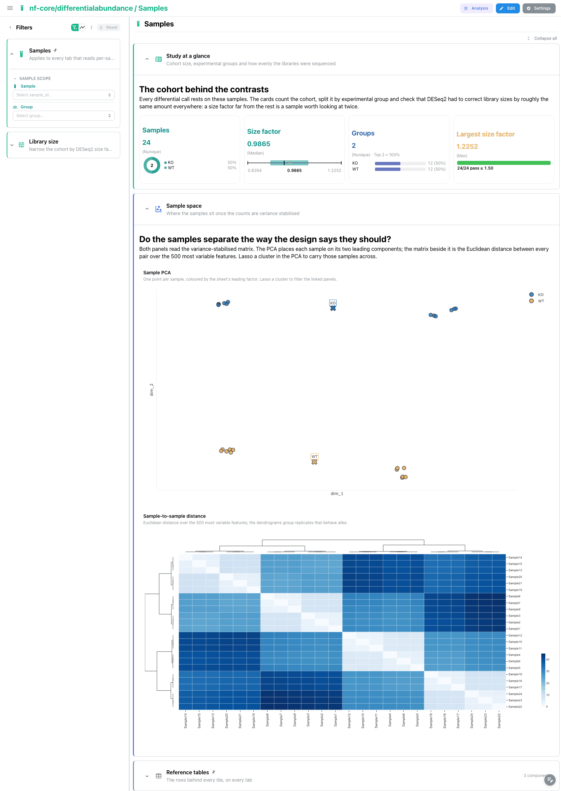
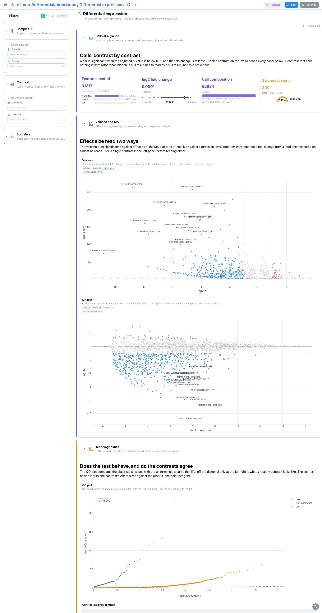
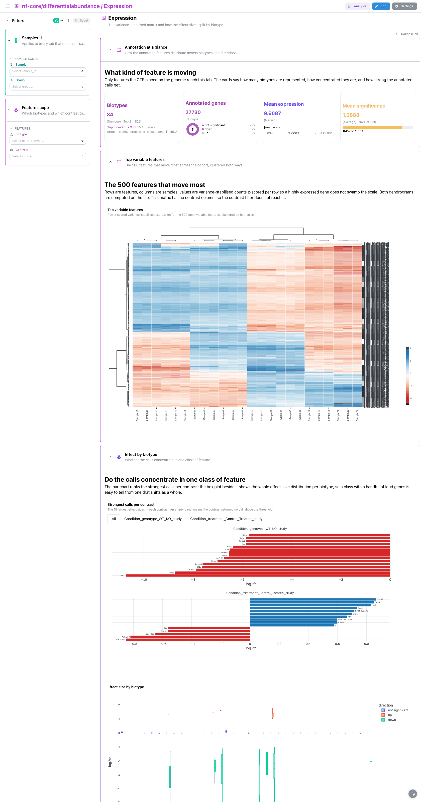
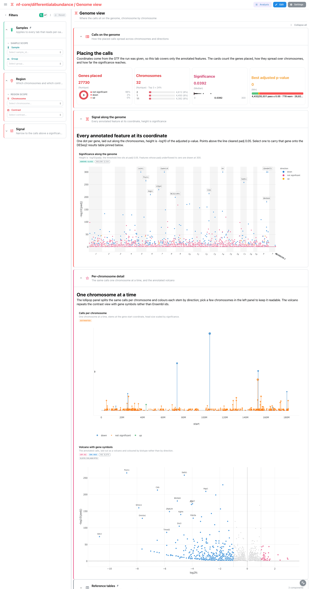

<div class="template-banner">
  <a class="template-banner-logo" href="https://nf-co.re/differentialabundance" target="_blank" title="nf-core/differentialabundance on nf-co.re">
    
    
  </a>
  <div class="template-banner-body">
    <h1 class="template-title">Differential Abundance</h1>
    <p class="template-subtitle">DESeq2 differential expression over a count matrix and a contrast sheet: per-contrast statistics, the gene annotation joined onto them, and the variance-stabilised sample space.</p>
    <p class="template-links">
      <a href="https://nf-co.re/differentialabundance" target="_blank"><i class="mdi mdi-open-in-new"></i> nf-co.re</a>
      <a href="https://github.com/nf-core/differentialabundance" target="_blank"><i class="mdi mdi-github"></i> GitHub</a>
    </p>
  </div>
  <span class="template-status-experimental template-banner-badge" data-tooltip="Experimental — shared as-is. Feedback and PRs welcome."><i class="mdi mdi-flask-outline"></i> Experimental</span>
</div>

The differentialabundance template covers the DESeq2 route of a standard
nf-core/differentialabundance run:

- :material-test-tube: **Sample space**: cohort census, DESeq2 size factors, sample PCA and the sample-to-sample distance matrix
- :material-chart-scatter-plot: **Per-contrast statistics**: volcano, MA and the test's own QQ diagnostic, one panel per contrast
- :material-chart-box-outline: **Expression**: the 500 most variable features clustered both ways, and effect size split by biotype
- :material-dna: **Genome view**: every annotated call at its coordinate, with a per-chromosome breakdown
- :material-table: **Reference tables**: the observation sheet and the full result set, pinned to the bottom of every tab

!!! info "The DESeq2 route only"
    This template binds `--differential_method deseq2`, the pipeline default. The
    limma, propd and dream routes write differently named tables and are not
    covered.

!!! note "No MultiQC tab"
    differentialabundance runs no MultiQC: its reporting is an R/shinyngs
    application, which is not parquet-backed and has nothing Depictio can read.
    The **Samples** tab carries the run-level quality read instead.

---

## Quick start

=== "Point at a finished run"

    ```bash
    depictio run \
      --template nf-core/differentialabundance/latest \
      --data-root /path/to/differentialabundance_results
    ```

    `--data-root` is the only thing you have to pass. The observation sheet is
    auto-detected from `{DATA_ROOT}/input/`; pass
    `--var SAMPLESHEET_FILE=...` to point somewhere else.

=== "From the pipeline itself (v1.10.0+)"

    ```bash
    depictio-cli config nextflow --install     # once per machine
    nextflow run nf-core/differentialabundance -profile docker --outdir results
    ```

    No `depictio run`, and no template named: the pipeline ingests its own
    output directory when it finishes and resolves this template from its own
    manifest. See [Nextflow trigger](../../depictio-cli/nextflow-trigger.md).

---

## :material-book-open-variant: Reference

The template reads the per-contrast DESeq2 tables, the same statistics joined to
the GTF annotation, the variance-stabilised matrix and the per-sample size
factors. Contrast ids are recovered from the result file names, so no contrast
variable is needed.

!!! info "Self-adapting layout"
    The dashboard adapts to whatever the run actually produced: components bound
    to pruned or unparsed data collections are hidden, tabs left with no real
    visualizations are dropped entirely, and the remaining components are
    re-packed so there are no empty rows.

=== ":material-tag-check-outline: 2.0.0 (latest)"

    --8<-- "pipeline-templates/nf-core/_generated/differentialabundance-latest.md"

---

## :material-view-dashboard-outline: Dashboard tabs

Four tabs, read as a funnel: is the experiment sound, what changed, how do the
samples separate on the features that moved, and where do the calls sit. Each tab
below carries the **same icon and colour the dashboard gives it**, so the page and
the app read alike. The `Samples` filter group is persistent and pinned to the top
of every tab, and `Reference tables` is pinned to the bottom of every tab.

=== ":material-test-tube:{ .mc-teal } Samples"

    *Is the experiment sound before any contrast is read?*

    [](../../images/pipeline-templates/nf-core/differentialabundance/samples_light.png){target="_blank" rel="noopener"}

    Cohort size split by group, the DESeq2 size-factor distribution and the
    largest size factor against a 1.5 ceiling, then the sample PCA on the 500
    most variable features beside the Euclidean distance matrix. Lassoing the PCA
    carries those samples to the distance matrix through the PCA's own outgoing
    link.

    ??? abstract ":material-tune-variant: Filters and components"

        **Filters** · `Sample` and `Group` on `samples`, persistent and pinned to
        the top of every tab, plus a `Size factor` range in a collapsed
        *Library size* group.

        | Section | What it holds |
        |---|---|
        | Study at a glance | 4 cards |
        | Sample space | *Sample PCA*, *Sample-to-sample distance* |
        | Reference tables | *Observation sheet*, *DESeq2 results* |

=== ":material-chart-scatter-plot:{ .mc-indigo } Differential expression"

    *Per-contrast DESeq2 statistics: volcano, MA and the test's own diagnostics.*

    [](../../images/pipeline-templates/nf-core/differentialabundance/differential_expression_light.png){target="_blank" rel="noopener"}

    Volcano and MA are cut at the pipeline's own thresholds (padj 0.05, two-fold
    change). The QQ plot goes against the uniform null, beside a scatter pairing
    the two contrasts gene by gene; selecting a point carries its `gene_id` to the
    annotated table and to the pinned results table.

    ??? abstract ":material-tune-variant: Filters and components"

        **Filters** · `Contrast` and `Direction` on `deseq2_results`, plus ranges
        on log2 fold change, significance and expression level in a collapsed
        *Statistics* group.

        | Section | What it holds |
        |---|---|
        | Calls at a glance | 4 cards |
        | Volcano and MA | *Volcano*, *MA plot* |
        | Test diagnostics | *QQ plot*, *Contrast against contrast* |
        | Gene table | *Annotated DESeq2 results* |

=== ":material-chart-box-outline:{ .mc-grape } Expression"

    *The variance-stabilised matrix, and how the effect sizes split by biotype.*

    [](../../images/pipeline-templates/nf-core/differentialabundance/expression_light.png){target="_blank" rel="noopener"}

    The 500 most variable features, row z-scored and clustered on both axes, then
    the 15 largest effect sizes per contrast beside a box plot of effect size
    within each biotype. Mean significance is gauged against the cut-off itself,
    `-log10(0.05)` = 1.301, which is what makes the bar readable.

    ??? abstract ":material-tune-variant: Filters and components"

        **Filters** · `Biotype` and `Contrast` on `deseq2_results_annotated`. The
        variance-stabilised matrix has no contrast column, so the contrast filter
        does not reach the heatmap.

        | Section | What it holds |
        |---|---|
        | Annotation at a glance | 4 cards |
        | Top variable features | *Top variable features* |
        | Effect by biotype | *Strongest calls per contrast*, *Effect size by biotype* |

=== ":material-dna:{ .mc-red } Genome view"

    *Where the calls sit on the genome, chromosome by chromosome.*

    [](../../images/pipeline-templates/nf-core/differentialabundance/genome_view_light.png){target="_blank" rel="noopener"}

    The Manhattan plot places every annotated feature at its coordinate with
    `-log10(padj)` as height and a threshold line at padj 0.05. The lollipop panel
    below splits the same calls one chromosome at a time; pick a few chromosomes
    in the filter panel to keep it readable.

    ??? abstract ":material-tune-variant: Filters and components"

        **Filters** · `Chromosome` and `Contrast` on
        `deseq2_results_annotated`, plus significance and log2 fold-change ranges
        in a collapsed *Signal* group.

        | Section | What it holds |
        |---|---|
        | Calls on the genome | 4 cards |
        | Signal along the genome | *Significance along the genome* |
        | Per-chromosome detail | *Calls per chromosome*, annotated volcano |

!!! tip "A contrast that found nothing still has to read as such"
    The reference run keeps a contrast with no significant calls on purpose. Its
    volcano is a symmetric cloud with no labelled points and its effect-size panel
    is empty, which is what an honest null result looks like rather than a broken
    dashboard.

---

## Running the pipeline

Depictio reads the **output** of nf-core/differentialabundance, it does not run
the pipeline. Run the pipeline first:

```bash
nextflow run nf-core/differentialabundance \
  --input samplesheet.csv \
  --contrasts contrasts.csv \
  --matrix counts.tsv \
  --gtf genome.gtf \
  -profile docker
```

Then point Depictio at the results:

```bash
depictio run --template nf-core/differentialabundance/latest \
  --data-root results/
```

See [nf-co.re/differentialabundance/usage](https://nf-co.re/differentialabundance/2.0.0/docs/usage)
for full pipeline documentation.

---

## Required data structure

Point `--data-root` at the directory holding the pipeline output. Depictio scans
recursively and matches on file name, so a run that nests its tables one level
deeper (as the reference megatest does, having been launched with two parameter
sets at once) binds identically.

```text
<DATA_ROOT>/
├── input/                                     # --var SAMPLESHEET_FILE (auto-detected)
│   └── samplesheet.tsv
├── pipeline_info/
│   ├── params.json
│   └── software_versions.yml
├── tables/
│   ├── differential/
│   │   ├── <contrast>.deseq2.results.tsv       # per-contrast statistics
│   │   └── <contrast>_deseq2.annotated.tsv     # the same, joined to the GTF
│   └── processed_abundance/
│       └── all.vst.tsv                         # variance-stabilised matrix
└── other/
    └── deseq2/
        └── <contrast>.deseq2.sizefactors.tsv   # library-size normalisation
```

---

## Test data

The repository ships
[`download_test_data.sh`](https://github.com/depictio/depictio/blob/main/depictio/projects/nf-core/differentialabundance/2.0.0/download_test_data.sh),
which fetches the subset of nf-core's AWS megatest run that the template needs:

```bash
bash depictio/projects/nf-core/differentialabundance/2.0.0/download_test_data.sh \
  /tmp/differentialabundance_test
```

The run is
`s3://nf-core-awsmegatests/differentialabundance/results-30ed7741fc392127156c2fb10cfa3d69d216b54b/`:
24 mouse RNA-seq samples over two contrasts. The observation sheet and the
contrasts file live outside the results prefix; `post_fetch_help` in
`megatest.yaml` next to the script gives the two `curl` commands that put them
under `input/`.

Then run Depictio against it:

```bash
depictio run \
  --template nf-core/differentialabundance/latest \
  --data-root /tmp/differentialabundance_test
```

---

## Additional resources

- [nf-co.re/differentialabundance](https://nf-co.re/differentialabundance): official pipeline documentation
- [nf-co.re/differentialabundance/2.0.0/results](https://nf-co.re/differentialabundance/2.0.0/results): AWS test results
- [Template System Reference](../../usage/projects/templates.md): YAML format, variables, conditionals
- [Recipes](../../usage/projects/recipes.md): how to read, test, and write recipes
