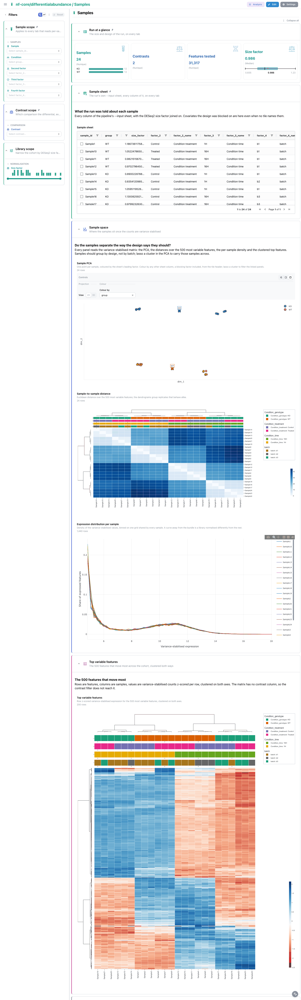
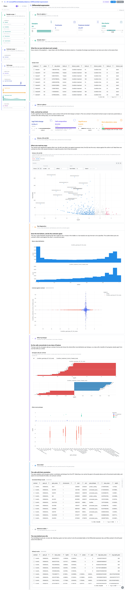
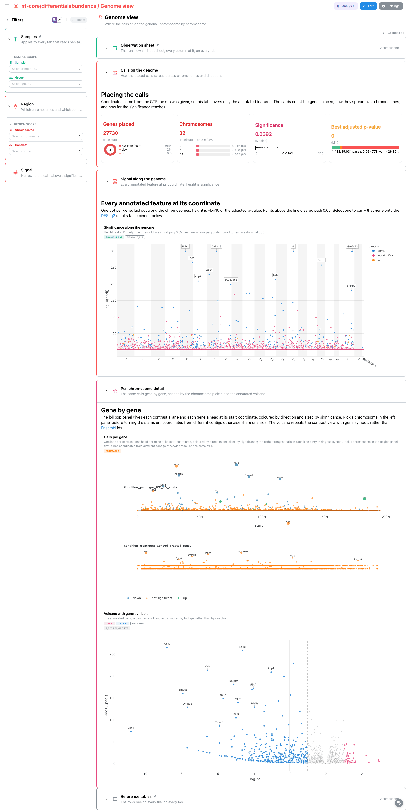

<div class="template-banner">
  <a class="template-banner-logo" href="https://nf-co.re/differentialabundance" target="_blank" title="nf-core/differentialabundance on nf-co.re">
    
    
  </a>
  <div class="template-banner-body">
    <h1 class="template-title">Differential Abundance</h1>
    <p class="template-subtitle">DESeq2 differential expression over a count matrix and a contrast sheet: per-contrast statistics, the gene annotation joined onto them, and the variance-stabilised sample space.</p>
    <p class="template-links">
      <a href="https://nf-co.re/differentialabundance" target="_blank"><i class="mdi mdi-open-in-new"></i> nf-co.re</a>
      <a href="https://github.com/nf-core/differentialabundance" target="_blank"><i class="mdi mdi-github"></i> GitHub</a>
    </p>
  </div>
  <span class="template-status-experimental template-banner-badge" data-tooltip="Experimental: shared as-is. Feedback and PRs welcome."><i class="mdi mdi-flask-outline"></i> Experimental</span>
</div>

<div class="tpl-version-pick" data-latest="2.0.0">
  <span class="tpl-version-icon"><i class="mdi mdi-source-branch"></i></span>
  <span class="tpl-version-label">Template version</span>
  <select id="tpl-version" class="tpl-version-select" aria-label="Template version">
    <option value="2.0.0" selected>2.0.0</option>
  </select>
  <span class="tpl-version-badge">latest</span>
</div>

The differentialabundance template covers the DESeq2 route of a standard
nf-core/differentialabundance run:

- :material-compass-outline: **Overview**: the run in four key figures, live findings and four figures, each linked to the tab that explains it
- :material-flask-outline: **Data & QC**: the sample space, DESeq2 size factors, the expression distribution per sample and the most variable features
- :material-chart-scatter-plot: **Differential**: volcano with MA and QQ views per contrast, test diagnostics, effect size by biotype, and every annotated call on the genome
- :material-set-merge: **Gene sets**: GSEA enrichment per contrast and pole (needs a GSEA run)

!!! info "The DESeq2 route only"
    This template binds `--differential_method deseq2`, the pipeline default. The
    limma, propd and dream routes write differently named tables and are not
    covered.

!!! note "No MultiQC tab"
    differentialabundance runs no MultiQC: its reporting is an R/shinyngs
    application, which is not parquet-backed and has nothing Depictio can read.
    The **Samples** tab carries the run-level quality read instead.

---

## :material-rocket-launch-outline: Quick start

=== "Point at a finished run"

    ```bash
    depictio ingest /path/to/differentialabundance_results \
      --template nf-core/differentialabundance/latest
    ```

    The results directory is the only thing you have to pass. The observation sheet is
    auto-detected from `{DATA_ROOT}/input/`; pass
    `--var SAMPLESHEET_FILE=...` to point somewhere else.

    GSEA is opt-in in the pipeline. For a run that did not run it, add
    `--var NO_GSEA=true`: the two enrichment collections are pruned and the
    Enrichment tab drops out instead of scanning for tables that were never
    written.

    | Variable | Required | Meaning |
    |---|---|---|
    | `DATA_ROOT` | yes | The run's output directory (`tables/`, `other/`, `pipeline_info/`) |
    | `SAMPLESHEET_FILE` | no | The pipeline's `--input` observation sheet, CSV or TSV; auto-detected from `{DATA_ROOT}/input/` |
    | `NO_GSEA` | no | Set for a run without GSEA; prunes the Enrichment tab |

=== "From the pipeline itself (v1.10.0+)"

    ```bash
    depictio config nextflow --install     # once per machine
    nextflow run nf-core/differentialabundance -r 2.0.0 -profile docker --outdir results
    ```

    No `depictio ingest`, and no template named: the pipeline ingests its own
    output directory when it finishes and resolves this template from its own
    manifest. See [Nextflow trigger](../../depictio-cli/nextflow-trigger.md).

---

## :material-book-open-variant: Reference

The template reads the per-contrast DESeq2 tables, the same statistics joined to
the GTF annotation, the variance-stabilised matrix and the per-sample size
factors. Contrast ids are recovered from the result file names, so no contrast
variable is needed.

!!! info "Self-adapting layout"
    The dashboard adapts to whatever the run actually produced: components bound
    to pruned or unparsed data collections are hidden, tabs left with no real
    visualizations are dropped entirely, and the remaining components are
    re-packed so there are no empty rows.

<div class="tpl-version-block" data-version="2.0.0" markdown>

--8<-- "pipeline-templates/nf-core/_generated/differentialabundance-latest.md"

</div>

---

## :material-view-dashboard-outline: Dashboard tabs

One dashboard: the **Overview**, then four child tabs in three groups, read as a
funnel from the samples to the gene sets that move. Each tab below carries the
**same icon and colour the dashboard gives it**, so the page and the app read
alike.

| Group | Tabs |
|---|---|
| Data & QC | Samples |
| Differential | Differential expression, Genome view |
| Gene sets | Enrichment |

Each child tab opens with a short intro and a strip of four cards, then at most
three open sections; tables and details follow, collapsed. Two persistent filter
sections sit in the left panel. *Sample filters* (the group, the sample and three
further factors) narrow the Samples tab and the sample sheet: a contrast pools its
samples, so the differential tables have no sample column. *Contrast* narrows the
three analysis tabs, and one pick follows you from tab to tab. The *Sample sheet*
is pinned, collapsed, to the bottom of every child tab.

=== ":material-compass-outline: Overview"

    *DESeq2 differential expression, from sample space to the gene sets that move.*

    <!-- screenshot pending v2 -->

    A short hero links the run parameters. *About this dashboard* says how to move
    through the tabs, *The run* lists the samples, the contrasts, the test, the
    cut-offs and the gene sets GSEA scored, and *Pipeline* walks the five steps
    from the sample sheet to enrichment, each linked to its parameters and its
    tab. The findings are live values: they follow the filters, and a run without
    a GTF or GSEA drops the rows it cannot fill.

    ??? abstract ":material-tune-variant: Filters and components"

        **Filters** · the left panel starts collapsed. *Key figures* and
        *Findings* each have a filter bar (the group and the contrast) that
        narrows that section only.

        | Section | What it holds |
        |---|---|
        | Top | Hero, *About this dashboard*, *The run*, *Pipeline* |
        | Key figures | 4 headline cards: samples, size factor, gene tests, significant calls |
        | Findings | Live result rows, then 4 figures: the volcano, the sample PCA, the Manhattan plot and the GSEA dot plot |
        | How to read this dashboard | The tabs by group, each with its question |

=== ":material-flask-outline:{ .mc-teal } Samples"

    **Data & QC** · *Do the samples separate by design, and are they normalised alike?*

    <!-- screenshot pending v2 -->

    [{ loading=lazy }](../../images/pipeline-templates/nf-core/differentialabundance/samples_light.png){ .tpl-shot target="_blank" rel="noopener" }

    The samples by group, the DESeq2 size factor, the median variance-stabilised
    expression per sample and the share of features at the matrix floor. Then the
    PCA above the sample-to-sample distance heatmap; a lasso on the PCA carries
    those samples to the other panels. Then the expression distribution of every
    sample on one grid, where a curve out of the bundle is a library normalised
    differently, and the most variable features, clustered both ways.

    ??? abstract ":material-tune-variant: Filters and components"

        **Filters** · a `Size factor` range on `samples`, plus the sample filters.

        | Section | What it holds |
        |---|---|
        | Samples at a glance | 4 cards |
        | Sample relationships | 2 advanced visualizations |
        | Normalisation | 1 advanced visualization |
        | Top variable features | 1 advanced visualization |

=== ":material-chart-scatter-plot:{ .mc-indigo } Differential expression"

    **Differential** · *Which genes change in each contrast, and can the test be trusted?*

    [{ loading=lazy }](../../images/pipeline-templates/nf-core/differentialabundance/differential_expression_light.png){ .tpl-shot target="_blank" rel="noopener" }

    Pick a contrast first. The gene tests that kept an adjusted p-value, the
    significant calls by direction, the median log2 fold change and the median
    adjusted p-value. Then the volcano, cut at the pipeline's thresholds, whose
    View switch reads the same calls as an MA or a QQ plot. The test diagnostics
    (raw p-values, one contrast against another) and the strongest calls and
    effect sizes per biotype follow; the annotated table, with a gene record for
    the row you pick, and the full DESeq2 table are collapsed.

    ??? abstract ":material-tune-variant: Filters and components"

        **Filters** · `Direction`, and log2 fold change, significance and
        expression-level ranges on `deseq2_results`; `Biotype` on
        `deseq2_results_annotated`; plus the persistent `Contrast`.

        | Section | What it holds |
        |---|---|
        | Calls at a glance | 4 cards |
        | Volcano, MA and QQ | 1 advanced visualization |
        | Test diagnostics | *Raw p-value distribution*, *Contrast against contrast* |
        | Effect by biotype | 1 advanced visualization + *Effect size by biotype* |
        | Gene detail (collapsed) | *Annotated DESeq2 results* + a gene record card |
        | All results (collapsed) | *DESeq2 results* |

=== ":material-dna:{ .mc-red } Genome view"

    **Differential** · *Where on the genome do the calls sit?*

    [{ loading=lazy }](../../images/pipeline-templates/nf-core/differentialabundance/genome_view_light.png){ .tpl-shot target="_blank" rel="noopener" }

    Needs the run's GTF. The gene tests the annotation places, the placed calls by
    chromosome, the call strength and the biotypes the up and down calls reach.
    Then the Manhattan plot, with a threshold line at padj 0.05, and the lollipop
    panel, one lane per contrast and one head per gene. Pick a chromosome on the
    left before reading the lollipop.

    ??? abstract ":material-tune-variant: Filters and components"

        **Filters** · `Chromosome`, and significance and log2 fold-change ranges,
        on `deseq2_results_annotated`, plus the persistent `Contrast`.

        | Section | What it holds |
        |---|---|
        | Genome at a glance | 4 cards |
        | Signal along the genome | 1 advanced visualization |
        | Per-chromosome detail | 1 advanced visualization |

=== ":material-set-merge:{ .mc-orange } Enrichment"

    **Gene sets** · *Which gene sets move in each contrast, and at which pole?*

    <!-- screenshot pending v2 -->

    Needs a GSEA run. The set reports by pole, the strongest absolute normalised
    enrichment score, the median FDR and the median leading-edge share of each set.
    Then the dot plot of every set on its normalised enrichment score, sized by the
    genes found, and the same scores as bars grouped by contrast, which shows
    whether a set moved in one comparison or in both.

    ??? abstract ":material-tune-variant: Filters and components"

        **Filters** · `Pole`, and significance and set-size ranges, on
        `gsea_report`, plus the persistent `Contrast`.

        | Section | What it holds |
        |---|---|
        | Enrichment at a glance | 4 cards |
        | Enriched sets | 1 advanced visualization |
        | Scores side by side | 1 advanced visualization |
        | Set table (collapsed) | *GSEA report* |

!!! tip "A contrast that found nothing still has to read as such"
    A contrast with no significant calls keeps its place. Its volcano is a
    symmetric cloud with no labelled points and its effect-size panel is empty,
    which is what an honest null result looks like rather than a broken
    dashboard.

Tables and point views select on their entity column: the sample sheet and the
PCA on `sample_id`, which narrows the distance matrix, the heatmap and the
distribution panel; the results tables, the contrast-against-contrast scatter and
the Manhattan panel on `gene_id`; the GSEA table on `term`. A pick narrows the
other tiles of its collection and follows the project links to the collections
they reach. The distribution panel does not select: its collection has no
outgoing link.

---

## :material-play-circle-outline: Running the pipeline

Depictio reads the **output** of nf-core/differentialabundance, it does not run
the pipeline. Run the pipeline first:

```bash
nextflow run nf-core/differentialabundance -r 2.0.0 \
  --input samplesheet.csv \
  --contrasts contrasts.csv \
  --matrix counts.tsv \
  --gtf genome.gtf \
  --functional_method gsea --gene_sets_files gene_sets.gmt \
  --outdir results -profile docker
```

Leave out the two GSEA flags to skip enrichment, and pass `--var NO_GSEA=true` to
Depictio for that run.

Then point Depictio at the results:

```bash
depictio ingest results/ \
  --template nf-core/differentialabundance/latest
```

See [nf-co.re/differentialabundance/usage](https://nf-co.re/differentialabundance/2.0.0/docs/usage)
for full pipeline documentation.

---

## :material-folder-open-outline: Required data structure

Point `depictio ingest` at the directory holding the pipeline output. Depictio scans
recursively and matches on file name, so a run that nests its tables one level
deeper (as the reference megatest does, having been launched with two parameter
sets at once) binds identically.

```text
<DATA_ROOT>/
├── input/                                     # --var SAMPLESHEET_FILE (auto-detected)
│   └── samplesheet.tsv
├── pipeline_info/
│   ├── params.json
│   └── software_versions.yml
├── tables/
│   ├── differential/
│   │   ├── <contrast>.deseq2.results.tsv       # per-contrast statistics
│   │   └── <contrast>_deseq2.annotated.tsv     # the same, joined to the GTF
│   ├── processed_abundance/
│   │   └── all.vst.tsv                         # variance-stabilised matrix
│   └── gsea/<contrast>/
│       └── *.gsea_report_for_<pole>.tsv        # optional, one per pole
└── other/
    └── deseq2/
        └── <contrast>.deseq2.sizefactors.tsv   # library-size normalisation
```

---

## :material-flask-outline: Validation runs

The repository ships
[`download_test_data.sh`](https://github.com/depictio/depictio/blob/main/depictio/projects/nf-core/differentialabundance/2.0.0/download_test_data.sh),
which fetches the subset of nf-core's AWS megatest run that the template needs:

```bash
bash depictio/projects/nf-core/differentialabundance/2.0.0/download_test_data.sh \
  /tmp/differentialabundance_test
```

The run is
`s3://nf-core-awsmegatests/differentialabundance/results-30ed7741fc392127156c2fb10cfa3d69d216b54b/`:
24 mouse RNA-seq samples over two contrasts. The observation sheet and the
contrasts file live outside the results prefix; `post_fetch_help` in
`megatest.yaml` next to the script gives the two `curl` commands that put them
under `input/`. The pinned prefix publishes no `tables/gsea/`, so the GSEA
reports behind the Enrichment tab screenshot come from a sibling prefix of the
same pipeline; the fetch command is in the `megatest.yaml` header.

Then run Depictio against it:

```bash
depictio ingest /tmp/differentialabundance_test \
  --template nf-core/differentialabundance/latest
```

---

## :material-link-variant: Additional resources

- [nf-co.re/differentialabundance](https://nf-co.re/differentialabundance): official pipeline documentation
- [nf-co.re/differentialabundance/2.0.0/results](https://nf-co.re/differentialabundance/2.0.0/results): AWS test results
- [Template System Reference](../../usage/projects/templates.md): YAML format, variables, conditionals
- [Recipes](../../usage/projects/recipes.md): how to read, test, and write recipes

---

## :material-account-group-outline: Authorship

<div class="tpl-credits">
  <div class="tpl-credit">
    <span class="tpl-credit-role"><i class="mdi mdi-code-braces"></i> Developers</span>
    <span class="tpl-credit-note">Wrote the template, its recipes and its dashboards.</span>
    <a class="tpl-person" href="https://github.com/weber8thomas" target="_blank" rel="noopener">
       weber8thomas
    </a>
  </div>
  <div class="tpl-credit">
    <span class="tpl-credit-role"><i class="mdi mdi-eye-check-outline"></i> Reviewers</span>
    <span class="tpl-credit-note">Nobody has run it on their own data and signed it off yet, which is what keeps it Experimental.</span>
    <span class="tpl-person"><i class="mdi mdi-account-plus-outline"></i> Open</span>
  </div>
  <div class="tpl-credit">
    <span class="tpl-credit-role"><i class="mdi mdi-wrench-outline"></i> Maintainers</span>
    <span class="tpl-credit-note">Keep it working as nf-core/differentialabundance releases.</span>
    <a class="tpl-person" href="https://github.com/weber8thomas" target="_blank" rel="noopener">
       weber8thomas
    </a>
  </div>
</div>

Reviewing a template on your own data, or taking over a role here, is a
contribution in itself: the [contributing guide](../../developer/contributing-templates.md)
says what each one involves.
