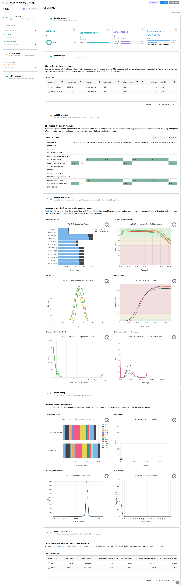
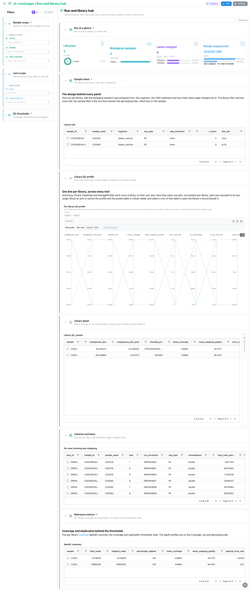
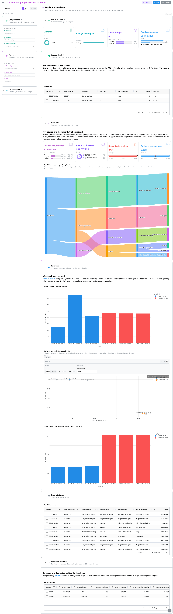
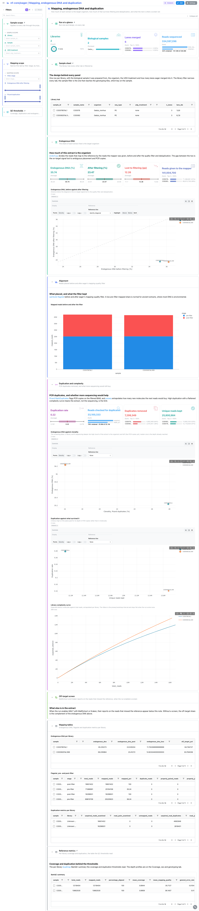
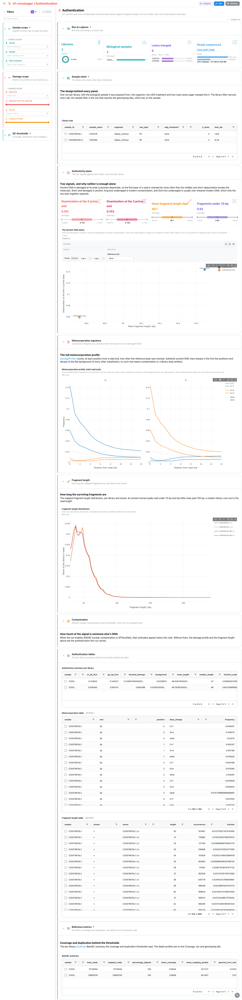
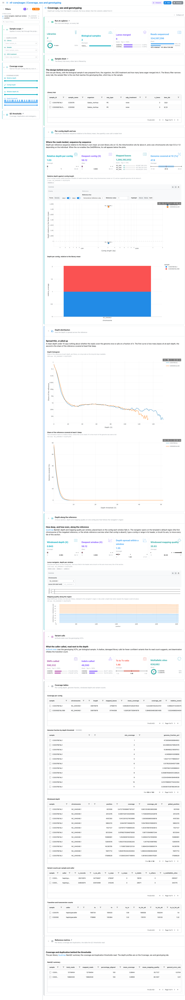

<div class="template-banner">
  <a class="template-banner-logo" href="https://nf-co.re/eager" target="_blank" title="nf-core/eager on nf-co.re">
    
    
  </a>
  <div class="template-banner-body">
    <h1 class="template-title">Ancient DNA</h1>
    <p class="template-subtitle">Ancient-DNA QC from trimming and collapsing to endogenous content, the deamination and fragment-length signals that authenticate a library, coverage and genotypes, next to the pipeline's MultiQC report.</p>
    <p class="template-links">
      <a href="https://nf-co.re/eager" target="_blank"><i class="mdi mdi-open-in-new"></i> nf-co.re</a>
      <a href="https://github.com/nf-core/eager" target="_blank"><i class="mdi mdi-github"></i> GitHub</a>
    </p>
  </div>
  <span class="template-status-draft template-banner-badge" data-tooltip="Draft: generated and not yet reviewed. Expect it to need fixes before it is usable."><i class="mdi mdi-pencil-outline"></i> Draft</span>
</div>

<div class="tpl-version-pick" data-latest="2.4.5">
  <span class="tpl-version-icon"><i class="mdi mdi-source-branch"></i></span>
  <span class="tpl-version-label">Template version</span>
  <select id="tpl-version" class="tpl-version-select" aria-label="Template version">
    <option value="2.4.5" selected>2.4.5</option>
  </select>
  <span class="tpl-version-badge">latest</span>
</div>

The eager template follows an nf-core/eager run from raw lanes to genotypes, one
question per tab:

- :material-chart-box-outline: **MultiQC**: FastQC, AdapterRemoval and bcftools panels from the run's MultiQC report, with its general statistics
- :material-table-account: **Run and library hub**: every library, the lanes merged into it, and all of its QC numbers on one set of axes
- :material-relation-many-to-many: **Reads and read fate**: where each sequenced read stops, from trimming and collapsing to deduplication
- :material-chart-bar: **Mapping, endogenous DNA and duplication**: how much of each extract is the target organism, and how much of it survives filtering
- :material-dna: **Authentication**: terminal deamination against fragment length, the signals that say whether the DNA is ancient
- :material-waves: **Coverage, sex and genotyping**: depth per contig, the depth distribution, a locus navigator and the variants called

A `Run at a glance` strip, the `Sample scope` filters and the collapsed library
sheet are pinned to the top of every tab, and a collapsed `QC thresholds` group
with the BamQC reference table to the bottom, so a coverage, duplication or
endogenous-DNA floor narrows the library hub and, through it, every tab.

!!! warning "The MultiQC report must be regenerated"
    eager 2.4.5 ships MultiQC 1.13, which writes no parquet, and Depictio reads
    only `multiqc.parquet` (MultiQC 1.31 and later). Re-run MultiQC over the
    run's own tool outputs before ingesting, or the MultiQC tab stays empty:

    ```bash
    python -m depictio.dev_scripts.multiqc_reprocess --src <outdir> --dest <outdir>
    ```

!!! info "Copy the `--input` TSV under `input/`"
    eager 2.x does not publish the samplesheet it was launched with. The library
    hub and the per-lane table read any `input/*.tsv` under the data root, so copy
    the TSV there (several are concatenated, one per batch).

!!! note "Optional branches appear when the run enabled them"
    Sex.DetERRmine, MTNucRatio, ANGSD nuclear contamination, MaltExtract and
    Kraken are optional collections, each bound to one table. A run that did not
    enable the branch ingests without it, and its section keeps only the short
    note that explains what would be there.

---

## :material-rocket-launch-outline: Quick start

=== "Point at a finished run"

    ```bash
    depictio run \
      --template nf-core/eager/latest \
      --data-root /path/to/eager_results
    ```

    `--data-root` is the only thing you have to pass, once the `--input` TSV is
    copied under `input/` and the MultiQC report regenerated. `SHORT_FRAGMENT_BP`
    (default `70`) sets the short-fragment cut-off the Authentication tab counts:

    ```bash
    depictio run --template nf-core/eager/latest \
      --data-root /path/to/eager_results \
      --var SHORT_FRAGMENT_BP=50
    ```

=== "From the pipeline itself (v1.10.0+)"

    ```bash
    depictio-cli config nextflow --install     # once per machine
    nextflow run nf-core/eager -r 2.4.5 -profile docker --outdir results
    ```

    No `depictio run`, and no template named: the pipeline ingests its own
    output directory when it finishes and resolves this template from its own
    manifest. The samplesheet copy and the MultiQC regeneration above still
    apply. See [Nextflow trigger](../../depictio-cli/nextflow-trigger.md).

---

## :material-book-open-variant: Reference

The template reads the run's `--input` TSV, the regenerated MultiQC report and the
tool tables behind it: AdapterRemoval, samtools flagstat, endorS.py, Picard
MarkDuplicates, preseq, DamageProfiler, Qualimap BamQC and bcftools stats. 59 of
its 84 tiles carry a `use:` catalog reference, so a tile says where its panel
comes from. Every file is matched on its name, never on the per-library directory
around it.

!!! info "Self-adapting layout"
    The dashboard adapts to whatever the run actually produced: components bound
    to pruned or unparsed data collections are hidden, tabs left with no real
    visualizations are dropped entirely, and the remaining components are
    re-packed so there are no empty rows.

<div class="tpl-version-block" data-version="2.4.5" markdown>

--8<-- "pipeline-templates/nf-core/_generated/eager-latest.md"

</div>

---

## :material-view-dashboard-outline: Dashboard tabs

Six tabs, read as a funnel: is the report normal, how do the libraries compare,
where do the reads go, how much of each extract is the organism, is it ancient,
and what does the coverage support. Each tab below carries the **same icon and
colour the dashboard gives it**. A picked row or point becomes a filter that
follows the project links to the tiles it reaches.

=== "{ width=18 }{ width=18 } MultiQC"

    *Read the report module by module.*

    [{ loading=lazy }](../../images/pipeline-templates/nf-core/eager/multiqc_light.png){ .tpl-shot target="_blank" rel="noopener" }

    The tab holds only the MultiQC panels no other tile redraws from a tool
    table: the general statistics with endorS.py's endogenous DNA share, FastQC
    on the raw lanes, the AdapterRemoval collapsed-read length, and the four
    bcftools variant panels. Every panel with a tile twin elsewhere (flagstat,
    Picard, preseq, DamageProfiler, Qualimap) was left to that tile.

    ??? abstract ":material-tune-variant: Filters and components"

        **Filters** · `Library`, `Sample` and `UDG treatment` on the library hub,
        persistent and pinned to the top of every tab; `Mean coverage`,
        `Duplication rate` and `Endogenous DNA` ranges in the collapsed
        *QC thresholds* group pinned to the bottom; plus a tab-local
        `Report sample`.

        | Section | What it holds |
        |---|---|
        | Run at a glance | 4 cards: libraries, biological samples, lanes merged, reads sequenced |
        | Sample sheet | *Library hub* |
        | MultiQC overview | *General statistics* |
        | Read quality and trimming | 5 FastQC panels, *Collapsed-read length distribution* |
        | Variant calling | 4 bcftools panels |
        | Reference metrics | *BamQC summary* |

=== ":material-table-account:{ .mc-teal } Run and library hub"

    *Compare every library on every tool at once.*

    [{ loading=lazy }](../../images/pipeline-templates/nf-core/eager/run_and_library_hub_light.png){ .tpl-shot target="_blank" rel="noopener" }

    One row per library pools endorS.py, Picard, Qualimap and DamageProfiler, and
    a parallel-coordinates panel draws each library as one line across those axes,
    each rescaled to its own range. Below it the pooled table sits beside a linked
    `Library record` card, which folds to a slim rail until a row is picked and
    then opens that library field by field.

    ??? abstract ":material-tune-variant: Filters and components"

        **Filters** · `Lane` and `Sequencing run` on the per-lane table.

        | Section | What it holds |
        |---|---|
        | Library QC profile | *Per-library QC profile* (parallel coordinates) |
        | Library detail | *Library QC, pooled*, with the linked *Library record* |
        | Libraries and lanes | *Per-lane trimming and collapsing* (collapsed) |

=== ":material-relation-many-to-many:{ .mc-grape } Reads and read fate"

    *See where every read stops, from trimming to deduplication.*

    [{ loading=lazy }](../../images/pipeline-templates/nf-core/eager/reads_and_read_fate_light.png){ .tpl-shot target="_blank" rel="noopener" }

    A Sankey chains AdapterRemoval, samtools flagstat and Picard into one flow
    per library, five stages with the reads that fall out at each. The accounting
    is exact: the reads AdapterRemoval retains over a library's lanes equal the
    pre-filter flagstat total, so nothing is apportioned. `Lane yield` then shows
    what each lane returned and how its collapse rate relates to retained length.

    ??? abstract ":material-tune-variant: Filters and components"

        **Filters** · `Trimming outcome` and `Final fate` on the read fate, plus
        `Lane`, which narrows the per-lane tiles only.

        | Section | What it holds |
        |---|---|
        | Read fate | 4 cards, *Read fate, sequencing to deduplication* |
        | Lane yield | *Reads kept for mapping, per lane*, *Collapse rate against retained length*, *Share of reads discarded on quality or length, per lane* |
        | Read fate tables | *Read fate, as counts* (collapsed) |

=== ":material-chart-bar:{ .mc-indigo } Mapping, endogenous DNA and duplication"

    *Measure the endogenous share, the duplication and the remaining complexity.*

    [{ loading=lazy }](../../images/pipeline-templates/nf-core/eager/mapping_endogenous_dna_and_duplication_light.png){ .tpl-shot target="_blank" rel="noopener" }

    endorS.py gives the endogenous share before and after the mapping-quality
    filter, and the scatter of one against the other puts the on-target signal
    lost to filtering below the diagonal. `Duplication and complexity` reads
    Picard next to the preseq extrapolation, with endogenous DNA against clonality
    between them, to say whether more sequencing would still buy unique reads.
    `Off-target screen` holds the MaltExtract and Kraken reports when a screen ran.

    ??? abstract ":material-tune-variant: Filters and components"

        **Filters** · `Filter stage` on flagstat, an `Endogenous DNA after
        filtering` range and a `Picard duplication` range.

        | Section | What it holds |
        |---|---|
        | Endogenous DNA | 4 cards, *Endogenous DNA, before against after filtering* |
        | Alignment | *Mapped reads before and after the filter* |
        | Duplication and complexity | 4 cards, *Endogenous DNA against clonality*, *Duplication against what survived it*, *Library complexity curve* |
        | Off-target screen | *MaltExtract authentication overview*, *Kraken classification* (optional) |
        | Mapping tables | endorS.py, flagstat and Picard tables (collapsed) |

=== ":material-dna:{ .mc-red } Authentication"

    *Establish whether the DNA is ancient, and how contaminated.*

    [{ loading=lazy }](../../images/pipeline-templates/nf-core/eager/authentication_light.png){ .tpl-shot target="_blank" rel="noopener" }

    The authenticity plane puts terminal deamination against fragment length, one
    point per library: short and damaged reads as ancient, long and undamaged as
    modern contamination, short but undamaged as over-sheared modern DNA. The full
    DamageProfiler misincorporation profile at both read ends and the fragment
    length distribution follow. `Contamination` holds the ANGSD and MTNucRatio
    estimates when the run computed them.

    ??? abstract ":material-tune-variant: Filters and components"

        **Filters** · `Read end`, `Distance from the read end`, `Strand` and
        `Fragment length` on the DamageProfiler profiles.

        | Section | What it holds |
        |---|---|
        | Authenticity plane | 4 cards, *The ancient-DNA plane* |
        | Misincorporation signature | *Misincorporation profile, both read ends* |
        | Fragment length | *Fragment length distribution* |
        | Contamination | *Nuclear contamination (ANGSD)*, *Mitochondrial to nuclear ratio* (optional) |
        | Authentication tables | authenticity summary, misincorporation and fragment length tables (collapsed) |

=== ":material-waves:{ .mc-blue } Coverage, sex and genotyping"

    *Read depth per contig, the sex signal and the variants called.*

    [{ loading=lazy }](../../images/pipeline-templates/nf-core/eager/coverage_sex_and_genotyping_light.png){ .tpl-shot target="_blank" rel="noopener" }

    Depth per contig is normalised by the library's own mean, the quantity a sex
    call and an organelle ratio are made from, with the Sex.DetERRmine table when
    it ran. `Depth along the reference` is a locus section: a navigator on
    Qualimap's windows drives a mapping-quality track on the same axis, so a
    brush or a typed locus moves both tracks and their cards. bcftools stats close
    the tab.

    ??? abstract ":material-tune-variant: Filters and components"

        **Filters** · `Relative depth` and `Contig length` on the per-contig table,
        `Window depth (X)` on the windows and a `Depth threshold` on the genome
        fraction. There is no chromosome filter: the navigator owns the region.

        | Section | What it holds |
        |---|---|
        | Per-contig depth and sex | 4 cards, *Relative depth against contig length*, *Depth per contig, relative to the library mean*, *Sex.DetERRmine* (optional) |
        | Depth distribution | *Depth histogram*, *Share of the reference covered at least X deep* |
        | Depth along the reference | 4 cards, *Locus navigator, depth per window*, *Mapping quality along the region* |
        | Variant calls | 4 cards: SNPs, indels, Ts to Tv, multiallelic sites |
        | Coverage tables | per-contig, genome fraction, windowed depth and bcftools tables (collapsed) |

---

## :material-play-circle-outline: Running the pipeline

Depictio reads the **output** of nf-core/eager, it does not run the pipeline.
Run the pipeline first:

```bash
nextflow run nf-core/eager -r 2.4.5 \
  --input libraries.tsv \
  --fasta reference.fa \
  -profile docker --outdir results
```

Then copy the TSV beside the results, regenerate the MultiQC report and point
Depictio at them:

```bash
mkdir -p results/input && cp libraries.tsv results/input/
python -m depictio.dev_scripts.multiqc_reprocess --src results/ --dest results/
depictio run --template nf-core/eager/latest --data-root results/
```

See [nf-co.re/eager/usage](https://nf-co.re/eager/2.4.5/docs/usage) for full pipeline documentation.

---

## :material-folder-open-outline: Required data structure

Point `--data-root` at the directory holding the pipeline output. Depictio scans
recursively and matches on file name, so a run with `--dedupper dedup` or a
different directory layout lands in the same collections.

```text
<DATA_ROOT>/
├── input/*.tsv                                # the run's --input TSV (required, copied by hand)
├── pipeline_info/software_versions.csv
├── multiqc/multiqc_data/multiqc.parquet       # written by multiqc_reprocess
├── fastqc/{input_fastq,after_clipping}/zips/*_fastqc.zip
├── adapterremoval/output/*.settings
├── samtools/
│   ├── stats/*_flagstat.stats
│   └── filtered_stats/*_postfilterflagstat.stats
├── endorspy/*_endogenous_dna_mqc.json
├── deduplication/<library>/*_rmdup.metrics
├── preseq/*.filtered.preseq
├── damageprofiler/<library>_rmdup/
│   ├── *_freq_misincorporations.txt
│   └── *lgdistribution.txt
├── qualimap/<library>_rmdup_stats/
│   ├── genome_results.txt
│   └── raw_data_qualimapReport/*.txt          # coverage and mapping quality across the reference
├── bcftools/stats/*.vcf.stats
└── (optional branches, anywhere under the root)
    ├── *SexDet*.tsv                           # Sex.DetERRmine
    ├── *.mtnucratio                           # MTNucRatio
    ├── nuclear_contamination.txt              # ANGSD
    ├── heatmap_overview_Wevid.tsv             # MaltExtract (HOPS)
    └── *kraken{_parsed,_merged_report}.{csv,tsv}  # Kraken
```

---

## :material-flask-outline: Validation runs

The template was validated on the nf-core AWS megatest of the 2.4.5 release,
`s3://nf-core-awsmegatests/eager/results-42c9d5f8602e5e88fdcec28f194d2cd4cff61c75/`
(every 2.5.x prefix holds `pipeline_info/` only), and the screenshots above come
from that run. The megatest did not enable sex determination, contamination
estimation or a metagenomic screen, so those sections show their notes only. Its
samplesheet is not part of the results; the template ships a reconstructed one
under `input/`:

```bash
DEST=/tmp/eager_test
bash depictio/projects/nf-core/eager/2.4.5/download_test_data.sh "$DEST"
mkdir -p "$DEST/input" && cp depictio/projects/nf-core/eager/2.4.5/input/*.tsv "$DEST/input/"
python -m depictio.dev_scripts.multiqc_reprocess --src "$DEST" --dest "$DEST"
depictio run --template nf-core/eager/latest --data-root "$DEST"
```

Do not pass `--project-name` when ingesting: the dashboard is attached to the
project by name, so renaming it breaks a later `depictio dashboard import`.
Re-ingesting accumulates dashboards, so delete the project before repeating a run.

---

## :material-link-variant: Additional resources

- [nf-co.re/eager](https://nf-co.re/eager): official pipeline documentation
- [nf-co.re/eager/2.4.5/results](https://nf-co.re/eager/2.4.5/results): AWS test results
- [Template System Reference](../../usage/projects/templates.md): YAML format, variables, conditionals
- [Recipes](../../usage/projects/recipes.md): how to read, test, and write recipes

---

## :material-account-group-outline: Authorship

<div class="tpl-credits">
  <div class="tpl-credit">
    <span class="tpl-credit-role"><i class="mdi mdi-code-braces"></i> Developers</span>
    <span class="tpl-credit-note">Wrote the template, its recipes and its dashboards.</span>
    <a class="tpl-person" href="https://github.com/weber8thomas" target="_blank" rel="noopener">
       weber8thomas
    </a>
  </div>
  <div class="tpl-credit">
    <span class="tpl-credit-role"><i class="mdi mdi-eye-check-outline"></i> Reviewers</span>
    <span class="tpl-credit-note">Nobody has run it on their own data and signed it off yet, which is what keeps it a Draft.</span>
    <span class="tpl-person"><i class="mdi mdi-account-plus-outline"></i> Open</span>
  </div>
  <div class="tpl-credit">
    <span class="tpl-credit-role"><i class="mdi mdi-wrench-outline"></i> Maintainers</span>
    <span class="tpl-credit-note">Keep it working as nf-core/eager releases.</span>
    <a class="tpl-person" href="https://github.com/weber8thomas" target="_blank" rel="noopener">
       weber8thomas
    </a>
  </div>
</div>

Reviewing a template on your own data, or taking over a role here, is a
contribution in itself: the [contributing guide](../../developer/contributing-templates.md)
says what each one involves.
