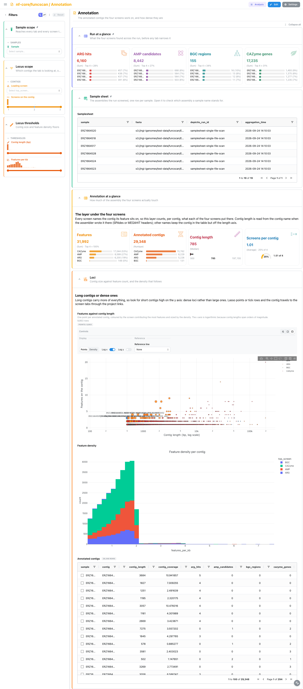
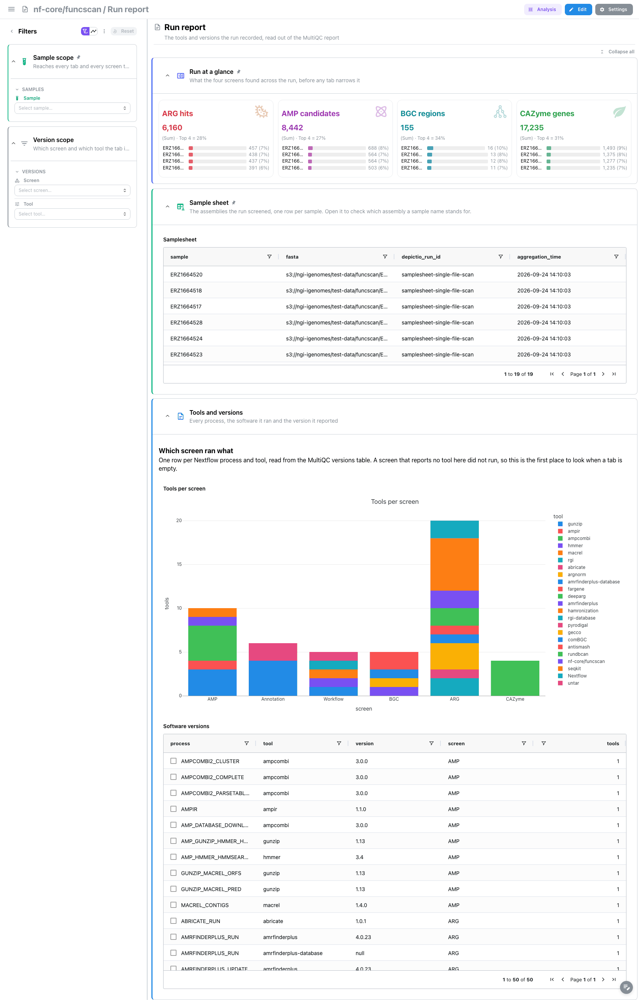

<div class="template-banner">
  <a class="template-banner-logo" href="https://nf-co.re/funcscan" target="_blank" title="nf-core/funcscan on nf-co.re">
    
    
  </a>
  <div class="template-banner-body">
    <h1 class="template-title">Functional Screening</h1>
    <p class="template-subtitle">Four independent screens over one set of (meta)genome assemblies: resistance genes, antimicrobial peptides, biosynthetic gene clusters and carbohydrate-active enzymes.</p>
    <p class="template-links">
      <a href="https://nf-co.re/funcscan" target="_blank"><i class="mdi mdi-open-in-new"></i> nf-co.re</a>
      <a href="https://github.com/nf-core/funcscan" target="_blank"><i class="mdi mdi-github"></i> GitHub</a>
    </p>
  </div>
  <span class="template-status-experimental template-banner-badge" data-tooltip="Experimental: shared as-is. Feedback and PRs welcome."><i class="mdi mdi-flask-outline"></i> Experimental</span>
</div>

<div class="tpl-version-pick" data-latest="4.0.0">
  <span class="tpl-version-icon"><i class="mdi mdi-source-branch"></i></span>
  <span class="tpl-version-label">Template version</span>
  <select id="tpl-version" class="tpl-version-select" aria-label="Template version">
    <option value="4.0.0" selected>4.0.0</option>
  </select>
  <span class="tpl-version-badge">latest</span>
</div>

The funcscan template covers the four aggregated screening reports of a standard nf-core/funcscan run, plus the annotated contigs they share and the run's own record of what it ran:

- :material-bullseye-arrow: **Screening overview**: per-sample counts for all four screens, and the sample selection every other tab follows
- :material-file-document-outline: **Annotation**: the contigs the four screens touch, how long they are and how densely they are annotated
- :material-bacteria-outline: **Resistome**: five ARG tools harmonised by hAMRonization, the drug-class matrix and a contig-level gene track
- :material-atom: **AMPs**: AMPcombi candidates in their physicochemical property space, with a linked candidate record, and the sequence clusters they fall into
- :material-graph-outline: **BGCs**: comBGC regions from antiSMASH, DeepBGC and GECCO, split by product class and mapped along their contigs
- :material-leaf: **CAZymes**: run_dbCAN family calls and the substrates their gene clusters target
- :material-file-document-outline: **Run report**: the tools and versions each screen ran, read from the MultiQC report

!!! info "Four screens, any subset"
    funcscan runs up to four independent screens over the same assemblies and
    nothing joins them, which is why the dashboard has one cross-screen tab, one
    locus tab and one tab per screen. Every screen is optional: an arm that did
    not run leaves no report, so its collections prune themselves. `--var
    SKIP_ARG=true` (or `SKIP_AMP`, `SKIP_BGC`, `SKIP_CAZYME`) prunes an arm
    explicitly.

!!! note "No MultiQC panels, only versions"
    funcscan feeds MultiQC nothing but software versions: the parquet holds one
    run-metadata row, with no general-statistics table and no module sections.
    The template turns that row into a table of tools per screen, which the
    **Run report** tab reads, and the same versions reach the dashboard Settings
    drawer through the template's provenance block.

---

## :material-rocket-launch-outline: Quick start

=== "Point at a finished run"

    ```bash
    depictio run \
      --template nf-core/funcscan/latest \
      --data-root /path/to/funcscan_results
    ```

    `--data-root` is the only thing you have to pass: which screens ran is read
    from the reports. The samplesheet is auto-detected from `{DATA_ROOT}/input/`;
    pass `--var SAMPLESHEET_FILE=...` to point elsewhere.

=== "From the pipeline itself (v1.10.0+)"

    ```bash
    depictio-cli config nextflow --install     # once per machine
    nextflow run nf-core/funcscan -r 4.0.0 -profile docker --outdir results
    ```

    No `depictio run`, and no template named: the pipeline ingests its own
    output directory when it finishes and resolves this template from its own
    manifest. See [Nextflow trigger](../../depictio-cli/nextflow-trigger.md).

---

## :material-book-open-variant: Reference

The template reads one aggregated report per arm: hAMRonization for the
resistome, AMPcombi for the peptides, comBGC for the gene clusters and run_dbCAN
for the CAZymes. From whichever of them the run produced it derives a per-sample
hub collection, joined to every screening collection on `sample`, so one sample
selection reaches every tab. A second hub, the per-contig annotation layer,
is rebuilt from the four screens and carries a contig selection into each of
them.

!!! info "Self-adapting layout"
    The dashboard adapts to whatever the run actually produced: components bound
    to pruned or unparsed data collections are hidden, tabs left with no real
    visualizations are dropped entirely, and the remaining components re-packed
    so there are no empty rows. One template covers every combination of arms.

<div class="tpl-version-block" data-version="4.0.0" markdown>

--8<-- "pipeline-templates/nf-core/_generated/funcscan-latest.md"

</div>

---

## :material-view-dashboard-outline: Dashboard tabs

Seven tabs: the cross-screen overview, the contig layer the screens share, one
tab per screen, and the run report. Each tab below carries the **same icon and
colour the dashboard gives it**, so the page and the app read alike. `Sample
scope` is pinned to the top of every tab, together with the *Run at a glance*
cards and the collapsed *Sample sheet* section.

=== ":material-bullseye-arrow:{ .mc-indigo } Screening overview"

    *What the four screens found, sample by sample, and which samples to follow.*

    [{ loading=lazy }](../../images/pipeline-templates/nf-core/funcscan/screening_overview_light.png){ .tpl-shot target="_blank" rel="noopener" }

    Four cards read the whole run at once, each with the samples that carry
    most of it: ARG hits, AMP candidates, BGC regions and CAZyme genes. The bar
    below is grouped and log-scaled, so an empty resistome next to a large
    CAZyme repertoire stands out. The scatter and the hub table are
    cross-selecting on `sample`: lasso points or tick rows, and the project
    links carry that selection into the Resistome, AMPs, BGCs and CAZymes tabs.

    ??? abstract ":material-tune-variant: Filters and components"

        **Filters** · `Sample` on `screening_summary`, persistent and pinned to
        the top of every tab, plus ARG, AMP, BGC and CAZyme per-sample ranges in
        a *Sample thresholds* group.

        | Section | What it holds |
        |---|---|
        | Run at a glance | 4 cards, pinned to every tab |
        | Screen composition | *Findings per sample and screen* |
        | Sample comparison | *Resistome load against CAZyme capacity*, *Per-sample screening summary* |
        | Sample sheet | *Samplesheet*, collapsed and pinned to every tab |

=== ":material-file-document-outline:{ .mc-yellow } Annotation"

    *Which contigs carry the findings, and are they long or just dense?*

    [{ loading=lazy }](../../images/pipeline-templates/nf-core/funcscan/annotation_light.png){ .tpl-shot target="_blank" rel="noopener" }

    Every screen names the contig its feature sits on, so this tab rebuilds the
    locus layer from the screens: one row per contig, with what each screen put
    there. Contig length is read from the contig name when the assembler wrote
    it there (SPAdes or MEGAHIT headers); other names keep the contig in the
    table but off the length axis. The scatter puts features against contig
    length on a log axis, so short, dense loci stand out from merely long
    contigs. Scatter and table cross-select on `contig`, and the project links
    carry the contig into the ARG hits, AMP candidates, BGC region map and
    CAZyme annotations.

    ??? abstract ":material-tune-variant: Filters and components"

        **Filters** · `Leading screen` and a `Screens on the contig` range in a
        *Locus scope* group, plus `Contig length (bp)` and `Features per kb`
        ranges in *Locus thresholds*, all on `contig_annotation`.

        | Section | What it holds |
        |---|---|
        | Annotation at a glance | 4 cards |
        | Loci | *Features against contig length*, *Feature density*, *Annotated contigs* |

=== ":material-bacteria-outline:{ .mc-red } Resistome"

    *Resistance genes across five ARG screens, harmonised into one vocabulary.*

    [{ loading=lazy }](../../images/pipeline-templates/nf-core/funcscan/resistome_light.png){ .tpl-shot target="_blank" rel="noopener" }

    ABRicate, AMRFinderPlus, DeepARG, fARGene and RGI all report differently, and
    hAMRonization normalises them into one table of hits. The hierarchy starts at
    the tool, not the drug class: the five tools share no class vocabulary, so a
    class-first sunburst collapses into one wedge. Beside it, the drug-class by
    sample matrix narrows to the samples picked on the overview. The UpSet and
    the dot plot then show which tools called each gene. In *Gene detail* the
    hit-quality scatter and the hits table cross-select on the gene symbol, and
    the contig track binds the `gene_arrow_track` advanced visualization kind,
    one lane per contig and one arrow per hit, so genes packed head to tail
    read as a resistance island.

    ??? abstract ":material-tune-variant: Filters and components"

        **Filters** · `ARG tool` and `Drug class` on `hamronization_report`, plus
        identity and tools-agreeing ranges in a *Hit quality* group.

        | Section | What it holds |
        |---|---|
        | Resistome at a glance | 4 cards |
        | Resistance hierarchy | *Resistome hierarchy*, *Drug class by sample hit matrix* |
        | Tool concordance | *ARG tool concordance*, *Gene support per sample* |
        | Gene detail | *Hit quality per tool*, *ARG hits*, *Resistance genes along their contig* |

=== ":material-atom:{ .mc-grape } AMPs"

    *Antimicrobial peptide candidates, their physicochemistry and their clusters.*

    [{ loading=lazy }](../../images/pipeline-templates/nf-core/funcscan/amps_light.png){ .tpl-shot target="_blank" rel="noopener" }

    AMPcombi merges the ampir, Macrel and AMPlify predictions, keeps the
    peptides above its probability cut-off and annotates each with its
    physicochemistry, so the tab reads the best probability across tools and
    how many predictors agree rather than one tool's score. The property plane
    is hydrophobicity against isoelectric point: cationic, hydrophobic peptides
    sit in the upper right. The scatter and the candidates table cross-select
    on the CDS, and the linked *Candidate record* beside the scatter folds to a
    slim rail until a point or a row is picked, then shows that peptide's
    origin, per-tool probabilities and physicochemistry. The PCA embeds the same
    descriptors, and the cluster panel is the MMseqs2 clustering over the whole
    run.

    ??? abstract ":material-tune-variant: Filters and components"

        **Filters** · `Charge class` on `ampcombi_summary`, plus best-probability
        and length ranges in a *Peptide properties* group.

        | Section | What it holds |
        |---|---|
        | AMPs at a glance | 4 cards |
        | Property space | *Charge against hydrophobicity*, *Candidate record*, *Physicochemistry PCA*, *AMP candidates* |
        | Clusters | *Cluster sizes*, *Peptide clusters* |

=== ":material-graph-outline:{ .mc-cyan } BGCs"

    *Biosynthetic gene clusters merged from antiSMASH, DeepBGC and GECCO.*

    [{ loading=lazy }](../../images/pipeline-templates/nf-core/funcscan/bgcs_light.png){ .tpl-shot target="_blank" rel="noopener" }

    Metagenome assemblies are fragmented, so a cluster is often cut by a contig
    edge; that is why the cards read region length and CDS count next to the
    product classes, and why the completeness split reads low by construction.
    The sunburst goes caller to product class. *Region maps* shows the same
    regions as coordinates: brush the genome axis or pick a row and the arrow
    lanes and the coordinate table narrow to that contig (arrows run left to
    right, because comBGC reports no strand). The concordance UpSet scores
    agreement on the contig, not on region coordinates: the callers disagree on
    boundaries by design, so a coordinate join finds no overlap.

    ??? abstract ":material-tune-variant: Filters and components"

        **Filters** · `Prediction tool` and `Product class` on `combgc_summary`,
        plus length and CDS-count ranges in a *Region size* group, and a
        `Product class on the map` selector and a `Region length on the map (kb)`
        range on `combgc_region_track` for the region maps.

        | Section | What it holds |
        |---|---|
        | BGCs at a glance | 4 cards |
        | Product classes | *Regions per sample*, *Caller to product class* |
        | Region maps | *Cluster footprints on the genome axis*, *Clusters along their contig*, *BGC region coordinates* |
        | Caller concordance | *Caller concordance* |

=== ":material-leaf:{ .mc-green } CAZymes"

    *Carbohydrate-active enzymes and the substrates their gene clusters target.*

    [{ loading=lazy }](../../images/pipeline-templates/nf-core/funcscan/cazymes_light.png){ .tpl-shot target="_blank" rel="noopener" }

    run_dbCAN calls every gene three times, with HMMER, dbCAN-sub and DIAMOND,
    and the *Tools agreeing* filter is the confidence floor for the whole tab.
    The hierarchy runs CAZy class to family to substrate. The substrate panel
    reads the CGC predictions, which name the polysaccharide a gene cluster
    should act on, and the UpSet shows where the three annotators agree.

    ??? abstract ":material-tune-variant: Filters and components"

        **Filters** · `CAZy class` and `Substrate` on `dbcan_overview`, plus a
        tools-agreeing range in a *Call confidence* group.

        | Section | What it holds |
        |---|---|
        | CAZymes at a glance | 4 cards |
        | Family hierarchy | *CAZyme hierarchy*, *Class split per sample* |
        | Substrates | *Substrates predicted*, *CGC substrate predictions* |
        | Tool concordance | *Annotation concordance*, *CAZyme annotations* |

=== ":material-file-document-outline: Run report"

    *Which screen ran what, and with which versions?*

    [{ loading=lazy }](../../images/pipeline-templates/nf-core/funcscan/run_report_light.png){ .tpl-shot target="_blank" rel="noopener" }

    One row per Nextflow process and tool, read from the versions table in the
    MultiQC report and assigned to a screen by the process name; processes that
    belong to no screen are labelled as workflow plumbing rather than dropped.
    A screen that reports no tool here did not run, so this is the first place
    to look when a screen tab is empty.

    ??? abstract ":material-tune-variant: Filters and components"

        **Filters** · `Screen` and `Tool` on `software_versions`, in a *Version
        scope* group.

        | Section | What it holds |
        |---|---|
        | Tools and versions | *Tools per screen*, *Software versions* |

!!! tip "Vocabularies that do not line up"
    The five ARG tools, the three BGC callers and the three CAZyme annotators
    each report in their own terms, so every concordance panel is scored on a
    shared key (the contig for ARGs and BGCs, the gene for CAZymes).

---

## :material-play-circle-outline: Running the pipeline

Depictio reads the **output** of nf-core/funcscan, it does not run the pipeline.
Run the pipeline first:

```bash
nextflow run nf-core/funcscan -r 4.0.0 \
  --input samplesheet.csv \
  --run_arg_screening --run_amp_screening \
  --run_bgc_screening --run_cazyme_screening \
  --outdir results -profile docker
```

Then point Depictio at the results:

```bash
depictio run --template nf-core/funcscan/latest \
  --data-root results/
```

See [nf-co.re/funcscan/usage](https://nf-co.re/funcscan/4.0.0/docs/usage) for full pipeline documentation.

---

## :material-folder-open-outline: Required data structure

Point `--data-root` at the directory holding the pipeline output. Depictio scans
recursively and matches on file name; only the aggregated reports below matter.

```text
<DATA_ROOT>/
├── input/samplesheet_full.csv                     # --var SAMPLESHEET_FILE (auto-detected)
├── pipeline_info/
│   ├── params.json                                # carries the four run_*_screening flags
│   └── software_versions.yml
├── multiqc/multiqc_data/multiqc.parquet           # versions only, read by the Run report tab
├── reports/
│   ├── hamronization_summarize/
│   │   └── hamronization_combined_report.tsv      # ARG: one row per hit, five tools
│   ├── ampcombi2/
│   │   ├── Ampcombi_summary.tsv                   # AMP: candidates + physicochemistry
│   │   └── Ampcombi_summary_cluster*.tsv          # AMP: cluster assignments
│   └── combgc/
│       └── combgc_complete_summary.tsv            # BGC: run-level, every caller
└── cazyme/
    └── dbcan/
        ├── cazyme_annotation/
        │   └── <sample>/<sample>_overview.tsv     # CAZyme: per-gene family calls
        └── substrate/
            └── <sample>/<sample>_substrate_prediction.tsv
```

!!! warning "Use the run-level comBGC summary"
    The per-sample `reports/combgc/<sample>/combgc_summary.tsv` files carry the
    antiSMASH branch alone, which is why the template reads
    `combgc_complete_summary.tsv`.

---

## :material-flask-outline: Validation runs

The repository ships
[`download_test_data.sh`](https://github.com/depictio/depictio/blob/main/depictio/projects/nf-core/funcscan/4.0.0/download_test_data.sh),
which fetches the subset of nf-core's AWS megatest run that the template needs:
47 files and 6.5 MB, out of 3769 files and roughly 2.8 GB.

```bash
bash depictio/projects/nf-core/funcscan/4.0.0/download_test_data.sh \
  /tmp/funcscan_test
```

The run is
`s3://nf-core-awsmegatests/funcscan/results-aee3dc965eb0c77267435544dda30da858763913/`:
19 MGnify metagenome assemblies with all four screening arms enabled. Its outdir
publishes no `input/` directory, so `post_fetch_help` in `megatest.yaml` gives
the `curl` command that puts the samplesheet under `input/`. Then run Depictio:

```bash
depictio run \
  --template nf-core/funcscan/latest \
  --data-root /tmp/funcscan_test
```

---

## :material-link-variant: Additional resources

- [nf-co.re/funcscan](https://nf-co.re/funcscan): official pipeline documentation
- [nf-co.re/funcscan/4.0.0/results](https://nf-co.re/funcscan/4.0.0/results): AWS test results
- [Template System Reference](../../usage/projects/templates.md): YAML format, variables, conditionals
- [Recipes](../../usage/projects/recipes.md): how to read, test, and write recipes

---

## :material-account-group-outline: Authorship

<div class="tpl-credits">
  <div class="tpl-credit">
    <span class="tpl-credit-role"><i class="mdi mdi-code-braces"></i> Developers</span>
    <span class="tpl-credit-note">Wrote the template, its recipes and its dashboards.</span>
    <a class="tpl-person" href="https://github.com/weber8thomas" target="_blank" rel="noopener">
       weber8thomas
    </a>
  </div>
  <div class="tpl-credit">
    <span class="tpl-credit-role"><i class="mdi mdi-eye-check-outline"></i> Reviewers</span>
    <span class="tpl-credit-note">Nobody has run it on their own data and signed it off yet, which is what keeps it Experimental.</span>
    <span class="tpl-person"><i class="mdi mdi-account-plus-outline"></i> Open</span>
  </div>
  <div class="tpl-credit">
    <span class="tpl-credit-role"><i class="mdi mdi-wrench-outline"></i> Maintainers</span>
    <span class="tpl-credit-note">Keep it working as nf-core/funcscan releases.</span>
    <a class="tpl-person" href="https://github.com/weber8thomas" target="_blank" rel="noopener">
       weber8thomas
    </a>
  </div>
</div>

Reviewing a template on your own data, or taking over a role here, is a
contribution in itself: the [contributing guide](../../developer/contributing-templates.md)
says what each one involves.
