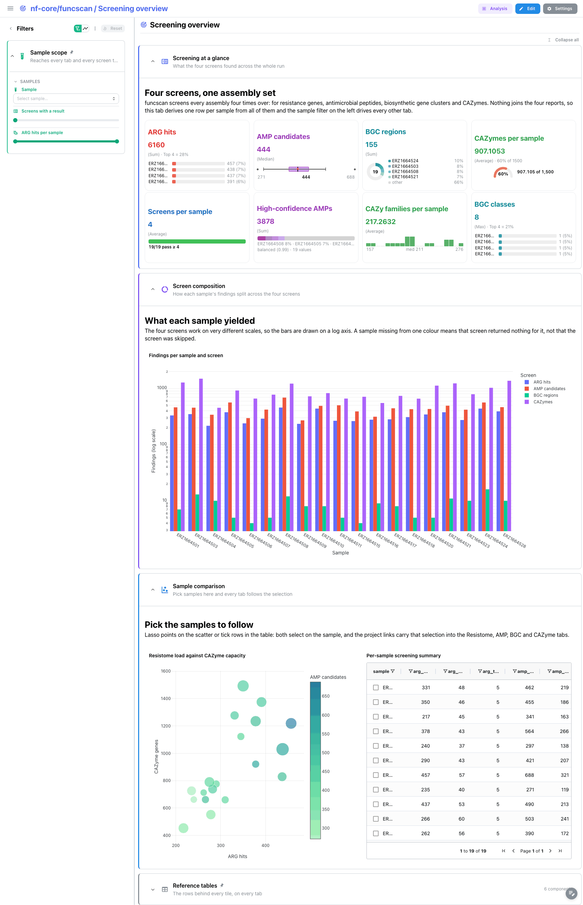
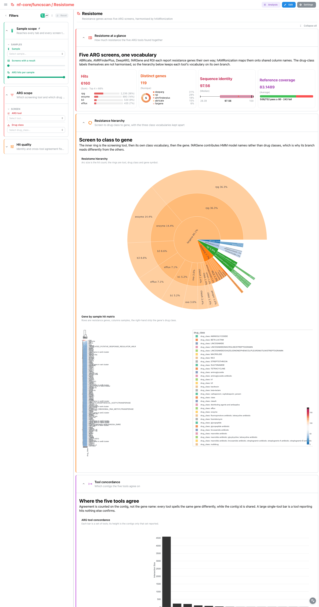
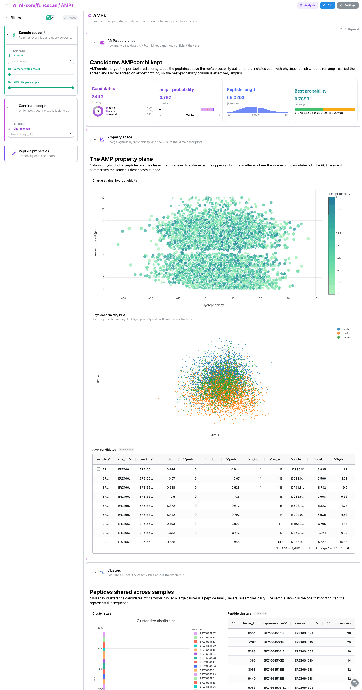
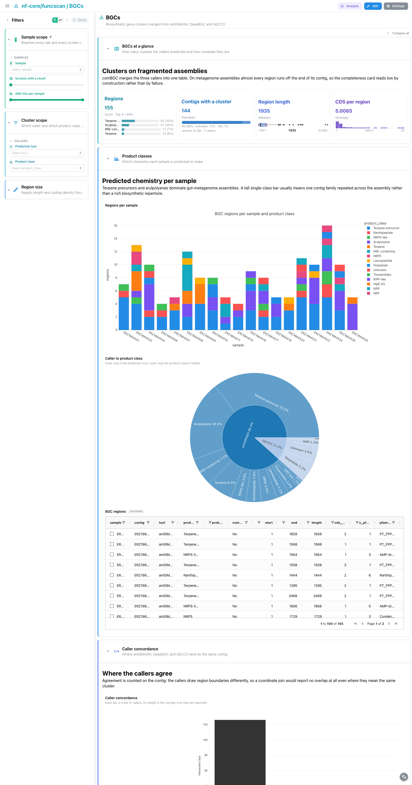
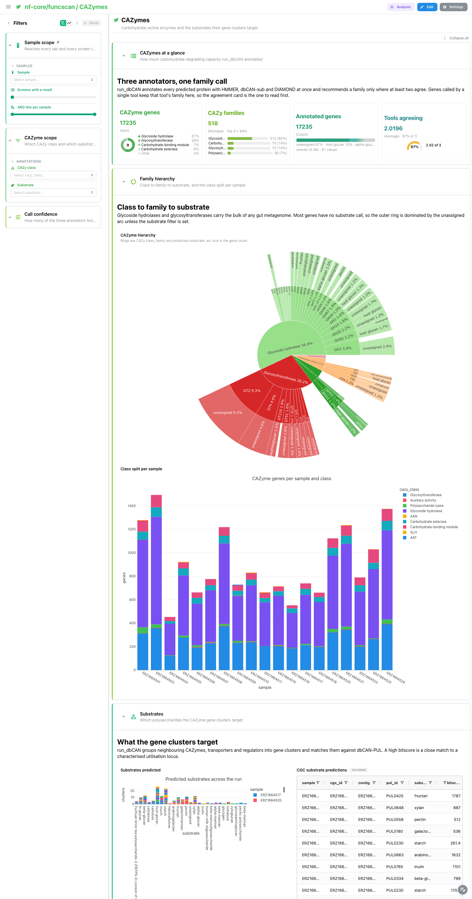

<div class="template-banner">
  <a class="template-banner-logo" href="https://nf-co.re/funcscan" target="_blank" title="nf-core/funcscan on nf-co.re">
    
    
  </a>
  <div class="template-banner-body">
    <h1 class="template-title">Functional Screening</h1>
    <p class="template-subtitle">Four independent screens over one set of (meta)genome assemblies: resistance genes, antimicrobial peptides, biosynthetic gene clusters and carbohydrate-active enzymes.</p>
    <p class="template-links">
      <a href="https://nf-co.re/funcscan" target="_blank"><i class="mdi mdi-open-in-new"></i> nf-co.re</a>
      <a href="https://github.com/nf-core/funcscan" target="_blank"><i class="mdi mdi-github"></i> GitHub</a>
    </p>
  </div>
  <span class="template-status-experimental template-banner-badge" data-tooltip="Experimental — shared as-is. Feedback and PRs welcome."><i class="mdi mdi-flask-outline"></i> Experimental</span>
</div>

<div class="tpl-version-pick" data-latest="4.0.0">
  <span class="tpl-version-icon"><i class="mdi mdi-source-branch"></i></span>
  <span class="tpl-version-label">Template version</span>
  <select id="tpl-version" class="tpl-version-select" aria-label="Template version">
    <option value="4.0.0" selected>4.0.0</option>
  </select>
  <span class="tpl-version-badge">latest</span>
</div>

The funcscan template covers the four aggregated screening reports of a standard nf-core/funcscan run:

- :material-bullseye-arrow: **Screening overview**: per-sample counts for all four screens, and the sample selection every other tab follows
- :material-bacteria-outline: **Resistome**: five ARG tools harmonised by hAMRonization, the gene-by-sample matrix and a contig-level gene track
- :material-atom: **AMPs**: AMPcombi candidates in their physicochemical property space, and the sequence clusters they fall into
- :material-graph-outline: **BGCs**: comBGC regions from antiSMASH, DeepBGC and GECCO, split by predicted product class
- :material-leaf: **CAZymes**: run_dbCAN family calls and the substrates their gene clusters target
- :material-table: **Reference tables**: the five raw reports, pinned to the bottom of every tab

!!! info "Four screens, any subset"
    funcscan runs up to four independent screens over the same assemblies and
    nothing joins them, which is why the dashboard has one cross-screen tab and
    one tab per screen. Every screen is optional: an arm that did not run leaves
    no report, so its collections prune themselves. `--var SKIP_ARG=true` (or
    `SKIP_AMP`, `SKIP_BGC`, `SKIP_CAZYME`) prunes an arm explicitly.

!!! note "No MultiQC tab"
    funcscan feeds MultiQC nothing but software versions: the parquet holds one
    run-metadata row, with no general-statistics table and no module sections.
    The versions reach the UI through the template's provenance block instead,
    and **Screening overview** carries the run-level read.

---

## :material-rocket-launch-outline: Quick start

=== "Point at a finished run"

    ```bash
    depictio run \
      --template nf-core/funcscan/latest \
      --data-root /path/to/funcscan_results
    ```

    `--data-root` is the only thing you have to pass: which screens ran is read
    from the reports. The samplesheet is auto-detected from `{DATA_ROOT}/input/`;
    pass `--var SAMPLESHEET_FILE=...` to point elsewhere.

=== "From the pipeline itself (v1.10.0+)"

    ```bash
    depictio-cli config nextflow --install     # once per machine
    nextflow run nf-core/funcscan -profile docker --outdir results
    ```

    No `depictio run`, and no template named: the pipeline ingests its own
    output directory when it finishes and resolves this template from its own
    manifest. See [Nextflow trigger](../../depictio-cli/nextflow-trigger.md).

---

## :material-book-open-variant: Reference

The template reads one aggregated report per arm: hAMRonization for the
resistome, AMPcombi for the peptides, comBGC for the gene clusters and run_dbCAN
for the CAZymes. From whichever of them the run produced it derives a per-sample
hub collection, joined to every screening collection on `sample`, so one sample
selection reaches all five tabs.

!!! info "Self-adapting layout"
    The dashboard adapts to whatever the run actually produced: components bound
    to pruned or unparsed data collections are hidden, tabs left with no real
    visualizations are dropped entirely, and the remaining components re-packed
    so there are no empty rows. One template covers every combination of arms.

<div class="tpl-version-block" data-version="4.0.0" markdown>

--8<-- "pipeline-templates/nf-core/_generated/funcscan-latest.md"

</div>

---

## :material-view-dashboard-outline: Dashboard tabs

Five tabs: the cross-screen overview, then one per screen. Each tab below
carries the **same icon and colour the dashboard gives it**, so the page and the
app read alike. `Sample scope` is pinned to the top of every tab, and the
collapsed `Reference tables` section to the bottom.

=== ":material-bullseye-arrow:{ .mc-indigo } Screening overview"

    *What the four screens found, sample by sample.*

    [{ loading=lazy }](../../images/pipeline-templates/nf-core/funcscan/screening_overview_light.png){ .tpl-shot target="_blank" rel="noopener" }

    Eight cards over two rows read the whole run at once: ARG hits, AMP
    candidates, BGC regions, CAZymes, screens completed, high-confidence AMPs,
    CAZy families and BGC classes. The bar below is grouped and log-scaled, so an
    empty resistome next to a large CAZyme repertoire stands out. The scatter and
    the hub table both select on `sample`, which narrows every other tab.

    ??? abstract ":material-tune-variant: Filters and components"

        **Filters** · `Sample`, plus ranges on screens completed and ARG hits,
        all on `screening_summary`, persistent and pinned to the top of every tab.

        | Section | What it holds |
        |---|---|
        | Screening at a glance | 8 cards |
        | Screen composition | *Findings per sample and screen* |
        | Sample comparison | *Resistome load against CAZyme capacity*, *Per-sample screening summary* |
        | Reference tables | *Samplesheet*, *ARG hits*, *AMP candidates*, *BGC regions*, *CAZyme annotations* |

=== ":material-bacteria-outline:{ .mc-red } Resistome"

    *Resistance genes across five ARG screens, harmonised into one vocabulary.*

    [{ loading=lazy }](../../images/pipeline-templates/nf-core/funcscan/resistome_light.png){ .tpl-shot target="_blank" rel="noopener" }

    ABRicate, AMRFinderPlus, DeepARG, fARGene and RGI all report differently, and
    hAMRonization normalises them into one table of hits. The hierarchy starts at
    the tool, not the drug class: the five tools share no class vocabulary, so a
    class-first sunburst collapses into one wedge. The UpSet and the dot plot
    then show which tools called each gene. The contig track at the bottom binds
    the `gene_arrow_track` advanced visualization kind, one lane per contig and
    one arrow per hit, so genes packed head to tail read as a resistance island.

    ??? abstract ":material-tune-variant: Filters and components"

        **Filters** · `ARG tool` and `Drug class` on `hamronization_report`, plus
        identity and tools-agreeing ranges in a collapsed *Hit quality* group.

        | Section | What it holds |
        |---|---|
        | Resistome at a glance | 4 cards |
        | Resistance hierarchy | *Resistome hierarchy*, *Gene by sample hit matrix* |
        | Tool concordance | *ARG tool concordance*, *Gene support per sample* |
        | Gene detail | *Hit quality per tool*, *ARG hits*, *Resistance genes along their contig* |

=== ":material-atom:{ .mc-grape } AMPs"

    *Antimicrobial peptide candidates, their physicochemistry and their clusters.*

    [{ loading=lazy }](../../images/pipeline-templates/nf-core/funcscan/amps_light.png){ .tpl-shot target="_blank" rel="noopener" }

    AMPcombi keeps the candidates ampir, Macrel and HMMER report, with each
    tool's probability alongside the peptide's physicochemistry. The property
    plane is hydrophobicity against isoelectric point rather than one tool's
    probability against another's: Macrel scores 0 for all but 21 of the
    reference run's 8442 candidates. The PCA embeds the same descriptors, and the
    cluster panel is the MMseqs2 clustering over the whole run.

    ??? abstract ":material-tune-variant: Filters and components"

        **Filters** · `Charge class` on `ampcombi_summary`, plus best-probability
        and length ranges in a collapsed *Peptide properties* group.

        | Section | What it holds |
        |---|---|
        | AMPs at a glance | 4 cards |
        | Property space | *Charge against hydrophobicity*, *Physicochemistry PCA*, *AMP candidates* |
        | Clusters | *Cluster sizes*, *Peptide clusters* |

=== ":material-graph-outline:{ .mc-cyan } BGCs"

    *Biosynthetic gene clusters merged from antiSMASH, DeepBGC and GECCO.*

    [{ loading=lazy }](../../images/pipeline-templates/nf-core/funcscan/bgcs_light.png){ .tpl-shot target="_blank" rel="noopener" }

    Metagenome assemblies are fragmented, so a cluster is often cut by a contig
    edge; that is why the cards read region length and CDS count next to the
    region count. The sunburst goes caller to product class. The concordance
    UpSet scores agreement on the contig, not on region coordinates: the callers
    disagree on boundaries by design, so a coordinate join finds no overlap.

    ??? abstract ":material-tune-variant: Filters and components"

        **Filters** · `Prediction tool` and `Product class` on `combgc_summary`,
        plus length and CDS-count ranges in a collapsed *Region size* group.

        | Section | What it holds |
        |---|---|
        | BGCs at a glance | 4 cards |
        | Product classes | *Regions per sample*, *Caller to product class*, *BGC regions* |
        | Caller concordance | *Caller concordance* |

=== ":material-leaf:{ .mc-green } CAZymes"

    *Carbohydrate-active enzymes and the substrates their gene clusters target.*

    [{ loading=lazy }](../../images/pipeline-templates/nf-core/funcscan/cazymes_light.png){ .tpl-shot target="_blank" rel="noopener" }

    run_dbCAN calls every gene three times, with HMMER, dbCAN-sub and DIAMOND,
    and the *Tools agreeing* filter is the confidence floor for the whole tab.
    The hierarchy runs CAZy class to family to substrate. The substrate panel
    reads the CGC predictions, which name the polysaccharide a gene cluster
    should act on, and the UpSet shows where the three annotators agree.

    ??? abstract ":material-tune-variant: Filters and components"

        **Filters** · `CAZy class` and `Substrate` on `dbcan_overview`, plus a
        tools-agreeing range in a collapsed *Call confidence* group.

        | Section | What it holds |
        |---|---|
        | CAZymes at a glance | 4 cards |
        | Family hierarchy | *CAZyme hierarchy*, *Class split per sample* |
        | Substrates | *Substrates predicted*, *CGC substrate predictions* |
        | Tool concordance | *Annotation concordance*, *CAZyme annotations* |

!!! tip "Vocabularies that do not line up"
    The five ARG tools, the three BGC callers and the three CAZyme annotators
    each report in their own terms, so every concordance panel is scored on a
    shared key (the contig for ARGs and BGCs, the gene for CAZymes).

---

## :material-play-circle-outline: Running the pipeline

Depictio reads the **output** of nf-core/funcscan, it does not run the pipeline.
Run the pipeline first:

```bash
nextflow run nf-core/funcscan \
  --input samplesheet.csv \
  --run_arg_screening --run_amp_screening \
  --run_bgc_screening --run_cazyme_screening \
  -profile docker
```

Then point Depictio at the results:

```bash
depictio run --template nf-core/funcscan/latest \
  --data-root results/
```

See [nf-co.re/funcscan/usage](https://nf-co.re/funcscan/4.0.0/docs/usage) for full pipeline documentation.

---

## :material-folder-open-outline: Required data structure

Point `--data-root` at the directory holding the pipeline output. Depictio scans
recursively and matches on file name; only the aggregated reports below matter.

```text
<DATA_ROOT>/
├── input/samplesheet_full.csv                     # --var SAMPLESHEET_FILE (auto-detected)
├── pipeline_info/
│   ├── params.json                                # carries the four run_*_screening flags
│   └── software_versions.yml
├── multiqc/multiqc_data/multiqc.parquet           # versions only, no QC tab
├── reports/
│   ├── hamronization_summarize/
│   │   └── hamronization_combined_report.tsv      # ARG: one row per hit, five tools
│   ├── ampcombi2/
│   │   ├── Ampcombi_summary.tsv                   # AMP: candidates + physicochemistry
│   │   └── Ampcombi_summary_cluster*.tsv          # AMP: cluster assignments
│   └── combgc/
│       └── combgc_complete_summary.tsv            # BGC: run-level, every caller
└── cazyme/
    └── dbcan/
        ├── cazyme_annotation/
        │   └── <sample>/<sample>_overview.tsv     # CAZyme: per-gene family calls
        └── substrate/
            └── <sample>/<sample>_substrate_prediction.tsv
```

!!! warning "Use the run-level comBGC summary"
    The per-sample `reports/combgc/<sample>/combgc_summary.tsv` files carry the
    antiSMASH branch alone (137 of the reference run's 155 regions), which is why
    the template reads `combgc_complete_summary.tsv`.

---

## :material-flask-outline: Test data

The repository ships
[`download_test_data.sh`](https://github.com/depictio/depictio/blob/main/depictio/projects/nf-core/funcscan/4.0.0/download_test_data.sh),
which fetches the subset of nf-core's AWS megatest run that the template needs:
47 files and 6.5 MB, out of 3769 files and roughly 2.8 GB.

```bash
bash depictio/projects/nf-core/funcscan/4.0.0/download_test_data.sh \
  /tmp/funcscan_test
```

The run is
`s3://nf-core-awsmegatests/funcscan/results-aee3dc965eb0c77267435544dda30da858763913/`:
19 MGnify metagenome assemblies with all four screening arms enabled. Its outdir
publishes no `input/` directory, so `post_fetch_help` in `megatest.yaml` gives
the `curl` command that puts the samplesheet under `input/`. Then run Depictio:

```bash
depictio run \
  --template nf-core/funcscan/latest \
  --data-root /tmp/funcscan_test
```

---

## :material-link-variant: Additional resources

- [nf-co.re/funcscan](https://nf-co.re/funcscan): official pipeline documentation
- [nf-co.re/funcscan/4.0.0/results](https://nf-co.re/funcscan/4.0.0/results): AWS test results
- [Template System Reference](../../usage/projects/templates.md): YAML format, variables, conditionals
- [Recipes](../../usage/projects/recipes.md): how to read, test, and write recipes

---

## :material-account-group-outline: Authorship

<div class="tpl-credits">
  <div class="tpl-credit">
    <span class="tpl-credit-role"><i class="mdi mdi-code-braces"></i> Developers</span>
    <span class="tpl-credit-note">Wrote the template, its recipes and its dashboards.</span>
    <a class="tpl-person" href="https://github.com/weber8thomas" target="_blank" rel="noopener">
       weber8thomas
    </a>
  </div>
  <div class="tpl-credit">
    <span class="tpl-credit-role"><i class="mdi mdi-eye-check-outline"></i> Reviewers</span>
    <span class="tpl-credit-note">Nobody has run it on their own data and signed it off yet, which is what keeps it Experimental.</span>
    <span class="tpl-person"><i class="mdi mdi-account-plus-outline"></i> Open</span>
  </div>
  <div class="tpl-credit">
    <span class="tpl-credit-role"><i class="mdi mdi-wrench-outline"></i> Maintainers</span>
    <span class="tpl-credit-note">Keep it working as nf-core/funcscan releases.</span>
    <a class="tpl-person" href="https://github.com/weber8thomas" target="_blank" rel="noopener">
       weber8thomas
    </a>
  </div>
</div>

Reviewing a template on your own data, or taking over a role here, is a
contribution in itself: the [contributing guide](../../developer/contributing-templates.md)
says what each one involves.
