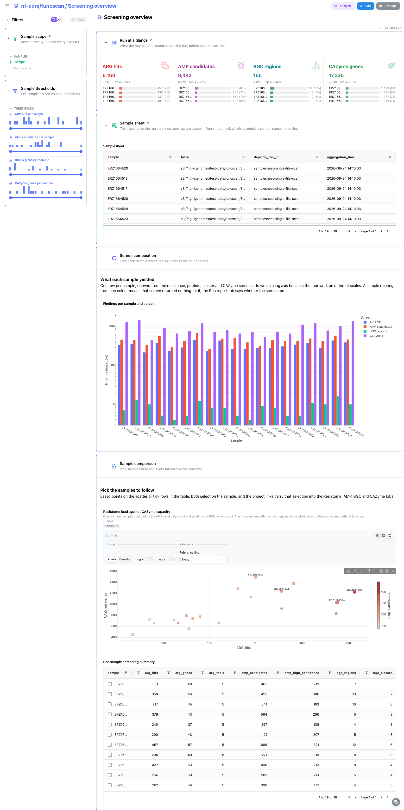
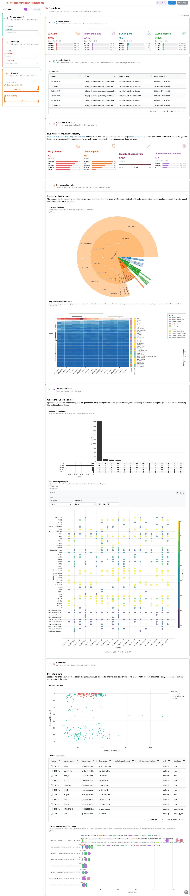
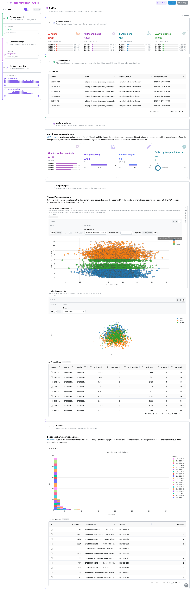
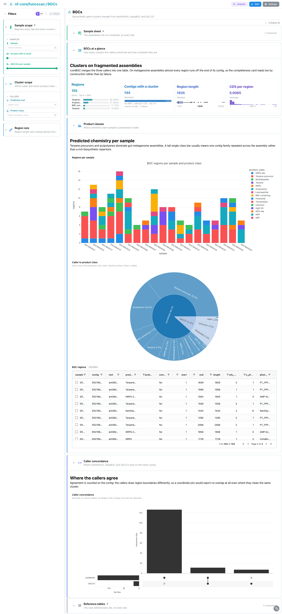
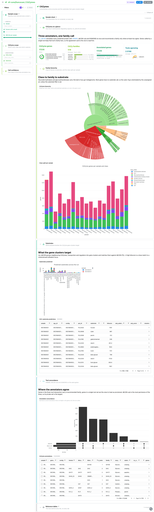

<div class="template-banner">
  <a class="template-banner-logo" href="https://nf-co.re/funcscan" target="_blank" title="nf-core/funcscan on nf-co.re">
    
    
  </a>
  <div class="template-banner-body">
    <h1 class="template-title">Functional Screening</h1>
    <p class="template-subtitle">Four independent screens over one set of (meta)genome assemblies: resistance genes, antimicrobial peptides, biosynthetic gene clusters and carbohydrate-active enzymes.</p>
    <p class="template-links">
      <a href="https://nf-co.re/funcscan" target="_blank"><i class="mdi mdi-open-in-new"></i> nf-co.re</a>
      <a href="https://github.com/nf-core/funcscan" target="_blank"><i class="mdi mdi-github"></i> GitHub</a>
    </p>
  </div>
  <span class="template-status-draft template-banner-badge" data-tooltip="Draft: generated and not yet reviewed. Expect it to need fixes before it is usable."><i class="mdi mdi-pencil-outline"></i> Draft</span>
</div>

<div class="tpl-version-pick" data-latest="4.0.0">
  <span class="tpl-version-icon"><i class="mdi mdi-source-branch"></i></span>
  <span class="tpl-version-label">Template version</span>
  <select id="tpl-version" class="tpl-version-select" aria-label="Template version">
    <option value="4.0.0" selected>4.0.0</option>
  </select>
  <span class="tpl-version-badge">latest</span>
</div>

The funcscan template covers the four aggregated screening reports of a standard nf-core/funcscan run:

- :material-compass-outline: **Overview**: one key figure per screen, live findings and one figure per screen, each linked to the tab that explains it
- :material-flask-outline: **Data & QC**: the screens and tool versions the run recorded, what each assembly yielded, and the contigs the screens share
- :material-bacteria-outline: **Antimicrobials**: five ARG tools harmonised by hAMRonization, and AMPcombi peptide candidates in their property space
- :material-leaf: **Metabolism**: comBGC regions from antiSMASH, DeepBGC and GECCO, and run_dbCAN CAZyme families with their substrates

!!! info "Four screens, any subset"
    funcscan runs up to four independent screens over the same assemblies and
    nothing joins them, which is why the dashboard has one tab per screen, after
    the Data & QC tabs that cover all four. Every screen is optional: an arm that did not run leaves
    no report, so its collections prune themselves. `--var SKIP_ARG=true` (or
    `SKIP_AMP`, `SKIP_BGC`, `SKIP_CAZYME`) prunes an arm explicitly.

!!! note "No MultiQC tab"
    funcscan feeds MultiQC nothing but software versions: the parquet holds one
    run-metadata row, with no general-statistics table and no module sections.
    The **Run report** tab reads those versions back out of the report, and
    **Samples** carries the per-assembly read.

---

## :material-rocket-launch-outline: Quick start

=== "Point at a finished run"

    ```bash
    depictio ingest /path/to/funcscan_results \
      --template nf-core/funcscan/latest
    ```

    The results directory is the only thing you have to pass: which screens ran is read
    from the reports. The samplesheet is auto-detected from `{DATA_ROOT}/input/`;
    pass `--var SAMPLESHEET_FILE=...` to point elsewhere.

=== "From the pipeline itself (v1.10.0+)"

    ```bash
    depictio config nextflow --install     # once per machine
    nextflow run nf-core/funcscan -profile docker --outdir results
    ```

    No `depictio ingest`, and no template named: the pipeline ingests its own
    output directory when it finishes and resolves this template from its own
    manifest. See [Nextflow trigger](../../depictio-cli/nextflow-trigger.md).

---

## :material-book-open-variant: Reference

The template reads one aggregated report per arm: hAMRonization for the
resistome, AMPcombi for the peptides, comBGC for the gene clusters and run_dbCAN
for the CAZymes. From whichever of them the run produced it derives a per-sample
hub collection, joined to every screening collection on `sample`, so one sample
selection reaches every tab.

!!! info "Self-adapting layout"
    The dashboard adapts to whatever the run actually produced: components bound
    to pruned or unparsed data collections are hidden, tabs left with no real
    visualizations are dropped entirely, and the remaining components re-packed
    so there are no empty rows. One template covers every combination of arms.

<div class="tpl-version-block" data-version="4.0.0" markdown>

--8<-- "pipeline-templates/nf-core/_generated/funcscan-latest.md"

</div>

---

## :material-view-dashboard-outline: Dashboard tabs

One dashboard: the **Overview**, then seven child tabs in three groups, read as a
funnel from what the run executed to what each screen found. Each tab below carries
the **same icon and colour the dashboard gives it**, so the page and the app read
alike.

| Group | Tabs |
|---|---|
| Data & QC | Run report, Samples, Contigs |
| Antimicrobials | Resistome, AMPs |
| Metabolism | BGCs, CAZymes |

Each child tab opens with a short intro and a strip of cards, then at most three
open sections; tables and details follow, collapsed. The samplesheet carries no
experimental factor, so the persistent *Sample filters* hold the sample id only:
they sit in the left panel and narrow every tab through `screening_summary`, the
per-assembly hub every screen links to on `sample`. The *Sample sheet* section,
the hub table above the samplesheet, is pinned, collapsed, to the bottom of every
child tab.

=== ":material-compass-outline: Overview"

    *Assemblies screened for resistance genes, peptides, gene clusters and CAZymes.*

    <!-- screenshot pending v2 -->

    A short hero links the run parameters. *About this dashboard* says how to move
    through the tabs, *The run* lists the assemblies, the screens that ran, the gene
    caller and the AMP reference database, and *Pipeline* walks the five steps from
    annotation to the CAZyme screen, each linked to its parameters and its tab. The
    four key figures all read the screening hub, so a screen that did not run reads
    0 instead of leaving a gap.

    ??? abstract ":material-tune-variant: Filters and components"

        **Filters** · the left panel starts collapsed. *Key figures* has its own
        filter bar (the sample id and an ARG-hits range), and so does *Findings*
        (the sample id and the ARG tool): each narrows its own section only.

        | Section | What it holds |
        |---|---|
        | Top | Hero, *About this dashboard*, *The run*, *Pipeline* |
        | Key figures | 4 headline cards: ARG hits, AMP candidates, BGC regions, CAZyme genes |
        | Findings | Live result rows, then 4 figures, one per screen: the resistome sunburst, the AMP property plane, the BGC caller sunburst and the CAZy classes per assembly |
        | How to read this dashboard | The tabs by group, each with its question |

=== ":material-file-document-outline: Run report"

    **Data & QC** · *Which screens and tools did the run execute?*

    <!-- screenshot pending v2 -->

    The run's MultiQC report carries software versions only, so there is no
    MultiQC tab: this one reads the versions back out of it. The screens that ran
    and the distinct tools come first, then the tool versions per screen. A screen
    missing here did not run, the first thing to check when a tab is empty.

    ??? abstract ":material-tune-variant: Filters and components"

        **Filters** · `Screen` and `Tool` on `software_versions`.

        | Section | What it holds |
        |---|---|
        | Run at a glance | 2 cards |
        | Tools per screen | *Tool versions per screen* |
        | Software versions (collapsed) | *Software versions* |

=== ":material-flask-outline:{ .mc-teal } Samples"

    **Data & QC** · *What did each assembly yield across the four screens?*

    <!-- screenshot pending v2 -->

    [{ loading=lazy }](../../images/pipeline-templates/nf-core/funcscan/screening_overview_light.png){ .tpl-shot target="_blank" rel="noopener" }

    The median assembly's resistance genes, high-confidence AMPs, BGC product
    classes and CAZy families. Then the findings per assembly and screen as grouped
    bars on a log axis, since the screens differ by orders of magnitude, and the
    resistance load against CAZyme capacity. A lasso on that scatter picks
    assemblies for every tab.

    ??? abstract ":material-tune-variant: Filters and components"

        **Filters** · a range per screen (ARG hits, AMP candidates, BGC regions,
        CAZyme genes) on `screening_summary`, plus the sample filters.

        | Section | What it holds |
        |---|---|
        | Samples at a glance | 4 cards |
        | Screen composition | *Findings per assembly and screen* |
        | Sample comparison | 1 advanced visualization |

=== ":material-dna:{ .mc-yellow } Contigs"

    **Data & QC** · *Which contigs carry the screens' findings, and how densely?*

    <!-- screenshot pending v2 -->

    Every screen names the contig its feature sits on, so this tab counts, per
    contig, what the four screens put there. The cards give the annotated contigs,
    their length, the feature density and the contigs two screens or more share.
    Then the features against contig length and the density histogram. The length
    is read from SPAdes or MEGAHIT contig names, and stays empty for other
    assemblers.

    ??? abstract ":material-tune-variant: Filters and components"

        **Filters** · `Leading screen`, plus ranges on the screens per contig, the
        contig length and the features per kb, all on `contig_annotation`.

        | Section | What it holds |
        |---|---|
        | Contigs at a glance | 4 cards |
        | Loci | 1 advanced visualization |
        | Feature density | *Feature density per contig* |
        | Contig table (collapsed) | *Annotated contigs* |

=== ":material-bacteria-outline:{ .mc-red } Resistome"

    **Antimicrobials** · *Which resistance genes do the assemblies carry, and which tools agree?*

    [{ loading=lazy }](../../images/pipeline-templates/nf-core/funcscan/resistome_light.png){ .tpl-shot target="_blank" rel="noopener" }

    hAMRonization maps the hits of ABRicate, AMRFinderPlus, DeepARG, fARGene and
    RGI onto shared columns, but not their drug-class names. So the hierarchy starts
    at the tool, after the gene support per assembly, and the UpSet counts tool
    agreement on the contig. The drug class by assembly heatmap, the hit quality per
    tool, the contig track of resistance islands and the hit table are collapsed.

    ??? abstract ":material-tune-variant: Filters and components"

        **Filters** · `ARG tool`, `Drug class` and an identity range on
        `hamronization_report`, plus a range on the tools calling a gene.

        | Section | What it holds |
        |---|---|
        | Resistome at a glance | 4 cards |
        | Gene support | 1 advanced visualization |
        | Resistance hierarchy | 1 advanced visualization |
        | Tool concordance | 1 advanced visualization |
        | Drug classes per sample (collapsed) | 1 advanced visualization |
        | Hit detail (collapsed) | *Hit quality per tool*, a contig track, *ARG hits* |

=== ":material-atom:{ .mc-grape } AMPs"

    **Antimicrobials** · *Which peptide candidates look antimicrobial, and how do they cluster?*

    [{ loading=lazy }](../../images/pipeline-templates/nf-core/funcscan/amps_light.png){ .tpl-shot target="_blank" rel="noopener" }

    AMPcombi merges the ampir, Macrel and AMPlify predictions and computes the
    physicochemistry of each peptide. The property plane puts hydrophobicity against
    the isoelectric point, coloured by charge, beside a record card for the peptide
    you pick. The physicochemistry PCA and the MMseqs2 cluster sizes follow.

    ??? abstract ":material-tune-variant: Filters and components"

        **Filters** · `Charge class`, plus best-probability and length ranges, on
        `ampcombi_summary`.

        | Section | What it holds |
        |---|---|
        | AMPs at a glance | 4 cards |
        | Property space | 2 advanced visualizations + a candidate record card |
        | Clusters | *Cluster sizes* |
        | Candidate table (collapsed) | *AMP candidates* |
        | Cluster table (collapsed) | *Peptide clusters* |

=== ":material-graph-outline:{ .mc-cyan } BGCs"

    **Metabolism** · *Which biosynthetic gene clusters do the assemblies carry, and where?*

    [{ loading=lazy }](../../images/pipeline-templates/nf-core/funcscan/bgcs_light.png){ .tpl-shot target="_blank" rel="noopener" }

    comBGC merges the antiSMASH, DeepBGC and GECCO calls into one table of regions.
    On fragmented assemblies most regions run off the end of their contig, so the
    completeness split reads low by construction. The caller to product class
    sunburst sits beside the regions per assembly, then one arrow lane per contig.
    The caller concordance UpSet, counted on the contig, is collapsed.

    ??? abstract ":material-tune-variant: Filters and components"

        **Filters** · `BGC caller` and `Product class`, plus length and CDS-count
        ranges, on `combgc_summary`; a second product class and length pair narrows
        the region map.

        | Section | What it holds |
        |---|---|
        | BGCs at a glance | 4 cards |
        | Product classes | 1 advanced visualization + *Regions per assembly* |
        | Region map | 1 advanced visualization |
        | Region detail (collapsed) | *BGC region coordinates* |
        | Caller concordance (collapsed) | 1 advanced visualization |

=== ":material-leaf:{ .mc-green } CAZymes"

    **Metabolism** · *Which carbohydrate-active enzymes do the assemblies carry, and for which substrates?*

    [{ loading=lazy }](../../images/pipeline-templates/nf-core/funcscan/cazymes_light.png){ .tpl-shot target="_blank" rel="noopener" }

    run_dbCAN annotates every protein with HMMER, dbCAN-sub and DIAMOND. The cards
    give the CAZyme genes, the tools agreeing, the genes with a substrate call and
    the dbCAN-PUL bitscore. The class to family to substrate sunburst, the CAZy
    classes per assembly and the top substrates follow; the annotation concordance
    and the tables are collapsed.

    ??? abstract ":material-tune-variant: Filters and components"

        **Filters** · `CAZy class`, `Substrate` and a tools-agreeing range on
        `dbcan_overview`.

        | Section | What it holds |
        |---|---|
        | CAZymes at a glance | 4 cards |
        | Family hierarchy | 1 advanced visualization + *CAZy classes per assembly* |
        | Substrates | *Top substrates* |
        | Tool concordance (collapsed) | 1 advanced visualization + *CAZyme annotations* |
        | Substrate table (collapsed) | *Gene cluster substrate predictions* |

!!! tip "Vocabularies that do not line up"
    The five ARG tools, the three BGC callers and the three CAZyme annotators
    each report in their own terms, so every concordance panel is scored on a
    shared key (the contig for ARGs and BGCs, the gene for CAZymes).

---

## :material-play-circle-outline: Running the pipeline

Depictio reads the **output** of nf-core/funcscan, it does not run the pipeline.
Run the pipeline first:

```bash
nextflow run nf-core/funcscan \
  --input samplesheet.csv \
  --run_arg_screening --run_amp_screening \
  --run_bgc_screening --run_cazyme_screening \
  -profile docker
```

Then point Depictio at the results:

```bash
depictio ingest results/ \
  --template nf-core/funcscan/latest
```

See [nf-co.re/funcscan/usage](https://nf-co.re/funcscan/4.0.0/docs/usage) for full pipeline documentation.

---

## :material-folder-open-outline: Required data structure

Point `depictio ingest` at the directory holding the pipeline output. Depictio scans
recursively and matches on file name; only the aggregated reports below matter.

```text
<DATA_ROOT>/
├── input/samplesheet_full.csv                     # --var SAMPLESHEET_FILE (auto-detected)
├── pipeline_info/
│   ├── params.json                                # carries the four run_*_screening flags
│   └── software_versions.yml
├── multiqc/multiqc_data/multiqc.parquet           # versions only, no QC tab
├── reports/
│   ├── hamronization_summarize/
│   │   └── hamronization_combined_report.tsv      # ARG: one row per hit, five tools
│   ├── ampcombi2/
│   │   ├── Ampcombi_summary.tsv                   # AMP: candidates + physicochemistry
│   │   └── Ampcombi_summary_cluster*.tsv          # AMP: cluster assignments
│   └── combgc/
│       └── combgc_complete_summary.tsv            # BGC: run-level, every caller
└── cazyme/
    └── dbcan/
        ├── cazyme_annotation/
        │   └── <sample>/<sample>_overview.tsv     # CAZyme: per-gene family calls
        └── substrate/
            └── <sample>/<sample>_substrate_prediction.tsv
```

!!! warning "Use the run-level comBGC summary"
    The per-sample `reports/combgc/<sample>/combgc_summary.tsv` files carry the
    antiSMASH branch alone (137 of the reference run's 155 regions), which is why
    the template reads `combgc_complete_summary.tsv`.

---

## :material-flask-outline: Test data

The repository ships
[`download_test_data.sh`](https://github.com/depictio/depictio/blob/main/depictio/projects/nf-core/funcscan/4.0.0/download_test_data.sh),
which fetches the subset of nf-core's AWS megatest run that the template needs:
47 files and 6.5 MB, out of 3769 files and roughly 2.8 GB.

```bash
bash depictio/projects/nf-core/funcscan/4.0.0/download_test_data.sh \
  /tmp/funcscan_test
```

The run is
`s3://nf-core-awsmegatests/funcscan/results-aee3dc965eb0c77267435544dda30da858763913/`:
19 MGnify metagenome assemblies with all four screening arms enabled. Its outdir
publishes no `input/` directory, so `post_fetch_help` in `megatest.yaml` gives
the `curl` command that puts the samplesheet under `input/`. Then run Depictio:

```bash
depictio ingest /tmp/funcscan_test \
  --template nf-core/funcscan/latest
```

---

## :material-link-variant: Additional resources

- [nf-co.re/funcscan](https://nf-co.re/funcscan): official pipeline documentation
- [nf-co.re/funcscan/4.0.0/results](https://nf-co.re/funcscan/4.0.0/results): AWS test results
- [Template System Reference](../../usage/projects/templates.md): YAML format, variables, conditionals
- [Recipes](../../usage/projects/recipes.md): how to read, test, and write recipes

---

## :material-account-group-outline: Authorship

<div class="tpl-credits">
  <div class="tpl-credit">
    <span class="tpl-credit-role"><i class="mdi mdi-code-braces"></i> Developers</span>
    <span class="tpl-credit-note">Wrote the template, its recipes and its dashboards.</span>
    <a class="tpl-person" href="https://github.com/weber8thomas" target="_blank" rel="noopener">
       weber8thomas
    </a>
  </div>
  <div class="tpl-credit">
    <span class="tpl-credit-role"><i class="mdi mdi-eye-check-outline"></i> Reviewers</span>
    <span class="tpl-credit-note">Nobody has run it on their own data and signed it off yet, which is what keeps it a Draft.</span>
    <span class="tpl-person"><i class="mdi mdi-account-plus-outline"></i> Open</span>
  </div>
  <div class="tpl-credit">
    <span class="tpl-credit-role"><i class="mdi mdi-wrench-outline"></i> Maintainers</span>
    <span class="tpl-credit-note">Keep it working as nf-core/funcscan releases.</span>
    <a class="tpl-person" href="https://github.com/weber8thomas" target="_blank" rel="noopener">
       weber8thomas
    </a>
  </div>
</div>

Reviewing a template on your own data, or taking over a role here, is a
contribution in itself: the [contributing guide](../../developer/contributing-templates.md)
says what each one involves.
