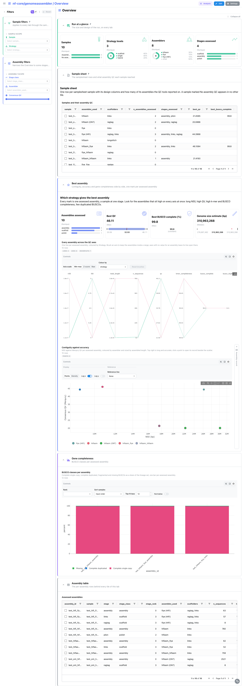
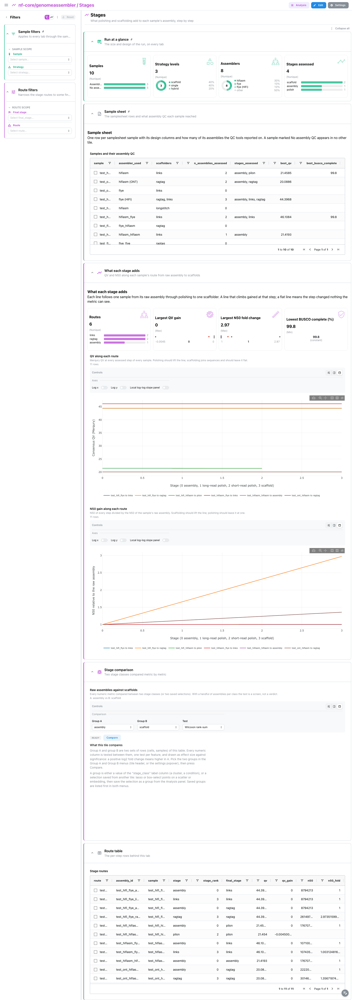
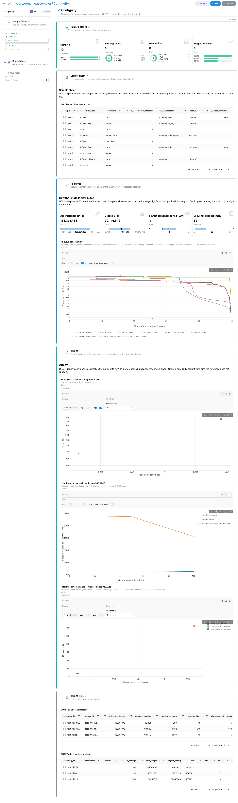
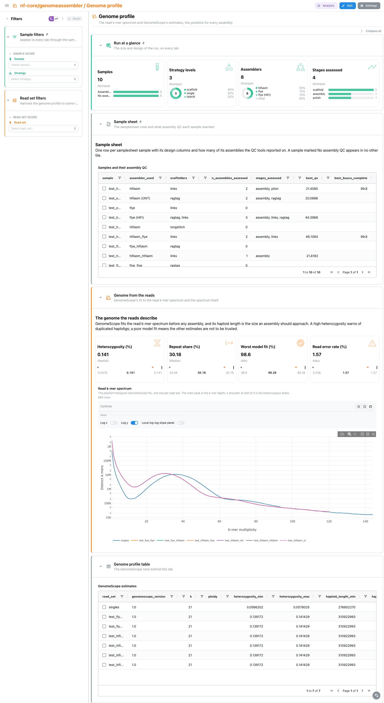
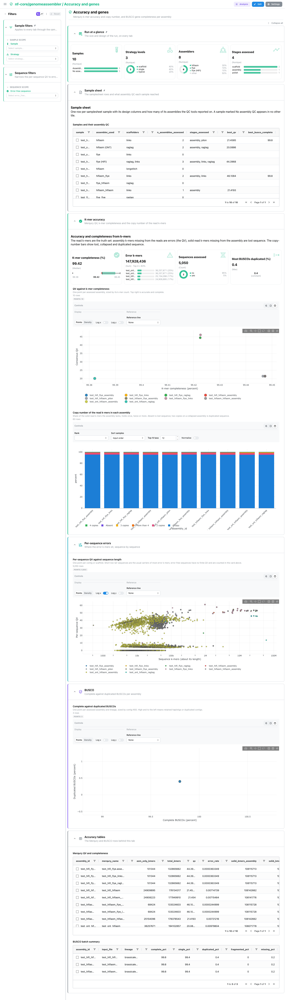

<div class="template-banner">
  <a class="template-banner-logo" href="https://nf-co.re/genomeassembler" target="_blank" title="nf-core/genomeassembler on nf-co.re">
    
    
  </a>
  <div class="template-banner-body">
    <h1 class="template-title">Genome assembly</h1>
    <p class="template-subtitle">Contiguity, Merqury k-mer accuracy and BUSCO gene completeness of every assembly, polishing and scaffolding stage, compared across assembly strategies, with the GenomeScope read profile as the yardstick.</p>
    <p class="template-links">
      <a href="https://nf-co.re/genomeassembler" target="_blank"><i class="mdi mdi-open-in-new"></i> nf-co.re</a>
      <a href="https://github.com/nf-core/genomeassembler" target="_blank"><i class="mdi mdi-github"></i> GitHub</a>
    </p>
  </div>
  <span class="template-status-experimental template-banner-badge" data-tooltip="Experimental: shared as-is. Feedback and PRs welcome."><i class="mdi mdi-flask-outline"></i> Experimental</span>
</div>

<div class="tpl-version-pick" data-latest="2.0.0">
  <span class="tpl-version-icon"><i class="mdi mdi-source-branch"></i></span>
  <span class="tpl-version-label">Template version</span>
  <select id="tpl-version" class="tpl-version-select" aria-label="Template version">
    <option value="2.0.0" selected>2.0.0</option>
  </select>
  <span class="tpl-version-badge">latest</span>
</div>

The genomeassembler template follows an nf-core/genomeassembler run from its raw
assemblies through polishing and scaffolding, one tab per question:

- :material-view-dashboard-outline: **Overview**: which assembly strategy gives the best contiguity, accuracy and gene completeness
- :material-chart-timeline-variant: **Stages**: what each polishing and scaffolding step adds to a sample's assembly
- :material-ruler: **Contiguity**: Nx curves for every assessed assembly, and QUAST's view of the ones it scored
- :material-chart-bell-curve: **Genome profile**: the read k-mer spectrum and GenomeScope's genome estimates
- :material-shield-check-outline: **Accuracy and genes**: Merqury QV, k-mer completeness and copy number, and BUSCO

A `Run at a glance` strip and the collapsed `Sample sheet` are pinned to the top
of every tab, and the `Sample filters` group (sample and design group) applies
everywhere through the samplesheet links.

!!! info "No MultiQC report, one row per assessed assembly"
    nf-core/genomeassembler writes no MultiQC report, so the landing tab is an
    Overview built from the QC tools' own files. The unit of every tile is the
    assessed assembly, which every QC tool names `<sample>_<stage>`: the raw
    assembly, each polishing step (medaka, dorado, pilon) and each scaffolder
    (LINKS, LongStitch, RagTag). A sample whose assembly never reached QC stays
    in the sample sheet as `No assembly QC` and appears in no other tile.

---

## :material-rocket-launch-outline: Quick start

=== "Point at a finished run"

    ```bash
    depictio run \
      --template nf-core/genomeassembler/latest \
      --data-root /path/to/genomeassembler_results \
      --var METADATA_FILE=/path/to/samplesheet.csv \
      --var GROUP_COL=strategy
    ```

    The pipeline publishes no copy of its samplesheet, and the samplesheet is the
    design every filter reads. `METADATA_FILE` defaults to `input/samplesheet.csv`
    under the data root, so copying the sheet there is enough. `GROUP_COL`
    (default `strategy`) picks the column the design filter and the colours group
    on: `assembler`, `polish`, `group` or any column you added work too, since
    every per-assembly table carries the samplesheet columns through.

=== "From the pipeline itself (v1.10.0+)"

    ```bash
    depictio-cli config nextflow --install     # once per machine
    nextflow run nf-core/genomeassembler -r 2.0.0 -profile docker --outdir results
    ```

    No `depictio run`, and no template named: the pipeline ingests its own
    output directory when it finishes and resolves this template from its own
    manifest. See [Nextflow trigger](../../depictio-cli/nextflow-trigger.md).

---

## :material-book-open-variant: Reference

The template reads, per assessed assembly, the samtools idxstats of the reads
mapped back (every sequence and its length, from which N50, L50, auN and the Nx
curve are computed), Merqury's QV, completeness, per-sequence QV and copy-number
spectrum, the BUSCO batch summary and QUAST's transposed report; and per read
set, the jellyfish histogram and GenomeScope's summary. Every tool collection is
optional, so a run that skipped a tool, or an assembly a tool never reached,
leaves its tiles empty instead of breaking the import. 25 of its 58 components
carry a `use:` catalog reference, so a tile says where its panel comes from.

!!! info "Self-adapting layout"
    The dashboard adapts to whatever the run actually produced: components bound
    to pruned or unparsed data collections are hidden, tabs left with no real
    visualizations are dropped entirely, and the remaining components are
    re-packed so there are no empty rows.

<div class="tpl-version-block" data-version="2.0.0" markdown>

--8<-- "pipeline-templates/nf-core/_generated/genomeassembler-latest.md"

</div>

---

## :material-view-dashboard-outline: Dashboard tabs

Five tabs, read as a funnel: which strategy wins overall, what each stage adds,
how the length is distributed, what genome the reads describe, and how accurate
and complete each assembly is against it. Each tab below carries the **same icon
and colour the dashboard gives it**. Screenshots come from the run described
under Validation runs.

=== ":material-view-dashboard-outline:{ .mc-indigo } Overview"

    *Which assembly strategy gives the best assembly?*

    [{ loading=lazy }](../../images/pipeline-templates/nf-core/genomeassembler/overview_light.png){ .tpl-shot target="_blank" rel="noopener" }

    Cards give the assemblies assessed, the best Merqury QV, the best BUSCO
    complete share and GenomeScope's genome size estimate. A parallel coordinates
    plot lays every assembly across N50, L50, length, sequence count, QV, k-mer
    completeness and BUSCO, coloured by the design group. The N50 against QV
    scatter, coloured by assembler, carries a linked assembly record that folds to
    a slim rail until a point is picked; BUSCO class bars close the tab.

    ??? abstract ":material-tune-variant: Filters and components"

        **Filters** · `Sample` and the design group (`GROUP_COL`) on the
        samplesheet, persistent and pinned to the top of every tab, plus
        `Stage class`, `Assembler` and a `Consensus QV` range in an *Assembly
        scope* group.

        | Section | What it holds |
        |---|---|
        | Run at a glance | 4 cards: samples by QC status, design groups, assemblers, stages assessed (pinned) |
        | Sample sheet | *Samples and their assembly QC* (collapsed, pinned) |
        | Best assembly | 4 cards, *Every assembly across the QC axes*, *Contiguity against accuracy*, *Assembly record* |
        | Gene completeness | *BUSCO classes per assembly* |
        | Assembly table | *Assessed assemblies* (collapsed) |

=== ":material-chart-timeline-variant:{ .mc-grape } Stages"

    *What do polishing and scaffolding add, step by step?*

    [{ loading=lazy }](../../images/pipeline-templates/nf-core/genomeassembler/stages_light.png){ .tpl-shot target="_blank" rel="noopener" }

    Each sample's route runs from its raw assembly through polishing to each
    scaffolder. Two profiles track the QV and the N50 fold change along every
    route, so a step that costs accuracy or adds no contiguity shows as a flat or
    falling segment. A group comparison then contrasts raw assemblies with
    scaffolds metric by metric.

    ??? abstract ":material-tune-variant: Filters and components"

        **Filters** · `Final stage` and `Route` in a *Route scope* group.

        | Section | What it holds |
        |---|---|
        | What each stage adds | 4 cards, *QV along each route*, *N50 gain along each route* |
        | Stage comparison | *Raw assemblies against scaffolds* |
        | Route table | *Stage routes* (collapsed) |

=== ":material-ruler:{ .mc-blue } Contiguity"

    *How is the assembled length distributed across sequences?*

    [{ loading=lazy }](../../images/pipeline-templates/nf-core/genomeassembler/contiguity_light.png){ .tpl-shot target="_blank" rel="noopener" }

    The Nx curves are computed from the idxstats sequence lengths of every
    assessed assembly, so they cover assemblies QUAST never scored. QUAST's
    reference-free N50 against length and the length kept above each contig
    length follow, and, when the run had a reference, genome fraction against
    misassemblies.

    ??? abstract ":material-tune-variant: Filters and components"

        **Filters** · `Stage` in a *Curve scope* group.

        | Section | What it holds |
        |---|---|
        | Nx curves | 4 cards, *Nx curve per assembly* |
        | QUAST | *N50 against assembled length (QUAST)*, *Length kept above each contig length (QUAST)*, *Reference coverage against misassemblies (QUAST)* |
        | QUAST tables | *QUAST against the reference*, *QUAST reference-free statistics* (collapsed) |

=== ":material-chart-bell-curve:{ .mc-orange } Genome profile"

    *What genome do the reads describe, before any assembly?*

    [{ loading=lazy }](../../images/pipeline-templates/nf-core/genomeassembler/genome_profile_light.png){ .tpl-shot target="_blank" rel="noopener" }

    GenomeScope's heterozygosity, repeat share, model fit and read error rate, next
    to the jellyfish k-mer spectrum it fits. This is the yardstick for the other
    tabs: an assembly much larger or smaller than the estimated genome size, or
    far off the expected heterozygosity, deserves a second look. Both
    collections are per read set, not per assembly.

    ??? abstract ":material-tune-variant: Filters and components"

        **Filters** · `Read set` in a *Read set scope* group.

        | Section | What it holds |
        |---|---|
        | Genome from the reads | 4 cards, *Read k-mer spectrum* |
        | Genome profile table | *GenomeScope estimates* (collapsed) |

=== ":material-shield-check-outline:{ .mc-teal } Accuracy and genes"

    *How accurate and how complete is each assembly?*

    [{ loading=lazy }](../../images/pipeline-templates/nf-core/genomeassembler/accuracy_and_genes_light.png){ .tpl-shot target="_blank" rel="noopener" }

    Merqury QV against k-mer completeness places each assembly, and the
    copy-number bars show how the read k-mers are represented in it, where
    missing or duplicated content shows up. The per-sequence QV scatter against
    sequence length says which sequences carry the error k-mers. BUSCO complete
    against duplicated closes the tab.

    ??? abstract ":material-tune-variant: Filters and components"

        **Filters** · `Error-free sequence` in a *Sequence scope* group.

        | Section | What it holds |
        |---|---|
        | K-mer accuracy | 4 cards, *QV against k-mer completeness*, *Copy number of the read k-mers in each assembly* |
        | Per-sequence errors | *Per-sequence QV against sequence length* |
        | BUSCO | *Complete against duplicated BUSCOs* |
        | Accuracy tables | *Merqury QV and completeness*, *BUSCO batch summary* (collapsed) |

Every per-assembly scatter and table selects on `assembly_id`, so a point picked on a QUAST,
Merqury or BUSCO scatter narrows the other tiles of its collection and follows
the project links; the stage profiles and route table select on `route`.

---

## :material-play-circle-outline: Running the pipeline

Depictio reads the **output** of nf-core/genomeassembler, it does not run the
pipeline. Run the pipeline first; give it a reference (`use_ref` and
`ref_fasta`, see the usage docs) if you want QUAST's reference-based view:

```bash
nextflow run nf-core/genomeassembler -r 2.0.0 \
  --input samplesheet.csv \
  --busco_lineage <lineage>_odb12 \
  --outdir results -profile docker
```

Then copy the samplesheet under `input/` and point Depictio at the results:

```bash
mkdir -p results/input && cp samplesheet.csv results/input/
depictio run --template nf-core/genomeassembler/latest --data-root results/
```

See [nf-co.re/genomeassembler/usage](https://nf-co.re/genomeassembler/2.0.0/docs/usage) for full pipeline documentation.

---

## :material-folder-open-outline: Required data structure

Point `--data-root` at the directory holding the pipeline output. Depictio scans
recursively and matches on file name. The pipeline writes one directory per
sample, plus one per read `group` that holds the reads-only outputs.

```text
<DATA_ROOT>/
├── input/
│   └── samplesheet.csv                          # the hub (METADATA_FILE default)
├── pipeline_info/
│   ├── params_*.json
│   └── *software*versions*.yml
├── <sample>/QC/
│   ├── alignments/<sample>_<stage>.idxstats      # sequence lengths: N50, L50, Nx
│   ├── merqury/*.qv, *.completeness.stats, *.spectra-cn.hist
│   ├── BUSCO/*-busco.batch_summary.txt
│   └── QUAST/<sample>_<stage>/transposed_report.tsv
└── <sample or group>/reads/genomescope/
    ├── genomescope/*_genomescope.txt
    └── jellyfish/histo/*_hist.tsv
```

`METADATA_ID_COL` (default `sample`) is the column every output directory is
named after. The assemblies themselves, the BAM files and the BUSCO run
directories are not read.

---

## :material-flask-outline: Validation runs

The template was validated against the AWS megatest of the 2.0.0 release
(`results-a72d47d9cdb50f21b97882dfb2abf4af8f4c74ad`, the full test samplesheet
without medaka), and the screenshots above come from it. That run is partial:
LINKS failed on one sample and the tasks aborted after it, so only half of the
samples reached assembly QC, QUAST and BUSCO ran on a few assemblies, and only
the raw, LINKS and RagTag stages carry data. The polishing stages and Hi-C
scaffolding are wired by name but not yet verified on data. `megatest.yaml`
lists the tables-only subset, and the download script also places the vendored
samplesheet under `input/`:

```bash
bash depictio/projects/nf-core/genomeassembler/2.0.0/download_test_data.sh /tmp/genomeassembler_test
depictio run --template nf-core/genomeassembler/latest --data-root /tmp/genomeassembler_test
```

Do not pass `--project-name` when ingesting: the dashboard is attached to the
project by name, so renaming it breaks a later `depictio dashboard import`.
Re-ingesting accumulates dashboards, so delete the project before repeating a run.

---

## :material-link-variant: Additional resources

- [nf-co.re/genomeassembler](https://nf-co.re/genomeassembler): official pipeline documentation
- [nf-co.re/genomeassembler/2.0.0/results](https://nf-co.re/genomeassembler/2.0.0/results): AWS test results
- [Template System Reference](../../usage/projects/templates.md): YAML format, variables, conditionals
- [Recipes](../../usage/projects/recipes.md): how to read, test, and write recipes

---

## :material-account-group-outline: Authorship

<div class="tpl-credits">
  <div class="tpl-credit">
    <span class="tpl-credit-role"><i class="mdi mdi-code-braces"></i> Developers</span>
    <span class="tpl-credit-note">Wrote the template, its recipes and its dashboards.</span>
    <a class="tpl-person" href="https://github.com/weber8thomas" target="_blank" rel="noopener">
       weber8thomas
    </a>
  </div>
  <div class="tpl-credit">
    <span class="tpl-credit-role"><i class="mdi mdi-eye-check-outline"></i> Reviewers</span>
    <span class="tpl-credit-note">Nobody has run it on their own data and signed it off yet, which is what keeps it Experimental.</span>
    <span class="tpl-person"><i class="mdi mdi-account-plus-outline"></i> Open</span>
  </div>
  <div class="tpl-credit">
    <span class="tpl-credit-role"><i class="mdi mdi-wrench-outline"></i> Maintainers</span>
    <span class="tpl-credit-note">Keep it working as nf-core/genomeassembler releases.</span>
    <a class="tpl-person" href="https://github.com/weber8thomas" target="_blank" rel="noopener">
       weber8thomas
    </a>
  </div>
</div>

Reviewing a template on your own data, or taking over a role here, is a
contribution in itself: the [contributing guide](../../developer/contributing-templates.md)
says what each one involves.
