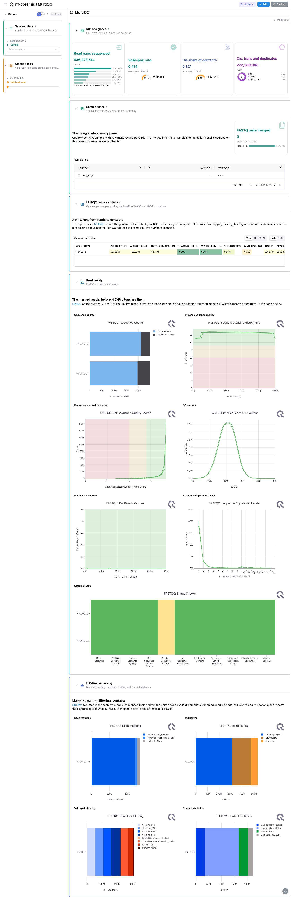
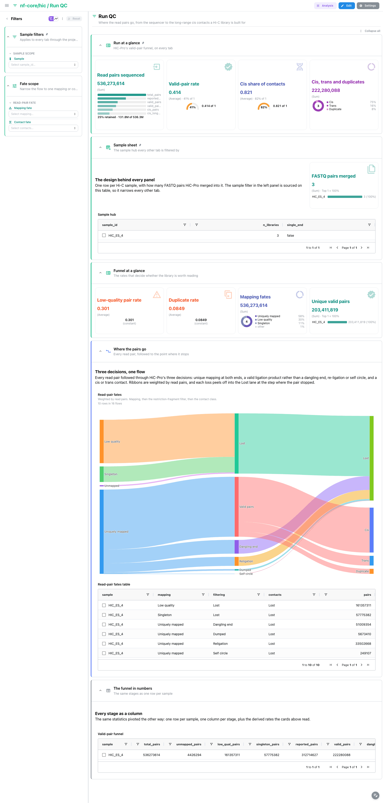
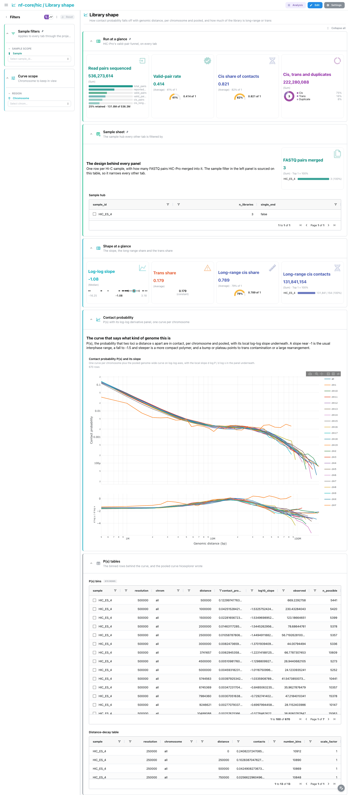
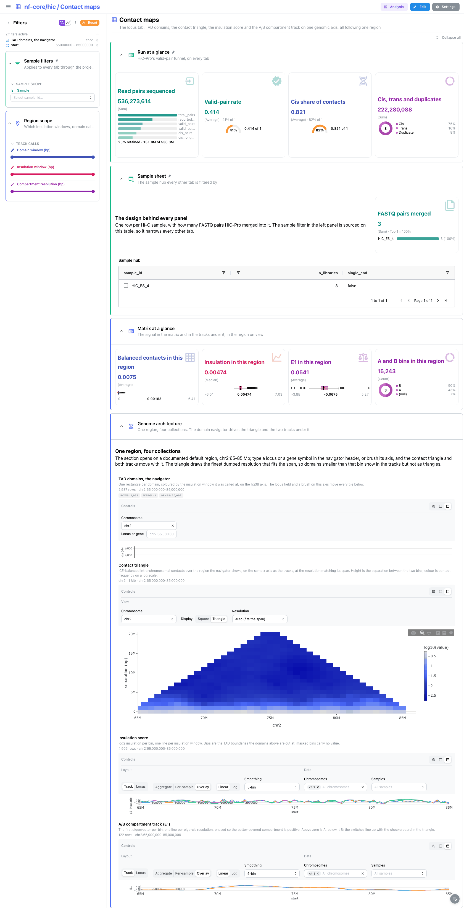
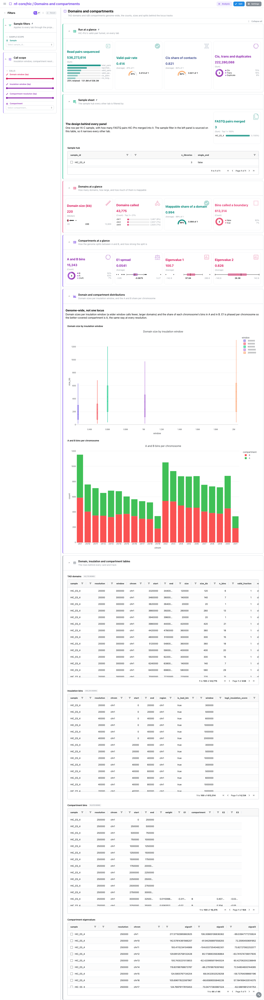

<div class="template-banner">
  <a class="template-banner-logo" href="https://nf-co.re/hic" target="_blank" title="nf-core/hic on nf-co.re">
    
    
  </a>
  <div class="template-banner-body">
    <h1 class="template-title">Hi-C</h1>
    <p class="template-subtitle">HiC-Pro's valid-pair funnel as filterable numbers, the contact probability curve, the contact matrix with its insulation, domain and compartment tracks at one locus, and the same calls genome-wide, next to the pipeline's MultiQC report.</p>
    <p class="template-links">
      <a href="https://nf-co.re/hic" target="_blank"><i class="mdi mdi-open-in-new"></i> nf-co.re</a>
      <a href="https://github.com/nf-core/hic" target="_blank"><i class="mdi mdi-github"></i> GitHub</a>
    </p>
  </div>
  <span class="template-status-experimental template-banner-badge" data-tooltip="Experimental: shared as-is. Feedback and PRs welcome."><i class="mdi mdi-flask-outline"></i> Experimental</span>
</div>

<div class="tpl-version-pick" data-latest="2.0.0">
  <span class="tpl-version-icon"><i class="mdi mdi-source-branch"></i></span>
  <span class="tpl-version-label">Template version</span>
  <select id="tpl-version" class="tpl-version-select" aria-label="Template version">
    <option value="2.0.0" selected>2.0.0</option>
  </select>
  <span class="tpl-version-badge">latest</span>
</div>

The hic template follows an nf-core/hic run from read pairs to chromatin
architecture, each tab reading the output built on the one before:

- :material-chart-box-outline: **MultiQC**: FastQC and HiC-Pro mapping, pairing and valid-pair panels from the run's MultiQC report
- :material-filter-variant: **Run QC**: every read pair followed to the long-range cis contacts a Hi-C library is built for
- :material-chart-line: **Library shape**: how contact probability falls off with genomic distance, with its log-log slope
- :material-grid: **Contact maps**: the contact triangle, the domain, insulation and compartment tracks on one genomic axis
- :material-border-all-variant: **Domains and compartments**: TAD sizes and the A/B split genome-wide, the rows behind the tracks

A `Run at a glance` strip (pairs sequenced, valid-pair rate, cis share, the
cis/trans/duplicate split), the `Sample filters` and a collapsed sample sheet are
pinned to the top of every tab, so the question "is this library any good?" is
answered wherever you land. A pick in the sample filter reaches the funnel, the
matrix, every track and both distance curves through the project links.

!!! warning "The MultiQC report must be regenerated"
    hic 2.0.0 ships MultiQC 1.13, which writes no parquet, and Depictio reads
    only `multiqc.parquet` (MultiQC 1.31 and later). Re-run MultiQC over the
    run's own tool outputs before ingesting, or the MultiQC tab stays empty:

    ```bash
    python -m depictio.dev_scripts.multiqc_reprocess --src <outdir> --dest <outdir>
    ```

!!! info "HiC-Pro's numbers are read twice, on purpose"
    The HiC-Pro panels stay on the MultiQC tab, because that is the report a
    reader may already know. A MultiQC panel cannot be filtered or joined, so
    `hicpro/stats/<sample>/*` is also read directly into a funnel row per sample
    and a weighted row per read-pair fate, which is what feeds the cards, the
    Sankey and the pinned strip.

---

## :material-rocket-launch-outline: Quick start

=== "Point at a finished run"

    ```bash
    depictio run \
      --template nf-core/hic/latest \
      --data-root /path/to/hic_results \
      --var GENOME=mm10
    ```

    `--data-root` is the only required value. `GENOME` (default `hg38`) is the
    UCSC name of the assembly the run was mapped to, which lays out the Contact
    maps axis: pass the UCSC spelling (`mm10`, `hg19`), not an iGenomes key such
    as `GRCm38`. The sample hub is the samplesheet the run validated,
    `samplesheet/samplesheet.valid.csv`, collapsed to one row per sample.

=== "From the pipeline itself (v1.10.0+)"

    ```bash
    depictio-cli config nextflow --install     # once per machine
    nextflow run nf-core/hic -r 2.0.0 -profile docker --outdir results
    ```

    No `depictio run`, and no template named: the pipeline ingests its own
    output directory when it finishes and resolves this template from its own
    manifest. The MultiQC tab stays empty until the report is regenerated as
    above. See [Nextflow trigger](../../depictio-cli/nextflow-trigger.md).

---

## :material-book-open-variant: Reference

The template reads the validated samplesheet, the regenerated MultiQC report,
HiC-Pro's statistics, the balanced `cooler dump` contacts and bins, the cooltools
compartment and insulation outputs, and hicexplorer's distance-decay curve. 52 of
its 54 tiles carry a `use:` catalog reference (`hicpro/*`, `cooler/*`,
`cooltools/*`, `hicexplorer/*`, `multiqc/*`), so a tile says where its panel
comes from.

!!! info "Self-adapting layout"
    The dashboard adapts to whatever the run actually produced: components bound
    to pruned or unparsed data collections are hidden, tabs left with no real
    visualizations are dropped entirely, and the remaining components are
    re-packed so there are no empty rows.

<div class="tpl-version-block" data-version="2.0.0" markdown>

--8<-- "pipeline-templates/nf-core/_generated/hic-latest.md"

</div>

---

## :material-view-dashboard-outline: Dashboard tabs

Five tabs, read as a funnel: is the report normal, where do the read pairs go,
what kind of genome does the contact curve describe, what does one locus look
like, and how do domains and compartments split the whole genome. Each tab below
carries the **same icon and colour the dashboard gives it**. A picked row or
point becomes a filter that follows the project links to the tiles it reaches.

=== "{ width=18 }{ width=18 } MultiQC"

    *Check the reads and the HiC-Pro processing as the report shows them.*

    [{ loading=lazy }](../../images/pipeline-templates/nf-core/hic/multiqc_light.png){ .tpl-shot target="_blank" rel="noopener" }

    The general statistics open the report, then FastQC on the merged reads and
    HiC-Pro's signature panels: two-step mapping, read pairing, valid-pair
    filtering (dangling ends, self circles, re-ligations dropped) and the cis/trans
    split of what survives. There is no trimming module: HiC-Pro's own mapping
    step does the trimming.

    ??? abstract ":material-tune-variant: Filters and components"

        **Filters** · `Sample` on the sample hub, persistent and pinned to the top
        of every tab, plus a tab-local `Valid-pair rate` range that narrows the
        pinned strip.

        | Section | What it holds |
        |---|---|
        | Run at a glance | 4 cards: pairs sequenced, valid-pair rate, cis share, cis/trans/duplicates |
        | Sample sheet | 1 card, *Sample hub* |
        | MultiQC general statistics | *General statistics* |
        | Read quality | 7 FastQC panels |
        | HiC-Pro processing | 4 HiC-Pro panels |

=== ":material-filter-variant:{ .mc-teal } Run QC"

    *Follow every read pair to the long-range cis contacts.*

    [{ loading=lazy }](../../images/pipeline-templates/nf-core/hic/run_qc_light.png){ .tpl-shot target="_blank" rel="noopener" }

    The Sankey follows HiC-Pro's three decisions, weighted by read pairs: does
    the pair map uniquely at both ends, could a real ligation have joined its two
    fragments, and is the surviving contact cis or trans. Losses peel off at the
    step they stopped at, and the three levels reconcile exactly with the totals
    HiC-Pro reports. The collapsed table pivots the same funnel to one row per
    sample.

    ??? abstract ":material-tune-variant: Filters and components"

        **Filters** · `Mapping fate` and `Contact fate` on the read-pair flow.

        | Section | What it holds |
        |---|---|
        | Funnel at a glance | 4 cards: low-quality rate, duplicate rate, mapping fates, unique valid pairs |
        | Where the pairs go | *Read-pair fates* (Sankey), *Read-pair fates table* |
        | The funnel in numbers | *Valid-pair funnel* (collapsed) |

=== ":material-chart-line:{ .mc-cyan } Library shape"

    *Read how contact probability decays with distance.*

    [{ loading=lazy }](../../images/pipeline-templates/nf-core/hic/library_shape_light.png){ .tpl-shot target="_blank" rel="noopener" }

    P(s), the probability that two loci a distance s apart touch, is recomputed
    per chromosome from the balanced contact dump, because nf-core/hic never runs
    `cooltools expected-cis`. Its denominator counts every bin pair that could have
    been observed, which keeps the tail from flattening. A derivative panel under
    the curves draws the local log-log slope: near -1 is the usual interphase
    range, and a bump or plateau points to trans contamination or a rearrangement.

    ??? abstract ":material-tune-variant: Filters and components"

        **Filters** · `Chromosome` on the P(s) curve. Picking a curve narrows
        the P(s) table and card to that chromosome.

        | Section | What it holds |
        |---|---|
        | Shape at a glance | 4 cards: log-log slope, trans share, long-range cis share and count |
        | Contact probability | *Contact probability P(s) and its slope* |
        | P(s) tables | *P(s) bins*, *Distance-decay table* (collapsed) |

=== ":material-grid:{ .mc-indigo } Contact maps"

    *Examine one locus: domains, the contact triangle, insulation and compartments.*

    [{ loading=lazy }](../../images/pipeline-templates/nf-core/hic/contact_maps_light.png){ .tpl-shot target="_blank" rel="noopener" }

    The locus tab stacks four collections on one `{GENOME}` axis. The TAD domain
    track is the navigator: a brush or a typed locus emits a region that `region`
    links carry to the contact triangle, the insulation score and the phased E1
    compartment track below it. The triangle reads the finest dumped resolution
    that fits the span, so zooming re-bins it; the cards read the region in view.

    ??? abstract ":material-tune-variant: Filters and components"

        **Filters** · `Domain window`, `Insulation window` and `Compartment
        resolution` choose which calls the tracks draw. There is no chromosome
        filter: the locus field is the section's chromosome.

        | Section | What it holds |
        |---|---|
        | Matrix at a glance | 4 cards on the region in view: balanced contacts, insulation, E1, A and B bins |
        | Genome architecture | *TAD domains, the navigator*, *Contact triangle*, *Insulation score*, *A/B compartment track (E1)* |

=== ":material-border-all-variant:{ .mc-violet } Domains and compartments"

    *Read TADs and compartments across the whole genome.*

    [{ loading=lazy }](../../images/pipeline-templates/nf-core/hic/domains_and_compartments_light.png){ .tpl-shot target="_blank" rel="noopener" }

    cooltools calls boundaries, not domains, and nf-core/hic 2.x emits no
    interval list, so the domains are derived from runs of boundary bins, with
    mostly unmappable spans dropped. E1 is phased per chromosome and resolution
    against bin coverage, so the better-covered side is A and the call does not
    flip between resolutions. Domain sizes per insulation window and the A and B
    bins per chromosome sit above the collapsed tables.

    ??? abstract ":material-tune-variant: Filters and components"

        **Filters** · `Domain window`, `Insulation window`, `Compartment
        resolution` and `Compartment`; no chromosome filter.

        | Section | What it holds |
        |---|---|
        | Domains at a glance | 4 cards: domain size, domains called, mappable share, boundary bins |
        | Compartments at a glance | 4 cards: A and B bins, E1 spread, eigenvalues 1 and 2 |
        | Domain and compartment distributions | *Domain size by insulation window*, *A and B bins per chromosome* |
        | Domain, insulation and compartment tables | 4 tables (collapsed) |

---

## :material-play-circle-outline: Running the pipeline

Depictio reads the **output** of nf-core/hic, it does not run the pipeline.
Run the pipeline first, without `--skip_compartments` or `--skip_tads`:

```bash
nextflow run nf-core/hic -r 2.0.0 \
  --input samplesheet.csv \
  --genome GRCm38 --digestion dpnii \
  -profile docker --outdir results
```

Then regenerate the MultiQC report and point Depictio at the results, passing the
UCSC name of the same assembly:

```bash
python -m depictio.dev_scripts.multiqc_reprocess --src results/ --dest results/
depictio run --template nf-core/hic/latest --data-root results/ --var GENOME=mm10
```

See [nf-co.re/hic/usage](https://nf-co.re/hic/2.0.0/docs/usage) for full pipeline documentation.

---

## :material-folder-open-outline: Required data structure

Point `--data-root` at the directory holding the pipeline output. Depictio scans
recursively and matches on file name, so a run with a different `--outdir`
layout lands in the same collections.

```text
<DATA_ROOT>/
├── samplesheet/samplesheet.valid.csv          # the hub: one row per FASTQ pair
├── pipeline_info/software_versions.yml
├── multiqc/multiqc_data/multiqc.parquet       # written by multiqc_reprocess
├── fastqc/*.zip                               # raw MultiQC inputs
├── hicpro/stats/<sample>/
│   └── *.{mmapstat,mpairstat,mRSstat,mergestat}
├── contact_maps/
│   ├── *_balanced.txt                         # cooler dump, one per resolution
│   └── cooler_bins_<resolution>.bed
├── compartments/
│   ├── *.cis.vecs.tsv                         # cooltools eigs-cis E1
│   └── *.cis.lam.txt                          # eigenvalues
├── tads/*_balanced_insulation.tsv             # cooltools insulation
└── distance_decay/*_distcount.txt             # hicPlotDistVsCounts
```

---

## :material-flask-outline: Validation runs

The template was validated on the nf-core AWS megatest of the 2.0.0 release,
`s3://nf-core-awsmegatests/hic/results-b4d89cfacf97a5835fba804887cf0fc7e0449e8d/`,
a single mouse ES cell sample merged from three FASTQ pairs, and the screenshots
above come from that run with `GENOME=mm10`. With one sample the sample filter
has one value, but nothing in the template assumes it: every collection carries a
sample column and the links are ready for a cohort.

```bash
DEST=/tmp/hic_test
bash depictio/projects/nf-core/hic/2.0.0/download_test_data.sh "$DEST"
python -m depictio.dev_scripts.multiqc_reprocess --src "$DEST" --dest "$DEST"
depictio run --template nf-core/hic/latest --data-root "$DEST" --var GENOME=mm10
```

Do not pass `--project-name` when ingesting: the dashboard is attached to the
project by name, so renaming it breaks a later `depictio dashboard import`.
Re-ingesting accumulates dashboards, so delete the project before repeating a run.

---

## :material-link-variant: Additional resources

- [nf-co.re/hic](https://nf-co.re/hic): official pipeline documentation
- [nf-co.re/hic/2.0.0/results](https://nf-co.re/hic/2.0.0/results): AWS test results
- [Template System Reference](../../usage/projects/templates.md): YAML format, variables, conditionals
- [Recipes](../../usage/projects/recipes.md): how to read, test, and write recipes

---

## :material-account-group-outline: Authorship

<div class="tpl-credits">
  <div class="tpl-credit">
    <span class="tpl-credit-role"><i class="mdi mdi-code-braces"></i> Developers</span>
    <span class="tpl-credit-note">Wrote the template, its recipes and its dashboards.</span>
    <a class="tpl-person" href="https://github.com/weber8thomas" target="_blank" rel="noopener">
       weber8thomas
    </a>
  </div>
  <div class="tpl-credit">
    <span class="tpl-credit-role"><i class="mdi mdi-eye-check-outline"></i> Reviewers</span>
    <span class="tpl-credit-note">Nobody has run it on their own data and signed it off yet, which is what keeps it Experimental.</span>
    <span class="tpl-person"><i class="mdi mdi-account-plus-outline"></i> Open</span>
  </div>
  <div class="tpl-credit">
    <span class="tpl-credit-role"><i class="mdi mdi-wrench-outline"></i> Maintainers</span>
    <span class="tpl-credit-note">Keep it working as nf-core/hic releases.</span>
    <a class="tpl-person" href="https://github.com/weber8thomas" target="_blank" rel="noopener">
       weber8thomas
    </a>
  </div>
</div>

Reviewing a template on your own data, or taking over a role here, is a
contribution in itself: the [contributing guide](../../developer/contributing-templates.md)
says what each one involves.
