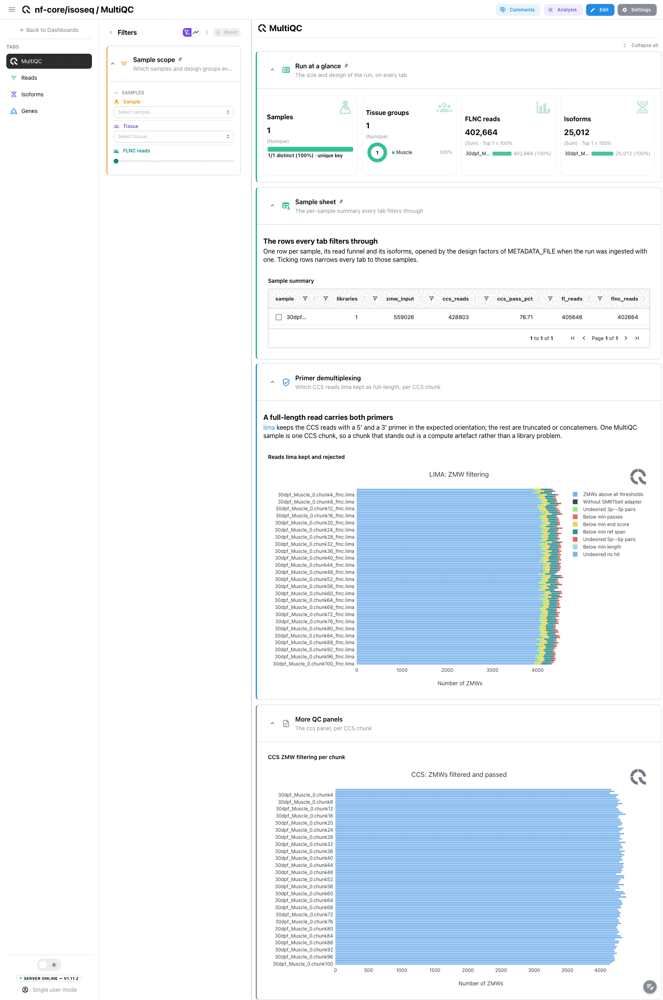
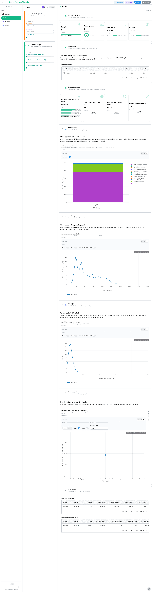
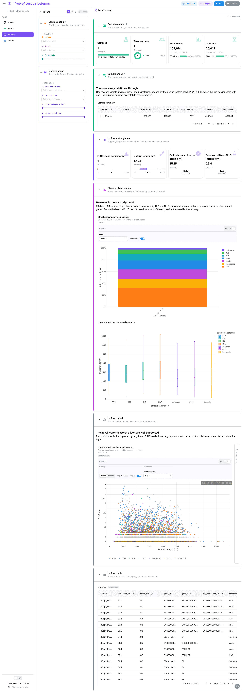
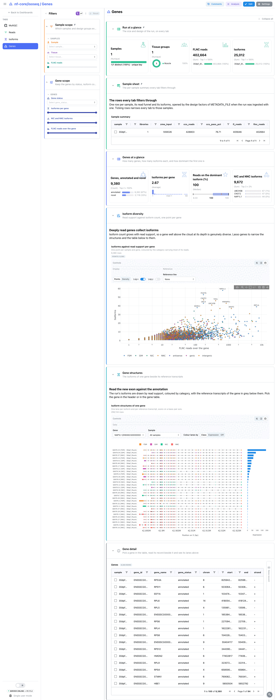

<div class="template-banner">
  <a class="template-banner-logo" href="https://nf-co.re/isoseq" target="_blank" title="nf-core/isoseq on nf-co.re">
    
    
  </a>
  <div class="template-banner-body">
    <h1 class="template-title">Full-length transcriptomes</h1>
    <p class="template-subtitle">PacBio Iso-Seq from reads to isoforms: CCS and primer QC, the full-length read funnel, insert and poly(A) lengths, and the TAMA transcriptome with read support, SQANTI-style structural categories against the reference and isoform structures per gene, next to the MultiQC report.</p>
    <p class="template-links">
      <a href="https://nf-co.re/isoseq" target="_blank"><i class="mdi mdi-open-in-new"></i> nf-co.re</a>
      <a href="https://github.com/nf-core/isoseq" target="_blank"><i class="mdi mdi-github"></i> GitHub</a>
    </p>
  </div>
  <span class="template-status-draft template-banner-badge" data-tooltip="Draft: generated and not yet reviewed. Expect it to need fixes before it is usable."><i class="mdi mdi-pencil-outline"></i> Draft</span>
</div>

<div class="tpl-version-pick" data-latest="3.0.1">
  <span class="tpl-version-icon"><i class="mdi mdi-source-branch"></i></span>
  <span class="tpl-version-label">Template version</span>
  <select id="tpl-version" class="tpl-version-select" aria-label="Template version">
    <option value="3.0.1" selected>3.0.1</option>
  </select>
  <span class="tpl-version-badge">latest</span>
</div>

The isoseq template follows an Iso-Seq run from the sequencing wells to the
transcriptome TAMA builds, and classifies every isoform against the reference
annotation itself, since the pipeline runs no SQANTI:

- :material-chart-box-outline: **MultiQC**: lima's primer filtering per CCS chunk, with the ccs panel folded away
- :material-filter-variant: **Reads**: the read funnel from ZMWs to collapsed full-length reads, the CCS outcome per library, insert and poly(A) tail lengths
- :material-dna: **Isoforms**: read support, length and novelty of the isoforms, their structural categories by isoform and by read
- :material-family-tree: **Genes**: isoforms per gene, how dominant the first isoform is, and the isoform structures of one gene beside its reference transcripts

A `Run at a glance` strip (samples, design groups, full-length non-chimeric
reads, isoforms), the collapsed `Sample sheet` and the `Sample scope` filters
(sample, design group, full-length read count) are pinned to every tab.

!!! info "Structural categories are computed by the template"
    nf-core/isoseq stops at TAMA merge. The template compares the exact intron
    chain of every isoform with the transcripts of `REFERENCE_GTF`, the SQANTI3
    way (FSM, ISM, NIC, NNC, then genic, antisense and intergenic), and assigns
    each isoform to a gene. SQANTI's fusion, genic-intron and mono-exon
    sub-categories are not separated.

!!! note "A minimap2 run needs the reference annotation"
    `ULTRA_INDEX/genome.gtf` is only published on the uLTRA route, the default
    aligner. For a run with `--aligner minimap2`, pass the GTF the run was
    started with as `REFERENCE_GTF`; without it every isoform is
    `unclassified` and the structure view draws no reference lanes.

---

## :material-rocket-launch-outline: Quick start

=== "Point at a finished run"

    ```bash
    depictio run \
      --template nf-core/isoseq/latest \
      --data-root /path/to/isoseq_results
    ```

    `--data-root` is the only thing you have to pass. isoseq publishes no
    samplesheet and its samplesheet carries no design column, so the sample hub
    is built from the per-chunk reports, and a design is an optional table:

    ```bash
    depictio run \
      --template nf-core/isoseq/latest \
      --data-root /path/to/isoseq_results \
      --var METADATA_FILE=/path/to/design.tsv \
      --var GROUP_COL=condition
    ```

    | Variable | Default | Role |
    |---|---|---|
    | `METADATA_FILE` | none | Design table (TSV or CSV): sample id in the first column or a column named `sample`, one column per factor. Enables the design filter and the group card |
    | `METADATA_ID_COL` | first column | Design table sample-id column |
    | `GROUP_COL` | first factor column | Design column the dashboard groups and filters by |
    | `REFERENCE_GTF` | `{DATA_ROOT}/ULTRA_INDEX/genome.gtf` | Annotation the isoforms are classified against; pass it for a minimap2 run |
    | `SKIP_MULTIQC` | unset | Set for a run with `--skip_multiqc`: drops the MultiQC collection |

=== "From the pipeline itself (v1.10.0+)"

    ```bash
    depictio-cli config nextflow --install     # once per machine
    nextflow run nf-core/isoseq -r 3.0.1 -profile docker --outdir results
    ```

    No `depictio run`, and no template named: the pipeline ingests its own
    output directory when it finishes and resolves this template from its own
    manifest. See [Nextflow trigger](../../depictio-cli/nextflow-trigger.md).

---

## :material-book-open-variant: Reference

The template reads the per-chunk CCS and refine reports, the TAMA poly(A),
collapse and merge outputs, the reference annotation the run indexed and the
native MultiQC report. The pipeline names every per-chunk file
`<sample>_<N>.chunk<X>.*`: the recipes sum the chunks back into libraries (one
per samplesheet row) and the libraries into samples, the rule TAMA merge
applies before it writes one annotation per sample. The pooled annotation of
`--tama_merge_all` is left out so no isoform is counted twice.

!!! info "Self-adapting layout"
    The dashboard adapts to whatever the run actually produced: components bound
    to pruned or unparsed data collections are hidden, tabs left with no real
    visualizations are dropped entirely, and the remaining components are
    re-packed so there are no empty rows. A samplesheet row started after CCS
    skips the CCS and refine collections; the hub keeps the sample with empty
    funnel columns.

<div class="tpl-version-block" data-version="3.0.1" markdown>

--8<-- "pipeline-templates/nf-core/_generated/isoseq-latest.md"

</div>

---

## :material-view-dashboard-outline: Dashboard tabs

Four tabs, read as a funnel: the report, what became of the reads, what the
isoforms are, and which genes carry them. Each tab below carries the **same icon
and colour the dashboard gives it**.

=== "{ width=18 }{ width=18 } MultiQC"

    *Did the CCS reads carry both primers, chunk by chunk?*

    [{ loading=lazy }](../../images/pipeline-templates/nf-core/isoseq/multiqc_light.png){ .tpl-shot target="_blank" rel="noopener" }

    The run's native MultiQC report, no reprocess needed. lima keeps the CCS
    reads with a 5' and a 3' primer in the expected orientation; the rest are
    truncated or concatemers. One MultiQC sample is one CCS chunk, so a chunk
    that stands out is a compute artefact rather than a library problem. The
    ccs panel is folded away, since the Reads tab redraws the same counts per
    library.

    ??? abstract ":material-tune-variant: Filters and components"

        **Filters** · `Sample`, the design group and a `FLNC reads` range on the
        sample hub, persistent and pinned to the top of every tab.

        | Section | What it holds |
        |---|---|
        | Run at a glance | 4 cards, pinned to every tab |
        | Sample sheet | *Sample summary*, collapsed and pinned to every tab |
        | Primer demultiplexing | *Reads lima kept and rejected* |
        | More QC panels | *CCS ZMW filtering per chunk*, collapsed |

=== ":material-filter-variant:{ .mc-teal } Reads"

    *How many sequencing wells became a full-length read that ended up in an isoform?*

    [{ loading=lazy }](../../images/pipeline-templates/nf-core/isoseq/reads_light.png){ .tpl-shot target="_blank" rel="noopener" }

    One attrition card follows the reads from ZMWs through CCS, full-length and
    full-length non-chimeric reads to the reads collapsed into a final isoform,
    beside the CCS pass rate, the non-chimeric share and the median insert
    length per sample. The CCS outcome of every ZMW is stacked to 100 % per
    library, then come the insert length and poly(A) tail length distributions:
    a peak far below the others points at degraded RNA or a failed size
    selection, and long tails mean they reached mapping untrimmed. A sample
    plane of depth against collapse rate drives a **Sample record** beside it.

    ??? abstract ":material-tune-variant: Filters and components"

        **Filters** · `ZMWs giving a CCS read (%)`, `FLNC reads in a final
        isoform (%)` and `Median insert length (bp)` ranges, in the tab-local
        *Read QC scope*.

        | Section | What it holds |
        |---|---|
        | Reads at a glance | 4 cards |
        | CCS outcome | *CCS outcome per library* |
        | Insert length | *FLNC insert length distribution* |
        | Poly(A) tails | *Poly(A) tail length distribution* |
        | Sample detail | *FLNC depth and collapse rate per sample*, *Sample record* |
        | Read tables | *CCS yield per library*, *Full-length reads per library*, collapsed |

=== ":material-dna:{ .mc-violet } Isoforms"

    *How much of the transcriptome is new, and is the novelty well supported?*

    [{ loading=lazy }](../../images/pipeline-templates/nf-core/isoseq/isoforms_light.png){ .tpl-shot target="_blank" rel="noopener" }

    Read support, length and novelty of the isoforms, then the structural
    category composition, by isoform or by full-length read through a Level
    picker, and isoform length per category, with one fixed colour per category
    across the tab. FSM and ISM isoforms repeat an annotated intron chain, NIC
    and NNC ones are new combinations or new splice sites of annotated genes.
    An isoform plane of length against read support drives an **Isoform
    record** beside it; a lasso on it narrows the tab. The isoform filters also
    narrow the Genes tab.

    ??? abstract ":material-tune-variant: Filters and components"

        **Filters** · `Structural category`, `Exon structure`, and `FLNC reads
        per isoform` and `Isoform length (bp)` ranges on the isoforms, in the
        tab-local *Isoform scope*.

        | Section | What it holds |
        |---|---|
        | Isoforms at a glance | 4 cards |
        | Structural categories | *Structural category composition*, *Isoform length per structural category* |
        | Isoform detail | *Isoform length against read support*, *Isoform record* |
        | Isoform table | *Isoforms*, collapsed |

=== ":material-family-tree:{ .mc-indigo } Genes"

    *Which genes carry several isoforms, and what do the new ones change?*

    [{ loading=lazy }](../../images/pipeline-templates/nf-core/isoseq/genes_light.png){ .tpl-shot target="_blank" rel="noopener" }

    Genes by status (annotated or novel), isoforms per gene, the read share of
    the dominant isoform and the NIC and NNC isoform count. Isoform count grows
    with read support, so a gene well above the cloud at its depth is genuinely
    diverse; a lasso there narrows the structures and the table below. The
    structure view draws the run's isoforms of one gene by read support,
    coloured by category, with the gene's reference transcripts in grey below
    them. A row picked in the gene table draws that gene's lanes and opens its
    **Gene record** beside the table.

    ??? abstract ":material-tune-variant: Filters and components"

        **Filters** · `Gene status`, and `Isoforms per gene`, `NIC and NNC
        isoforms` and `FLNC reads over the gene` ranges, in the tab-local *Gene
        scope*.

        | Section | What it holds |
        |---|---|
        | Genes at a glance | 4 cards |
        | Isoform diversity | *Isoforms against read support per gene* |
        | Gene structures | *Isoform structures of one gene* |
        | Gene detail | *Genes*, *Gene record* |

Tables and point views select on their entity column: the sample sheet and the
sample plane on the sample, the isoform plane on the isoform, the gene table
and the diversity scatter on the gene. The sample filters reach the MultiQC
panels too, whose samples are CCS chunks matched to the hub by prefix. The
structure view is not linked to the sample hub, so a sample filter never drops
its reference lanes.

---

## :material-play-circle-outline: Running the pipeline

Depictio reads the **output** of nf-core/isoseq, it does not run the pipeline.
Run the pipeline first; uLTRA, the aligner the template reads its default
annotation from, needs a GTF:

```bash
nextflow run nf-core/isoseq -r 3.0.1 \
  --input samplesheet.csv \
  --primers primers.fasta \
  --aligner ultra \
  --fasta genome.fa --gtf genes.gtf \
  --outdir results -profile docker
```

Then point Depictio at the results. isoseq 3.0.1 ships a MultiQC parquet, so no
reprocess step is needed:

```bash
depictio run --template nf-core/isoseq/latest --data-root results/
```

See [nf-co.re/isoseq/usage](https://nf-co.re/isoseq/3.0.1/docs/usage) for full pipeline documentation.

---

## :material-folder-open-outline: Required data structure

Point `--data-root` at the directory holding the pipeline output. Depictio scans
recursively and matches on file name; per-chunk files are grouped back into
libraries and samples by their `<sample>_<N>.chunk<X>` prefix.

```text
<DATA_ROOT>/
├── pipeline_info/
│   ├── params_*.json
│   └── *software*versions*.yml
├── multiqc/multiqc_data/multiqc.parquet        # native; absent with SKIP_MULTIQC
├── 01_PBCCS/*.report.json                      # CCS report per chunk (optional)
├── 03_ISOSEQ_REFINE/
│   ├── *.filter_summary.report.json            # FL and FLNC counts (optional)
│   └── *.report.csv                            # per-read insert length (optional)
├── 05_GSTAMA_POLYACLEANUP/*_polya_flnc_report.txt.gz   # optional
├── 07_GSTAMA_COLLAPSE/*_trans_report.txt       # reads per collapsed model
├── 09_GSTAMA_MERGE/
│   ├── <sample>.bed                            # the final transcriptome
│   └── <sample>_merge.txt                      # models behind each isoform
└── ULTRA_INDEX/genome.gtf                      # default REFERENCE_GTF (uLTRA route)
```

The BAMs and FASTAs of every step are not read, nor are TAMA's per-read and
per-variant logs.

---

## :material-flask-outline: Validation runs

The template was validated against the AWS megatest of the 3.0.1 release,
`results-6c944831289d4d6e33497026f6b18e8c671705bd`, on its `test_full`
profile: one Iso-Seq sample started from subreads, CCS split in 100 chunks,
uLTRA mapping and TAMA collapse and merge. The screenshots above come from that
run. The BAMs were not fetched; 234 MB of the 286 MB subset is the uLTRA GTF.
The run publishes no design table, so the template ships one written for the
megatest, which the download script copies under `input/`. A single sample
leaves every between-sample view with one point, which keeps the template a
Draft.

```bash
DEST=/tmp/isoseq_test
bash depictio/projects/nf-core/isoseq/3.0.1/download_test_data.sh "$DEST"
depictio run --template nf-core/isoseq/latest --data-root "$DEST" \
  --var METADATA_FILE="$DEST/input/sample_metadata.tsv" \
  --var GROUP_COL=tissue
```

Do not pass `--project-name` when ingesting: the dashboard is attached to the
project by name, so renaming it breaks a later `depictio dashboard import`.
Re-ingesting accumulates dashboards, so delete the project before repeating a run.

---

## :material-link-variant: Additional resources

- [nf-co.re/isoseq](https://nf-co.re/isoseq): official pipeline documentation
- [nf-co.re/isoseq/3.0.1/results](https://nf-co.re/isoseq/3.0.1/results): AWS test results
- [Template System Reference](../../usage/projects/templates.md): YAML format, variables, conditionals
- [Recipes](../../usage/projects/recipes.md): how to read, test, and write recipes

---

## :material-account-group-outline: Authorship

<div class="tpl-credits">
  <div class="tpl-credit">
    <span class="tpl-credit-role"><i class="mdi mdi-code-braces"></i> Developers</span>
    <span class="tpl-credit-note">Wrote the template, its recipes and its dashboards.</span>
    <a class="tpl-person" href="https://github.com/weber8thomas" target="_blank" rel="noopener">
       weber8thomas
    </a>
  </div>
  <div class="tpl-credit">
    <span class="tpl-credit-role"><i class="mdi mdi-eye-check-outline"></i> Reviewers</span>
    <span class="tpl-credit-note">Nobody has run it on their own data and signed it off yet, which is what keeps it a Draft.</span>
    <span class="tpl-person"><i class="mdi mdi-account-plus-outline"></i> Open</span>
  </div>
  <div class="tpl-credit">
    <span class="tpl-credit-role"><i class="mdi mdi-wrench-outline"></i> Maintainers</span>
    <span class="tpl-credit-note">Keep it working as nf-core/isoseq releases.</span>
    <a class="tpl-person" href="https://github.com/weber8thomas" target="_blank" rel="noopener">
       weber8thomas
    </a>
  </div>
</div>

Reviewing a template on your own data, or taking over a role here, is a
contribution in itself: the [contributing guide](../../developer/contributing-templates.md)
says what each one involves.
