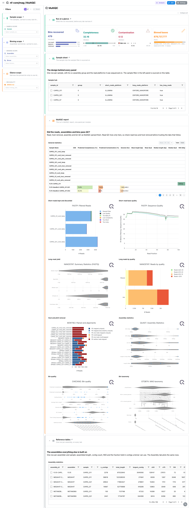
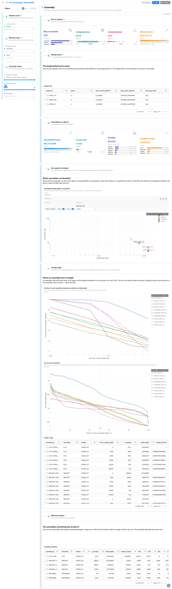
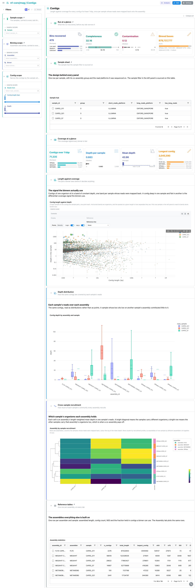
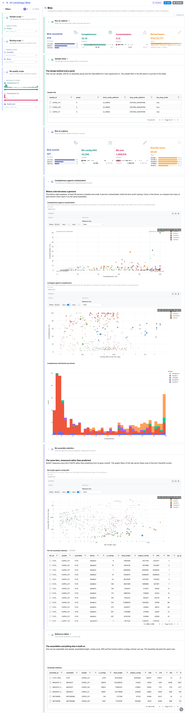
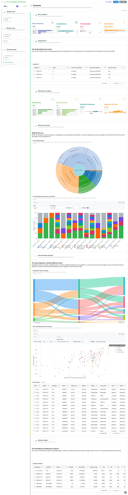
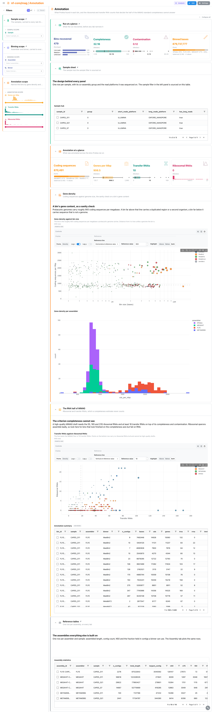
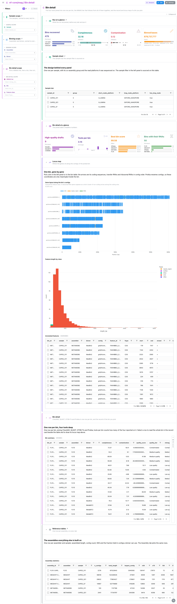

<div class="template-banner">
  <a class="template-banner-logo" href="https://nf-co.re/mag" target="_blank" title="nf-core/mag on nf-co.re">
    
    
  </a>
  <div class="template-banner-body">
    <h1 class="template-title">Metagenome Assembly</h1>
    <p class="template-subtitle">The bin funnel from reads to metagenome-assembled genomes: assembly contiguity, contig coverage, CheckM2 bin quality, GTDB-Tk taxonomy, Prokka annotation and a per-bin record and locus map, next to the MultiQC report.</p>
    <p class="template-links">
      <a href="https://nf-co.re/mag" target="_blank"><i class="mdi mdi-open-in-new"></i> nf-co.re</a>
      <a href="https://github.com/nf-core/mag" target="_blank"><i class="mdi mdi-github"></i> GitHub</a>
    </p>
  </div>
  <span class="template-status-experimental template-banner-badge" data-tooltip="Experimental: shared as-is. Feedback and PRs welcome."><i class="mdi mdi-flask-outline"></i> Experimental</span>
</div>

<div class="tpl-version-pick" data-latest="5.5.0">
  <span class="tpl-version-icon"><i class="mdi mdi-source-branch"></i></span>
  <span class="tpl-version-label">Template version</span>
  <select id="tpl-version" class="tpl-version-select" aria-label="Template version">
    <option value="5.5.0" selected>5.5.0</option>
  </select>
  <span class="tpl-version-badge">latest</span>
</div>

The mag template reads an nf-core/mag run as a funnel from assemblies to
genomes, where the unit is the bin rather than the sample:

- :material-chart-box-outline: **MultiQC**: fastp, NanoStat, Bowtie2, QUAST, CheckM2 and GTDB-Tk panels from the run's MultiQC report
- :material-dna: **Assembly**: what each assembler made of the same samples, size against contiguity and the Nx curve
- :material-chart-scatter-plot: **Contigs**: the length and coverage signal every binner is fed, and which sample each assembly recruits
- :material-bacteria-outline: **Bins**: CheckM2 completeness against contamination, cut at the MIMAG thresholds
- :material-family-tree: **Taxonomy**: the GTDB-Tk lineage of the bins that passed, and how each binner recovered the community
- :material-file-document-outline: **Annotation**: Prokka gene density and the ribosomal and transfer RNAs of the MIMAG standard
- :material-microscope: **Bin detail**: the four tools joined per bin, a bin record and the locus map of the bin you pick

Every assembler is crossed with every binner over every sample, so the controls
that matter are the assembler, the binner, the phylum and the quality thresholds.
The `Sample scope` and `Binning scope` (assembler, binner) filters, a four-card
bin strip and a collapsed sample sheet are pinned to the top of every tab, and
the per-assembly statistics table to the bottom.

!!! warning "A MultiQC parquet is required"
    Depictio reads only `multiqc.parquet` (MultiQC 1.31 and later). When the run
    published no parquet, or no `multiqc/` directory at all, regenerate the
    report from the run's raw tool outputs before ingesting:

    ```bash
    python -m depictio.dev_scripts.multiqc_reprocess --src <outdir> --dest <outdir>
    ```

!!! info "The bin summary is rebuilt Depictio side"
    QUAST, CheckM2, Prokka and GTDB-Tk each score a different subset of the bins
    (GTDB-Tk only places the ones that pass its own thresholds). The template
    joins the four tool outputs into one outer-joined row per bin, with a
    `sources_present` count, so a gap between tools is a readable number rather
    than a silent row loss. Contig coverage stays per contig: without the
    contig-to-bin tables it is never rolled up to a bin.

---

## :material-rocket-launch-outline: Quick start

=== "Point at a finished run"

    ```bash
    depictio run \
      --template nf-core/mag/latest \
      --data-root /path/to/mag_results
    ```

    `--data-root` is the only variable. The sample hub reads the samplesheet at
    `input/samplesheet.full.v4.csv` under the data root; mag does not publish its
    `--input`, so copy the sheet the run was launched with to that path.

=== "From the pipeline itself (v1.10.0+)"

    ```bash
    depictio-cli config nextflow --install     # once per machine
    nextflow run nf-core/mag -r 5.5.0 -profile docker --outdir results
    ```

    No `depictio run`, and no template named: the pipeline ingests its own
    output directory when it finishes and resolves this template from its own
    manifest. The samplesheet copy and the MultiQC parquet above still apply.
    See [Nextflow trigger](../../depictio-cli/nextflow-trigger.md).

---

## :material-book-open-variant: Reference

The template reads the samplesheet, the MultiQC report, the QUAST assembly and bin
reports, the per-contig depth tables, CheckM2, GTDB-Tk and the Prokka summaries
and GFFs. 61 of its 65 tiles carry a `use:` catalog reference (`quast/*`, `mag/*`,
`checkm2/*`, `gtdbtk/*`, `prokka/*`, `multiqc/*`), so a tile says where its panel
comes from. Every scatter keeps its analysis controls in the tile header.

!!! info "Self-adapting layout"
    The dashboard adapts to whatever the run actually produced: components bound
    to pruned or unparsed data collections are hidden, tabs left with no real
    visualizations are dropped entirely, and the remaining components are
    re-packed so there are no empty rows.

<div class="tpl-version-block" data-version="5.5.0" markdown>

--8<-- "pipeline-templates/nf-core/_generated/mag-latest.md"

</div>

---

## :material-view-dashboard-outline: Dashboard tabs

Seven tabs, read as a funnel: did the run pass QC, which assemblies are binnable,
what signal the binners saw, which bins are genomes, what they are, what they
carry, and one bin in detail. Each tab below carries the **same icon and colour
the dashboard gives it**. A picked row or point becomes a filter that follows the
project links to the tiles it reaches.

=== "{ width=18 }{ width=18 } MultiQC"

    *Check reads, host removal, assemblies and bins as the report shows them.*

    [{ loading=lazy }](../../images/pipeline-templates/nf-core/mag/multiqc_light.png){ .tpl-shot target="_blank" rel="noopener" }

    Read QC lives here only: fastp writes JSON and NanoPlot free text, neither of
    which a table collection reads, so there is no Reads tab. The report covers
    short- and long-read QC, host and phiX removal, the QUAST assembly statistics,
    CheckM2 bin quality and the GTDB-Tk taxonomy summary.

    ??? abstract ":material-tune-variant: Filters and components"

        **Filters** · `Sample`, `Assembler` and `Binner`, persistent and pinned
        to the top of every tab, plus a tab-local `MIMAG tier` that narrows the
        pinned bin strip.

        | Section | What it holds |
        |---|---|
        | Run at a glance | 4 cards: bins recovered by MIMAG tier, completeness, contamination, binned bases |
        | Sample sheet | *Sample hub* |
        | MultiQC report | *General statistics* and 8 module panels (fastp, NanoStat, Bowtie2, QUAST, CheckM2, GTDB-Tk) |
        | Reference tables | *Assembly statistics* |

=== ":material-dna:{ .mc-blue } Assembly"

    *Compare the assemblers on size and contiguity.*

    [{ loading=lazy }](../../images/pipeline-templates/nf-core/mag/assembly_light.png){ .tpl-shot target="_blank" rel="noopener" }

    Assembled length against contig N50 separates binnable assemblies, long and
    in long pieces, from fragmented ones. `Contig length` shows how much of each
    assembly survives each QUAST minimum contig length, and the Nx curve per
    assembly, built with QUAST's 500 bp floor so it crosses 50 at the QUAST N50.

    ??? abstract ":material-tune-variant: Filters and components"

        **Filters** · a `Minimum contig length range` that keeps every curve
        intact inside the window, a `Contig N50` range, and `Nx curves` to pick
        assemblies.

        | Section | What it holds |
        |---|---|
        | Assemblies at a glance | 4 cards: assembled bases, contig N50, contigs, longest contig |
        | Size against contiguity | *Assembled length against contig N50* |
        | Contig length | *Fraction of each assembly retained per minimum contig length*, *Ladder rungs*, *Nx curve per assembly* |

=== ":material-chart-scatter-plot:{ .mc-cyan } Contigs"

    *See the coverage signal the binners receive.*

    [{ loading=lazy }](../../images/pipeline-templates/nf-core/mag/contigs_light.png){ .tpl-shot target="_blank" rel="noopener" }

    Every contig of at least 1 kbp appears once per sample whose reads were mapped
    back onto its assembly. Length against depth is the plot a binner sees before
    it decides anything, drawn from a server-side hash sample. The recruitment
    heatmap, one row per assembly and one column per read sample, shows which
    sample's organisms each assembly holds.

    ??? abstract ":material-tune-variant: Filters and components"

        **Filters** · `Reads from`, and `Contig length` and `Depth` ranges.

        | Section | What it holds |
        |---|---|
        | Coverage at a glance | 4 cards: contigs over 1 kbp, depth per sample, mean depth, longest contig |
        | Length against coverage | *Contig length against depth* |
        | Depth distribution | *Contig depth by assembly and sample* |
        | Cross-sample recruitment | *Assembly by sample recruitment* (heatmap) |

=== ":material-bacteria-outline:{ .mc-indigo } Bins"

    *Judge which bins are genomes.*

    [{ loading=lazy }](../../images/pipeline-templates/nf-core/mag/bins_light.png){ .tpl-shot target="_blank" rel="noopener" }

    Completeness against contamination is cut into quadrants at the MIMAG
    high-quality thresholds (90 % complete, under 5 % contaminated) and coloured
    by binner, with contiguity against completeness beside it. The QUAST section
    measures the same bins rather than predicting them, and is linked to CheckM2
    by bin, so the tab's quality filters reach it too.

    ??? abstract ":material-tune-variant: Filters and components"

        **Filters** · `Completeness (%)` and `Contamination (%)` ranges and a
        `Quality band`.

        | Section | What it holds |
        |---|---|
        | Bins at a glance | 4 cards: bins scored by band, bin contig N50, bin size, best bin score |
        | Completeness against contamination | *Completeness against contamination*, *Contiguity against completeness*, *Completeness distribution per binner* |
        | Bin assembly statistics | *Bin length against contig N50*, *Per-bin assembly statistics* |

=== ":material-family-tree:{ .mc-green } Taxonomy"

    *Read the GTDB-Tk lineage of the bins that were placed.*

    [{ loading=lazy }](../../images/pipeline-templates/nf-core/mag/taxonomy_light.png){ .tpl-shot target="_blank" rel="noopener" }

    A sunburst reads the lineage from domain outwards, and stacked bars show the
    community each binning run recovered, with the rank picker in the tile header.
    A Sankey traces assembler to binner to phylum, weighted by bins, and identity
    against alignment fraction to the closest reference says how confidently each
    bin was named.

    ??? abstract ":material-tune-variant: Filters and components"

        **Filters** · `Phylum` and `How it was placed`.

        | Section | What it holds |
        |---|---|
        | Placements at a glance | 4 cards: bins placed, species named, identity to reference, alignment fraction |
        | What was recovered | *The recovered lineage*, *The community each binning run recovered* |
        | How each binner got there | *Assembler to binner to phylum*, *How confidently each bin was named*, *Bin taxonomy* |

=== ":material-file-document-outline:{ .mc-orange } Annotation"

    *Check the gene content and the RNA half of the MIMAG standard.*

    [{ loading=lazy }](../../images/pipeline-templates/nf-core/mag/annotation_light.png){ .tpl-shot target="_blank" rel="noopener" }

    Gene density against bin size is the sanity check on a bin's gene content,
    with the roughly 900 coding sequences per megabase of a prokaryotic genome as
    a reference. Transfer against ribosomal RNAs covers the criterion a
    completeness estimate cannot see.

    ??? abstract ":material-tune-variant: Filters and components"

        **Filters** · `Genes per Mbp`, `Transfer RNAs` and `Ribosomal RNAs` ranges.

        | Section | What it holds |
        |---|---|
        | Annotation at a glance | 4 cards: coding sequences, genes per Mbp, tRNAs, rRNAs |
        | Gene density | *Gene density against bin size*, *Gene density per assembler* |
        | The RNA half of MIMAG | *Transfer RNAs against ribosomal RNAs*, *Annotation summary* |

=== ":material-microscope:{ .mc-grape } Bin detail"

    *Read one chosen bin, tool by tool.*

    [{ loading=lazy }](../../images/pipeline-templates/nf-core/mag/bin_detail_light.png){ .tpl-shot target="_blank" rel="noopener" }

    The locus map draws the genes of the bin picked in the filter or the table
    along its contigs. `Bin detail` holds the outer join of CheckM2, QUAST,
    GTDB-Tk and Prokka, one row per bin, beside a linked `Bin record` card that
    folds to a slim rail until a row is picked, then opens that bin on its
    quality section.

    ??? abstract ":material-tune-variant: Filters and components"

        **Filters** · `MIMAG tier`, `Bin` and `Feature class`.

        | Section | What it holds |
        |---|---|
        | Bin detail at a glance | 4 cards: high-quality drafts, tools per bin, best bin score, bins with their RNAs |
        | Locus map | *Gene layout along the bin's contigs*, *Feature length by class*, *Annotated features* |
        | Bin detail | *Bin summary*, with the linked *Bin record* |

---

## :material-play-circle-outline: Running the pipeline

Depictio reads the **output** of nf-core/mag, it does not run the pipeline.
Run the pipeline first, with bin QC, GTDB-Tk and Prokka enabled:

```bash
nextflow run nf-core/mag -r 5.5.0 \
  --input samplesheet.full.v4.csv \
  --run_checkm2 \
  -profile docker --outdir results
```

Then copy the samplesheet beside the results, regenerate the MultiQC report if
the run wrote no parquet, and point Depictio at them:

```bash
mkdir -p results/input && cp samplesheet.full.v4.csv results/input/
python -m depictio.dev_scripts.multiqc_reprocess --src results/ --dest results/
depictio run --template nf-core/mag/latest --data-root results/
```

See [nf-co.re/mag/usage](https://nf-co.re/mag/5.5.0/docs/usage) for full pipeline documentation.

---

## :material-folder-open-outline: Required data structure

Point `--data-root` at the directory holding the pipeline output. Depictio scans
recursively and matches on file name. Every tool collection is optional, so a
run that skipped a step ingests and the tabs it would feed are dropped.

```text
<DATA_ROOT>/
├── input/samplesheet.full.v4.csv              # the hub (required, copied by hand)
├── pipeline_info/{software_versions.yml,params*.json}
├── multiqc/multiqc_data/multiqc.parquet       # published or regenerated
├── QC_shortreads/{fastp,remove_host,remove_phix}/
├── QC_longreads/NanoPlot/*NanoStats.txt
├── Assembly/<assembler>/QC/<sample>/QUAST/transposed_report.tsv
├── GenomeBinning/
│   ├── depths/contigs/*-depth.txt.gz          # per-contig depth per sample
│   └── QC/
│       ├── CheckM2/*_checkm2_report.tsv
│       └── QUAST/*-quast_summary.tsv
├── Taxonomy/GTDB-Tk/<run>/classify/*.{bac120,ar53}.summary.tsv
└── Annotation/Prokka/<assembler>/<bin>/
    ├── *.txt                                  # per-bin feature counts
    └── *.gff                                  # the locus map
```

---

## :material-flask-outline: Validation runs

The template was validated on the nf-core AWS megatest of the 5.5.0 release
candidate, `s3://nf-core-awsmegatests/mag/results-171cf36971499cea4c9bccac4536cccbfc540e14/`,
a hybrid short- and long-read run over three samples with four assemblers and
five binners, and the screenshots above come from that run. It publishes no
`multiqc/` directory and no samplesheet: the report is regenerated and the
template ships the sheet, which the download script copies in. Only a subset of
the Prokka GFFs is fetched, so the locus map covers those bins only.

```bash
DEST=/tmp/mag_test
bash depictio/projects/nf-core/mag/5.5.0/download_test_data.sh "$DEST"
python -m depictio.dev_scripts.multiqc_reprocess --src "$DEST" --dest "$DEST"
depictio run --template nf-core/mag/latest --data-root "$DEST"
```

Do not pass `--project-name` when ingesting: the dashboard is attached to the
project by name, so renaming it breaks a later `depictio dashboard import`.
Re-ingesting accumulates dashboards, so delete the project before repeating a run.

---

## :material-link-variant: Additional resources

- [nf-co.re/mag](https://nf-co.re/mag): official pipeline documentation
- [nf-co.re/mag/5.5.0/results](https://nf-co.re/mag/5.5.0/results): AWS test results
- [Template System Reference](../../usage/projects/templates.md): YAML format, variables, conditionals
- [Recipes](../../usage/projects/recipes.md): how to read, test, and write recipes

---

## :material-account-group-outline: Authorship

<div class="tpl-credits">
  <div class="tpl-credit">
    <span class="tpl-credit-role"><i class="mdi mdi-code-braces"></i> Developers</span>
    <span class="tpl-credit-note">Wrote the template, its recipes and its dashboards.</span>
    <a class="tpl-person" href="https://github.com/weber8thomas" target="_blank" rel="noopener">
       weber8thomas
    </a>
  </div>
  <div class="tpl-credit">
    <span class="tpl-credit-role"><i class="mdi mdi-eye-check-outline"></i> Reviewers</span>
    <span class="tpl-credit-note">Nobody has run it on their own data and signed it off yet, which is what keeps it Experimental.</span>
    <span class="tpl-person"><i class="mdi mdi-account-plus-outline"></i> Open</span>
  </div>
  <div class="tpl-credit">
    <span class="tpl-credit-role"><i class="mdi mdi-wrench-outline"></i> Maintainers</span>
    <span class="tpl-credit-note">Keep it working as nf-core/mag releases.</span>
    <a class="tpl-person" href="https://github.com/weber8thomas" target="_blank" rel="noopener">
       weber8thomas
    </a>
  </div>
</div>

Reviewing a template on your own data, or taking over a role here, is a
contribution in itself: the [contributing guide](../../developer/contributing-templates.md)
says what each one involves.
