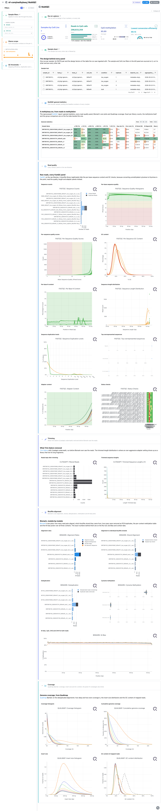
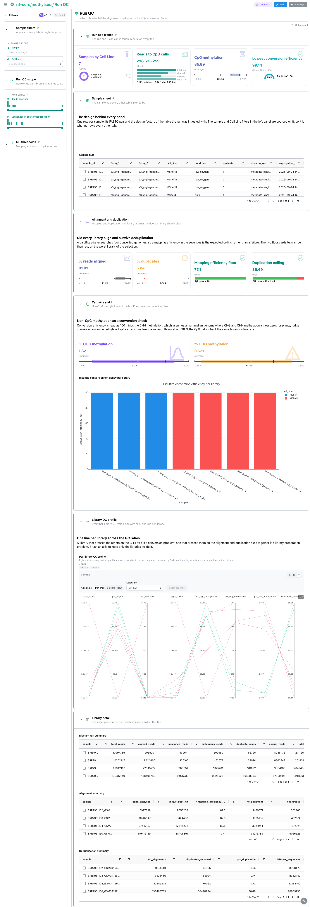
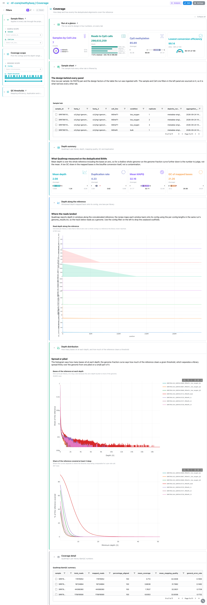
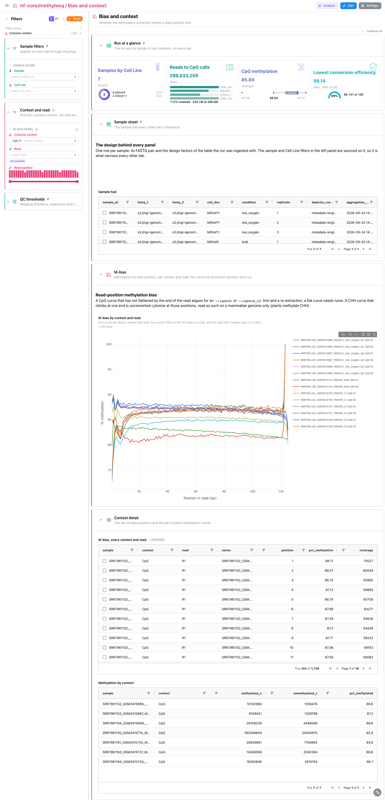
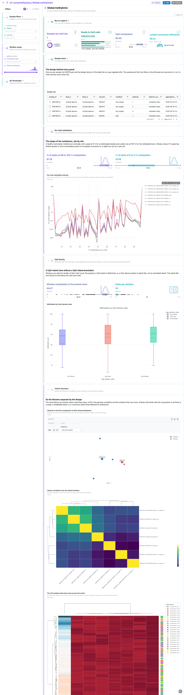
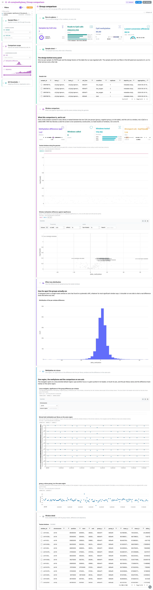

<div class="template-banner">
  <a class="template-banner-logo" href="https://nf-co.re/methylseq" target="_blank" title="nf-core/methylseq on nf-co.re">
    
    
  </a>
  <div class="template-banner-body">
    <h1 class="template-title">Bisulfite Methylation</h1>
    <p class="template-subtitle">Bismark alignment and conversion QC, coverage, M-bias per context, the binned methylome with its cohort structure, and a window-level comparison between two groups, next to the pipeline's MultiQC report.</p>
    <p class="template-links">
      <a href="https://nf-co.re/methylseq" target="_blank"><i class="mdi mdi-open-in-new"></i> nf-co.re</a>
      <a href="https://github.com/nf-core/methylseq" target="_blank"><i class="mdi mdi-github"></i> GitHub</a>
    </p>
  </div>
  <span class="template-status-draft template-banner-badge" data-tooltip="Draft: generated and not yet reviewed. Expect it to need fixes before it is usable."><i class="mdi mdi-pencil-outline"></i> Draft</span>
</div>

<div class="tpl-version-pick" data-latest="2.3.0">
  <span class="tpl-version-icon"><i class="mdi mdi-source-branch"></i></span>
  <span class="tpl-version-label">Template version</span>
  <select id="tpl-version" class="tpl-version-select" aria-label="Template version">
    <option value="2.3.0" selected>2.3.0</option>
  </select>
  <span class="tpl-version-badge">latest</span>
</div>

The methylseq template follows the Bismark route of an nf-core/methylseq run from
trimmed reads to per-cytosine methylation, one question per tab:

- :material-chart-box-outline: **MultiQC**: FastQC, Cutadapt, Bismark and Qualimap panels from the run's MultiQC report
- :material-check-decagram: **Run QC**: which libraries fail the alignment, duplication or bisulfite conversion floors
- :material-chart-line: **Coverage**: how deep and how evenly the deduplicated alignments cover the reference
- :material-chart-bell-curve: **Bias and context**: whether the methylation extraction needs a read-position trim
- :material-dna: **Global methylome**: whether each methylome is bimodal, and whether the libraries group by the design
- :material-scale-balance: **Group comparison**: where two groups differ, genome-wide and at one locus

A `Run at a glance` strip, the `Sample filters` (sample and the design factor) and
a collapsed sample sheet are pinned to the top of every tab, and a collapsed
`QC thresholds` group (mapping efficiency, duplication, conversion) to the bottom.

!!! warning "The MultiQC report must be regenerated"
    methylseq 2.3.0 ships MultiQC 1.13, which writes no parquet, and Depictio
    reads only `multiqc.parquet` (MultiQC 1.31 and later). Re-run MultiQC over
    the run's own tool outputs before ingesting, or the MultiQC tab stays empty:

    ```bash
    python -m depictio.dev_scripts.multiqc_reprocess --src <outdir> --dest <outdir>
    ```

!!! info "Bismark route only"
    methylseq also publishes `bismark_hisat/` and `bwameth/` routes. This template
    covers the default `bismark/` route; its file patterns match any
    `bismark_<aligner>` suffix, so the sample ids parse the same way on the
    hisat2 route.

!!! note "The design is a table beside the run"
    The methylseq samplesheet carries no design column, and the template never
    parses one out of sample names. Pass a design table with `METADATA_FILE`:
    without it the design filter has nothing to offer and the Group comparison
    tab is pruned.

---

## :material-rocket-launch-outline: Quick start

=== "Point at a finished run"

    ```bash
    depictio run \
      --template nf-core/methylseq/latest \
      --data-root /path/to/methylseq_results \
      --var METADATA_FILE=/path/to/design.tsv \
      --var GENOME=hg38
    ```

    The sample hub reads `input/samplesheet_full.csv` under the data root. The
    variables:

    | Variable | Default | What it does |
    |---|---|---|
    | `METADATA_FILE` | none | Design table (TSV): sample id in a `sample` column or the first column, one column per factor |
    | `METADATA_ID_COL` | first column | The design table's sample-id column |
    | `GROUP_COL` | first factor | The factor the dashboards colour and filter by; the comparison tests it when it has two levels, else the first two-level factor |
    | `GROUP_COL_DISPLAY` | title-cased `GROUP_COL` | Label used in titles |
    | `GENOME` | `hg38` | UCSC assembly of the locus tracks (contig axis and region search) |

=== "From the pipeline itself (v1.10.0+)"

    ```bash
    depictio-cli config nextflow --install     # once per machine
    nextflow run nf-core/methylseq -r 2.3.0 -profile docker --outdir results
    ```

    No `depictio run`, and no template named: the pipeline ingests its own
    output directory when it finishes and resolves this template from its own
    manifest. Without a `METADATA_FILE` the Group comparison is pruned, and the
    MultiQC tab stays empty until the report is regenerated as above. See
    [Nextflow trigger](../../depictio-cli/nextflow-trigger.md).

---

## :material-book-open-variant: Reference

The template reads the samplesheet and the design table, the regenerated MultiQC
report, Bismark's alignment, deduplication, splitting and M-bias reports and its
per-CpG bedGraphs, and Qualimap BamQC. 63 of its 69 tiles carry a `use:` catalog
reference (`bismark/*`, `qualimap/*`, `multiqc/*`), and the locus tracks name
their `viz_kind` explicitly.

!!! info "Self-adapting layout"
    The dashboard adapts to whatever the run actually produced: components bound
    to pruned or unparsed data collections are hidden, tabs left with no real
    visualizations are dropped entirely, and the remaining components are
    re-packed so there are no empty rows.

<div class="tpl-version-block" data-version="2.3.0" markdown>

--8<-- "pipeline-templates/nf-core/_generated/methylseq-latest.md"

</div>

---

## :material-view-dashboard-outline: Dashboard tabs

Six tabs, read as a funnel: is the report normal, which libraries fail a floor,
is depth even enough for a site call, does the extraction need a trim, what does
the methylome look like, and where do the two groups differ. Each tab below
carries the **same icon and colour the dashboard gives it**. A picked row or
point becomes a filter that follows the project links to the tiles it reaches.

=== "{ width=18 }{ width=18 } MultiQC"

    *Read the report from the reads to the methylation calls.*

    [{ loading=lazy }](../../images/pipeline-templates/nf-core/methylseq/multiqc_light.png){ .tpl-shot target="_blank" rel="noopener" }

    Every module the report carries: the general statistics, all ten FastQC
    panels, what Trim Galore removed, Bismark's five plots and Qualimap BamQC. A
    bisulfite library legitimately fails the per-base sequence content and GC
    checks, because converting unmethylated cytosines is the point, so the
    quality, length and adapter panels are the ones to read.

    ??? abstract ":material-tune-variant: Filters and components"

        **Filters** · `Sample` and the `GROUP_COL` factor, persistent and pinned
        to the top of every tab; `Mapping efficiency`, `Duplication rate` and
        `Conversion efficiency` ranges in the collapsed *QC thresholds* group
        pinned to the bottom; plus a tab-local `CpG methylation` range that
        narrows the pinned strip.

        | Section | What it holds |
        |---|---|
        | Run at a glance | 4 cards: samples by design factor, reads to CpG calls, CpG methylation, lowest conversion efficiency |
        | Sample sheet | *Sample hub* |
        | MultiQC general statistics | *General statistics* |
        | Read quality | 10 FastQC panels |
        | Trimming | 2 Cutadapt panels |
        | Bisulfite alignment | 5 Bismark panels, M-bias included |
        | Coverage | 4 Qualimap panels |

=== ":material-check-decagram:{ .mc-teal } Run QC"

    *Spot the libraries below the alignment, duplication or conversion floors.*

    [{ loading=lazy }](../../images/pipeline-templates/nf-core/methylseq/run_qc_light.png){ .tpl-shot target="_blank" rel="noopener" }

    The floor cards read the worst library of the selection: mapping efficiency
    passes at 70 %, since bisulfite alignment searches four converted genomes, and
    duplication up to 10 %. Conversion is read as `100 - %CHH`, which assumes
    near-zero non-CpG methylation, as in mammals; on a plant run judge it on an
    unmethylated spike-in instead. A parallel-coordinates panel draws each library
    across the QC ratios, coloured by the design factor.

    ??? abstract ":material-tune-variant: Filters and components"

        **Filters** · `Reads analysed` and `Sequences kept after deduplication`
        ranges.

        | Section | What it holds |
        |---|---|
        | Alignment and duplication | 4 cards: % aligned, % duplicates, mapping efficiency floor, duplication ceiling |
        | Cytosine yield | 2 cards, *Bisulfite conversion efficiency per library* |
        | Library QC profile | *Per-library QC profile* (parallel coordinates) |
        | Library detail | Bismark run summary, alignment and deduplication tables (collapsed) |

=== ":material-chart-line:{ .mc-cyan } Coverage"

    *Measure how deep and how evenly the reference is covered.*

    [{ loading=lazy }](../../images/pipeline-templates/nf-core/methylseq/coverage_light.png){ .tpl-shot target="_blank" rel="noopener" }

    Qualimap BamQC on the deduplicated alignments. Mean depth counts the bases at
    zero, so on a shallow run the genome-fraction curve is the number to judge,
    and a low GC share is the conversion itself. Windowed depth is mapped back
    onto its contigs as one lane per library.

    ??? abstract ":material-tune-variant: Filters and components"

        **Filters** · `Contig` on the windowed depth and a `Depth threshold` on the
        genome fraction.

        | Section | What it holds |
        |---|---|
        | Depth summary | 4 cards: mean depth, duplication rate, mean MAPQ, GC of mapped bases |
        | Depth along the reference | *Read depth along the reference* |
        | Depth distribution | *Bases of the reference at each depth*, *Share of the reference covered at least X deep* |
        | Coverage detail | *Qualimap BamQC summary* (collapsed) |

=== ":material-chart-bell-curve:{ .mc-pink } Bias and context"

    *Decide whether a read-position trim is needed.*

    [{ loading=lazy }](../../images/pipeline-templates/nf-core/methylseq/bias_and_context_light.png){ .tpl-shot target="_blank" rel="noopener" }

    One M-bias explorer over all six tables of Bismark's M-bias file, opening on
    CpG. A CpG curve that has not flattened by the end of the read is Bismark's
    own advice to add an `--ignore` or `--ignore_r2` trim and re-extract; a CHH
    curve that climbs at one end is unconverted cytosine at those positions.

    ??? abstract ":material-tune-variant: Filters and components"

        **Filters** · `Cytosine context`, `Read` and a `Read position` range.

        | Section | What it holds |
        |---|---|
        | M-bias | *M-bias by context and read* |
        | Context detail | *M-bias, every context and read*, *Methylation by context* (collapsed) |

=== ":material-dna:{ .mc-violet } Global methylome"

    *Check bimodality and whether the libraries group by the design.*

    [{ loading=lazy }](../../images/pipeline-templates/nf-core/methylseq/global_methylome_light.png){ .tpl-shot target="_blank" rel="noopener" }

    The per-CpG bedGraphs are streamed into 10 kb windows that hold enough CpGs in
    every library. A healthy mammalian methylome is bimodal, and a low peak that
    drifted upward points to incomplete conversion or too little depth. Windows
    split into CpG-density tertiles stand in for an island annotation, which
    methylseq does not bundle. The cohort is read as a PCA coloured by the design
    factor, a library correlation matrix and the windows that vary most.

    ??? abstract ":material-tune-variant: Filters and components"

        **Filters** · `CpG density class` and a `Window methylation` range.

        | Section | What it holds |
        |---|---|
        | Per-CpG methylation | 2 cards, *Per-CpG methylation density* |
        | CpG density | 2 cards, *Methylation by CpG-density class* |
        | Cohort structure | *Libraries on the first components of their binned methylome*, *Library correlation over the shared windows*, *The 150 windows that move most across the cohort* |

=== ":material-scale-balance:{ .mc-grape } Group comparison"

    *Locate the differences between the two groups.*

    [{ loading=lazy }](../../images/pipeline-templates/nf-core/methylseq/group_comparison_light.png){ .tpl-shot target="_blank" rel="noopener" }

    methylseq ships no differential-methylation caller, so this is the screen the
    published files support, labelled as one: every eligible window is tested with
    a two-sample t-test on arcsine-transformed proportions and Benjamini-Hochberg
    correction, and called at padj under 0.05 with a difference of at least ten
    points. A Manhattan and a volcano open the tab; a locus navigator then drives
    the per-library windows and the group difference on the same region.

    ??? abstract ":material-tune-variant: Filters and components"

        **Filters** · `Call`, and `Methylation difference` and `Adjusted p`
        ranges.

        | Section | What it holds |
        |---|---|
        | Window comparison | 4 cards, *Tested windows along the genome*, *Window methylation difference against significance* |
        | Effect size distribution | *Distribution of the per-window difference* |
        | Methylation at a locus | the locus navigator and two tracks that follow its region |
        | Window detail | *Tested windows* (collapsed) |

    !!! tip "A window screen, not a DMR caller"
        The unit is a 10 kb window, not a CpG or a called DMR, and with few
        libraries a side the screen is low-powered by construction. Without a
        design table, or without a factor of exactly two levels, the tab is
        pruned.

---

## :material-play-circle-outline: Running the pipeline

Depictio reads the **output** of nf-core/methylseq, it does not run the pipeline.
Run the pipeline first on the default Bismark route:

```bash
nextflow run nf-core/methylseq -r 2.3.0 \
  --input samplesheet_full.csv \
  --genome GRCh38 \
  -profile docker --outdir results
```

Then place the samplesheet and a design table beside the results, regenerate the
MultiQC report and point Depictio at them:

```bash
mkdir -p results/input && cp samplesheet_full.csv design.tsv results/input/
python -m depictio.dev_scripts.multiqc_reprocess --src results/ --dest results/
depictio run --template nf-core/methylseq/latest --data-root results/ \
  --var METADATA_FILE=results/input/design.tsv
```

See [nf-co.re/methylseq/usage](https://nf-co.re/methylseq/2.3.0/docs/usage) for full pipeline documentation.

---

## :material-folder-open-outline: Required data structure

Point `--data-root` at the directory holding the pipeline output. Depictio scans
recursively and matches on file name, never on the `bismark/` prefix.

```text
<DATA_ROOT>/
├── input/
│   ├── samplesheet_full.csv                   # the hub (required)
│   └── design.tsv                             # METADATA_FILE (optional)
├── pipeline_info/software_versions.yml
├── multiqc/multiqc_data/multiqc.parquet       # written by multiqc_reprocess
├── fastqc/*.zip                               # raw MultiQC inputs
├── trimgalore/*.{txt,zip}
├── bismark/
│   ├── alignments/logs/*_bismark_bt2_PE_report.txt
│   ├── deduplicated/logs/*.deduplication_report.txt
│   ├── methylation_calls/
│   │   ├── splitting_report/*_splitting_report.txt
│   │   ├── mbias/*.M-bias.txt
│   │   └── bedGraph/*.bedGraph.gz             # the methylome and the comparison
│   └── summary/                               # bismark2summary
└── qualimap/<sample>/
    ├── genome_results.txt
    └── raw_data_qualimapReport/*.txt
```

---

## :material-flask-outline: Validation runs

The template was validated on the nf-core AWS megatest of the 2.3.0 release,
`s3://nf-core-awsmegatests/methylseq/results-93bc5811603c287c766a0ff7e03b5b41f4483895/bismark/`,
seven paired-end libraries, and the screenshots above come from that run. Its
design table is vendored under the template's `input/`, built once from the
samplesheet:

```bash
DEST=/tmp/methylseq_test
bash depictio/projects/nf-core/methylseq/2.3.0/download_test_data.sh "$DEST"
mkdir -p "$DEST/input" && cp depictio/projects/nf-core/methylseq/2.3.0/input/sample_metadata.tsv "$DEST/input/"
python -m depictio.dev_scripts.multiqc_reprocess --src "$DEST" --dest "$DEST"
depictio run --template nf-core/methylseq/latest --data-root "$DEST" \
  --var METADATA_FILE="$DEST/input/sample_metadata.tsv"
```

Do not pass `--project-name` when ingesting: the dashboard is attached to the
project by name, so renaming it breaks a later `depictio dashboard import`.
Re-ingesting accumulates dashboards, so delete the project before repeating a run.

---

## :material-link-variant: Additional resources

- [nf-co.re/methylseq](https://nf-co.re/methylseq): official pipeline documentation
- [nf-co.re/methylseq/2.3.0/results](https://nf-co.re/methylseq/2.3.0/results): AWS test results
- [Template System Reference](../../usage/projects/templates.md): YAML format, variables, conditionals
- [Recipes](../../usage/projects/recipes.md): how to read, test, and write recipes

---

## :material-account-group-outline: Authorship

<div class="tpl-credits">
  <div class="tpl-credit">
    <span class="tpl-credit-role"><i class="mdi mdi-code-braces"></i> Developers</span>
    <span class="tpl-credit-note">Wrote the template, its recipes and its dashboards.</span>
    <a class="tpl-person" href="https://github.com/weber8thomas" target="_blank" rel="noopener">
       weber8thomas
    </a>
  </div>
  <div class="tpl-credit">
    <span class="tpl-credit-role"><i class="mdi mdi-eye-check-outline"></i> Reviewers</span>
    <span class="tpl-credit-note">Nobody has run it on their own data and signed it off yet, which is what keeps it a Draft.</span>
    <span class="tpl-person"><i class="mdi mdi-account-plus-outline"></i> Open</span>
  </div>
  <div class="tpl-credit">
    <span class="tpl-credit-role"><i class="mdi mdi-wrench-outline"></i> Maintainers</span>
    <span class="tpl-credit-note">Keep it working as nf-core/methylseq releases.</span>
    <a class="tpl-person" href="https://github.com/weber8thomas" target="_blank" rel="noopener">
       weber8thomas
    </a>
  </div>
</div>

Reviewing a template on your own data, or taking over a role here, is a
contribution in itself: the [contributing guide](../../developer/contributing-templates.md)
says what each one involves.
