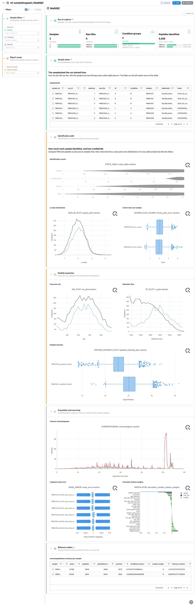
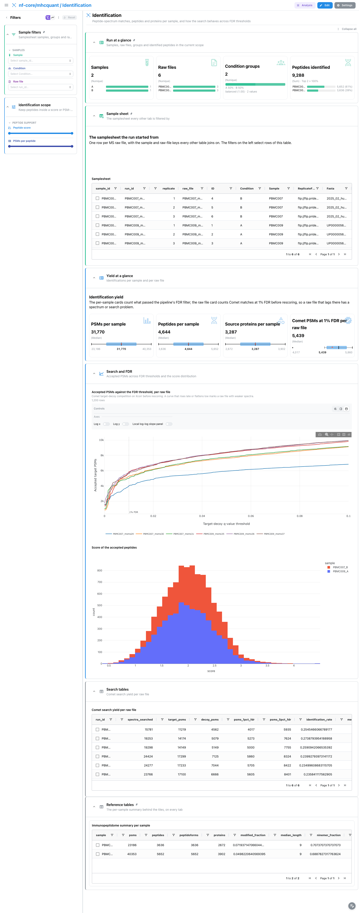
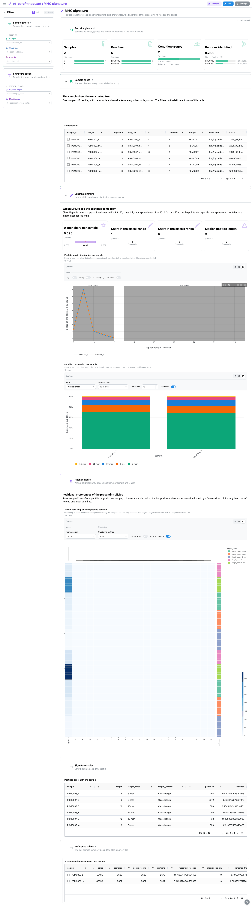
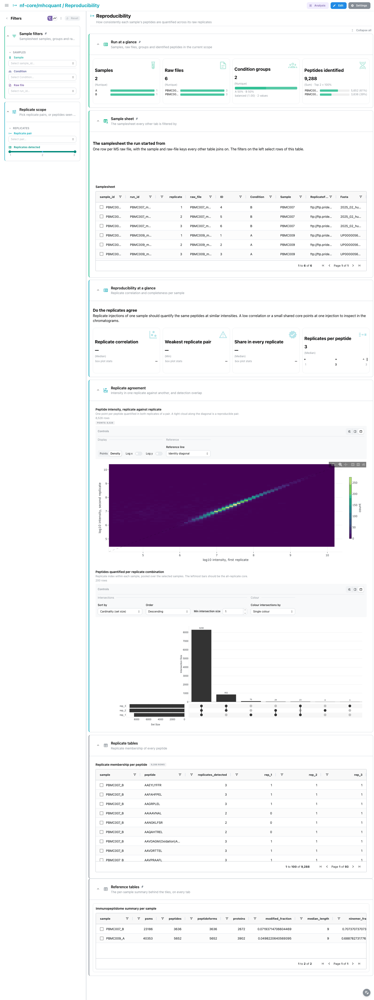
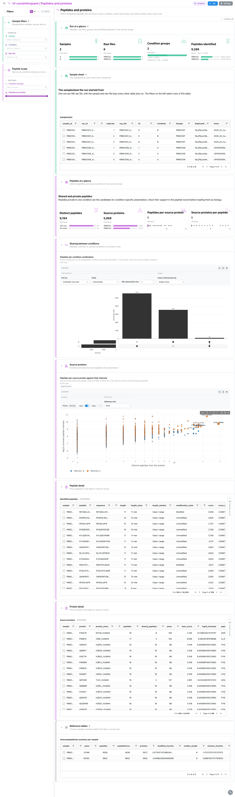
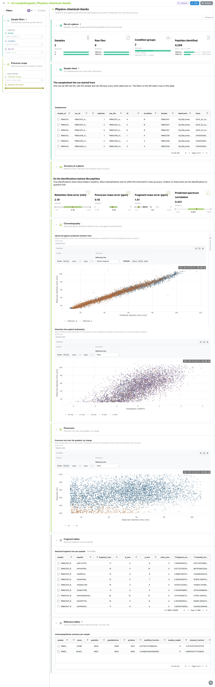

<div class="template-banner">
  <a class="template-banner-logo" href="https://nf-co.re/mhcquant" target="_blank" title="nf-core/mhcquant on nf-co.re">
    
    
  </a>
  <div class="template-banner-body">
    <h1 class="template-title">Immunopeptidomics</h1>
    <p class="template-subtitle">Identification yield and FDR behaviour, the MHC length and anchor-motif signature, replicate reproducibility, shared and private peptides with their source proteins, and retention-time and mass checks, next to the pipeline's own MultiQC report.</p>
    <p class="template-links">
      <a href="https://nf-co.re/mhcquant" target="_blank"><i class="mdi mdi-open-in-new"></i> nf-co.re</a>
      <a href="https://github.com/nf-core/mhcquant" target="_blank"><i class="mdi mdi-github"></i> GitHub</a>
    </p>
  </div>
  <span class="template-status-experimental template-banner-badge" data-tooltip="Experimental: shared as-is. Feedback and PRs welcome."><i class="mdi mdi-flask-outline"></i> Experimental</span>
</div>

<div class="tpl-version-pick" data-latest="3.2.0">
  <span class="tpl-version-icon"><i class="mdi mdi-source-branch"></i></span>
  <span class="tpl-version-label">Template version</span>
  <select id="tpl-version" class="tpl-version-select" aria-label="Template version">
    <option value="3.2.0" selected>3.2.0</option>
  </select>
  <span class="tpl-version-badge">latest</span>
</div>

The mhcquant template follows an nf-core/mhcquant run from the Comet search to
the presented peptides, one tab per question:

- :material-magnify-scan: **Identification**: PSMs, peptides and source proteins per sample, and how the raw search behaves as the FDR threshold moves
- :material-ruler: **MHC signature**: the peptide length profile against the class I and class II windows, and the positional amino-acid preferences behind the anchor motifs
- :material-set-merge: **Reproducibility**: how consistently the raw replicates of a sample quantify the same peptides
- :material-relation-many-to-many: **Peptides and proteins**: peptides common to several conditions or private to one, and the proteins that feed them
- :material-waves: **Physico-chemical checks**: observed against predicted retention time, hydropathy, precursor charge and m/z, and mass accuracy

A `Run at a glance` strip and the collapsed `Sample sheet` are pinned to the top
of every tab, `Reference tables` to the bottom, and the `Sample filters` group
(sample, condition, raw file) applies everywhere.

!!! info "The samplesheet is not in the output"
    mhcquant does not publish the samplesheet it ran on, and the samplesheet is
    the hub every other collection links to. The template reads the file named by
    `METADATA_FILE`, which defaults to `input/samplesheet.tsv` under the data
    root: copy the sheet you passed to `--input` there, or point the variable at
    it. The CLI's metadata auto-detection picks the first non-id column of the
    sheet as the grouping column, so pass `--var GROUP_COL=Condition` unless
    `Condition` already comes second.

!!! note "No binding predictions"
    mhcquant 3.2.0 no longer runs MHCflurry or any other binding predictor, so
    the template has no binder-rank view. The MHC signature tab reads the class
    and the presenting alleles from peptide lengths and positional motifs instead.

---

## :material-rocket-launch-outline: Quick start

=== "Point at a finished run"

    ```bash
    depictio run \
      --template nf-core/mhcquant/latest \
      --data-root /path/to/mhcquant_results \
      --var METADATA_FILE=/path/to/samplesheet.tsv \
      --var GROUP_COL=Condition
    ```

    `METADATA_FILE` can be left out when the sheet already sits at
    `input/samplesheet.tsv` under the data root. A run started without
    `--quantify` has no replicate intensities: add `--var NO_QUANTIFICATION=true`
    and the Reproducibility collections are dropped. A run without
    `--annotate_ions` takes `--var NO_ION_ANNOTATION=true`.

=== "From the pipeline itself (v1.10.0+)"

    ```bash
    depictio-cli config nextflow --install     # once per machine
    nextflow run nf-core/mhcquant -r 3.2.0 -profile docker --outdir results
    ```

    No `depictio run`, and no template named: the pipeline ingests its own
    output directory when it finishes and resolves this template from its own
    manifest. See [Nextflow trigger](../../depictio-cli/nextflow-trigger.md).

---

## :material-book-open-variant: Reference

The template reads the samplesheet, the MultiQC report, the per-sample peptide
tables at the output root, the Comet pin files that precede rescoring and the
fragment-ion annotations. Every other collection (sample summary, length
distribution, composition, motif matrix, replicate pairs and detection, source
proteins, condition sharing) is a recipe over the peptide table. 39 of its 78
components carry a `use:` catalog reference, so a tile says where its panel
comes from.

!!! info "Self-adapting layout"
    The dashboard adapts to whatever the run actually produced: components bound
    to pruned or unparsed data collections are hidden, tabs left with no real
    visualizations are dropped entirely, and the remaining components are
    re-packed so there are no empty rows.

<div class="tpl-version-block" data-version="3.2.0" markdown>

--8<-- "pipeline-templates/nf-core/_generated/mhcquant-latest.md"

</div>

---

## :material-view-dashboard-outline: Dashboard tabs

Six tabs, read as a funnel: is the report healthy, how much did each sample
identify, do the peptides look like MHC ligands, do the replicates agree, what is
shared between conditions, and do the identifications behave physically like
peptides. Each tab below carries the **same icon and colour the dashboard gives
it**. The screenshots come from the run described under
Validation runs below.

=== "{ width=18 }{ width=18 } MultiQC"

    *Are identification yield and score distributions sound before reading the peptides?*

    [{ loading=lazy }](../../images/pipeline-templates/nf-core/mhcquant/multiqc_light.png){ .tpl-shot target="_blank" rel="noopener" }

    The tab is the report mhcquant writes as MultiQC custom content: identification
    counts, the q-value and Comet Xcorr distributions, then precursor m/z, retention
    time and peptide intensity. Chromatograms, fragment mass error and the
    Percolator feature weights sit in a collapsed section, useful when a sample
    underperforms and the cause is the acquisition or the rescoring model.

    ??? abstract ":material-tune-variant: Filters and components"

        **Filters** · `Sample`, `Condition` and `Raw file` on the samplesheet,
        persistent on every tab, plus `Report sample` in a *Report scope* group
        that narrows the MultiQC panels only.

        | Section | What it holds |
        |---|---|
        | Run at a glance | 4 cards: samples, raw files, condition groups, peptides identified |
        | Sample sheet | *Samplesheet* (collapsed, pinned) |
        | Identification yield | *Identification counts*, *q-value distribution*, *Comet Xcorr per sample* |
        | Peptide properties | *Precursor m/z*, *Retention time*, *Peptide intensity* |
        | Acquisition and rescoring | *Total ion chromatograms*, *Fragment mass error*, *Percolator feature weights* (collapsed) |
        | Reference tables | *Immunopeptidome summary per sample* (collapsed, pinned) |

=== ":material-magnify-scan:{ .mc-blue } Identification"

    *How much did each sample identify, and how does the search behave across FDR thresholds?*

    [{ loading=lazy }](../../images/pipeline-templates/nf-core/mhcquant/identification_light.png){ .tpl-shot target="_blank" rel="noopener" }

    Cards give PSMs, peptides and source proteins per sample and the Comet PSMs
    accepted at 1% FDR per raw file. The FDR profile draws the accepted PSMs of each
    raw file as the target-decoy q-value threshold is relaxed, so a file that gains
    little from a looser cut stands apart. These Comet numbers come from the pin
    files, before MS2Rescore and Percolator, so they describe the raw search and not
    the final FDR.

    ??? abstract ":material-tune-variant: Filters and components"

        **Filters** · `Peptide score` and `PSMs per peptide` ranges in an
        *Identification scope* group.

        | Section | What it holds |
        |---|---|
        | Yield at a glance | 4 cards |
        | Search and FDR | *Accepted PSMs against the FDR threshold, per raw file*, *Score of the accepted peptides* |
        | Search tables | *Comet search yield per raw file* (collapsed) |

=== ":material-ruler:{ .mc-violet } MHC signature"

    *Which MHC class and which presenting alleles do the peptides point to?*

    [{ loading=lazy }](../../images/pipeline-templates/nf-core/mhcquant/mhc_signature_light.png){ .tpl-shot target="_blank" rel="noopener" }

    The length profile shades the class I (8 to 12 residues) and class II (13 to 25)
    windows, with cards for the 9-mer share, the share in each window and the median
    length. The pipeline's own length filter bounds what can appear, so a class
    share of zero can be structural. The motif heatmap gives the amino-acid
    frequency at each position, per sample and length, which is where the anchor
    residues of the presenting alleles show up.

    ??? abstract ":material-tune-variant: Filters and components"

        **Filters** · `Peptide length` and `Modification` in a *Signature scope*
        group.

        | Section | What it holds |
        |---|---|
        | Length signature | 4 cards, *Peptide length distribution per sample*, *Peptide composition per sample* |
        | Anchor motifs | *Amino-acid frequency by peptide position* |
        | Signature tables | *Peptides per length and sample* (collapsed) |

=== ":material-set-merge:{ .mc-cyan } Reproducibility"

    *Are the peptides of a sample quantified consistently across its raw replicates?*

    [{ loading=lazy }](../../images/pipeline-templates/nf-core/mhcquant/reproducibility_light.png){ .tpl-shot target="_blank" rel="noopener" }

    Cards give the median and weakest replicate correlation and the share of
    peptides seen in every replicate. The scatter plots one replicate's intensity
    against another's for every pair, and an UpSet counts the peptides quantified in
    each combination of replicates. The peptide table does not name the raw file
    behind each intensity column, so replicate labels follow the samplesheet `ID`
    order within the sample.

    ??? abstract ":material-tune-variant: Filters and components"

        **Filters** · `Replicate pair` and a `Replicates detected` range in a
        *Replicate scope* group.

        | Section | What it holds |
        |---|---|
        | Reproducibility at a glance | 4 cards |
        | Replicate agreement | *Peptide intensity, replicate against replicate*, *Peptides quantified per replicate combination* |
        | Replicate tables | *Replicate membership per peptide* (collapsed) |

    !!! tip "Only with `--quantify`"
        Replicate intensities exist only when the run quantified. Pass
        `--var NO_QUANTIFICATION=true` for a run without it and the tab is dropped.

=== ":material-relation-many-to-many:{ .mc-grape } Peptides and proteins"

    *Which presented peptides are common to every condition, which are private, and where do they come from?*

    [{ loading=lazy }](../../images/pipeline-templates/nf-core/mhcquant/peptides_and_proteins_light.png){ .tpl-shot target="_blank" rel="noopener" }

    An UpSet over one peptide set per condition separates shared from private
    peptides. The source-protein scatter puts the number of peptides a protein
    feeds into presentation against their intensity. Below, the peptide and protein
    tables each carry a linked record card beside them: it folds to a slim rail
    until a row is picked, then shows that peptide or protein in full. Picking a
    peptide selects its `sequence`, which also narrows the condition-sharing view.

    ??? abstract ":material-tune-variant: Filters and components"

        **Filters** · `Condition sharing` and a `Peptides per protein` range in a
        *Peptide scope* group.

        | Section | What it holds |
        |---|---|
        | Peptides at a glance | 4 cards |
        | Sharing between conditions | *Peptides per condition combination* |
        | Source proteins | *Peptides per source protein against their intensity* |
        | Peptide detail | *Identified peptides*, *Peptide record* |
        | Protein detail | *Source proteins*, *Protein record* |

=== ":material-waves:{ .mc-lime } Physico-chemical checks"

    *Do the identifications behave like real peptides?*

    [{ loading=lazy }](../../images/pipeline-templates/nf-core/mhcquant/physico_chemical_checks_light.png){ .tpl-shot target="_blank" rel="noopener" }

    Observed retention time is plotted against the DeepLC prediction and against
    Kyte-Doolittle hydropathy; false identifications drift off both trends. A
    peptide picked on the retention-time scatter opens in the `Picked peptide`
    record beside it, which stays a slim rail until then. Precursor m/z over the
    gradient by charge, and cards for retention-time, precursor and fragment mass
    error, close the tab.

    ??? abstract ":material-tune-variant: Filters and components"

        **Filters** · `Precursor charge` and a `Retention time (min)` range in a
        *Precursor scope* group.

        | Section | What it holds |
        |---|---|
        | Accuracy at a glance | 4 cards |
        | Chromatography | *Observed against predicted retention time*, *Picked peptide*, *Retention time against hydropathy* |
        | Precursors | *Precursor m/z over the gradient, by charge* |
        | Fragment tables | *Matched fragment ions per peptide* (collapsed) |

---

## :material-play-circle-outline: Running the pipeline

Depictio reads the **output** of nf-core/mhcquant, it does not run the pipeline.
Run the pipeline first, with quantification and ion annotation if you want the
Reproducibility tab and the fragment checks:

```bash
nextflow run nf-core/mhcquant -r 3.2.0 \
  --input samplesheet.tsv \
  --fasta proteome.fasta \
  --quantify --annotate_ions \
  --outdir results -profile docker
```

Then point Depictio at the results, with the samplesheet you started from:

```bash
depictio run --template nf-core/mhcquant/latest --data-root results/ \
  --var METADATA_FILE=samplesheet.tsv --var GROUP_COL=Condition
```

See [nf-co.re/mhcquant/usage](https://nf-co.re/mhcquant/3.2.0/docs/usage) for full pipeline documentation.

---

## :material-folder-open-outline: Required data structure

Point `--data-root` at the directory holding the pipeline output. Depictio scans
recursively and matches on file name.

```text
<DATA_ROOT>/
├── input/
│   └── samplesheet.tsv                        # the hub (METADATA_FILE default): ID, Sample, Condition, ReplicateFileName
├── <Sample>_<Condition>.tsv                   # one FDR-filtered peptide table per sample
├── multiqc/multiqc_data/
│   └── multiqc.parquet                        # mhcquant custom-content sections
├── intermediate_results/
│   ├── comet/*_pin.tsv                        # Comet PSMs per raw file, before rescoring
│   └── ion_annotations/*_matching_ions.tsv    # optional, --annotate_ions
└── pipeline_info/
    ├── params_*.json
    └── *software*versions*.yml
```

The replicate intensities are the `intensity_<k>` columns of the peptide tables,
present only with `--quantify`. The mzTab exports, the OpenMS XML intermediates
and the spectral library are not read.

---

## :material-flask-outline: Validation runs

The template was validated against the AWS megatest of the 3.2.0 release
(`results-6ec12c97f7889a3e1f09ab89930723045c6bac68`, `test_full` profile: a
PRIDE immunopeptidomics dataset of two samples with three raw replicates each,
one sample per condition), and the screenshots above come from it. With one
sample per condition, the sharing UpSet on that run is dominated by private
peptides. `megatest.yaml` lists the tables-only subset the template needs, and
the download script also places the vendored samplesheet under `input/`:

```bash
bash depictio/projects/nf-core/mhcquant/3.2.0/download_test_data.sh /tmp/mhcquant_test
depictio run --template nf-core/mhcquant/latest --data-root /tmp/mhcquant_test \
  --var GROUP_COL=Condition
```

Do not pass `--project-name` when ingesting: the dashboard is attached to the
project by name, so renaming it breaks a later `depictio dashboard import`.
Re-ingesting accumulates dashboards, so delete the project before repeating a run.

---

## :material-link-variant: Additional resources

- [nf-co.re/mhcquant](https://nf-co.re/mhcquant): official pipeline documentation
- [nf-co.re/mhcquant/3.2.0/results](https://nf-co.re/mhcquant/3.2.0/results): AWS test results
- [Template System Reference](../../usage/projects/templates.md): YAML format, variables, conditionals
- [Recipes](../../usage/projects/recipes.md): how to read, test, and write recipes

---

## :material-account-group-outline: Authorship

<div class="tpl-credits">
  <div class="tpl-credit">
    <span class="tpl-credit-role"><i class="mdi mdi-code-braces"></i> Developers</span>
    <span class="tpl-credit-note">Wrote the template, its recipes and its dashboards.</span>
    <a class="tpl-person" href="https://github.com/weber8thomas" target="_blank" rel="noopener">
       weber8thomas
    </a>
  </div>
  <div class="tpl-credit">
    <span class="tpl-credit-role"><i class="mdi mdi-eye-check-outline"></i> Reviewers</span>
    <span class="tpl-credit-note">Nobody has run it on their own data and signed it off yet, which is what keeps it Experimental.</span>
    <span class="tpl-person"><i class="mdi mdi-account-plus-outline"></i> Open</span>
  </div>
  <div class="tpl-credit">
    <span class="tpl-credit-role"><i class="mdi mdi-wrench-outline"></i> Maintainers</span>
    <span class="tpl-credit-note">Keep it working as nf-core/mhcquant releases.</span>
    <a class="tpl-person" href="https://github.com/weber8thomas" target="_blank" rel="noopener">
       weber8thomas
    </a>
  </div>
</div>

Reviewing a template on your own data, or taking over a role here, is a
contribution in itself: the [contributing guide](../../developer/contributing-templates.md)
says what each one involves.
