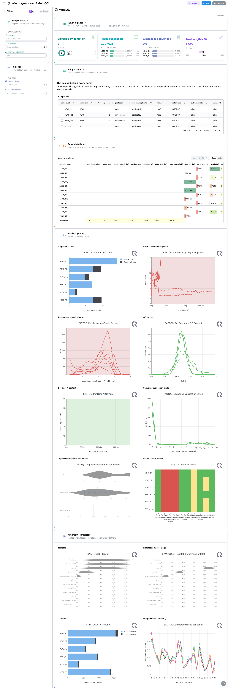
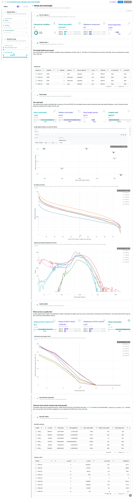
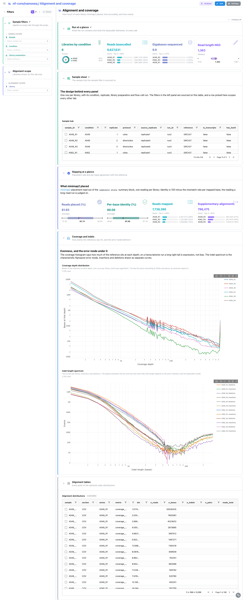
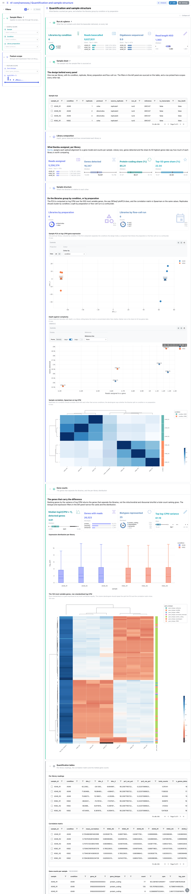
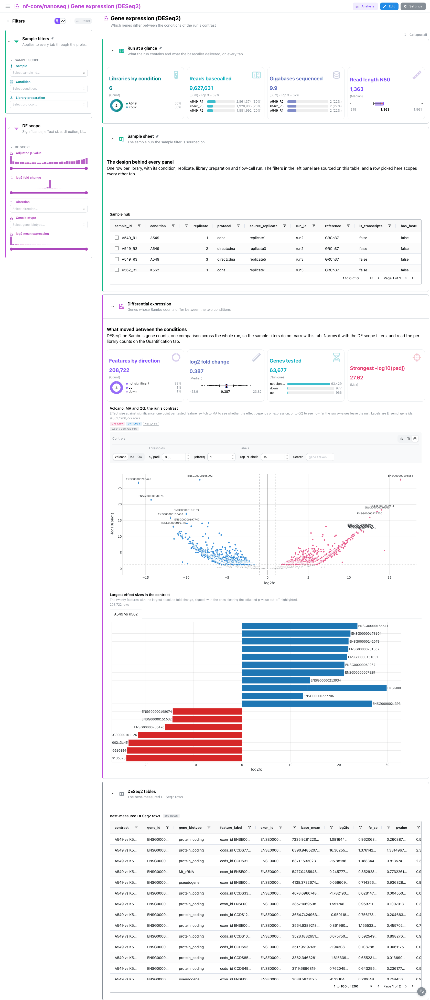
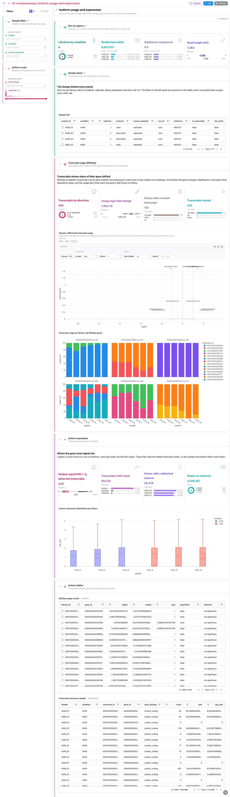

<div class="template-banner">
  <a class="template-banner-logo" href="https://nf-co.re/nanoseq" target="_blank" title="nf-core/nanoseq on nf-co.re">
    
    
  </a>
  <div class="template-banner-body">
    <h1 class="template-title">Nanopore RNA-seq</h1>
    <p class="template-subtitle">Nanopore long-read QC, minimap2 alignment and Bambu gene and transcript quantification, with the DESeq2 and DEXSeq results the pipeline computes on top of them.</p>
    <p class="template-links">
      <a href="https://nf-co.re/nanoseq" target="_blank"><i class="mdi mdi-open-in-new"></i> nf-co.re</a>
      <a href="https://github.com/nf-core/nanoseq" target="_blank"><i class="mdi mdi-github"></i> GitHub</a>
    </p>
  </div>
  <span class="template-status-experimental template-banner-badge" data-tooltip="Experimental: shared as-is. Feedback and PRs welcome."><i class="mdi mdi-flask-outline"></i> Experimental</span>
</div>

<div class="tpl-version-pick" data-latest="3.0.0">
  <span class="tpl-version-icon"><i class="mdi mdi-source-branch"></i></span>
  <span class="tpl-version-label">Template version</span>
  <select id="tpl-version" class="tpl-version-select" aria-label="Template version">
    <option value="3.0.0" selected>3.0.0</option>
  </select>
  <span class="tpl-version-badge">latest</span>
</div>

The nanoseq template follows a Nanopore RNA-seq run from the basecalled reads to
the differential results, one tab per step:

- :material-chart-box-outline: **MultiQC**: FastQC and the samtools flagstat and idxstats panels, as the report shows them
- :material-waves: **Reads and read length**: NanoStat's length and quality readings per library, the Nx ladder and the yield above each quality floor
- :material-chart-bar: **Alignment and coverage**: what minimap2 placed, per-base identity, coverage depth and the indel spectrum
- :material-dna: **Quantification and sample structure**: what Bambu counted, and whether the libraries group by condition or by preparation
- :material-chart-scatter-plot: **Gene expression (DESeq2)**: the genes that moved in the run's contrast
- :material-chart-timeline-variant: **Isoform usage and expression**: the transcripts whose share of their gene shifted, and isoform-level counts

A `Run at a glance` strip (libraries by condition, reads basecalled, gigabases
sequenced, read length N50), the collapsed `Sample sheet` and the `Sample
filters` (sample, condition, library preparation) are pinned to every tab, and
the template's links carry a pick to NanoStat, the samtools distributions, the
melted Bambu counts and the MultiQC panels alike.

!!! warning "nanoseq 3.0.0 writes no MultiQC parquet"
    The release ships MultiQC 1.11, which writes `multiqc_data.json` only, and
    Depictio reads `multiqc.parquet` (MultiQC 1.31 and later). Reprocess the
    run's own tool outputs once before ingesting; the parquet lands in
    `multiqc/multiqc_data/`, where the template looks for it:

    ```bash
    python -m depictio.dev_scripts.multiqc_reprocess --src <outdir> --dest <outdir>
    ```

!!! info "The design is a variable"
    nanoseq names every sample `<group>_R<replicate>`, and the template recovers
    only those two fields from the name. The condition and the three
    confounders the dashboard offers beside it (library preparation, source
    replicate, flow-cell run) come from an optional design table passed as
    `METADATA_FILE`. Without it, the condition is the samplesheet group and the
    confounders read `unknown`.

---

## :material-rocket-launch-outline: Quick start

=== "Point at a finished run"

    ```bash
    depictio run \
      --template nf-core/nanoseq/latest \
      --data-root /path/to/nanoseq_results
    ```

    `--data-root` is the only thing you have to pass. The hub of the dashboard
    is the samplesheet the run validated, `pipeline_info/samplesheet.valid.csv`,
    one row per library. To bring your own design, add the table and name the
    factor the run compares:

    ```bash
    depictio run \
      --template nf-core/nanoseq/latest \
      --data-root /path/to/nanoseq_results \
      --var METADATA_FILE=/path/to/sample_metadata.tsv \
      --var GROUP_COL=condition
    ```

    | Variable | Default | Role |
    |---|---|---|
    | `METADATA_FILE` | none | Optional design table (TSV), one row per sample (or samplesheet group), one column per factor |
    | `METADATA_ID_COL` | first column | The design table's id column |
    | `GROUP_COL` | first factor column | The factor carried as `condition`; columns named `protocol`, `source_replicate` and `run_id` feed the three confounder filters |

=== "From the pipeline itself (v1.10.0+)"

    ```bash
    depictio-cli config nextflow --install     # once per machine
    nextflow run nf-core/nanoseq -r 3.0.0 -profile docker --outdir results
    ```

    No `depictio run`, and no template named: the pipeline ingests its own
    output directory when it finishes and resolves this template from its own
    manifest. The MultiQC reprocess above still applies to a 3.0.0 run. See
    [Nextflow trigger](../../depictio-cli/nextflow-trigger.md).

---

## :material-book-open-variant: Reference

The template reads the validated samplesheet, the reprocessed MultiQC report,
NanoStat's summaries, the `samtools stats` files of the minimap2 alignments,
Bambu's gene and transcript matrices and the DESeq2 and DEXSeq result tables.
Bambu publishes feature by sample matrices, so catalog recipes melt them into
one row per sample and feature; that is what lets the sample picker reach the
counts. When Bambu's row labels are GTF attribute strings, the recipes extract
the `ENSG` or `ENST` id and promote the biotype to its own filterable column.

!!! info "Self-adapting layout"
    The dashboard adapts to whatever the run actually produced: components bound
    to pruned or unparsed data collections are hidden, tabs left with no real
    visualizations are dropped entirely, and the remaining components are
    re-packed so there are no empty rows.

<div class="tpl-version-block" data-version="3.0.0" markdown>

--8<-- "pipeline-templates/nf-core/_generated/nanoseq-latest.md"

</div>

---

## :material-view-dashboard-outline: Dashboard tabs

Six tabs, read as a funnel: what the report says, how long and how good the
reads are, how they aligned, what Bambu counted and whether the libraries group
by condition, which genes moved, and which transcripts changed their share of
their gene. Each tab below carries the **same icon and colour the dashboard
gives it**.

=== "{ width=18 }{ width=18 } MultiQC"

    *Did every library sequence and align the way the report expects?*

    [{ loading=lazy }](../../images/pipeline-templates/nf-core/nanoseq/multiqc_light.png){ .tpl-shot target="_blank" rel="noopener" }

    The general statistics table, the FastQC panels and samtools' flagstat and
    idxstats, as MultiQC reports them. The panels a data-collection tile already
    draws are left out: the NanoStat summary and quality ladder live on the Reads
    tab, and the samtools summary block on the Alignment tab. A tab-local
    `Run scope` narrows by flow-cell run and source replicate.

    ??? abstract ":material-tune-variant: Filters and components"

        **Filters** · `Sample`, `Condition` and `Library preparation` on the
        sample hub, persistent and pinned to the top of every tab, plus
        `Flow-cell run` and `Source replicate` in the tab-local *Run scope*.

        | Section | What it holds |
        |---|---|
        | Run at a glance | 4 cards, pinned to every tab |
        | Sample sheet | *Sample hub*, collapsed and pinned to every tab |
        | General statistics | *General statistics* |
        | Read QC (FastQC) | 8 MultiQC panels |
        | Alignment (samtools) | 4 MultiQC panels |

=== ":material-waves:{ .mc-cyan } Reads and read length"

    *How long and how good are the reads each library delivered?*

    [{ loading=lazy }](../../images/pipeline-templates/nf-core/nanoseq/reads_and_read_length_light.png){ .tpl-shot target="_blank" rel="noopener" }

    NanoStat's length readings open the tab, then a length against quality
    scatter with one point per library and a linked **Library record** beside
    it, which folds to a slim rail until a library is picked. The Nx ladder,
    recomputed from the samtools read-length histogram with N50 marked, shows
    what a single N50 bar hides. The quality ladder follows: the Q10 cards and
    the yield above each Phred cutoff, one curve per library.

    ??? abstract ":material-tune-variant: Filters and components"

        **Filters** · a `Mean read quality at least` floor and a `Read length
        N50` range on the NanoStat summary, in the tab-local *Read QC scope*.

        | Section | What it holds |
        |---|---|
        | Read length | 4 cards, *Length against quality*, *Library record*, *Nx ladder per library*, *Aligned read length distribution per library* |
        | Quality ladder | 4 cards, *Yield above each quality cutoff* |
        | Run dynamics (pycoQC) | a note: yield over time and the channel map need a `sequencing_summary.txt` |
        | Read QC tables | *NanoStat summary*, *Yield per cutoff*, collapsed |

=== ":material-chart-bar:{ .mc-indigo } Alignment and coverage"

    *What did minimap2 place, and how evenly does it cover the reference?*

    [{ loading=lazy }](../../images/pipeline-templates/nf-core/nanoseq/alignment_and_coverage_light.png){ .tpl-shot target="_blank" rel="noopener" }

    The placement rate, per-base identity, mapped reads and supplementary
    alignments come from the `samtools stats` summary block. The coverage depth
    histogram and the indel length spectrum, with insertions and deletions as
    separate curves, show the error mode behind the identity number. Both curves
    select on the library, so a pick narrows the rest of the tab.

    ??? abstract ":material-tune-variant: Filters and components"

        **Filters** · a `Library` picker on the samtools distributions, in the
        tab-local *Alignment scope*.

        | Section | What it holds |
        |---|---|
        | Mapping at a glance | 4 cards |
        | Coverage and indels | *Coverage depth distribution*, *Indel length spectrum* |
        | Alignment tables | *Alignment distributions*, collapsed |

=== ":material-dna:{ .mc-violet } Quantification and sample structure"

    *Do the libraries group by condition, or by how they were prepared?*

    [{ loading=lazy }](../../images/pipeline-templates/nf-core/nanoseq/quantification_and_sample_structure_light.png){ .tpl-shot target="_blank" rel="noopener" }

    Library size, genes detected, protein-coding share and top-50 gene share say
    what Bambu assigned per library. The structure section sets the libraries by
    preparation and by flow-cell run next to a PCA on log CPM, a depth against
    complexity scatter and a Spearman correlation heatmap, so a batch effect
    reads before any differential result. The gene counts close the tab with the
    per-library log-CPM distribution and the 100 most variable genes as a
    row-standardised heatmap.

    ??? abstract ":material-tune-variant: Filters and components"

        **Filters** · `Gene biotype` and a `log2(CPM + 1)` range on the melted
        gene counts, in the tab-local *Feature scope*.

        | Section | What it holds |
        |---|---|
        | Library composition | 4 cards |
        | Sample structure | 2 cards, *Sample PCA on log-CPM gene expression*, *Depth against complexity*, *Sample correlation* |
        | Gene counts | 4 cards, *Expression distribution per library*, *The 100 most variable genes* |
        | Quantification tables | *Per-library readings*, *Correlation matrix*, *Gene counts per sample*, collapsed |

=== ":material-chart-scatter-plot:{ .mc-grape } Gene expression (DESeq2)"

    *Which genes moved between the two conditions?*

    [{ loading=lazy }](../../images/pipeline-templates/nf-core/nanoseq/gene_expression_deseq2_light.png){ .tpl-shot target="_blank" rel="noopener" }

    DESeq2 on Bambu's gene counts: direction counts, effect size, genes tested
    and the strongest adjusted p-value, then one tile with three views switched
    from its header (volcano, MA, QQ) and the twenty largest effects. DESeq2
    collapses the run into one comparison, so these collections carry no sample
    column and the sample picker does not narrow them; the per-library counts
    are on the Quantification tab.

    ??? abstract ":material-tune-variant: Filters and components"

        **Filters** · `Adjusted p-value`, `log2 fold change` and `log2 mean
        expression` ranges, plus `Direction` and `Gene biotype`, all on the
        DESeq2 results, in the tab-local *DE scope*.

        | Section | What it holds |
        |---|---|
        | Differential expression | 4 cards, *Volcano, MA and QQ*, *Largest effect sizes in the contrast* |
        | DESeq2 tables | *Best-measured DESeq2 rows*, collapsed |

=== ":material-chart-timeline-variant:{ .mc-pink } Isoform usage and expression"

    *Which transcripts changed their share of their gene?*

    [{ loading=lazy }](../../images/pipeline-templates/nf-core/nanoseq/isoform_usage_and_expression_light.png){ .tpl-shot target="_blank" rel="noopener" }

    DEXSeq first: whether a transcript is used more or less relative to its
    siblings, with its volcano and the per-library transcript shares of the top
    genes, recomputed from Bambu's transcript counts. Isoform expression follows
    from the melted transcript matrix. The isoform lane view reads
    `bambu/extended_annotations.gtf` and stays empty on a quantification-only
    run; nanoseq publishes no splice-junction table, so there is no sashimi view.

    ??? abstract ":material-tune-variant: Filters and components"

        **Filters** · `Gene biotype` and a `log2(CPM + 1)` range on the melted
        transcript counts, in the tab-local *Isoform scope*.

        | Section | What it holds |
        |---|---|
        | Transcript usage (DEXSeq) | 4 cards, *Volcano: differential transcript usage*, *Transcript usage per library, top DEXSeq genes* |
        | Isoform expression | 4 cards, *Isoform expression distribution per library* |
        | Isoform structures | *Isoform structures of one gene* |
        | Isoform tables | *DEXSeq usage results*, *Transcript counts per sample*, collapsed |

Every per-library plot and table selects on the sample column, which the sample
hub links to every sample-keyed collection, so a pick on one panel narrows the
rest of the tab. The long gene and transcript count tables and the DESeq2 table
do not select: their feature ids link to nothing else on their tab.

---

## :material-play-circle-outline: Running the pipeline

Depictio reads the **output** of nf-core/nanoseq, it does not run the pipeline.
Run the pipeline first:

```bash
nextflow run nf-core/nanoseq -r 3.0.0 \
  --input samplesheet.csv \
  --protocol cDNA \
  --quantification_method bambu \
  --outdir results -profile docker
```

Then regenerate the MultiQC report as a parquet and point Depictio at the
results:

```bash
python -m depictio.dev_scripts.multiqc_reprocess --src results/ --dest results/
depictio run --template nf-core/nanoseq/latest --data-root results/
```

DESeq2 and DEXSeq need at least two conditions in the samplesheet; a run with
one condition simply leaves the last two tabs empty. See
[nf-co.re/nanoseq/usage](https://nf-co.re/nanoseq/3.0.0/docs/usage) for full
pipeline documentation.

---

## :material-folder-open-outline: Required data structure

Point `--data-root` at the directory holding the pipeline output. Depictio scans
recursively and matches on file name, so the DESeq2 and DEXSeq tables are found
under `bambu/` or `stringtie2/` alike.

```text
<DATA_ROOT>/
├── pipeline_info/
│   ├── samplesheet.valid.csv            # the hub: one row per library
│   └── software_versions.yml
├── multiqc/multiqc_data/
│   └── multiqc.parquet                  # written by the reprocess step
├── fastqc/*.zip                         # raw MultiQC inputs
├── nanoplot/fastq/<sample>/
│   └── *NanoStats.txt                   # length and quality summary
├── minimap2/samtools_stats/
│   └── *.bam.{stats,flagstat,idxstats}
├── bambu/
│   ├── counts_gene.txt                  # feature x sample matrices
│   ├── counts_transcript.txt
│   ├── extended_annotations.gtf         # optional: isoform lanes
│   ├── deseq2/deseq2.results.txt
│   └── dexseq/dexseq.results.txt
└── input/sample_metadata.tsv            # optional: METADATA_FILE, anywhere you like
```

---

## :material-flask-outline: Validation runs

The template was validated against the AWS megatest of the 3.0.0 release,
`results-1e60482a2c4621234393a6eef8e9a104309c20ae`: the SG-NEx A549 and K562
cell lines, direct cDNA and cDNA libraries, three replicates each. That run
writes no pycoQC, fusion or variant-calling outputs, so the template reads none.
Its design table is vendored in the template as `input/sample_metadata.tsv`,
and the screenshots above come from that run:

```bash
bash depictio/projects/nf-core/nanoseq/3.0.0/download_test_data.sh /tmp/nanoseq_test
python -m depictio.dev_scripts.multiqc_reprocess --src /tmp/nanoseq_test --dest /tmp/nanoseq_test
mkdir -p /tmp/nanoseq_test/input
cp depictio/projects/nf-core/nanoseq/3.0.0/input/sample_metadata.tsv /tmp/nanoseq_test/input/
depictio run --template nf-core/nanoseq/latest --data-root /tmp/nanoseq_test \
  --var METADATA_FILE=/tmp/nanoseq_test/input/sample_metadata.tsv
```

Do not pass `--project-name` when ingesting: the dashboard is attached to the
project by name, so renaming it breaks a later `depictio dashboard import`.
Re-ingesting accumulates dashboards, so delete the project before repeating a run.

---

## :material-link-variant: Additional resources

- [nf-co.re/nanoseq](https://nf-co.re/nanoseq): official pipeline documentation
- [nf-co.re/nanoseq/3.0.0/results](https://nf-co.re/nanoseq/3.0.0/results): AWS test results
- [Template System Reference](../../usage/projects/templates.md): YAML format, variables, conditionals
- [Recipes](../../usage/projects/recipes.md): how to read, test, and write recipes

---

## :material-account-group-outline: Authorship

<div class="tpl-credits">
  <div class="tpl-credit">
    <span class="tpl-credit-role"><i class="mdi mdi-code-braces"></i> Developers</span>
    <span class="tpl-credit-note">Wrote the template, its recipes and its dashboards.</span>
    <a class="tpl-person" href="https://github.com/weber8thomas" target="_blank" rel="noopener">
       weber8thomas
    </a>
  </div>
  <div class="tpl-credit">
    <span class="tpl-credit-role"><i class="mdi mdi-eye-check-outline"></i> Reviewers</span>
    <span class="tpl-credit-note">Nobody has run it on their own data and signed it off yet, which is what keeps it Experimental.</span>
    <span class="tpl-person"><i class="mdi mdi-account-plus-outline"></i> Open</span>
  </div>
  <div class="tpl-credit">
    <span class="tpl-credit-role"><i class="mdi mdi-wrench-outline"></i> Maintainers</span>
    <span class="tpl-credit-note">Keep it working as nf-core/nanoseq releases.</span>
    <a class="tpl-person" href="https://github.com/weber8thomas" target="_blank" rel="noopener">
       weber8thomas
    </a>
  </div>
</div>

Reviewing a template on your own data, or taking over a role here, is a
contribution in itself: the [contributing guide](../../developer/contributing-templates.md)
says what each one involves.
