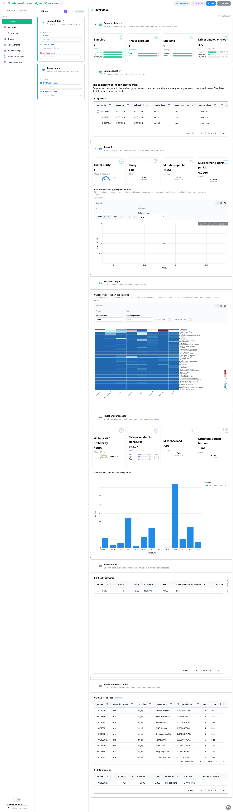
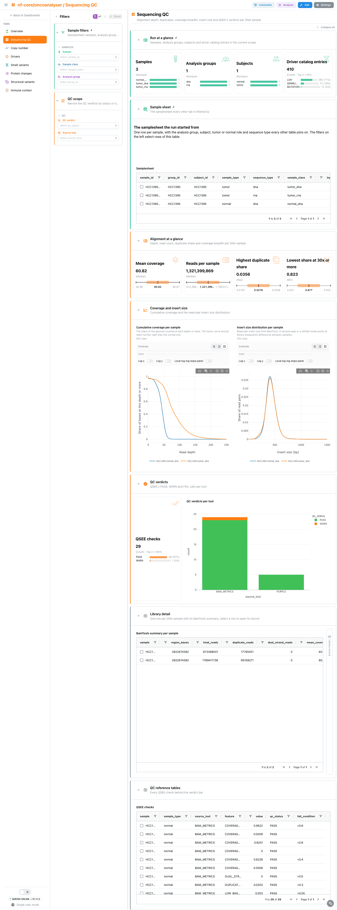
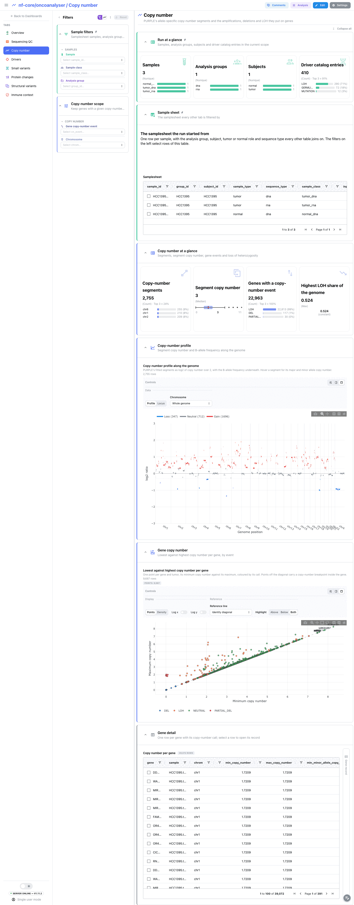
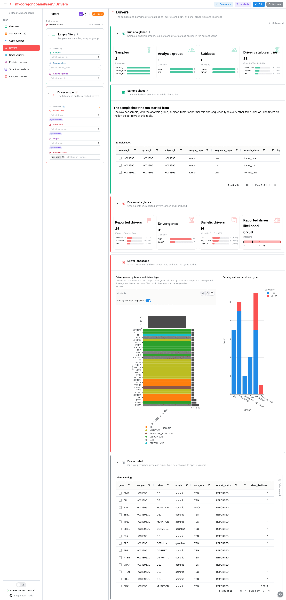
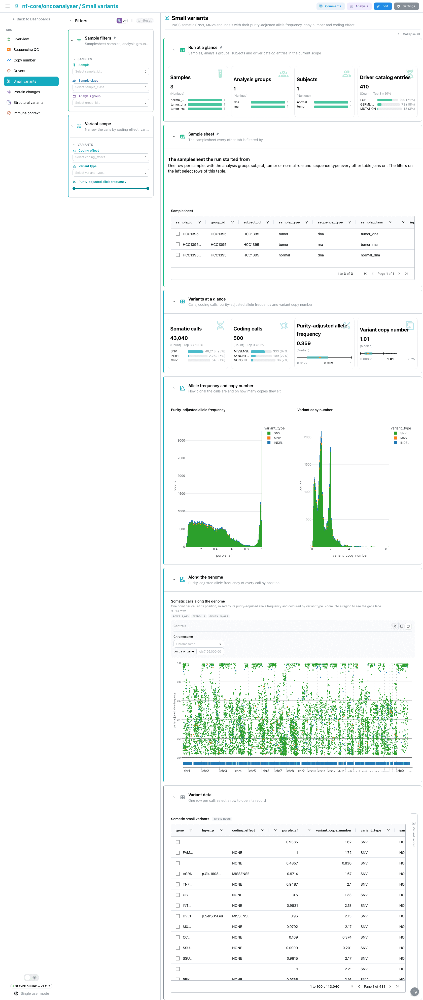
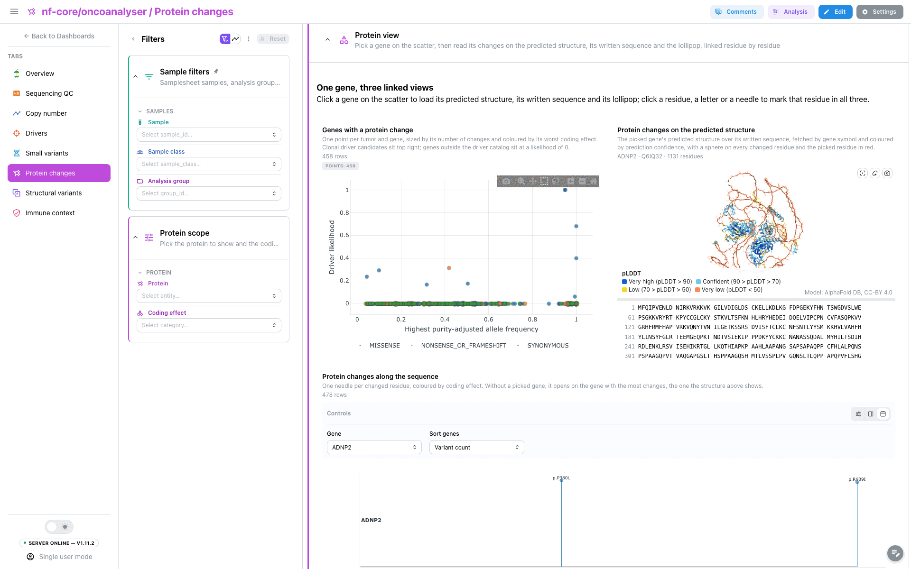
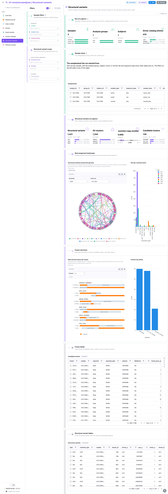
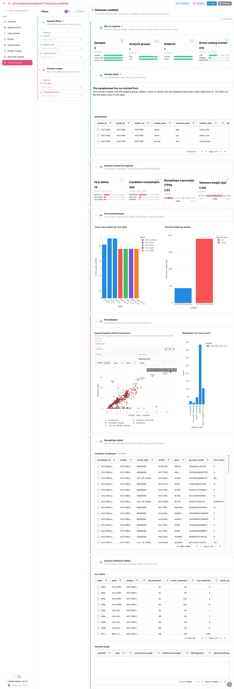

<div class="template-banner">
  <a class="template-banner-logo" href="https://nf-co.re/oncoanalyser" target="_blank" title="nf-core/oncoanalyser on nf-co.re">
    
    
  </a>
  <div class="template-banner-body">
    <h1 class="template-title">Cancer Genomics</h1>
    <p class="template-subtitle">The WiGiTS toolkit read tumor by tumor: purity and ploidy, sequencing QC, allele-specific copy number, the driver catalog, somatic small variants and their protein changes on a predicted structure, structural variants and fusions, tissue of origin, mutational processes and immune context.</p>
    <p class="template-links">
      <a href="https://nf-co.re/oncoanalyser" target="_blank"><i class="mdi mdi-open-in-new"></i> nf-co.re</a>
      <a href="https://github.com/nf-core/oncoanalyser" target="_blank"><i class="mdi mdi-github"></i> GitHub</a>
    </p>
  </div>
  <span class="template-status-draft template-banner-badge" data-tooltip="Draft: generated and not yet reviewed. Expect it to need fixes before it is usable."><i class="mdi mdi-pencil-outline"></i> Draft</span>
</div>

<div class="tpl-version-pick" data-latest="3.0.0">
  <span class="tpl-version-icon"><i class="mdi mdi-source-branch"></i></span>
  <span class="tpl-version-label">Template version</span>
  <select id="tpl-version" class="tpl-version-select" aria-label="Template version">
    <option value="3.0.0" selected>3.0.0</option>
  </select>
  <span class="tpl-version-badge">latest</span>
</div>

The oncoanalyser template reads the tables of the Hartwig Medical Foundation
WiGiTS toolkit (SAGE, PAVE, ESVEE, AMBER, COBALT, PURPLE, LINX and the tools
around them), where the unit is the tumor and, below it, the gene, the call and
the rearrangement:

- :material-view-dashboard-outline: **Overview**: purity, ploidy and tumor mutational burden, tissue of origin, HRD and mutational signatures
- :material-quality-high: **Sequencing QC**: depth, duplicates, coverage breadth, insert size and QSEE's verdicts per DNA sample
- :material-chart-timeline-variant: **Copy number**: PURPLE's allele-specific segments and the amplifications, deletions and LOH they put on genes
- :material-target: **Drivers**: the somatic and germline driver catalog by gene, driver type and likelihood
- :material-dna: **Small variants**: PASS somatic calls with their purity-adjusted allele frequency, copy number and coding effect
- :material-molecule: **Protein changes**: protein-changing calls along the protein and on its predicted 3D structure
- :material-vector-link: **Structural variants**: LINX's rearrangements, the events their clusters resolve to, and the fusions they create
- :material-shield-check-outline: **Immune context**: HLA alleles and their loss, candidate neoepitopes and telomere length

A `Run at a glance` strip (samples, analysis groups, subjects, driver catalog
entries), the collapsed `Sample sheet` and the `Sample filters` (sample, sample
class, analysis group) are pinned to every tab.

!!! info "No MultiQC report, no BAM read"
    nf-core/oncoanalyser writes no MultiQC parquet, so the landing tab is an
    Overview built from the tools' own tables. The template reads tables and
    small VCFs only: the alignments, which are almost all of a run's size, are
    never needed.

!!! warning "The Protein changes structure needs the structure resolver"
    The pipeline predicts no 3D structure. The structure tile looks the picked
    gene up by symbol through Depictio's [structure resolver](../../features/components.md#structure-resolver): UniProt (reviewed
    human entries) for its accession, then the AlphaFold DB model. What leaves
    the server is the gene symbol and the taxon id, sent to UniProt and EBI. The
    resolver is **off by default** and a server operator turns it on with
    `DEPICTIO_STRUCTURE_RESOLVER_ENABLED=true`; until then the tile shows its
    empty state and the lollipop and every other tile work. Only signed-in
    users can resolve a structure, and resolved models are cached in the
    deployment's bucket.

---

## :material-rocket-launch-outline: Quick start

=== "Point at a finished run"

    ```bash
    depictio run \
      --template nf-core/oncoanalyser/latest \
      --data-root /path/to/oncoanalyser_outdir
    ```

    `--data-root` is the pipeline outdir, with one `<group_id>/` directory per
    tumor, so a cohort run is several group directories side by side. The
    pipeline does not publish the samplesheet it ran on, and every filter reads
    it: copy it to `input/samplesheet.csv` under the data root, or name it:

    ```bash
    depictio run \
      --template nf-core/oncoanalyser/latest \
      --data-root /path/to/oncoanalyser_outdir \
      --var METADATA_FILE=/path/to/samplesheet.csv
    ```

    | Variable | Default | Role |
    |---|---|---|
    | `METADATA_FILE` | `{DATA_ROOT}/input/samplesheet.csv` | The samplesheet the run started from (`group_id`, `subject_id`, `sample_id`, `sample_type`, `sequence_type`, ...) |
    | `METADATA_ID_COL` | `sample_id` | Samplesheet id column, fixed by the pipeline |
    | `GROUP_COL` | `sample_class` | Column the dashboards group and filter samples by; `sample_class` joins `sample_type` and `sequence_type` (tumor or normal, DNA or RNA) |
    | `GENOME` | `hg38` | UCSC name of the assembly (`hg38` for `GRCh38_hmf`): the chord ring, the copy-number locus view and the genome view, which accept `hg38` and `mm10` only, so a GRCh37 run has no locus lanes yet |

=== "From the pipeline itself (v1.10.0+)"

    ```bash
    depictio-cli config nextflow --install     # once per machine
    nextflow run nf-core/oncoanalyser -r 3.0.0 -profile docker --outdir results
    ```

    No `depictio run`, and no template named: the pipeline ingests its own
    output directory when it finishes and resolves this template from its own
    manifest. See [Nextflow trigger](../../depictio-cli/nextflow-trigger.md).

---

## :material-book-open-variant: Reference

The template reads PURPLE's purity, copy-number, driver and somatic VCF outputs,
LINX's SV, cluster, fusion, breakend and driver tables, the BamTools metrics,
QSEE's status table, and the CUPPA, SIGS, CHORD, LILAC, TEAL and Neo outputs.
Tumor-level files are named after the tumor's `sample_id`, the key the sample
hub links on. Only PASS calls of the PURPLE VCF are kept, and PAVE's
canonical-transcript annotation gives each call its gene, effect and HGVS
change; the three-letter residues of each protein change are converted to a
residue number and one-letter amino acids. Gene copy-number events follow
PURPLE's own driver cut-offs.

!!! info "Self-adapting layout"
    The dashboard adapts to whatever the run actually produced: components bound
    to pruned or unparsed data collections are hidden, tabs left with no real
    visualizations are dropped entirely, and the remaining components are
    re-packed so there are no empty rows. CUPPA, SIGS, CHORD, LILAC, TEAL, Neo
    and QSEE are optional: a run that excludes one with `--processes_exclude`,
    or a targeted panel run that skips several, drops their tiles instead of
    failing to ingest.

<div class="tpl-version-block" data-version="3.0.0" markdown>

--8<-- "pipeline-templates/nf-core/_generated/oncoanalyser-latest.md"

</div>

---

## :material-view-dashboard-outline: Dashboard tabs

Eight tabs, read as a funnel: how pure and how mutated the tumor is, whether the
sequencing supports the calls, then copy number, drivers, small variants and
their effect on the protein, rearrangements, and the tumor's immune context.
Each tab below carries the **same icon and colour the dashboard gives it**.

=== ":material-view-dashboard-outline:{ .mc-teal } Overview"

    *How pure is each tumor, how mutated, and where does it come from?*

    [{ loading=lazy }](../../images/pipeline-templates/nf-core/oncoanalyser/overview_light.png){ .tpl-shot target="_blank" rel="noopener" }

    PURPLE's fit comes first: purity, ploidy, mutations per Mb and
    microsatellite indels per Mb, then purity against ploidy with one point per
    tumor. CUPPA's cancer-type probability per classifier reads as a heatmap.
    Mutational processes follow: CHORD's HRD probability, SNVs allocated to
    signatures, missense load and SV burden, with the share of SNVs per
    signature. The PURPLE fit table opens a linked **Tumor record** beside it.

    ??? abstract ":material-tune-variant: Filters and components"

        **Filters** · `Sample`, the sample class (`GROUP_COL`) and `Analysis
        group` on the sample hub, persistent and pinned to the top of every tab,
        plus `PURPLE fit status` and `CUPPA classifier` in the tab-local *Tumor
        scope*.

        | Section | What it holds |
        |---|---|
        | Run at a glance | 4 cards, pinned to every tab |
        | Sample sheet | *Samplesheet*, collapsed and pinned to every tab |
        | Tumor fit | 4 cards, *Purity against ploidy, one point per tumor* |
        | Tissue of origin | *Cancer-type probability per classifier* |
        | Mutational processes | 4 cards, *Share of SNVs per mutational signature* |
        | Tumor detail | *PURPLE fit per tumor*, *Tumor record* |
        | Tumor reference tables | *CUPPA probabilities*, *CHORD prediction*, collapsed |

=== ":material-quality-high:{ .mc-orange } Sequencing QC"

    *Does the sequencing support the calls?*

    [{ loading=lazy }](../../images/pipeline-templates/nf-core/oncoanalyser/sequencing_qc_light.png){ .tpl-shot target="_blank" rel="noopener" }

    BamTools' mean coverage, reads per sample, highest duplicate share and
    lowest share of the genome at 30x or more, then the cumulative coverage and
    insert-size curves per DNA sample side by side. QSEE's verdicts per source
    tool show PASS, WARN and FAIL at a glance. The BamTools summary opens a
    linked **Library record**.

    ??? abstract ":material-tune-variant: Filters and components"

        **Filters** · `QC verdict` and `Source tool` in the tab-local *QC
        scope*.

        | Section | What it holds |
        |---|---|
        | Alignment at a glance | 4 cards |
        | Coverage and insert size | *Cumulative coverage per sample*, *Insert size distribution per sample* |
        | QC verdicts | *QSEE checks*, *QC verdicts per tool* |
        | Library detail | *BamTools summary per sample*, *Library record* |
        | QC reference tables | *QSEE checks*, collapsed |

=== ":material-chart-timeline-variant:{ .mc-indigo } Copy number"

    *Which genes are amplified, deleted or lose an allele?*

    [{ loading=lazy }](../../images/pipeline-templates/nf-core/oncoanalyser/copy_number_light.png){ .tpl-shot target="_blank" rel="noopener" }

    PURPLE's copy-number profile along the genome draws the segments with their
    B-allele frequency, with a locus view to zoom in. Per gene, the lowest
    against the highest copy number, against the identity diagonal, separates
    whole-gene events from partial ones; a pick there or in the gene table
    opens a linked **Gene record** and narrows the driver catalog to that gene.

    ??? abstract ":material-tune-variant: Filters and components"

        **Filters** · `Gene copy-number event` and `Chromosome` in the tab-local
        *Copy-number scope*.

        | Section | What it holds |
        |---|---|
        | Copy number at a glance | 4 cards |
        | Copy-number profile | *Copy-number profile along the genome* |
        | Gene copy number | *Lowest against highest copy number per gene* |
        | Gene detail | *Copy number per gene*, *Gene record* |

=== ":material-target:{ .mc-red } Drivers"

    *Which genes drive the tumor, and how?*

    [{ loading=lazy }](../../images/pipeline-templates/nf-core/oncoanalyser/drivers_light.png){ .tpl-shot target="_blank" rel="noopener" }

    The PURPLE and LINX driver catalogs, somatic and germline, in one table. An
    oncoplot draws driver genes by tumor and driver type, beside the catalog
    entries per driver type. The tab opens on the reported drivers so the
    oncoplot stays readable on a whole-genome catalog; clearing the `Report
    status` filter adds the unreported entries. The driver table opens a linked
    **Driver record**, and a driver pick narrows the protein changes to its
    gene.

    ??? abstract ":material-tune-variant: Filters and components"

        **Filters** · `Driver type`, `Gene role`, `Origin` and `Report status`
        in the tab-local *Driver scope*.

        | Section | What it holds |
        |---|---|
        | Drivers at a glance | 4 cards |
        | Driver landscape | *Driver genes by tumor and driver type*, *Catalog entries per driver type* |
        | Driver detail | *Driver catalog*, *Driver record* |

=== ":material-dna:{ .mc-cyan } Small variants"

    *What did the tumor gain, at what clonality?*

    [{ loading=lazy }](../../images/pipeline-templates/nf-core/oncoanalyser/small_variants_light.png){ .tpl-shot target="_blank" rel="noopener" }

    PASS somatic SNVs, MNVs and indels: how many, how many coding, their
    purity-adjusted allele frequency and their variant copy number, then both
    distributions side by side. Every call is drawn along the genome over a
    gene lane, and the variant table opens a linked **Variant record**.

    ??? abstract ":material-tune-variant: Filters and components"

        **Filters** · `Coding effect`, `Variant type` and a `Purity-adjusted
        allele frequency` range in the tab-local *Variant scope*.

        | Section | What it holds |
        |---|---|
        | Variants at a glance | 4 cards |
        | Allele frequency and copy number | *Purity-adjusted allele frequency*, *Variant copy number* |
        | Along the genome | *Somatic calls along the genome* |
        | Variant detail | *Somatic small variants*, *Variant record* |

=== ":material-molecule:{ .mc-grape } Protein changes"

    *Where on the protein do the changes fall, and in which fold?*

    [{ loading=lazy }](../../images/pipeline-templates/nf-core/oncoanalyser/protein_changes_light.png){ .tpl-shot target="_blank" rel="noopener" }

    A scatter with one point per changed gene, its highest allele frequency
    against its driver likelihood and coloured by its worst coding effect, sits
    on one half of the section and the
    [3D structure tile](../../features/components.md#3d-structure)
    on the other: clicking a point loads that gene's predicted structure,
    coloured by prediction confidence, with every changed residue marked and
    the protein sequence written under it. The
    [lollipop](../../features/components.md#lollipop) of the same protein,
    full width below, draws one needle per changed residue coloured by coding
    effect. Clicking a needle, a residue in 3D or a letter of the sequence
    selects that residue in all three, drawn in red ball and stick. The
    protein change table opens a linked **Protein change record**.

    ??? abstract ":material-tune-variant: Filters and components"

        **Filters** · `Protein` and `Coding effect` in the tab-local *Protein
        scope*.

        | Section | What it holds |
        |---|---|
        | Protein changes at a glance | 4 cards |
        | Protein view | *Genes with a protein change*, *Protein changes on the predicted structure*, *Protein changes along the sequence* |
        | Protein change detail | *Protein changes*, *Protein change record* |

=== ":material-vector-link:{ .mc-violet } Structural variants"

    *How is the genome rearranged, and which fusions does it make?*

    [{ loading=lazy }](../../images/pipeline-templates/nf-core/oncoanalyser/structural_variants_light.png){ .tpl-shot target="_blank" rel="noopener" }

    A chord diagram draws one chord per SV between its two breakends, coloured
    by the event LINX resolved its cluster to and weighted by junction copy
    number, beside the SVs per resolved event. Each candidate fusion is drawn
    as the exons it keeps and loses along the fused transcript, beside the
    fusions per phase. The fusion table opens a linked **Fusion record**; the
    SV table is collapsed at the end.

    ??? abstract ":material-tune-variant: Filters and components"

        **Filters** · `Resolved event`, `SV type` and `Fusion phase` in the
        tab-local *Structural variant scope*.

        | Section | What it holds |
        |---|---|
        | Structural variants at a glance | 4 cards |
        | Rearrangement landscape | *Structural variants around the genome*, *SVs per resolved event* |
        | Fusion structure | *Kept and lost exons per fusion*, *Fusions per phase* |
        | Fusion detail | *Candidate fusions*, *Fusion record* |
        | Structural variant tables | *Structural variants*, collapsed |

=== ":material-shield-check-outline:{ .mc-pink } Immune context"

    *Can the immune system still see the tumor?*

    [{ loading=lazy }](../../images/pipeline-templates/nf-core/oncoanalyser/immune_context_light.png){ .tpl-shot target="_blank" rel="noopener" }

    LILAC's HLA alleles with their tumor copy number, where a lost allele hides
    its peptides, beside TEAL's telomere length per sample. Neo's candidate
    neoepitopes are drawn as expected against effective expression and counted
    per source event; the neoepitope table opens a linked **Neoepitope record**.
    The allele and telomere tables are collapsed at the end.

    ??? abstract ":material-tune-variant: Filters and components"

        **Filters** · `HLA gene` and `Neoepitope source` in the tab-local
        *Immune scope*.

        | Section | What it holds |
        |---|---|
        | Immune context at a glance | 4 cards |
        | HLA and telomeres | *Tumor copy number per HLA allele*, *Telomere length per sample* |
        | Neoepitopes | *Expected against effective expression*, *Neoepitopes per source event* |
        | Neoepitope detail | *Candidate neoepitopes*, *Neoepitope record* |
        | Immune reference tables | *HLA alleles*, *Telomere length*, collapsed |

Tables and point views select on their entity column: the sample sheet on
`sample_id`, which the links carry to every collection's sample column, the
tumor scatter on the tumor, the gene scatter and gene table on the gene, the
chord diagram on the SV and the neoepitope scatter on the neoepitope. A driver
pick narrows the protein changes to its gene, and a gene picked on the Copy
number tab narrows the driver catalog. Each record card sits beside the table
that drives it and opens on the selected row.

---

## :material-play-circle-outline: Running the pipeline

Depictio reads the **output** of nf-core/oncoanalyser, it does not run the
pipeline. Run the pipeline first, whole-genome and transcriptome mode on the
Hartwig GRCh38 reference:

```bash
nextflow run nf-core/oncoanalyser -r 3.0.0 \
  --input samplesheet.csv \
  --mode wgts \
  --genome GRCh38_hmf \
  --outdir results -profile docker
```

Keep a copy of `samplesheet.csv`: the pipeline does not publish it, and the
template reads it. `--mode targeted` runs work too, with the tools a panel run
skips left out of the dashboard. Then point Depictio at the results:

```bash
depictio run --template nf-core/oncoanalyser/latest --data-root results/ \
  --var METADATA_FILE=samplesheet.csv
```

See [nf-co.re/oncoanalyser/usage](https://nf-co.re/oncoanalyser/3.0.0/docs/usage) for full pipeline documentation.

---

## :material-folder-open-outline: Required data structure

Point `--data-root` at the pipeline outdir. Depictio scans recursively and
matches on file name, so one group directory or many are read the same way.

```text
<DATA_ROOT>/
├── input/samplesheet.csv                      # not published: copy the run's sheet here (METADATA_FILE)
├── pipeline_info/
│   ├── params_*.json
│   └── *software*versions*.yml
└── <group_id>/                                # one per tumor
    ├── purple/*.purple.{purity.tsv,qc,cnv.somatic.tsv,cnv.gene.tsv,somatic.vcf.gz}
    ├── purple/*.purple.driver.catalog.*.tsv
    ├── linx/somatic_annotations/*.linx.{svs,clusters,fusion,breakend,driver.catalog}.tsv
    ├── linx/germline_annotations/*.linx.germline.driver.catalog.tsv
    ├── bamtools/<sample>/*.bam_metric.{summary,coverage,frag_length}.tsv
    ├── qsee/*.qsee.status.tsv.gz              # optional
    ├── cuppa/*.cuppa.vis_data.tsv             # optional
    ├── sigs/*.sig.allocation.tsv              # optional
    ├── chord/*.chord.prediction.tsv           # optional
    ├── lilac/*.lilac.tsv                      # optional
    ├── teal/*.teal.tellength.tsv              # optional
    └── neo/scorer/*.neo.neoepitope.tsv        # optional
```

No BAM, CRAM or MultiQC report is read. LINX's protein-domain plot table is in
genomic coordinates with no coding offset, so it is not mapped onto residues;
the virus tables, Isofox, PEACH, CIDER and ORANGE are not read yet.

---

## :material-flask-outline: Validation runs

The template was validated against the AWS megatest of the 3.0.0 release,
`results-7c74c87a43749952b38c9a18915947570f0595a0`, on its `test_full` profile:
one whole-genome and transcriptome subject, a tumor/normal DNA pair plus tumor
RNA, through the full toolkit on GRCh38. The run is 272 GB, almost all of it
alignments; `megatest.yaml` selects 29 tables and small VCFs, about 33 MB. The
pipeline does not publish its samplesheet, so the template ships the
`test_full` sheet under `input/` and the download script copies it in. The
screenshots above come from that run. A single case is what keeps the template
a Draft: the cohort views (oncoplot, purity against ploidy) have only ever held
one tumor.

```bash
DEST=/tmp/oncoanalyser_test
bash depictio/projects/nf-core/oncoanalyser/3.0.0/download_test_data.sh "$DEST"
depictio run --template nf-core/oncoanalyser/latest --data-root "$DEST"
```

The Protein changes structure needs the resolver enabled on the server you
ingest into.

Do not pass `--project-name` when ingesting: the dashboard is attached to the
project by name, so renaming it breaks a later `depictio dashboard import`.
Re-ingesting accumulates dashboards, so delete the project before repeating a run.

---

## :material-link-variant: Additional resources

- [nf-co.re/oncoanalyser](https://nf-co.re/oncoanalyser): official pipeline documentation
- [nf-co.re/oncoanalyser/3.0.0/results](https://nf-co.re/oncoanalyser/3.0.0/results): AWS test results
- [Template System Reference](../../usage/projects/templates.md): YAML format, variables, conditionals
- [Recipes](../../usage/projects/recipes.md): how to read, test, and write recipes

---

## :material-account-group-outline: Authorship

<div class="tpl-credits">
  <div class="tpl-credit">
    <span class="tpl-credit-role"><i class="mdi mdi-code-braces"></i> Developers</span>
    <span class="tpl-credit-note">Wrote the template, its recipes and its dashboards.</span>
    <a class="tpl-person" href="https://github.com/weber8thomas" target="_blank" rel="noopener">
       weber8thomas
    </a>
  </div>
  <div class="tpl-credit">
    <span class="tpl-credit-role"><i class="mdi mdi-eye-check-outline"></i> Reviewers</span>
    <span class="tpl-credit-note">Nobody has run it on their own data and signed it off yet, which is what keeps it a Draft.</span>
    <span class="tpl-person"><i class="mdi mdi-account-plus-outline"></i> Open</span>
  </div>
  <div class="tpl-credit">
    <span class="tpl-credit-role"><i class="mdi mdi-wrench-outline"></i> Maintainers</span>
    <span class="tpl-credit-note">Keep it working as nf-core/oncoanalyser releases.</span>
    <a class="tpl-person" href="https://github.com/weber8thomas" target="_blank" rel="noopener">
       weber8thomas
    </a>
  </div>
</div>

Reviewing a template on your own data, or taking over a role here, is a
contribution in itself: the [contributing guide](../../developer/contributing-templates.md)
says what each one involves.
